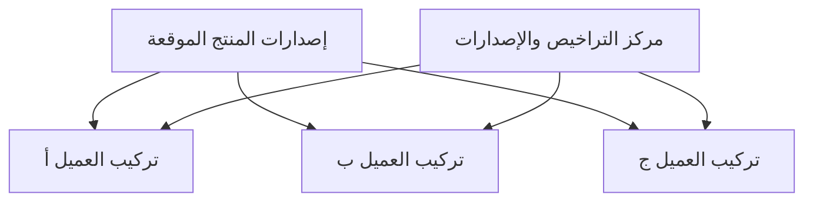
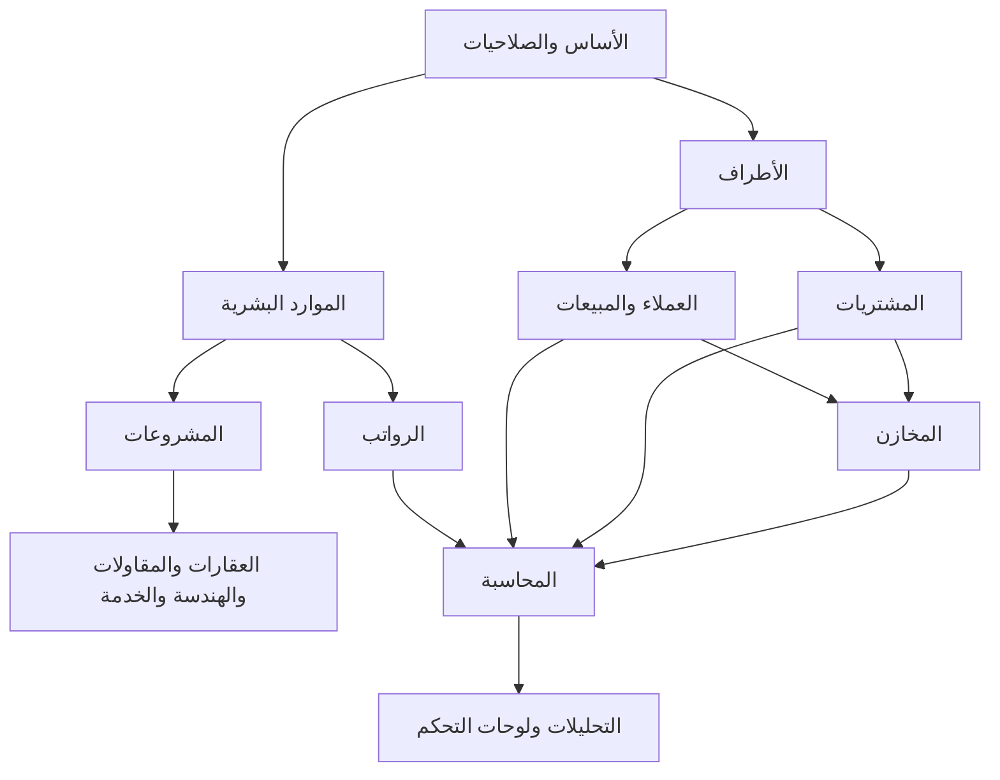

<div dir="rtl" align="right" lang="ar">

# <span dir="rtl">منصة إدارة موارد الشركات الشاملة</span>

## <span dir="rtl">وثيقة متطلبات المنتج وبنية قاعدة البيانات ومخططات العلاقات — النسخة العربية</span>

> **حالة الوثيقة:** خط أساس كامل للمنتج للمراجعة  
> **نسخة الوثيقة:** العربية الكاملة من اليمين إلى اليسار  
> **الإصدار:** 2.0  
> **آخر تحديث:** 2026-07-22  
> **قاعدة البيانات الأساسية:** PostgreSQL  
> **نموذج التشغيل:** نسخة مستقلة لكل عميل على خادم يوفّره العميل  
> **نموذج البيانات:** يدعم مجموعة شركات وكيانات قانونية متعددة وفروعًا مستقلة تشغيليًا  
> **اللغات:** العربية كاملة من اليمين إلى اليسار والإنجليزية كاملة من اليسار إلى اليمين  
> **الدول:** نواة عامة لأي دولة مع حزم قوانين محلية قابلة للتركيب  

### <span dir="rtl">قاعدة اللغة والتسمية</span>

- جميع النصوص الوظيفية والشرح والواجهات والقوائم والتقارير العربية تكون عربية سليمة.
- الواجهة العربية تعمل بالكامل من اليمين إلى اليسار.
- الواجهة الإنجليزية تعمل بالكامل من اليسار إلى اليمين.
- أسماء قواعد البيانات ومخططاتها المنطقية وجداولها وحقولها وقيودها وأحداثها وصلاحياتها ومسارات واجهات البرمجة تظل إنجليزية.
- لا تُنشأ جداول عربية أو أعمدة بأسماء عربية.
- البيانات المرجعية القابلة للترجمة تستخدم `localization.entity_translations`.
- قوالب المستندات يمكن أن تكون عربية أو إنجليزية أو ثنائية اللغة.

---

## <span dir="rtl">ع١. القرارات الأساسية المعتمدة</span>

| القرار | المجال |
|---:|---:|
| منتج موحّد بإصدارات موحّدة، وتُركّب نسخة مستقلة لكل عميل | نموذج المنتج |
| خادم وتطبيق وقاعدة وملفات وأسرار ونسخ احتياطية ودومين مستقل لكل عميل | عزل العملاء |
| يمكن للنسخة الواحدة إدارة شركة واحدة أو مجموعة شركات قانونية | الكيانات القانونية |
| كل فرع وحدة تشغيل مستقلة بموارده وصلاحياته وحركاته ومؤشراته | الفروع |
| تعرض أي فرع منفردًا أو عدة فروع أو الشركة أو المجموعة كاملة | الإدارة العليا |
| تطبيق موحّد مقسّم إلى وحدات واضحة مع عمّال للمهام الخلفية | البنية البرمجية |
| قيد مزدوج على أساس الاستحقاق | المحاسبة |
| محرك عام مع حزم قوانين وإعدادات حسب الدولة وتاريخ السريان | الرواتب والقوانين |
| عملة أساس قابلة للضبط لكل كيان مع دعم العملات المتعددة | العملة |
| تخزين بالتوقيت العالمي المنسق وعرض حسب منطقة المستخدم أو الفرع أو الكيان | الوقت |
| تخزين ملفات خاص، وقاعدة البيانات تحفظ البيانات الوصفية والمفتاح الآمن والبصمة | الملفات |
| المستندات المرحلة لا تعدّل بصمت؛ التصحيح بعكس أو تسوية أو إصدار جديد | التصحيح |
| إعدادات وحزم سياسات وحقول وسير موافقات ومؤشرات وقوالب دون تفريع الكود | التخصيص |
| يمكن تشغيل عدة أنشطة ووحدات صناعية معًا داخل نفس الشركة | الوحدات |
| معرّف فريد عالمي داخلي ورقم مستند مقروء مستقل | المعرّفات |

---

## <span dir="rtl">ع٢. نموذج المنتج والتركيب</span>

### <span dir="rtl">ع٢.١ المصطلحات</span>

| المعنى | المصطلح |
|---:|---:|
| الجهة التي تشتري النسخة وتوفر الخادم | العميل |
| نسخة معزولة واحدة تعمل على خادم العميل | التركيب |
| شركة مسجلة لها دفاترها وضرائبها وفتراتها وعملة أساسها | الكيان القانوني |
| وحدة تشغيل مستقلة داخل كيان قانوني | الفرع |
| الاسم التقني للكيان القانوني في `core.organizations` | المؤسسة |
| قاعدة منفصلة عند مقدم المنتج لحالة التركيبات والإصدارات والتراخيص فقط | مركز تحكم المنتج |
| قاعدة PostgreSQL الخاصة بالعميل وفيها بياناته التشغيلية | قاعدة الأعمال |

### <span dir="rtl">ع٢.٢ حدود العزل</span>

| قاعدة العزل | المورد |
|---:|---:|
| عمليات أو حاويات مستقلة للعميل | التطبيق |
| قاعدة أو مثيل مستقل للتركيب | PostgreSQL |
| مساحة أو حاوية تخزين مستقلة ومشفّرة | الملفات |
| مفاتيح وبيانات اعتماد مختلفة لكل عميل | الأسرار |
| دومين أو نطاق فرعي مخصص وشهادة اتصال مشفّر | الدومين |
| سياسة ونسخ واستعادة مستقلة | النسخ الاحتياطي |
| صحة الخدمات والإصدار دون إرسال بيانات الموظفين أو الماليات | المراقبة |
| مؤقت وموافق عليه وبأقل صلاحية ومسجّل بالكامل | دخول الدعم |

<div dir="ltr" align="center">



</div>

### <span dir="rtl">ع٢.٣ مكونات تركيب العميل</span>

- بوابة عكسية ودومين وشهادة اتصال مشفّر.
- واجهة الويب وواجهة برمجة التطبيقات.
- قاعدة PostgreSQL غير مكشوفة للإنترنت.
- عمّال للمهام المجدولة والثقيلة.
- تخزين ملفات خاص.
- نسخ احتياطي واستعادة ومراقبة وتنبيهات.
- إعدادات وأسرار منفصلة.
- مسار تحديث يراجع النسخة الاحتياطية ويشغّل ترحيلات قاعدة البيانات واختبارات السلامة.

### <span dir="rtl">ع٢.٤ مركز تحكم المنتج</span>

يحفظ فقط:

```text
customers
deployments
deployment_domains
licenses
product_releases
deployment_release_history
health_check_events
support_access_grants
```

ولا يحفظ رواتب أو قيودًا أو فواتير أو موظفين أو مستندات داخلية للعملاء.

---

## <span dir="rtl">ع٣. نموذج استقلال الفروع</span>

كل فرع يعمل كوحدة مستقلة داخل الكيان القانوني، مع بقاء رؤية مجمّعة للإدارة العليا.

| استقلال الفرع | المجال |
|---:|---:|
| صلاحيات ونطاقات وصول خاصة بالفرع | المستخدمون |
| تعيين أساسي للفرع وإعارة أو نقل مضبوط بين الفروع | الموظفون |
| عملاء محتملون وعروض وطلبات وتسليم وفواتير ومرتجعات وأهداف | المبيعات |
| طلبات وموافقات وأوامر واستلام وفواتير مورد وحدود صرف | المشتريات |
| مخزن أو أكثر ومواقع وجرد وحجز ومخزون في الطريق | المخازن |
| خزائن وحسابات يومية وحدود دفع وإقفال مستقل | الخزائن |
| مشروعات يملكها الفرع ومشروعات مشتركة بعلاقة صريحة | المشروعات |
| موظفون وحضور وإجازات وتكلفة رواتب ومؤشرات مستقلة | الموارد البشرية |
| مساحات عمل وطوابير أقسام واتفاقيات خدمة وتصعيد | المهام |
| عهد وأجهزة وتذاكر وتراخيص وصيانة | الأصول وتقنية المعلومات |
| موازنة وتوقع والتزام ومقارنة فعلي | الموازنات |
| لوحة فرع كاملة ومقارنة وتجميع من الإدارة العليا | التحليلات |

### <span dir="rtl">ع٣.١ ملكية البيانات</span>

- كل حركة تشغيلية مملوكة لفرع تحمل `branch_id`.
- كل حركة مالية تحمل `organization_id`، وتحمل `branch_id` عندما تكون مملوكة لفرع.
- البيانات المشتركة مثل كتالوج الأصناف والسياسات يمكن إدارتها مركزيًا وتتاح للفروع بصلاحيات.
- لا يُسمح لمستخدم فرع باستنتاج بيانات فرع آخر من الإجماليات أو البحث أو التصدير أو واجهة البرمجة.
- الأرقام التسلسلية يمكن أن تكون مستقلة حسب الفرع ونوع المستند والسنة.

### <span dir="rtl">ع٣.٢ الحركات بين الفروع</span>

كل عملية بين فرعين تنشئ طرف مصدر وطرف وجهة وحالات واضحة:

- نقل مخزون ومرحلة مخزون في الطريق.
- تحويل نقدي وإثبات صرف ثم استلام.
- نقل موظف أو إعارة مؤقتة.
- نقل عهدة أو أصل أو جهاز.
- مشاركة موارد في مشروع.
- تحميل خدمة أو تكلفة بين الفروع.
- إحالة مهمة أو مستند أو طلب.

لا تُعدّل الأرصدة مباشرة، ويُسجّل الطلب والموافقة والإرسال والاستلام والفروق والإلغاء والأثر المحاسبي.

---

## <span dir="rtl">ع٤. اللغات والتوطين والدول</span>

### <span dir="rtl">ع٤.١ اللغتان</span>

- لغة افتراضية للمنشأة ولغة مفضلة لكل مستخدم.
- اتجاه كامل من اليمين إلى اليسار للعربية ومن اليسار إلى اليمين للإنجليزية.
- مفاتيح ترجمة ثابتة للنظام بدل كتابة النص داخل الكود.
- ترجمة الأسماء والأوصاف المرجعية من خلال `localization.entity_translations`.
- بحث عربي مع معالجة اختلافات الحروف، وبحث إنجليزي، ودعم النص المختلط.
- قوالب مستندات وتقارير وتصدير عربية وإنجليزية وثنائية اللغة.
- دعم صحيح للنص المختلط داخل ملفات المستندات وجداول البيانات والإشعارات.

### <span dir="rtl">ع٤.٢ حزم الدول</span>

النواة لا تفترض دولة بعينها. حزمة الدولة تحدد:

- الضرائب والنسب والإعفاء والحجز والتقارير.
- الرواتب والتأمينات والتقاعد والإجازات ونهاية الخدمة.
- الفاتورة الإلكترونية والتقارير الرقمية إن وجدت.
- المعرّفات الرسمية والتحقق منها.
- صيغ البنوك والمدفوعات.
- العناوين والتقويم والعطلات وأسبوع العمل.
- مدد الاحتفاظ والخصوصية والموافقات القانونية.
- قوالب التقارير والمستندات الرسمية.

كل إصدار من حزمة الدولة مؤرخ ومختبر وموقع ويُفعّل صراحة لكل كيان قانوني.

---

## <span dir="rtl">ع٥. الوحدات الموحّدة</span>

| المسؤولية | الوحدة |
|---:|---:|
| هوية التركيب والإصدارات والخصائص والمهام والتكاملات | النظام |
| الكيانات والفروع والإدارات والوظائف والعملات ومراكز التكلفة | الأساس |
| المستخدمون والأدوار والصلاحيات ونطاق البيانات | المستخدمون والصلاحيات |
| العملاء والموردون والمقاولون والجهات والبنوك | الأطراف |
| مساحات العمل والطوابير والمهام والتكرار والتبعيات واتفاقيات الخدمة | المهام |
| العملاء المحتملون والفرص والأنشطة والعروض ومسار البيع | إدارة العملاء |
| التسعير والطلبات والتسليم والفواتير والمرتجعات والعمولات | المبيعات |
| الأصناف والوحدات والباركود والمخازن والحركات والحجز والجرد والتقييم | الكتالوج والمخازن |
| الطلب والعروض وأمر الشراء والاستلام والمطابقة وفاتورة المورد | المشتريات |
| الموظفون والعقود والتعيينات والحضور والإجازات والمواهب | الموارد البشرية |
| الأجور والمدخلات والمسيرات والمفردات والقروض والصرف | الرواتب |
| الهيكل والمهام والوقت والموازنة والفوترة والربحية | المشروعات |
| الحسابات والضرائب والقيود والفترات والتسويات والإقفال | المالية |
| النقد والبنوك والتحويلات والكشوف والمطابقة | الخزينة |
| الأصل والعهدة والحركة والإهلاك والاستبعاد | الأصول |
| العقارات والوحدات والحجز والبيع والتقسيط والإيجار والتسليم | العقارات |
| المناقصات والتقدير وجداول الكميات والمواقع والمقاولين والمستخلصات والاحتجاز | المقاولات |
| التخصصات والمخرجات والمراجعات والمراسلات وطلبات المعلومات والتقديمات الفنية | الهندسة |
| المجلدات والإصدارات والقوالب والصلاحيات والإقرار والاحتفاظ | المستندات |
| الطلبات والحوادث والتغييرات والأصول والتراخيص والوصول والأمن | تقنية المعلومات |
| التفتيش وعدم المطابقة والإجراءات والحوادث والتصاريح والمخاطر | الجودة والسلامة |
| المركبات والمعدات والعداد والوقود والصيانة والاستغلال | الأسطول والمعدات |
| العقود وأوامر العمل والفنيون والزيارات والقطع والفوترة | الخدمة والصيانة |
| قوائم المواد والمسارات وأوامر الإنتاج والخامات والجودة والتكلفة | التصنيع |
| الحالات والشكاوى والقنوات والتصعيد والرضا والمعرفة | خدمة العملاء |
| العروض الموحّدة ولوحات التحكم ومؤشرات الأداء والتنبيهات والتصدير | التحليلات |

### <span dir="rtl">ع٥.١ تفعيل الوحدات</span>

- تُفعّل الوحدات حسب الترخيص وإعداد الشركة.
- يمكن تشغيل عدة أنشطة معًا داخل نفس النسخة.
- إيقاف وحدة لا يحذف بياناتها.
- التبعيات بين الوحدات معلنة ومختبرة.
- الكيانات المشتركة لا تتكرر بين الأنشطة.
- القوائم والصلاحيات والموافقات والتقارير تتغير حسب الوحدات المفعلة.
- يمكن للفرع تشغيل نطاق أضيق من الوحدات إذا سمحت سياسة الشركة.

<div dir="ltr" align="center">



</div>

---

## <span dir="rtl">ع٦. مبادئ معمارية حاكمة</span>

1. المستند التشغيلي يصف الحدث.
2. القيد المحاسبي يثبت الأثر المالي بعد الاعتماد والترحيل.
3. لوحة التحكم تقرأ من المصدر ولا تصبح مصدر حقيقة منفصلًا.
4. المستندات المرحلة والرواتب المعتمدة والمراجعات الفنية تحفظ تاريخها ولا تُستبدل بصمت.
5. كل قاعدة حساب أو ضريبة أو راتب أو صلاحية لها تاريخ سريان.
6. كل عملية حرجة قابلة لإعادة المحاولة دون تكرار الأثر.
7. كل وحدة تملك جداولها وتنشر أحداثًا منضبطة للوحدات الأخرى.
8. البداية تطبيق موحّد مقسّم منطقيًا، ولا تُفصل خدمات مستقلة إلا عند وجود حاجة مقاسة.

### <span dir="rtl">ع٦.١ مصادر الحقيقة</span>

| مصدر الحقيقة | السؤال |
|---:|---:|
| `hr.employee_assignments` | فرع الموظف ومديره في تاريخ سابق |
| `payroll.payslips` و`payroll.payslip_lines` | راتب فترة سابقة |
| `accounting.journal_lines` المرحلة | الإيراد والمصروف والربح |
| مستندات البيع والتخصيصات مع مطابقة حساب العملاء | رصيد العميل |
| مستندات المورد والتخصيصات مع مطابقة حساب الموردين | رصيد المورد |
| دفتر `inventory.inventory_transaction_lines` | رصيد المخزون |
| مجموع حركات `hr.leave_ledger` | رصيد الإجازة |
| القيود الموسومة بالمشروع مع الوقت والموازنة | ربحية المشروع |
| `work.tasks` وسجل حالاتها | حالة المهمة |
| `engineering.deliverable_revisions` و`dms.dms_document_versions` | الإصدار الفني الصحيح |

---

## <span dir="rtl">ع٧. إدارة المهام والأقسام</span>

وحدة المهام مشتركة بين جميع الأقسام والوحدات. يمكن إنشاء المهمة يدويًا أو تلقائيًا من فاتورة أو عميل محتمل أو مشروع أو فحص أو حادثة تقنية أو طلب صيانة أو شكوى أو مستند.

### <span dir="rtl">الكيانات الأساسية</span>

```text
work.workspaces
work.work_queues
work.tasks
work.task_assignees
work.task_dependencies
work.task_checklist_items
work.task_time_entries
work.task_status_history
work.task_watchers
work.sla_policies
work.recurring_task_rules
```

### <span dir="rtl">المتطلبات</span>

- عرض قائمة ولوحة وتقويم وخط زمني وحمل عمل وطابور قسم.
- مسؤول أساسي ومشاركون ومراقبون.
- أولوية وخطورة وتصنيفات ومهام فرعية وقوائم تحقق وتبعيات.
- مرفقات وتعليقات وإشارات وسجل كامل.
- مهام دورية وتوليد تلقائي من الأحداث.
- اتفاقيات خدمة حسب تقويم عمل الفرع مع إيقاف وتصعيد واختراق.
- شروط قبول وأدلة إلزامية وفحص جودة.
- وقت مخطط وفعلي وقابل للفوترة.
- تصعيد للمدير أو مدير الفرع أو رئيس القسم أو الإدارة العليا.
- إعادة توزيع جماعية عند الإجازة أو النقل أو إنهاء الخدمة.

### <span dir="rtl">التحليلات</span>

- المفتوح والمنتهي والمتأخر والمتوقف والمخترق لاتفاقية الخدمة.
- زمن الدورة والاستجابة والحل وإعادة الفتح.
- الحمل حسب الفرع والقسم والطابور والدور والموظف والمشروع.
- الجهد المخطط مقابل الفعلي.
- التزام المهام الدورية.
- الاختناقات والتبعيات وأداء الأقسام.

---

## <span dir="rtl">ع٨. إدارة العملاء والمبيعات</span>

### <span dir="rtl">دورة العمل</span>

عميل محتمل ← تأهيل ← فرصة ← نشاط ومتابعة ← عرض سعر بإصدارات ← موافقة خصم ← طلب بيع ← حجز مخزون أو سعة ← تسليم جزئي أو كامل ← فاتورة ← تحصيل ← مرتجع أو إشعار دائن عند الحاجة.

### <span dir="rtl">الكيانات الأساسية</span>

```text
crm.lead_sources
crm.leads
crm.opportunities
crm.crm_activities
crm.campaigns
sales.price_lists
sales.price_list_lines
sales.sales_quotations
sales.sales_quotation_lines
sales.sales_orders
sales.sales_order_lines
sales.delivery_orders
sales.delivery_order_lines
sales.sales_invoices
sales.sales_invoice_lines
sales.sales_returns
sales.sales_return_lines
sales.cash_receipts
sales.receipt_allocations
sales.sales_targets
sales.sales_commissions
```

### <span dir="rtl">المتطلبات</span>

- منع تكرار العميل المحتمل بقواعد مطابقة قابلة للضبط.
- مراحل فرصة وحقول إلزامية واحتمال وسبب خسارة.
- أنشطة اتصال واجتماع وزيارة ورسالة ومتابعة.
- عروض متعددة الإصدارات والبدائل والشروط والضرائب والقوالب ثنائية اللغة.
- حدود خصم وموافقات حسب المستخدم والفرع والقيمة.
- قوائم أسعار حسب العملة والفرع ومجموعة العميل والكمية والفترة.
- طلب بيع يدعم الخدمة والمادة والعقار والمشروع والاشتراك.
- حالات مستقلة للتجهيز والتسليم والفوترة والتحصيل.
- تسليم جزئي وطلب مؤجل وإلغاء واستبدال ومرتجع وإشعار دائن.
- عمولة بإصدارات وشروط استحقاق وعكس واعتماد وصرف.

### <span dir="rtl">لوحات التحكم</span>

- جودة المصادر وقمع التحويل وقيمة الفرص والتوقع المرجح وعمر المرحلة.
- معدل فوز العروض وتسريب الخصم والطلبات المتأخرة وأداء التسليم والمرتجعات.
- الإيراد والهامش والتحصيل والهدف والعمولات.
- تحليل حسب الفرع والبائع والفريق والعميل والصنف والفئة والمشروع والقناة.

---

## <span dir="rtl">ع٩. الكتالوج والمخازن</span>

### <span dir="rtl">الكيانات الأساسية</span>

```text
catalog.item_categories
catalog.catalog_items
catalog.item_units
catalog.item_variants
catalog.item_barcodes
inventory.warehouses
inventory.warehouse_locations
inventory.inventory_transactions
inventory.inventory_transaction_lines
inventory.stock_lots
inventory.stock_serials
inventory.stock_reservations
inventory.stock_transfers
inventory.stock_transfer_lines
inventory.stock_counts
inventory.stock_count_lines
inventory.inventory_cost_layers
```

### <span dir="rtl">نموذج الصنف</span>

- مادة مخزنية.
- مادة غير مخزنية.
- خدمة.
- أصل.
- مصروف.
- صنف للإيجار.
- صنف مصنع.
- متغيرات ووحدات وباركود وخصائص.
- تتبع دفعة أو رقم تسلسلي أو صلاحية حسب الصنف.

### <span dir="rtl">العمليات</span>

- استلام وفحص وإدخال موقع.
- حجز وفك حجز وتخصيص.
- صرف وبيع واستهلاك مشروع وإرجاع.
- نقل داخل المخزن وبين المخازن وبين الفروع مع مخزون في الطريق.
- حجر جودة وتالف ومنتهي ومرتجع وأمانة.
- جرد شامل ودوري ومفاجئ وأعمى وإعادة عد.
- تسوية فروق بعد الموافقة.
- حد إعادة طلب وحد أمان وتوقع طلب.

### <span dir="rtl">القواعد</span>

- الرصيد مشتق من دفتر حركة غير قابل للتعديل.
- المتاح = الموجود - الحجز الصحيح - الحجز النظامي.
- المخزون السالب ممنوع افتراضيًا.
- تكلفة المخزون بإحدى الطرق المسموحة والمضبوطة.
- كل تحويل بين فرعين يسجل المطلوب والموافق والمرسل والمستلم والفروق.
- المحاسبة تسجل الاستلام والصرف والتسوية وتكلفة المبيعات والبضاعة المستلمة غير المفوترة.

### <span dir="rtl">التحليلات</span>

- الموجود والمتاح والمحجوز وفي الطريق والمحجور والتالف والمنتهي.
- القيمة حسب الفرع والمخزن والفئة والصنف والدفعة.
- خطر النفاد والتغطية والزيادة والبطء والركود.
- دقة الجرد وفروق النقل والانكماش والهالك.
- مدة التوريد وسرعة البيع والهامش ودوران المخزون.

---

## <span dir="rtl">ع١٠. المشتريات والتوريد والمصروفات</span>

### <span dir="rtl">دورة التوريد</span>

طلب شراء ← موافقة ← طلب عروض موردين ← مقارنة وعطاء ← اختيار مورد ← أمر شراء ← استلام وفحص ← مطابقة ثنائية أو ثلاثية ← فاتورة مورد ← اعتماد وترحيل ← دفع وتخصيص.

### <span dir="rtl">الكيانات الأساسية</span>

```text
procurement.purchase_requisitions
procurement.purchase_requisition_lines
procurement.supplier_quote_requests
procurement.supplier_quotations
procurement.supplier_quotation_lines
procurement.bid_comparisons
procurement.purchase_orders
procurement.purchase_order_lines
procurement.goods_receipts
procurement.goods_receipt_lines
procurement.vendor_bills
procurement.vendor_bill_lines
procurement.supplier_payments
procurement.supplier_payment_allocations
expense.expense_claims
expense.expense_claim_items
```

### <span dir="rtl">المتطلبات</span>

- طلب من فرع وقسم ومشروع ومركز تكلفة وموازنة.
- تحديد احتياج وتاريخ ومواصفات ومستندات وأولوية.
- دعوة عدة موردين وتسجيل عروض وإصدارات وشروط وتسليم.
- مقارنة سعر وضريبة وشحن ومدة وجودة وضمان وشروط دفع وتقييم.
- حدود شراء وفصل منشئ الطلب عن الموافق والمستلم والمراجع والدافع.
- استلام جزئي ورفض وفروق وإرجاع مورد.
- مطابقة أمر الشراء والاستلام والفاتورة مع سماحيات كمية وسعر.
- التزام الموازنة عند الأمر ومصروف فعلي عند الفاتورة أو الاستلام حسب السياسة.
- مطالبات موظفين بإيصالات وفحص تكرار وتوزيع على مشروع ومركز تكلفة.

### <span dir="rtl">التحليلات</span>

- الإنفاق والالتزام والتوفير ودورة الشراء.
- أداء المورد والجودة والالتزام بالتسليم والفروق والمرتجعات.
- الطلبات والأوامر والاستلامات والفواتير والدفع المتأخر.
- الإنفاق حسب الفرع والقسم والمورد والفئة والمشروع والموازنة.

---

## <span dir="rtl">ع١١. الموارد البشرية والرواتب والمواهب</span>

### <span dir="rtl">دورة الموظف</span>

خطة قوة عمل ← طلب وظيفة ← مرشح ← مقابلة ← عرض ← تعيين ← تهيئة وانضمام ← عقد وتعيين فرع وقسم ← حضور وإجازة ← راتب وتدريب وأداء ← نقل أو ترقية ← إنهاء وخلو طرف وتسوية.

### <span dir="rtl">الكيانات الأساسية</span>

```text
hr.employees
hr.employment_contracts
hr.employee_assignments
hr.employee_documents
hr.work_schedule_templates
hr.employee_schedule_assignments
hr.attendance_records
hr.attendance_adjustments
hr.leave_types
hr.leave_policy_rules
hr.leave_requests
hr.leave_ledger
hr.job_requisitions
hr.candidates
hr.candidate_applications
hr.interviews
hr.employment_offers
hr.onboarding_cases
hr.training_courses
hr.training_enrollments
hr.performance_cycles
hr.performance_reviews
hr.employee_goals
hr.succession_candidates
hr.offboarding_cases
payroll.payroll_policy_versions
payroll.payroll_components
payroll.compensation_packages
payroll.employee_compensation_assignments
payroll.payroll_periods
payroll.payroll_runs
payroll.payroll_inputs
payroll.payslips
payroll.payslip_lines
payroll.employee_loans
payroll.loan_installments
payroll.payroll_disbursements
```

### <span dir="rtl">القواعد</span>

- ملف الموظف لا يمسح تاريخ العقود أو النقل أو المدير أو الفرع.
- تعيين الموظف الفعلي يُعرف من `hr.employee_assignments` حسب التاريخ.
- الحضور يأتي من جهاز أو تطبيق أو ويب أو تعديل معتمد.
- رصيد الإجازة مشتق من `hr.leave_ledger`.
- حزمة الأجر والسياسات مؤرخة بتاريخ السريان.
- النتيجة الفعلية تحفظ في `payroll.payslip_lines` مع لقطة للحساب.
- المسير المرحل لا يعدل؛ التصحيح بمراجعة وعكس أو تسوية.
- حزمة الدولة توفر قوانين الضريبة والتأمين والتقاعد والاستحقاقات والتقارير.
- الانضمام وإنهاء الخدمة يربطان مهام الموارد البشرية والمدير وتقنية المعلومات والعهد والرواتب.

### <span dir="rtl">التحليلات</span>

- عدد الموظفين والشواغر وزمن التوظيف وقبول العروض.
- حضور وغياب وتأخير وإضافي وإجازات.
- تكلفة الرواتب والإجمالي والصافي والخصومات والتزامات صاحب العمل.
- تدريب وشهادات منتهية وأداء وأهداف وخلافة وظيفية.
- دوران واستبقاء وأسباب خروج وتحليل حسب الفرع والقسم والوظيفة والمدير.

---

## <span dir="rtl">ع١٢. المالية والخزينة والموازنات والأصول</span>

### <span dir="rtl">الكيانات الأساسية</span>

```text
accounting.fiscal_years
accounting.fiscal_periods
accounting.ledger_accounts
accounting.tax_codes
accounting.tax_rate_versions
accounting.accounting_rules
accounting.accounting_rule_lines
accounting.journal_entries
accounting.journal_lines
accounting.period_close_runs
accounting.revaluation_runs
treasury.treasury_accounts
treasury.treasury_transactions
treasury.treasury_transfers
treasury.bank_statement_imports
treasury.bank_statement_lines
treasury.reconciliation_sessions
treasury.reconciliation_matches
budget.budgets
budget.budget_versions
budget.budget_lines
asset.fixed_assets
asset.asset_movements
asset.asset_custody_assignments
asset.depreciation_runs
```

### <span dir="rtl">القواعد المحاسبية</span>

1. مجموع المدين يساوي مجموع الدائن بعملة الأساس.
2. سطر القيد مدين أو دائن وليس الاثنين.
3. لا ترحيل في فترة مقفلة.
4. لا ترحيل على حساب تجميعي.
5. القيد المرحل غير قابل للتعديل.
6. التصحيح بقيد عكسي مرتبط بالأصل.
7. مفتاح عدم التكرار يمنع ترحيل الحدث مرتين.
8. كل سطر يحمل الفرع والمشروع ومركز التكلفة والطرف والموظف عند الحاجة.
9. القيود اليدوية تحتاج صلاحية وموافقة أعلى.
10. أرصدة البداية قيود وليست حقولًا قابلة للتعديل.

### <span dir="rtl">الخزينة</span>

- خزينة نقدية وبنك ومحفظة وحساب تسوية حسب الفرع.
- تحصيل ودفع وتحويل بين الحسابات والفروع.
- عملات متعددة وسعر صرف محفوظ وقت الحركة.
- استيراد كشف بنك ومنع التكرار.
- مطابقة كاملة أو جزئية أو تجميعية.
- إقفال يومي للخزائن ومسؤول عهدة وفروق وموافقة.

### <span dir="rtl">الموازنة والأصول</span>

- موازنة أصلية ومعدلة وتوقع وسيناريو.
- مستوى كيان وفرع وقسم ومشروع وحساب وفترة.
- التزام وتحذير ومنع صرف حسب السياسة.
- أصل ثابت وفئة وحيازة وموقع وعهدة وحركة وإهلاك واستبعاد.
- قيمة دفترية مشتقة من الحركات والإهلاك المرحل.

### <span dir="rtl">التقارير</span>

- ميزان مراجعة وقائمة دخل ومركز مالي وتدفق نقدي.
- أعمار عملاء وموردين وخزائن وبنوك وتسويات.
- مقارنة موازنة وفعلي والتزام وتوقع.
- ربحية فرع ومشروع وعميل وصنف ونشاط.
- سجل أصول وتكلفة وإهلاك وقيمة وعهدة.

---

## <span dir="rtl">ع١٣. إدارة المشروعات</span>

### <span dir="rtl">الكيانات الأساسية</span>

```text
project.projects
project.project_status_history
project.project_milestones
project.project_tasks
project.project_members
project.time_entries
project.project_budget_versions
project.project_budget_lines
project.project_billing_rules
```

### <span dir="rtl">المتطلبات</span>

- مشروع تابع لكيان وفرع وعميل ومدير ومركز تكلفة.
- مشروع مشترك يحدد الفروع المشاركة ونسبة المسؤولية والتكلفة والإيراد.
- هيكل أعمال ومراحل ومهام وتبعيات ومواعيد.
- أعضاء وأدوار وسعة وتكلفة وسعر فوترة بتاريخ.
- ساعات قابلة وغير قابلة للفوترة مع اعتماد.
- موازنة أصلية ومعدلة وتوقع حسب الحساب والفترة.
- فوترة مبلغ ثابت أو وقت ومواد أو مراحل أو تكلفة بهامش أو اشتراك.
- مخاطر ومشكلات وقرارات وتغييرات ومستندات وجودة وسلامة.
- تكلفة فعلية من القيود المرحلة وليست من أرقام يدوية.

### <span dir="rtl">لوحات التحكم</span>

- النطاق والوقت والتكلفة والجودة والموارد والمخاطر.
- الموازنة والالتزام والفعلي والتوقع عند الإكمال.
- الإيراد والتكلفة والهامش والفوترة والتحصيل.
- السعة والاستغلال والساعات القابلة للفوترة.
- المهام والمراحل والتأخير والتغيير والمستندات.

---

## <span dir="rtl">ع١٤. إدارة العقارات</span>

تخدم المطور والمالك والوسيط وإدارة الأملاك والمبيعات والتأجير والمحافظ المختلطة.

### <span dir="rtl">الكيانات الأساسية</span>

```text
real_estate.properties
real_estate.property_buildings
real_estate.property_units
real_estate.property_ownerships
real_estate.property_listings
real_estate.unit_reservations
real_estate.property_sale_contracts
real_estate.sale_installment_schedules
real_estate.lease_contracts
real_estate.rent_schedules
real_estate.property_handovers
real_estate.property_service_requests
real_estate.broker_commissions
```

### <span dir="rtl">الهيكل</span>

- محفظة ثم مشروع ثم عقار ثم مبنى ثم دور ثم وحدة أو مساحة أو موقف أو مرفق.
- أنواع واستخدامات ومساحات ومزايا ومرافق ومخططات ووسائط ومستندات قابلة للتهيئة.
- أدوار مالك ومطور ووسيط ومستأجر ومشترٍ ومدير مرافق ومقدم خدمة.

### <span dir="rtl">البيع والحجز</span>

- إعلان للبيع أو الإيجار أو إعادة البيع أو الإشغال.
- عميل محتمل وزيارة وعرض وحجز وعقد.
- منع حجز الوحدة مرتين.
- انتهاء وتمديد وإلغاء ورد وتحويل الحجز.
- دفع نقدي أو أقساط أو مراحل أو تمويل أو خليط.
- إعادة جدولة وفترة سماح وغرامة وإعفاء وسداد مبكر.
- تحصيل ومتابعة متأخرات ومخاطر تعثر.

### <span dir="rtl">الإيجار والتسليم</span>

- عقد إيجار وتجديد وزيادة وتأمين وخدمة وإشعار وإنهاء.
- جدول إيجار وخدمات وتحصيل ومتأخرات.
- تسليم بوثيقة حالة وعدادات ومفاتيح وعيوب وإقرار.
- طلبات صيانة مرتبطة بالوحدة والساكن والعقد.
- عمولة وسيط وبائع مع الاستحقاق والعكس والصرف.

### <span dir="rtl">لوحات التحكم</span>

- وحدات متاحة ومحجوزة ومتعاقدة ومسلمة ومشغولة وشاغرة ومحجوبة.
- قمع المبيعات والتحويل والإلغاء وسرعة البيع وقيمة المخزون العقاري.
- أقساط مستحقة ومتأخرة ومحصلة وتوقع التحصيل.
- إشغال وشغور وانتهاء إيجار وتجديد وإيراد إيجاري ومتأخرات.
- أداء الفروع والوسطاء ومصادر التسويق والعمولات.
- طلبات الصيانة وزمن الاستجابة والعيوب ورضا العملاء.

---

## <span dir="rtl">ع١٥. المقاولات والإنشاءات</span>

### <span dir="rtl">الكيانات الأساسية</span>

```text
construction.tenders
construction.estimate_versions
construction.estimate_lines
construction.boq_versions
construction.boq_lines
construction.project_sites
construction.work_packages
construction.quantity_measurements
construction.site_daily_logs
construction.site_material_requests
construction.site_material_request_lines
construction.subcontracts
construction.subcontract_boq_lines
construction.subcontract_claims
construction.client_progress_claims
construction.variation_orders
construction.retention_records
```

### <span dir="rtl">المناقصات والتقدير</span>

- سجل مناقصات ومواعيد وقرار دخول أو اعتذار.
- مستندات وضمانات واستفسارات وتقديم.
- إصدارات تقدير تشمل العمالة والمواد والمعدات والمقاول الباطن والمصاريف والاحتياطي والهامش والمخاطر.
- جدول كميات هرمي بإصدارات وبدائل وتحليل سعر واستيراد من جداول.

### <span dir="rtl">التنفيذ بالموقع</span>

- خط أساس للعقد وهيكل أعمال ومواقع ومراحل وحزم عمل.
- قياس كميات مخططة ومنفذة ومعتمدة ومطالَب بها.
- سجل يومي للعمالة والمعدات والطقس والتقدم والمشكلات.
- طلب مادة وشراء واستلام مخزن موقع وصرف وارتجاع وهالك واستهلاك على بند جدول الكميات.
- إنتاجية عمالة ومعدات وتوقف وتحميل تكلفة.

### <span dir="rtl">المقاولون والمستخلصات</span>

- عقد مقاول باطن ونطاق وجدول كميات ودفعة مقدمة وخصومات واحتجاز.
- مستخلص مقاول ومراجعة واعتماد ودفع ومصاريف عكسية.
- مستخلص عميل وقياس وشهادة واسترداد مقدم واحتجاز وخصم وضريبة وتحصيل.
- طلب تغيير وتقدير وتسعير وموافقة وتعليمات وتنفيذ وتعديل العقد.
- احتجاز وتاريخ استحقاق وإفراج جزئي أو كامل.

### <span dir="rtl">الجودة والسلامة</span>

- طريقة تنفيذ واعتماد مواد وفحص وعدم مطابقة وإجراء تصحيحي وتسليم.
- تصريح عمل وتوعية وحادث وتحقيق وإجراء ومتابعة.

### <span dir="rtl">لوحات التحكم</span>

- خط مناقصات ونسبة فوز وهامش متوقع وحمل التقدير.
- مخطط وفعلي للكمية والوقت والعمالة والمواد والمعدات والتكلفة.
- قيمة مكتسبة والتزام وتكلفة فعلية وتوقع نهائي وهامش.
- تقدم بنود جدول الكميات وأعمال غير مفوترة ومستخلص معتمد واحتجاز وتحصيل.
- تعرض المقاولين والمطالبات والتكاليف العكسية والأداء.
- استهلاك وهالك ونقص وفروق مخزن الموقع.
- جودة وسلامة ومخاطر ومشكلات وتغييرات.

---

## <span dir="rtl">ع١٦. الهندسة والاستشارات وإدارة المستندات</span>

### <span dir="rtl">الكيانات الأساسية</span>

```text
engineering.engineering_disciplines
engineering.deliverable_registers
engineering.engineering_deliverables
engineering.deliverable_revisions
engineering.design_review_comments
engineering.transmittals
engineering.transmittal_items
engineering.rfis
engineering.rfi_responses
engineering.technical_submittals
engineering.submittal_revisions
engineering.submittal_reviews
dms.dms_folders
dms.dms_documents
dms.dms_document_versions
dms.document_access_rules
dms.document_acknowledgements
dms.retention_policies
```

### <span dir="rtl">المتطلبات الهندسية</span>

- تخصصات ومسؤول لكل تخصص.
- سجل مخرجات رئيسي بتواريخ مخططة ومتوقعة وفعلية.
- ترقيم مضبوط حسب المشروع والتخصص والنوع والمنشئ والمنطقة والمستوى والتسلسل والمراجعة.
- مخرجات رسومات وتقارير ونماذج وحسابات.
- مراجعات غير قابلة للمسح وحالة إصدار وغرض إرسال.
- أغراض مراجعة واعتماد ومعلومة ومناقصة وتنفيذ وكما نُفّذ وقيم قابلة للضبط.
- تعليقات مراجعة وخطورة ورد وإغلاق وإعادة فتح.
- حافظة إرسال تثبت ما أُرسل ولمن ومتى والغرض والرد المطلوب.
- طلب معلومات بمسؤول وموعد وردود وأثر وإغلاق.
- تقديم فني للمواد والرسومات وطرق التنفيذ والعينات والموردين مع إعادة تقديم وأكواد مراجعة.

### <span dir="rtl">إدارة المستندات</span>

- مجلدات حسب الشركة والفرع والقسم والمشروع والطرف والأصل والموظف والحركة.
- إصدارات وحجز تحرير وبيانات وصفية وتصنيف ووسوم وتعرّف بصري على النصوص وبحث.
- مكتبة قوالب وتوليد مستندات.
- صلاحيات وسرية وعلامة مائية وسياسة تنزيل وانتهاء.
- مدة احتفاظ وحجز قانوني وأرشفة وإتلاف بموافقة.
- إقرار قراءة وتوقيع خارجي اختياري.
- قوالب ثنائية اللغة وهوية خاصة بالفرع.

### <span dir="rtl">لوحات التحكم</span>

- مخطط ومستحق ومرسل ومرتجع ومعتمد ومتأخر وعدد مراجعات.
- زمن دورة المراجعة وكثافة التعليقات وإعادة الفتح وحمل التخصص.
- حافظات الإرسال وطلبات المعلومات والتقديمات الفنية المتأخرة.
- ساعات هندسية مخططة وفعلي وتكلفة.
- مستندات ناقصة البيانات أو منتهية أو وصول غير مصرح.

---

## <span dir="rtl">ع١٧. إدارة تقنية المعلومات والأمن</span>

### <span dir="rtl">الكيانات الأساسية</span>

```text
itsm.it_service_catalog
itsm.it_service_requests
itsm.it_tickets
itsm.it_ticket_assignments
itsm.it_ticket_history
itsm.it_problems
itsm.it_change_requests
itsm.it_change_tasks
itsm.it_configuration_items
itsm.ci_relationships
itsm.software_products
itsm.software_licenses
itsm.license_allocations
itsm.access_requests
itsm.access_provisions
itsm.security_incidents
itsm.security_incident_actions
```

### <span dir="rtl">مكتب الخدمة</span>

- كتالوج خدمات ونماذج طلب وموافقة وطابور واتفاقية خدمة وتصعيد.
- طلب خدمة وحادثة ومشكلة وتغيير وإصدار وحادث أمني.
- أولوية مشتقة من الأثر والاستعجال.
- تعيين وإعادة تعيين وتعليق وانتظار طرف وإغلاق وإعادة فتح.
- اقتراح مقالات معرفة وحل معروف.

### <span dir="rtl">الأصول وقاعدة بيانات عناصر التهيئة</span>

- أجهزة ومخدمات وشبكات وتطبيقات وموارد سحابية وعقود وعلاقات.
- ربط `itsm.it_configuration_items` مع `asset.fixed_assets` دون تكرار العهدة.
- إصدار واسترجاع وإصلاح واستبدال وضمان وإتلاف ومسح بيانات.
- منتجات برمجية وتراخيص وحقوق واستخدام وتجديد وتكلفة وتوافق.

### <span dir="rtl">الوصول والأمن</span>

- إجراءات موظف جديد ومنقول ومنتهية خدمته.
- وصول عادي ومؤقت ومميز بتاريخ انتهاء ومراجعة وإلغاء.
- تهيئة وصول وإثبات تنفيذه وفصل منشئ الطلب عن الموافق والمنفذ.
- حوادث أمنية واحتواء وتحقيق واستعادة ودروس وإجراءات.
- مراقبة نسخ احتياطي وشهادات ودومينات وتحديثات وثغرات عند التفعيل.

### <span dir="rtl">لوحات التحكم</span>

- التذاكر حسب النوع والأولوية والفرع والطابور والخدمة والأصل واتفاقية الخدمة.
- أول استجابة وحل وإعادة فتح وتصعيد وعمر متراكم ورضا.
- صحة الأجهزة والضمان والتحديث والعهدة والاستبدال المتوقع.
- التراخيص والحقوق والتخصيص والاستخدام والانتهاء والتكلفة.
- وصول منتظر أو منتهٍ أو يتيم واستثناءات إنهاء الخدمة.
- الحوادث الأمنية وزمن الاحتواء والسبب والإجراء والتكرار.

---

## <span dir="rtl">ع١٨. الجودة والسلامة والمخاطر والالتزام</span>

### <span dir="rtl">الكيانات الأساسية</span>

```text
quality.quality_plans
quality.quality_inspections
quality.inspection_results
quality.nonconformances
quality.corrective_actions
quality.quality_audits
quality.audit_findings
hse.hazard_registers
hse.hazard_assessments
hse.hse_incidents
hse.incident_investigations
hse.permits_to_work
hse.permit_checks
hse.toolbox_talks
hse.toolbox_attendees
quality.compliance_obligations
quality.compliance_evidence
quality.risk_registers
quality.risk_assessments
```

### <span dir="rtl">الجودة</span>

- خطة جودة وقوائم تحقق وفحص مخطط أو مفاجئ.
- نتيجة ودليل وقبول ورفض.
- عدم مطابقة بدرجة وتصرف ومسؤول وموعد.
- إجراء تصحيحي ووقائي وتحقيق فعالية.
- تدقيق داخلي ومورد ومشروع والتزام.

### <span dir="rtl">السلامة والصحة والبيئة</span>

- سجل مخاطر وتقييم احتمال وأثر وضوابط وخطر متبقٍ.
- حادث وإصابة وشبه حادث وبيئة وضرر ممتلكات.
- تحقيق سبب جذري ودروس وإجراءات.
- تصريح عمل عالي الخطورة وفحوص وصلاحية وإيقاف.
- اجتماع توعية بالسلامة وحضور وإقرار.
- معدات وقاية وتدريب وشهادات عند التفعيل.

### <span dir="rtl">الالتزام والمخاطر</span>

- التزام قانوني أو تعاقدي أو ترخيص أو شهادة.
- مسؤول وموعد ودورية ودليل ومراجعة.
- سجل مخاطر شركة وفرع ومشروع وعملية.
- خطر أصلي وضوابط وخطر متبقٍ وخطة معالجة ومالك ومراجعة.

### <span dir="rtl">التحليلات</span>

- اكتمال الفحوص ونسبة العيوب وعمر حالات عدم المطابقة وإغلاق الإجراءات.
- نتائج التدقيق والالتزامات المتأخرة.
- تكرار وشدة الحوادث وزمن التحقيق والتنفيذ.
- التزام التصاريح والتدريب والتوعية.
- تعرض المخاطر حسب الفرع والمشروع والفئة والمالك.

---

## <span dir="rtl">ع١٩. الأسطول والمعدات والمرافق والخدمة والتصنيع</span>

### <span dir="rtl">ع١٩.١ الأسطول والمعدات</span>

```text
fleet.fleet_assets
fleet.asset_meter_readings
fleet.fuel_transactions
fleet.equipment_assignments
fleet.maintenance_plans
fleet.maintenance_schedules
fleet.maintenance_work_orders
fleet.maintenance_parts
```

- مركبة أو آلة أو معدة ثقيلة مرتبطة بأصل ثابت.
- تسجيل وتأمين وترخيص وفحص وعهدة ومشغل وفرع ومشروع.
- عداد مسافة أو ساعات أو إنتاج.
- وقود وكمية وتكلفة وعداد ومصدر.
- إتاحة واستغلال وتوقف وتكلفة في الساعة أو المسافة.
- صيانة وقائية وتنبؤية وتصحيحية وضمان وحملة.
- خطة حسب الوقت أو العداد، وأمر عمل وقطع وعمالة وخدمة خارجية.

### <span dir="rtl">ع١٩.٢ الخدمة والصيانة</span>

```text
service.service_contracts
service.service_work_orders
service.service_visits
service.service_checklists
service.service_parts
service.preventive_schedules
service.customer_signoffs
```

- عقد تغطية وأصل مركب واتفاقية خدمة.
- طلب وأمر عمل وأولوية وجدولة وتوزيع فني ومسار.
- زيارة وفحص وقراءات وقائمة تحقق وصور وتوقيع عميل.
- قطع غيار قابلة أو غير قابلة للفوترة.
- صيانة وقائية تلقائية وعقود دورية.
- حل من أول زيارة وزمن الوصول والحل ورضا وفوترة.

### <span dir="rtl">ع١٩.٣ التصنيع</span>

```text
manufacturing.bills_of_material
manufacturing.bom_lines
manufacturing.work_centers
manufacturing.routings
manufacturing.manufacturing_work_orders
manufacturing.production_operations
manufacturing.material_issues
manufacturing.production_receipts
manufacturing.manufacturing_overhead_allocations
```

- قائمة مواد بإصدارات وكمية ناتج ونسبة هالك.
- مسار ومراكز عمل وسعة وتقويم.
- أمر إنتاج وتخطيط وبدء وإيقاف وإنهاء.
- صرف خامات ومرتجع واستبدال.
- عمليات وساعات وإنتاجية وتوقف.
- ناتج مقبول ومرفوض وإعادة تشغيل ومخلفات.
- أعمال تحت التشغيل وتكلفة مواد وعمالة ومعدات ومصاريف وتباين.
- فحص جودة وتتبع دفعة ورقم تسلسلي.

### <span dir="rtl">لوحات التحكم</span>

- إتاحة واستغلال ووقود وتوقف وصيانة وتكلفة.
- اتفاقية خدمة وزمن استجابة وحل من أول زيارة وقطع وفوترة.
- سعة وإنتاج وعائد وهالك وأعمال تحت التشغيل وتكلفة وحدة وتباين وجودة.

---

## <span dir="rtl">ع٢٠. خدمة العملاء والمعرفة</span>

### <span dir="rtl">الكيانات الأساسية</span>

```text
support.customer_cases
support.case_activities
support.case_escalations
support.customer_satisfaction_surveys
support.knowledge_articles
support.knowledge_article_versions
```

### <span dir="rtl">المتطلبات</span>

- شكوى أو طلب أو ضمان أو ما بعد البيع أو عقار أو مشروع أو خدمة.
- قنوات بريد وهاتف وبوابة ومحادثة واجتماعي وحضور وتكامل.
- ربط بالعميل والطلب والفاتورة والوحدة والمشروع والأصل والعقد.
- تصنيف وأولوية وطابور ومسؤول واتفاقية خدمة وتصعيد.
- تواصل داخل وخارج وتعليق وانتظار وإغلاق وتأكيد عميل وإعادة فتح.
- سبب جذري وإجراء وتعويض بموافقة واستبيان رضا.
- مقالات عربية وإنجليزية وأسئلة وإجراءات وحلول ونشر مضبوط.

### <span dir="rtl">التحليلات</span>

- حجم الحالات والتراكم والعمر واتفاقية الخدمة.
- حل من أول تواصل وإعادة فتح وتصعيد وزمن الحل.
- السبب الجذري والمنتج والفرع والقناة والمسؤول.
- الرضا واتجاهه وتأثير الإجراءات التصحيحية.

---

## <span dir="rtl">ع٢١. لوحات التحكم والتحليلات</span>

### <span dir="rtl">ع٢١.١ مستويات العرض</span>

| النطاق | المستوى |
|---:|---:|
| الوحدات المرخصة وصحة التركيب والكيانات والمؤشرات المجمعة | مالك التركيب |
| كل الشركات والفروع والماليات والتشغيل والموارد والمشروعات والمخاطر | الإدارة العليا |
| النتائج النظامية والإدارية للكيان القانوني | إدارة الكيان |
| تشغيل الفرع المستقل وأهدافه وموارده | مدير الفرع |
| الحمل واتفاقية الخدمة والموازنة والفريق والجودة | رئيس القسم |
| مؤشرات المبيعات أو المخازن أو الموارد أو تقنية المعلومات أو غيرها | مدير الوحدة |
| نطاق ووقت وتكلفة وموارد ومستندات وجودة وسلامة وهامش | مدير المشروع |
| الطابور والمهام والتوزيع والاستثناءات | قائد الفريق |
| مهامه وحضوره وإجازاته وراتبه وأهدافه وطلباته وعهده | الموظف |

### <span dir="rtl">ع٢١.٢ الفلاتر الموحدة</span>

- التاريخ واليوم والأسبوع والشهر والربع والفترة والسنة ونطاق مخصص.
- المجموعة والكيان والفرع.
- الإدارة والقسم والوظيفة والمدير.
- مركز التكلفة والمشروع والموقع وحزمة العمل.
- العميل والمورد والطرف.
- الصنف والفئة والمخزن والموقع والدفعة والرقم التسلسلي.
- حساب الأستاذ ونوع الحساب والعملة.
- حالة المستند والموافقة والترحيل والدفع والمطابقة.
- المستخدم والمنشئ والموافق والمصدر والقناة.

### <span dir="rtl">ع٢١.٣ مركز تحكم الإدارة</span>

- ملخص مؤشرات لهدف وفعلي وفارق واتجاه ومخاطر.
- صندوق موافقات واستثناءات وأعمال متأخرة وتصعيدات.
- نقد والتزامات وعملاء وموردون ورواتب وتوقع.
- تنبيهات مخزون ومشروع وأصل وتقنية معلومات وجودة وسلامة والتزام.
- ترتيب الفروع بدرجة قابلة للتهيئة.
- جودة البيانات والحركات الفاشلة والعروض القديمة وأخطاء الاستيراد.
- ملخص أمني للصلاحيات والدخول والتصدير ودعم النظام.

### <span dir="rtl">ع٢١.٤ مصفوفة المؤشرات</span>

| المؤشرات | الوحدة |
|---:|---:|
| إيراد وهامش ونقد ورأس مال عامل وموازنة ومخاطر وقوة عمل ودرجة فرع وتوقع | الإدارة |
| قوائم وميزان وأعمار وضرائب وإقفال وموازنة وتسوية | المالية |
| قمع وفرص وتوقع وتحويل وهدف وهامش وتحصيل ومرتجع وعمولة | المبيعات |
| إنفاق والتزام وتوفير ودورة ومورد ومطابقة ومستحقات | المشتريات |
| قيمة وتوفر وحركة ودوران ونقص وزيادة وصلاحية ودقة وهالك | المخازن |
| عدد وشواغر وحضور ودوران ورواتب وإضافي وإجازة ومواهب | الموارد |
| تراكم وإنتاجية وزمن واتفاقية خدمة وحمل وتأخير وتعطل | المهام |
| وقت وتكلفة وإيراد وهامش وقيمة مكتسبة واستغلال ومخاطر | المشروعات |
| توفر وبيع وحجز وأقساط وإشغال وإيجار ومتأخر وتسليم وصيانة | العقارات |
| مناقصة وجدول كميات وتقدم وتكلفة ومستخلص واحتجاز وتغيير ومقاول ومادة | المقاولات |
| مخرجات ومراجعات ومراسلات وطلبات معلومات وتقديمات فنية وحمل والتزام مستند | الهندسة |
| تذاكر واتفاقية خدمة وأصول وتراخيص ووصول وتغيير وتوفر وأمن | تقنية المعلومات |
| استغلال ووقود وتوقف وصيانة وحل من أول زيارة وقطع وفوترة | الأسطول والخدمة |
| سعة وناتج وعائد وهالك وأعمال تحت التشغيل وتباين وتكلفة | التصنيع |
| فحص وعدم مطابقة وإجراء وتدقيق وحادث وتصريح وتدريب ومخاطر | الجودة والسلامة |
| حجم وتراكم واتفاقية وحل أول وتصعيد وسبب ورضا | خدمة العملاء |

### <span dir="rtl">ع٢١.٥ حوكمة المؤشر</span>

كل مؤشر يحدد:

```text
dataset_code
business_owner
technical_owner
grain
source_tables
included_statuses
excluded_statuses
date_semantics
currency_semantics
sign_convention
branch_scope
organization_scope
refresh_method
data_as_of
quality_checks
```

كل عنصر في لوحة التحكم له مصدر وصلاحية وفلاتر وتوقيت تحديث، ويدعم النزول إلى السجلات الأصلية بنفس نطاق الوصول.

---

## <span dir="rtl">ع٢٢. المستخدمون والصلاحيات وسير الموافقات</span>

### <span dir="rtl">ع٢٢.١ نموذج الصلاحية</span>

الصلاحية تجيب عن: ماذا يستطيع المستخدم أن يفعل؟  
النطاق يجيب عن: على أي شركة أو فرع أو قسم أو مشروع أو سجل؟

أمثلة تقنية:

```text
sales.quotation.create
sales.discount.approve
inventory.transfer.dispatch
inventory.transfer.receive
payroll.run.calculate
payroll.run.approve
accounting.journal.manual_post
project.budget.approve
itsm.access.provision
reporting.sensitive_export
```

### <span dir="rtl">ع٢٢.٢ الأدوار</span>

- مدير تركيب.
- مدير شركة.
- مدير كيان قانوني.
- مدير فرع.
- رئيس قسم.
- مدير مشروع.
- موارد بشرية ورواتب.
- مالية وخزينة.
- مشتريات ومخزن.
- مبيعات وخدمة عملاء.
- عقارات ومقاولات وهندسة.
- تقنية معلومات وجودة وسلامة.
- موظف.
- مراجع للقراءة فقط.
- أدوار مخصصة.

### <span dir="rtl">ع٢٢.٣ الموافقات</span>

- سياسة حسب نوع المستند والفرع والقسم والمشروع والقيمة والعملة والمخاطر.
- خطوات متسلسلة أو متوازية.
- موافق مستخدم أو دور أو مدير مباشر أو مدير مشروع أو مسؤول مالي.
- قبول ورفض وإرجاع وتفويض وتصعيد وانتهاء.
- منع موافقة الشخص على مستند أنشأه عند الحاجة.
- حد موافقة حسب القيمة والنطاق.
- بديل أثناء الإجازة بتاريخ واضح.
- تاريخ مكتمل غير قابل للتعديل.

### <span dir="rtl">ع٢٢.٤ الفصل بين الواجبات</span>

يُفصل حسب السياسة بين:

- طالب الشراء والموافق والمستلم ومراجع الفاتورة والدافع.
- منشئ المورد وموافق المورد.
- حاسب الراتب ومراجعه وموافقه وصارفه.
- منشئ القيد اليدوي وموافقه ومرحله.
- طالب الوصول وموافقه ومنفذه.
- منفذ الجرد ومراجع الفرق وموافق التسوية.

---

## <span dir="rtl">ع٢٣. بنية قاعدة البيانات</span>

### <span dir="rtl">ع٢٣.١ المخططات المنطقية لقاعدة البيانات</span>

```text
system
localization
core
iam
party
hr
payroll
work
crm
catalog
inventory
project
sales
procurement
expense
treasury
accounting
asset
budget
dms
itsm
quality
hse
fleet
real_estate
construction
engineering
service
manufacturing
support
workflow
reporting
```

### <span dir="rtl">ع٢٣.٢ الأعمدة القياسية</span>

```text
id                  uuid primary key
organization_id     uuid not null
branch_id           uuid null
business_object_id  uuid null
created_at          timestamptz not null
created_by          uuid null
updated_at          timestamptz not null
updated_by          uuid null
version_no          integer not null default 1
archived_at         timestamptz null
```

- `branch_id` إلزامي للحركات المملوكة لفرع.
- المعرّف الفريد العالمي مفتاح داخلي، ورقم المستند البشري مستقل.
- الوقت بالتوقيت العالمي المنسق.
- التاريخ الفعلي `date` والحدث `timestamptz`.
- الأموال `numeric(20,4)` والكميات `numeric(20,6)` وسعر الصرف `numeric(20,10)`.
- يمنع استخدام نوع الأعداد العائمة للأموال.
- `jsonb` للبيانات المرنة المنضبطة واللقطات فقط، وليس بدل العلاقات الأساسية.

### <span dir="rtl">ع٢٣.٣ العملات</span>

كل سطر متعدد العملة يحفظ:

```text
transaction_currency_id
transaction_amount
exchange_rate
base_currency_id
base_amount
rate_type
rate_date
```

سعر الصرف لقطة تاريخية لا يعاد حسابها بسعر اليوم.

### <span dir="rtl">ع٢٣.٤ حالات المستند</span>

لا يُستخدم حقل واحد لكل المعاني. عند الحاجة توجد:

```text
lifecycle_status
approval_status
posting_status
payment_status
reconciliation_status
fulfillment_status
```

### <span dir="rtl">ع٢٣.٥ القيود الحاكمة</span>

- كل حركة تتبع كيانًا قانونيًا صحيحًا.
- كل حركة فرع تتبع فرعًا داخل نفس الكيان.
- كل مخزن وخزينة وموظف وأصل ومشروع وميزانية وطابور متوافق مع الفرع أو مشارك صراحة.
- تاريخ البداية لا يتجاوز النهاية.
- السياسات والنسب والتعيينات الحصرية لا تتداخل.
- إجمالي الرأس يطابق السطور والخصم والضريبة والتقريب.
- التخصيص لا يتجاوز المصدر أو المتبقي.
- القيد متزن قبل الترحيل.
- نتيجة الراتب متوافقة مع مكوناتها.
- تحويل الفرع متزن بين المصدر والوجهة.
- المرجع المستخدم لا يحذف نهائيًا.

### <span dir="rtl">ع٢٣.٦ عدم التكرار والمعاملات</span>

- ترحيل الفاتورة والدفع والراتب والإهلاك وإعادة التقييم يحمل مفتاح عدم تكرار.
- استيراد كشف البنك والحدث الخارجي يمنع التكرار.
- المستند وسطورُه ومجموعه و`business_object` وسير الموافقة تنشأ في معاملة.
- رأس القيد وسطورُه تترحل في معاملة واحدة.
- حدث `outbox` يكتب في نفس معاملة تغيير الحالة.
- تكرار الطلب يعيد النتيجة الأصلية ولا ينشئ أثرًا ماليًا جديدًا.

### <span dir="rtl">ع٢٣.٧ الفهارس والأداء</span>

- فهرس لكل مفتاح أجنبي مستخدم.
- قوائم حسب `(organization_id, branch_id, status, business_date desc)`.
- رقم مستند فريد حسب الكيان والفرع والنوع.
- فهارس سطور الأستاذ حسب الحساب والتاريخ والفرع والمشروع ومركز التكلفة.
- فهارس جزئية للحالات المفتوحة عند فائدتها.
- فهرس معمّم مقلوب فقط لمسارات البيانات المرنة أو البحث الفعلية.
- تقسيم الجداول الزمنية الكبيرة بعد القياس لا قبلَه.
- تقارير ثقيلة وتصدير تعمل في الخلفية.

---

## <span dir="rtl">ع٢٤. الأمان والخصوصية والتدقيق</span>

### <span dir="rtl">العزل</span>

- كل عميل على بيئة وقاعدة مستقلة.
- داخل العميل يعزل التطبيق والصلاحيات وسياسات مستوى الصفوف الكيانات والفروع والنطاقات.
- يُضبط سياق الكيان والفرع داخل المعاملة عند استخدام مجمع اتصالات.
- المنع هو الوضع الافتراضي.

### <span dir="rtl">البيانات الحساسة</span>

- تشفير الأقراص والنسخ والملفات.
- تشفير أو ترميز بديل للهوية والحسابات عند الحاجة.
- إخفاء الرقم القومي والحساب والراتب في الواجهة والسجل والتصدير.
- منع الأسرار وكلمات المرور والمفاتيح من سجل التدقيق.
- روابط ملفات مؤقتة وصلاحيات وتنظيف ملفات.

### <span dir="rtl">التدقيق</span>

يسجل:

- المستخدم والدور الفعلي.
- الكيان والفرع و`business_object_id`.
- الفعل والسبب.
- قبل وبعد عندما يسمح.
- رقم تتبع الطلب.
- الوقت بالتوقيت العالمي المنسق.
- عنوان واتصال وجهاز عندما يسمح القانون.
- دعم أو انتحال مؤقت.

تغطية عالية للماليات والرواتب والموافقات والصلاحيات والتصدير والدخول والإعدادات.

---

## <span dir="rtl">ع٢٥. النسخ الاحتياطي والتشغيل والتحديث</span>

### <span dir="rtl">النسخ والاستعادة</span>

- نسخ تلقائي لقاعدة البيانات.
- استعادة لنقطة زمنية إذا دعمت البنية.
- نسخة مشفرة خارج الخادم.
- نسخ أو إدارة إصدارات للملفات.
- سياسة احتفاظ لكل عميل.
- تنبيه فشل.
- اختبار استعادة دوري.
- هدف نقطة الاستعادة وهدف زمن الاستعادة يحددان بالعقد.

النسخة لا تُعد صالحة حتى تُختبر استعادتها.

### <span dir="rtl">المراقبة</span>

- توفر الاتصال الآمن وانتهاء الشهادة.
- صحة التطبيق والعمال.
- اتصال القاعدة والسعة.
- النسخ والاستعادة.
- طابور المهام والفشل.
- إصدار التطبيق وترحيلات قاعدة البيانات.
- الخطأ والزمن والمعالج والذاكرة والقرص.

### <span dir="rtl">التحديث</span>

1. إصدار موقع ومرقم.
2. مراجعة أثر ترحيل قاعدة البيانات.
3. فحص صحة ومساحة التركيب.
4. نسخة احتياطية مؤكدة.
5. نافذة صيانة عند الحاجة.
6. نشر التطبيق والقاعدة كإصدار واحد.
7. اختبارات دخان وسلامة ومطابقة.
8. فحص العمال والمهام.
9. تسجيل النتيجة.
10. رجوع أو استعادة عند الفشل.

---

## <span dir="rtl">ع٢٦. المتطلبات غير الوظيفية</span>

| المتطلب | المجال |
|---:|---:|
| قيود الماليات والمخزون والرواتب تفرضها القاعدة والتطبيق | الصحة |
| مستوى خدمة حسب عقد وبنية العميل | الإتاحة |
| صفحات بقوائم مجزأة وفلاتر مفهرسة وتصدير خلفي | الأداء |
| توسيع التطبيق والعمال قبل فصل الخدمات | التوسع |
| أقل صلاحية وتشفير وتدقيق وعزل | الأمان |
| أقل بيانات وإخفاء وتصدير مضبوط واحتفاظ | الخصوصية |
| عربية كاملة من اليمين إلى اليسار وإنجليزية كاملة من اليسار إلى اليمين، وأسماء قاعدة البيانات إنجليزية | اللغات |
| عزل تشغيل وصلاحيات وموارد وتقارير مع تجميع مركزي | الفروع |
| توقيت عالمي منسق وتحويل واضح | الوقت |
| أرقام عشرية دقيقة وسعر تاريخي | العملة |
| لوحة ومهام تعمل بلوحة المفاتيح وحالات واضحة | الوصول |
| سجلات ومقاييس وتتبع وتنبيهات دون أسرار | الرصد |
| ترحيلات وإصدارات واختبارات دون تفريع خاص للعميل | الصيانة |
| تركيب قابل للتكرار على بنية مدعومة | النقل |
| نسخ واستعادة مجربة | التعافي |

---

## <span dir="rtl">ع٢٧. خطة التنفيذ</span>

### <span dir="rtl">المرحلة ٠ — اعتماد المجال</span>

- المصطلحات والكيانات والفروع.
- المحاسبة والضرائب والتقارير.
- حزم الدول.
- مسؤوليات النسخ والمراقبة والوصول.

### <span dir="rtl">المرحلة ١ — الأساس</span>

- `system` و`localization` و`core` و`iam` و`party` و`workflow` و`dms`.
- الفروع والأبعاد والعملات والفترات ودليل الحسابات.
- النشر والنسخ والمراقبة.

### <span dir="rtl">المرحلة ٢ — الفروع والمهام</span>

- إعدادات الفروع وصلاحياتها وأرقامها وموازناتها وأهدافها.
- مساحات العمل والطوابير والمهام واتفاقيات الخدمة والتصعيد.
- عرض الإدارة العليا والتحويل بين الفروع.

### <span dir="rtl">المرحلة ٣ — الموارد والرواتب</span>

- الموظف والعقد والتعيين والحضور والإجازة.
- التوظيف والانضمام والتدريب والأداء وإنهاء الخدمة.
- الأجر والراتب والترحيل والصرف.

### <span dir="rtl">المرحلة ٤ — العملاء والمبيعات والمالية</span>

- إدارة العملاء والتسعير والعروض والطلبات والتسليم والمرتجع.
- الفواتير والتحصيل والخزينة والقوائم.

### <span dir="rtl">المرحلة ٥ — المخازن والتوريد</span>

- الكتالوج والمخازن والحركات والحجز والنقل والجرد والتقييم.
- المشتريات والعروض والمقارنة والأمر والاستلام والمطابقة والدفع.

### <span dir="rtl">المرحلة ٦ — المشروعات والمقاولات والهندسة</span>

- المشروعات والوقت والموازنة والفوترة.
- المناقصة والتقدير وجدول الكميات والموقع والمقاول والمستخلص والاحتجاز والتغيير.
- المخرجات والمراجعات وحافظات الإرسال وطلبات المعلومات والتقديمات الفنية.

### <span dir="rtl">المرحلة ٧ — العقارات والخدمة والتصنيع</span>

- العقار والوحدة والحجز والبيع والقسط والإيجار والتسليم.
- الأسطول والمعدات والصيانة والخدمة والزيارات.
- قوائم المواد والإنتاج والجودة والتكلفة.

### <span dir="rtl">المرحلة ٨ — تقنية المعلومات والجودة والسلامة وخدمة العملاء</span>

- مكتب الخدمة وقاعدة بيانات عناصر التهيئة والأصول والتراخيص والوصول والأمن.
- الفحص وعدم المطابقة والإجراء والحادث والتصريح والمخاطر.
- الحالات والقنوات والتصعيد والمعرفة والرضا.

### <span dir="rtl">المرحلة ٩ — التقدم والتحليلات</span>

- الأصول والموازنات وإعادة التقييم والإقفال والتجميع.
- العروض المادية والتكامل مع أدوات ذكاء الأعمال.
- تقسيم أو مستودع بيانات عند إثبات الحاجة.

---

## <span dir="rtl">ع٢٨. معيار اكتمال التصميم</span>

لا تبدأ أوامر تعريف قاعدة البيانات النهائية قبل:

- اعتماد نطاق الوحدات والإصدار الأول.
- تحديد مالك ودورة حياة ومفتاح عمل لكل وحدة تجميع منطقية.
- تحديد درجة العلاقة وقابلية القيمة الخالية وسلوك الحذف لكل علاقة.
- تحديد العملة والدقة والتقريب والإشارة لكل مبلغ.
- تحديد منع تداخل لكل سجل بتاريخ سريان.
- اعتماد خريطة ترحيل كل حدث مالي.
- رسم حالات كل مستند خاضع للموافقة.
- مراجعة دليل الحسابات وحسابات الرقابة.
- مراجعة محرك الرواتب وحزم الدول.
- اعتماد مؤشرات الأداء من أصحاب العمل.
- اختبار صلاحيات الفروع والكيانات.
- اختبار استعادة النسخ.
- إنشاء ومراجعة أوامر تعريف قاعدة البيانات وترحيلاتها.
- قصر بيانات التهيئة على البيانات المرجعية.
- نجاح اختبارات الصحة وعدم التكرار والعكس والصلاحيات والترقية.

### <span dir="rtl">المخرجات التقنية التالية</span>

1. قاموس PostgreSQL حقلًا بحقل.
2. أوامر تعريف كاملة لقاعدة البيانات بالمفاتيح والقيود والفهارس.
3. استراتيجية ترحيل وتراجع.
4. كتالوج الحدث إلى القيد.
5. مخططات JSON لقواعد الرواتب وحزم الدول.
6. مصفوفة صلاحيات مبنية على الأدوار.
7. خريطة موارد واجهة البرمجة وحدود المعاملات.
8. مواصفات بيانات التهيئة.
9. اختبارات سلامة ومطابقة قاعدة البيانات.
10. دليل تركيب عميل جديد ودومين ونسخ واستعادة.

</div>
