# Universal Company ERP Platform

## English Product Requirements, Database Architecture, and ERD Master Blueprint

> **Document status:** Complete English product baseline for review  
> **Version:** 2.0  
> **Last updated:** 2026-07-22  
> **Primary database:** PostgreSQL  
> **Deployment model:** Dedicated single-tenant SaaS / managed self-hosted  
> **Data model:** Group-ready, multi-legal-entity, independently operated multi-branch  
> **Product languages:** Complete English LTR and Arabic RTL; this document is the English LTR specification  
> **Database language:** Schemas, tables, columns, constraints, events, permissions, and API identifiers remain English  
> **Country model:** Country-neutral core with configurable country policy packs  

---

## 1. Executive Decisions

| Area | Approved baseline |
|---|---|
| Product model | One product and release line, deployed separately for every customer |
| Customer isolation | Dedicated server, application, database, storage, secrets, backups, and domain |
| Legal entities | One or more legal entities may exist inside a customer deployment |
| Branches | Every branch is an independent operational unit with its own activity, permissions, resources, and analytics |
| Consolidation | Headquarters can view any branch independently or aggregate branches and legal entities |
| Application architecture | Modular monolith with background workers |
| Database | PostgreSQL, one operational database per customer deployment |
| Accounting | Double-entry, accrual-based accounting |
| Payroll | Configurable payroll engine with versioned country policy packs; no country is hard-coded |
| Tax and compliance | Configurable country packs for tax, payroll, invoicing, statutory reports, and retention |
| Base currency | Configurable per legal entity |
| Multi-currency | Supported from the data-model level |
| Time | Stored in UTC; displayed using the legal entity or user timezone |
| Files | Private object storage; only metadata and secure object keys are stored in PostgreSQL |
| Analytics | Transactional views first, materialized views when measured, warehouse later if required |
| Record correction | Reversal and adjustment; posted financial records are never silently edited |
| Identifiers | UUID primary keys plus separate human-readable document numbers |
| Customization | Settings, policy versions, and feature flags; no customer-specific code forks |
| Modules | Multiple operational and industry modules can be enabled together in one deployment |
| Localization | Translation keys for UI and templates; translatable master data without localized database identifiers |

### Why PostgreSQL

PostgreSQL is the preferred engine because this platform requires exact financial calculations, strong relational constraints, time-effective records, advanced reporting, flexible but controlled metadata, and optional row-level security.

- Use `numeric` for exact monetary calculations.
- Use `jsonb` only for controlled metadata, calculation snapshots, and validated rule parameters.
- Use Row-Level Security as an additional internal boundary between legal entities, branches, and scoped users.
- Use views and materialized views for consistent KPI definitions.

Official references:

- [PostgreSQL Row-Level Security](https://www.postgresql.org/docs/current/ddl-rowsecurity.html)
- [PostgreSQL Materialized Views](https://www.postgresql.org/docs/current/rules-materializedviews.html)
- [PostgreSQL JSON Types](https://www.postgresql.org/docs/current/datatype-json.html)
- [PostgreSQL Numeric Types](https://www.postgresql.org/docs/current/datatype-numeric.html)

---

## 2. Product and Deployment Model

### 2.1 Terminology

| Term | Meaning |
|---|---|
| Customer | The organization purchasing and operating a dedicated installation |
| Deployment | One isolated installation on a customer-provided server |
| Legal entity | A registered company with its own books, tax profile, fiscal periods, and base currency |
| Branch | An operational location belonging to one legal entity |
| Organization | Database name for a legal entity; represented by `core.organizations` |
| Control plane | Vendor-owned registry for deployments, versions, licenses, and health metadata only |
| Business database | The customer's isolated PostgreSQL database containing employees and financial data |

### 2.2 Isolation Boundary

The platform is not a shared-database multi-tenant SaaS. Customer isolation is enforced primarily by infrastructure.

| Resource | Isolation rule |
|---|---|
| Application | Dedicated application processes or containers |
| PostgreSQL | Dedicated database instance or dedicated database owned by that deployment |
| Object storage | Dedicated bucket, namespace, or encrypted volume |
| Secrets | Unique keys and credentials for every customer |
| Domain | Customer-specific domain or subdomain with TLS |
| Backups | Customer-specific retention, encryption, and restore procedure |
| Monitoring | Deployment health and product version only; no payroll or accounting payloads |
| Support access | Time-limited, approved, least-privilege, and audited |

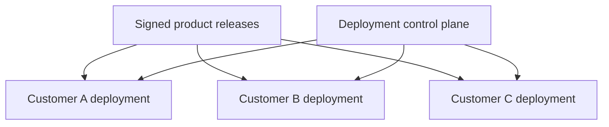
```mermaid
flowchart TB
    PRODUCT["Signed product releases"] --> A["Customer A deployment"]
    PRODUCT --> B["Customer B deployment"]
    PRODUCT --> C["Customer C deployment"]
    CONTROL["Deployment control plane"] --> A
    CONTROL --> B
    CONTROL --> C
```

### 2.3 Per-Customer Installation

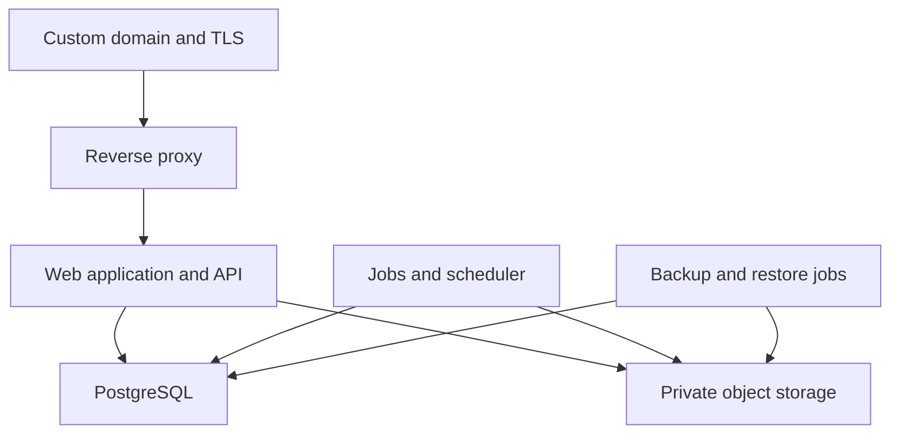
```mermaid
flowchart TB
    DOMAIN["Custom domain and TLS"] --> PROXY["Reverse proxy"]
    PROXY --> APP["Web application and API"]
    APP --> DB["PostgreSQL"]
    APP --> FILES["Private object storage"]
    WORKER["Jobs and scheduler"] --> DB
    WORKER --> FILES
    BACKUP["Backup and restore jobs"] --> DB
    BACKUP --> FILES
```

Installation rules:

1. PostgreSQL and internal services must not be exposed directly to the public internet.
2. Public application traffic must use HTTPS.
3. Web, API, and worker processes must run the same product release.
4. Every release must include numbered, repeatable database migrations.
5. A verified backup is required before production migration.
6. Customer differences must be represented by configuration, policy versions, or feature flags.
7. Manual edits to a customer's codebase are prohibited.
8. Deployment secrets must not be stored in the business tables or source repository.

### 2.4 Vendor Control Plane

The control plane is a separate vendor database and must never contain customer payroll, accounting, invoice, document, or employee records.

Recommended control-plane tables:

```text
customers
deployments
deployment_domains
licenses
product_releases
deployment_release_history
health_check_events
support_access_grants
```

The control plane may store:

- Deployment ID and customer reference.
- Product version and release channel.
- Approved domain names.
- License status and enabled commercial modules.
- Last health-check timestamp and non-sensitive service status.
- Approved support-access windows and audit events.

### 2.5 Group-Ready and Branch-Independent Deployment

A deployment may host one or more legal entities. This does not reduce customer isolation because all entities still belong to the same customer installation.

- Every financial transaction belongs to exactly one `organization_id`.
- Each legal entity owns its fiscal calendar, chart of accounts, tax profile, document sequences, and base currency.
- Every operational transaction also carries a `branch_id` when branch ownership applies.
- Each branch owns its warehouses, treasury accounts, employees, work queues, budgets, document sequences, approvals, and dashboards.
- Branch users see only authorized branch data; headquarters roles may view selected or all branches.
- Inter-branch transfers use explicit source and destination documents and never mutate stock or cash balances directly.
- Branch-level P&L, cash flow, inventory, payroll cost, performance, and KPI reports are mandatory.
- Legal-entity statutory accounts remain balanced while every journal line retains its branch dimension.
- Branches cannot move between legal entities without a controlled migration.
- Cross-entity transactions use explicit intercompany documents and balancing accounts.
- Consolidated reporting is a separate reporting process; it never merges source ledgers.

### 2.6 Branch Operating Model

Every branch is treated as an independent operating unit inside its legal entity.

| Capability | Branch behavior |
|---|---|
| Users and permissions | Branch-scoped roles and explicit headquarters override |
| Employees | Primary branch assignment with controlled temporary cross-branch assignment |
| Sales | Branch quotations, orders, deliveries, invoices, returns, and targets |
| Procurement | Branch requisitions, approvals, receipts, supplier bills, and spending limits |
| Warehouses | One or more branch warehouses, locations, stock counts, and reservations |
| Treasury | Branch cashboxes, bank mappings, payment limits, and daily closing |
| Projects | Branch-owned projects and shared projects with explicit participating branches |
| Assets and IT | Branch custody, equipment, devices, tickets, maintenance, and licenses |
| Tasks | Branch workspaces, department queues, SLAs, escalations, and performance |
| Budgets | Branch budgets, forecasts, commitments, and variance reporting |
| Analytics | Independent branch dashboard plus headquarters consolidation |

Branch independence does not mean duplicated master data. Shared catalog, party, policy, and global configuration records may be centrally governed and selectively available to branches.

---

## 3. Product Scope

### 3.1 Unified Modules

| Module | Responsibility |
|---|---|
| System | Installation identity, features, jobs, migrations, and integrations |
| Core | Legal entities, branches, departments, positions, currencies, and cost centers |
| IAM | Users, roles, permissions, and data scopes |
| Parties | Customers, suppliers, contractors, government bodies, and bank details |
| HR | Employees, contracts, assignments, documents, and reporting lines |
| Time and Leave | Schedules, attendance, adjustments, leave policies, and balances |
| Payroll | Compensation, inputs, runs, payslips, loans, liabilities, and disbursement |
| Projects | Projects, members, tasks, time, budgets, and billing rules |
| Sales and AR | Contracts, invoices, credit notes, receipts, and receivable allocations |
| Procurement and AP | Requests, purchase orders, receipts, supplier bills, and payments |
| Expenses | Employee claims, direct expenses, receipts, and reimbursement |
| Treasury | Cashboxes, banks, transfers, statements, and reconciliation |
| Accounting | Chart of accounts, taxes, posting rules, journals, close, and revaluation |
| Assets | Fixed assets, custody, movements, depreciation, and disposal |
| Budgeting | Budget versions, scenarios, lines, forecasts, and variance analysis |
| Workflow | Approval policies, instances, actions, comments, and attachments |
| Reporting | Operational views, materialized views, dashboards, and saved filters |
| Work Management | Tasks, workspaces, queues, recurring work, SLAs, dependencies, and department performance |
| CRM | Leads, opportunities, activities, proposals, pipeline, customer history, and campaigns |
| Sales | Quotations, orders, deliveries, invoices, returns, pricing, commissions, and targets |
| Inventory | Items, units, variants, batches, serials, warehouses, transfers, counts, reservations, and valuation |
| Document Control | Versioned documents, templates, transmittals, access, acknowledgements, and retention |
| IT Management | Service desk, requests, incidents, changes, assets, software, licenses, access, and security events |
| Quality and HSE | Inspections, non-conformance, corrective action, incidents, permits, and compliance |
| Fleet and Equipment | Vehicles, heavy equipment, assignment, meters, fuel, maintenance, and utilization |
| Customer Service | Cases, complaints, SLAs, communication history, and resolution |

### 3.2 Activatable Industry Profiles

All profiles use the same shared core and can be enabled together. A company may operate contracting, real estate, supply, engineering, maintenance, and general trading activities within one deployment.

| Profile | Main capabilities |
|---|---|
| Real Estate | Properties, buildings, units, owners, listings, reservations, sales, installments, leases, collections, commissions, maintenance, and handover |
| Contracting and Construction | Tenders, estimates, BOQ, project sites, material requests, subcontractors, progress claims, retention, variations, equipment, quality, and HSE |
| Engineering and Consulting | Disciplines, proposals, deliverables, revisions, transmittals, submittals, RFIs, design reviews, timesheets, and professional billing |
| Supply and Trading | Supplier quotations, purchasing, warehousing, price lists, sales orders, delivery, returns, and stock valuation |
| Service and Maintenance | Service contracts, work orders, technicians, spare parts, preventive maintenance, SLAs, and billing |
| Manufacturing | Bills of material, routings, work orders, material issues, production receipts, costing, quality, and capacity |
| General Corporate | HR, payroll, finance, budgets, assets, tasks, IT, document control, compliance, and analytics |

### 3.3 Module Activation Rules

- Modules are enabled by license and company configuration.
- Enabling or disabling a module never deletes data.
- Dependencies are explicit; for example, Sales requires Parties and Accounting, while Inventory requires Catalog and Warehouses.
- A company can enable multiple industry profiles simultaneously.
- Shared entities such as employees, parties, items, projects, assets, tasks, and documents are not duplicated between profiles.
- Navigation, permissions, dashboards, workflows, and reports react to enabled modules.
- Branch-level module activation may be narrower than company-level activation when policy permits.

### 3.4 Module Map

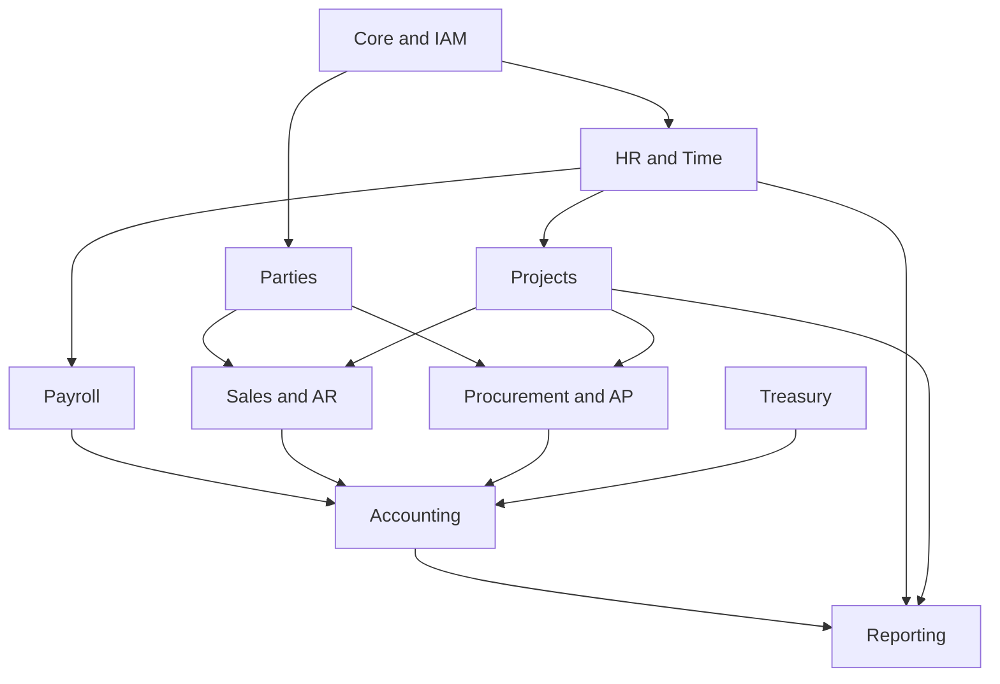
```mermaid
flowchart TB
    CORE["Core and IAM"] --> HR["HR and Time"]
    CORE --> PARTY["Parties"]
    HR --> PAY["Payroll"]
    HR --> PROJECT["Projects"]
    PARTY --> SALES["Sales and AR"]
    PARTY --> AP["Procurement and AP"]
    PROJECT --> SALES
    PROJECT --> AP
    PAY --> GL["Accounting"]
    SALES --> GL
    AP --> GL
    CASH["Treasury"] --> GL
    GL --> REPORT["Reporting"]
    HR --> REPORT
    PROJECT --> REPORT
```

---

## 4. Architecture Principles

### 4.1 Three-Layer Financial Model

1. **Operational document:** invoice, supplier bill, expense claim, payroll run, receipt, payment, or asset event.
2. **Accounting effect:** balanced journal entry generated after approval and posting.
3. **Analytical result:** view or materialized view derived from posted source data.

Operational documents describe the business event. The general ledger is the source of truth for statutory financial reporting. Dashboards are read models and never become an independent source of truth.

### 4.2 Authoritative Sources

| Question | Authoritative source |
|---|---|
| Employee's current department and manager | Effective `hr.employee_assignments` record |
| Historical employee salary | Posted `payroll.payslips` and `payroll.payslip_lines` snapshot |
| Revenue, expense, and profit | Posted `accounting.journal_lines` |
| Customer outstanding amount | Sales documents and allocations, reconciled with the AR control account |
| Supplier outstanding amount | Supplier documents and allocations, reconciled with the AP control account |
| Cash position | Posted treasury transactions and reconciled ledger accounts |
| Project profitability | Project-tagged ledger lines plus approved time and budget data |
| Leave balance | Sum of `hr.leave_ledger` movements |
| Fixed-asset book value | Acquisition, adjustment, and posted depreciation records |

### 4.3 Modular Monolith First

The first production architecture is a modular monolith:

- One deployable API application.
- One PostgreSQL database per customer deployment.
- One or more background workers.
- Explicit module boundaries and schema ownership.
- Transactional integration within the database.
- Outbox events for external integrations.

Microservices are introduced only when a measured scaling, ownership, or availability requirement justifies them.

### 4.4 Immutability and History

- Posted journals are immutable.
- Approved payroll results are versioned and snapshotted.
- Employee assignments, contracts, policies, rates, and tax rules use effective dates.
- Corrections create reversals, replacement versions, or adjustment records.
- Reference data is archived, not hard-deleted, once referenced.
- Audit records are append-only.

---

## 5. Database Schemas

| Schema | Ownership |
|---|---|
| `system` | Installation metadata, feature flags, jobs, and integrations |
| `localization` | Languages, translation keys, localized master data, templates, and formats |
| `core` | Organizations, branches, structures, currencies, dimensions, sequences |
| `iam` | Users, memberships, roles, permissions, and scopes |
| `party` | External people and organizations |
| `hr` | Employees, contracts, assignments, attendance, and leave |
| `payroll` | Compensation, payroll calculation, liabilities, and payments |
| `work` | Tasks, workspaces, queues, SLAs, recurrence, dependencies, and department workload |
| `crm` | Leads, opportunities, activities, proposals, campaigns, and pipeline |
| `catalog` | Items, services, units, variants, categories, prices, and attributes |
| `inventory` | Warehouses, locations, stock ledger, reservations, transfers, counts, and valuation |
| `project` | Projects, work breakdown, members, time, budget, and billing |
| `sales` | Contracts, invoices, credit notes, receipts, and allocations |
| `procurement` | Purchase requests, orders, receipts, and supplier bills |
| `expense` | Employee and direct expense claims |
| `treasury` | Cash, bank, transfer, statement, and reconciliation records |
| `accounting` | Accounts, taxes, posting, journals, closing, and revaluation |
| `asset` | Fixed assets, depreciation, movements, and disposal |
| `budget` | Budgets, versions, lines, forecasts, and scenarios |
| `dms` | Document folders, versions, templates, transmittals, acknowledgements, and retention |
| `itsm` | IT requests, incidents, problems, changes, assets, software, licenses, and access |
| `quality` | Inspections, non-conformance, corrective actions, audits, and quality plans |
| `hse` | Incidents, hazards, permits, toolbox talks, PPE, training, and investigations |
| `fleet` | Vehicles, equipment, meters, fuel, maintenance, assignment, and utilization |
| `real_estate` | Properties, units, listings, reservations, sales, leases, installments, and handover |
| `construction` | Tenders, estimates, BOQ, site execution, subcontractors, claims, retention, and variations |
| `engineering` | Disciplines, deliverables, revisions, transmittals, RFIs, submittals, and design review |
| `service` | Service contracts, work orders, technicians, preventive maintenance, parts, and SLA |
| `manufacturing` | BOM, routings, work orders, production, quality, capacity, and costing |
| `support` | Customer cases, complaints, communication, SLA, escalation, and resolution |
| `workflow` | Business objects, approvals, attachments, comments, and events |
| `reporting` | Views, materialized views, dashboard configuration, and exports |

---

## 6. Data Standards

### 6.1 Standard Record Columns

Aggregate roots use the following pattern where applicable:

```text
id                  uuid primary key
organization_id     uuid not null
branch_id           uuid null
business_object_id  uuid null
created_at          timestamptz not null
created_by          uuid null
updated_at          timestamptz not null
updated_by          uuid null
version_no          integer not null default 1
archived_at         timestamptz null
```

Rules:

- Generate UUIDs in the application or with an approved PostgreSQL function.
- `branch_id` is mandatory for branch-owned transactions and null only for explicitly organization-wide records.
- Never expose a sequential database key as the only public identifier.
- Human-readable numbers such as `INV-2026-000123` come from `core.document_sequences`.
- Use `date` for effective dates and `timestamptz` for real-world events.
- Store timestamps in UTC.
- Use `text` for unconstrained names and descriptions.
- Use a controlled code plus translations for configurable reference values.
- Use `jsonb` only when a relational structure would not provide stronger integrity.

### 6.2 Monetary Values

- Transaction amount: `numeric(20,4)`.
- Quantity and hours: `numeric(20,6)`.
- Exchange rate: `numeric(20,10)`.
- Percentage or rate: `numeric(12,8)` unless the domain requires more.
- Never use floating-point types for money.
- Never use PostgreSQL's locale-sensitive `money` type as the accounting source.

Multi-currency lines store:

```text
transaction_currency_id
transaction_amount
exchange_rate
base_currency_id
base_amount
rate_type
rate_date
```

The applied exchange rate is a historical snapshot and is never recalculated using the current rate.

### 6.3 Status Fields

Do not overload one `status` column with unrelated meanings.

Use separate fields when applicable:

- `lifecycle_status`
- `approval_status`
- `posting_status`
- `payment_status`
- `reconciliation_status`

Stable technical states may use a constrained enum or check constraint. Configurable business classifications use reference tables.

### 6.4 Document Totals

A financial document header may store validated snapshot totals for fast reads:

```text
subtotal_amount
discount_amount
tax_amount
rounding_amount
total_amount
paid_amount
outstanding_amount
```

The database or domain service must verify that header totals reconcile to lines, taxes, discounts, allocations, and rounding policy.

### 6.5 Sensitive Data

- National identifiers and full bank account numbers require encryption or tokenization.
- User interfaces and logs display masked values by default.
- Passwords are managed by the authentication system, never by employee tables.
- Secrets, tokens, private keys, and SSH credentials are never stored in general metadata or audit snapshots.

### 6.6 Bilingual and Localization Architecture

The product ships with complete Arabic and English interfaces. Additional languages can be installed without changing database identifiers.

Rules:

- Database schemas, tables, columns, constraints, permissions, event names, API resources, and source-code identifiers remain English.
- Arabic UI uses RTL layout. English UI uses LTR layout.
- Users choose a preferred language; the organization defines default and fallback languages.
- UI strings use stable translation keys rather than hard-coded text.
- Translatable business master data uses normalized translation records, not duplicated localized columns across every table.
- User-entered transactional descriptions remain in the language entered unless a translated version is explicitly provided.
- Dates, numbers, currencies, addresses, names, calendars, and timezones follow locale and country-pack settings.
- Search supports Arabic normalization, English search, and configured transliteration behavior.
- Printed documents and exports use bilingual or single-language templates selected by customer, party, branch, and document type.
- Mixed Arabic and English content preserves Unicode, bidirectional isolation, and correct PDF/Excel rendering.

Recommended localization tables:

```text
localization.languages
localization.translation_keys
localization.translation_values
localization.entity_translations
localization.document_templates
localization.template_versions
localization.locale_formats
localization.country_packs
localization.country_pack_versions
localization.country_pack_features
```

`localization.entity_translations` uses:

```text
id
organization_id
business_object_id
field_name
language_code
translated_value
translation_status
reviewed_by
reviewed_at
```

The unique constraint is `(business_object_id, field_name, language_code)`. Translations never replace the authoritative business key or financial value.

### 6.7 Country-Neutral Core

No country-specific tax, payroll, legal, banking, invoicing, address, or document rule is built permanently into the core.

Country packs define:

- Tax types, rates, exemptions, withholding, and filing rules.
- Payroll, insurance, pension, leave, and end-of-service rules.
- Electronic invoice or digital reporting adapters.
- Official identifier validation.
- Bank, IBAN, clearing, and payment-file formats.
- Fiscal calendars, public holidays, address formats, and working-week defaults.
- Statutory chart mappings and report templates.
- Data retention, consent, audit, and privacy requirements.

Every country-pack version is effective-dated, signed, tested, and explicitly activated per legal entity.

---

## 7. ERD — Installation, Organization, and Access Control

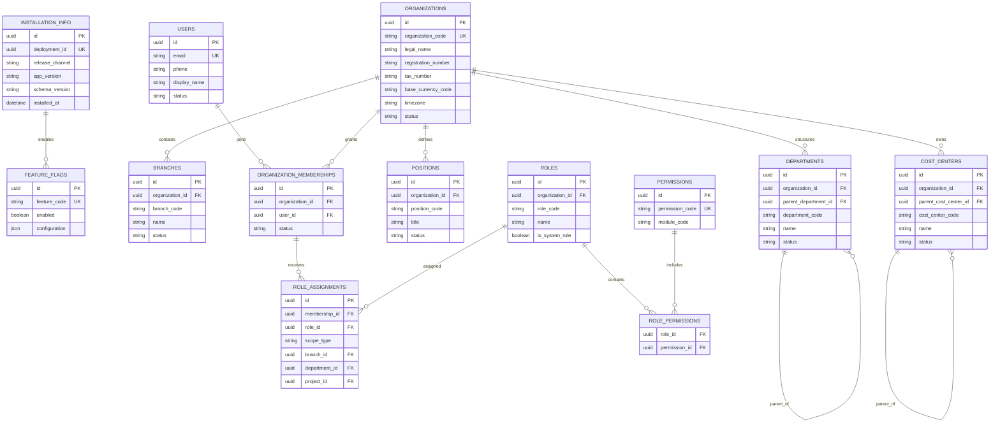
```mermaid
erDiagram
    INSTALLATION_INFO ||--o{ FEATURE_FLAGS : enables
    ORGANIZATIONS ||--o{ BRANCHES : contains
    ORGANIZATIONS ||--o{ DEPARTMENTS : structures
    DEPARTMENTS ||--o{ DEPARTMENTS : parent_of
    ORGANIZATIONS ||--o{ POSITIONS : defines
    ORGANIZATIONS ||--o{ COST_CENTERS : owns
    COST_CENTERS ||--o{ COST_CENTERS : parent_of
    USERS ||--o{ ORGANIZATION_MEMBERSHIPS : joins
    ORGANIZATIONS ||--o{ ORGANIZATION_MEMBERSHIPS : grants
    ORGANIZATION_MEMBERSHIPS ||--o{ ROLE_ASSIGNMENTS : receives
    ROLES ||--o{ ROLE_ASSIGNMENTS : assigned
    ROLES ||--o{ ROLE_PERMISSIONS : contains
    PERMISSIONS ||--o{ ROLE_PERMISSIONS : includes

    INSTALLATION_INFO {
      uuid id PK
      uuid deployment_id UK
      string release_channel
      string app_version
      string schema_version
      datetime installed_at
    }
    FEATURE_FLAGS {
      uuid id PK
      string feature_code UK
      boolean enabled
      json configuration
    }
    ORGANIZATIONS {
      uuid id PK
      string organization_code UK
      string legal_name
      string registration_number
      string tax_number
      string base_currency_code
      string timezone
      string status
    }
    BRANCHES {
      uuid id PK
      uuid organization_id FK
      string branch_code
      string name
      string status
    }
    DEPARTMENTS {
      uuid id PK
      uuid organization_id FK
      uuid parent_department_id FK
      string department_code
      string name
      string status
    }
    POSITIONS {
      uuid id PK
      uuid organization_id FK
      string position_code
      string title
      string status
    }
    COST_CENTERS {
      uuid id PK
      uuid organization_id FK
      uuid parent_cost_center_id FK
      string cost_center_code
      string name
      string status
    }
    USERS {
      uuid id PK
      string email UK
      string phone
      string display_name
      string status
    }
    ORGANIZATION_MEMBERSHIPS {
      uuid id PK
      uuid organization_id FK
      uuid user_id FK
      string status
    }
    ROLES {
      uuid id PK
      uuid organization_id FK
      string role_code
      string name
      boolean is_system_role
    }
    PERMISSIONS {
      uuid id PK
      string permission_code UK
      string module_code
    }
    ROLE_PERMISSIONS {
      uuid role_id FK
      uuid permission_id FK
    }
    ROLE_ASSIGNMENTS {
      uuid id PK
      uuid membership_id FK
      uuid role_id FK
      string scope_type
      uuid branch_id FK
      uuid department_id FK
      uuid project_id FK
    }
```

### 7.1 Permission Model

A permission answers **what** a user may do. A role assignment scope answers **where** the user may do it.

Examples:

- `payroll.run.create` for one legal entity.
- `payroll.run.approve` for all branches.
- `project.expense.read` for one project.
- `employee.profile.read_self` for the current employee only.
- `journal.manual.post` for finance administrators after approval.

The role assignment must enforce a valid scope combination. A project-scoped assignment cannot simultaneously point to an unrelated branch or department.

### 7.2 Organization Rules

- A branch belongs to one legal entity.
- A department and cost center may be hierarchical.
- A position is a reusable job definition; it is not the employee's historical assignment.
- Legal entity deletion is prohibited after any financial or payroll transaction exists.
- Organization code, branch code, department code, position code, and cost center code are unique within their documented scope.

---

## 8. ERD — Parties and Human Resources

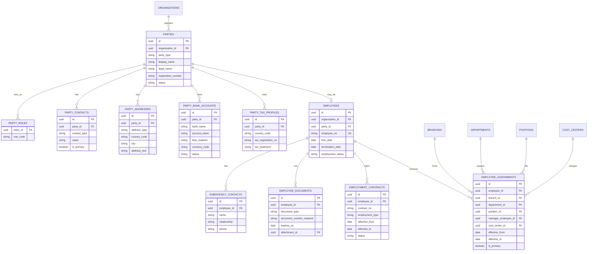
```mermaid
erDiagram
    ORGANIZATIONS ||--o{ PARTIES : registers
    PARTIES ||--o{ PARTY_ROLES : acts_as
    PARTIES ||--o{ PARTY_CONTACTS : has
    PARTIES ||--o{ PARTY_ADDRESSES : has
    PARTIES ||--o{ PARTY_BANK_ACCOUNTS : owns
    PARTIES ||--o{ PARTY_TAX_PROFILES : uses
    PARTIES ||--o| EMPLOYEES : may_be
    EMPLOYEES ||--o{ EMPLOYMENT_CONTRACTS : signs
    EMPLOYEES ||--o{ EMPLOYEE_ASSIGNMENTS : receives
    EMPLOYEES ||--o{ EMPLOYEE_DOCUMENTS : has
    EMPLOYEES ||--o{ EMERGENCY_CONTACTS : has
    BRANCHES ||--o{ EMPLOYEE_ASSIGNMENTS : hosts
    DEPARTMENTS ||--o{ EMPLOYEE_ASSIGNMENTS : assigns
    POSITIONS ||--o{ EMPLOYEE_ASSIGNMENTS : fills
    COST_CENTERS ||--o{ EMPLOYEE_ASSIGNMENTS : charges

    PARTIES {
      uuid id PK
      uuid organization_id FK
      string party_type
      string display_name
      string legal_name
      string registration_number
      string status
    }
    PARTY_ROLES {
      uuid party_id FK
      string role_code
    }
    PARTY_CONTACTS {
      uuid id PK
      uuid party_id FK
      string contact_type
      string value
      boolean is_primary
    }
    PARTY_ADDRESSES {
      uuid id PK
      uuid party_id FK
      string address_type
      string country_code
      string city
      string address_text
    }
    PARTY_BANK_ACCOUNTS {
      uuid id PK
      uuid party_id FK
      string bank_name
      string account_token
      string iban_masked
      string currency_code
      string status
    }
    PARTY_TAX_PROFILES {
      uuid id PK
      uuid party_id FK
      string country_code
      string tax_registration_no
      string tax_treatment
    }
    EMPLOYEES {
      uuid id PK
      uuid organization_id FK
      uuid party_id FK
      string employee_no UK
      date hire_date
      date termination_date
      string employment_status
    }
    EMPLOYMENT_CONTRACTS {
      uuid id PK
      uuid employee_id FK
      string contract_no
      string employment_type
      date effective_from
      date effective_to
      string status
    }
    EMPLOYEE_ASSIGNMENTS {
      uuid id PK
      uuid employee_id FK
      uuid branch_id FK
      uuid department_id FK
      uuid position_id FK
      uuid manager_employee_id FK
      uuid cost_center_id FK
      date effective_from
      date effective_to
      boolean is_primary
    }
    EMPLOYEE_DOCUMENTS {
      uuid id PK
      uuid employee_id FK
      string document_type
      string document_number_masked
      date expires_on
      uuid attachment_id FK
    }
    EMERGENCY_CONTACTS {
      uuid id PK
      uuid employee_id FK
      string name
      string relationship
      string phone
    }
```

### 8.1 Party Model

`party.parties` provides one identity for a person or external organization. `party.party_roles` allows the same party to be a customer, supplier, contractor, employee, government body, or another supported role without duplicating legal and contact data.

### 8.2 Employment History

`hr.employee_assignments` is effective-dated because transfers must preserve history. Reports for a prior period select the assignment effective during that period rather than the employee's current assignment.

Required constraints:

- An employee has at most one primary assignment for a given date.
- Assignment organization must match the employee organization.
- Branch, department, position, and cost center must belong to the same legal entity.
- A manager must be an active employee in a permitted reporting scope.
- Contract and assignment ranges must have `effective_from <= effective_to`.

---

## 9. ERD — Work Schedules, Attendance, and Leave

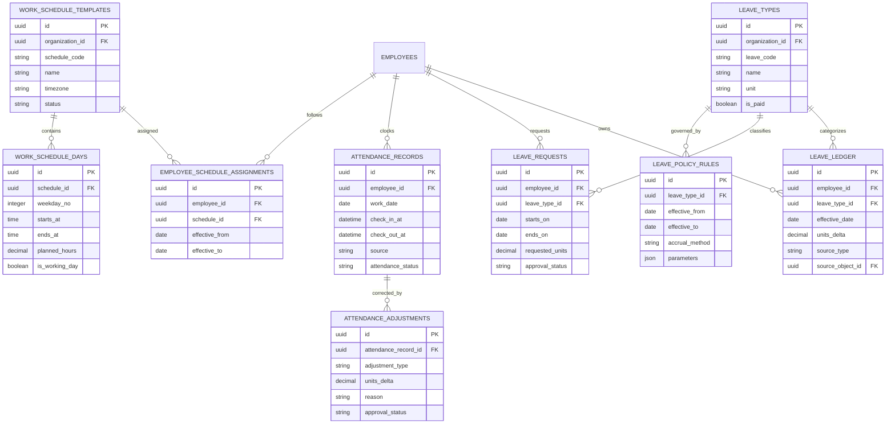
```mermaid
erDiagram
    WORK_SCHEDULE_TEMPLATES ||--o{ WORK_SCHEDULE_DAYS : contains
    EMPLOYEES ||--o{ EMPLOYEE_SCHEDULE_ASSIGNMENTS : follows
    WORK_SCHEDULE_TEMPLATES ||--o{ EMPLOYEE_SCHEDULE_ASSIGNMENTS : assigned
    EMPLOYEES ||--o{ ATTENDANCE_RECORDS : clocks
    ATTENDANCE_RECORDS ||--o{ ATTENDANCE_ADJUSTMENTS : corrected_by
    LEAVE_TYPES ||--o{ LEAVE_POLICY_RULES : governed_by
    EMPLOYEES ||--o{ LEAVE_REQUESTS : requests
    LEAVE_TYPES ||--o{ LEAVE_REQUESTS : classifies
    EMPLOYEES ||--o{ LEAVE_LEDGER : owns
    LEAVE_TYPES ||--o{ LEAVE_LEDGER : categorizes

    WORK_SCHEDULE_TEMPLATES {
      uuid id PK
      uuid organization_id FK
      string schedule_code
      string name
      string timezone
      string status
    }
    WORK_SCHEDULE_DAYS {
      uuid id PK
      uuid schedule_id FK
      integer weekday_no
      time starts_at
      time ends_at
      decimal planned_hours
      boolean is_working_day
    }
    EMPLOYEE_SCHEDULE_ASSIGNMENTS {
      uuid id PK
      uuid employee_id FK
      uuid schedule_id FK
      date effective_from
      date effective_to
    }
    ATTENDANCE_RECORDS {
      uuid id PK
      uuid employee_id FK
      date work_date
      datetime check_in_at
      datetime check_out_at
      string source
      string attendance_status
    }
    ATTENDANCE_ADJUSTMENTS {
      uuid id PK
      uuid attendance_record_id FK
      string adjustment_type
      decimal units_delta
      string reason
      string approval_status
    }
    LEAVE_TYPES {
      uuid id PK
      uuid organization_id FK
      string leave_code
      string name
      string unit
      boolean is_paid
    }
    LEAVE_POLICY_RULES {
      uuid id PK
      uuid leave_type_id FK
      date effective_from
      date effective_to
      string accrual_method
      json parameters
    }
    LEAVE_REQUESTS {
      uuid id PK
      uuid employee_id FK
      uuid leave_type_id FK
      date starts_on
      date ends_on
      decimal requested_units
      string approval_status
    }
    LEAVE_LEDGER {
      uuid id PK
      uuid employee_id FK
      uuid leave_type_id FK
      date effective_date
      decimal units_delta
      string source_type
      uuid source_object_id FK
    }
```

Attendance may be imported from a biometric device, mobile application, web entry, or approved manual adjustment. Raw source events should be retained when required for traceability.

Leave balances are derived from the leave ledger:

```text
opening grant
+ periodic accrual
+ approved adjustment
- approved leave usage
- expiry or forfeiture
= available balance
```

The current balance is not a freely editable employee field.

---

## 10. ERD — Payroll

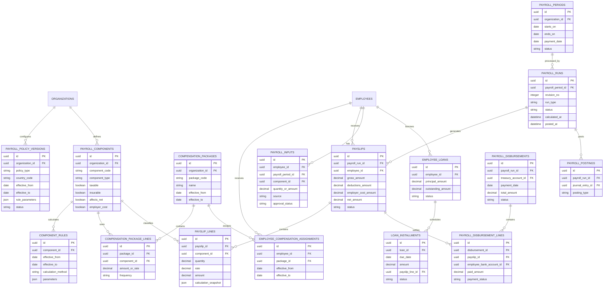
```mermaid
erDiagram
    ORGANIZATIONS ||--o{ PAYROLL_POLICY_VERSIONS : configures
    ORGANIZATIONS ||--o{ PAYROLL_COMPONENTS : defines
    PAYROLL_COMPONENTS ||--o{ COMPONENT_RULES : calculates
    COMPENSATION_PACKAGES ||--o{ COMPENSATION_PACKAGE_LINES : contains
    PAYROLL_COMPONENTS ||--o{ COMPENSATION_PACKAGE_LINES : uses
    EMPLOYEES ||--o{ EMPLOYEE_COMPENSATION_ASSIGNMENTS : receives
    COMPENSATION_PACKAGES ||--o{ EMPLOYEE_COMPENSATION_ASSIGNMENTS : assigns
    PAYROLL_PERIODS ||--o{ PAYROLL_RUNS : processed_by
    PAYROLL_RUNS ||--o{ PAYSLIPS : generates
    EMPLOYEES ||--o{ PAYSLIPS : receives
    PAYSLIPS ||--o{ PAYSLIP_LINES : contains
    PAYROLL_COMPONENTS ||--o{ PAYSLIP_LINES : classifies
    EMPLOYEES ||--o{ PAYROLL_INPUTS : has
    EMPLOYEES ||--o{ EMPLOYEE_LOANS : borrows
    EMPLOYEE_LOANS ||--o{ LOAN_INSTALLMENTS : schedules
    PAYROLL_RUNS ||--o{ PAYROLL_POSTINGS : posts
    PAYROLL_DISBURSEMENTS ||--o{ PAYROLL_DISBURSEMENT_LINES : contains
    PAYSLIPS ||--o{ PAYROLL_DISBURSEMENT_LINES : settles

    PAYROLL_POLICY_VERSIONS {
      uuid id PK
      uuid organization_id FK
      string policy_type
      string country_code
      date effective_from
      date effective_to
      json rule_parameters
      string status
    }
    PAYROLL_COMPONENTS {
      uuid id PK
      uuid organization_id FK
      string component_code
      string component_type
      boolean taxable
      boolean insurable
      boolean affects_net
      boolean employer_cost
    }
    COMPONENT_RULES {
      uuid id PK
      uuid component_id FK
      date effective_from
      date effective_to
      string calculation_method
      json parameters
    }
    COMPENSATION_PACKAGES {
      uuid id PK
      uuid organization_id FK
      string package_code
      string name
      date effective_from
      date effective_to
    }
    COMPENSATION_PACKAGE_LINES {
      uuid id PK
      uuid package_id FK
      uuid component_id FK
      decimal amount_or_rate
      string frequency
    }
    EMPLOYEE_COMPENSATION_ASSIGNMENTS {
      uuid id PK
      uuid employee_id FK
      uuid package_id FK
      date effective_from
      date effective_to
    }
    PAYROLL_PERIODS {
      uuid id PK
      uuid organization_id FK
      date starts_on
      date ends_on
      date payment_date
      string status
    }
    PAYROLL_RUNS {
      uuid id PK
      uuid payroll_period_id FK
      integer revision_no
      string run_type
      string status
      datetime calculated_at
      datetime posted_at
    }
    PAYSLIPS {
      uuid id PK
      uuid payroll_run_id FK
      uuid employee_id FK
      decimal gross_amount
      decimal deductions_amount
      decimal employer_cost_amount
      decimal net_amount
      string status
    }
    PAYSLIP_LINES {
      uuid id PK
      uuid payslip_id FK
      uuid component_id FK
      decimal quantity
      decimal rate
      decimal amount
      json calculation_snapshot
    }
    PAYROLL_INPUTS {
      uuid id PK
      uuid employee_id FK
      uuid payroll_period_id FK
      uuid component_id FK
      decimal quantity_or_amount
      string source
      string approval_status
    }
    EMPLOYEE_LOANS {
      uuid id PK
      uuid employee_id FK
      decimal principal_amount
      decimal outstanding_amount
      string status
    }
    LOAN_INSTALLMENTS {
      uuid id PK
      uuid loan_id FK
      date due_date
      decimal amount
      uuid payslip_line_id FK
      string status
    }
    PAYROLL_POSTINGS {
      uuid id PK
      uuid payroll_run_id FK
      uuid journal_entry_id FK
      string posting_type
    }
    PAYROLL_DISBURSEMENTS {
      uuid id PK
      uuid payroll_run_id FK
      uuid treasury_account_id FK
      date payment_date
      decimal total_amount
      string status
    }
    PAYROLL_DISBURSEMENT_LINES {
      uuid id PK
      uuid disbursement_id FK
      uuid payslip_id FK
      uuid employee_bank_account_id FK
      decimal paid_amount
      string payment_status
    }
```

### 10.1 Payroll Calculation Rules

- Compensation packages define expected components.
- Payroll inputs provide approved period-specific additions, deductions, overtime, absence, or bonuses.
- Policy versions provide tax, insurance, rounding, thresholds, and caps for the effective date.
- Payslip lines store the actual calculated result and a validated calculation snapshot.
- Rules must use a safe calculation DSL or known calculation methods. Executable JavaScript, SQL, or arbitrary code is prohibited.
- A posted run is immutable. Corrections create a new revision and accounting reversal or adjustment.
- A unique lock prevents concurrent posting for the same legal entity and payroll period.

### 10.2 Payroll Lifecycle

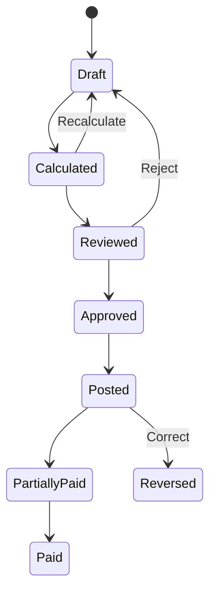
```mermaid
stateDiagram-v2
    [*] --> Draft
    Draft --> Calculated
    Calculated --> Reviewed
    Reviewed --> Approved
    Approved --> Posted
    Posted --> PartiallyPaid
    PartiallyPaid --> Paid
    Calculated --> Draft: Recalculate
    Reviewed --> Draft: Reject
    Posted --> Reversed: Correct
```

### 10.3 International Country Policy Packs

The payroll core is country-neutral. Each country pack is a versioned configuration, validation, calculation, and reporting package rather than permanent hard-coded logic.

A country pack may include:

- Tax brackets, allowances, exemptions, and effective dates.
- Employee and employer social-insurance or pension rules.
- Minimum and maximum insurable bases.
- Statutory benefits, deductions, leave, and end-of-service rules.
- Rounding, currency precision, and payment due dates.
- Statutory payroll files, forms, declarations, and reports.
- Electronic invoicing, withholding, and tax-document requirements where related.
- Official identifiers, address formats, calendars, and retention periods.

Country packs may coexist within a deployment when different legal entities operate in different countries. Every production policy version must be validated by the customer's authorized payroll, tax, accounting, or legal specialist before activation.

---

## 11. ERD — Projects, Time, and Project Budgets

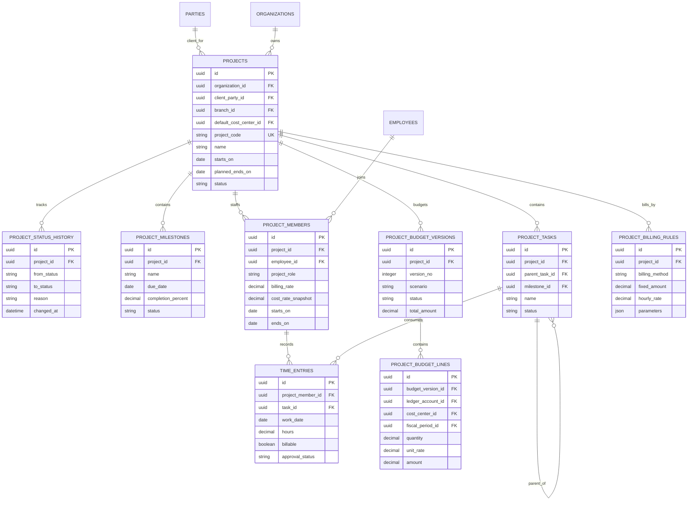
```mermaid
erDiagram
    PARTIES ||--o{ PROJECTS : client_for
    ORGANIZATIONS ||--o{ PROJECTS : owns
    PROJECTS ||--o{ PROJECT_STATUS_HISTORY : tracks
    PROJECTS ||--o{ PROJECT_MILESTONES : contains
    PROJECTS ||--o{ PROJECT_TASKS : contains
    PROJECT_TASKS ||--o{ PROJECT_TASKS : parent_of
    PROJECTS ||--o{ PROJECT_MEMBERS : staffs
    EMPLOYEES ||--o{ PROJECT_MEMBERS : joins
    PROJECT_MEMBERS ||--o{ TIME_ENTRIES : records
    PROJECT_TASKS ||--o{ TIME_ENTRIES : consumes
    PROJECTS ||--o{ PROJECT_BUDGET_VERSIONS : budgets
    PROJECT_BUDGET_VERSIONS ||--o{ PROJECT_BUDGET_LINES : contains
    PROJECTS ||--o{ PROJECT_BILLING_RULES : bills_by

    PROJECTS {
      uuid id PK
      uuid organization_id FK
      uuid client_party_id FK
      uuid branch_id FK
      uuid default_cost_center_id FK
      string project_code UK
      string name
      date starts_on
      date planned_ends_on
      string status
    }
    PROJECT_STATUS_HISTORY {
      uuid id PK
      uuid project_id FK
      string from_status
      string to_status
      string reason
      datetime changed_at
    }
    PROJECT_MILESTONES {
      uuid id PK
      uuid project_id FK
      string name
      date due_date
      decimal completion_percent
      string status
    }
    PROJECT_TASKS {
      uuid id PK
      uuid project_id FK
      uuid parent_task_id FK
      uuid milestone_id FK
      string name
      string status
    }
    PROJECT_MEMBERS {
      uuid id PK
      uuid project_id FK
      uuid employee_id FK
      string project_role
      decimal billing_rate
      decimal cost_rate_snapshot
      date starts_on
      date ends_on
    }
    TIME_ENTRIES {
      uuid id PK
      uuid project_member_id FK
      uuid task_id FK
      date work_date
      decimal hours
      boolean billable
      string approval_status
    }
    PROJECT_BUDGET_VERSIONS {
      uuid id PK
      uuid project_id FK
      integer version_no
      string scenario
      string status
      decimal total_amount
    }
    PROJECT_BUDGET_LINES {
      uuid id PK
      uuid budget_version_id FK
      uuid ledger_account_id FK
      uuid cost_center_id FK
      uuid fiscal_period_id FK
      decimal quantity
      decimal unit_rate
      decimal amount
    }
    PROJECT_BILLING_RULES {
      uuid id PK
      uuid project_id FK
      string billing_method
      decimal fixed_amount
      decimal hourly_rate
      json parameters
    }
```

Supported billing methods:

- Fixed price.
- Time and materials.
- Milestone-based.
- Cost plus margin.
- Recurring retainer.

Project profitability is calculated from posted journal lines tagged with `project_id`. Time entries support labor utilization and costing but do not independently define statutory project profit.

---

## 12. ERD — Sales and Accounts Receivable

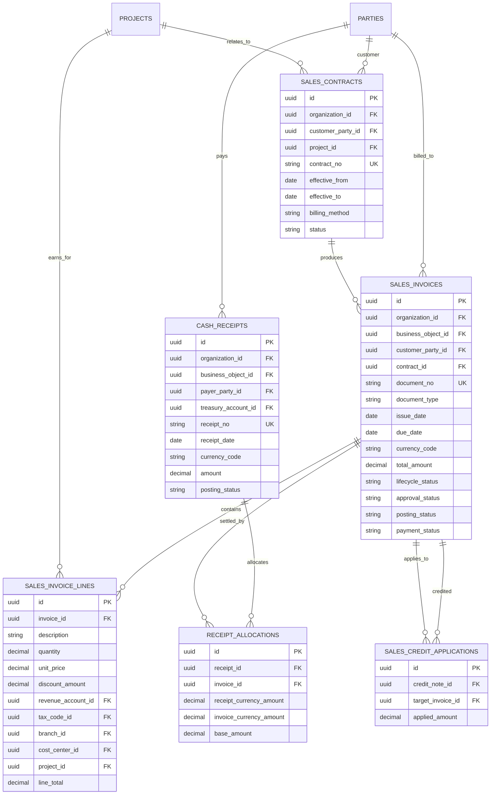
```mermaid
erDiagram
    PARTIES ||--o{ SALES_CONTRACTS : customer
    PROJECTS ||--o{ SALES_CONTRACTS : relates_to
    PARTIES ||--o{ SALES_INVOICES : billed_to
    SALES_CONTRACTS ||--o{ SALES_INVOICES : produces
    SALES_INVOICES ||--o{ SALES_INVOICE_LINES : contains
    PROJECTS ||--o{ SALES_INVOICE_LINES : earns_for
    PARTIES ||--o{ CASH_RECEIPTS : pays
    CASH_RECEIPTS ||--o{ RECEIPT_ALLOCATIONS : allocates
    SALES_INVOICES ||--o{ RECEIPT_ALLOCATIONS : settled_by
    SALES_INVOICES ||--o{ SALES_CREDIT_APPLICATIONS : credited
    SALES_INVOICES ||--o{ SALES_CREDIT_APPLICATIONS : applies_to

    SALES_CONTRACTS {
      uuid id PK
      uuid organization_id FK
      uuid customer_party_id FK
      uuid project_id FK
      string contract_no UK
      date effective_from
      date effective_to
      string billing_method
      string status
    }
    SALES_INVOICES {
      uuid id PK
      uuid organization_id FK
      uuid business_object_id FK
      uuid customer_party_id FK
      uuid contract_id FK
      string document_no UK
      string document_type
      date issue_date
      date due_date
      string currency_code
      decimal total_amount
      string lifecycle_status
      string approval_status
      string posting_status
      string payment_status
    }
    SALES_INVOICE_LINES {
      uuid id PK
      uuid invoice_id FK
      string description
      decimal quantity
      decimal unit_price
      decimal discount_amount
      uuid revenue_account_id FK
      uuid tax_code_id FK
      uuid branch_id FK
      uuid cost_center_id FK
      uuid project_id FK
      decimal line_total
    }
    CASH_RECEIPTS {
      uuid id PK
      uuid organization_id FK
      uuid business_object_id FK
      uuid payer_party_id FK
      uuid treasury_account_id FK
      string receipt_no UK
      date receipt_date
      string currency_code
      decimal amount
      string posting_status
    }
    RECEIPT_ALLOCATIONS {
      uuid id PK
      uuid receipt_id FK
      uuid invoice_id FK
      decimal receipt_currency_amount
      decimal invoice_currency_amount
      decimal base_amount
    }
    SALES_CREDIT_APPLICATIONS {
      uuid id PK
      uuid credit_note_id FK
      uuid target_invoice_id FK
      decimal applied_amount
    }
```

### 12.1 Receivable Rules

- A receipt may settle several invoices.
- An invoice may be settled by several receipts and credit notes.
- Allocations are explicit many-to-many records.
- Unapplied receipts are permitted only when business policy allows customer advances.
- A credit note is a separate document linked to the original invoice; it does not overwrite the invoice.
- Invoice posting recognizes receivable and revenue according to the configured posting rule.
- Receipt posting recognizes treasury and reduces receivable.
- Operational outstanding balances must reconcile to the AR control account.

---

## 13. ERD — Procurement, Accounts Payable, and Expenses

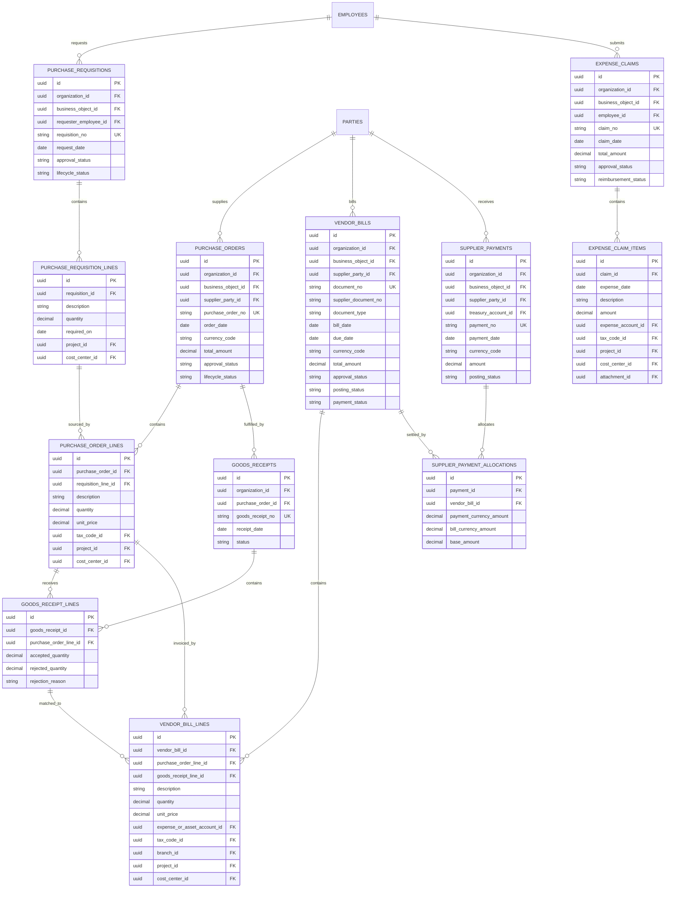
```mermaid
erDiagram
    EMPLOYEES ||--o{ PURCHASE_REQUISITIONS : requests
    PURCHASE_REQUISITIONS ||--o{ PURCHASE_REQUISITION_LINES : contains
    PARTIES ||--o{ PURCHASE_ORDERS : supplies
    PURCHASE_ORDERS ||--o{ PURCHASE_ORDER_LINES : contains
    PURCHASE_REQUISITION_LINES ||--o{ PURCHASE_ORDER_LINES : sourced_by
    PURCHASE_ORDERS ||--o{ GOODS_RECEIPTS : fulfilled_by
    GOODS_RECEIPTS ||--o{ GOODS_RECEIPT_LINES : contains
    PURCHASE_ORDER_LINES ||--o{ GOODS_RECEIPT_LINES : receives
    PARTIES ||--o{ VENDOR_BILLS : bills
    VENDOR_BILLS ||--o{ VENDOR_BILL_LINES : contains
    PURCHASE_ORDER_LINES ||--o{ VENDOR_BILL_LINES : invoiced_by
    GOODS_RECEIPT_LINES ||--o{ VENDOR_BILL_LINES : matched_to
    PARTIES ||--o{ SUPPLIER_PAYMENTS : receives
    SUPPLIER_PAYMENTS ||--o{ SUPPLIER_PAYMENT_ALLOCATIONS : allocates
    VENDOR_BILLS ||--o{ SUPPLIER_PAYMENT_ALLOCATIONS : settled_by
    EMPLOYEES ||--o{ EXPENSE_CLAIMS : submits
    EXPENSE_CLAIMS ||--o{ EXPENSE_CLAIM_ITEMS : contains

    PURCHASE_REQUISITIONS {
      uuid id PK
      uuid organization_id FK
      uuid business_object_id FK
      uuid requester_employee_id FK
      string requisition_no UK
      date request_date
      string approval_status
      string lifecycle_status
    }
    PURCHASE_REQUISITION_LINES {
      uuid id PK
      uuid requisition_id FK
      string description
      decimal quantity
      date required_on
      uuid project_id FK
      uuid cost_center_id FK
    }
    PURCHASE_ORDERS {
      uuid id PK
      uuid organization_id FK
      uuid business_object_id FK
      uuid supplier_party_id FK
      string purchase_order_no UK
      date order_date
      string currency_code
      decimal total_amount
      string approval_status
      string lifecycle_status
    }
    PURCHASE_ORDER_LINES {
      uuid id PK
      uuid purchase_order_id FK
      uuid requisition_line_id FK
      string description
      decimal quantity
      decimal unit_price
      uuid tax_code_id FK
      uuid project_id FK
      uuid cost_center_id FK
    }
    GOODS_RECEIPTS {
      uuid id PK
      uuid organization_id FK
      uuid purchase_order_id FK
      string goods_receipt_no UK
      date receipt_date
      string status
    }
    GOODS_RECEIPT_LINES {
      uuid id PK
      uuid goods_receipt_id FK
      uuid purchase_order_line_id FK
      decimal accepted_quantity
      decimal rejected_quantity
      string rejection_reason
    }
    VENDOR_BILLS {
      uuid id PK
      uuid organization_id FK
      uuid business_object_id FK
      uuid supplier_party_id FK
      string document_no UK
      string supplier_document_no
      string document_type
      date bill_date
      date due_date
      string currency_code
      decimal total_amount
      string approval_status
      string posting_status
      string payment_status
    }
    VENDOR_BILL_LINES {
      uuid id PK
      uuid vendor_bill_id FK
      uuid purchase_order_line_id FK
      uuid goods_receipt_line_id FK
      string description
      decimal quantity
      decimal unit_price
      uuid expense_or_asset_account_id FK
      uuid tax_code_id FK
      uuid branch_id FK
      uuid project_id FK
      uuid cost_center_id FK
    }
    SUPPLIER_PAYMENTS {
      uuid id PK
      uuid organization_id FK
      uuid business_object_id FK
      uuid supplier_party_id FK
      uuid treasury_account_id FK
      string payment_no UK
      date payment_date
      string currency_code
      decimal amount
      string posting_status
    }
    SUPPLIER_PAYMENT_ALLOCATIONS {
      uuid id PK
      uuid payment_id FK
      uuid vendor_bill_id FK
      decimal payment_currency_amount
      decimal bill_currency_amount
      decimal base_amount
    }
    EXPENSE_CLAIMS {
      uuid id PK
      uuid organization_id FK
      uuid business_object_id FK
      uuid employee_id FK
      string claim_no UK
      date claim_date
      decimal total_amount
      string approval_status
      string reimbursement_status
    }
    EXPENSE_CLAIM_ITEMS {
      uuid id PK
      uuid claim_id FK
      date expense_date
      string description
      decimal amount
      uuid expense_account_id FK
      uuid tax_code_id FK
      uuid project_id FK
      uuid cost_center_id FK
      uuid attachment_id FK
    }
```

### 13.1 Procurement Controls

- Purchase requisition approval does not create a payable.
- Purchase order approval creates a commercial commitment, not a journal entry unless commitment accounting is enabled.
- Goods or service receipt records operational acceptance.
- Vendor bill approval and posting create the payable and expense, inventory, or asset entry.
- Three-way matching compares purchase order, accepted receipt, and vendor bill.
- Tolerance rules control permitted quantity and price variances.
- Supplier payment allocations are many-to-many and must reconcile with the AP control account.

### 13.2 Expense Claims

- Expense items require an expense category or ledger account, date, amount, and business purpose.
- Receipt requirements are policy-driven by amount and category.
- A claim may be charged across projects and cost centers at line level.
- Approval does not necessarily mean payment; reimbursement is a separate treasury event.
- Duplicate receipt detection may use attachment hash, merchant, date, and amount.

---

## 14. ERD — Treasury and Bank Reconciliation

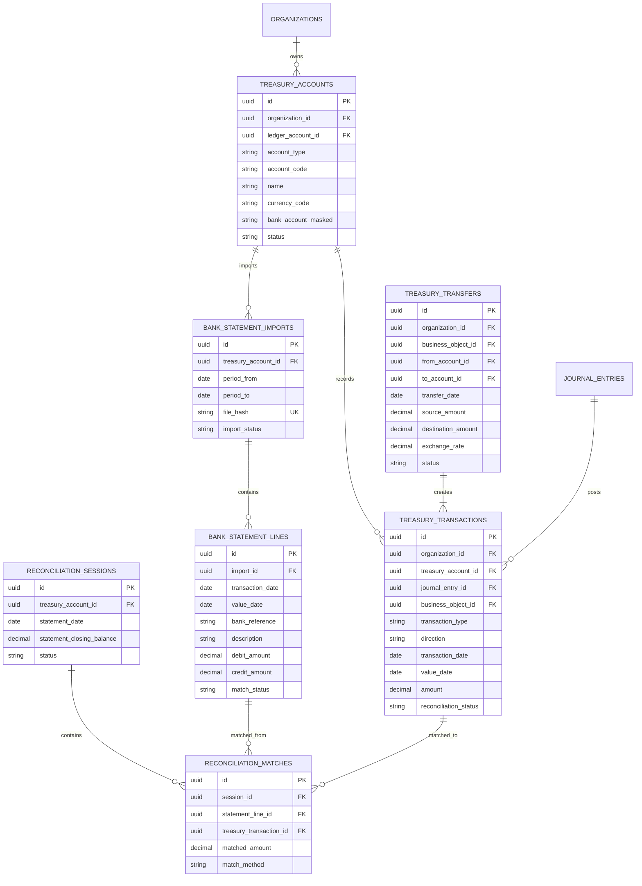
```mermaid
erDiagram
    ORGANIZATIONS ||--o{ TREASURY_ACCOUNTS : owns
    TREASURY_ACCOUNTS ||--o{ TREASURY_TRANSACTIONS : records
    TREASURY_ACCOUNTS ||--o{ BANK_STATEMENT_IMPORTS : imports
    BANK_STATEMENT_IMPORTS ||--o{ BANK_STATEMENT_LINES : contains
    RECONCILIATION_SESSIONS ||--o{ RECONCILIATION_MATCHES : contains
    BANK_STATEMENT_LINES ||--o{ RECONCILIATION_MATCHES : matched_from
    TREASURY_TRANSACTIONS ||--o{ RECONCILIATION_MATCHES : matched_to
    TREASURY_TRANSFERS ||--|{ TREASURY_TRANSACTIONS : creates
    JOURNAL_ENTRIES ||--o{ TREASURY_TRANSACTIONS : posts

    TREASURY_ACCOUNTS {
      uuid id PK
      uuid organization_id FK
      uuid ledger_account_id FK
      string account_type
      string account_code
      string name
      string currency_code
      string bank_account_masked
      string status
    }
    TREASURY_TRANSACTIONS {
      uuid id PK
      uuid organization_id FK
      uuid treasury_account_id FK
      uuid journal_entry_id FK
      uuid business_object_id FK
      string transaction_type
      string direction
      date transaction_date
      date value_date
      decimal amount
      string reconciliation_status
    }
    TREASURY_TRANSFERS {
      uuid id PK
      uuid organization_id FK
      uuid business_object_id FK
      uuid from_account_id FK
      uuid to_account_id FK
      date transfer_date
      decimal source_amount
      decimal destination_amount
      decimal exchange_rate
      string status
    }
    BANK_STATEMENT_IMPORTS {
      uuid id PK
      uuid treasury_account_id FK
      date period_from
      date period_to
      string file_hash UK
      string import_status
    }
    BANK_STATEMENT_LINES {
      uuid id PK
      uuid import_id FK
      date transaction_date
      date value_date
      string bank_reference
      string description
      decimal debit_amount
      decimal credit_amount
      string match_status
    }
    RECONCILIATION_SESSIONS {
      uuid id PK
      uuid treasury_account_id FK
      date statement_date
      decimal statement_closing_balance
      string status
    }
    RECONCILIATION_MATCHES {
      uuid id PK
      uuid session_id FK
      uuid statement_line_id FK
      uuid treasury_transaction_id FK
      decimal matched_amount
      string match_method
    }
```

Treasury rules:

- A treasury account maps to exactly one posting ledger account in the same legal entity and currency policy.
- Transfers create linked outgoing and incoming treasury transactions.
- Cross-currency transfers store both source and destination amounts and the applied rate.
- Reconciliation supports one-to-one, one-to-many, many-to-one, and partial matches.
- Imported statement files use a content hash and account scope to prevent duplicate imports.
- Reconciled transactions cannot be silently altered.

---

## 15. ERD — General Ledger and Accounting

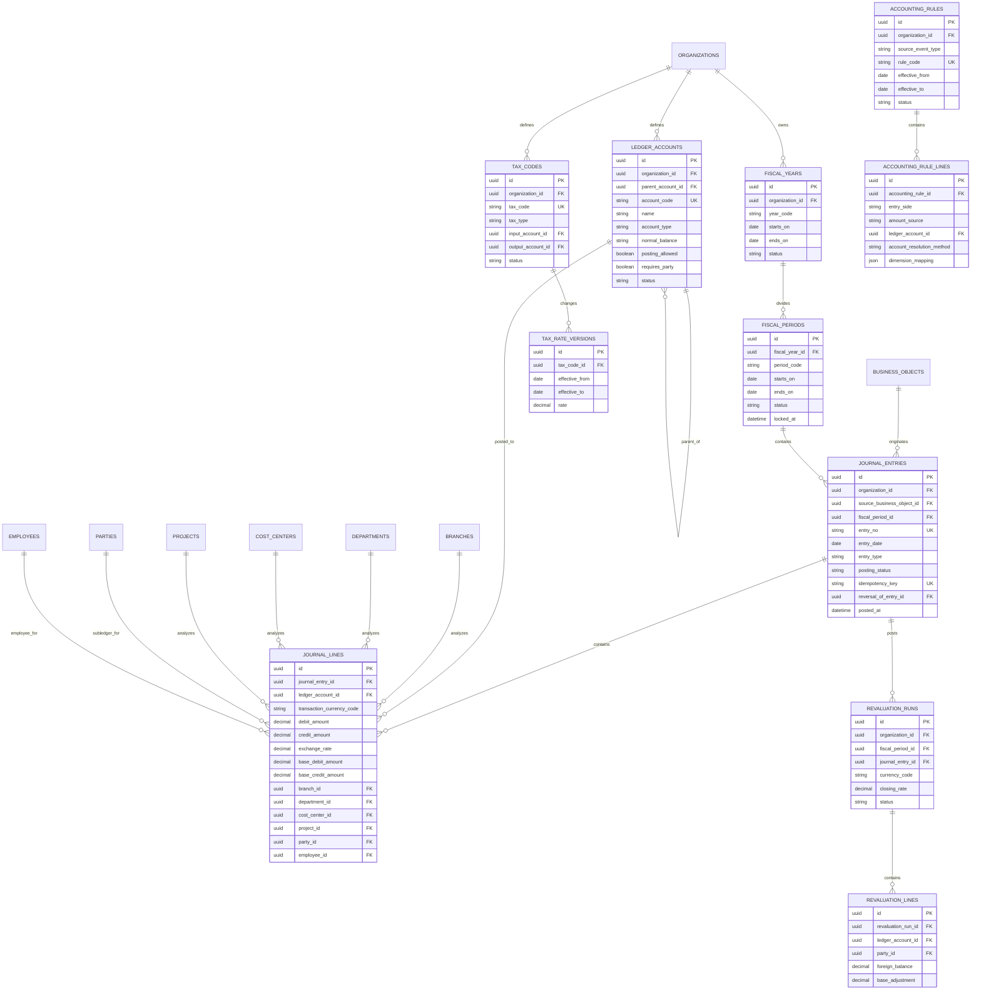
```mermaid
erDiagram
    ORGANIZATIONS ||--o{ FISCAL_YEARS : owns
    FISCAL_YEARS ||--o{ FISCAL_PERIODS : divides
    ORGANIZATIONS ||--o{ LEDGER_ACCOUNTS : defines
    LEDGER_ACCOUNTS ||--o{ LEDGER_ACCOUNTS : parent_of
    ORGANIZATIONS ||--o{ TAX_CODES : defines
    TAX_CODES ||--o{ TAX_RATE_VERSIONS : changes
    ACCOUNTING_RULES ||--o{ ACCOUNTING_RULE_LINES : contains
    BUSINESS_OBJECTS ||--o{ JOURNAL_ENTRIES : originates
    FISCAL_PERIODS ||--o{ JOURNAL_ENTRIES : contains
    JOURNAL_ENTRIES ||--o{ JOURNAL_LINES : contains
    LEDGER_ACCOUNTS ||--o{ JOURNAL_LINES : posted_to
    BRANCHES ||--o{ JOURNAL_LINES : analyzes
    DEPARTMENTS ||--o{ JOURNAL_LINES : analyzes
    COST_CENTERS ||--o{ JOURNAL_LINES : analyzes
    PROJECTS ||--o{ JOURNAL_LINES : analyzes
    PARTIES ||--o{ JOURNAL_LINES : subledger_for
    EMPLOYEES ||--o{ JOURNAL_LINES : employee_for
    REVALUATION_RUNS ||--o{ REVALUATION_LINES : contains
    JOURNAL_ENTRIES ||--o{ REVALUATION_RUNS : posts

    FISCAL_YEARS {
      uuid id PK
      uuid organization_id FK
      string year_code
      date starts_on
      date ends_on
      string status
    }
    FISCAL_PERIODS {
      uuid id PK
      uuid fiscal_year_id FK
      string period_code
      date starts_on
      date ends_on
      string status
      datetime locked_at
    }
    LEDGER_ACCOUNTS {
      uuid id PK
      uuid organization_id FK
      uuid parent_account_id FK
      string account_code UK
      string name
      string account_type
      string normal_balance
      boolean posting_allowed
      boolean requires_party
      string status
    }
    TAX_CODES {
      uuid id PK
      uuid organization_id FK
      string tax_code UK
      string tax_type
      uuid input_account_id FK
      uuid output_account_id FK
      string status
    }
    TAX_RATE_VERSIONS {
      uuid id PK
      uuid tax_code_id FK
      date effective_from
      date effective_to
      decimal rate
    }
    ACCOUNTING_RULES {
      uuid id PK
      uuid organization_id FK
      string source_event_type
      string rule_code UK
      date effective_from
      date effective_to
      string status
    }
    ACCOUNTING_RULE_LINES {
      uuid id PK
      uuid accounting_rule_id FK
      string entry_side
      string amount_source
      uuid ledger_account_id FK
      string account_resolution_method
      json dimension_mapping
    }
    JOURNAL_ENTRIES {
      uuid id PK
      uuid organization_id FK
      uuid source_business_object_id FK
      uuid fiscal_period_id FK
      string entry_no UK
      date entry_date
      string entry_type
      string posting_status
      string idempotency_key UK
      uuid reversal_of_entry_id FK
      datetime posted_at
    }
    JOURNAL_LINES {
      uuid id PK
      uuid journal_entry_id FK
      uuid ledger_account_id FK
      string transaction_currency_code
      decimal debit_amount
      decimal credit_amount
      decimal exchange_rate
      decimal base_debit_amount
      decimal base_credit_amount
      uuid branch_id FK
      uuid department_id FK
      uuid cost_center_id FK
      uuid project_id FK
      uuid party_id FK
      uuid employee_id FK
    }
    REVALUATION_RUNS {
      uuid id PK
      uuid organization_id FK
      uuid fiscal_period_id FK
      uuid journal_entry_id FK
      string currency_code
      decimal closing_rate
      string status
    }
    REVALUATION_LINES {
      uuid id PK
      uuid revaluation_run_id FK
      uuid ledger_account_id FK
      uuid party_id FK
      decimal foreign_balance
      decimal base_adjustment
    }
```

### 15.1 Non-Negotiable Ledger Invariants

1. Total base-currency debit equals total base-currency credit before posting.
2. A journal line has a positive debit or a positive credit, never both.
3. Posting to a closed period is prohibited.
4. Posting to a summary or non-posting account is prohibited.
5. A posted journal is immutable.
6. Corrections use a linked reversal and, when required, a replacement entry.
7. `idempotency_key` prevents the same source event from being posted twice.
8. A journal's organization, period, accounts, branches, projects, and dimensions must be compatible.
9. Manual journals require elevated permission and workflow approval.
10. Opening balances are posted journals, not editable account fields.

### 15.2 Posting Examples

| Business event | Debit | Credit |
|---|---|---|
| Customer invoice | Accounts receivable | Revenue and output tax |
| Customer receipt | Bank or cash | Accounts receivable |
| Vendor bill | Expense, inventory, or asset plus input tax | Accounts payable |
| Supplier payment | Accounts payable | Bank or cash |
| Payroll posting | Payroll expense and employer cost | Employee, tax, and insurance liabilities |
| Payroll disbursement | Employee liability | Bank or cash |
| Fixed-asset depreciation | Depreciation expense | Accumulated depreciation |
| Foreign-currency revaluation loss | FX loss | Revaluation adjustment |

### 15.3 Accounting Document Lifecycle

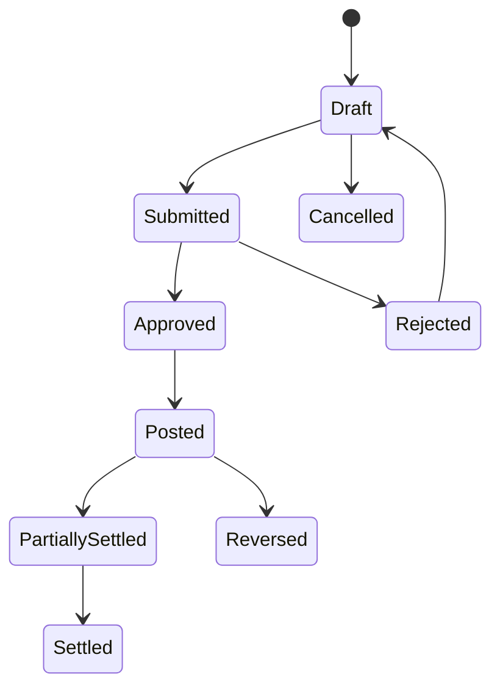
```mermaid
stateDiagram-v2
    [*] --> Draft
    Draft --> Submitted
    Submitted --> Approved
    Submitted --> Rejected
    Rejected --> Draft
    Approved --> Posted
    Posted --> PartiallySettled
    PartiallySettled --> Settled
    Posted --> Reversed
    Draft --> Cancelled
```

---

## 16. ERD — Multi-Entity and Consolidation

Advanced consolidation is optional, but the operational model must remain compatible with it.

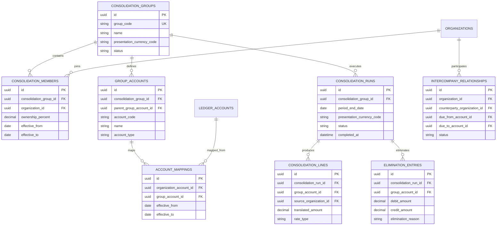
```mermaid
erDiagram
    CONSOLIDATION_GROUPS ||--o{ CONSOLIDATION_MEMBERS : contains
    ORGANIZATIONS ||--o{ CONSOLIDATION_MEMBERS : joins
    CONSOLIDATION_GROUPS ||--o{ GROUP_ACCOUNTS : defines
    GROUP_ACCOUNTS ||--o{ ACCOUNT_MAPPINGS : maps
    LEDGER_ACCOUNTS ||--o{ ACCOUNT_MAPPINGS : mapped_from
    CONSOLIDATION_GROUPS ||--o{ CONSOLIDATION_RUNS : executes
    CONSOLIDATION_RUNS ||--o{ CONSOLIDATION_LINES : produces
    CONSOLIDATION_RUNS ||--o{ ELIMINATION_ENTRIES : eliminates
    ORGANIZATIONS ||--o{ INTERCOMPANY_RELATIONSHIPS : participates

    CONSOLIDATION_GROUPS {
      uuid id PK
      string group_code UK
      string name
      string presentation_currency_code
      string status
    }
    CONSOLIDATION_MEMBERS {
      uuid id PK
      uuid consolidation_group_id FK
      uuid organization_id FK
      decimal ownership_percent
      date effective_from
      date effective_to
    }
    GROUP_ACCOUNTS {
      uuid id PK
      uuid consolidation_group_id FK
      uuid parent_group_account_id FK
      string account_code
      string name
      string account_type
    }
    ACCOUNT_MAPPINGS {
      uuid id PK
      uuid organization_account_id FK
      uuid group_account_id FK
      date effective_from
      date effective_to
    }
    CONSOLIDATION_RUNS {
      uuid id PK
      uuid consolidation_group_id FK
      date period_end_date
      string presentation_currency_code
      string status
      datetime completed_at
    }
    CONSOLIDATION_LINES {
      uuid id PK
      uuid consolidation_run_id FK
      uuid group_account_id FK
      uuid source_organization_id FK
      decimal translated_amount
      string rate_type
    }
    ELIMINATION_ENTRIES {
      uuid id PK
      uuid consolidation_run_id FK
      uuid group_account_id FK
      decimal debit_amount
      decimal credit_amount
      string elimination_reason
    }
    INTERCOMPANY_RELATIONSHIPS {
      uuid id PK
      uuid organization_id FK
      uuid counterparty_organization_id FK
      uuid due_from_account_id FK
      uuid due_to_account_id FK
      string status
    }
```

Consolidation rules:

- Each legal entity retains an independent ledger and base currency.
- Entity account mappings are effective-dated.
- Consolidation converts entity balances into a presentation currency.
- Intercompany balances and transactions are eliminated in the consolidation layer.
- Consolidation output never overwrites source entity journals.

---

## 17. ERD — Fixed Assets and Budgets

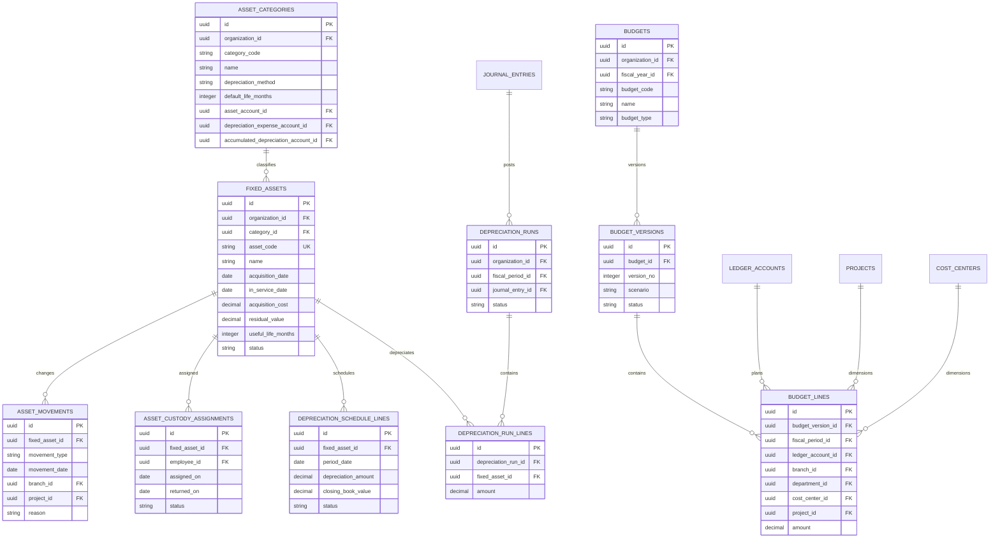
```mermaid
erDiagram
    ASSET_CATEGORIES ||--o{ FIXED_ASSETS : classifies
    FIXED_ASSETS ||--o{ ASSET_MOVEMENTS : changes
    FIXED_ASSETS ||--o{ ASSET_CUSTODY_ASSIGNMENTS : assigned
    FIXED_ASSETS ||--o{ DEPRECIATION_SCHEDULE_LINES : schedules
    DEPRECIATION_RUNS ||--o{ DEPRECIATION_RUN_LINES : contains
    FIXED_ASSETS ||--o{ DEPRECIATION_RUN_LINES : depreciates
    JOURNAL_ENTRIES ||--o{ DEPRECIATION_RUNS : posts
    BUDGETS ||--o{ BUDGET_VERSIONS : versions
    BUDGET_VERSIONS ||--o{ BUDGET_LINES : contains
    LEDGER_ACCOUNTS ||--o{ BUDGET_LINES : plans
    PROJECTS ||--o{ BUDGET_LINES : dimensions
    COST_CENTERS ||--o{ BUDGET_LINES : dimensions

    ASSET_CATEGORIES {
      uuid id PK
      uuid organization_id FK
      string category_code
      string name
      string depreciation_method
      integer default_life_months
      uuid asset_account_id FK
      uuid depreciation_expense_account_id FK
      uuid accumulated_depreciation_account_id FK
    }
    FIXED_ASSETS {
      uuid id PK
      uuid organization_id FK
      uuid category_id FK
      string asset_code UK
      string name
      date acquisition_date
      date in_service_date
      decimal acquisition_cost
      decimal residual_value
      integer useful_life_months
      string status
    }
    ASSET_MOVEMENTS {
      uuid id PK
      uuid fixed_asset_id FK
      string movement_type
      date movement_date
      uuid branch_id FK
      uuid project_id FK
      string reason
    }
    ASSET_CUSTODY_ASSIGNMENTS {
      uuid id PK
      uuid fixed_asset_id FK
      uuid employee_id FK
      date assigned_on
      date returned_on
      string status
    }
    DEPRECIATION_SCHEDULE_LINES {
      uuid id PK
      uuid fixed_asset_id FK
      date period_date
      decimal depreciation_amount
      decimal closing_book_value
      string status
    }
    DEPRECIATION_RUNS {
      uuid id PK
      uuid organization_id FK
      uuid fiscal_period_id FK
      uuid journal_entry_id FK
      string status
    }
    DEPRECIATION_RUN_LINES {
      uuid id PK
      uuid depreciation_run_id FK
      uuid fixed_asset_id FK
      decimal amount
    }
    BUDGETS {
      uuid id PK
      uuid organization_id FK
      uuid fiscal_year_id FK
      string budget_code
      string name
      string budget_type
    }
    BUDGET_VERSIONS {
      uuid id PK
      uuid budget_id FK
      integer version_no
      string scenario
      string status
    }
    BUDGET_LINES {
      uuid id PK
      uuid budget_version_id FK
      uuid fiscal_period_id FK
      uuid ledger_account_id FK
      uuid branch_id FK
      uuid department_id FK
      uuid cost_center_id FK
      uuid project_id FK
      decimal amount
    }
```

Asset and budget rules:

- Depreciation is calculated by a run and posted through a linked journal entry.
- Disposal creates an auditable asset event and accounting entry.
- Custody history is effective-dated and cannot be overwritten.
- Only one approved budget version is active for a defined scenario and period.
- Actual values always come from posted journal lines.
- Forecast and revised budget versions do not replace the original approved budget.

---

## 18. ERD — Workflow, Attachments, Audit, and Events

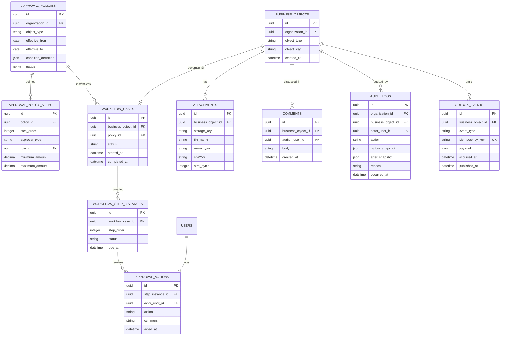
```mermaid
erDiagram
    BUSINESS_OBJECTS ||--o| WORKFLOW_CASES : governed_by
    APPROVAL_POLICIES ||--o{ APPROVAL_POLICY_STEPS : defines
    APPROVAL_POLICIES ||--o{ WORKFLOW_CASES : instantiates
    WORKFLOW_CASES ||--o{ WORKFLOW_STEP_INSTANCES : contains
    WORKFLOW_STEP_INSTANCES ||--o{ APPROVAL_ACTIONS : receives
    USERS ||--o{ APPROVAL_ACTIONS : acts
    BUSINESS_OBJECTS ||--o{ ATTACHMENTS : has
    BUSINESS_OBJECTS ||--o{ COMMENTS : discussed_in
    BUSINESS_OBJECTS ||--o{ AUDIT_LOGS : audited_by
    BUSINESS_OBJECTS ||--o{ OUTBOX_EVENTS : emits

    BUSINESS_OBJECTS {
      uuid id PK
      uuid organization_id FK
      string object_type
      string object_key
      datetime created_at
    }
    APPROVAL_POLICIES {
      uuid id PK
      uuid organization_id FK
      string object_type
      date effective_from
      date effective_to
      json condition_definition
      string status
    }
    APPROVAL_POLICY_STEPS {
      uuid id PK
      uuid policy_id FK
      integer step_order
      string approver_type
      uuid role_id FK
      decimal minimum_amount
      decimal maximum_amount
    }
    WORKFLOW_CASES {
      uuid id PK
      uuid business_object_id FK
      uuid policy_id FK
      string status
      datetime started_at
      datetime completed_at
    }
    WORKFLOW_STEP_INSTANCES {
      uuid id PK
      uuid workflow_case_id FK
      integer step_order
      string status
      datetime due_at
    }
    APPROVAL_ACTIONS {
      uuid id PK
      uuid step_instance_id FK
      uuid actor_user_id FK
      string action
      string comment
      datetime acted_at
    }
    ATTACHMENTS {
      uuid id PK
      uuid business_object_id FK
      string storage_key
      string file_name
      string mime_type
      string sha256
      integer size_bytes
    }
    COMMENTS {
      uuid id PK
      uuid business_object_id FK
      uuid author_user_id FK
      string body
      datetime created_at
    }
    AUDIT_LOGS {
      uuid id PK
      uuid organization_id FK
      uuid business_object_id FK
      uuid actor_user_id FK
      string action
      json before_snapshot
      json after_snapshot
      string reason
      datetime occurred_at
    }
    OUTBOX_EVENTS {
      uuid id PK
      uuid business_object_id FK
      string event_type
      string idempotency_key UK
      json payload
      datetime occurred_at
      datetime published_at
    }
```

`workflow.business_objects` provides a stable foreign-key target for generic workflow, attachments, comments, audit, and event records. Every supported aggregate root creates its business-object record in the same transaction.

Approval requirements:

- Policies are selected using object type, amount, branch, project, and other validated conditions.
- Self-approval may be prohibited by policy.
- Step assignment may target a user, role, manager chain, project role, or finance authority.
- Rejection, return-for-edit, delegation, escalation, and expiry are explicit actions.
- A completed approval history is immutable.

---

## 19. Independent Branch Operations and Headquarters Control

### 19.1 Branch Ownership Rule

Every operational aggregate has a clear ownership level:

| Ownership | Examples |
|---|---|
| Deployment-wide | Product version, licensed modules, global technical configuration |
| Legal-entity | Chart of accounts, tax registration, fiscal calendar, country pack, base currency |
| Branch | Sales, procurement, warehouses, cashboxes, employees, tasks, budgets, projects, assets, IT, and local approvals |
| Shared with explicit access | Customers, suppliers, item catalog, selected projects, framework contracts, policies |
| Headquarters-only | Consolidation, global policy, shared master governance, cross-branch analytics |

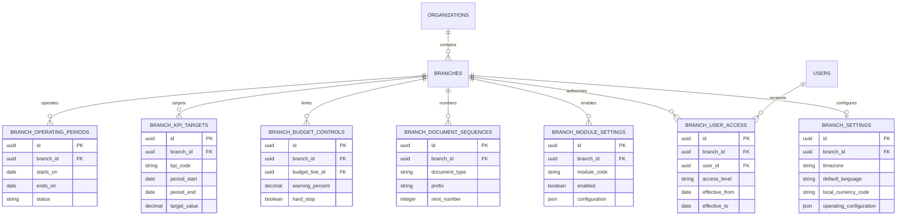
```mermaid
erDiagram
    ORGANIZATIONS ||--o{ BRANCHES : contains
    BRANCHES ||--o| BRANCH_SETTINGS : configures
    BRANCHES ||--o{ BRANCH_MODULE_SETTINGS : enables
    BRANCHES ||--o{ BRANCH_USER_ACCESS : authorizes
    USERS ||--o{ BRANCH_USER_ACCESS : receives
    BRANCHES ||--o{ BRANCH_DOCUMENT_SEQUENCES : numbers
    BRANCHES ||--o{ BRANCH_BUDGET_CONTROLS : limits
    BRANCHES ||--o{ BRANCH_KPI_TARGETS : targets
    BRANCHES ||--o{ BRANCH_OPERATING_PERIODS : operates

    BRANCH_SETTINGS {
      uuid id PK
      uuid branch_id FK
      string timezone
      string default_language
      string local_currency_code
      json operating_configuration
    }
    BRANCH_MODULE_SETTINGS {
      uuid id PK
      uuid branch_id FK
      string module_code
      boolean enabled
      json configuration
    }
    BRANCH_USER_ACCESS {
      uuid id PK
      uuid branch_id FK
      uuid user_id FK
      string access_level
      date effective_from
      date effective_to
    }
    BRANCH_DOCUMENT_SEQUENCES {
      uuid id PK
      uuid branch_id FK
      string document_type
      string prefix
      integer next_number
    }
    BRANCH_BUDGET_CONTROLS {
      uuid id PK
      uuid branch_id FK
      uuid budget_line_id FK
      decimal warning_percent
      boolean hard_stop
    }
    BRANCH_KPI_TARGETS {
      uuid id PK
      uuid branch_id FK
      string kpi_code
      date period_start
      date period_end
      decimal target_value
    }
    BRANCH_OPERATING_PERIODS {
      uuid id PK
      uuid branch_id FK
      date starts_on
      date ends_on
      string status
    }
```

### 19.2 Inter-Branch Processes

The following use paired source and destination records:

- Inventory transfer and in-transit stock.
- Cash transfer with source release and destination receipt.
- Employee temporary assignment or permanent transfer.
- Asset and IT-device custody transfer.
- Shared project resource allocation.
- Inter-branch service charge and cost allocation.
- Document handoff and task escalation.

Each process records request, approval, dispatch/release, receipt/acceptance, cancellation, variance, and accounting effect when applicable.

### 19.3 Branch Dashboard

Each branch dashboard includes:

- Sales pipeline, orders, revenue, returns, collection, and target achievement.
- Procurement requests, commitments, receipts, supplier liabilities, and spending.
- Stock on hand, available stock, in-transit stock, slow movement, shortages, and count variance.
- Cash, bank, daily closing, unreconciled movements, and payment exposure.
- Employee headcount, attendance, payroll cost, vacancies, turnover, and utilization.
- Project progress, cost, margin, risks, tasks, equipment, quality, and HSE.
- Task backlog, overdue work, SLA breaches, workload, and department performance.
- IT incidents, unavailable devices, expiring licenses, and unresolved access requests.
- Budget versus actual and forecast.

Headquarters can select one branch, several branches, all branches, one legal entity, or the complete deployment.

---

## 20. Work, Task, and Department Management

Work management is shared by every module and department. Tasks may stand alone or originate from a lead, invoice, project, inspection, IT incident, maintenance order, approval, customer case, or any other business object.

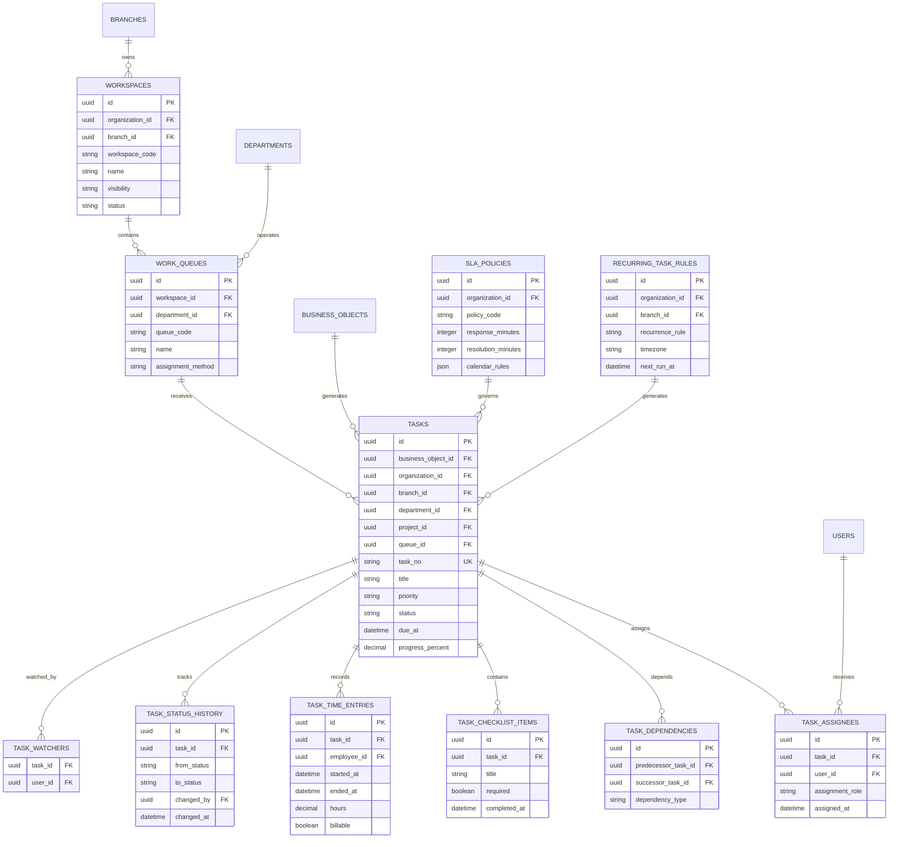
```mermaid
erDiagram
    BRANCHES ||--o{ WORKSPACES : owns
    DEPARTMENTS ||--o{ WORK_QUEUES : operates
    WORKSPACES ||--o{ WORK_QUEUES : contains
    WORK_QUEUES ||--o{ TASKS : receives
    BUSINESS_OBJECTS ||--o{ TASKS : generates
    TASKS ||--o{ TASK_ASSIGNEES : assigns
    USERS ||--o{ TASK_ASSIGNEES : receives
    TASKS ||--o{ TASK_DEPENDENCIES : depends
    TASKS ||--o{ TASK_CHECKLIST_ITEMS : contains
    TASKS ||--o{ TASK_TIME_ENTRIES : records
    TASKS ||--o{ TASK_STATUS_HISTORY : tracks
    TASKS ||--o{ TASK_WATCHERS : watched_by
    SLA_POLICIES ||--o{ TASKS : governs
    RECURRING_TASK_RULES ||--o{ TASKS : generates

    WORKSPACES {
      uuid id PK
      uuid organization_id FK
      uuid branch_id FK
      string workspace_code
      string name
      string visibility
      string status
    }
    WORK_QUEUES {
      uuid id PK
      uuid workspace_id FK
      uuid department_id FK
      string queue_code
      string name
      string assignment_method
    }
    TASKS {
      uuid id PK
      uuid business_object_id FK
      uuid organization_id FK
      uuid branch_id FK
      uuid department_id FK
      uuid project_id FK
      uuid queue_id FK
      string task_no UK
      string title
      string priority
      string status
      datetime due_at
      decimal progress_percent
    }
    TASK_ASSIGNEES {
      uuid id PK
      uuid task_id FK
      uuid user_id FK
      string assignment_role
      datetime assigned_at
    }
    TASK_DEPENDENCIES {
      uuid id PK
      uuid predecessor_task_id FK
      uuid successor_task_id FK
      string dependency_type
    }
    TASK_CHECKLIST_ITEMS {
      uuid id PK
      uuid task_id FK
      string title
      boolean required
      datetime completed_at
    }
    TASK_TIME_ENTRIES {
      uuid id PK
      uuid task_id FK
      uuid employee_id FK
      datetime started_at
      datetime ended_at
      decimal hours
      boolean billable
    }
    TASK_STATUS_HISTORY {
      uuid id PK
      uuid task_id FK
      string from_status
      string to_status
      uuid changed_by FK
      datetime changed_at
    }
    TASK_WATCHERS {
      uuid task_id FK
      uuid user_id FK
    }
    SLA_POLICIES {
      uuid id PK
      uuid organization_id FK
      string policy_code
      integer response_minutes
      integer resolution_minutes
      json calendar_rules
    }
    RECURRING_TASK_RULES {
      uuid id PK
      uuid organization_id FK
      uuid branch_id FK
      string recurrence_rule
      string timezone
      datetime next_run_at
    }
```

### 20.1 Task Capabilities

- List, board, calendar, timeline, workload, and department-queue views.
- Single or multiple assignees with accountable owner.
- Priority, severity, labels, dependencies, subtasks, and checklists.
- Files, comments, mentions, watchers, and full history.
- Recurring tasks and automatic generation from business events.
- SLA clocks using branch working calendars, pauses, escalation, and breach events.
- Approval gates, acceptance criteria, evidence requirements, and quality checks.
- Time tracking, planned effort, actual effort, and optional billable time.
- Automatic escalation to manager, branch manager, department head, or headquarters.
- Bulk reassignment during leave, transfer, or offboarding.

### 20.2 Work Analytics

- Open, completed, overdue, blocked, and breached tasks.
- Throughput, cycle time, response time, resolution time, and reopen rate.
- Workload by branch, department, queue, role, employee, and project.
- Planned versus actual effort.
- Recurring-task compliance.
- Bottleneck and dependency analysis.
- Department scorecards and target achievement.

---

## 21. CRM, Pricing, Sales, Delivery, and Returns

The commercial flow supports services, materials, properties, projects, contracts, and recurring business.

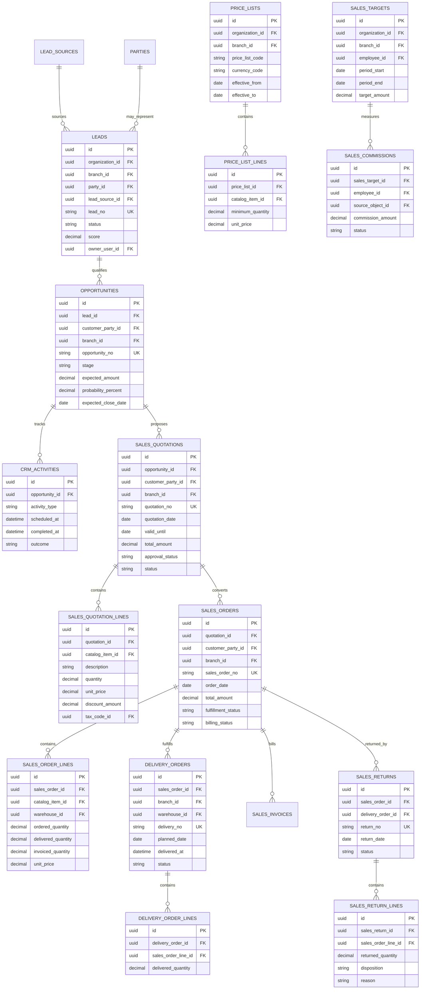
```mermaid
erDiagram
    LEAD_SOURCES ||--o{ LEADS : sources
    PARTIES ||--o{ LEADS : may_represent
    LEADS ||--o{ OPPORTUNITIES : qualifies
    OPPORTUNITIES ||--o{ CRM_ACTIVITIES : tracks
    OPPORTUNITIES ||--o{ SALES_QUOTATIONS : proposes
    PRICE_LISTS ||--o{ PRICE_LIST_LINES : contains
    SALES_QUOTATIONS ||--o{ SALES_QUOTATION_LINES : contains
    SALES_QUOTATIONS ||--o{ SALES_ORDERS : converts
    SALES_ORDERS ||--o{ SALES_ORDER_LINES : contains
    SALES_ORDERS ||--o{ DELIVERY_ORDERS : fulfills
    DELIVERY_ORDERS ||--o{ DELIVERY_ORDER_LINES : contains
    SALES_ORDERS ||--o{ SALES_INVOICES : bills
    SALES_ORDERS ||--o{ SALES_RETURNS : returned_by
    SALES_RETURNS ||--o{ SALES_RETURN_LINES : contains
    SALES_TARGETS ||--o{ SALES_COMMISSIONS : measures

    LEADS {
      uuid id PK
      uuid organization_id FK
      uuid branch_id FK
      uuid party_id FK
      uuid lead_source_id FK
      string lead_no UK
      string status
      decimal score
      uuid owner_user_id FK
    }
    OPPORTUNITIES {
      uuid id PK
      uuid lead_id FK
      uuid customer_party_id FK
      uuid branch_id FK
      string opportunity_no UK
      string stage
      decimal expected_amount
      decimal probability_percent
      date expected_close_date
    }
    CRM_ACTIVITIES {
      uuid id PK
      uuid opportunity_id FK
      string activity_type
      datetime scheduled_at
      datetime completed_at
      string outcome
    }
    PRICE_LISTS {
      uuid id PK
      uuid organization_id FK
      uuid branch_id FK
      string price_list_code
      string currency_code
      date effective_from
      date effective_to
    }
    PRICE_LIST_LINES {
      uuid id PK
      uuid price_list_id FK
      uuid catalog_item_id FK
      decimal minimum_quantity
      decimal unit_price
    }
    SALES_QUOTATIONS {
      uuid id PK
      uuid opportunity_id FK
      uuid customer_party_id FK
      uuid branch_id FK
      string quotation_no UK
      date quotation_date
      date valid_until
      decimal total_amount
      string approval_status
      string status
    }
    SALES_QUOTATION_LINES {
      uuid id PK
      uuid quotation_id FK
      uuid catalog_item_id FK
      string description
      decimal quantity
      decimal unit_price
      decimal discount_amount
      uuid tax_code_id FK
    }
    SALES_ORDERS {
      uuid id PK
      uuid quotation_id FK
      uuid customer_party_id FK
      uuid branch_id FK
      string sales_order_no UK
      date order_date
      decimal total_amount
      string fulfillment_status
      string billing_status
    }
    SALES_ORDER_LINES {
      uuid id PK
      uuid sales_order_id FK
      uuid catalog_item_id FK
      uuid warehouse_id FK
      decimal ordered_quantity
      decimal delivered_quantity
      decimal invoiced_quantity
      decimal unit_price
    }
    DELIVERY_ORDERS {
      uuid id PK
      uuid sales_order_id FK
      uuid branch_id FK
      uuid warehouse_id FK
      string delivery_no UK
      date planned_date
      datetime delivered_at
      string status
    }
    DELIVERY_ORDER_LINES {
      uuid id PK
      uuid delivery_order_id FK
      uuid sales_order_line_id FK
      decimal delivered_quantity
    }
    SALES_RETURNS {
      uuid id PK
      uuid sales_order_id FK
      uuid delivery_order_id FK
      string return_no UK
      date return_date
      string status
    }
    SALES_RETURN_LINES {
      uuid id PK
      uuid sales_return_id FK
      uuid sales_order_line_id FK
      decimal returned_quantity
      string disposition
      string reason
    }
    SALES_TARGETS {
      uuid id PK
      uuid organization_id FK
      uuid branch_id FK
      uuid employee_id FK
      date period_start
      date period_end
      decimal target_amount
    }
    SALES_COMMISSIONS {
      uuid id PK
      uuid sales_target_id FK
      uuid employee_id FK
      uuid source_object_id FK
      decimal commission_amount
      string status
    }
```

### 21.1 Commercial Controls

- Lead deduplication uses contact, party, source, and configurable matching rules.
- Opportunity stages, probability, mandatory fields, and loss reasons are configurable.
- Quotations support versions, alternatives, terms, taxes, approvals, and multilingual templates.
- Discounts use policy limits and approval thresholds.
- Sales orders reserve stock or service capacity according to product type.
- Delivery, invoicing, and payment are separate statuses.
- Partial delivery, partial invoice, backorder, cancellation, return, replacement, and credit note are supported.
- Commissions use versioned rules and are not payable until configured earning conditions are satisfied.

### 21.2 Sales Dashboards

- Lead source quality, conversion funnel, pipeline value, weighted forecast, and stage aging.
- Quotation win rate, discount leakage, order backlog, delivery performance, and returns.
- Revenue, gross margin, collection, target achievement, and commission exposure.
- Analysis by branch, salesperson, team, customer, item, category, project, and channel.

---

## 22. Catalog, Warehouses, Inventory, and Valuation

```mermaid
erDiagram
    ITEM_CATEGORIES ||--o{ CATALOG_ITEMS : classifies
    CATALOG_ITEMS ||--o{ ITEM_UNITS : supports
    CATALOG_ITEMS ||--o{ ITEM_VARIANTS : varies
    CATALOG_ITEMS ||--o{ ITEM_BARCODES : identifies
    BRANCHES ||--o{ WAREHOUSES : owns
    WAREHOUSES ||--o{ WAREHOUSE_LOCATIONS : contains
    CATALOG_ITEMS ||--o{ INVENTORY_TRANSACTION_LINES : moves
    INVENTORY_TRANSACTIONS ||--o{ INVENTORY_TRANSACTION_LINES : contains
    CATALOG_ITEMS ||--o{ STOCK_LOTS : batches
    CATALOG_ITEMS ||--o{ STOCK_SERIALS : serializes
    CATALOG_ITEMS ||--o{ STOCK_RESERVATIONS : reserves
    STOCK_TRANSFERS ||--o{ STOCK_TRANSFER_LINES : contains
    STOCK_COUNTS ||--o{ STOCK_COUNT_LINES : counts
    CATALOG_ITEMS ||--o{ INVENTORY_COST_LAYERS : values

    ITEM_CATEGORIES {
      uuid id PK
      uuid organization_id FK
      uuid parent_category_id FK
      string category_code
      string name
    }
    CATALOG_ITEMS {
      uuid id PK
      uuid organization_id FK
      uuid category_id FK
      string item_code UK
      string item_type
      string costing_method
      boolean stock_managed
      boolean lot_controlled
      boolean serial_controlled
      string status
    }
    ITEM_UNITS {
      uuid id PK
      uuid item_id FK
      string unit_code
      decimal conversion_factor
      boolean is_base_unit
    }
    ITEM_VARIANTS {
      uuid id PK
      uuid item_id FK
      string variant_code
      json attributes
      string status
    }
    ITEM_BARCODES {
      uuid id PK
      uuid item_id FK
      uuid variant_id FK
      string barcode UK
      string barcode_type
    }
    WAREHOUSES {
      uuid id PK
      uuid organization_id FK
      uuid branch_id FK
      string warehouse_code UK
      string name
      string warehouse_type
      string status
    }
    WAREHOUSE_LOCATIONS {
      uuid id PK
      uuid warehouse_id FK
      uuid parent_location_id FK
      string location_code
      string location_type
      boolean allow_mixed_items
    }
    INVENTORY_TRANSACTIONS {
      uuid id PK
      uuid organization_id FK
      uuid branch_id FK
      uuid business_object_id FK
      string transaction_no UK
      string transaction_type
      datetime occurred_at
      string posting_status
    }
    INVENTORY_TRANSACTION_LINES {
      uuid id PK
      uuid transaction_id FK
      uuid item_id FK
      uuid variant_id FK
      uuid location_id FK
      uuid lot_id FK
      uuid serial_id FK
      decimal quantity_delta
      decimal unit_cost
      decimal value_delta
    }
    STOCK_LOTS {
      uuid id PK
      uuid item_id FK
      string lot_no
      date manufactured_on
      date expires_on
      string status
    }
    STOCK_SERIALS {
      uuid id PK
      uuid item_id FK
      string serial_no UK
      string status
      uuid current_location_id FK
    }
    STOCK_RESERVATIONS {
      uuid id PK
      uuid item_id FK
      uuid warehouse_id FK
      uuid source_object_id FK
      decimal reserved_quantity
      datetime expires_at
      string status
    }
    STOCK_TRANSFERS {
      uuid id PK
      uuid source_branch_id FK
      uuid destination_branch_id FK
      uuid source_warehouse_id FK
      uuid destination_warehouse_id FK
      string transfer_no UK
      string status
    }
    STOCK_TRANSFER_LINES {
      uuid id PK
      uuid transfer_id FK
      uuid item_id FK
      decimal requested_quantity
      decimal dispatched_quantity
      decimal received_quantity
    }
    STOCK_COUNTS {
      uuid id PK
      uuid warehouse_id FK
      string count_no UK
      string count_type
      date count_date
      string status
    }
    STOCK_COUNT_LINES {
      uuid id PK
      uuid stock_count_id FK
      uuid item_id FK
      uuid location_id FK
      decimal system_quantity
      decimal counted_quantity
      decimal variance_quantity
    }
    INVENTORY_COST_LAYERS {
      uuid id PK
      uuid item_id FK
      uuid warehouse_id FK
      date layer_date
      decimal remaining_quantity
      decimal unit_cost
      string source_type
    }
```

### 22.1 Inventory Rules

- Stock balance is derived from the immutable stock ledger; any cached balance is rebuildable.
- Available stock equals on-hand minus valid reservations and controlled holds.
- Item type distinguishes stock item, non-stock material, service, asset, expense, rental item, and manufactured item.
- Negative stock policy is configurable and defaults to blocked.
- Lot, serial, expiry, quality hold, quarantine, damaged, and consignment statuses are supported.
- Inter-branch transfer uses requested, approved, dispatched, in-transit, partially received, received, and variance states.
- Cycle count and full count support blind counting, recount, approval, and posted variance.
- Valuation supports configured methods such as weighted average, FIFO, standard cost, or country-policy restrictions.
- Inventory accounting posts receipts, issues, transfers, adjustments, goods received not invoiced, and cost of goods sold.

### 22.2 Inventory Dashboards

- On-hand, available, reserved, in-transit, quarantine, damaged, and expired stock.
- Stock value by branch, warehouse, category, item, lot, and valuation method.
- Reorder risk, demand coverage, stockout, excess, slow-moving, and dead stock.
- Count accuracy, transfer variance, receiving performance, picking performance, and shrinkage.
- Purchase lead time, sales velocity, gross margin, and stock turnover.

---

## 23. Real Estate Management

The real-estate profile supports developers, owners, brokers, property managers, sales offices, leasing operations, and mixed portfolios.

```mermaid
erDiagram
    PARTIES ||--o{ PROPERTY_OWNERSHIPS : owns
    PROPERTIES ||--o{ PROPERTY_BUILDINGS : contains
    PROPERTY_BUILDINGS ||--o{ PROPERTY_UNITS : contains
    PROPERTIES ||--o{ PROPERTY_OWNERSHIPS : owned_by
    PROPERTY_UNITS ||--o{ PROPERTY_LISTINGS : listed_as
    PARTIES ||--o{ PROPERTY_LISTINGS : represented_for
    PROPERTY_LISTINGS ||--o{ UNIT_RESERVATIONS : reserved_by
    PARTIES ||--o{ UNIT_RESERVATIONS : customer
    UNIT_RESERVATIONS ||--o{ PROPERTY_SALE_CONTRACTS : converts
    PROPERTY_SALE_CONTRACTS ||--o{ SALE_INSTALLMENT_SCHEDULES : schedules
    PROPERTY_UNITS ||--o{ LEASE_CONTRACTS : leased_by
    LEASE_CONTRACTS ||--o{ RENT_SCHEDULES : schedules
    PROPERTY_UNITS ||--o{ PROPERTY_HANDOVERS : handed_over
    PROPERTY_UNITS ||--o{ PROPERTY_SERVICE_REQUESTS : maintained
    PROPERTY_SALE_CONTRACTS ||--o{ BROKER_COMMISSIONS : commissions

    PROPERTIES {
      uuid id PK
      uuid organization_id FK
      uuid branch_id FK
      uuid project_id FK
      string property_code UK
      string property_type
      string name
      string country_code
      string city
      string status
    }
    PROPERTY_BUILDINGS {
      uuid id PK
      uuid property_id FK
      string building_code
      string name
      integer floor_count
      string status
    }
    PROPERTY_UNITS {
      uuid id PK
      uuid building_id FK
      string unit_code
      string unit_type
      decimal gross_area
      decimal net_area
      string floor_label
      string availability_status
    }
    PROPERTY_OWNERSHIPS {
      uuid id PK
      uuid property_id FK
      uuid owner_party_id FK
      decimal ownership_percent
      date effective_from
      date effective_to
    }
    PROPERTY_LISTINGS {
      uuid id PK
      uuid unit_id FK
      uuid represented_party_id FK
      uuid branch_id FK
      string listing_no UK
      string listing_type
      decimal asking_amount
      string currency_code
      date available_from
      string status
    }
    UNIT_RESERVATIONS {
      uuid id PK
      uuid listing_id FK
      uuid customer_party_id FK
      string reservation_no UK
      datetime reserved_at
      datetime expires_at
      decimal deposit_amount
      string status
    }
    PROPERTY_SALE_CONTRACTS {
      uuid id PK
      uuid reservation_id FK
      uuid unit_id FK
      uuid customer_party_id FK
      string contract_no UK
      date contract_date
      decimal sale_amount
      string currency_code
      string status
    }
    SALE_INSTALLMENT_SCHEDULES {
      uuid id PK
      uuid sale_contract_id FK
      integer installment_no
      date due_date
      decimal amount
      string collection_status
    }
    LEASE_CONTRACTS {
      uuid id PK
      uuid unit_id FK
      uuid tenant_party_id FK
      string lease_no UK
      date starts_on
      date ends_on
      decimal security_deposit
      string status
    }
    RENT_SCHEDULES {
      uuid id PK
      uuid lease_contract_id FK
      integer period_no
      date due_date
      decimal rent_amount
      decimal service_charge_amount
      string collection_status
    }
    PROPERTY_HANDOVERS {
      uuid id PK
      uuid unit_id FK
      uuid contract_id FK
      datetime scheduled_at
      datetime completed_at
      string condition_status
      uuid signed_attachment_id FK
    }
    PROPERTY_SERVICE_REQUESTS {
      uuid id PK
      uuid unit_id FK
      uuid requester_party_id FK
      string request_no UK
      string category
      string priority
      string status
    }
    BROKER_COMMISSIONS {
      uuid id PK
      uuid sale_contract_id FK
      uuid broker_party_id FK
      decimal commission_rate
      decimal commission_amount
      string earning_status
      string payment_status
    }
```

### 23.1 Real Estate Capabilities

- Property hierarchy: portfolio, project, property, building, floor, unit, space, parking, and shared facility.
- Configurable unit attributes, plans, media, documents, amenities, utilities, and availability.
- Owner, developer, broker, tenant, buyer, facility manager, and service-provider roles.
- Listings for sale, rent, resale, short-term occupancy, or internal allocation.
- Lead-to-viewing-to-reservation-to-contract flow.
- Reservation expiry, extension, cancellation, refund, transfer, and conflict prevention.
- Cash, installment, mortgage, milestone, and mixed payment plans.
- Installment rescheduling, grace periods, penalties, waivers, early settlement, and collection.
- Lease renewal, escalation, indexation, deposit, service charge, notice, termination, and move-out.
- Unit handover with checklist, meter readings, defects, keys, attachments, and digital acknowledgement.
- Property maintenance and tenant/customer service integrated with Work Management and Service.
- Broker and salesperson commission with earning, approval, clawback, and payment rules.

### 23.2 Real Estate Dashboards

- Available, reserved, contracted, handed-over, occupied, vacant, and blocked units.
- Sales funnel, reservation conversion, cancellation, inventory value, and sales velocity.
- Installment due, overdue, collected, default risk, and collection forecast.
- Occupancy, vacancy, lease expiry, renewal, rent roll, and arrears.
- Broker performance, commission exposure, marketing source, and branch performance.
- Maintenance backlog, response, resolution, unit defects, and customer satisfaction.

---

## 24. Contracting, Construction, and Subcontracting

```mermaid
erDiagram
    PARTIES ||--o{ TENDERS : issued_by
    TENDERS ||--o{ ESTIMATE_VERSIONS : estimated
    ESTIMATE_VERSIONS ||--o{ ESTIMATE_LINES : contains
    TENDERS ||--o{ BOQ_VERSIONS : defines
    BOQ_VERSIONS ||--o{ BOQ_LINES : contains
    PROJECTS ||--o{ PROJECT_SITES : executed_at
    PROJECTS ||--o{ WORK_PACKAGES : decomposes
    BOQ_LINES ||--o{ WORK_PACKAGES : delivered_by
    PROJECT_SITES ||--o{ SITE_DAILY_LOGS : records
    PROJECT_SITES ||--o{ SITE_MATERIAL_REQUESTS : requests
    SITE_MATERIAL_REQUESTS ||--o{ SITE_MATERIAL_REQUEST_LINES : contains
    PARTIES ||--o{ SUBCONTRACTS : performs
    SUBCONTRACTS ||--o{ SUBCONTRACT_BOQ_LINES : contains
    SUBCONTRACTS ||--o{ SUBCONTRACT_CLAIMS : claims
    PROJECTS ||--o{ CLIENT_PROGRESS_CLAIMS : bills
    PROJECTS ||--o{ VARIATION_ORDERS : changes
    PROJECTS ||--o{ RETENTION_RECORDS : retains
    WORK_PACKAGES ||--o{ QUANTITY_MEASUREMENTS : measures

    TENDERS {
      uuid id PK
      uuid organization_id FK
      uuid branch_id FK
      uuid client_party_id FK
      string tender_no UK
      string title
      date submission_deadline
      string status
    }
    ESTIMATE_VERSIONS {
      uuid id PK
      uuid tender_id FK
      integer version_no
      string scenario
      decimal direct_cost
      decimal overhead_amount
      decimal markup_amount
      decimal tender_amount
      string status
    }
    ESTIMATE_LINES {
      uuid id PK
      uuid estimate_version_id FK
      string resource_type
      uuid catalog_item_id FK
      decimal quantity
      decimal unit_cost
      decimal total_cost
    }
    BOQ_VERSIONS {
      uuid id PK
      uuid tender_id FK
      uuid project_id FK
      integer version_no
      string status
    }
    BOQ_LINES {
      uuid id PK
      uuid boq_version_id FK
      uuid parent_line_id FK
      string boq_code
      string description
      string unit_code
      decimal contract_quantity
      decimal unit_rate
      decimal contract_amount
    }
    PROJECT_SITES {
      uuid id PK
      uuid project_id FK
      uuid branch_id FK
      string site_code
      string address_text
      date mobilized_on
      string status
    }
    WORK_PACKAGES {
      uuid id PK
      uuid project_id FK
      uuid boq_line_id FK
      string package_code
      string name
      decimal planned_quantity
      date planned_start
      date planned_finish
      string status
    }
    QUANTITY_MEASUREMENTS {
      uuid id PK
      uuid work_package_id FK
      date measurement_date
      decimal measured_quantity
      string measurement_type
      string approval_status
    }
    SITE_DAILY_LOGS {
      uuid id PK
      uuid project_site_id FK
      date log_date
      string weather
      decimal labor_hours
      string progress_summary
      string issues_summary
      string approval_status
    }
    SITE_MATERIAL_REQUESTS {
      uuid id PK
      uuid project_site_id FK
      string request_no UK
      date required_on
      string priority
      string status
    }
    SITE_MATERIAL_REQUEST_LINES {
      uuid id PK
      uuid request_id FK
      uuid item_id FK
      decimal requested_quantity
      decimal approved_quantity
      decimal issued_quantity
    }
    SUBCONTRACTS {
      uuid id PK
      uuid project_id FK
      uuid subcontractor_party_id FK
      string subcontract_no UK
      date starts_on
      date ends_on
      decimal contract_amount
      decimal retention_percent
      string status
    }
    SUBCONTRACT_BOQ_LINES {
      uuid id PK
      uuid subcontract_id FK
      uuid boq_line_id FK
      decimal quantity
      decimal unit_rate
    }
    SUBCONTRACT_CLAIMS {
      uuid id PK
      uuid subcontract_id FK
      string claim_no UK
      date valuation_date
      decimal gross_amount
      decimal retention_amount
      decimal net_amount
      string status
    }
    CLIENT_PROGRESS_CLAIMS {
      uuid id PK
      uuid project_id FK
      string claim_no UK
      date valuation_date
      decimal gross_amount
      decimal retention_amount
      decimal certified_amount
      string status
    }
    VARIATION_ORDERS {
      uuid id PK
      uuid project_id FK
      string variation_no UK
      string change_type
      decimal cost_impact
      decimal revenue_impact
      integer schedule_impact_days
      string status
    }
    RETENTION_RECORDS {
      uuid id PK
      uuid project_id FK
      uuid source_object_id FK
      decimal retained_amount
      date expected_release_date
      decimal released_amount
      string status
    }
```

### 24.1 Construction Capabilities

- Tender register, deadlines, bid/no-bid decision, documents, guarantees, clarifications, and submission.
- Estimate versions with labor, material, equipment, subcontract, overhead, contingency, markup, and risk.
- Hierarchical BOQ with versions, alternates, rate analysis, and imported spreadsheets.
- Contract baseline, work breakdown, site mobilization, schedule milestones, and progress measurement.
- Material request, procurement, site receipt, store issue, return, waste, and consumption against BOQ.
- Labor and equipment daily use, productivity, downtime, and cost allocation.
- Subcontract scope, BOQ, mobilization advance, deductions, retention, claim, certification, and payment.
- Client interim progress claims, certification, advance recovery, retention, deductions, tax, and collection.
- Variation request, estimate, quotation, approval, instruction, execution, and contract update.
- Quality inspection, method statement, material approval, NCR, corrective action, and handover.
- HSE permits, toolbox talks, incident reporting, corrective action, and compliance.

### 24.2 Construction Dashboards

- Tender pipeline, hit rate, estimated margin, and bid workload.
- Planned versus actual quantity, schedule, labor, material, equipment, and cost.
- Earned value, committed cost, actual cost, forecast at completion, and margin.
- BOQ progress, unbilled work, certified revenue, retention, and collection.
- Subcontract exposure, claim status, back charges, and performance.
- Material consumption, waste, shortage, and site-stock variance.
- Quality, HSE, risk, issue, and variation exposure.

---

## 25. Engineering Delivery and Document Control

The engineering profile supports consulting, design, supervision, multidisciplinary delivery, contractor submittals, client review, and controlled technical records.

```mermaid
erDiagram
    PROJECTS ||--o{ ENGINEERING_DISCIPLINES : contains
    PROJECTS ||--o{ DELIVERABLE_REGISTERS : plans
    DELIVERABLE_REGISTERS ||--o{ ENGINEERING_DELIVERABLES : contains
    ENGINEERING_DELIVERABLES ||--o{ DELIVERABLE_REVISIONS : versions
    DELIVERABLE_REVISIONS ||--o{ DESIGN_REVIEW_COMMENTS : reviewed_by
    PROJECTS ||--o{ TRANSMITTALS : exchanges
    TRANSMITTALS ||--o{ TRANSMITTAL_ITEMS : contains
    DELIVERABLE_REVISIONS ||--o{ TRANSMITTAL_ITEMS : transmits
    PROJECTS ||--o{ RFIS : asks
    RFIS ||--o{ RFI_RESPONSES : answered_by
    PROJECTS ||--o{ TECHNICAL_SUBMITTALS : submits
    TECHNICAL_SUBMITTALS ||--o{ SUBMITTAL_REVISIONS : versions
    SUBMITTAL_REVISIONS ||--o{ SUBMITTAL_REVIEWS : reviewed_by
    DMS_FOLDERS ||--o{ DMS_DOCUMENTS : contains
    DMS_DOCUMENTS ||--o{ DMS_DOCUMENT_VERSIONS : versions
    DMS_DOCUMENTS ||--o{ DOCUMENT_ACCESS_RULES : secured_by
    DMS_DOCUMENTS ||--o{ DOCUMENT_ACKNOWLEDGEMENTS : acknowledged_by

    ENGINEERING_DISCIPLINES {
      uuid id PK
      uuid project_id FK
      string discipline_code
      string name
      uuid lead_employee_id FK
    }
    DELIVERABLE_REGISTERS {
      uuid id PK
      uuid project_id FK
      string register_code
      integer baseline_version
      string status
    }
    ENGINEERING_DELIVERABLES {
      uuid id PK
      uuid register_id FK
      uuid discipline_id FK
      string document_no UK
      string title
      string deliverable_type
      date planned_date
      string current_status
    }
    DELIVERABLE_REVISIONS {
      uuid id PK
      uuid deliverable_id FK
      string revision_code
      string issue_purpose
      uuid dms_document_version_id FK
      datetime issued_at
      string status
    }
    DESIGN_REVIEW_COMMENTS {
      uuid id PK
      uuid deliverable_revision_id FK
      string comment_no
      string severity
      string comment_text
      string response_text
      string status
    }
    TRANSMITTALS {
      uuid id PK
      uuid project_id FK
      uuid branch_id FK
      uuid sender_party_id FK
      uuid recipient_party_id FK
      string transmittal_no UK
      datetime issued_at
      string purpose
      string status
    }
    TRANSMITTAL_ITEMS {
      uuid id PK
      uuid transmittal_id FK
      uuid deliverable_revision_id FK
      string required_action
      date response_due_date
      string response_status
    }
    RFIS {
      uuid id PK
      uuid project_id FK
      string rfi_no UK
      uuid raised_by_party_id FK
      uuid assigned_to_party_id FK
      string question
      date response_due_date
      string status
    }
    RFI_RESPONSES {
      uuid id PK
      uuid rfi_id FK
      integer response_no
      string response_text
      uuid responder_user_id FK
      datetime responded_at
    }
    TECHNICAL_SUBMITTALS {
      uuid id PK
      uuid project_id FK
      string submittal_no UK
      string submittal_type
      uuid supplier_or_contractor_id FK
      date required_on
      string status
    }
    SUBMITTAL_REVISIONS {
      uuid id PK
      uuid submittal_id FK
      string revision_code
      uuid dms_document_version_id FK
      datetime submitted_at
    }
    SUBMITTAL_REVIEWS {
      uuid id PK
      uuid submittal_revision_id FK
      uuid reviewer_user_id FK
      string review_code
      string comments
      datetime reviewed_at
    }
    DMS_FOLDERS {
      uuid id PK
      uuid organization_id FK
      uuid branch_id FK
      uuid parent_folder_id FK
      string name
      string classification
    }
    DMS_DOCUMENTS {
      uuid id PK
      uuid folder_id FK
      uuid business_object_id FK
      string document_no UK
      string title
      string document_type
      string status
    }
    DMS_DOCUMENT_VERSIONS {
      uuid id PK
      uuid document_id FK
      integer version_no
      string revision_code
      string storage_key
      string sha256
      datetime created_at
    }
    DOCUMENT_ACCESS_RULES {
      uuid id PK
      uuid document_id FK
      string principal_type
      uuid principal_id
      string access_level
    }
    DOCUMENT_ACKNOWLEDGEMENTS {
      uuid id PK
      uuid document_id FK
      uuid user_id FK
      datetime acknowledged_at
      string acknowledgement_type
    }
```

### 25.1 Engineering Controls

- Controlled numbering by project, discipline, document type, originator, zone, level, sequence, and revision.
- Master deliverable register with planned, forecast, actual, review, and approval dates.
- Revision history is immutable; superseded documents remain traceable.
- Issue purposes include review, approval, information, tender, construction, as-built, or configurable values.
- Transmittals record exactly what was sent, to whom, when, for what purpose, and what response is required.
- RFIs have responsibility, due date, response history, impact, and closure evidence.
- Submittals support material, shop drawing, method statement, sample, vendor, and configurable types.
- Review codes, comment resolution, resubmission, and final acceptance are configurable.
- Email attachments never replace controlled document versions.

### 25.2 Document Management Requirements

- Folder, project, department, party, asset, employee, and transaction filing.
- Versioning, check-in/check-out, metadata, classification, tags, OCR, and content search.
- Template library and controlled document generation.
- Access rules, confidential classification, watermarking, download policy, and expiry.
- Retention schedules, legal hold, archive, disposal approval, and audit.
- Digital acknowledgement and optional external-signature integration.
- Bilingual templates and branch-specific branding.

### 25.3 Engineering Dashboards

- Deliverables planned, due, issued, returned, approved, overdue, and revision count.
- Review-cycle duration, comment density, reopen rate, and discipline workload.
- Transmittal response exposure, RFI aging, and submittal approval performance.
- Planned versus actual engineering hours and cost.
- Document compliance, missing metadata, expiring records, and unauthorized-access attempts.

---

## 26. IT Service, Assets, Access, and Security Operations

```mermaid
erDiagram
    IT_SERVICE_CATALOG ||--o{ IT_SERVICE_REQUESTS : offers
    EMPLOYEES ||--o{ IT_SERVICE_REQUESTS : requests
    IT_SERVICE_REQUESTS ||--o{ IT_TICKETS : creates
    IT_TICKETS ||--o{ IT_TICKET_ASSIGNMENTS : assigned
    IT_TICKETS ||--o{ IT_TICKET_HISTORY : tracks
    IT_PROBLEMS ||--o{ IT_TICKETS : explains
    IT_CHANGE_REQUESTS ||--o{ IT_CHANGE_TASKS : implements
    IT_CONFIGURATION_ITEMS ||--o{ CI_RELATIONSHIPS : relates
    IT_CONFIGURATION_ITEMS ||--o{ IT_TICKETS : affected_by
    SOFTWARE_PRODUCTS ||--o{ SOFTWARE_LICENSES : licenses
    SOFTWARE_LICENSES ||--o{ LICENSE_ALLOCATIONS : allocated
    EMPLOYEES ||--o{ ACCESS_REQUESTS : requests
    ACCESS_REQUESTS ||--o{ ACCESS_PROVISIONS : provisions
    SECURITY_INCIDENTS ||--o{ SECURITY_INCIDENT_ACTIONS : handled_by

    IT_SERVICE_CATALOG {
      uuid id PK
      uuid organization_id FK
      string service_code
      string name
      string request_type
      uuid sla_policy_id FK
      string status
    }
    IT_SERVICE_REQUESTS {
      uuid id PK
      uuid service_id FK
      uuid requester_employee_id FK
      uuid branch_id FK
      string request_no UK
      string priority
      string approval_status
      string status
    }
    IT_TICKETS {
      uuid id PK
      uuid request_id FK
      uuid branch_id FK
      uuid affected_ci_id FK
      string ticket_no UK
      string ticket_type
      string impact
      string urgency
      string priority
      string status
    }
    IT_TICKET_ASSIGNMENTS {
      uuid id PK
      uuid ticket_id FK
      uuid assigned_user_id FK
      uuid queue_id FK
      datetime assigned_at
      datetime released_at
    }
    IT_TICKET_HISTORY {
      uuid id PK
      uuid ticket_id FK
      string event_type
      json event_data
      datetime occurred_at
    }
    IT_PROBLEMS {
      uuid id PK
      string problem_no UK
      string root_cause
      string workaround
      string status
    }
    IT_CHANGE_REQUESTS {
      uuid id PK
      uuid branch_id FK
      string change_no UK
      string change_type
      string risk_level
      datetime planned_start
      datetime planned_end
      string approval_status
      string status
    }
    IT_CHANGE_TASKS {
      uuid id PK
      uuid change_id FK
      uuid task_id FK
      string implementation_phase
    }
    IT_CONFIGURATION_ITEMS {
      uuid id PK
      uuid organization_id FK
      uuid branch_id FK
      uuid fixed_asset_id FK
      string ci_code UK
      string ci_type
      string name
      string criticality
      string status
    }
    CI_RELATIONSHIPS {
      uuid id PK
      uuid source_ci_id FK
      uuid target_ci_id FK
      string relationship_type
    }
    SOFTWARE_PRODUCTS {
      uuid id PK
      string vendor_name
      string product_name
      string version_policy
    }
    SOFTWARE_LICENSES {
      uuid id PK
      uuid software_product_id FK
      string license_key_token
      integer licensed_quantity
      date expires_on
      decimal annual_cost
      string status
    }
    LICENSE_ALLOCATIONS {
      uuid id PK
      uuid software_license_id FK
      uuid employee_id FK
      uuid configuration_item_id FK
      date allocated_on
      date released_on
    }
    ACCESS_REQUESTS {
      uuid id PK
      uuid employee_id FK
      string target_system
      string requested_access
      string business_reason
      string approval_status
    }
    ACCESS_PROVISIONS {
      uuid id PK
      uuid access_request_id FK
      uuid provisioned_by FK
      datetime provisioned_at
      datetime expires_at
      string status
    }
    SECURITY_INCIDENTS {
      uuid id PK
      uuid organization_id FK
      uuid branch_id FK
      string incident_no UK
      string severity
      string category
      datetime detected_at
      string status
    }
    SECURITY_INCIDENT_ACTIONS {
      uuid id PK
      uuid security_incident_id FK
      string action_type
      string details
      datetime performed_at
    }
```

### 26.1 IT Capabilities

- Service catalog, request forms, approval, queues, SLA, escalation, and knowledge suggestions.
- Incident, request, problem, change, release, and security-event processes.
- CMDB for devices, servers, network, applications, cloud resources, contracts, and relationships.
- Fixed-asset and IT-configuration-item linkage without duplicate custody records.
- Device issue, return, repair, replacement, warranty, disposal, and data-wipe evidence.
- Software inventory, license entitlement, allocation, renewal, utilization, and compliance.
- Joiner, mover, and leaver access workflows integrated with HR.
- Privileged and temporary access with expiry, owner, approval, review, and revocation.
- Backup job, restore test, vulnerability, patch, certificate, domain, and integration monitoring where enabled.

### 26.2 IT Dashboards

- Tickets by type, priority, branch, queue, service, asset, and SLA status.
- First response, resolution, reopen, escalation, satisfaction, and backlog age.
- Asset health, warranty, patch, lifecycle, custody, and replacement forecast.
- License entitlement, allocation, utilization, expiry, and cost.
- Access awaiting approval, expiring access, orphan access, and offboarding exceptions.
- Security incidents, containment time, root cause, corrective action, and recurrence.

---

## 27. Quality, HSE, Risk, and Compliance

```mermaid
erDiagram
    QUALITY_PLANS ||--o{ QUALITY_INSPECTIONS : requires
    QUALITY_INSPECTIONS ||--o{ INSPECTION_RESULTS : records
    INSPECTION_RESULTS ||--o{ NONCONFORMANCES : raises
    NONCONFORMANCES ||--o{ CORRECTIVE_ACTIONS : resolves
    QUALITY_AUDITS ||--o{ AUDIT_FINDINGS : finds
    AUDIT_FINDINGS ||--o{ CORRECTIVE_ACTIONS : resolves
    HAZARD_REGISTERS ||--o{ HAZARD_ASSESSMENTS : assesses
    HSE_INCIDENTS ||--o{ INCIDENT_INVESTIGATIONS : investigates
    INCIDENT_INVESTIGATIONS ||--o{ CORRECTIVE_ACTIONS : generates
    PERMITS_TO_WORK ||--o{ PERMIT_CHECKS : controls
    TOOLBOX_TALKS ||--o{ TOOLBOX_ATTENDEES : attended_by
    COMPLIANCE_OBLIGATIONS ||--o{ COMPLIANCE_EVIDENCE : evidenced_by
    RISK_REGISTERS ||--o{ RISK_ASSESSMENTS : assesses

    QUALITY_PLANS {
      uuid id PK
      uuid organization_id FK
      uuid branch_id FK
      uuid project_id FK
      string plan_no UK
      string status
    }
    QUALITY_INSPECTIONS {
      uuid id PK
      uuid quality_plan_id FK
      uuid checklist_id FK
      string inspection_no UK
      datetime scheduled_at
      string status
    }
    INSPECTION_RESULTS {
      uuid id PK
      uuid inspection_id FK
      string checkpoint_code
      string result
      string evidence
    }
    NONCONFORMANCES {
      uuid id PK
      uuid inspection_result_id FK
      string ncr_no UK
      string severity
      string description
      string disposition
      string status
    }
    CORRECTIVE_ACTIONS {
      uuid id PK
      uuid source_object_id FK
      uuid owner_user_id FK
      string action_no UK
      string action_text
      date due_date
      string status
    }
    QUALITY_AUDITS {
      uuid id PK
      uuid organization_id FK
      uuid branch_id FK
      string audit_no UK
      string audit_type
      date audit_date
      string status
    }
    AUDIT_FINDINGS {
      uuid id PK
      uuid audit_id FK
      string finding_type
      string severity
      string description
      string status
    }
    HAZARD_REGISTERS {
      uuid id PK
      uuid branch_id FK
      uuid project_id FK
      string hazard_no UK
      string hazard_type
      string status
    }
    HAZARD_ASSESSMENTS {
      uuid id PK
      uuid hazard_id FK
      decimal likelihood
      decimal impact
      decimal risk_score
      string control_status
    }
    HSE_INCIDENTS {
      uuid id PK
      uuid branch_id FK
      uuid project_id FK
      string incident_no UK
      string incident_type
      string severity
      datetime occurred_at
      string status
    }
    INCIDENT_INVESTIGATIONS {
      uuid id PK
      uuid hse_incident_id FK
      string root_cause
      string lessons_learned
      datetime completed_at
    }
    PERMITS_TO_WORK {
      uuid id PK
      uuid branch_id FK
      uuid project_id FK
      string permit_no UK
      string permit_type
      datetime valid_from
      datetime valid_to
      string status
    }
    PERMIT_CHECKS {
      uuid id PK
      uuid permit_id FK
      string check_text
      boolean passed
      uuid verified_by FK
    }
    TOOLBOX_TALKS {
      uuid id PK
      uuid branch_id FK
      uuid project_id FK
      string topic
      datetime held_at
    }
    TOOLBOX_ATTENDEES {
      uuid toolbox_talk_id FK
      uuid employee_id FK
      datetime acknowledged_at
    }
    COMPLIANCE_OBLIGATIONS {
      uuid id PK
      uuid organization_id FK
      string obligation_code
      string country_code
      date due_date
      string status
    }
    COMPLIANCE_EVIDENCE {
      uuid id PK
      uuid obligation_id FK
      uuid attachment_id FK
      datetime submitted_at
    }
    RISK_REGISTERS {
      uuid id PK
      uuid organization_id FK
      uuid branch_id FK
      uuid project_id FK
      string risk_no UK
      string category
      string status
    }
    RISK_ASSESSMENTS {
      uuid id PK
      uuid risk_id FK
      decimal inherent_score
      decimal residual_score
      string treatment
      uuid owner_user_id FK
    }
```

Quality, HSE, risk, and compliance dashboards show inspection completion, defect rate, NCR aging, corrective-action closure, audit findings, incident frequency and severity, permit compliance, training attendance, risk exposure, overdue obligations, and recurrence by branch, project, contractor, category, and owner.

---

## 28. Fleet, Equipment, Facilities, Service, and Manufacturing

### 28.1 Fleet and Equipment

```mermaid
erDiagram
    EQUIPMENT_CLASSES ||--o{ FLEET_ASSETS : classifies
    FLEET_ASSETS ||--o{ ASSET_METER_READINGS : measures
    FLEET_ASSETS ||--o{ FUEL_TRANSACTIONS : consumes
    FLEET_ASSETS ||--o{ EQUIPMENT_ASSIGNMENTS : assigned
    FLEET_ASSETS ||--o{ MAINTENANCE_PLANS : maintained_by
    MAINTENANCE_PLANS ||--o{ MAINTENANCE_SCHEDULES : schedules
    FLEET_ASSETS ||--o{ MAINTENANCE_WORK_ORDERS : serviced
    MAINTENANCE_WORK_ORDERS ||--o{ MAINTENANCE_PARTS : consumes
    SERVICE_CONTRACTS ||--o{ SERVICE_WORK_ORDERS : generates
    SERVICE_WORK_ORDERS ||--o{ SERVICE_VISITS : contains
    SERVICE_VISITS ||--o{ SERVICE_PARTS : consumes
    BILLS_OF_MATERIAL ||--o{ BOM_LINES : contains
    MANUFACTURING_WORK_ORDERS ||--o{ PRODUCTION_OPERATIONS : contains
    MANUFACTURING_WORK_ORDERS ||--o{ MATERIAL_ISSUES : consumes
    MANUFACTURING_WORK_ORDERS ||--o{ PRODUCTION_RECEIPTS : produces

    FLEET_ASSETS {
      uuid id PK
      uuid organization_id FK
      uuid branch_id FK
      uuid fixed_asset_id FK
      uuid equipment_class_id FK
      string asset_code UK
      string registration_no
      string operational_status
    }
    ASSET_METER_READINGS {
      uuid id PK
      uuid fleet_asset_id FK
      datetime reading_at
      decimal meter_value
      string meter_type
    }
    FUEL_TRANSACTIONS {
      uuid id PK
      uuid fleet_asset_id FK
      datetime fueled_at
      decimal quantity
      decimal amount
      decimal meter_value
    }
    EQUIPMENT_ASSIGNMENTS {
      uuid id PK
      uuid fleet_asset_id FK
      uuid branch_id FK
      uuid project_id FK
      uuid employee_id FK
      datetime assigned_at
      datetime released_at
    }
    MAINTENANCE_PLANS {
      uuid id PK
      uuid fleet_asset_id FK
      string maintenance_type
      integer interval_days
      decimal interval_meter
    }
    MAINTENANCE_SCHEDULES {
      uuid id PK
      uuid maintenance_plan_id FK
      date due_date
      decimal due_meter
      string status
    }
    MAINTENANCE_WORK_ORDERS {
      uuid id PK
      uuid fleet_asset_id FK
      uuid schedule_id FK
      string work_order_no UK
      string maintenance_type
      datetime opened_at
      datetime closed_at
      string status
    }
    MAINTENANCE_PARTS {
      uuid id PK
      uuid work_order_id FK
      uuid item_id FK
      decimal issued_quantity
      decimal unit_cost
    }
    SERVICE_CONTRACTS {
      uuid id PK
      uuid customer_party_id FK
      uuid branch_id FK
      string contract_no UK
      date starts_on
      date ends_on
      uuid sla_policy_id FK
      string status
    }
    SERVICE_WORK_ORDERS {
      uuid id PK
      uuid service_contract_id FK
      uuid serviced_asset_id FK
      string work_order_no UK
      string priority
      string status
    }
    SERVICE_VISITS {
      uuid id PK
      uuid service_work_order_id FK
      uuid technician_employee_id FK
      datetime scheduled_at
      datetime completed_at
      uuid customer_signoff_id FK
    }
    SERVICE_PARTS {
      uuid id PK
      uuid service_visit_id FK
      uuid item_id FK
      decimal quantity
      boolean billable
    }
    BILLS_OF_MATERIAL {
      uuid id PK
      uuid finished_item_id FK
      integer version_no
      decimal output_quantity
      string status
    }
    BOM_LINES {
      uuid id PK
      uuid bom_id FK
      uuid component_item_id FK
      decimal required_quantity
      decimal scrap_percent
    }
    MANUFACTURING_WORK_ORDERS {
      uuid id PK
      uuid branch_id FK
      uuid finished_item_id FK
      uuid bom_id FK
      string work_order_no UK
      decimal planned_quantity
      decimal completed_quantity
      string status
    }
    PRODUCTION_OPERATIONS {
      uuid id PK
      uuid work_order_id FK
      string operation_code
      uuid work_center_id FK
      decimal planned_hours
      decimal actual_hours
      string status
    }
    MATERIAL_ISSUES {
      uuid id PK
      uuid work_order_id FK
      uuid item_id FK
      decimal issued_quantity
      decimal returned_quantity
    }
    PRODUCTION_RECEIPTS {
      uuid id PK
      uuid work_order_id FK
      decimal accepted_quantity
      decimal rejected_quantity
      decimal unit_cost
    }
```

### 28.2 Capabilities and Analytics

- Fleet and equipment: registration, custody, operator, project allocation, meter, fuel, utilization, downtime, inspection, insurance, permit, and lifecycle.
- Preventive, predictive, corrective, warranty, and campaign maintenance.
- Facilities: sites, rooms, utilities, work requests, inspections, vendors, contracts, and cost.
- Service: contract coverage, installed base, SLA, preventive schedule, work order, dispatch, route, visit, checklist, parts, customer signoff, and billing.
- Manufacturing: BOM, routing, work center, capacity, work order, issue, production, scrap, rework, quality, WIP, variance, and cost.
- Dashboards cover availability, utilization, fuel efficiency, maintenance compliance, cost per hour/km, downtime, service SLA, first-time fix, capacity, yield, scrap, WIP, and production variance.

---

## 29. Extended HR, Talent, Customer Service, and Knowledge

### 29.1 Employee Lifecycle

```mermaid
erDiagram
    JOB_REQUISITIONS ||--o{ CANDIDATE_APPLICATIONS : receives
    CANDIDATES ||--o{ CANDIDATE_APPLICATIONS : applies
    CANDIDATE_APPLICATIONS ||--o{ INTERVIEWS : schedules
    CANDIDATE_APPLICATIONS ||--o{ EMPLOYMENT_OFFERS : offers
    EMPLOYMENT_OFFERS ||--o{ ONBOARDING_CASES : converts
    EMPLOYEES ||--o{ ONBOARDING_CASES : joins
    EMPLOYEES ||--o{ TRAINING_ENROLLMENTS : attends
    TRAINING_COURSES ||--o{ TRAINING_ENROLLMENTS : contains
    PERFORMANCE_CYCLES ||--o{ PERFORMANCE_REVIEWS : contains
    EMPLOYEES ||--o{ PERFORMANCE_REVIEWS : reviewed
    EMPLOYEES ||--o{ EMPLOYEE_GOALS : owns
    EMPLOYEES ||--o{ SUCCESSION_CANDIDATES : considered
    EMPLOYEES ||--o{ OFFBOARDING_CASES : leaves
    CUSTOMER_CASES ||--o{ CASE_ACTIVITIES : tracks
    CUSTOMER_CASES ||--o{ CASE_ESCALATIONS : escalates
    KNOWLEDGE_ARTICLES ||--o{ KNOWLEDGE_ARTICLE_VERSIONS : versions

    JOB_REQUISITIONS {
      uuid id PK
      uuid organization_id FK
      uuid branch_id FK
      uuid department_id FK
      uuid position_id FK
      integer vacancy_count
      string approval_status
      string status
    }
    CANDIDATES {
      uuid id PK
      uuid party_id FK
      string candidate_no UK
      string source
      string status
    }
    CANDIDATE_APPLICATIONS {
      uuid id PK
      uuid candidate_id FK
      uuid requisition_id FK
      string stage
      decimal score
      string status
    }
    INTERVIEWS {
      uuid id PK
      uuid application_id FK
      datetime scheduled_at
      string interview_type
      decimal score
      string recommendation
    }
    EMPLOYMENT_OFFERS {
      uuid id PK
      uuid application_id FK
      date offered_on
      date expires_on
      decimal proposed_compensation
      string status
    }
    ONBOARDING_CASES {
      uuid id PK
      uuid employee_id FK
      uuid branch_id FK
      date planned_start_date
      decimal completion_percent
      string status
    }
    TRAINING_COURSES {
      uuid id PK
      uuid organization_id FK
      string course_code
      string name
      integer validity_months
    }
    TRAINING_ENROLLMENTS {
      uuid id PK
      uuid course_id FK
      uuid employee_id FK
      date enrolled_on
      date completed_on
      date expires_on
      string result
    }
    PERFORMANCE_CYCLES {
      uuid id PK
      uuid organization_id FK
      date starts_on
      date ends_on
      string status
    }
    PERFORMANCE_REVIEWS {
      uuid id PK
      uuid cycle_id FK
      uuid employee_id FK
      uuid reviewer_employee_id FK
      decimal overall_score
      string status
    }
    EMPLOYEE_GOALS {
      uuid id PK
      uuid employee_id FK
      uuid performance_cycle_id FK
      string goal_text
      decimal weight_percent
      decimal achievement_percent
    }
    SUCCESSION_CANDIDATES {
      uuid id PK
      uuid position_id FK
      uuid employee_id FK
      string readiness_level
      decimal suitability_score
    }
    OFFBOARDING_CASES {
      uuid id PK
      uuid employee_id FK
      date last_working_date
      string exit_type
      decimal completion_percent
      string status
    }
    CUSTOMER_CASES {
      uuid id PK
      uuid organization_id FK
      uuid branch_id FK
      uuid customer_party_id FK
      string case_no UK
      string case_type
      string priority
      uuid sla_policy_id FK
      string status
    }
    CASE_ACTIVITIES {
      uuid id PK
      uuid case_id FK
      string channel
      string direction
      string summary
      datetime occurred_at
    }
    CASE_ESCALATIONS {
      uuid id PK
      uuid case_id FK
      string escalation_level
      uuid escalated_to FK
      datetime escalated_at
      string reason
    }
    KNOWLEDGE_ARTICLES {
      uuid id PK
      uuid organization_id FK
      string article_code
      string category
      string status
    }
    KNOWLEDGE_ARTICLE_VERSIONS {
      uuid id PK
      uuid article_id FK
      integer version_no
      string language_code
      string title
      string content
      string status
    }
```

### 29.2 HR and Talent Capabilities

- Workforce planning, vacancies, recruitment pipeline, interview scorecards, offers, and hiring.
- Onboarding tasks across HR, manager, IT, facilities, payroll, security, and branch administration.
- Skills, competencies, certifications, training, expiry, and mandatory-learning compliance.
- Goals, objectives, competency review, continuous feedback, calibration, improvement plans, and rewards.
- Career paths, succession, talent pools, internal mobility, and replacement risk.
- Benefits, employee requests, letters, grievances, disciplinary cases, and recognition.
- Offboarding, clearance, asset return, access revocation, final settlement, exit interview, and knowledge transfer.

### 29.3 Customer Service and Knowledge

- Cases, complaints, requests, warranty, after-sales, property, service, and project inquiries.
- Email, phone, portal, chat, social, in-person, and integration channels.
- SLA, queue, ownership, escalation, linked order/invoice/unit/project/asset, and resolution.
- Root cause, corrective action, compensation, approval, customer confirmation, and satisfaction survey.
- Bilingual knowledge articles, FAQs, internal procedures, troubleshooting, and controlled publication.

### 29.4 Dashboards

- Recruitment funnel, time to fill, source quality, offer acceptance, and vacancy age.
- Onboarding completion, missing documents, probation, training, certification expiry, and compliance.
- Performance distribution, goal achievement, succession coverage, turnover, retention, and exit causes.
- Customer case volume, backlog, SLA, first-contact resolution, reopen, escalation, satisfaction, and root cause.

---

## 30. Complete Table Inventory

Delivery labels:

- **Foundation:** required before business modules.
- **Core:** required for the first complete ERP release.
- **Advanced:** enabled after the relevant core flow is stable.
- **Profile:** required when the related industry profile is enabled.
- **Optional:** installed only when contract scope requires it.

### 30.1 `system`

| Table | Purpose | Delivery |
|---|---|---|
| `installation_info` | One-row deployment identity and version metadata | Foundation |
| `feature_flags` | Module and feature configuration without code forks | Foundation |
| `job_definitions` | Scheduled and background-job definitions | Core |
| `job_runs` | Execution history, result, duration, and non-secret error summary | Core |
| `distributed_locks` | Prevent duplicate critical job execution | Core |
| `integration_endpoints` | Encrypted, scoped external-integration configuration | Advanced |
| `schema_migrations` | Migration framework history; not a business table | Foundation |

### 30.2 `core`

| Table | Purpose | Delivery |
|---|---|---|
| `organizations` | Legal entities inside the customer deployment | Foundation |
| `organization_settings` | Base currency, timezone, numbering, and policy settings | Foundation |
| `branches` | Operating branches and locations | Foundation |
| `departments` | Hierarchical organization structure | Foundation |
| `positions` | Reusable job-position definitions | Foundation |
| `cost_centers` | Hierarchical cost-accounting dimension | Foundation |
| `currencies` | ISO currency reference | Foundation |
| `exchange_rates` | Effective-dated currency rates by source and rate type | Core |
| `document_sequences` | Concurrency-safe human document numbering | Foundation |
| `tags` | Controlled tags where a formal dimension is not required | Advanced |
| `custom_field_definitions` | Validated extension fields by object type | Optional |
| `custom_field_values` | Typed custom values linked to business objects | Optional |

### 30.3 `iam`

| Table | Purpose | Delivery |
|---|---|---|
| `users` | Authentication identity inside a customer deployment | Foundation |
| `organization_memberships` | User access to a legal entity | Foundation |
| `roles` | Configurable roles | Foundation |
| `permissions` | System-defined atomic permissions | Foundation |
| `role_permissions` | Permissions contained in roles | Foundation |
| `role_assignments` | Role grants with entity, branch, department, or project scope | Foundation |
| `user_sessions` | Device and session revocation metadata | Core |
| `login_events` | Successful and failed access events | Core |

### 30.4 `party`

| Table | Purpose | Delivery |
|---|---|---|
| `parties` | External person or organization identity | Foundation |
| `party_roles` | Customer, supplier, employee, contractor, bank, or government role | Foundation |
| `party_contacts` | Phones, emails, and named contacts | Core |
| `party_addresses` | Legal, billing, shipping, and site addresses | Core |
| `party_bank_accounts` | Tokenized or encrypted payment destinations | Core |
| `party_tax_profiles` | Registration numbers and tax treatment | Core |

### 30.5 `hr`

| Table | Purpose | Delivery |
|---|---|---|
| `employees` | Employment identity and number | Core |
| `employment_contracts` | Effective-dated contract versions | Core |
| `employee_assignments` | Branch, department, position, manager, and cost center history | Core |
| `employee_documents` | Identity, contract, certificate, and expiry metadata | Core |
| `employee_dependents` | Dependents relevant to benefits or policy | Advanced |
| `emergency_contacts` | Employee emergency contacts | Core |
| `work_schedule_templates` | Reusable work schedules | Core |
| `work_schedule_days` | Planned days, times, and hours | Core |
| `employee_schedule_assignments` | Effective schedule assignment | Core |
| `holidays` | Holidays by legal entity, country, or location | Core |
| `attendance_records` | Attendance events and calculated workday record | Core |
| `attendance_adjustments` | Approved correction trail | Core |
| `leave_types` | Leave classifications and units | Core |
| `leave_policy_rules` | Effective-dated accrual, carry, cap, and expiry rules | Core |
| `leave_requests` | Employee requests and workflow state | Core |
| `leave_ledger` | Append-only leave grants, accruals, usage, and expiry | Core |

### 30.6 `payroll`

| Table | Purpose | Delivery |
|---|---|---|
| `payroll_policy_versions` | Country and organization payroll policies by date | Core |
| `payroll_components` | Earnings, deductions, taxes, liabilities, and employer costs | Core |
| `component_rules` | Safe calculation methods and parameters | Core |
| `compensation_packages` | Reusable compensation packages | Core |
| `compensation_package_lines` | Components contained in a package | Core |
| `employee_compensation_assignments` | Effective package per employee | Core |
| `payroll_periods` | Payroll calculation and payment periods | Core |
| `payroll_runs` | Versioned payroll execution | Core |
| `payroll_inputs` | Approved overtime, bonus, deduction, absence, or manual input | Core |
| `payslips` | Employee payroll result snapshot | Core |
| `payslip_lines` | Detailed result and calculation snapshot | Core |
| `employee_loans` | Employee loan principal, terms, and status | Advanced |
| `loan_installments` | Scheduled and deducted loan installments | Advanced |
| `employee_advances` | Short-term employee advances and settlement | Advanced |
| `payroll_postings` | Links payroll runs to journal entries | Core |
| `payroll_disbursements` | Payroll payment batch | Core |
| `payroll_disbursement_lines` | Employee-level payment and settlement | Core |

### 30.7 `project`

| Table | Purpose | Delivery |
|---|---|---|
| `projects` | Project identity, customer, dates, status, and default dimensions | Core |
| `project_status_history` | Auditable status transitions | Core |
| `project_milestones` | Contractual or internal milestones | Core |
| `project_tasks` | Hierarchical work breakdown | Core |
| `project_members` | Employee project role and rate snapshot | Core |
| `time_entries` | Approved billable and non-billable time | Core |
| `project_budget_versions` | Project budget scenarios and versions | Core |
| `project_budget_lines` | Budget by period, account, and cost center | Core |
| `project_billing_rules` | Fixed, time, milestone, cost-plus, or recurring billing | Core |
| `revenue_recognition_runs` | Optional accrual and recognition process | Advanced |

### 30.8 `sales`

| Table | Purpose | Delivery |
|---|---|---|
| `sales_contracts` | Customer commercial terms and billing method | Core |
| `sales_invoices` | Invoice or credit-note header | Core |
| `sales_invoice_lines` | Revenue, tax, project, and cost-center detail | Core |
| `sales_credit_applications` | Credit-note allocation to invoices | Core |
| `cash_receipts` | Customer or other incoming payment document | Core |
| `receipt_allocations` | Receipt allocation across invoices | Core |

### 30.9 `procurement` and `expense`

| Table | Purpose | Delivery |
|---|---|---|
| `purchase_requisitions` | Internal purchase request | Core |
| `purchase_requisition_lines` | Requested items or services and dimensions | Core |
| `purchase_orders` | Approved supplier order | Core |
| `purchase_order_lines` | Ordered quantity, price, tax, project, and cost center | Core |
| `goods_receipts` | Goods or service acceptance document | Core |
| `goods_receipt_lines` | Accepted and rejected quantities | Core |
| `vendor_bills` | Supplier bill or supplier credit note | Core |
| `vendor_bill_lines` | Expense, asset, inventory, tax, and dimensions | Core |
| `supplier_payments` | Outgoing supplier payment | Core |
| `supplier_payment_allocations` | Payment allocation across bills | Core |
| `expense_claims` | Employee expense claim | Core |
| `expense_claim_items` | Receipt-level expense details | Core |

### 30.10 `treasury`

| Table | Purpose | Delivery |
|---|---|---|
| `treasury_accounts` | Cashbox, bank, card clearing, or wallet account | Core |
| `treasury_transactions` | Operational incoming and outgoing cash movement | Core |
| `treasury_transfers` | Transfer between treasury accounts | Core |
| `bank_statement_imports` | Imported file identity and duplicate prevention | Core |
| `bank_statement_lines` | Normalized bank statement rows | Core |
| `reconciliation_sessions` | Reconciliation period and closing balance | Core |
| `reconciliation_matches` | Partial or grouped statement matching | Core |

### 30.11 `accounting`

| Table | Purpose | Delivery |
|---|---|---|
| `fiscal_years` | Legal-entity fiscal years | Foundation |
| `fiscal_periods` | Open, soft-closed, and locked accounting periods | Foundation |
| `ledger_accounts` | Hierarchical chart of accounts | Foundation |
| `tax_codes` | Input, output, withholding, and other tax behavior | Core |
| `tax_rate_versions` | Effective-dated tax rates | Core |
| `accounting_rules` | Posting rule selected by business event | Core |
| `accounting_rule_lines` | Debit, credit, account resolution, and dimension mapping | Core |
| `posting_batches` | Atomic posting execution and retry control | Core |
| `journal_entries` | Journal header and source identity | Foundation |
| `journal_lines` | Debit, credit, currency, and analysis dimensions | Foundation |
| `period_close_runs` | Period-close checklist and result | Core |
| `revaluation_runs` | Foreign-currency closing revaluation | Advanced |
| `revaluation_lines` | Revaluation detail by account and party | Advanced |
| `balance_snapshots` | Rebuildable performance snapshot for closed periods | Advanced |
| `intercompany_relationships` | Due-to and due-from configuration | Advanced |
| `consolidation_groups` | Reporting group definition | Advanced |
| `consolidation_members` | Effective legal-entity membership | Advanced |
| `group_accounts` | Consolidated chart of accounts | Advanced |
| `account_mappings` | Entity-to-group account mapping | Advanced |
| `consolidation_runs` | Period consolidation execution | Advanced |
| `consolidation_lines` | Translated consolidated balances | Advanced |
| `elimination_entries` | Intercompany and consolidation adjustments | Advanced |

### 30.12 `asset` and `budget`

| Table | Purpose | Delivery |
|---|---|---|
| `asset_categories` | Default depreciation method, life, and ledger mapping | Advanced |
| `fixed_assets` | Asset identity, cost, life, and current status | Advanced |
| `asset_movements` | Acquisition, transfer, improvement, disposal, or retirement | Advanced |
| `asset_custody_assignments` | Employee custody history | Advanced |
| `depreciation_schedule_lines` | Expected depreciation schedule | Advanced |
| `depreciation_runs` | Period depreciation process and journal link | Advanced |
| `depreciation_run_lines` | Calculated depreciation per asset | Advanced |
| `budgets` | Budget header, year, and type | Core |
| `budget_versions` | Original, revised, forecast, and scenario versions | Core |
| `budget_lines` | Amount by account, period, and reporting dimensions | Core |

### 30.13 `workflow` and `reporting`

| Table | Purpose | Delivery |
|---|---|---|
| `business_objects` | Stable generic identity for aggregate roots | Foundation |
| `approval_policies` | Effective workflow selection rules | Foundation |
| `approval_policy_steps` | Ordered approver definitions | Foundation |
| `workflow_cases` | Workflow instance for one business object | Foundation |
| `workflow_step_instances` | Executed step state and deadline | Foundation |
| `approval_actions` | Approve, reject, return, delegate, or escalate action | Foundation |
| `attachments` | Object-storage metadata and content hash | Foundation |
| `comments` | Discussion records linked to an object | Core |
| `audit_logs` | Append-only change and security audit | Foundation |
| `outbox_events` | Reliable integration event delivery | Core |
| `notifications` | Delivery channel, recipient, and read state | Core |
| `dashboards` | System or user dashboard definition | Core |
| `dashboard_widgets` | Widget query identifier, layout, and configuration | Core |
| `saved_filters` | Validated report filters without arbitrary SQL | Core |
| `report_exports` | Asynchronous export request and secure result metadata | Core |

### 30.14 `localization`

| Table | Purpose | Delivery |
|---|---|---|
| `languages` | Installed languages, direction, locale, and fallback | Foundation |
| `translation_keys` | Stable product translation identifiers | Foundation |
| `translation_values` | Versioned UI and system translations | Foundation |
| `entity_translations` | Localized business master-data fields | Core |
| `document_templates` | Template identity by document and audience | Core |
| `template_versions` | Bilingual or single-language template versions | Core |
| `locale_formats` | Date, number, currency, address, and naming formats | Foundation |
| `country_packs` | Installable statutory and localization package | Core |
| `country_pack_versions` | Effective-dated signed package versions | Core |
| `country_pack_features` | Enabled tax, payroll, invoice, and reporting features | Core |

### 30.15 `work`

| Table | Purpose | Delivery |
|---|---|---|
| `workspaces` | Branch, department, project, or cross-functional workspace | Core |
| `work_queues` | Department queue and assignment strategy | Core |
| `tasks` | Shared task aggregate linked to any business object | Core |
| `task_assignees` | Accountable owner and collaborating assignees | Core |
| `task_dependencies` | Finish/start and blocking relationships | Core |
| `task_checklist_items` | Required and optional task steps | Core |
| `task_time_entries` | Planned, actual, and billable task time | Core |
| `task_status_history` | Immutable task state transitions | Core |
| `task_watchers` | Users subscribed to task events | Core |
| `sla_policies` | Response and resolution clocks | Core |
| `recurring_task_rules` | Calendar- and event-based task generation | Core |

### 30.16 `crm` and Extended `sales`

| Table | Purpose | Delivery |
|---|---|---|
| `lead_sources` | Marketing and referral sources | Core |
| `leads` | Unqualified commercial interest | Core |
| `opportunities` | Qualified pipeline opportunity | Core |
| `crm_activities` | Call, meeting, email, viewing, and follow-up | Core |
| `campaigns` | Campaign budget, audience, activity, and result | Advanced |
| `sales_quotations` | Versioned commercial proposal | Core |
| `sales_quotation_lines` | Item, service, property, project, price, and tax | Core |
| `price_lists` | Effective price list by branch, party group, and currency | Core |
| `price_list_lines` | Item or service quantity break pricing | Core |
| `sales_orders` | Approved customer order | Core |
| `sales_order_lines` | Fulfillment and billing quantities | Core |
| `delivery_orders` | Warehouse or service delivery document | Core |
| `delivery_order_lines` | Delivered quantity and source order line | Core |
| `sales_returns` | Customer return header and workflow | Core |
| `sales_return_lines` | Returned quantity, reason, and disposition | Core |
| `sales_targets` | Branch, team, employee, item, or channel target | Core |
| `sales_commissions` | Earned, approved, reversed, and paid commission | Advanced |

### 30.17 `catalog` and `inventory`

| Table | Purpose | Delivery |
|---|---|---|
| `item_categories` | Hierarchical catalog classification | Core |
| `catalog_items` | Stock, service, asset, expense, rental, or manufactured item | Core |
| `item_units` | Base and alternative units with conversions | Core |
| `item_variants` | Controlled item attribute combinations | Core |
| `item_barcodes` | Barcode, QR, and external identifiers | Core |
| `warehouses` | Branch-owned physical or virtual warehouse | Core |
| `warehouse_locations` | Hierarchical bin, zone, rack, or staging location | Core |
| `inventory_transactions` | Immutable inventory movement header | Core |
| `inventory_transaction_lines` | Quantity and value ledger movement | Core |
| `stock_lots` | Lot, batch, manufacture, and expiry metadata | Core |
| `stock_serials` | Individually tracked serialized item | Core |
| `stock_reservations` | Demand reservation and expiry | Core |
| `stock_transfers` | Inter-location, warehouse, or branch transfer | Core |
| `stock_transfer_lines` | Requested, dispatched, received, and variance quantity | Core |
| `stock_counts` | Full, cycle, blind, and spot count | Core |
| `stock_count_lines` | System, counted, recount, and variance quantity | Core |
| `inventory_cost_layers` | Rebuildable valuation layers | Core |

### 30.18 `real_estate`

| Table | Purpose | Delivery |
|---|---|---|
| `properties` | Portfolio property or development | Profile |
| `property_buildings` | Building or block within a property | Profile |
| `property_units` | Saleable, leasable, or managed unit | Profile |
| `property_ownerships` | Effective owner shares | Profile |
| `property_listings` | Sale, rent, resale, or availability listing | Profile |
| `unit_reservations` | Time-bound customer reservation and deposit | Profile |
| `property_sale_contracts` | Unit sale and commercial terms | Profile |
| `sale_installment_schedules` | Due installments and collection state | Profile |
| `lease_contracts` | Tenant lease terms and lifecycle | Profile |
| `rent_schedules` | Rent, service charge, and collection periods | Profile |
| `property_handovers` | Unit condition, keys, meters, defects, and acknowledgement | Profile |
| `property_service_requests` | Occupant or owner maintenance request | Profile |
| `broker_commissions` | Broker earning, clawback, and payment | Profile |

### 30.19 `construction`

| Table | Purpose | Delivery |
|---|---|---|
| `tenders` | Bid opportunity and submission control | Profile |
| `estimate_versions` | Versioned bid cost and price | Profile |
| `estimate_lines` | Labor, material, equipment, subcontract, and overhead | Profile |
| `boq_versions` | Tender, contract, revised, and as-built BOQ | Profile |
| `boq_lines` | Hierarchical quantity and rate lines | Profile |
| `project_sites` | Construction site and mobilization | Profile |
| `work_packages` | Executable package linked to BOQ and schedule | Profile |
| `quantity_measurements` | Installed, certified, or claimed quantity | Profile |
| `site_daily_logs` | Daily labor, equipment, weather, progress, and issue log | Profile |
| `site_material_requests` | Site demand and approval | Profile |
| `site_material_request_lines` | Requested, approved, issued, and returned material | Profile |
| `subcontracts` | Subcontract scope and commercial terms | Profile |
| `subcontract_boq_lines` | Subcontractor quantities and rates | Profile |
| `subcontract_claims` | Subcontractor valuation, deductions, and certification | Profile |
| `client_progress_claims` | Client interim valuation and certification | Profile |
| `variation_orders` | Scope, cost, revenue, and schedule change | Profile |
| `retention_records` | Retention withholding and release | Profile |

### 30.20 `engineering` and `dms`

| Table | Purpose | Delivery |
|---|---|---|
| `engineering_disciplines` | Project discipline and lead | Profile |
| `deliverable_registers` | Master deliverable baseline | Profile |
| `engineering_deliverables` | Controlled drawing, report, model, or calculation | Profile |
| `deliverable_revisions` | Immutable revisions and issue purpose | Profile |
| `design_review_comments` | Review comment, response, severity, and closure | Profile |
| `transmittals` | Formal document exchange | Profile |
| `transmittal_items` | Issued revisions and required response | Profile |
| `rfis` | Technical question, responsibility, due date, and impact | Profile |
| `rfi_responses` | Versioned formal response | Profile |
| `technical_submittals` | Material, drawing, method, sample, or vendor submission | Profile |
| `submittal_revisions` | Resubmission revision history | Profile |
| `submittal_reviews` | Review code, comment, and decision | Profile |
| `dms_folders` | Controlled hierarchical filing | Core |
| `dms_documents` | Document metadata and classification | Core |
| `dms_document_versions` | File version, checksum, and revision | Core |
| `document_access_rules` | User, role, branch, project, and party access | Core |
| `document_acknowledgements` | Required reading and acknowledgement | Core |
| `retention_policies` | Archive, legal hold, and disposal rules | Advanced |

### 30.21 `itsm`

| Table | Purpose | Delivery |
|---|---|---|
| `it_service_catalog` | Requestable IT service and SLA | Core |
| `it_service_requests` | Employee IT request and approval | Core |
| `it_tickets` | Incident or request execution record | Core |
| `it_ticket_assignments` | Queue and analyst assignment history | Core |
| `it_ticket_history` | Immutable ticket events | Core |
| `it_problems` | Root cause, workaround, and known error | Advanced |
| `it_change_requests` | Risk-controlled IT change | Advanced |
| `it_change_tasks` | Implementation and rollback tasks | Advanced |
| `it_configuration_items` | CMDB configuration item | Core |
| `ci_relationships` | Dependency and topology relationship | Core |
| `software_products` | Software catalog | Core |
| `software_licenses` | Entitlement, term, quantity, and cost | Core |
| `license_allocations` | User or device license allocation | Core |
| `access_requests` | Joiner, mover, leaver, and special access | Core |
| `access_provisions` | Provisioning, expiry, review, and revocation | Core |
| `security_incidents` | Cybersecurity incident aggregate | Advanced |
| `security_incident_actions` | Containment, investigation, recovery, and lessons | Advanced |

### 30.22 `quality`, `hse`, and Risk

| Table | Purpose | Delivery |
|---|---|---|
| `quality_plans` | Project or branch quality plan | Profile |
| `quality_inspections` | Scheduled and ad-hoc inspection | Profile |
| `inspection_results` | Checkpoint result and evidence | Profile |
| `nonconformances` | Non-conformance, severity, disposition, and status | Profile |
| `corrective_actions` | Corrective and preventive action | Profile |
| `quality_audits` | Internal, supplier, project, or compliance audit | Profile |
| `audit_findings` | Finding, evidence, severity, and closure | Profile |
| `hazard_registers` | Identified hazard | Profile |
| `hazard_assessments` | Inherent and controlled risk | Profile |
| `hse_incidents` | Injury, near miss, environmental, or property incident | Profile |
| `incident_investigations` | Root cause and lessons learned | Profile |
| `permits_to_work` | Controlled high-risk work authorization | Profile |
| `permit_checks` | Required control verification | Profile |
| `toolbox_talks` | Safety briefing event | Profile |
| `toolbox_attendees` | Attendance and acknowledgement | Profile |
| `compliance_obligations` | Legal, contractual, license, or certification obligation | Core |
| `compliance_evidence` | Submission and evidence | Core |
| `risk_registers` | Enterprise, branch, project, or process risk | Core |
| `risk_assessments` | Score, control, treatment, owner, and review | Core |

### 30.23 `fleet`, `service`, and `manufacturing`

| Table | Purpose | Delivery |
|---|---|---|
| `fleet_assets` | Vehicle, machine, or heavy-equipment operational profile | Profile |
| `asset_meter_readings` | Odometer, hour meter, or production meter | Profile |
| `fuel_transactions` | Fuel quantity, cost, meter, and source | Profile |
| `equipment_assignments` | Branch, project, operator, and custody history | Profile |
| `maintenance_plans` | Time- or meter-based maintenance rule | Profile |
| `maintenance_schedules` | Forecast maintenance occurrence | Profile |
| `maintenance_work_orders` | Preventive or corrective maintenance execution | Profile |
| `maintenance_parts` | Issued part and cost | Profile |
| `service_contracts` | Customer coverage, installed base, and SLA | Profile |
| `service_work_orders` | Service request execution | Profile |
| `service_visits` | Dispatch, technician, checklist, and signoff | Profile |
| `service_parts` | Consumed and billable parts | Profile |
| `bills_of_material` | Versioned finished-item BOM | Profile |
| `bom_lines` | Component quantity and scrap | Profile |
| `manufacturing_work_orders` | Planned and actual production order | Profile |
| `production_operations` | Routing operation and work center | Profile |
| `material_issues` | Material consumption and return | Profile |
| `production_receipts` | Accepted, rejected, and reworked output | Profile |

### 30.24 Talent and `support`

| Table | Purpose | Delivery |
|---|---|---|
| `job_requisitions` | Approved workforce vacancy | Core |
| `candidates` | Candidate identity | Core |
| `candidate_applications` | Candidate pipeline for a requisition | Core |
| `interviews` | Interview schedule, score, and recommendation | Core |
| `employment_offers` | Offer terms, approval, and response | Core |
| `onboarding_cases` | Cross-department onboarding workflow | Core |
| `training_courses` | Course, certification, and validity | Core |
| `training_enrollments` | Attendance, result, and expiry | Core |
| `performance_cycles` | Review period and configuration | Core |
| `performance_reviews` | Employee and reviewer assessment | Core |
| `employee_goals` | Weighted objective and achievement | Core |
| `succession_candidates` | Position readiness and suitability | Advanced |
| `offboarding_cases` | Clearance and final-exit workflow | Core |
| `customer_cases` | Complaint, request, warranty, or support case | Core |
| `case_activities` | Omnichannel interaction history | Core |
| `case_escalations` | Escalation level, recipient, and reason | Core |
| `knowledge_articles` | Controlled knowledge identity | Core |
| `knowledge_article_versions` | Bilingual article versions | Core |

---

## 31. Reporting, Dashboards, and KPIs

### 31.1 Shared Filter Dimensions

All dashboards and reports must use a consistent filter model:

- Date, week, month, quarter, fiscal period, fiscal year, or custom range.
- Legal entity and consolidation group.
- Branch and department.
- Cost center and project.
- Customer, supplier, or other party.
- Employee, manager, position, and employment status.
- Ledger account and account type.
- Currency, rate type, and presentation currency.
- Document lifecycle, approval, posting, payment, and reconciliation states.
- Record creator, approver, and source.

Project, department, branch, and cost-center dimensions belong on transaction lines when one document may be split across several dimensions.

### 31.2 Canonical Views

| View | Purpose |
|---|---|
| `reporting.vw_general_ledger` | Posted journal lines with resolved dimensions |
| `reporting.vw_trial_balance` | Opening, debit, credit, and closing balance |
| `reporting.vw_profit_and_loss` | Revenue and expense by period and dimension |
| `reporting.vw_balance_sheet` | Assets, liabilities, and equity |
| `reporting.vw_cash_flow` | Direct or indirect cash-flow presentation |
| `reporting.vw_receivables_aging` | Customer outstanding balances by aging bucket |
| `reporting.vw_payables_aging` | Supplier outstanding balances by aging bucket |
| `reporting.vw_project_profitability` | Revenue, cost, budget, margin, and time |
| `reporting.vw_budget_vs_actual` | Approved budget compared with posted actuals |
| `reporting.vw_employee_current_assignment` | Assignment effective at the report date |
| `reporting.vw_headcount` | Active employee population and movement |
| `reporting.vw_payroll_summary` | Gross, deductions, net, and employer cost |
| `reporting.vw_leave_balances` | Derived employee leave balances |
| `reporting.vw_cash_position` | Cash and bank balances by currency |
| `reporting.vw_asset_register` | Cost, depreciation, book value, custody, and status |

### 31.3 KPI Definitions

| KPI | Controlled definition |
|---|---|
| Actual revenue | Net movement of revenue accounts from posted journal lines |
| Actual expense | Net movement of expense accounts from posted journal lines |
| Net profit | Actual revenue minus actual expense under the configured sign convention |
| Cash collected | Posted incoming treasury transactions during the selected period |
| Cash paid | Posted outgoing treasury transactions during the selected period |
| Accounts receivable | Open sales documents minus receipt and credit allocations at cutoff |
| Accounts payable | Open supplier documents minus payment and credit allocations at cutoff |
| Payroll cost | Posted employee and employer payroll cost components |
| Net payroll payable | Posted employee liability less payroll disbursement allocations |
| Project margin | Project revenue minus direct project cost and configured overhead allocation |
| Headcount | Employees with an effective primary assignment and active status at cutoff |
| Absence rate | Unexcused absence units divided by scheduled work units |
| Budget variance | Posted actual minus approved budget under the configured sign convention |
| Cash runway | Available cash divided by normalized projected cash outflow |

Each KPI definition must include:

- Source view.
- Included statuses.
- Date field and cutoff behavior.
- Currency conversion rule.
- Sign convention.
- Dimension behavior.
- Refresh timestamp.

### 31.4 Materialized Views

Use a materialized view only after query measurement demonstrates a need. Every materialized result must display `data_as_of` and have a defined refresh owner and failure alert.

Recommended candidates:

- Monthly general-ledger summary.
- Project profitability summary.
- Payroll monthly summary.
- Receivable and payable aging snapshots.
- Budget-versus-actual summary.
- Headcount snapshot.

### 31.5 Future Analytical Warehouse

```mermaid
flowchart TB
    OLTP["Customer PostgreSQL OLTP"] --> PIPE["CDC or ETL"]
    PIPE --> FACTS["GL, payroll, time, and invoice facts"]
    PIPE --> DIMS["Date, entity, employee, project, and account dimensions"]
    FACTS --> BI["BI and analytical dashboards"]
    DIMS --> BI
```

The warehouse is not required for the initial release. It is added per deployment or through an explicitly approved customer-controlled analytical environment.

### 31.6 Dashboard Hierarchy

| Dashboard level | Scope |
|---|---|
| Deployment owner | Licensed modules, deployment health, legal entities, and consolidated executive KPIs |
| Group/HQ executive | Cross-entity and cross-branch finance, operations, workforce, projects, risk, and strategy |
| Legal-entity executive | Statutory and managerial results for one legal entity |
| Branch manager | Complete independent branch operations and targets |
| Department head | Workload, SLA, budget, staff, quality, and process KPIs |
| Module manager | Functional KPIs for sales, procurement, warehouse, HR, IT, projects, or another module |
| Project manager | Project scope, schedule, cost, resources, documents, quality, HSE, risk, and margin |
| Team leader | Queue, tasks, assignments, performance, and exceptions |
| Employee | Personal tasks, attendance, leave, payslips, goals, requests, and assigned assets |

Dashboard rules:

- Every widget has a defined source view, permission, filter set, refresh policy, and data timestamp.
- Branch-scoped users cannot infer other-branch data through totals, drill-down, exports, or API responses.
- Headquarters dashboards support branch comparison and consolidated totals without losing source traceability.
- Users can save views and arrange allowed widgets but cannot introduce arbitrary SQL.
- Drill-down follows KPI to source records and respects the same access scope.
- Alerts are generated for thresholds, trends, anomalies, overdue work, budget variance, low stock, cash exposure, compliance, and SLA breach.

### 31.7 Module Analytics Matrix

| Module | Required analytics |
|---|---|
| Executive | Revenue, margin, cash, working capital, budget, risk, workforce, branch score, and forecast |
| Finance | P&L, balance sheet, cash flow, trial balance, aging, tax, close, budget, and reconciliation |
| CRM/Sales | Funnel, pipeline, forecast, conversion, target, margin, collection, return, and commission |
| Procurement | Spend, commitment, savings, cycle time, supplier performance, matching, and overdue liability |
| Inventory | Stock value, availability, movement, turnover, shortage, excess, expiry, count accuracy, and waste |
| HR/Payroll | Headcount, vacancy, attendance, turnover, payroll cost, overtime, leave, talent, and compliance |
| Work Management | Backlog, throughput, cycle time, SLA, workload, overdue, blocked, and recurring compliance |
| Projects | Schedule, cost, revenue, margin, earned value, utilization, risk, issue, and forecast |
| Real Estate | Availability, sales, reservation, installment, occupancy, rent roll, arrears, handover, and maintenance |
| Construction | Tender, BOQ, progress, cost, claim, retention, variation, subcontract, material, quality, and HSE |
| Engineering | Deliverable, revision, review, transmittal, RFI, submittal, workload, and document compliance |
| IT | Ticket, SLA, asset, license, access, change, availability, security, and support satisfaction |
| Fleet/Service | Utilization, fuel, downtime, maintenance, SLA, first-time fix, parts, and billing |
| Manufacturing | Capacity, output, yield, scrap, WIP, variance, downtime, quality, and unit cost |
| Quality/HSE | Inspection, NCR, corrective action, audit, incident, permit, training, and risk |
| Customer Service | Case volume, backlog, SLA, first-contact resolution, escalation, root cause, and satisfaction |

### 31.8 Executive Control Center

The administration dashboard must provide:

- Company, legal-entity, branch, department, module, project, and period selectors.
- Global search and cross-module record navigation.
- KPI summary with target, actual, variance, trend, and risk indicator.
- Approval inbox, critical exceptions, overdue actions, and escalations.
- Cash, liabilities, receivables, commitments, payroll exposure, and forecast.
- Operational alerts for stock, project, asset, IT, quality, HSE, and compliance.
- Branch league table with configurable normalized scoring.
- Data-quality health: missing master data, unbalanced integration, failed jobs, stale views, and import errors.
- Security and audit summary: privileged access, failed login, export, permission, and support-session events.

### 31.9 Analytics Data Contract

Every analytical dataset documents:

```text
dataset_code
business_owner
technical_owner
grain
source_tables
included_statuses
excluded_statuses
date_semantics
currency_semantics
sign_convention
branch_scope
organization_scope
refresh_method
data_as_of
retention
quality_checks
```

---

## 32. Data Integrity and Transaction Rules

### 32.1 Database Constraints

- Every transaction references a valid legal entity.
- Every branch-owned transaction references a valid branch.
- The branch belongs to the transaction's legal entity.
- Child dimensions belong to the same legal entity as their transaction.
- Branch-scoped warehouse, treasury, employee, asset, sequence, budget, queue, and project references are compatible with the transaction branch or explicitly shared.
- `effective_from <= effective_to` when an end date exists.
- Active policy, tax-rate, assignment, and compensation ranges cannot overlap where exclusivity is required.
- Monetary, quantity, percentage, and hour values obey documented bounds.
- Allocation totals cannot exceed the source receipt or payment.
- Allocation totals cannot exceed the target document's remaining balance.
- Header totals reconcile to line, tax, discount, and rounding totals.
- Base amount reconciles to transaction amount and snapshotted exchange rate under the rounding policy.
- Journal entries balance in base currency before posting.
- Payroll net amount reconciles to earning and deduction components.
- Loan outstanding amount is derived from principal, adjustments, and applied installments.
- A closed fiscal period rejects new posting.
- Referenced master data cannot be hard-deleted.
- Inter-branch stock, cash, employee, and asset transfers balance source and destination records.

### 32.2 Idempotency

The following operations require an idempotency key or equivalent uniqueness guard:

- Posting invoices and supplier bills.
- Posting receipts and payments.
- Posting payroll runs.
- Posting depreciation and revaluation.
- Processing external webhooks.
- Importing bank statements.
- Publishing outbox events.
- Creating scheduled recurring documents.

Retrying a request must either return the original result or complete the original transaction. It must never create a duplicate financial effect.

### 32.3 Transaction Boundaries

- A document header, lines, totals, business object, and initial workflow case are created atomically.
- Approval completion and posting request are coordinated so a failed posting does not falsely mark the document as posted.
- Journal header and lines post in one database transaction.
- Receipt/payment allocation and resulting accounting effect commit consistently.
- Payroll posting either completes for the approved scope or rolls back.
- Outbox events are inserted in the same transaction as the state change they describe.

### 32.4 Concurrency

- Document numbers use a locked sequence row; `MAX(number) + 1` is prohibited.
- Payroll posting and period close use a lock scoped by legal entity and period.
- Normal form edits use optimistic locking through `version_no`.
- Background workers use database or distributed job locks.
- Long report generation runs outside interactive transactions.

### 32.5 Critical Test Cases

| Test | Required result |
|---|---|
| Retry the same invoice posting | Exactly one journal entry |
| Fail on the final journal line | Complete rollback |
| Partial receipt then final receipt | Correct balance and payment states |
| Credit note against a partially paid invoice | Correct allocation and ledger balance |
| Update exchange-rate master data | Historical document remains unchanged |
| Transfer an employee between departments | Each historical report shows the effective assignment |
| Change a payroll policy after posting | Historical payslip remains unchanged |
| Reverse a journal | Original retained and linked balanced reversal created |
| Branch-scoped user requests another branch | Access denied |
| Concurrent payroll posting | Only one posting succeeds |
| Duplicate bank statement file | Import rejected or returned as existing |
| Restore a backup | Application passes integrity and reconciliation checks |

---

## 33. Indexing, Partitioning, and Performance

### 33.1 Index Baseline

1. Index foreign keys used for joins and deletes.
2. List-screen baseline: `(organization_id, status, business_date desc)`.
3. Human document number: unique within legal entity and document type.
4. Employee number: unique within legal entity.
5. Project, ledger account, branch, department, and cost-center codes: unique within defined scope.
6. Journal query baseline: `(organization_id, ledger_account_id, entry_date)`.
7. Add line-dimension indexes for project and cost center after measuring real report queries.
8. Use partial indexes for active and open records when selectivity supports them.
9. Use GIN indexes only for actual JSONB or full-text query paths.
10. Verify every major report with `EXPLAIN ANALYZE` against realistic data volume.

### 33.2 Partition Candidates

Do not partition only because a table may become large. Partition after measurement and operational testing.

Primary candidates:

- `accounting.journal_lines` by fiscal year or month.
- `hr.attendance_records` by month.
- `project.time_entries` by month.
- `workflow.audit_logs` by month.
- `workflow.outbox_events` by month with archival policy.
- High-volume notification delivery logs by month.

Partition keys must not prevent required uniqueness or foreign-key behavior. Retention and backup procedures must understand the partition model.

### 33.3 Caching

- Cache reference data and read-only report results, not mutable financial truth.
- Cache keys include deployment, legal entity, permission scope, filter hash, and data version.
- Posted-event invalidation is explicit.
- A stale dashboard must display the data timestamp.
- Redis is optional and introduced only for measured needs such as distributed rate limits, short-lived cache, or job coordination.

---

## 34. Security, Privacy, and Audit

### 34.1 Isolation

- Customer-to-customer isolation is enforced by dedicated infrastructure and database.
- Legal-entity and internal user scope is enforced by application authorization and, where appropriate, PostgreSQL RLS.
- Organization context is set inside each transaction when pooled database connections are used.
- The application database role must not bypass RLS unintentionally.

### 34.2 Access Control

- Deny by default.
- Grant atomic permissions through roles and explicit scopes.
- Apply maker-checker separation to payroll, manual journals, payments, and fiscal close.
- Prohibit self-approval when policy requires segregation of duties.
- Require re-authentication or stronger authentication for sensitive exports and payment approvals.
- Record administrative impersonation or delegated support sessions.

### 34.3 Sensitive Data

- Encrypt disks, backups, and object storage.
- Encrypt or tokenize high-risk fields where required.
- Mask national IDs, bank accounts, and salary data in UI, logs, and exports.
- Exclude passwords, tokens, secrets, and full sensitive values from audit snapshots.
- Use time-limited signed URLs for private file downloads.
- Scan uploaded files under the deployment's security policy.

### 34.4 Audit

Audit events include:

- Actor user and effective role.
- Legal entity and business object.
- Action and reason.
- Before and after snapshot where allowed.
- Request correlation ID.
- Source IP and device metadata where lawful.
- Timestamp in UTC.
- Support-access or impersonation context.

Financial, payroll, approval, permission, export, login, and configuration events require elevated audit coverage.

---

## 35. Backup, Disaster Recovery, and Operations

### 35.1 Backup Requirements

Each customer deployment has an independent policy covering:

- Automated database backups.
- Point-in-time recovery where infrastructure supports it.
- Encrypted off-server backup storage.
- Object-storage backup or versioning.
- Configuration and secret-recovery procedure.
- Defined retention schedule.
- Automated failure alerts.
- Periodic restore drill.

RPO and RTO values are contract-level requirements and must be agreed for each customer tier. A backup is not considered valid until restoration has been tested.

### 35.2 Health Monitoring

Monitor without exporting business content:

- HTTPS availability and certificate expiry.
- Application and worker health.
- Database connectivity and storage capacity.
- Backup completion and restore-test status.
- Queue depth and failed jobs.
- Migration and application version.
- Error rate, latency, CPU, memory, and disk.

### 35.3 Update Procedure

1. Publish a signed, versioned release.
2. Review release notes and migration impact.
3. Verify customer deployment health and free storage.
4. Create and verify a pre-update backup.
5. Enter a maintenance window when required.
6. Deploy application and migration as one coordinated release.
7. Run automated smoke, integrity, and reconciliation checks.
8. Confirm worker and scheduled-job health.
9. Record the result in deployment release history.
10. Roll back the application or restore according to the tested release plan if validation fails.

### 35.4 Responsibility Baseline

| Responsibility | Customer | Product operator |
|---|---:|---:|
| Own/pay for server and DNS | Accountable | Consulted |
| Approve infrastructure access | Accountable | Responsible for approved use |
| Install and configure product | Informed | Responsible |
| Application releases and migrations | Informed | Responsible |
| OS and infrastructure patching | Contract-defined | Contract-defined |
| Backup configuration and monitoring | Contract-defined | Contract-defined |
| Data classification and user access approval | Accountable | Consulted |
| Restore drill | Approves schedule | Executes or supports |
| Business-rule validation | Accountable | Implements configuration |
| Incident response | Shared | Shared |

The service agreement must remove every `Contract-defined` ambiguity before production go-live.

---

## 36. Cross-Module Extension Sets

Every enabled module uses shared platform entities and publishes controlled business events.

| Module | Consumes | Produces |
|---|---|---|
| CRM | Parties, branches, users, activities | Qualified customer, opportunity, quotation, task |
| Sales | Catalog, inventory, pricing, tax, parties | Reservation, delivery, invoice, receipt demand, commission |
| Procurement | Suppliers, catalog, budgets, projects | Commitment, receipt, payable, stock or asset acquisition |
| Inventory | Catalog, warehouses, sales, procurement, projects | Stock movement, valuation, shortage, cost of goods sold |
| HR | Parties, branches, positions, documents | Employee, assignment, attendance, payroll inputs, access events |
| Payroll | HR, time, country pack, treasury | Payslip, liability, journal, payment batch |
| Projects | Parties, employees, tasks, budgets | Time, cost, billing, risk, document, profitability |
| Real Estate | Parties, CRM, projects, sales, treasury | Reservation, sale, lease, installment, commission, service request |
| Construction | Projects, BOQ, inventory, fleet, suppliers | Progress, consumption, claim, retention, variation, cost |
| Engineering | Projects, DMS, parties, tasks | Deliverable, revision, transmittal, RFI, submittal, review |
| IT | Employees, assets, tasks, approvals | Ticket, change, access, asset event, license event, security incident |
| Quality/HSE | Projects, branches, employees, documents | Inspection, finding, NCR, incident, action, compliance evidence |
| Fleet/Service | Assets, inventory, employees, projects | Meter, fuel, maintenance, work order, parts, billing event |
| Manufacturing | Catalog, inventory, capacity, quality | Material issue, production receipt, WIP, variance, cost |
| Customer Service | Parties, sales, property, project, service | Case, escalation, task, corrective action, satisfaction |
| Accounting | Approved operational events | Journal, balance, statutory and managerial reporting |
| Reporting | Approved or posted module data | KPI, dashboard, alert, export, analytical fact |

Integration rules:

- Modules exchange stable IDs and versioned domain events, not copied business records.
- A shared `business_object_id` provides traceability across workflow, task, document, audit, and event records.
- Every external integration uses idempotency, retry, dead-letter handling, monitoring, and audit.
- An event schema change is versioned and backward compatible during rollout.
- Cross-module dashboards never invent a second operational status; they resolve the source module's controlled state.

---

## 37. Functional Requirements Baseline

### 37.1 Deployment Administrator

- Register installation identity and licensed features.
- Configure domain, email, storage, backups, and integration endpoints.
- Run migrations and view non-sensitive job health.
- Activate legal entities and initial administrators.
- Export diagnostic information without business payloads.

### 37.2 Company Administrator

- Configure legal entity, branches, departments, positions, and cost centers.
- Manage users, roles, permissions, and scopes.
- Configure document sequences, currencies, fiscal years, and approval policies.
- Enable licensed modules and organization-level settings.
- Review audit records within authorized scope.

### 37.3 Branch Manager

- Operate the branch as an independent business unit.
- Manage branch-scoped users, departments, work queues, warehouses, cashboxes, projects, assets, and targets.
- Approve transactions within delegated limits.
- Review branch P&L, cash, working capital, sales, procurement, stock, workforce, tasks, projects, risk, and compliance.
- Request and approve inter-branch transfers.
- Escalate exceptions to legal-entity or headquarters management.

### 37.4 Department and Work Manager

- Configure department queues, assignment rules, SLAs, recurring tasks, and targets.
- Assign, prioritize, monitor, accept, reject, and escalate work.
- Review capacity, workload, backlog, throughput, cycle time, and quality.
- Reassign work during employee leave, transfer, or offboarding.
- Link department work to source business objects and evidence.

### 37.5 HR Team

- Manage employee identity, documents, contracts, and assignments.
- Record transfers without losing history.
- Configure schedules, holidays, leave types, and leave policies.
- Import or review attendance and submit corrections through approval.
- Review headcount, attendance, document expiry, and leave reports.
- Manage recruitment, onboarding, skills, training, performance, succession, employee relations, and offboarding.

### 37.6 Payroll Team

- Configure components, packages, rules, and country policy versions.
- Assign compensation with effective dates.
- Collect approved period inputs.
- Calculate, review, approve, post, reverse, and rerun payroll by revision.
- Generate payslips and controlled payroll exports.
- Manage loans, advances, liabilities, and disbursement batches.

### 37.7 Finance Team

- Maintain chart of accounts, tax codes, fiscal periods, and posting rules.
- Issue and post customer invoices and credit notes.
- Record receipts and allocate them.
- Review supplier bills, payments, and allocations.
- Manage cash, banks, transfers, and reconciliation.
- Post approved manual journals and corrections.
- Close periods and run revaluation, depreciation, and financial reports.

### 37.8 Procurement and Expense Users

- Create purchase requisitions.
- Approve and issue purchase orders.
- Record receipt or rejection.
- Perform matching and bill review.
- Submit expense claims with receipts.
- Track approval and reimbursement status.

### 37.9 CRM and Sales Team

- Capture and qualify leads and opportunities.
- Plan activities, viewings, meetings, proposals, and follow-ups.
- Create versioned quotations and request discount approval.
- Convert approved quotations into sales orders.
- Track reservation, fulfillment, delivery, invoice, return, collection, target, and commission.
- Review pipeline, forecast, conversion, margin, and branch performance.

### 37.10 Warehouse and Inventory Team

- Maintain item, unit, barcode, lot, serial, warehouse, and location data under approval.
- Receive, inspect, put away, reserve, pick, issue, return, transfer, and adjust stock.
- Execute blind, cycle, and full stock counts.
- Manage expiry, quality hold, quarantine, damage, consignment, and in-transit stock.
- Review availability, valuation, shortage, slow movement, waste, and count accuracy.

### 37.11 Project Managers

- Manage project structure, milestones, tasks, members, and status.
- Approve time and project expenses.
- Create and revise project budgets.
- Configure billing method under permission control.
- Review utilization, budget, revenue, cost, and margin.

### 37.12 Real Estate Team

- Manage property, building, unit, owner, listing, availability, and pricing records.
- Conduct lead, viewing, reservation, contract, installment, lease, handover, and maintenance flows.
- Prevent conflicting reservations and unit-state errors.
- Review sales, collection, occupancy, arrears, handover, broker, and service dashboards.

### 37.13 Construction Team

- Manage tenders, estimates, BOQ versions, sites, work packages, measurements, and daily logs.
- Request and control site material, labor, equipment, subcontractor, and progress data.
- Prepare and certify client and subcontractor claims.
- Manage retention, advances, deductions, variations, quality, HSE, risk, and handover.
- Review earned value, forecast, cash flow, margin, productivity, and exposure.

### 37.14 Engineering and Document Control Team

- Maintain deliverable registers, disciplines, document numbers, revisions, and issue purposes.
- Issue and receive transmittals, RFIs, submittals, reviews, and responses.
- Control versions, access, acknowledgement, retention, and superseded documents.
- Review deliverable, review-cycle, document-compliance, workload, and overdue dashboards.

### 37.15 IT Team

- Operate service catalog, requests, incidents, problems, changes, and knowledge.
- Maintain CMDB, devices, software, licenses, warranties, access, and lifecycle.
- Execute joiner, mover, leaver, privileged, and temporary access workflows.
- Track availability, backup, patch, certificate, vulnerability, and security events where enabled.
- Review SLA, backlog, asset, license, access, cost, and security dashboards.

### 37.16 Quality, HSE, Risk, and Compliance Team

- Configure plans, checklists, inspections, audits, hazards, permits, obligations, and risk methods.
- Record results, incidents, findings, non-conformance, investigations, and evidence.
- Assign and verify corrective and preventive actions.
- Review compliance, recurrence, incident, risk, training, and closure performance.

### 37.17 Fleet, Service, and Manufacturing Teams

- Manage fleet and equipment custody, meter, fuel, utilization, inspection, and maintenance.
- Plan and execute customer service work orders, technician visits, parts, signoff, and billing.
- Manage BOM, routing, capacity, work order, material, production, quality, scrap, WIP, and costing.
- Review utilization, downtime, cost, SLA, capacity, yield, and variance.

### 37.18 Customer Service Team

- Receive omnichannel complaints, requests, warranty cases, and inquiries.
- Classify, prioritize, assign, respond, escalate, resolve, and confirm closure.
- Link cases to customer, order, invoice, property, project, asset, service, or contract.
- Maintain bilingual knowledge and measure SLA, resolution, root cause, and satisfaction.

### 37.19 Employees

- View permitted profile and assignment data.
- Submit leave, attendance correction, time, and expense requests.
- View own payslips and payment status.
- Upload required documents through secure channels.
- View and complete assigned tasks, approvals, training, goals, IT requests, and asset acknowledgements.

### 37.20 Auditors

- Receive read-only, time-bounded access.
- Trace a business document to approval, journal, payment, and audit history.
- Export controlled evidence sets.
- Verify period locks, reversals, and segregation of duties.
- Never edit operational or financial data.

---

## 38. Non-Functional Requirements

| Area | Requirement |
|---|---|
| Correctness | Financial invariants are enforced by application and database constraints |
| Availability | Service target is defined by customer tier and infrastructure contract |
| Performance | Interactive lists use pagination and indexed filters; heavy exports are asynchronous |
| Scalability | Scale workers and application processes before splitting modules |
| Security | Least privilege, encryption, audit, and isolated deployment |
| Privacy | Data minimization, masked display, controlled export, and retention policy |
| Localization | Complete Arabic RTL and English LTR UI, templates, exports, and master-data translation; database identifiers remain English |
| Branch isolation | Branch-scoped data, permission, number, warehouse, treasury, budget, task, and dashboard behavior |
| Time | UTC storage and explicit timezone conversion |
| Currency | Exact decimals and immutable rate snapshots |
| Accessibility | Dashboard and workflow UI must support keyboard and readable status cues |
| Observability | Structured logs, metrics, traces, correlation IDs, and alerting without secrets |
| Maintainability | Versioned migrations, no customer forks, modular ownership, automated tests |
| Portability | Deployment procedure must be reproducible on supported customer infrastructure |
| Recoverability | Backups, PITR where supported, and tested restoration |

---

## 39. Delivery Roadmap

### Phase 0 — Domain Validation

- Confirm business terminology and legal-entity model.
- Validate accounting basis, chart structure, tax behavior, and reporting expectations.
- Validate every enabled country policy pack with an authorized specialist.
- Agree backup, monitoring, access, RPO, and RTO responsibilities.

### Phase 1 — Platform Foundation

- System, localization, core, IAM, parties, workflow, attachments, document control, and audit.
- Legal entities, branches, dimensions, currencies, sequences, and fiscal periods.
- Chart of accounts, journals, and posting engine foundation.
- Deployment automation, migration pipeline, backup, and smoke tests.

### Phase 2 — Branch Operations and Work Management

- Independent branch settings, roles, sequences, budgets, targets, and dashboards.
- Workspaces, department queues, tasks, recurrence, SLA, time, and escalation.
- Headquarters selection, comparison, and consolidation.
- Inter-branch transfer foundations.

### Phase 3 — HR, Talent, and Payroll

- Employee, contract, assignment, document, and reporting hierarchy.
- Schedule, attendance, leave, and ledger.
- Compensation, payroll run, payslip, posting, and disbursement.
- Recruitment, onboarding, training, performance, succession, and offboarding.
- HR and payroll dashboards.

### Phase 4 — CRM, Sales, Revenue, and Treasury

- CRM, activities, quotations, pricing, sales orders, delivery, returns, targets, and commissions.
- Sales contracts, invoices, credits, receipts, and allocations.
- Supplier bills, payments, and employee expenses.
- Treasury accounts, transfers, statements, and reconciliation.
- Core financial statements and aging.

### Phase 5 — Catalog, Inventory, and Procurement

- Catalog, units, variants, barcodes, warehouses, locations, lots, serials, and reservations.
- Stock ledger, transfer, count, valuation, and inventory accounting.
- Requisitions, supplier sourcing, orders, receipts, matching, bills, and payments.

### Phase 6 — Projects, Contracting, and Engineering

- Projects, tasks, members, time, budgets, and billing.
- Tenders, estimates, BOQ, sites, materials, subcontractors, claims, retention, and variations.
- Engineering deliverables, revisions, transmittals, RFIs, submittals, and review.
- Project profitability and utilization.

### Phase 7 — Real Estate, Service, Fleet, and Manufacturing

- Property, building, unit, listing, reservation, sale, installment, lease, handover, and maintenance.
- Fleet, equipment, meter, fuel, maintenance, service contract, dispatch, visit, and billing.
- BOM, routing, work order, production, quality, inventory, and costing.

### Phase 8 — IT, Quality, HSE, Risk, and Customer Service

- IT service desk, CMDB, device, software, license, access, change, and security.
- Quality plans, inspections, NCR, CAPA, audits, HSE, permits, incidents, and risk.
- Customer cases, complaints, omnichannel activities, SLA, escalation, knowledge, and satisfaction.

### Phase 9 — Assets, Budgets, and Advanced Accounting

- Fixed assets and depreciation.
- Branch and organization budgets, forecasts, commitments, and variance.
- Revaluation, period close, and optional group consolidation.

### Phase 10 — Optimization and Analytical Scale

- Materialized views based on measured load.
- Advanced exports and customer BI integration.
- Additional country packs, connectors, and industry configuration by contract.
- Partitioning or analytical warehouse when justified by data volume.

---

## 40. Approved Assumptions and Change Control

The current baseline assumes:

1. Every customer has a dedicated deployment.
2. A deployment may contain multiple legal entities.
3. Every branch is an independent operating unit with separately scoped resources, permissions, processes, targets, and analytics.
4. Headquarters can compare and consolidate branches without erasing branch ownership.
5. Multiple operational and industry modules may be enabled together.
6. Accounting is double-entry and accrual-based.
7. Payroll and statutory rules are country-neutral and activated through versioned country policy packs.
8. No currency is hard-coded; multi-currency is supported from the first schema version.
9. Arabic RTL and English LTR are complete product languages; database identifiers remain English.
10. Core reporting is generated from posted or otherwise approved operational data.
11. The first architecture is a modular monolith.
12. PostgreSQL is the authoritative operational database.

Any requested change must record:

- Decision and business reason.
- Affected modules and tables.
- Data migration impact.
- Accounting and reporting impact.
- Permission and audit impact.
- Backward compatibility.
- Rollout and rollback plan.

---

## 41. Definition of Done for Database and Product Design

The design is ready for physical implementation only when:

- Module scope and first-release boundaries are approved.
- Every aggregate has an owner, lifecycle, and business key.
- Every relationship has cardinality, nullability, and delete behavior.
- Every money field has currency, precision, rounding, and sign rules.
- Every effective-dated table has overlap and boundary rules.
- Every financial event has an approved posting mapping.
- Every approval-controlled document has a state diagram and workflow policy.
- The chart of accounts and control-account model are reviewed by finance.
- The payroll component model and every enabled country policy pack are reviewed by authorized specialists.
- KPI definitions are approved by their business owners.
- RLS and application scopes are tested.
- Backup restoration is tested.
- Physical PostgreSQL DDL and migrations are generated and reviewed.
- Seed data contains reference/configuration data only.
- Automated integrity, idempotency, reversal, authorization, and migration tests pass.

### Next Technical Deliverables

After approval of this blueprint:

1. Physical PostgreSQL data dictionary, column by column.
2. Complete DDL with primary keys, foreign keys, checks, unique constraints, and indexes.
3. Migration and rollback strategy.
4. Accounting event-to-journal mapping catalog.
5. Payroll calculation DSL and policy JSON schemas.
6. RBAC permission matrix.
7. API resource map and transaction boundaries.
8. Seed/reference-data specification.
9. Database integrity and reconciliation test suite.
10. Deployment runbook for a new customer server and custom domain.

---
