# General Company Management Platform

## Database Architecture, Requirements, and ERD Blueprint

> **Document status:** Architecture baseline for review  
> **Version:** 1.0  
> **Last updated:** 2026-07-20  
> **Primary database:** PostgreSQL  
> **Deployment model:** Dedicated single-tenant SaaS / managed self-hosted  
> **Data model:** Group-ready, multi-legal-entity, multi-branch  

---

## 1. Executive Decisions

| Area | Approved baseline |
|---|---|
| Product model | One product and release line, deployed separately for every customer |
| Customer isolation | Dedicated server, application, database, storage, secrets, backups, and domain |
| Legal entities | One or more legal entities may exist inside a customer deployment |
| Branches | Each legal entity may contain multiple branches |
| Application architecture | Modular monolith with background workers |
| Database | PostgreSQL, one operational database per customer deployment |
| Accounting | Double-entry, accrual-based accounting |
| Payroll | Configurable payroll engine with versioned country policy packs; Egypt is the first pack |
| Base currency | Configurable per legal entity; EGP is the initial default |
| Multi-currency | Supported from the data-model level |
| Time | Stored in UTC; displayed using the legal entity or user timezone |
| Files | Private object storage; only metadata and secure object keys are stored in PostgreSQL |
| Analytics | Transactional views first, materialized views when measured, warehouse later if required |
| Record correction | Reversal and adjustment; posted financial records are never silently edited |
| Identifiers | UUID primary keys plus separate human-readable document numbers |
| Customization | Settings, policy versions, and feature flags; no customer-specific code forks |

### Why PostgreSQL

PostgreSQL is the preferred engine because this platform requires exact financial calculations, strong relational constraints, time-effective records, advanced reporting, flexible but controlled metadata, and optional row-level security.

- Use `numeric` for exact monetary calculations.
- Use `jsonb` only for controlled metadata, calculation snapshots, and validated rule parameters.
- Use Row-Level Security as an additional internal boundary between legal entities, branches, and scoped users.
- Use views and materialized views for consistent KPI definitions.

Official references:

- [PostgreSQL Row-Level Security](https://www.postgresql.org/docs/current/ddl-rowsecurity.html)
- [PostgreSQL Materialized Views](https://www.postgresql.org/docs/current/rules-materializedviews.html)
- [PostgreSQL JSON Types](https://www.postgresql.org/docs/current/datatype-json.html)
- [PostgreSQL Numeric Types](https://www.postgresql.org/docs/current/datatype-numeric.html)

---

## 2. Product and Deployment Model

### 2.1 Terminology

| Term | Meaning |
|---|---|
| Customer | The organization purchasing and operating a dedicated installation |
| Deployment | One isolated installation on a customer-provided server |
| Legal entity | A registered company with its own books, tax profile, fiscal periods, and base currency |
| Branch | An operational location belonging to one legal entity |
| Organization | Database name for a legal entity; represented by `core.organizations` |
| Control plane | Vendor-owned registry for deployments, versions, licenses, and health metadata only |
| Business database | The customer's isolated PostgreSQL database containing employees and financial data |

### 2.2 Isolation Boundary

The platform is not a shared-database multi-tenant SaaS. Customer isolation is enforced primarily by infrastructure.

| Resource | Isolation rule |
|---|---|
| Application | Dedicated application processes or containers |
| PostgreSQL | Dedicated database instance or dedicated database owned by that deployment |
| Object storage | Dedicated bucket, namespace, or encrypted volume |
| Secrets | Unique keys and credentials for every customer |
| Domain | Customer-specific domain or subdomain with TLS |
| Backups | Customer-specific retention, encryption, and restore procedure |
| Monitoring | Deployment health and product version only; no payroll or accounting payloads |
| Support access | Time-limited, approved, least-privilege, and audited |

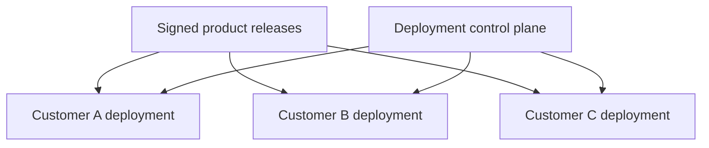
```mermaid
flowchart TB
    PRODUCT["Signed product releases"] --> A["Customer A deployment"]
    PRODUCT --> B["Customer B deployment"]
    PRODUCT --> C["Customer C deployment"]
    CONTROL["Deployment control plane"] --> A
    CONTROL --> B
    CONTROL --> C
```

### 2.3 Per-Customer Installation

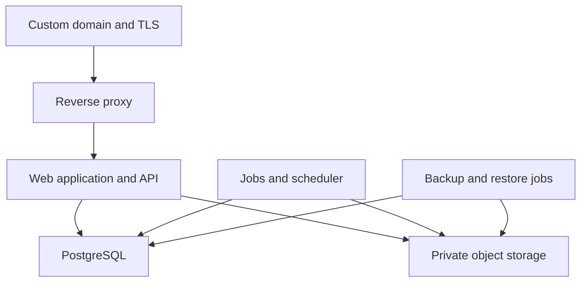
```mermaid
flowchart TB
    DOMAIN["Custom domain and TLS"] --> PROXY["Reverse proxy"]
    PROXY --> APP["Web application and API"]
    APP --> DB["PostgreSQL"]
    APP --> FILES["Private object storage"]
    WORKER["Jobs and scheduler"] --> DB
    WORKER --> FILES
    BACKUP["Backup and restore jobs"] --> DB
    BACKUP --> FILES
```

Installation rules:

1. PostgreSQL and internal services must not be exposed directly to the public internet.
2. Public application traffic must use HTTPS.
3. Web, API, and worker processes must run the same product release.
4. Every release must include numbered, repeatable database migrations.
5. A verified backup is required before production migration.
6. Customer differences must be represented by configuration, policy versions, or feature flags.
7. Manual edits to a customer's codebase are prohibited.
8. Deployment secrets must not be stored in the business tables or source repository.

### 2.4 Vendor Control Plane

The control plane is a separate vendor database and must never contain customer payroll, accounting, invoice, document, or employee records.

Recommended control-plane tables:

```text
customers
deployments
deployment_domains
licenses
product_releases
deployment_release_history
health_check_events
support_access_grants
```

The control plane may store:

- Deployment ID and customer reference.
- Product version and release channel.
- Approved domain names.
- License status and enabled commercial modules.
- Last health-check timestamp and non-sensitive service status.
- Approved support-access windows and audit events.

### 2.5 Group-Ready Deployment

A deployment may host one or more legal entities. This does not reduce customer isolation because all entities still belong to the same customer installation.

- Every financial transaction belongs to exactly one `organization_id`.
- Each legal entity owns its fiscal calendar, chart of accounts, tax profile, document sequences, and base currency.
- Branches cannot move between legal entities without a controlled migration.
- Cross-entity transactions use explicit intercompany documents and balancing accounts.
- Consolidated reporting is a separate reporting process; it never merges source ledgers.

---

## 3. Product Scope

### 3.1 Core Modules

| Module | Responsibility |
|---|---|
| System | Installation identity, features, jobs, migrations, and integrations |
| Core | Legal entities, branches, departments, positions, currencies, and cost centers |
| IAM | Users, roles, permissions, and data scopes |
| Parties | Customers, suppliers, contractors, government bodies, and bank details |
| HR | Employees, contracts, assignments, documents, and reporting lines |
| Time and Leave | Schedules, attendance, adjustments, leave policies, and balances |
| Payroll | Compensation, inputs, runs, payslips, loans, liabilities, and disbursement |
| Projects | Projects, members, tasks, time, budgets, and billing rules |
| Sales and AR | Contracts, invoices, credit notes, receipts, and receivable allocations |
| Procurement and AP | Requests, purchase orders, receipts, supplier bills, and payments |
| Expenses | Employee claims, direct expenses, receipts, and reimbursement |
| Treasury | Cashboxes, banks, transfers, statements, and reconciliation |
| Accounting | Chart of accounts, taxes, posting rules, journals, close, and revaluation |
| Assets | Fixed assets, custody, movements, depreciation, and disposal |
| Budgeting | Budget versions, scenarios, lines, forecasts, and variance analysis |
| Workflow | Approval policies, instances, actions, comments, and attachments |
| Reporting | Operational views, materialized views, dashboards, and saved filters |

### 3.2 Optional Industry Modules

These modules must plug into the accounting, project, workflow, and reporting foundations. They are not part of the first implementation unless a real customer requires them.

- Inventory and warehouse management.
- Manufacturing and bills of material.
- Field service and maintenance.
- Fleet management.
- CRM and sales pipeline.
- Recruitment and performance management.
- Advanced group consolidation.

### 3.3 Module Map

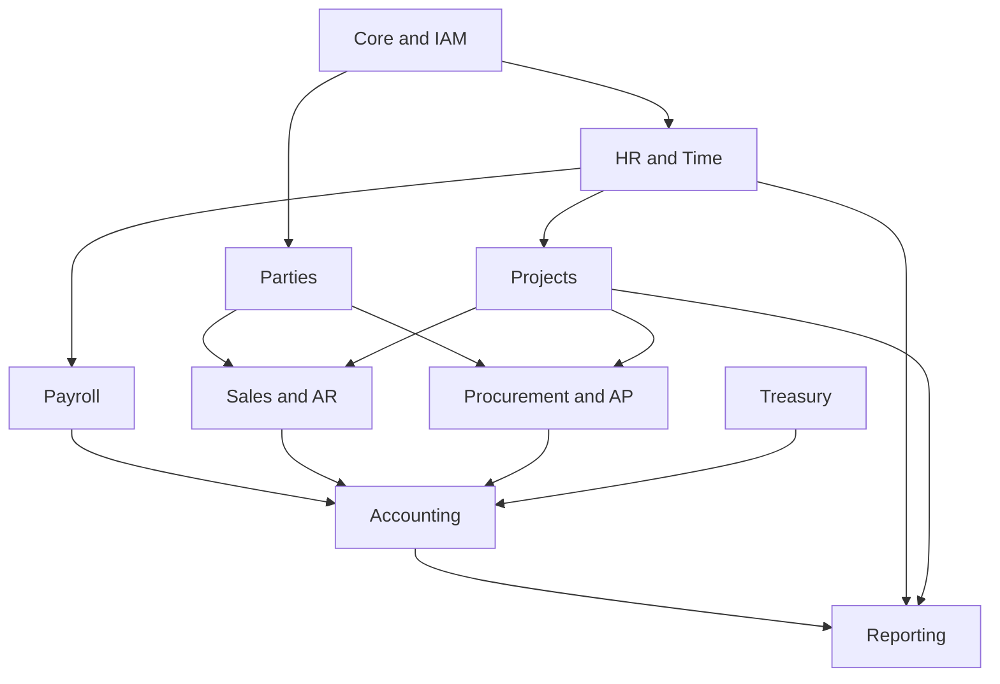
```mermaid
flowchart TB
    CORE["Core and IAM"] --> HR["HR and Time"]
    CORE --> PARTY["Parties"]
    HR --> PAY["Payroll"]
    HR --> PROJECT["Projects"]
    PARTY --> SALES["Sales and AR"]
    PARTY --> AP["Procurement and AP"]
    PROJECT --> SALES
    PROJECT --> AP
    PAY --> GL["Accounting"]
    SALES --> GL
    AP --> GL
    CASH["Treasury"] --> GL
    GL --> REPORT["Reporting"]
    HR --> REPORT
    PROJECT --> REPORT
```

---

## 4. Architecture Principles

### 4.1 Three-Layer Financial Model

1. **Operational document:** invoice, supplier bill, expense claim, payroll run, receipt, payment, or asset event.
2. **Accounting effect:** balanced journal entry generated after approval and posting.
3. **Analytical result:** view or materialized view derived from posted source data.

Operational documents describe the business event. The general ledger is the source of truth for statutory financial reporting. Dashboards are read models and never become an independent source of truth.

### 4.2 Authoritative Sources

| Question | Authoritative source |
|---|---|
| Employee's current department and manager | Effective `hr.employee_assignments` record |
| Historical employee salary | Posted `payroll.payslips` and `payroll.payslip_lines` snapshot |
| Revenue, expense, and profit | Posted `accounting.journal_lines` |
| Customer outstanding amount | Sales documents and allocations, reconciled with the AR control account |
| Supplier outstanding amount | Supplier documents and allocations, reconciled with the AP control account |
| Cash position | Posted treasury transactions and reconciled ledger accounts |
| Project profitability | Project-tagged ledger lines plus approved time and budget data |
| Leave balance | Sum of `hr.leave_ledger` movements |
| Fixed-asset book value | Acquisition, adjustment, and posted depreciation records |

### 4.3 Modular Monolith First

The first production architecture is a modular monolith:

- One deployable API application.
- One PostgreSQL database per customer deployment.
- One or more background workers.
- Explicit module boundaries and schema ownership.
- Transactional integration within the database.
- Outbox events for external integrations.

Microservices are introduced only when a measured scaling, ownership, or availability requirement justifies them.

### 4.4 Immutability and History

- Posted journals are immutable.
- Approved payroll results are versioned and snapshotted.
- Employee assignments, contracts, policies, rates, and tax rules use effective dates.
- Corrections create reversals, replacement versions, or adjustment records.
- Reference data is archived, not hard-deleted, once referenced.
- Audit records are append-only.

---

## 5. Database Schemas

| Schema | Ownership |
|---|---|
| `system` | Installation metadata, feature flags, jobs, and integrations |
| `core` | Organizations, branches, structures, currencies, dimensions, sequences |
| `iam` | Users, memberships, roles, permissions, and scopes |
| `party` | External people and organizations |
| `hr` | Employees, contracts, assignments, attendance, and leave |
| `payroll` | Compensation, payroll calculation, liabilities, and payments |
| `project` | Projects, work breakdown, members, time, budget, and billing |
| `sales` | Contracts, invoices, credit notes, receipts, and allocations |
| `procurement` | Purchase requests, orders, receipts, and supplier bills |
| `expense` | Employee and direct expense claims |
| `treasury` | Cash, bank, transfer, statement, and reconciliation records |
| `accounting` | Accounts, taxes, posting, journals, closing, and revaluation |
| `asset` | Fixed assets, depreciation, movements, and disposal |
| `budget` | Budgets, versions, lines, forecasts, and scenarios |
| `workflow` | Business objects, approvals, attachments, comments, and events |
| `reporting` | Views, materialized views, dashboard configuration, and exports |

---

## 6. Data Standards

### 6.1 Standard Record Columns

Aggregate roots use the following pattern where applicable:

```text
id                  uuid primary key
organization_id     uuid not null
business_object_id  uuid null
created_at          timestamptz not null
created_by          uuid null
updated_at          timestamptz not null
updated_by          uuid null
version_no          integer not null default 1
archived_at         timestamptz null
```

Rules:

- Generate UUIDs in the application or with an approved PostgreSQL function.
- Never expose a sequential database key as the only public identifier.
- Human-readable numbers such as `INV-2026-000123` come from `core.document_sequences`.
- Use `date` for effective dates and `timestamptz` for real-world events.
- Store timestamps in UTC.
- Use `text` for unconstrained names and descriptions.
- Use a controlled code plus translations for configurable reference values.
- Use `jsonb` only when a relational structure would not provide stronger integrity.

### 6.2 Monetary Values

- Transaction amount: `numeric(20,4)`.
- Quantity and hours: `numeric(20,6)`.
- Exchange rate: `numeric(20,10)`.
- Percentage or rate: `numeric(12,8)` unless the domain requires more.
- Never use floating-point types for money.
- Never use PostgreSQL's locale-sensitive `money` type as the accounting source.

Multi-currency lines store:

```text
transaction_currency_id
transaction_amount
exchange_rate
base_currency_id
base_amount
rate_type
rate_date
```

The applied exchange rate is a historical snapshot and is never recalculated using the current rate.

### 6.3 Status Fields

Do not overload one `status` column with unrelated meanings.

Use separate fields when applicable:

- `lifecycle_status`
- `approval_status`
- `posting_status`
- `payment_status`
- `reconciliation_status`

Stable technical states may use a constrained enum or check constraint. Configurable business classifications use reference tables.

### 6.4 Document Totals

A financial document header may store validated snapshot totals for fast reads:

```text
subtotal_amount
discount_amount
tax_amount
rounding_amount
total_amount
paid_amount
outstanding_amount
```

The database or domain service must verify that header totals reconcile to lines, taxes, discounts, allocations, and rounding policy.

### 6.5 Sensitive Data

- National identifiers and full bank account numbers require encryption or tokenization.
- User interfaces and logs display masked values by default.
- Passwords are managed by the authentication system, never by employee tables.
- Secrets, tokens, private keys, and SSH credentials are never stored in general metadata or audit snapshots.

---

## 7. ERD — Installation, Organization, and Access Control

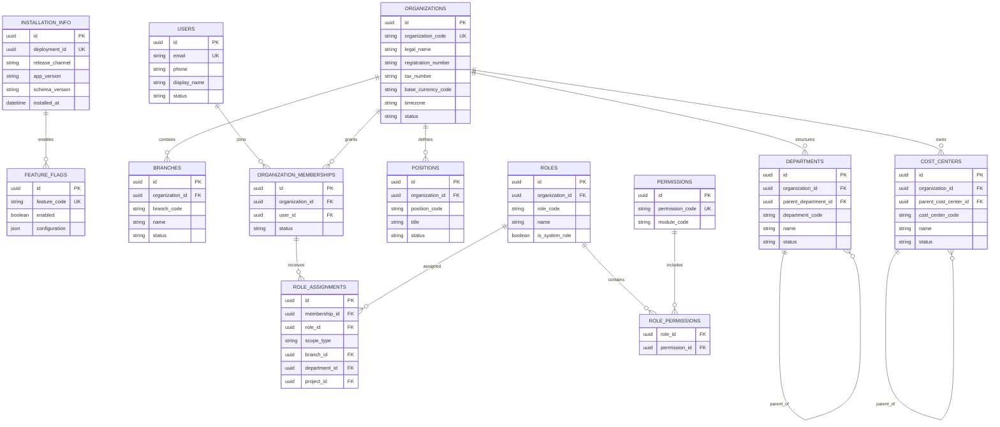
```mermaid
erDiagram
    INSTALLATION_INFO ||--o{ FEATURE_FLAGS : enables
    ORGANIZATIONS ||--o{ BRANCHES : contains
    ORGANIZATIONS ||--o{ DEPARTMENTS : structures
    DEPARTMENTS ||--o{ DEPARTMENTS : parent_of
    ORGANIZATIONS ||--o{ POSITIONS : defines
    ORGANIZATIONS ||--o{ COST_CENTERS : owns
    COST_CENTERS ||--o{ COST_CENTERS : parent_of
    USERS ||--o{ ORGANIZATION_MEMBERSHIPS : joins
    ORGANIZATIONS ||--o{ ORGANIZATION_MEMBERSHIPS : grants
    ORGANIZATION_MEMBERSHIPS ||--o{ ROLE_ASSIGNMENTS : receives
    ROLES ||--o{ ROLE_ASSIGNMENTS : assigned
    ROLES ||--o{ ROLE_PERMISSIONS : contains
    PERMISSIONS ||--o{ ROLE_PERMISSIONS : includes

    INSTALLATION_INFO {
      uuid id PK
      uuid deployment_id UK
      string release_channel
      string app_version
      string schema_version
      datetime installed_at
    }
    FEATURE_FLAGS {
      uuid id PK
      string feature_code UK
      boolean enabled
      json configuration
    }
    ORGANIZATIONS {
      uuid id PK
      string organization_code UK
      string legal_name
      string registration_number
      string tax_number
      string base_currency_code
      string timezone
      string status
    }
    BRANCHES {
      uuid id PK
      uuid organization_id FK
      string branch_code
      string name
      string status
    }
    DEPARTMENTS {
      uuid id PK
      uuid organization_id FK
      uuid parent_department_id FK
      string department_code
      string name
      string status
    }
    POSITIONS {
      uuid id PK
      uuid organization_id FK
      string position_code
      string title
      string status
    }
    COST_CENTERS {
      uuid id PK
      uuid organization_id FK
      uuid parent_cost_center_id FK
      string cost_center_code
      string name
      string status
    }
    USERS {
      uuid id PK
      string email UK
      string phone
      string display_name
      string status
    }
    ORGANIZATION_MEMBERSHIPS {
      uuid id PK
      uuid organization_id FK
      uuid user_id FK
      string status
    }
    ROLES {
      uuid id PK
      uuid organization_id FK
      string role_code
      string name
      boolean is_system_role
    }
    PERMISSIONS {
      uuid id PK
      string permission_code UK
      string module_code
    }
    ROLE_PERMISSIONS {
      uuid role_id FK
      uuid permission_id FK
    }
    ROLE_ASSIGNMENTS {
      uuid id PK
      uuid membership_id FK
      uuid role_id FK
      string scope_type
      uuid branch_id FK
      uuid department_id FK
      uuid project_id FK
    }
```

### 7.1 Permission Model

A permission answers **what** a user may do. A role assignment scope answers **where** the user may do it.

Examples:

- `payroll.run.create` for one legal entity.
- `payroll.run.approve` for all branches.
- `project.expense.read` for one project.
- `employee.profile.read_self` for the current employee only.
- `journal.manual.post` for finance administrators after approval.

The role assignment must enforce a valid scope combination. A project-scoped assignment cannot simultaneously point to an unrelated branch or department.

### 7.2 Organization Rules

- A branch belongs to one legal entity.
- A department and cost center may be hierarchical.
- A position is a reusable job definition; it is not the employee's historical assignment.
- Legal entity deletion is prohibited after any financial or payroll transaction exists.
- Organization code, branch code, department code, position code, and cost center code are unique within their documented scope.

---

## 8. ERD — Parties and Human Resources

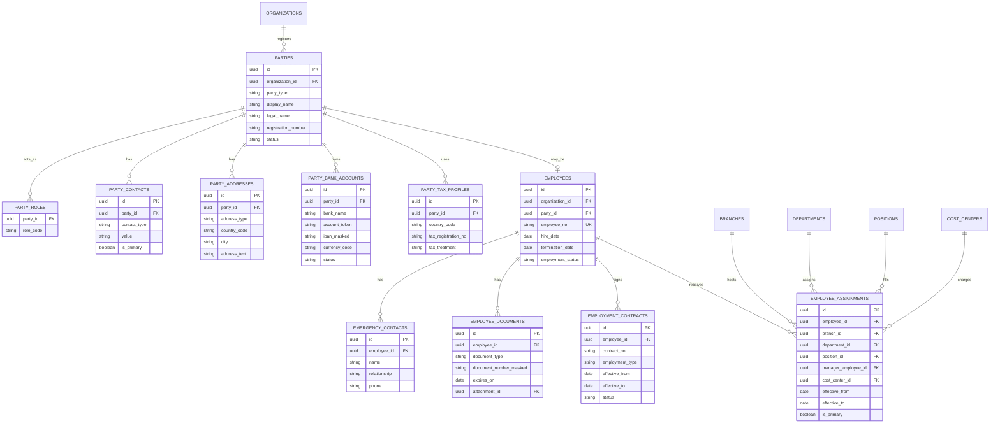
```mermaid
erDiagram
    ORGANIZATIONS ||--o{ PARTIES : registers
    PARTIES ||--o{ PARTY_ROLES : acts_as
    PARTIES ||--o{ PARTY_CONTACTS : has
    PARTIES ||--o{ PARTY_ADDRESSES : has
    PARTIES ||--o{ PARTY_BANK_ACCOUNTS : owns
    PARTIES ||--o{ PARTY_TAX_PROFILES : uses
    PARTIES ||--o| EMPLOYEES : may_be
    EMPLOYEES ||--o{ EMPLOYMENT_CONTRACTS : signs
    EMPLOYEES ||--o{ EMPLOYEE_ASSIGNMENTS : receives
    EMPLOYEES ||--o{ EMPLOYEE_DOCUMENTS : has
    EMPLOYEES ||--o{ EMERGENCY_CONTACTS : has
    BRANCHES ||--o{ EMPLOYEE_ASSIGNMENTS : hosts
    DEPARTMENTS ||--o{ EMPLOYEE_ASSIGNMENTS : assigns
    POSITIONS ||--o{ EMPLOYEE_ASSIGNMENTS : fills
    COST_CENTERS ||--o{ EMPLOYEE_ASSIGNMENTS : charges

    PARTIES {
      uuid id PK
      uuid organization_id FK
      string party_type
      string display_name
      string legal_name
      string registration_number
      string status
    }
    PARTY_ROLES {
      uuid party_id FK
      string role_code
    }
    PARTY_CONTACTS {
      uuid id PK
      uuid party_id FK
      string contact_type
      string value
      boolean is_primary
    }
    PARTY_ADDRESSES {
      uuid id PK
      uuid party_id FK
      string address_type
      string country_code
      string city
      string address_text
    }
    PARTY_BANK_ACCOUNTS {
      uuid id PK
      uuid party_id FK
      string bank_name
      string account_token
      string iban_masked
      string currency_code
      string status
    }
    PARTY_TAX_PROFILES {
      uuid id PK
      uuid party_id FK
      string country_code
      string tax_registration_no
      string tax_treatment
    }
    EMPLOYEES {
      uuid id PK
      uuid organization_id FK
      uuid party_id FK
      string employee_no UK
      date hire_date
      date termination_date
      string employment_status
    }
    EMPLOYMENT_CONTRACTS {
      uuid id PK
      uuid employee_id FK
      string contract_no
      string employment_type
      date effective_from
      date effective_to
      string status
    }
    EMPLOYEE_ASSIGNMENTS {
      uuid id PK
      uuid employee_id FK
      uuid branch_id FK
      uuid department_id FK
      uuid position_id FK
      uuid manager_employee_id FK
      uuid cost_center_id FK
      date effective_from
      date effective_to
      boolean is_primary
    }
    EMPLOYEE_DOCUMENTS {
      uuid id PK
      uuid employee_id FK
      string document_type
      string document_number_masked
      date expires_on
      uuid attachment_id FK
    }
    EMERGENCY_CONTACTS {
      uuid id PK
      uuid employee_id FK
      string name
      string relationship
      string phone
    }
```

### 8.1 Party Model

`party.parties` provides one identity for a person or external organization. `party.party_roles` allows the same party to be a customer, supplier, contractor, employee, government body, or another supported role without duplicating legal and contact data.

### 8.2 Employment History

`hr.employee_assignments` is effective-dated because transfers must preserve history. Reports for a prior period select the assignment effective during that period rather than the employee's current assignment.

Required constraints:

- An employee has at most one primary assignment for a given date.
- Assignment organization must match the employee organization.
- Branch, department, position, and cost center must belong to the same legal entity.
- A manager must be an active employee in a permitted reporting scope.
- Contract and assignment ranges must have `effective_from <= effective_to`.

---

## 9. ERD — Work Schedules, Attendance, and Leave

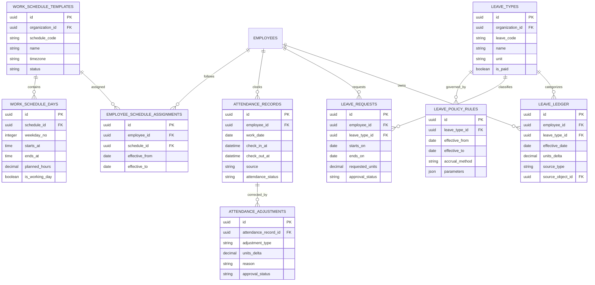
```mermaid
erDiagram
    WORK_SCHEDULE_TEMPLATES ||--o{ WORK_SCHEDULE_DAYS : contains
    EMPLOYEES ||--o{ EMPLOYEE_SCHEDULE_ASSIGNMENTS : follows
    WORK_SCHEDULE_TEMPLATES ||--o{ EMPLOYEE_SCHEDULE_ASSIGNMENTS : assigned
    EMPLOYEES ||--o{ ATTENDANCE_RECORDS : clocks
    ATTENDANCE_RECORDS ||--o{ ATTENDANCE_ADJUSTMENTS : corrected_by
    LEAVE_TYPES ||--o{ LEAVE_POLICY_RULES : governed_by
    EMPLOYEES ||--o{ LEAVE_REQUESTS : requests
    LEAVE_TYPES ||--o{ LEAVE_REQUESTS : classifies
    EMPLOYEES ||--o{ LEAVE_LEDGER : owns
    LEAVE_TYPES ||--o{ LEAVE_LEDGER : categorizes

    WORK_SCHEDULE_TEMPLATES {
      uuid id PK
      uuid organization_id FK
      string schedule_code
      string name
      string timezone
      string status
    }
    WORK_SCHEDULE_DAYS {
      uuid id PK
      uuid schedule_id FK
      integer weekday_no
      time starts_at
      time ends_at
      decimal planned_hours
      boolean is_working_day
    }
    EMPLOYEE_SCHEDULE_ASSIGNMENTS {
      uuid id PK
      uuid employee_id FK
      uuid schedule_id FK
      date effective_from
      date effective_to
    }
    ATTENDANCE_RECORDS {
      uuid id PK
      uuid employee_id FK
      date work_date
      datetime check_in_at
      datetime check_out_at
      string source
      string attendance_status
    }
    ATTENDANCE_ADJUSTMENTS {
      uuid id PK
      uuid attendance_record_id FK
      string adjustment_type
      decimal units_delta
      string reason
      string approval_status
    }
    LEAVE_TYPES {
      uuid id PK
      uuid organization_id FK
      string leave_code
      string name
      string unit
      boolean is_paid
    }
    LEAVE_POLICY_RULES {
      uuid id PK
      uuid leave_type_id FK
      date effective_from
      date effective_to
      string accrual_method
      json parameters
    }
    LEAVE_REQUESTS {
      uuid id PK
      uuid employee_id FK
      uuid leave_type_id FK
      date starts_on
      date ends_on
      decimal requested_units
      string approval_status
    }
    LEAVE_LEDGER {
      uuid id PK
      uuid employee_id FK
      uuid leave_type_id FK
      date effective_date
      decimal units_delta
      string source_type
      uuid source_object_id FK
    }
```

Attendance may be imported from a biometric device, mobile application, web entry, or approved manual adjustment. Raw source events should be retained when required for traceability.

Leave balances are derived from the leave ledger:

```text
opening grant
+ periodic accrual
+ approved adjustment
- approved leave usage
- expiry or forfeiture
= available balance
```

The current balance is not a freely editable employee field.

---

## 10. ERD — Payroll

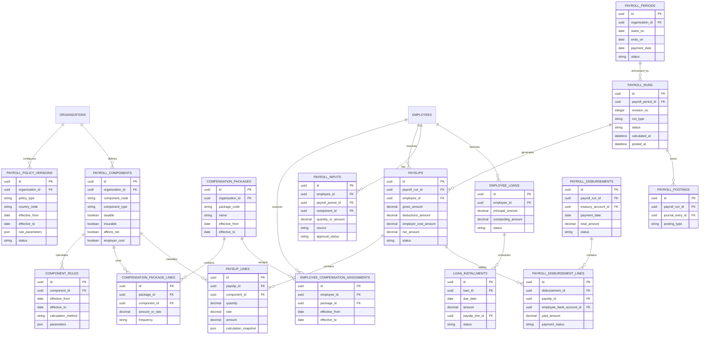
```mermaid
erDiagram
    ORGANIZATIONS ||--o{ PAYROLL_POLICY_VERSIONS : configures
    ORGANIZATIONS ||--o{ PAYROLL_COMPONENTS : defines
    PAYROLL_COMPONENTS ||--o{ COMPONENT_RULES : calculates
    COMPENSATION_PACKAGES ||--o{ COMPENSATION_PACKAGE_LINES : contains
    PAYROLL_COMPONENTS ||--o{ COMPENSATION_PACKAGE_LINES : uses
    EMPLOYEES ||--o{ EMPLOYEE_COMPENSATION_ASSIGNMENTS : receives
    COMPENSATION_PACKAGES ||--o{ EMPLOYEE_COMPENSATION_ASSIGNMENTS : assigns
    PAYROLL_PERIODS ||--o{ PAYROLL_RUNS : processed_by
    PAYROLL_RUNS ||--o{ PAYSLIPS : generates
    EMPLOYEES ||--o{ PAYSLIPS : receives
    PAYSLIPS ||--o{ PAYSLIP_LINES : contains
    PAYROLL_COMPONENTS ||--o{ PAYSLIP_LINES : classifies
    EMPLOYEES ||--o{ PAYROLL_INPUTS : has
    EMPLOYEES ||--o{ EMPLOYEE_LOANS : borrows
    EMPLOYEE_LOANS ||--o{ LOAN_INSTALLMENTS : schedules
    PAYROLL_RUNS ||--o{ PAYROLL_POSTINGS : posts
    PAYROLL_DISBURSEMENTS ||--o{ PAYROLL_DISBURSEMENT_LINES : contains
    PAYSLIPS ||--o{ PAYROLL_DISBURSEMENT_LINES : settles

    PAYROLL_POLICY_VERSIONS {
      uuid id PK
      uuid organization_id FK
      string policy_type
      string country_code
      date effective_from
      date effective_to
      json rule_parameters
      string status
    }
    PAYROLL_COMPONENTS {
      uuid id PK
      uuid organization_id FK
      string component_code
      string component_type
      boolean taxable
      boolean insurable
      boolean affects_net
      boolean employer_cost
    }
    COMPONENT_RULES {
      uuid id PK
      uuid component_id FK
      date effective_from
      date effective_to
      string calculation_method
      json parameters
    }
    COMPENSATION_PACKAGES {
      uuid id PK
      uuid organization_id FK
      string package_code
      string name
      date effective_from
      date effective_to
    }
    COMPENSATION_PACKAGE_LINES {
      uuid id PK
      uuid package_id FK
      uuid component_id FK
      decimal amount_or_rate
      string frequency
    }
    EMPLOYEE_COMPENSATION_ASSIGNMENTS {
      uuid id PK
      uuid employee_id FK
      uuid package_id FK
      date effective_from
      date effective_to
    }
    PAYROLL_PERIODS {
      uuid id PK
      uuid organization_id FK
      date starts_on
      date ends_on
      date payment_date
      string status
    }
    PAYROLL_RUNS {
      uuid id PK
      uuid payroll_period_id FK
      integer revision_no
      string run_type
      string status
      datetime calculated_at
      datetime posted_at
    }
    PAYSLIPS {
      uuid id PK
      uuid payroll_run_id FK
      uuid employee_id FK
      decimal gross_amount
      decimal deductions_amount
      decimal employer_cost_amount
      decimal net_amount
      string status
    }
    PAYSLIP_LINES {
      uuid id PK
      uuid payslip_id FK
      uuid component_id FK
      decimal quantity
      decimal rate
      decimal amount
      json calculation_snapshot
    }
    PAYROLL_INPUTS {
      uuid id PK
      uuid employee_id FK
      uuid payroll_period_id FK
      uuid component_id FK
      decimal quantity_or_amount
      string source
      string approval_status
    }
    EMPLOYEE_LOANS {
      uuid id PK
      uuid employee_id FK
      decimal principal_amount
      decimal outstanding_amount
      string status
    }
    LOAN_INSTALLMENTS {
      uuid id PK
      uuid loan_id FK
      date due_date
      decimal amount
      uuid payslip_line_id FK
      string status
    }
    PAYROLL_POSTINGS {
      uuid id PK
      uuid payroll_run_id FK
      uuid journal_entry_id FK
      string posting_type
    }
    PAYROLL_DISBURSEMENTS {
      uuid id PK
      uuid payroll_run_id FK
      uuid treasury_account_id FK
      date payment_date
      decimal total_amount
      string status
    }
    PAYROLL_DISBURSEMENT_LINES {
      uuid id PK
      uuid disbursement_id FK
      uuid payslip_id FK
      uuid employee_bank_account_id FK
      decimal paid_amount
      string payment_status
    }
```

### 10.1 Payroll Calculation Rules

- Compensation packages define expected components.
- Payroll inputs provide approved period-specific additions, deductions, overtime, absence, or bonuses.
- Policy versions provide tax, insurance, rounding, thresholds, and caps for the effective date.
- Payslip lines store the actual calculated result and a validated calculation snapshot.
- Rules must use a safe calculation DSL or known calculation methods. Executable JavaScript, SQL, or arbitrary code is prohibited.
- A posted run is immutable. Corrections create a new revision and accounting reversal or adjustment.
- A unique lock prevents concurrent posting for the same legal entity and payroll period.

### 10.2 Payroll Lifecycle

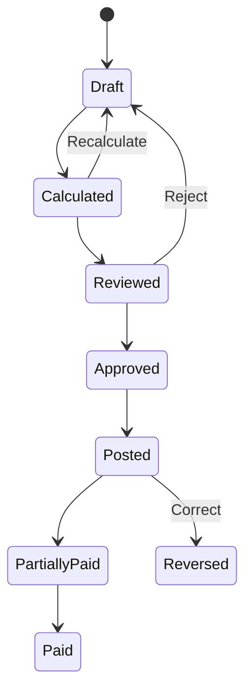
```mermaid
stateDiagram-v2
    [*] --> Draft
    Draft --> Calculated
    Calculated --> Reviewed
    Reviewed --> Approved
    Approved --> Posted
    Posted --> PartiallyPaid
    PartiallyPaid --> Paid
    Calculated --> Draft: Recalculate
    Reviewed --> Draft: Reject
    Posted --> Reversed: Correct
```

### 10.3 Egypt Policy Pack

The Egypt pack is a versioned configuration and validation package, not hard-coded permanent logic.

It may include:

- Tax brackets and effective dates.
- Employee and employer social-insurance rules.
- Minimum and maximum insurable bases.
- Exemptions, allowances, and rounding.
- Employer liabilities and payment due dates.
- Country-specific payroll reports.

Every production policy version must be validated by the customer's authorized payroll or legal specialist before activation.

---

## 11. ERD — Projects, Time, and Project Budgets

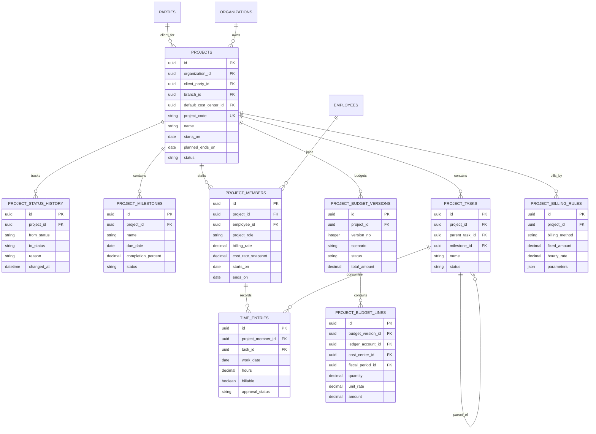
```mermaid
erDiagram
    PARTIES ||--o{ PROJECTS : client_for
    ORGANIZATIONS ||--o{ PROJECTS : owns
    PROJECTS ||--o{ PROJECT_STATUS_HISTORY : tracks
    PROJECTS ||--o{ PROJECT_MILESTONES : contains
    PROJECTS ||--o{ PROJECT_TASKS : contains
    PROJECT_TASKS ||--o{ PROJECT_TASKS : parent_of
    PROJECTS ||--o{ PROJECT_MEMBERS : staffs
    EMPLOYEES ||--o{ PROJECT_MEMBERS : joins
    PROJECT_MEMBERS ||--o{ TIME_ENTRIES : records
    PROJECT_TASKS ||--o{ TIME_ENTRIES : consumes
    PROJECTS ||--o{ PROJECT_BUDGET_VERSIONS : budgets
    PROJECT_BUDGET_VERSIONS ||--o{ PROJECT_BUDGET_LINES : contains
    PROJECTS ||--o{ PROJECT_BILLING_RULES : bills_by

    PROJECTS {
      uuid id PK
      uuid organization_id FK
      uuid client_party_id FK
      uuid branch_id FK
      uuid default_cost_center_id FK
      string project_code UK
      string name
      date starts_on
      date planned_ends_on
      string status
    }
    PROJECT_STATUS_HISTORY {
      uuid id PK
      uuid project_id FK
      string from_status
      string to_status
      string reason
      datetime changed_at
    }
    PROJECT_MILESTONES {
      uuid id PK
      uuid project_id FK
      string name
      date due_date
      decimal completion_percent
      string status
    }
    PROJECT_TASKS {
      uuid id PK
      uuid project_id FK
      uuid parent_task_id FK
      uuid milestone_id FK
      string name
      string status
    }
    PROJECT_MEMBERS {
      uuid id PK
      uuid project_id FK
      uuid employee_id FK
      string project_role
      decimal billing_rate
      decimal cost_rate_snapshot
      date starts_on
      date ends_on
    }
    TIME_ENTRIES {
      uuid id PK
      uuid project_member_id FK
      uuid task_id FK
      date work_date
      decimal hours
      boolean billable
      string approval_status
    }
    PROJECT_BUDGET_VERSIONS {
      uuid id PK
      uuid project_id FK
      integer version_no
      string scenario
      string status
      decimal total_amount
    }
    PROJECT_BUDGET_LINES {
      uuid id PK
      uuid budget_version_id FK
      uuid ledger_account_id FK
      uuid cost_center_id FK
      uuid fiscal_period_id FK
      decimal quantity
      decimal unit_rate
      decimal amount
    }
    PROJECT_BILLING_RULES {
      uuid id PK
      uuid project_id FK
      string billing_method
      decimal fixed_amount
      decimal hourly_rate
      json parameters
    }
```

Supported billing methods:

- Fixed price.
- Time and materials.
- Milestone-based.
- Cost plus margin.
- Recurring retainer.

Project profitability is calculated from posted journal lines tagged with `project_id`. Time entries support labor utilization and costing but do not independently define statutory project profit.

---

## 12. ERD — Sales and Accounts Receivable

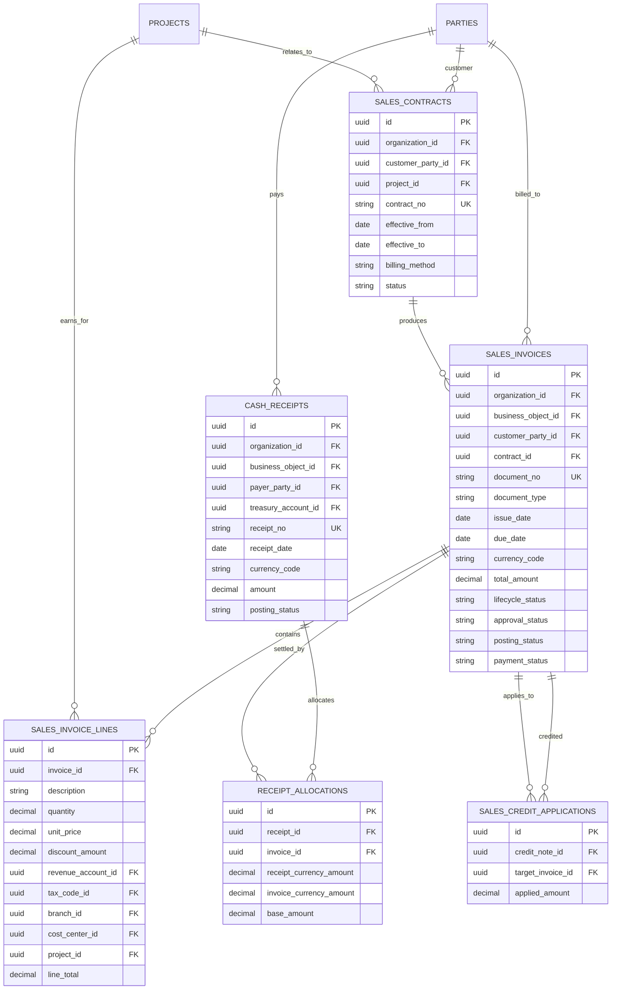
```mermaid
erDiagram
    PARTIES ||--o{ SALES_CONTRACTS : customer
    PROJECTS ||--o{ SALES_CONTRACTS : relates_to
    PARTIES ||--o{ SALES_INVOICES : billed_to
    SALES_CONTRACTS ||--o{ SALES_INVOICES : produces
    SALES_INVOICES ||--o{ SALES_INVOICE_LINES : contains
    PROJECTS ||--o{ SALES_INVOICE_LINES : earns_for
    PARTIES ||--o{ CASH_RECEIPTS : pays
    CASH_RECEIPTS ||--o{ RECEIPT_ALLOCATIONS : allocates
    SALES_INVOICES ||--o{ RECEIPT_ALLOCATIONS : settled_by
    SALES_INVOICES ||--o{ SALES_CREDIT_APPLICATIONS : credited
    SALES_INVOICES ||--o{ SALES_CREDIT_APPLICATIONS : applies_to

    SALES_CONTRACTS {
      uuid id PK
      uuid organization_id FK
      uuid customer_party_id FK
      uuid project_id FK
      string contract_no UK
      date effective_from
      date effective_to
      string billing_method
      string status
    }
    SALES_INVOICES {
      uuid id PK
      uuid organization_id FK
      uuid business_object_id FK
      uuid customer_party_id FK
      uuid contract_id FK
      string document_no UK
      string document_type
      date issue_date
      date due_date
      string currency_code
      decimal total_amount
      string lifecycle_status
      string approval_status
      string posting_status
      string payment_status
    }
    SALES_INVOICE_LINES {
      uuid id PK
      uuid invoice_id FK
      string description
      decimal quantity
      decimal unit_price
      decimal discount_amount
      uuid revenue_account_id FK
      uuid tax_code_id FK
      uuid branch_id FK
      uuid cost_center_id FK
      uuid project_id FK
      decimal line_total
    }
    CASH_RECEIPTS {
      uuid id PK
      uuid organization_id FK
      uuid business_object_id FK
      uuid payer_party_id FK
      uuid treasury_account_id FK
      string receipt_no UK
      date receipt_date
      string currency_code
      decimal amount
      string posting_status
    }
    RECEIPT_ALLOCATIONS {
      uuid id PK
      uuid receipt_id FK
      uuid invoice_id FK
      decimal receipt_currency_amount
      decimal invoice_currency_amount
      decimal base_amount
    }
    SALES_CREDIT_APPLICATIONS {
      uuid id PK
      uuid credit_note_id FK
      uuid target_invoice_id FK
      decimal applied_amount
    }
```

### 12.1 Receivable Rules

- A receipt may settle several invoices.
- An invoice may be settled by several receipts and credit notes.
- Allocations are explicit many-to-many records.
- Unapplied receipts are permitted only when business policy allows customer advances.
- A credit note is a separate document linked to the original invoice; it does not overwrite the invoice.
- Invoice posting recognizes receivable and revenue according to the configured posting rule.
- Receipt posting recognizes treasury and reduces receivable.
- Operational outstanding balances must reconcile to the AR control account.

---

## 13. ERD — Procurement, Accounts Payable, and Expenses

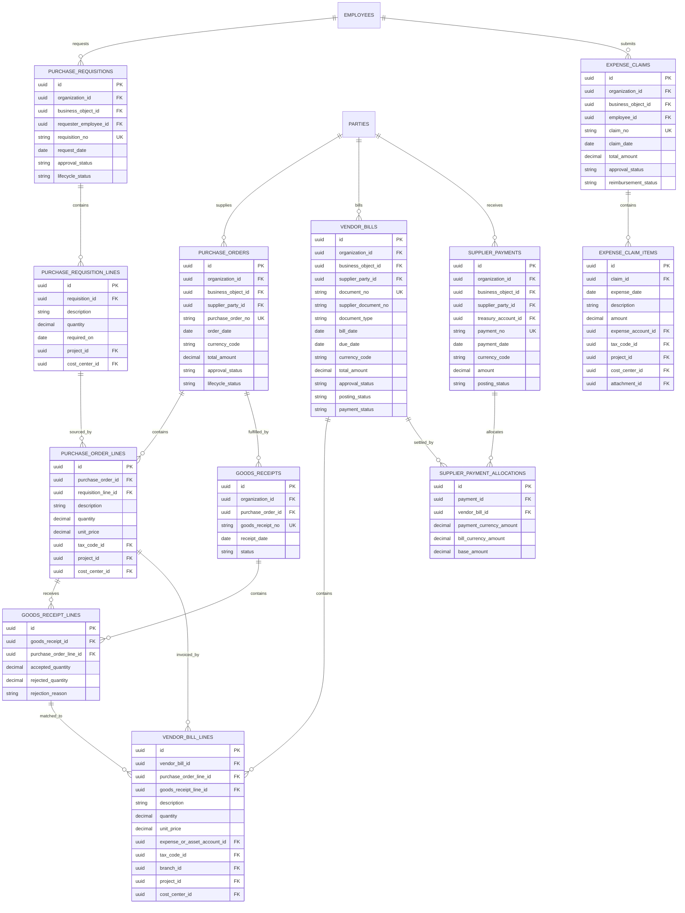
```mermaid
erDiagram
    EMPLOYEES ||--o{ PURCHASE_REQUISITIONS : requests
    PURCHASE_REQUISITIONS ||--o{ PURCHASE_REQUISITION_LINES : contains
    PARTIES ||--o{ PURCHASE_ORDERS : supplies
    PURCHASE_ORDERS ||--o{ PURCHASE_ORDER_LINES : contains
    PURCHASE_REQUISITION_LINES ||--o{ PURCHASE_ORDER_LINES : sourced_by
    PURCHASE_ORDERS ||--o{ GOODS_RECEIPTS : fulfilled_by
    GOODS_RECEIPTS ||--o{ GOODS_RECEIPT_LINES : contains
    PURCHASE_ORDER_LINES ||--o{ GOODS_RECEIPT_LINES : receives
    PARTIES ||--o{ VENDOR_BILLS : bills
    VENDOR_BILLS ||--o{ VENDOR_BILL_LINES : contains
    PURCHASE_ORDER_LINES ||--o{ VENDOR_BILL_LINES : invoiced_by
    GOODS_RECEIPT_LINES ||--o{ VENDOR_BILL_LINES : matched_to
    PARTIES ||--o{ SUPPLIER_PAYMENTS : receives
    SUPPLIER_PAYMENTS ||--o{ SUPPLIER_PAYMENT_ALLOCATIONS : allocates
    VENDOR_BILLS ||--o{ SUPPLIER_PAYMENT_ALLOCATIONS : settled_by
    EMPLOYEES ||--o{ EXPENSE_CLAIMS : submits
    EXPENSE_CLAIMS ||--o{ EXPENSE_CLAIM_ITEMS : contains

    PURCHASE_REQUISITIONS {
      uuid id PK
      uuid organization_id FK
      uuid business_object_id FK
      uuid requester_employee_id FK
      string requisition_no UK
      date request_date
      string approval_status
      string lifecycle_status
    }
    PURCHASE_REQUISITION_LINES {
      uuid id PK
      uuid requisition_id FK
      string description
      decimal quantity
      date required_on
      uuid project_id FK
      uuid cost_center_id FK
    }
    PURCHASE_ORDERS {
      uuid id PK
      uuid organization_id FK
      uuid business_object_id FK
      uuid supplier_party_id FK
      string purchase_order_no UK
      date order_date
      string currency_code
      decimal total_amount
      string approval_status
      string lifecycle_status
    }
    PURCHASE_ORDER_LINES {
      uuid id PK
      uuid purchase_order_id FK
      uuid requisition_line_id FK
      string description
      decimal quantity
      decimal unit_price
      uuid tax_code_id FK
      uuid project_id FK
      uuid cost_center_id FK
    }
    GOODS_RECEIPTS {
      uuid id PK
      uuid organization_id FK
      uuid purchase_order_id FK
      string goods_receipt_no UK
      date receipt_date
      string status
    }
    GOODS_RECEIPT_LINES {
      uuid id PK
      uuid goods_receipt_id FK
      uuid purchase_order_line_id FK
      decimal accepted_quantity
      decimal rejected_quantity
      string rejection_reason
    }
    VENDOR_BILLS {
      uuid id PK
      uuid organization_id FK
      uuid business_object_id FK
      uuid supplier_party_id FK
      string document_no UK
      string supplier_document_no
      string document_type
      date bill_date
      date due_date
      string currency_code
      decimal total_amount
      string approval_status
      string posting_status
      string payment_status
    }
    VENDOR_BILL_LINES {
      uuid id PK
      uuid vendor_bill_id FK
      uuid purchase_order_line_id FK
      uuid goods_receipt_line_id FK
      string description
      decimal quantity
      decimal unit_price
      uuid expense_or_asset_account_id FK
      uuid tax_code_id FK
      uuid branch_id FK
      uuid project_id FK
      uuid cost_center_id FK
    }
    SUPPLIER_PAYMENTS {
      uuid id PK
      uuid organization_id FK
      uuid business_object_id FK
      uuid supplier_party_id FK
      uuid treasury_account_id FK
      string payment_no UK
      date payment_date
      string currency_code
      decimal amount
      string posting_status
    }
    SUPPLIER_PAYMENT_ALLOCATIONS {
      uuid id PK
      uuid payment_id FK
      uuid vendor_bill_id FK
      decimal payment_currency_amount
      decimal bill_currency_amount
      decimal base_amount
    }
    EXPENSE_CLAIMS {
      uuid id PK
      uuid organization_id FK
      uuid business_object_id FK
      uuid employee_id FK
      string claim_no UK
      date claim_date
      decimal total_amount
      string approval_status
      string reimbursement_status
    }
    EXPENSE_CLAIM_ITEMS {
      uuid id PK
      uuid claim_id FK
      date expense_date
      string description
      decimal amount
      uuid expense_account_id FK
      uuid tax_code_id FK
      uuid project_id FK
      uuid cost_center_id FK
      uuid attachment_id FK
    }
```

### 13.1 Procurement Controls

- Purchase requisition approval does not create a payable.
- Purchase order approval creates a commercial commitment, not a journal entry unless commitment accounting is enabled.
- Goods or service receipt records operational acceptance.
- Vendor bill approval and posting create the payable and expense, inventory, or asset entry.
- Three-way matching compares purchase order, accepted receipt, and vendor bill.
- Tolerance rules control permitted quantity and price variances.
- Supplier payment allocations are many-to-many and must reconcile with the AP control account.

### 13.2 Expense Claims

- Expense items require an expense category or ledger account, date, amount, and business purpose.
- Receipt requirements are policy-driven by amount and category.
- A claim may be charged across projects and cost centers at line level.
- Approval does not necessarily mean payment; reimbursement is a separate treasury event.
- Duplicate receipt detection may use attachment hash, merchant, date, and amount.

---

## 14. ERD — Treasury and Bank Reconciliation

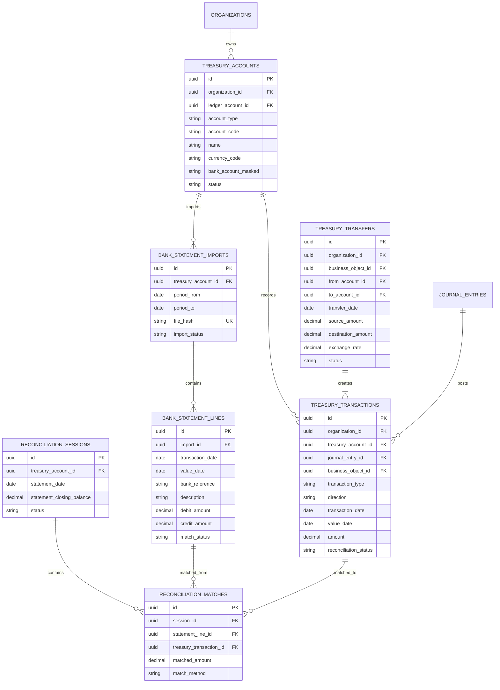
```mermaid
erDiagram
    ORGANIZATIONS ||--o{ TREASURY_ACCOUNTS : owns
    TREASURY_ACCOUNTS ||--o{ TREASURY_TRANSACTIONS : records
    TREASURY_ACCOUNTS ||--o{ BANK_STATEMENT_IMPORTS : imports
    BANK_STATEMENT_IMPORTS ||--o{ BANK_STATEMENT_LINES : contains
    RECONCILIATION_SESSIONS ||--o{ RECONCILIATION_MATCHES : contains
    BANK_STATEMENT_LINES ||--o{ RECONCILIATION_MATCHES : matched_from
    TREASURY_TRANSACTIONS ||--o{ RECONCILIATION_MATCHES : matched_to
    TREASURY_TRANSFERS ||--|{ TREASURY_TRANSACTIONS : creates
    JOURNAL_ENTRIES ||--o{ TREASURY_TRANSACTIONS : posts

    TREASURY_ACCOUNTS {
      uuid id PK
      uuid organization_id FK
      uuid ledger_account_id FK
      string account_type
      string account_code
      string name
      string currency_code
      string bank_account_masked
      string status
    }
    TREASURY_TRANSACTIONS {
      uuid id PK
      uuid organization_id FK
      uuid treasury_account_id FK
      uuid journal_entry_id FK
      uuid business_object_id FK
      string transaction_type
      string direction
      date transaction_date
      date value_date
      decimal amount
      string reconciliation_status
    }
    TREASURY_TRANSFERS {
      uuid id PK
      uuid organization_id FK
      uuid business_object_id FK
      uuid from_account_id FK
      uuid to_account_id FK
      date transfer_date
      decimal source_amount
      decimal destination_amount
      decimal exchange_rate
      string status
    }
    BANK_STATEMENT_IMPORTS {
      uuid id PK
      uuid treasury_account_id FK
      date period_from
      date period_to
      string file_hash UK
      string import_status
    }
    BANK_STATEMENT_LINES {
      uuid id PK
      uuid import_id FK
      date transaction_date
      date value_date
      string bank_reference
      string description
      decimal debit_amount
      decimal credit_amount
      string match_status
    }
    RECONCILIATION_SESSIONS {
      uuid id PK
      uuid treasury_account_id FK
      date statement_date
      decimal statement_closing_balance
      string status
    }
    RECONCILIATION_MATCHES {
      uuid id PK
      uuid session_id FK
      uuid statement_line_id FK
      uuid treasury_transaction_id FK
      decimal matched_amount
      string match_method
    }
```

Treasury rules:

- A treasury account maps to exactly one posting ledger account in the same legal entity and currency policy.
- Transfers create linked outgoing and incoming treasury transactions.
- Cross-currency transfers store both source and destination amounts and the applied rate.
- Reconciliation supports one-to-one, one-to-many, many-to-one, and partial matches.
- Imported statement files use a content hash and account scope to prevent duplicate imports.
- Reconciled transactions cannot be silently altered.

---

## 15. ERD — General Ledger and Accounting

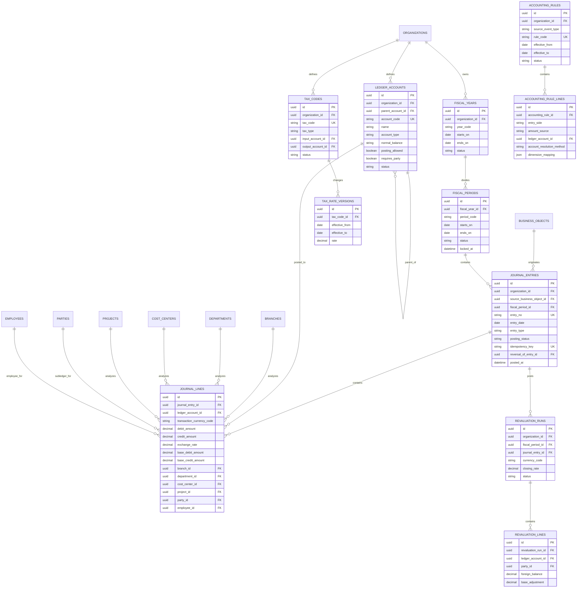
```mermaid
erDiagram
    ORGANIZATIONS ||--o{ FISCAL_YEARS : owns
    FISCAL_YEARS ||--o{ FISCAL_PERIODS : divides
    ORGANIZATIONS ||--o{ LEDGER_ACCOUNTS : defines
    LEDGER_ACCOUNTS ||--o{ LEDGER_ACCOUNTS : parent_of
    ORGANIZATIONS ||--o{ TAX_CODES : defines
    TAX_CODES ||--o{ TAX_RATE_VERSIONS : changes
    ACCOUNTING_RULES ||--o{ ACCOUNTING_RULE_LINES : contains
    BUSINESS_OBJECTS ||--o{ JOURNAL_ENTRIES : originates
    FISCAL_PERIODS ||--o{ JOURNAL_ENTRIES : contains
    JOURNAL_ENTRIES ||--o{ JOURNAL_LINES : contains
    LEDGER_ACCOUNTS ||--o{ JOURNAL_LINES : posted_to
    BRANCHES ||--o{ JOURNAL_LINES : analyzes
    DEPARTMENTS ||--o{ JOURNAL_LINES : analyzes
    COST_CENTERS ||--o{ JOURNAL_LINES : analyzes
    PROJECTS ||--o{ JOURNAL_LINES : analyzes
    PARTIES ||--o{ JOURNAL_LINES : subledger_for
    EMPLOYEES ||--o{ JOURNAL_LINES : employee_for
    REVALUATION_RUNS ||--o{ REVALUATION_LINES : contains
    JOURNAL_ENTRIES ||--o{ REVALUATION_RUNS : posts

    FISCAL_YEARS {
      uuid id PK
      uuid organization_id FK
      string year_code
      date starts_on
      date ends_on
      string status
    }
    FISCAL_PERIODS {
      uuid id PK
      uuid fiscal_year_id FK
      string period_code
      date starts_on
      date ends_on
      string status
      datetime locked_at
    }
    LEDGER_ACCOUNTS {
      uuid id PK
      uuid organization_id FK
      uuid parent_account_id FK
      string account_code UK
      string name
      string account_type
      string normal_balance
      boolean posting_allowed
      boolean requires_party
      string status
    }
    TAX_CODES {
      uuid id PK
      uuid organization_id FK
      string tax_code UK
      string tax_type
      uuid input_account_id FK
      uuid output_account_id FK
      string status
    }
    TAX_RATE_VERSIONS {
      uuid id PK
      uuid tax_code_id FK
      date effective_from
      date effective_to
      decimal rate
    }
    ACCOUNTING_RULES {
      uuid id PK
      uuid organization_id FK
      string source_event_type
      string rule_code UK
      date effective_from
      date effective_to
      string status
    }
    ACCOUNTING_RULE_LINES {
      uuid id PK
      uuid accounting_rule_id FK
      string entry_side
      string amount_source
      uuid ledger_account_id FK
      string account_resolution_method
      json dimension_mapping
    }
    JOURNAL_ENTRIES {
      uuid id PK
      uuid organization_id FK
      uuid source_business_object_id FK
      uuid fiscal_period_id FK
      string entry_no UK
      date entry_date
      string entry_type
      string posting_status
      string idempotency_key UK
      uuid reversal_of_entry_id FK
      datetime posted_at
    }
    JOURNAL_LINES {
      uuid id PK
      uuid journal_entry_id FK
      uuid ledger_account_id FK
      string transaction_currency_code
      decimal debit_amount
      decimal credit_amount
      decimal exchange_rate
      decimal base_debit_amount
      decimal base_credit_amount
      uuid branch_id FK
      uuid department_id FK
      uuid cost_center_id FK
      uuid project_id FK
      uuid party_id FK
      uuid employee_id FK
    }
    REVALUATION_RUNS {
      uuid id PK
      uuid organization_id FK
      uuid fiscal_period_id FK
      uuid journal_entry_id FK
      string currency_code
      decimal closing_rate
      string status
    }
    REVALUATION_LINES {
      uuid id PK
      uuid revaluation_run_id FK
      uuid ledger_account_id FK
      uuid party_id FK
      decimal foreign_balance
      decimal base_adjustment
    }
```

### 15.1 Non-Negotiable Ledger Invariants

1. Total base-currency debit equals total base-currency credit before posting.
2. A journal line has a positive debit or a positive credit, never both.
3. Posting to a closed period is prohibited.
4. Posting to a summary or non-posting account is prohibited.
5. A posted journal is immutable.
6. Corrections use a linked reversal and, when required, a replacement entry.
7. `idempotency_key` prevents the same source event from being posted twice.
8. A journal's organization, period, accounts, branches, projects, and dimensions must be compatible.
9. Manual journals require elevated permission and workflow approval.
10. Opening balances are posted journals, not editable account fields.

### 15.2 Posting Examples

| Business event | Debit | Credit |
|---|---|---|
| Customer invoice | Accounts receivable | Revenue and output tax |
| Customer receipt | Bank or cash | Accounts receivable |
| Vendor bill | Expense, inventory, or asset plus input tax | Accounts payable |
| Supplier payment | Accounts payable | Bank or cash |
| Payroll posting | Payroll expense and employer cost | Employee, tax, and insurance liabilities |
| Payroll disbursement | Employee liability | Bank or cash |
| Fixed-asset depreciation | Depreciation expense | Accumulated depreciation |
| Foreign-currency revaluation loss | FX loss | Revaluation adjustment |

### 15.3 Accounting Document Lifecycle

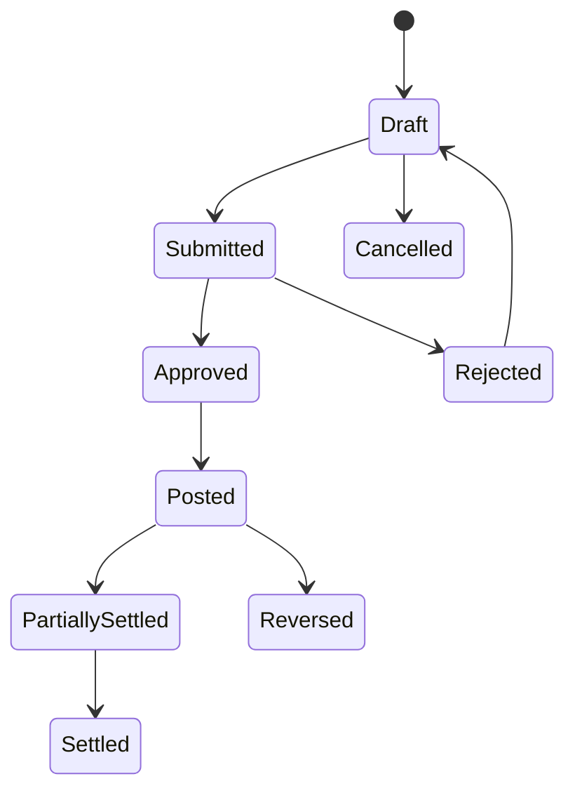
```mermaid
stateDiagram-v2
    [*] --> Draft
    Draft --> Submitted
    Submitted --> Approved
    Submitted --> Rejected
    Rejected --> Draft
    Approved --> Posted
    Posted --> PartiallySettled
    PartiallySettled --> Settled
    Posted --> Reversed
    Draft --> Cancelled
```

---

## 16. ERD — Multi-Entity and Consolidation

Advanced consolidation is optional, but the operational model must remain compatible with it.

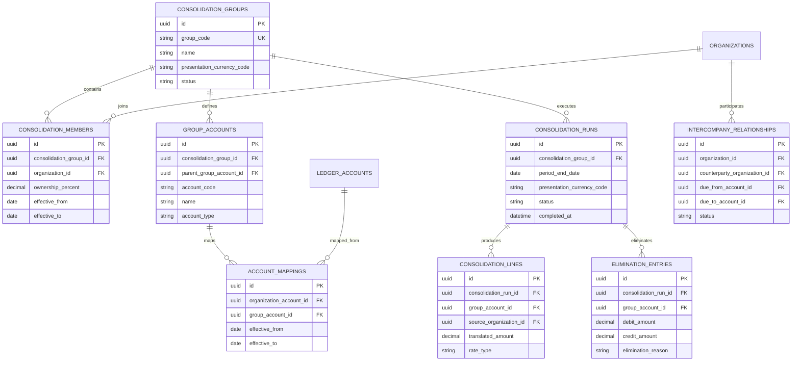
```mermaid
erDiagram
    CONSOLIDATION_GROUPS ||--o{ CONSOLIDATION_MEMBERS : contains
    ORGANIZATIONS ||--o{ CONSOLIDATION_MEMBERS : joins
    CONSOLIDATION_GROUPS ||--o{ GROUP_ACCOUNTS : defines
    GROUP_ACCOUNTS ||--o{ ACCOUNT_MAPPINGS : maps
    LEDGER_ACCOUNTS ||--o{ ACCOUNT_MAPPINGS : mapped_from
    CONSOLIDATION_GROUPS ||--o{ CONSOLIDATION_RUNS : executes
    CONSOLIDATION_RUNS ||--o{ CONSOLIDATION_LINES : produces
    CONSOLIDATION_RUNS ||--o{ ELIMINATION_ENTRIES : eliminates
    ORGANIZATIONS ||--o{ INTERCOMPANY_RELATIONSHIPS : participates

    CONSOLIDATION_GROUPS {
      uuid id PK
      string group_code UK
      string name
      string presentation_currency_code
      string status
    }
    CONSOLIDATION_MEMBERS {
      uuid id PK
      uuid consolidation_group_id FK
      uuid organization_id FK
      decimal ownership_percent
      date effective_from
      date effective_to
    }
    GROUP_ACCOUNTS {
      uuid id PK
      uuid consolidation_group_id FK
      uuid parent_group_account_id FK
      string account_code
      string name
      string account_type
    }
    ACCOUNT_MAPPINGS {
      uuid id PK
      uuid organization_account_id FK
      uuid group_account_id FK
      date effective_from
      date effective_to
    }
    CONSOLIDATION_RUNS {
      uuid id PK
      uuid consolidation_group_id FK
      date period_end_date
      string presentation_currency_code
      string status
      datetime completed_at
    }
    CONSOLIDATION_LINES {
      uuid id PK
      uuid consolidation_run_id FK
      uuid group_account_id FK
      uuid source_organization_id FK
      decimal translated_amount
      string rate_type
    }
    ELIMINATION_ENTRIES {
      uuid id PK
      uuid consolidation_run_id FK
      uuid group_account_id FK
      decimal debit_amount
      decimal credit_amount
      string elimination_reason
    }
    INTERCOMPANY_RELATIONSHIPS {
      uuid id PK
      uuid organization_id FK
      uuid counterparty_organization_id FK
      uuid due_from_account_id FK
      uuid due_to_account_id FK
      string status
    }
```

Consolidation rules:

- Each legal entity retains an independent ledger and base currency.
- Entity account mappings are effective-dated.
- Consolidation converts entity balances into a presentation currency.
- Intercompany balances and transactions are eliminated in the consolidation layer.
- Consolidation output never overwrites source entity journals.

---

## 17. ERD — Fixed Assets and Budgets

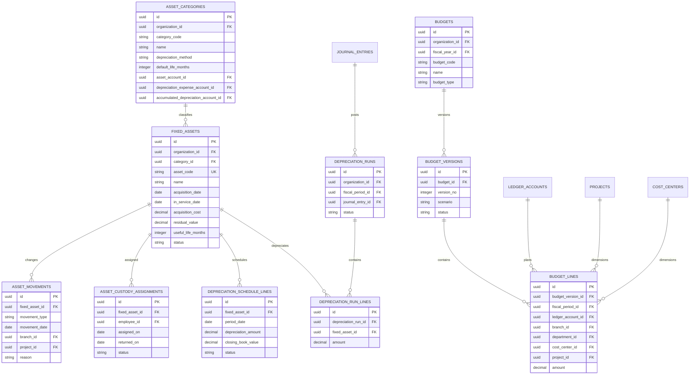
```mermaid
erDiagram
    ASSET_CATEGORIES ||--o{ FIXED_ASSETS : classifies
    FIXED_ASSETS ||--o{ ASSET_MOVEMENTS : changes
    FIXED_ASSETS ||--o{ ASSET_CUSTODY_ASSIGNMENTS : assigned
    FIXED_ASSETS ||--o{ DEPRECIATION_SCHEDULE_LINES : schedules
    DEPRECIATION_RUNS ||--o{ DEPRECIATION_RUN_LINES : contains
    FIXED_ASSETS ||--o{ DEPRECIATION_RUN_LINES : depreciates
    JOURNAL_ENTRIES ||--o{ DEPRECIATION_RUNS : posts
    BUDGETS ||--o{ BUDGET_VERSIONS : versions
    BUDGET_VERSIONS ||--o{ BUDGET_LINES : contains
    LEDGER_ACCOUNTS ||--o{ BUDGET_LINES : plans
    PROJECTS ||--o{ BUDGET_LINES : dimensions
    COST_CENTERS ||--o{ BUDGET_LINES : dimensions

    ASSET_CATEGORIES {
      uuid id PK
      uuid organization_id FK
      string category_code
      string name
      string depreciation_method
      integer default_life_months
      uuid asset_account_id FK
      uuid depreciation_expense_account_id FK
      uuid accumulated_depreciation_account_id FK
    }
    FIXED_ASSETS {
      uuid id PK
      uuid organization_id FK
      uuid category_id FK
      string asset_code UK
      string name
      date acquisition_date
      date in_service_date
      decimal acquisition_cost
      decimal residual_value
      integer useful_life_months
      string status
    }
    ASSET_MOVEMENTS {
      uuid id PK
      uuid fixed_asset_id FK
      string movement_type
      date movement_date
      uuid branch_id FK
      uuid project_id FK
      string reason
    }
    ASSET_CUSTODY_ASSIGNMENTS {
      uuid id PK
      uuid fixed_asset_id FK
      uuid employee_id FK
      date assigned_on
      date returned_on
      string status
    }
    DEPRECIATION_SCHEDULE_LINES {
      uuid id PK
      uuid fixed_asset_id FK
      date period_date
      decimal depreciation_amount
      decimal closing_book_value
      string status
    }
    DEPRECIATION_RUNS {
      uuid id PK
      uuid organization_id FK
      uuid fiscal_period_id FK
      uuid journal_entry_id FK
      string status
    }
    DEPRECIATION_RUN_LINES {
      uuid id PK
      uuid depreciation_run_id FK
      uuid fixed_asset_id FK
      decimal amount
    }
    BUDGETS {
      uuid id PK
      uuid organization_id FK
      uuid fiscal_year_id FK
      string budget_code
      string name
      string budget_type
    }
    BUDGET_VERSIONS {
      uuid id PK
      uuid budget_id FK
      integer version_no
      string scenario
      string status
    }
    BUDGET_LINES {
      uuid id PK
      uuid budget_version_id FK
      uuid fiscal_period_id FK
      uuid ledger_account_id FK
      uuid branch_id FK
      uuid department_id FK
      uuid cost_center_id FK
      uuid project_id FK
      decimal amount
    }
```

Asset and budget rules:

- Depreciation is calculated by a run and posted through a linked journal entry.
- Disposal creates an auditable asset event and accounting entry.
- Custody history is effective-dated and cannot be overwritten.
- Only one approved budget version is active for a defined scenario and period.
- Actual values always come from posted journal lines.
- Forecast and revised budget versions do not replace the original approved budget.

---

## 18. ERD — Workflow, Attachments, Audit, and Events

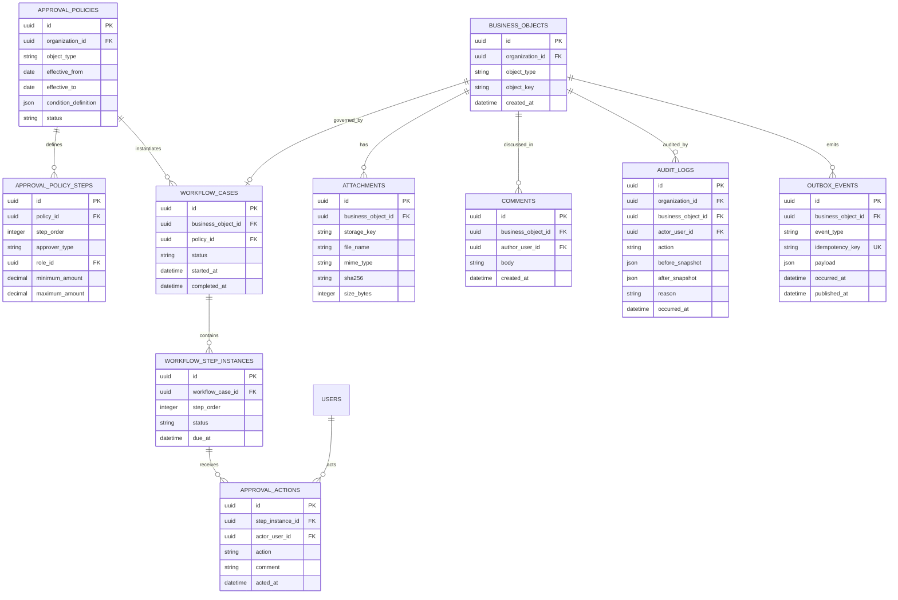
```mermaid
erDiagram
    BUSINESS_OBJECTS ||--o| WORKFLOW_CASES : governed_by
    APPROVAL_POLICIES ||--o{ APPROVAL_POLICY_STEPS : defines
    APPROVAL_POLICIES ||--o{ WORKFLOW_CASES : instantiates
    WORKFLOW_CASES ||--o{ WORKFLOW_STEP_INSTANCES : contains
    WORKFLOW_STEP_INSTANCES ||--o{ APPROVAL_ACTIONS : receives
    USERS ||--o{ APPROVAL_ACTIONS : acts
    BUSINESS_OBJECTS ||--o{ ATTACHMENTS : has
    BUSINESS_OBJECTS ||--o{ COMMENTS : discussed_in
    BUSINESS_OBJECTS ||--o{ AUDIT_LOGS : audited_by
    BUSINESS_OBJECTS ||--o{ OUTBOX_EVENTS : emits

    BUSINESS_OBJECTS {
      uuid id PK
      uuid organization_id FK
      string object_type
      string object_key
      datetime created_at
    }
    APPROVAL_POLICIES {
      uuid id PK
      uuid organization_id FK
      string object_type
      date effective_from
      date effective_to
      json condition_definition
      string status
    }
    APPROVAL_POLICY_STEPS {
      uuid id PK
      uuid policy_id FK
      integer step_order
      string approver_type
      uuid role_id FK
      decimal minimum_amount
      decimal maximum_amount
    }
    WORKFLOW_CASES {
      uuid id PK
      uuid business_object_id FK
      uuid policy_id FK
      string status
      datetime started_at
      datetime completed_at
    }
    WORKFLOW_STEP_INSTANCES {
      uuid id PK
      uuid workflow_case_id FK
      integer step_order
      string status
      datetime due_at
    }
    APPROVAL_ACTIONS {
      uuid id PK
      uuid step_instance_id FK
      uuid actor_user_id FK
      string action
      string comment
      datetime acted_at
    }
    ATTACHMENTS {
      uuid id PK
      uuid business_object_id FK
      string storage_key
      string file_name
      string mime_type
      string sha256
      integer size_bytes
    }
    COMMENTS {
      uuid id PK
      uuid business_object_id FK
      uuid author_user_id FK
      string body
      datetime created_at
    }
    AUDIT_LOGS {
      uuid id PK
      uuid organization_id FK
      uuid business_object_id FK
      uuid actor_user_id FK
      string action
      json before_snapshot
      json after_snapshot
      string reason
      datetime occurred_at
    }
    OUTBOX_EVENTS {
      uuid id PK
      uuid business_object_id FK
      string event_type
      string idempotency_key UK
      json payload
      datetime occurred_at
      datetime published_at
    }
```

`workflow.business_objects` provides a stable foreign-key target for generic workflow, attachments, comments, audit, and event records. Every supported aggregate root creates its business-object record in the same transaction.

Approval requirements:

- Policies are selected using object type, amount, branch, project, and other validated conditions.
- Self-approval may be prohibited by policy.
- Step assignment may target a user, role, manager chain, project role, or finance authority.
- Rejection, return-for-edit, delegation, escalation, and expiry are explicit actions.
- A completed approval history is immutable.

---

## 19. Complete Table Inventory

Delivery labels:

- **Foundation:** required before business modules.
- **Core:** required for the first complete ERP release.
- **Advanced:** enabled after the relevant core flow is stable.
- **Optional:** installed only when contract scope requires it.

### 19.1 `system`

| Table | Purpose | Delivery |
|---|---|---|
| `installation_info` | One-row deployment identity and version metadata | Foundation |
| `feature_flags` | Module and feature configuration without code forks | Foundation |
| `job_definitions` | Scheduled and background-job definitions | Core |
| `job_runs` | Execution history, result, duration, and non-secret error summary | Core |
| `distributed_locks` | Prevent duplicate critical job execution | Core |
| `integration_endpoints` | Encrypted, scoped external-integration configuration | Advanced |
| `schema_migrations` | Migration framework history; not a business table | Foundation |

### 19.2 `core`

| Table | Purpose | Delivery |
|---|---|---|
| `organizations` | Legal entities inside the customer deployment | Foundation |
| `organization_settings` | Base currency, timezone, numbering, and policy settings | Foundation |
| `branches` | Operating branches and locations | Foundation |
| `departments` | Hierarchical organization structure | Foundation |
| `positions` | Reusable job-position definitions | Foundation |
| `cost_centers` | Hierarchical cost-accounting dimension | Foundation |
| `currencies` | ISO currency reference | Foundation |
| `exchange_rates` | Effective-dated currency rates by source and rate type | Core |
| `document_sequences` | Concurrency-safe human document numbering | Foundation |
| `tags` | Controlled tags where a formal dimension is not required | Advanced |
| `custom_field_definitions` | Validated extension fields by object type | Optional |
| `custom_field_values` | Typed custom values linked to business objects | Optional |

### 19.3 `iam`

| Table | Purpose | Delivery |
|---|---|---|
| `users` | Authentication identity inside a customer deployment | Foundation |
| `organization_memberships` | User access to a legal entity | Foundation |
| `roles` | Configurable roles | Foundation |
| `permissions` | System-defined atomic permissions | Foundation |
| `role_permissions` | Permissions contained in roles | Foundation |
| `role_assignments` | Role grants with entity, branch, department, or project scope | Foundation |
| `user_sessions` | Device and session revocation metadata | Core |
| `login_events` | Successful and failed access events | Core |

### 19.4 `party`

| Table | Purpose | Delivery |
|---|---|---|
| `parties` | External person or organization identity | Foundation |
| `party_roles` | Customer, supplier, employee, contractor, bank, or government role | Foundation |
| `party_contacts` | Phones, emails, and named contacts | Core |
| `party_addresses` | Legal, billing, shipping, and site addresses | Core |
| `party_bank_accounts` | Tokenized or encrypted payment destinations | Core |
| `party_tax_profiles` | Registration numbers and tax treatment | Core |

### 19.5 `hr`

| Table | Purpose | Delivery |
|---|---|---|
| `employees` | Employment identity and number | Core |
| `employment_contracts` | Effective-dated contract versions | Core |
| `employee_assignments` | Branch, department, position, manager, and cost center history | Core |
| `employee_documents` | Identity, contract, certificate, and expiry metadata | Core |
| `employee_dependents` | Dependents relevant to benefits or policy | Advanced |
| `emergency_contacts` | Employee emergency contacts | Core |
| `work_schedule_templates` | Reusable work schedules | Core |
| `work_schedule_days` | Planned days, times, and hours | Core |
| `employee_schedule_assignments` | Effective schedule assignment | Core |
| `holidays` | Holidays by legal entity, country, or location | Core |
| `attendance_records` | Attendance events and calculated workday record | Core |
| `attendance_adjustments` | Approved correction trail | Core |
| `leave_types` | Leave classifications and units | Core |
| `leave_policy_rules` | Effective-dated accrual, carry, cap, and expiry rules | Core |
| `leave_requests` | Employee requests and workflow state | Core |
| `leave_ledger` | Append-only leave grants, accruals, usage, and expiry | Core |

### 19.6 `payroll`

| Table | Purpose | Delivery |
|---|---|---|
| `payroll_policy_versions` | Country and organization payroll policies by date | Core |
| `payroll_components` | Earnings, deductions, taxes, liabilities, and employer costs | Core |
| `component_rules` | Safe calculation methods and parameters | Core |
| `compensation_packages` | Reusable compensation packages | Core |
| `compensation_package_lines` | Components contained in a package | Core |
| `employee_compensation_assignments` | Effective package per employee | Core |
| `payroll_periods` | Payroll calculation and payment periods | Core |
| `payroll_runs` | Versioned payroll execution | Core |
| `payroll_inputs` | Approved overtime, bonus, deduction, absence, or manual input | Core |
| `payslips` | Employee payroll result snapshot | Core |
| `payslip_lines` | Detailed result and calculation snapshot | Core |
| `employee_loans` | Employee loan principal, terms, and status | Advanced |
| `loan_installments` | Scheduled and deducted loan installments | Advanced |
| `employee_advances` | Short-term employee advances and settlement | Advanced |
| `payroll_postings` | Links payroll runs to journal entries | Core |
| `payroll_disbursements` | Payroll payment batch | Core |
| `payroll_disbursement_lines` | Employee-level payment and settlement | Core |

### 19.7 `project`

| Table | Purpose | Delivery |
|---|---|---|
| `projects` | Project identity, customer, dates, status, and default dimensions | Core |
| `project_status_history` | Auditable status transitions | Core |
| `project_milestones` | Contractual or internal milestones | Core |
| `project_tasks` | Hierarchical work breakdown | Core |
| `project_members` | Employee project role and rate snapshot | Core |
| `time_entries` | Approved billable and non-billable time | Core |
| `project_budget_versions` | Project budget scenarios and versions | Core |
| `project_budget_lines` | Budget by period, account, and cost center | Core |
| `project_billing_rules` | Fixed, time, milestone, cost-plus, or recurring billing | Core |
| `revenue_recognition_runs` | Optional accrual and recognition process | Advanced |

### 19.8 `sales`

| Table | Purpose | Delivery |
|---|---|---|
| `sales_contracts` | Customer commercial terms and billing method | Core |
| `sales_invoices` | Invoice or credit-note header | Core |
| `sales_invoice_lines` | Revenue, tax, project, and cost-center detail | Core |
| `sales_credit_applications` | Credit-note allocation to invoices | Core |
| `cash_receipts` | Customer or other incoming payment document | Core |
| `receipt_allocations` | Receipt allocation across invoices | Core |

### 19.9 `procurement` and `expense`

| Table | Purpose | Delivery |
|---|---|---|
| `purchase_requisitions` | Internal purchase request | Core |
| `purchase_requisition_lines` | Requested items or services and dimensions | Core |
| `purchase_orders` | Approved supplier order | Core |
| `purchase_order_lines` | Ordered quantity, price, tax, project, and cost center | Core |
| `goods_receipts` | Goods or service acceptance document | Core |
| `goods_receipt_lines` | Accepted and rejected quantities | Core |
| `vendor_bills` | Supplier bill or supplier credit note | Core |
| `vendor_bill_lines` | Expense, asset, inventory, tax, and dimensions | Core |
| `supplier_payments` | Outgoing supplier payment | Core |
| `supplier_payment_allocations` | Payment allocation across bills | Core |
| `expense_claims` | Employee expense claim | Core |
| `expense_claim_items` | Receipt-level expense details | Core |

### 19.10 `treasury`

| Table | Purpose | Delivery |
|---|---|---|
| `treasury_accounts` | Cashbox, bank, card clearing, or wallet account | Core |
| `treasury_transactions` | Operational incoming and outgoing cash movement | Core |
| `treasury_transfers` | Transfer between treasury accounts | Core |
| `bank_statement_imports` | Imported file identity and duplicate prevention | Core |
| `bank_statement_lines` | Normalized bank statement rows | Core |
| `reconciliation_sessions` | Reconciliation period and closing balance | Core |
| `reconciliation_matches` | Partial or grouped statement matching | Core |

### 19.11 `accounting`

| Table | Purpose | Delivery |
|---|---|---|
| `fiscal_years` | Legal-entity fiscal years | Foundation |
| `fiscal_periods` | Open, soft-closed, and locked accounting periods | Foundation |
| `ledger_accounts` | Hierarchical chart of accounts | Foundation |
| `tax_codes` | Input, output, withholding, and other tax behavior | Core |
| `tax_rate_versions` | Effective-dated tax rates | Core |
| `accounting_rules` | Posting rule selected by business event | Core |
| `accounting_rule_lines` | Debit, credit, account resolution, and dimension mapping | Core |
| `posting_batches` | Atomic posting execution and retry control | Core |
| `journal_entries` | Journal header and source identity | Foundation |
| `journal_lines` | Debit, credit, currency, and analysis dimensions | Foundation |
| `period_close_runs` | Period-close checklist and result | Core |
| `revaluation_runs` | Foreign-currency closing revaluation | Advanced |
| `revaluation_lines` | Revaluation detail by account and party | Advanced |
| `balance_snapshots` | Rebuildable performance snapshot for closed periods | Advanced |
| `intercompany_relationships` | Due-to and due-from configuration | Advanced |
| `consolidation_groups` | Reporting group definition | Advanced |
| `consolidation_members` | Effective legal-entity membership | Advanced |
| `group_accounts` | Consolidated chart of accounts | Advanced |
| `account_mappings` | Entity-to-group account mapping | Advanced |
| `consolidation_runs` | Period consolidation execution | Advanced |
| `consolidation_lines` | Translated consolidated balances | Advanced |
| `elimination_entries` | Intercompany and consolidation adjustments | Advanced |

### 19.12 `asset` and `budget`

| Table | Purpose | Delivery |
|---|---|---|
| `asset_categories` | Default depreciation method, life, and ledger mapping | Advanced |
| `fixed_assets` | Asset identity, cost, life, and current status | Advanced |
| `asset_movements` | Acquisition, transfer, improvement, disposal, or retirement | Advanced |
| `asset_custody_assignments` | Employee custody history | Advanced |
| `depreciation_schedule_lines` | Expected depreciation schedule | Advanced |
| `depreciation_runs` | Period depreciation process and journal link | Advanced |
| `depreciation_run_lines` | Calculated depreciation per asset | Advanced |
| `budgets` | Budget header, year, and type | Core |
| `budget_versions` | Original, revised, forecast, and scenario versions | Core |
| `budget_lines` | Amount by account, period, and reporting dimensions | Core |

### 19.13 `workflow` and `reporting`

| Table | Purpose | Delivery |
|---|---|---|
| `business_objects` | Stable generic identity for aggregate roots | Foundation |
| `approval_policies` | Effective workflow selection rules | Foundation |
| `approval_policy_steps` | Ordered approver definitions | Foundation |
| `workflow_cases` | Workflow instance for one business object | Foundation |
| `workflow_step_instances` | Executed step state and deadline | Foundation |
| `approval_actions` | Approve, reject, return, delegate, or escalate action | Foundation |
| `attachments` | Object-storage metadata and content hash | Foundation |
| `comments` | Discussion records linked to an object | Core |
| `audit_logs` | Append-only change and security audit | Foundation |
| `outbox_events` | Reliable integration event delivery | Core |
| `notifications` | Delivery channel, recipient, and read state | Core |
| `dashboards` | System or user dashboard definition | Core |
| `dashboard_widgets` | Widget query identifier, layout, and configuration | Core |
| `saved_filters` | Validated report filters without arbitrary SQL | Core |
| `report_exports` | Asynchronous export request and secure result metadata | Core |

---

## 20. Reporting, Dashboards, and KPIs

### 20.1 Shared Filter Dimensions

All dashboards and reports must use a consistent filter model:

- Date, week, month, quarter, fiscal period, fiscal year, or custom range.
- Legal entity and consolidation group.
- Branch and department.
- Cost center and project.
- Customer, supplier, or other party.
- Employee, manager, position, and employment status.
- Ledger account and account type.
- Currency, rate type, and presentation currency.
- Document lifecycle, approval, posting, payment, and reconciliation states.
- Record creator, approver, and source.

Project, department, branch, and cost-center dimensions belong on transaction lines when one document may be split across several dimensions.

### 20.2 Canonical Views

| View | Purpose |
|---|---|
| `reporting.vw_general_ledger` | Posted journal lines with resolved dimensions |
| `reporting.vw_trial_balance` | Opening, debit, credit, and closing balance |
| `reporting.vw_profit_and_loss` | Revenue and expense by period and dimension |
| `reporting.vw_balance_sheet` | Assets, liabilities, and equity |
| `reporting.vw_cash_flow` | Direct or indirect cash-flow presentation |
| `reporting.vw_receivables_aging` | Customer outstanding balances by aging bucket |
| `reporting.vw_payables_aging` | Supplier outstanding balances by aging bucket |
| `reporting.vw_project_profitability` | Revenue, cost, budget, margin, and time |
| `reporting.vw_budget_vs_actual` | Approved budget compared with posted actuals |
| `reporting.vw_employee_current_assignment` | Assignment effective at the report date |
| `reporting.vw_headcount` | Active employee population and movement |
| `reporting.vw_payroll_summary` | Gross, deductions, net, and employer cost |
| `reporting.vw_leave_balances` | Derived employee leave balances |
| `reporting.vw_cash_position` | Cash and bank balances by currency |
| `reporting.vw_asset_register` | Cost, depreciation, book value, custody, and status |

### 20.3 KPI Definitions

| KPI | Controlled definition |
|---|---|
| Actual revenue | Net movement of revenue accounts from posted journal lines |
| Actual expense | Net movement of expense accounts from posted journal lines |
| Net profit | Actual revenue minus actual expense under the configured sign convention |
| Cash collected | Posted incoming treasury transactions during the selected period |
| Cash paid | Posted outgoing treasury transactions during the selected period |
| Accounts receivable | Open sales documents minus receipt and credit allocations at cutoff |
| Accounts payable | Open supplier documents minus payment and credit allocations at cutoff |
| Payroll cost | Posted employee and employer payroll cost components |
| Net payroll payable | Posted employee liability less payroll disbursement allocations |
| Project margin | Project revenue minus direct project cost and configured overhead allocation |
| Headcount | Employees with an effective primary assignment and active status at cutoff |
| Absence rate | Unexcused absence units divided by scheduled work units |
| Budget variance | Posted actual minus approved budget under the configured sign convention |
| Cash runway | Available cash divided by normalized projected cash outflow |

Each KPI definition must include:

- Source view.
- Included statuses.
- Date field and cutoff behavior.
- Currency conversion rule.
- Sign convention.
- Dimension behavior.
- Refresh timestamp.

### 20.4 Materialized Views

Use a materialized view only after query measurement demonstrates a need. Every materialized result must display `data_as_of` and have a defined refresh owner and failure alert.

Recommended candidates:

- Monthly general-ledger summary.
- Project profitability summary.
- Payroll monthly summary.
- Receivable and payable aging snapshots.
- Budget-versus-actual summary.
- Headcount snapshot.

### 20.5 Future Analytical Warehouse

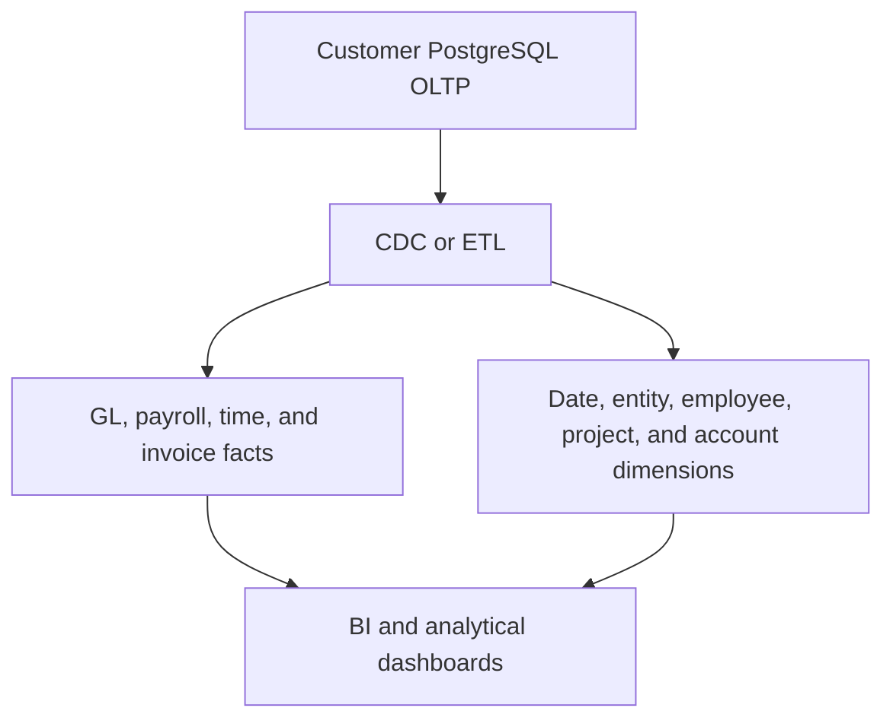
```mermaid
flowchart TB
    OLTP["Customer PostgreSQL OLTP"] --> PIPE["CDC or ETL"]
    PIPE --> FACTS["GL, payroll, time, and invoice facts"]
    PIPE --> DIMS["Date, entity, employee, project, and account dimensions"]
    FACTS --> BI["BI and analytical dashboards"]
    DIMS --> BI
```

The warehouse is not required for the initial release. It is added per deployment or through an explicitly approved customer-controlled analytical environment.

---

## 21. Data Integrity and Transaction Rules

### 21.1 Database Constraints

- Every transaction references a valid legal entity.
- Child dimensions belong to the same legal entity as their transaction.
- `effective_from <= effective_to` when an end date exists.
- Active policy, tax-rate, assignment, and compensation ranges cannot overlap where exclusivity is required.
- Monetary, quantity, percentage, and hour values obey documented bounds.
- Allocation totals cannot exceed the source receipt or payment.
- Allocation totals cannot exceed the target document's remaining balance.
- Header totals reconcile to line, tax, discount, and rounding totals.
- Base amount reconciles to transaction amount and snapshotted exchange rate under the rounding policy.
- Journal entries balance in base currency before posting.
- Payroll net amount reconciles to earning and deduction components.
- Loan outstanding amount is derived from principal, adjustments, and applied installments.
- A closed fiscal period rejects new posting.
- Referenced master data cannot be hard-deleted.

### 21.2 Idempotency

The following operations require an idempotency key or equivalent uniqueness guard:

- Posting invoices and supplier bills.
- Posting receipts and payments.
- Posting payroll runs.
- Posting depreciation and revaluation.
- Processing external webhooks.
- Importing bank statements.
- Publishing outbox events.
- Creating scheduled recurring documents.

Retrying a request must either return the original result or complete the original transaction. It must never create a duplicate financial effect.

### 21.3 Transaction Boundaries

- A document header, lines, totals, business object, and initial workflow case are created atomically.
- Approval completion and posting request are coordinated so a failed posting does not falsely mark the document as posted.
- Journal header and lines post in one database transaction.
- Receipt/payment allocation and resulting accounting effect commit consistently.
- Payroll posting either completes for the approved scope or rolls back.
- Outbox events are inserted in the same transaction as the state change they describe.

### 21.4 Concurrency

- Document numbers use a locked sequence row; `MAX(number) + 1` is prohibited.
- Payroll posting and period close use a lock scoped by legal entity and period.
- Normal form edits use optimistic locking through `version_no`.
- Background workers use database or distributed job locks.
- Long report generation runs outside interactive transactions.

### 21.5 Critical Test Cases

| Test | Required result |
|---|---|
| Retry the same invoice posting | Exactly one journal entry |
| Fail on the final journal line | Complete rollback |
| Partial receipt then final receipt | Correct balance and payment states |
| Credit note against a partially paid invoice | Correct allocation and ledger balance |
| Update exchange-rate master data | Historical document remains unchanged |
| Transfer an employee between departments | Each historical report shows the effective assignment |
| Change a payroll policy after posting | Historical payslip remains unchanged |
| Reverse a journal | Original retained and linked balanced reversal created |
| Branch-scoped user requests another branch | Access denied |
| Concurrent payroll posting | Only one posting succeeds |
| Duplicate bank statement file | Import rejected or returned as existing |
| Restore a backup | Application passes integrity and reconciliation checks |

---

## 22. Indexing, Partitioning, and Performance

### 22.1 Index Baseline

1. Index foreign keys used for joins and deletes.
2. List-screen baseline: `(organization_id, status, business_date desc)`.
3. Human document number: unique within legal entity and document type.
4. Employee number: unique within legal entity.
5. Project, ledger account, branch, department, and cost-center codes: unique within defined scope.
6. Journal query baseline: `(organization_id, ledger_account_id, entry_date)`.
7. Add line-dimension indexes for project and cost center after measuring real report queries.
8. Use partial indexes for active and open records when selectivity supports them.
9. Use GIN indexes only for actual JSONB or full-text query paths.
10. Verify every major report with `EXPLAIN ANALYZE` against realistic data volume.

### 22.2 Partition Candidates

Do not partition only because a table may become large. Partition after measurement and operational testing.

Primary candidates:

- `accounting.journal_lines` by fiscal year or month.
- `hr.attendance_records` by month.
- `project.time_entries` by month.
- `workflow.audit_logs` by month.
- `workflow.outbox_events` by month with archival policy.
- High-volume notification delivery logs by month.

Partition keys must not prevent required uniqueness or foreign-key behavior. Retention and backup procedures must understand the partition model.

### 22.3 Caching

- Cache reference data and read-only report results, not mutable financial truth.
- Cache keys include deployment, legal entity, permission scope, filter hash, and data version.
- Posted-event invalidation is explicit.
- A stale dashboard must display the data timestamp.
- Redis is optional and introduced only for measured needs such as distributed rate limits, short-lived cache, or job coordination.

---

## 23. Security, Privacy, and Audit

### 23.1 Isolation

- Customer-to-customer isolation is enforced by dedicated infrastructure and database.
- Legal-entity and internal user scope is enforced by application authorization and, where appropriate, PostgreSQL RLS.
- Organization context is set inside each transaction when pooled database connections are used.
- The application database role must not bypass RLS unintentionally.

### 23.2 Access Control

- Deny by default.
- Grant atomic permissions through roles and explicit scopes.
- Apply maker-checker separation to payroll, manual journals, payments, and fiscal close.
- Prohibit self-approval when policy requires segregation of duties.
- Require re-authentication or stronger authentication for sensitive exports and payment approvals.
- Record administrative impersonation or delegated support sessions.

### 23.3 Sensitive Data

- Encrypt disks, backups, and object storage.
- Encrypt or tokenize high-risk fields where required.
- Mask national IDs, bank accounts, and salary data in UI, logs, and exports.
- Exclude passwords, tokens, secrets, and full sensitive values from audit snapshots.
- Use time-limited signed URLs for private file downloads.
- Scan uploaded files under the deployment's security policy.

### 23.4 Audit

Audit events include:

- Actor user and effective role.
- Legal entity and business object.
- Action and reason.
- Before and after snapshot where allowed.
- Request correlation ID.
- Source IP and device metadata where lawful.
- Timestamp in UTC.
- Support-access or impersonation context.

Financial, payroll, approval, permission, export, login, and configuration events require elevated audit coverage.

---

## 24. Backup, Disaster Recovery, and Operations

### 24.1 Backup Requirements

Each customer deployment has an independent policy covering:

- Automated database backups.
- Point-in-time recovery where infrastructure supports it.
- Encrypted off-server backup storage.
- Object-storage backup or versioning.
- Configuration and secret-recovery procedure.
- Defined retention schedule.
- Automated failure alerts.
- Periodic restore drill.

RPO and RTO values are contract-level requirements and must be agreed for each customer tier. A backup is not considered valid until restoration has been tested.

### 24.2 Health Monitoring

Monitor without exporting business content:

- HTTPS availability and certificate expiry.
- Application and worker health.
- Database connectivity and storage capacity.
- Backup completion and restore-test status.
- Queue depth and failed jobs.
- Migration and application version.
- Error rate, latency, CPU, memory, and disk.

### 24.3 Update Procedure

1. Publish a signed, versioned release.
2. Review release notes and migration impact.
3. Verify customer deployment health and free storage.
4. Create and verify a pre-update backup.
5. Enter a maintenance window when required.
6. Deploy application and migration as one coordinated release.
7. Run automated smoke, integrity, and reconciliation checks.
8. Confirm worker and scheduled-job health.
9. Record the result in deployment release history.
10. Roll back the application or restore according to the tested release plan if validation fails.

### 24.4 Responsibility Baseline

| Responsibility | Customer | Product operator |
|---|---:|---:|
| Own/pay for server and DNS | Accountable | Consulted |
| Approve infrastructure access | Accountable | Responsible for approved use |
| Install and configure product | Informed | Responsible |
| Application releases and migrations | Informed | Responsible |
| OS and infrastructure patching | Contract-defined | Contract-defined |
| Backup configuration and monitoring | Contract-defined | Contract-defined |
| Data classification and user access approval | Accountable | Consulted |
| Restore drill | Approves schedule | Executes or supports |
| Business-rule validation | Accountable | Implements configuration |
| Incident response | Shared | Shared |

The service agreement must remove every `Contract-defined` ambiguity before production go-live.

---

## 25. Optional Industry Extensions

### 25.1 Inventory and Warehousing

```text
catalog_items
item_units
warehouses
inventory_locations
inventory_transactions
inventory_transaction_lines
stock_lots
stock_reservations
inventory_cost_layers
stock_counts
stock_count_lines
```

Key rules:

- Stock quantity comes from the inventory ledger.
- Available stock equals on-hand minus valid reservations.
- Negative stock policy is explicit per organization and item class.
- Costing method is defined and version-controlled.
- Sales and purchasing lines may link to `catalog_item_id`.
- Inventory accounting posts stock, goods received not invoiced, and cost of goods sold.

### 25.2 Manufacturing

```text
bills_of_material
bom_lines
work_centers
routings
work_orders
production_operations
material_issues
finished_goods_receipts
manufacturing_overhead_allocations
```

### 25.3 Field Service

```text
service_contracts
service_orders
site_visits
technician_assignments
service_checklists
service_parts
service_slas
```

### 25.4 Recruitment and Performance

```text
job_requisitions
candidates
applications
interviews
offers
performance_cycles
goals
reviews
competencies
```

Optional modules must use existing parties, employees, projects, workflow, attachments, accounting dimensions, and audit foundations rather than duplicating them.

---

## 26. Functional Requirements Baseline

### 26.1 Deployment Administrator

- Register installation identity and licensed features.
- Configure domain, email, storage, backups, and integration endpoints.
- Run migrations and view non-sensitive job health.
- Activate legal entities and initial administrators.
- Export diagnostic information without business payloads.

### 26.2 Company Administrator

- Configure legal entity, branches, departments, positions, and cost centers.
- Manage users, roles, permissions, and scopes.
- Configure document sequences, currencies, fiscal years, and approval policies.
- Enable licensed modules and organization-level settings.
- Review audit records within authorized scope.

### 26.3 HR Team

- Manage employee identity, documents, contracts, and assignments.
- Record transfers without losing history.
- Configure schedules, holidays, leave types, and leave policies.
- Import or review attendance and submit corrections through approval.
- Review headcount, attendance, document expiry, and leave reports.

### 26.4 Payroll Team

- Configure components, packages, rules, and country policy versions.
- Assign compensation with effective dates.
- Collect approved period inputs.
- Calculate, review, approve, post, reverse, and rerun payroll by revision.
- Generate payslips and controlled payroll exports.
- Manage loans, advances, liabilities, and disbursement batches.

### 26.5 Finance Team

- Maintain chart of accounts, tax codes, fiscal periods, and posting rules.
- Issue and post customer invoices and credit notes.
- Record receipts and allocate them.
- Review supplier bills, payments, and allocations.
- Manage cash, banks, transfers, and reconciliation.
- Post approved manual journals and corrections.
- Close periods and run revaluation, depreciation, and financial reports.

### 26.6 Procurement and Expense Users

- Create purchase requisitions.
- Approve and issue purchase orders.
- Record receipt or rejection.
- Perform matching and bill review.
- Submit expense claims with receipts.
- Track approval and reimbursement status.

### 26.7 Project Managers

- Manage project structure, milestones, tasks, members, and status.
- Approve time and project expenses.
- Create and revise project budgets.
- Configure billing method under permission control.
- Review utilization, budget, revenue, cost, and margin.

### 26.8 Employees

- View permitted profile and assignment data.
- Submit leave, attendance correction, time, and expense requests.
- View own payslips and payment status.
- Upload required documents through secure channels.

### 26.9 Auditors

- Receive read-only, time-bounded access.
- Trace a business document to approval, journal, payment, and audit history.
- Export controlled evidence sets.
- Verify period locks, reversals, and segregation of duties.
- Never edit operational or financial data.

---

## 27. Non-Functional Requirements

| Area | Requirement |
|---|---|
| Correctness | Financial invariants are enforced by application and database constraints |
| Availability | Service target is defined by customer tier and infrastructure contract |
| Performance | Interactive lists use pagination and indexed filters; heavy exports are asynchronous |
| Scalability | Scale workers and application processes before splitting modules |
| Security | Least privilege, encryption, audit, and isolated deployment |
| Privacy | Data minimization, masked display, controlled export, and retention policy |
| Localization | Arabic and English UI support; database identifiers remain English |
| Time | UTC storage and explicit timezone conversion |
| Currency | Exact decimals and immutable rate snapshots |
| Accessibility | Dashboard and workflow UI must support keyboard and readable status cues |
| Observability | Structured logs, metrics, traces, correlation IDs, and alerting without secrets |
| Maintainability | Versioned migrations, no customer forks, modular ownership, automated tests |
| Portability | Deployment procedure must be reproducible on supported customer infrastructure |
| Recoverability | Backups, PITR where supported, and tested restoration |

---

## 28. Delivery Roadmap

### Phase 0 — Domain Validation

- Confirm business terminology and legal-entity model.
- Validate accounting basis, chart structure, tax behavior, and reporting expectations.
- Validate Egypt payroll policy pack with an authorized specialist.
- Agree backup, monitoring, access, RPO, and RTO responsibilities.

### Phase 1 — Platform Foundation

- System, core, IAM, parties, workflow, attachments, and audit.
- Legal entities, branches, dimensions, currencies, sequences, and fiscal periods.
- Chart of accounts, journals, and posting engine foundation.
- Deployment automation, migration pipeline, backup, and smoke tests.

### Phase 2 — HR and Payroll

- Employee, contract, assignment, document, and reporting hierarchy.
- Schedule, attendance, leave, and ledger.
- Compensation, payroll run, payslip, posting, and disbursement.
- HR and payroll dashboards.

### Phase 3 — Revenue, Expense, and Treasury

- Sales contracts, invoices, credits, receipts, and allocations.
- Supplier bills, payments, and employee expenses.
- Treasury accounts, transfers, statements, and reconciliation.
- Core financial statements and aging.

### Phase 4 — Projects and Procurement

- Projects, tasks, members, time, budgets, and billing.
- Requisitions, orders, receipts, and matching.
- Project profitability and utilization.

### Phase 5 — Assets, Budgets, and Advanced Accounting

- Fixed assets and depreciation.
- Organization budgets and forecasts.
- Revaluation, period close, and optional group consolidation.

### Phase 6 — Optimization and Extensions

- Materialized views based on measured load.
- Advanced exports and customer BI integration.
- Inventory, manufacturing, field service, or recruitment by contract.
- Partitioning or analytical warehouse when justified by data volume.

---

## 29. Approved Assumptions and Change Control

The current baseline assumes:

1. Every customer has a dedicated deployment.
2. A deployment may contain multiple legal entities.
3. The first release may expose one legal entity in the UI while remaining group-ready.
4. Accounting is double-entry and accrual-based.
5. Payroll is configurable, with Egypt as the first country policy pack.
6. EGP is the initial default, but multi-currency is supported.
7. Core reporting is generated from posted operational data.
8. Inventory, manufacturing, and consolidation are optional advanced modules.
9. The first architecture is a modular monolith.
10. PostgreSQL is the authoritative operational database.

Any requested change must record:

- Decision and business reason.
- Affected modules and tables.
- Data migration impact.
- Accounting and reporting impact.
- Permission and audit impact.
- Backward compatibility.
- Rollout and rollback plan.

---

## 30. Definition of Done for Database Design

The design is ready for physical implementation only when:

- Module scope and first-release boundaries are approved.
- Every aggregate has an owner, lifecycle, and business key.
- Every relationship has cardinality, nullability, and delete behavior.
- Every money field has currency, precision, rounding, and sign rules.
- Every effective-dated table has overlap and boundary rules.
- Every financial event has an approved posting mapping.
- Every approval-controlled document has a state diagram and workflow policy.
- The chart of accounts and control-account model are reviewed by finance.
- The payroll component model and Egypt policy pack are reviewed by payroll specialists.
- KPI definitions are approved by their business owners.
- RLS and application scopes are tested.
- Backup restoration is tested.
- Physical PostgreSQL DDL and migrations are generated and reviewed.
- Seed data contains reference/configuration data only.
- Automated integrity, idempotency, reversal, authorization, and migration tests pass.

### Next Technical Deliverables

After approval of this blueprint:

1. Physical PostgreSQL data dictionary, column by column.
2. Complete DDL with primary keys, foreign keys, checks, unique constraints, and indexes.
3. Migration and rollback strategy.
4. Accounting event-to-journal mapping catalog.
5. Payroll calculation DSL and policy JSON schemas.
6. RBAC permission matrix.
7. API resource map and transaction boundaries.
8. Seed/reference-data specification.
9. Database integrity and reconciliation test suite.
10. Deployment runbook for a new customer server and custom domain.
