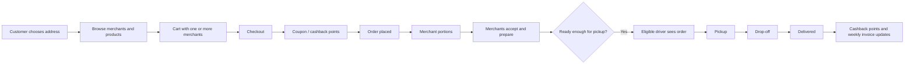
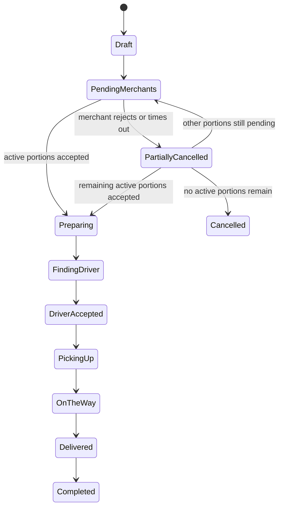
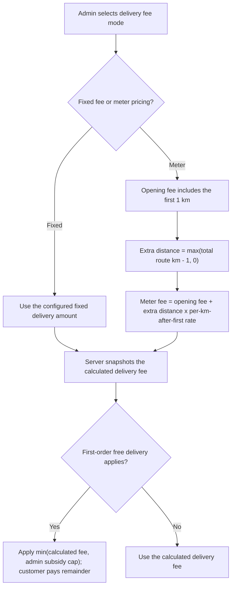
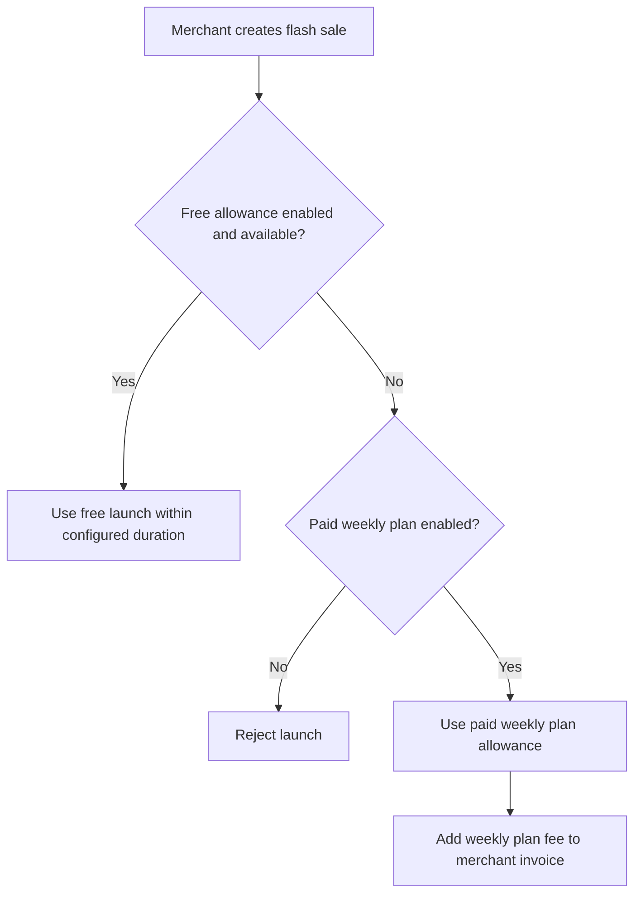
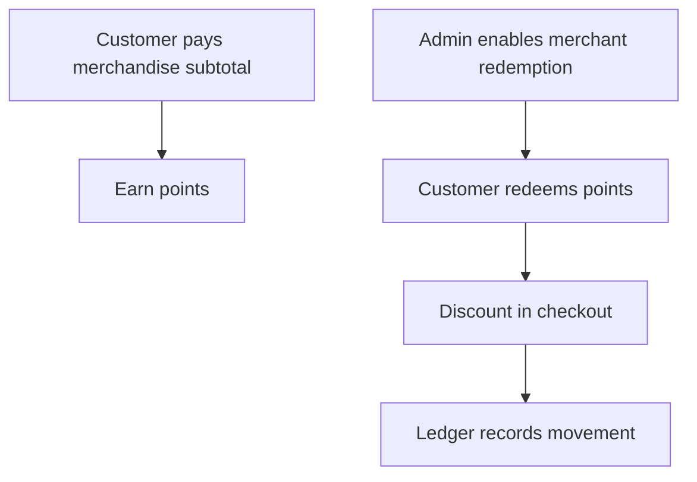
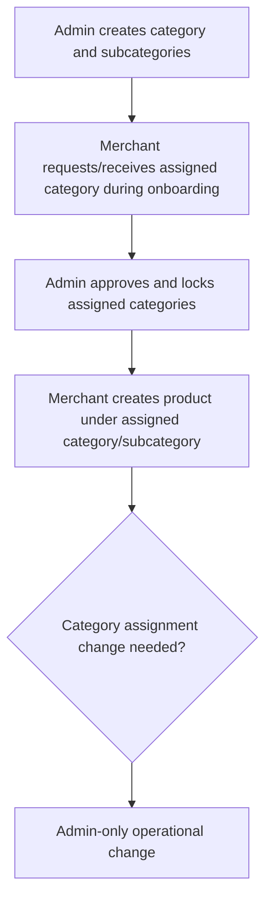

<a id="top"></a>

# Market Home - Product Requirements Document

| Field | Value |
|---|---|
| Status | Current Product Scope |
| Audience | Client, Product Owner, UI/UX, Mobile, Web, Backend, QA |
| Language | Simple English |
| Delivery Package | Customer App, Merchant App, Driver App, Admin Dashboard, Merchant Dashboard |
| Testing Surfaces | Customer Web, Driver Web |

Market Home is a local marketplace and delivery platform. Customers can order from one merchant or several merchants in the same checkout. Each merchant prepares only its own items. Approved drivers collect ready portions and deliver the order to the customer. Admins control the marketplace rules, approvals, pricing, commissions, invoices, promotions, cashback points, reports, and support.

This PRD is split into two clear parts:

- **Part 1 - Product PRD:** product behavior in simple language for the client, UI/UX, and app teams.
- **Part 2 - Operational / Integration PRD:** deeper rules for backend, dashboards, QA, and integration teams without turning the PRD into code documentation.

Future and retired concepts are listed only at the end so the active product scope stays clean.

## Table of Contents

- [Part 1 - Product PRD](#part-1-product-prd)
  - [1. Product Summary](#1-product-summary)
  - [2. Delivery Package](#2-delivery-package)
  - [3. User Roles](#3-user-roles)
  - [4. Registration and Approval](#4-registration-and-approval)
  - [5. Full Marketplace Flow](#5-full-marketplace-flow)
  - [6. Customer App Flow](#6-customer-app-flow)
  - [7. Merchant App and Dashboard Flow](#7-merchant-app-and-dashboard-flow)
  - [8. Driver App Flow](#8-driver-app-flow)
  - [9. Admin Dashboard Flow](#9-admin-dashboard-flow)
  - [10. Orders and Status Flow](#10-orders-and-status-flow)
  - [11. Location Pin and Map Behavior](#11-location-pin-and-map-behavior)
  - [12. Products, Categories, and Offers](#12-products-categories-and-offers)
  - [13. Promotions, Coupons, and Cashback Points](#13-promotions-coupons-and-cashback-points)
    - [Customer Referral Points](#customer-referral-points)
    - [Birthday Loyalty Discount](#birthday-loyalty-discount)
  - [14. Flash Sales](#14-flash-sales)
  - [15. Delivery Fee Meter Pricing](#15-delivery-fee-meter-pricing)
  - [16. Weekly Orders](#16-weekly-orders)
  - [17. Merchant Weekly Invoices, Driver Daily Settlement, and Print Receipts](#17-weekly-invoices-and-manual-payment-proof)
  - [18. Chat, Calls, Notifications, and Support](#18-chat-calls-notifications-and-support)
  - [19. Product Acceptance Checklist](#19-product-acceptance-checklist)
- [Part 2 - Operational / Integration PRD](#part-2-operational--integration-prd)
  - [20. Platform Modules](#20-platform-modules)
  - [21. Permission Model](#21-permission-model)
  - [22. Order Logic Rules](#22-order-logic-rules)
  - [23. Pricing Rules](#23-pricing-rules)
  - [24. Delivery Fee Technical Rules](#24-delivery-fee-technical-rules)
  - [25. Finance and Invoice Rules](#25-finance-and-invoice-rules)
    - [Merchant Commission Grace and Discount Cost Sharing](#merchant-commission-grace-and-discount-cost-sharing)
  - [26. Flash Sale Billing Rules](#26-flash-sale-billing-rules)
  - [27. Cashback Points Rules](#27-cashback-points-rules)
  - [28. Merchant Category Rules](#28-merchant-category-rules)
  - [29. Weekly Order Reminder Rules](#29-weekly-order-reminder-rules)
  - [30. Referral and Chat Alert Rules](#30-referrals-and-chat-alert-rules)
  - [31. API and QA Handoff Summary](#30-api-and-qa-handoff-summary)
- [Out of Current Scope](#out-of-current-scope)
- [Retired / Not Active](#retired--not-active)

---

<a id="part-1-product-prd"></a>

# Part 1 - Product PRD

This part explains the product as the client and design teams should understand it.

[Back to top](#top)

<a id="1-product-summary"></a>

## 1. Product Summary

Market Home connects customers, merchants, drivers, and admins in one order-delivery marketplace.

A customer can place one checkout that includes products from multiple merchants. The order is then split into merchant portions. Each merchant sees only its own portion, accepts or rejects it, and confirms preparation timing. The system computes readiness automatically; merchant ready/handoff buttons are no longer required in the active workflow. A driver sees the order only when it is ready enough for pickup and only if the driver is eligible by zone, account status, online state, and vehicle type.

The platform also supports discounts, cashback points, birthday loyalty, customer-to-customer referral rewards, weekly order reminders, merchant weekly invoices, compulsory driver daily settlement, flash sales, manual/payment proof, chat, explicit chat alert buttons, notifications, ratings/reputation, admin monitoring, Google Maps Platform location pin selection for customer and merchant locations, Google Routes API distance/duration/ETA routing, and live delivery tracking after assignment.

| Promise | Meaning |
|---|---|
| Multi-merchant checkout | A customer can buy from one or several merchants in one order. |
| Clear merchant responsibility | Each merchant manages only its own items. |
| Readiness-based delivery | Drivers do not receive orders before the order is ready enough for pickup. |
| Admin-controlled rules | Admin controls categories, zones, commissions, flash-sale rules, coupons, cashback redemption, referral reward settings, approvals, and invoices. |
| Simple finance | Merchants settle weekly invoices; drivers must settle daily invoices either by cash at Market Home headquarters with admin drop-off, or through Wallet/InstaPay in-app proof upload. |

[Back to top](#top)

<a id="2-delivery-package"></a>

## 2. Delivery Package

| Surface | Delivered to Client? | Purpose |
|---|---:|---|
| Customer Mobile App | Yes | Customer ordering, checkout, cashback points balance/history, order status, weekly order reminders, chat, support. |
| Merchant Mobile App | Yes | Merchant onboarding, orders, products, categories, offers, flash sales, invoices, dashboard, and notifications. Merchant-customer chat is retired from the active product scope. |
| Driver Mobile App | Yes | Driver onboarding, eligible orders, pickup/drop-off steps, invoice reminders, dashboard, and driver-customer chat with explicit Alert/Ring action. |
| Admin Web Dashboard | Yes | Platform operations, approvals, categories, zones, commissions, flash-sale rules, coupons, cashback rules, invoices, reports, support. |
| Merchant Web Dashboard | Yes | Merchant operations and dashboard from web/tablet/desktop. |
| Customer Web | Testing / integration only | Used for QA and API integration checks, not a main client delivery surface. |
| Driver Web | Testing / integration only | Used for QA and API integration checks, not a main client delivery surface. |

[Back to top](#top)

<a id="3-user-roles"></a>

## 3. User Roles

| Role | Goal | Main Actions |
|---|---|---|
| Customer | Order easily and save money | Register, choose custom WhatsApp or WhySMS SMS OTP when available, save addresses, browse, add item notes, checkout, use coupons, redeem cashback points, use birthday discount when eligible, share a referral code, enter an optional referral code during new registration, track orders live, chat with the assigned driver only, rate delivered merchant/product experience and assigned driver, create weekly reminders. |
| Merchant | Sell and prepare products | Register, get approved, manage products/offers under admin-assigned categories, accept/reject orders, keep product preparation defaults, adjust prep time at acceptance, run flash sales, view invoices, upload proof. |
| Driver | Deliver ready orders | Register, get approved, go online, view eligible sorted orders, manually accept or enable optional auto-nearest accept, navigate multi-stop routes in app, pick up, deliver, use external Google Maps fallback, view invoices. |
| Admin Staff | Operate assigned sections | Use only the dashboard sections assigned by Super Admin. |
| Super Admin | Full platform control | Create admin staff, assign sections, configure marketplace rules, and access all admin modules. |

[Back to top](#top)

<a id="4-registration-and-approval"></a>

## 4. Registration and Approval

### Customer Registration

| Step | What Happens |
|---|---|
| 1 | Customer chooses language. |
| 2 | Customer enters name, phone, password, and confirmation. |
| 3 | Customer verifies phone using one explicit customer OTP option: custom WhatsApp when available or WhySMS SMS. SMS OTP is customer-only. |
| 4 | Customer adds the first delivery address/location. |
| 5 | Customer account becomes active without admin approval. |
| Optional | Customer can later update profile settings and saved addresses; phone/password remains the only customer sign-in method in the current product scope. |

### Merchant Registration

| Step | What Happens |
|---|---|
| 1 | Merchant chooses language. |
| 2 | Merchant enters brand/store name, phone, password, confirmation, and zone. |
| 3 | Merchant onboarding does not use SMS OTP. Merchant phone/account verification is handled by custom WhatsApp OTP where enabled plus admin document/location approval. |
| 4 | Merchant chooses requested categories created by admin during onboarding; admin approval locks the final assigned category list. |
| 5 | Merchant uploads required documents such as commercial license, tax register, logo, menu, and other required files. |
| 6 | Merchant confirms the pinned store location using the Google Maps pin screen. |
| 7 | Account stays under review until admin approval. |

### Driver Registration

| Step | What Happens |
|---|---|
| 1 | Driver chooses language. |
| 2 | Driver enters name, phone, password, confirmation, and zone. |
| 3 | Driver onboarding does not use SMS OTP. Driver phone/account verification is handled by custom WhatsApp OTP where enabled plus admin document/vehicle approval. |
| 4 | Driver selects vehicle type: motor, scooter, e-scooter, cycle, car, or tricycle. |
| 5 | Driver uploads vehicle documents and pictures as required. |
| 6 | Driver uploads personal documents, national ID, driver license where required, selfie, and police clearance where required by the onboarding flow. |
| 7 | Account stays under review until admin approval. |

### Admin Staff Creation

Admin staff do not self-register from public apps.

| Step | What Happens |
|---|---|
| 1 | Super Admin creates an admin staff account. |
| 2 | Super Admin sets username/email and password. |
| 3 | Super Admin selects which dashboard sections the staff account can access. |
| 4 | Staff can use only assigned dashboard sections. |

The active permission model is **section-based dashboard access**, not a fixed all-purpose admin role model.
The admin dashboard permission matrix may expose action and data-scope metadata so the desktop UI can render controls, but `allowedSections[]` remains the enforced backend grant boundary. Action and data-scope metadata is not a separate persisted granular permission model.

[Back to top](#top)

<a id="5-full-marketplace-flow"></a>

## 5. Full Marketplace Flow



[Back to top](#top)

<a id="6-customer-app-flow"></a>

## 6. Customer App Flow

| Area | Customer Experience | Rule |
|---|---|---|
| Addresses | Customer can save up to three addresses using a Google Maps pin. | The app uses Google Maps Platform inside the app, asks for location permission when helpful, supports manual pin movement and brand-colored markers, and stores normalized lat/lng + address text + label + Google place metadata when available + Google Maps URL/deep-link helpers. |
| Browsing | Customer browses merchants, products, categories, subcategories, offers, favorites, product size choices, and related add-on suggestions. | Only eligible active merchants/products are shown. Customer product cards/details should use one consistent projection for active price choices, default price choice, offer/favorite state, merchant preparation/map helper fields when available, and grouped related products on detail. Merchant cards/pages can display preparation-time stats: fastest, slowest, and average order preparation time. Product detail can show related products selected by the merchant from sibling subcategories under the same parent category. |
| Cart | Customer can add items from multiple merchants. | Items remain grouped by merchant portion. |
| Item notes | Customer can write an optional note on each product line. | Notes are visible to the merchant for preparation. |
| Checkout | Customer reviews subtotal, coupon, cashback points, birthday discount when eligible, delivery fee, and total. | Server pricing is the final truth. Delivery fee uses Google Routes distance when available: fixed amount or meter opening amount including first 1 km plus additional per-km rate after the first km. |
| Coupons | Customer can apply admin coupons created from the Admin Dashboard. | Each coupon has a percentage, one maximum EGP cap, and merchant scope: all merchants, selected merchants only, or all merchants except selected merchants. In a multi-merchant order the coupon applies only to eligible active merchant portions. |
| Discount funding and settlement | Updated active product truth. | Coupon and birthday discounts are split using admin-configured merchant contribution percentages, default 0% with optional merchant overrides; the platform funds the remainder. The driver pays each merchant the server-calculated payout after merchant-funded discounts, while platform-funded shares become credits on the compulsory driver daily invoice. Free delivery stays platform-funded. Merchant offers, flash sales, and valid points redemption keep their existing merchant-funded rules. |
| Cashback points | Customer sees cashback points balance/history and can redeem points at eligible merchants. | Points are not cash and cannot be topped up, withdrawn, or transferred. |
| Weekly orders | Customer can create from a delivered recent order or build a new template after clearing the cart. | Create/edit/Order Now/reminder loading always replaces the cart, remains editable, and requires explicit normal checkout confirmation. |
| Status and live tracking | Customer sees one clear order timeline, receives notifications when a merchant portion is cancelled or timed out, and sees the assigned driver live on the order map during active delivery. | Live GPS starts only after driver assignment for active delivery, expires by TTL, and should not store unnecessary long-term raw history. Cancelled merchant notifications include a Browse Products action. |
| Ratings after delivery | After a delivered order, customer can rate each delivered merchant/product experience and the assigned driver. | Ratings are allowed only after delivery. Rejected/cancelled/timeout merchant portions are not rating targets. The UI submits one 1-to-5-star rating for each delivered merchant portion; backend distributes it once to every unique purchased product under that merchant. Merchant rating is derived from product ratings. |
| Birthday gift | Customer can receive a birthday loyalty discount once per birthday date when admin settings allow it. | Birthdate is entered once during registration or first profile completion; customer cannot edit it later except through controlled admin/support correction. |
| Chat/call | Customer can chat only with the assigned driver for order chat, plus support/complaint channels. Phone visibility controls direct-call exposure. | Merchant-customer and merchant-driver chats are retired from active scope. Hidden phone keeps driver-customer chat and alert available where allowed but disables direct phone call. Driver can use an explicit Alert/Ring button that sends a separate customer chat alert with call-ring/alarm behavior. Normal customer-bound chat messages may use default high-priority customer-chat ring metadata, but must not use the explicit call-alert/alarm behavior. |

[Back to top](#top)

<a id="7-merchant-app-and-dashboard-flow"></a>

## 7. Merchant App and Dashboard Flow

| Area | Merchant Experience | Rule |
|---|---|---|
| Account state | Merchant is pending until admin approval. | Pending or suspended merchants cannot receive normal orders. |
| Business location | Merchant selects one Google Maps business pin during onboarding. | The pinned location is locked after approval unless admin reopens it; backend keeps lat/lng, address text, label, place metadata when available, and Google Maps helpers. |
| Availability | Merchant can be Open or unavailable. | UI may say “Close or Busy”; the business state is accepting/not accepting orders. |
| Orders | Merchant sees new orders and accepted/preparing history without needing ready/handoff actions. | Merchant sees only its own order portion. |
| Accept/reject | Merchant accepts or rejects its portion. | Rejection requires a reason and cancels only that merchant portion; the remaining order is repriced and continues when active portions remain. |
| Preparation | Merchant product records include default preparation time. On acceptance the merchant can adjust preparation time using repeated +/- 5 minute controls and choose normal vs large-capacity eligibility. | The system computes readiness and driver visibility; merchant ready/handoff buttons are not required. The platform records preparation duration so fastest, slowest, and average preparation-time metrics can be shown. |
| Products | Merchant adds/edits products with image, stock state, admin-assigned category, subcategory, details, optional offer, optional size/pricing choices, and optional related subcategory groups. | Product category must belong to merchant’s active admin-assigned category list. At least one active price choice is required: Standard only, or one or more active sizes such as S/M/L with their own prices. Related groups can only point to visible sibling subcategories under the same selected parent category. |
| Categories | Merchant can view assigned platform categories only. | Category add/edit/remove is admin-managed after onboarding; merchant app/dashboard must not expose category assignment mutation controls. |
| Flash sales | Merchant can launch limited flash-sale promotions while approved and eligible under the existing flash rules. | Commission grace and an effective 0% commission do not block flash sales. Existing free allowance, paid weekly plan, duration, product/account eligibility, moderation, and weekly invoice billing remain authoritative. |
| Invoices | Merchant sees weekly invoice breakdown and uploads payment proof. | Commission grace, normal commission, paid flash-sale cost, redeemed-points cost, and payment proof are separated. Coupon/birthday merchant shares already deducted from the driver-to-merchant payout appear only as reconciliation rows and are never charged again. |
| Dashboard | Merchant sees sales, commission, order, rating, product performance, and preparation-time metrics. | Metrics should separate revenue from amounts due to platform and show fastest/slowest/average preparation time plus sample count when available. |
| Ratings and reputation | Merchant rating is not an independent manual score. It is derived from ratings received by the merchant's products/merchant portions. | Product ratings are averaged per product, then merchant rating is recomputed from all product-rating documents or product averages weighted by rating count. This keeps the merchant score tied to real delivered products. |
| Driver approaching pickup | Merchant can receive a near-arrival notification when the assigned driver is close to pickup. | Thresholds are admin-configurable by distance and/or ETA; each stop/event is sent once and deduplicated by order, stop, and event type. |

### Merchant Preparation-Time Metrics

The platform should help customers and admins understand how quickly each merchant normally prepares accepted orders. These metrics are informational and should be calculated from real completed merchant portions.

| Metric | Meaning | Where It Appears |
|---|---|---|
| Fastest preparation time | The shortest valid time from merchant acceptance/preparation start to ready/cooked. | Merchant public page, customer merchant card where space allows, admin merchant account list. |
| Slowest preparation time | The longest valid time from merchant acceptance/preparation start to ready/cooked. | Merchant public page and admin merchant account details/list. |
| Average preparation time | The average valid preparation duration across delivered/completed merchant portions. | Merchant public page, customer browsing, merchant dashboard, admin merchant list. |
| Sample count and last calculated time | The number of valid portions used and when the stats were calculated. | Admin merchant details/list, merchant dashboard, and customer merchant pages where useful. |

Preparation-time stats must ignore cancelled/rejected/timeout-cancelled merchant portions and should not count orders that never reached ready/cooked.

[Back to top](#top)

<a id="8-driver-app-flow"></a>

## 8. Driver App Flow

| Area | Driver Experience | Rule |
|---|---|---|
| Approval | Driver is pending until admin approval. | Pending/suspended drivers cannot receive normal orders. |
| Vehicle | Driver selects vehicle type including car or tricycle. | Big/large orders require an eligible large-capacity driver: car or tricycle. |
| Online/offline | Driver controls availability. | Offline drivers do not receive orders. |
| Available orders | Driver sees eligible orders within the admin-configured pre-readiness window, default 5 minutes before merchant readiness, sorted by Google route distance/ETA. | Eligibility includes zone, account status, online state, vehicle, readiness window, bicycle/cycle kilometer cap, route distance, large-capacity rules, and rejection history. |
| Acceptance | Driver can manually accept trips or optionally enable auto-nearest accept. | Auto-nearest is off by default and must use server-side assignment locking so two drivers cannot take the same trip. |
| Pickup | Driver confirms pickup from merchant and confirms merchant payment when required. | This confirmation moves the customer-visible status line to picked up/on the way. Assigned driver may pick eligible portions first while others continue preparing. |
| Drop-off | Driver delivers to customer and completes delivery step. | Delivery completion finalizes order-side effects. |
| Rating | Customer may rate the assigned driver after delivery, but the driver does not rate the customer in the active product scope. | Driver rating is separate from merchant-product ratings and is averaged on the driver profile only if the customer submits it. No driver-to-customer/customer rating is active or exposed. |
| Maps and navigation | Driver sees in-app Google navigation/map view for the active multi-stop route and can still open Google Maps externally as fallback. | Route includes next ready pickup, remaining active pickups, and customer drop-off. Cancelled/rejected/timeout portions are removed from the route. The SOS/emergency button on the map screen is a platform emergency action, not the customer chat alert. |
| Invoices | Driver sees compulsory daily invoice and pays it daily. | Admin controls default/custom driver commission percent and can drop/settle cash-paid invoices from the dashboard. |

[Back to top](#top)

<a id="9-admin-dashboard-flow"></a>

## 9. Admin Dashboard Flow

| Section | Admin Work |
|---|---|
| Overview / monitor | Track marketplace KPIs, delayed orders, active customers, online drivers, and open merchants. |
| Approvals | Review merchant and driver onboarding requests. |
| Staff permissions | Super Admin creates staff accounts and selects allowed dashboard sections. |
| Categories | Create and manage platform categories and subcategories. |
| Zones and locations | Manage service zones, account zone assignment, Google Maps/API readiness, live tracking thresholds, and stored lat/lng location snapshots when needed. |
| Accounts | Browse customers, merchants, drivers; suspend/reactivate where allowed. Merchant account lists should expose fastest, slowest, and average preparation-time metrics. |
| Ratings and quality | Monitor merchant-product bundle ratings, derived product/merchant aggregates, and optional customer-to-driver ratings; audit inappropriate comments; trigger safe recomputation if required. Customer/driver-to-customer rating is retired from the active scope. |
| Finance | Configure merchant/driver commission defaults and overrides, merchant commission-free order threshold defaults/overrides, coupon/birthday merchant-contribution percentages, driver-to-merchant payout rules, daily driver credits, delivery fee pricing, invoices, credits, and payment instructions. |
| Flash sales | Configure free launches on/off, free launch count/duration/renewal, paid weekly plan count/duration/price, and billing rules. |
| Coupons | Create percentage coupons with a maximum cap and choose merchant scope: all, selected only, or all except selected merchants. |
| Cashback points | Choose eligible merchants and set point-to-money redemption value per merchant. |
| OTP channels | Configure customer-only WhySMS SMS OTP, custom WhatsApp OTP availability, cooldowns, channel switch limits, failed-attempt lockout, and abuse controls. Runtime availability and shared limits are active; admin UI controls remain a frontend/admin-surface step. |
| Birthday loyalty | Enable/disable birthday loyalty, set max discount percent, product price cap, order subtotal cap, notification hour, and reports. |
| Orders | Monitor all orders, cancelled merchant portions, timeout cancellations, delayed orders, and intervene operationally when needed. |
| Support/reports | Manage complaints, support, reports, and broadcasts. |

[Back to top](#top)

<a id="10-orders-and-status-flow"></a>

## 10. Orders and Status Flow



| Step | Owner | Meaning |
|---|---|---|
| Draft | Customer | Customer can still edit/delete/continue before final flow. |
| Pending merchants | Merchants / system | Merchants must accept before the admin-configured response timeout. |
| Portion cancelled | Merchant / system | A merchant portion is cancelled when the merchant rejects it with a reason or when the merchant response timeout passes. |
| Repricing | System | The order is recalculated after any cancelled merchant portion: items, coupon, cashback redemption, delivery route/distance/fee, totals, and future cashback earning base. |
| Preparing | Merchants | Remaining accepted merchant portions continue normally. |
| Finding driver | System / driver | Eligible drivers see only the current active route and pickup list after cancelled portions are removed. |
| Pickup | Driver | Driver collects remaining ready merchant portions. |
| Drop-off | Driver | Driver delivers to the customer. |
| Completed | System | Cashback and weekly invoice effects are finalized using the final active order value. |

### Merchant Rejection or Timeout Flow

1. Each merchant accepts or rejects only its own portion.
2. Admin sets the maximum merchant response time from the dashboard.
3. If a merchant rejects, the merchant must write a clear rejection note.
4. If the merchant does not respond before the timeout, that merchant portion is cancelled automatically with a system reason such as `Merchant did not respond in time`.
5. Cancelled merchant portions are removed from the active order route and pricing, but remain in the order audit history.
6. The customer receives a notification that explains which merchant portion was cancelled and why.
7. The notification includes a call-to-action to browse products again if the customer wants to place a separate new order.
8. The remaining order continues with active/accepted merchant portions when at least one active portion remains.
9. If no active merchant portions remain, the whole order is cancelled and the customer is notified.
10. The customer should still be able to cancel the whole order where normal cancellation rules allow it, but the platform does not block the remaining accepted portions just because one merchant rejected or timed out.

Example: if a customer orders from 5 merchants and 1 merchant rejects, that merchant portion is cancelled with its note, the customer is notified, the order is repriced for the remaining merchants, delivery distance/fee is recalculated, cashback/coupon totals are recalculated, and the customer can browse again to place a separate order for replacement items.

[Back to top](#top)

<a id="11-location-pin-and-map-behavior"></a>

## 11. Location Pin and Map Behavior

Google Maps Platform is the active map provider for customer and merchant location selection. Google Routes API is the active routing provider for route distance, duration, ETA, legs, provider snapshots, and delivery-fee meter calculations. The location is saved as structured address text plus coordinates; the Google Maps URL/deep-link is a helper for opening the same point in a map app, not the only source of truth.

| Area | Active Product Rule |
|---|---|
| Customer saved locations | Customer can save up to three locations using a Google Maps pin, current-location permission, or manual pin movement. |
| Merchant store location | Merchant selects one pinned Google Maps store location during onboarding; after approval it remains locked unless an admin flow reopens it. |
| Stored location truth | Backend stores lat/lng, address text, label, zone, Google place metadata when available, and Google Maps URL/deep-link helpers where coordinates are present. |
| Marker styling | Frontend can use brand-colored marker styling through the app map layer and Google Maps map IDs where needed. |
| Web/admin rendering | Web/admin map rendering may use Google Maps JavaScript API where a map view is required. |
| Driver navigation | Driver receives pickup/drop-off coordinates, route projections, Google Maps helpers, in-app Google navigation data during active delivery, and an external Google Maps fallback. |
| Map and routing truth | Google Maps Platform helper links and Google Routes API routing are the active product truth across app, handoff, and backend surfaces. |

[Back to top](#top)

<a id="12-products-categories-and-offers"></a>

## 12. Products, Categories, and Offers

Admin creates the platform category tree. A category can have subcategories, plus an `OTHER` fallback where allowed.

Merchant category rules:

1. Merchant chooses requested categories during onboarding.
2. Admin approval locks the merchant's assigned category list.
3. Merchant cannot create, add, edit, or remove platform category assignments from the merchant app/dashboard after approval.
4. Category assignment changes after approval are admin-only operational actions.
5. Product create/edit must choose one assigned merchant category.
6. Product create/edit must choose a subcategory under that category, or `OTHER` where allowed.
7. Product offers are separate from flash sales and can be toggled during product create/edit.
8. Product pricing supports a backward-compatible Standard price plus optional size choices. A product may use Standard only, or activate one or more size choices (`S`, `M`, `L`) with a required price for each active choice.
9. When more than one price choice is active, customer add-to-cart must carry the selected price choice so the order stores an immutable price snapshot.
10. Merchant product create/edit can select related subcategories from the same parent category as the product. Related product suggestions resolve dynamically from the same merchant's available products in those selected subcategories, excluding the current product.
11. A product cannot select related subcategories from another parent category, another merchant, inactive subcategories, or arbitrary product IDs outside the chosen category tree.

[Back to top](#top)

### Product Size and Related-Items Rules

| Area | Product Rule |
|---|---|
| Standard pricing | Existing single-price products remain valid as `Standard` pricing. The legacy `price` field may continue to represent the default/minimum active price for compatibility. |
| Size pricing | Optional size choices are `S`, `M`, and `L` with customer-facing labels Small, Medium, and Large. A merchant may activate all three, two, one, or no sizes. Each active size must have its own non-negative price. |
| Active price choices | Every product must have at least one active price choice. If only Standard is active, customer UX can behave like the current single-price flow. If multiple choices are active, add-to-cart and checkout must require the chosen option. |
| Order snapshot | Order line items must snapshot the selected price option code, label, and unit price at order time. Later product edits must not change existing order totals. |
| Related subcategories | Merchant can choose related subcategory IDs from the same parent category as the product. Example: a Syrian Food sandwich can point to Drinks and Additions subcategories under Syrian Food. |
| Related products shown to customer | Product detail should show the same merchant's available products in the selected related subcategories, grouped by related subcategory when useful, excluding the current product. |
| Customer catalog projection | Home feed, search, offers, flash deals, merchant product lists, merchant pages, and product detail should expose the same active price-option/default-choice/favorite/offer fields so clients do not infer missing catalog truth. |
| Guards | Reject cross-category related subcategories, inactive subcategories, duplicate choices, and products with no active price choice. |

[Back to top](#top)

<a id="13-promotions-coupons-and-cashback-points"></a>

## 13. Promotions, Coupons, and Cashback Points

| Mechanism | Who Controls It? | Customer Impact |
|---|---|---|
| Product offer | Merchant | Product appears with a discounted/offer price. |
| Coupon | Admin | Customer receives a percentage discount with a maximum cap. |
| First-order/free delivery | Admin | When no positive coupon-code or birthday loyalty discount is used, an eligible order receives platform subsidy up to the admin-configured cap, default 30 EGP; the customer pays any delivery-fee remainder above that cap. Coupon/birthday savings take precedence and suppress this benefit. Applied free-delivery subsidy is platform-funded and reported against platform share/amount due. |
| Flash sale | Merchant under admin rules | Product gets urgent limited-time promotion. |
| Cashback points | Customer uses points under admin redemption rules | Points reduce eligible merchant portion price. |

### Coupons

Coupons are simple customer-facing discounts.

| Field | Meaning |
|---|---|
| Discount percent | Percentage discount applied to the eligible merchant merchandise subtotal. |
| Maximum discount cap | One maximum EGP amount for the complete coupon discount, not one cap per merchant. |
| Merchant scope | `all`, `include`, or `exclude`; admin chooses all merchants, selected merchants only, or all except selected merchants. |
| Active dates | Optional start/end window. |
| Usage limits | Optional total or per-customer usage control. |

Coupon example:

| Item | Value |
|---|---:|
| Merchandise subtotal | 1,000 EGP |
| Coupon percent | 10% |
| Maximum cap | 70 EGP |
| Actual coupon discount | 70 EGP |

### Cashback Points

Cashback points are not a cash wallet. They are a points balance/history system.

| Rule | Meaning |
|---|---|
| Earning | Customer earns 1 point for every paid EGP of merchandise subtotal. |
| Delivery fee | Delivery fee does not earn points. |
| Redemption | Points can be used as discount only at admin-enabled merchants. |
| Merchant-specific value | Admin defines how much money a point bundle is worth for each merchant. |
| No cash behavior | No top-up, withdrawal, transfer, or stored-money payment. |

Earning example:

| Item | Value |
|---|---:|
| Product subtotal | 100 EGP |
| Delivery fee | 20 EGP |
| Earned points | 100 points |

Redemption example:

| Merchant | Admin Rule | Customer Uses | Discount |
|---|---|---:|---:|
| Merchant A | 100 points = 5 EGP | 1,000 points | 50 EGP |
| Merchant B | 100 points = 3 EGP | 1,000 points | 30 EGP |

[Back to top](#top)

### Customer Referral Points

Customer referral rewards let one customer invite another customer using a referral code. Rewards are points inside the existing points system, not cash and not a separate wallet.

| Rule | Requirement |
|---|---|
| Referral code | Each customer can have a unique referral code to share. |
| Registration input | New customer registration may include an optional referral code. |
| Admin settings | Admin controls whether referrals are enabled and the point value for inviter and invitee. |
| Reward trigger | Both inviter and invitee receive points only after the invited customer completes the first real delivered order. |
| Abuse prevention | No self-referral, no duplicate reward, no reward for cancelled/rejected/test/non-delivered orders. |
| Points model | Referral rewards use the existing points ledger with source metadata; they are not cash, not transferable money, and not a wallet top-up. |
| Reports | Admin can review referral links, first-delivered-order trigger status, points awarded, and suspicious/duplicate attempts. |

[Back to top](#top)

### Birthday Loyalty Discount

Birthday loyalty is a controlled admin feature. It rewards customers on their birthday without turning birthdate into an editable discount loophole.

| Rule | Requirement |
|---|---|
| Admin control | Admin can enable/disable the feature and configure maximum discount percent, maximum eligible product price, maximum eligible order subtotal, and notification hour. |
| Birthdate capture | Customer enters birthdate once during registration or first profile completion. |
| Birthdate edits | Customer cannot edit birthdate later; admin/support can correct or reopen it only through a controlled action. |
| Discount percent | Age-based percent equals current age; actual percent is `min(age, admin max discount percent)`. |
| Eligibility | Applies once per birthday date, only to eligible products whose unit/effective price is within the product price cap, and only when eligible order subtotal is within the order subtotal cap. |
| Delivery fee | Birthday discount does not apply to delivery fee. |
| Snapshot | Order stores the birthday discount percent, eligibility decision, discount amount, and settings snapshot for audit. |
| Customer flags | Backend exposes `birthdayGiftAvailable`, `birthdayDiscountPercent`, `birthdayEligibleToday`, `birthdayPopupShouldShow`, `birthdayPopupSeen`, and records popup seen. |
| Notifications | Birthday push notification is sent in the morning; first app open on birthday can show popup/confetti. |
| Admin reports | Reports show eligible customers, notified customers, used birthday discounts, total discount amount, and per-date/month reporting. |

#### Coupon/birthday cost sharing and merchant-funded points settlement

Coupon-code and birthday discounts remain customer-facing platform promotions, but their internal funding is split by admin policy. The global merchant contribution defaults to `0%` for each type and may be overridden per merchant; the remaining amount is platform-funded. Admin-authored coupons also store merchant scope (`all`, `include`, or `exclude`), discount percentage, and one maximum EGP cap. Checkout still permits only one coupon/birthday/free-delivery benefit: coupon and birthday cannot coexist, and either positive discount suppresses free delivery. Free delivery remains fully platform-funded. The driver pays each merchant the server-derived payout after merchant-funded shares, and platform-funded shares reduce the driver daily invoice. Redeemed cashback points, referral points, merchant-created product offers, and flash-sale responsibilities keep their existing rules. Every order stores merchant/platform funding and scope snapshots so later settings do not rewrite historical settlement.

<a id="14-flash-sales"></a>

## 14. Flash Sales

Flash sales are merchant promotions controlled by admin rules. Commission grace or an effective `0%` merchant commission does not block create, activate, update, or reschedule. Flash sales are not billed by the hour; after the existing free allowance is used, the merchant must use an admin-configured weekly paid plan/subscription if paid usage is enabled.

| Rule | Product Meaning |
|---|---|
| Commission independence | Commission grace and effective `0%` commission do not affect flash-sale availability. |
| Free launches enabled | Admin can enable or disable the free flash-sale allowance for eligible approved merchants. |
| Free launch count | Admin sets how many launches are free. Default product rule: 3 free launches. |
| Free launch duration | Admin sets max duration for each free launch. Default product rule: 1 hour per free launch. |
| Renewal mode | Admin decides whether free launches renew weekly or are lifetime-only. |
| Paid plan enabled | Admin can allow or block paid flash-sale usage after the free allowance. |
| Paid weekly plan launch count | Admin sets how many flash-sale launches the paid weekly plan allows. |
| Paid weekly plan launch duration | Admin sets the max duration of each paid-plan launch. |
| Paid weekly plan price | Admin sets the weekly subscription/plan price. |
| Weekly invoice | Paid flash-sale plan cost is added to the merchant weekly invoice as a separate line item. |

Flash sale invoice example:

| Component | Value |
|---|---:|
| Merchant commission | 250 EGP |
| Paid weekly flash-sale plan | Enabled |
| Plan allowance | 3 launches/week |
| Max duration per plan launch | 1 hour |
| Weekly plan price | 60 EGP/week |
| Total weekly invoice due | 310 EGP |

[Back to top](#top)

<a id="15-delivery-fee-meter-pricing"></a>

## 15. Delivery Fee Meter Pricing

Delivery fee is controlled from the Admin Dashboard and priced by the backend. The customer, merchant, and driver apps display the server result; they do not calculate billing truth locally.

| Mode | Admin Setting | Customer Meaning |
|---|---|---|
| Fixed fee | One fixed delivery amount | Same delivery fee regardless of route distance. |
| Meter pricing | Opening/first-kilometer amount + additional per-km rate after the first km | The first kilometer is included in the opening amount. Only distance after the first km is multiplied by the additional per-km rate. |

Meter pricing example:

| Item | Value |
|---|---:|
| Route distance | 3.5 km |
| Opening amount including first 1 km | 20 EGP |
| Additional distance | 2.5 km |
| Additional per-km rate | 8 EGP/km |
| Delivery fee | 40 EGP |

First-order free delivery applies up to the admin-configured subsidy cap. It turns the fee into zero only when the calculated fee does not exceed that cap; otherwise the customer pays the remainder.

[Back to top](#top)

<a id="16-weekly-orders"></a>

## 16. Weekly Orders

Weekly Orders are reusable customer-owned templates. They never auto-submit a purchase. Every run places a fresh, editable copy of the template into an empty cart and requires explicit customer confirmation through the normal checkout flow.

### 16.1 Creation Entry Paths

| Entry path | Customer flow | Locked rule |
|---|---|---|
| From Recent Orders | Customer opens a delivered recent order, chooses **Make Weekly**, enters a template name, reminder day, and reminder time, then saves. | Only an order owned by the customer and already delivered can be used. The historical price is not final checkout truth. |
| New Weekly Order | Customer opens Weekly Orders and presses **Create**. The app warns that the current cart will be cleared, then transfers the customer to product browsing in weekly-template builder mode. | The complete cart must be cleared before any template items are loaded or added. Template contents must never merge with an existing cart. |

### 16.2 New Template Builder Mode

| Area | Requirement |
|---|---|
| Cart reset | Frontend clears the complete current cart before builder mode. Backend handoff must explicitly return/require `cartResetRequired=true` and `mergeAllowed=false`. |
| Browsing | Customer browses normal merchants/products and adds items normally, subject to availability and the admin-configured merchant cap. Default maximum is 4 merchants. |
| Primary action | Checkout is replaced by **Save Weekly Order**. Saving does not create an Order, reserve stock, dispatch a driver, create an invoice, or start the order timer. |
| Schedule | Customer enters template name, weekday, reminder time, and timezone. Default timezone is `Africa/Cairo` unless another valid supported timezone is supplied. |
| Snapshot | Store unique product lines grouped by merchant, quantities, selected price-option/size code, and item notes where supported. Revalidate current availability and prices whenever loaded. |

### 16.3 Template Management

| Feature | Rule |
|---|---|
| Multiple templates | Customer can create multiple named weekly templates. |
| Active switch | Active/inactive controls scheduled reminders. An inactive template remains editable and can still use Order Now. |
| Edit | **Edit** clears the current cart, loads the complete template into builder mode, and changes the CTA to **Save Weekly Order Changes**. Products, quantities, notes, name, day, time, and timezone can be changed. |
| Delete | Deletes the reusable template only, not historical or already-submitted real orders. |
| Ownership | Customer can access only their own templates and reminder occurrences. |

### 16.4 Order Now and Scheduled Reminder

| Trigger | Required behavior |
|---|---|
| Order Now | Clear the complete current cart, materialize the template into the cart, allow remove/add/replace/quantity changes, then continue through normal checkout and explicit confirmation. |
| Scheduled reminder | Send a reminder notification only. Opening it clears the cart and materializes the template. It must not place an order automatically. |
| Dismiss reminder | Skip the current occurrence only; the active template remains scheduled for next week. |
| Repeat/idempotency | Active reminders repeat every seven days and must not duplicate the same due occurrence. |

### 16.5 Availability and Pricing at Run Time

| Rule | Requirement |
|---|---|
| Unavailable products | Materialization returns available and unavailable lines separately. Customer may remove unavailable items or add replacements. |
| Merchant state | Closed, suspended, non-accepting, or weekly-disabled merchants are reported; invalid lines are never silently submitted. |
| Current truth | Recheck products, price option, quantities, merchant eligibility, admin merchant cap, address/zone, delivery, discounts, and cashback rules. |
| No stale-price promise | Template/history prices are references only. Server preview/checkout pricing is final. |
| Explicit checkout | Materialization never creates a payable/submitted order; normal preview/create/timer/fee flow remains required. |

### 16.6 Backend Transition Rule

The implemented V2 flow lazily migrates eligible legacy `templateOrderId` templates to reusable snapshots and emits reminder notifications that open cart materialization. It does not create new `weekly_suggestion` Orders. Historical templates, source Orders, suggestion Orders, and their compatibility actions remain readable; no path auto-submits an order.

[Back to top](#top)

<a id="17-weekly-invoices-and-manual-payment-proof"></a>

## 17. Merchant Weekly Invoices, Driver Daily Settlement, and Print Receipts

Market Home uses separate settlement rules for merchants and drivers.

- Merchants settle platform dues on a weekly invoice.
- Drivers must settle their invoice every day. Daily settlement is compulsory. The driver can pay by Wallet/InstaPay inside the app and upload a receipt image, or can pay cash at Market Home headquarters. When cash is paid at headquarters, admin marks/drops the driver invoice from the admin dashboard.
- Payment proof remains reviewable by admin for Wallet/InstaPay payments. Cash-at-HQ settlement is an admin action and must keep an audit note.

### Merchant Weekly Invoice

| Component | Rule |
|---|---|
| Commission base | Completed merchant merchandise value for the week. |
| Commission percent | Merchant custom percent if set; otherwise global merchant default. It applies only after the commission-free threshold. |
| Coupon/birthday funding split | Admin sets default merchant contribution percentages and optional merchant overrides. The merchant and platform shares are snapshotted per active merchant portion. Free delivery remains fully platform-funded. |
| Merchant payout reconciliation | The driver pays the merchant the exact server-calculated merchandise payout after merchant-funded coupon/birthday shares and valid redeemed points. Platform-funded shares bridge the customer-payment difference. |
| Merchant-funded product offers | Product offers and flash-sale item prices created by the merchant are borne by that merchant through the price snapshot. |
| Flash-sale costs | Paid weekly flash-sale plan/subscription cost is borne by the merchant and added as a separate weekly invoice component, including while commission grace is active. |
| Redeemed points | Cashback-point redemption cost is borne by the merchant only when the active merchant portion has a valid admin-rule redemption snapshot. |
| Total due | Portion-level net commission after grace + paid flash-sale fees + other unsettled merchant liabilities. Coupon/birthday/points amounts already deducted from merchant payout are informational reconciliation rows only and must not be charged again. |
| Proof | Merchant uploads payment proof. Admin approves/rejects. |

### Driver Daily Invoice

| Component | Rule |
|---|---|
| Settlement cadence | Daily, compulsory. Driver must settle each day. |
| Commission base | Completed driver delivery value/earnings for the day. |
| Commission percent | Driver custom percent if set; otherwise global driver default. |
| Platform-funded credits | The platform-funded coupon, birthday, and free-delivery shares are shown separately and reduce the compulsory driver daily invoice because the driver paid the merchant those platform-funded amounts. |
| Discount incompatibility | Coupon-code and birthday loyalty discounts cannot coexist. Either positive discount suppresses free delivery; a conflicting checkout returns `ORDER_DISCOUNT_BENEFIT_CONFLICT` with `suggestedAction=remove_coupon`. Cashback redemption remains separate and may coexist under its merchant-funded admin rules. |
| Payment methods | Wallet or InstaPay inside the app with receipt image upload; or cash at Market Home headquarters. |
| Admin cash handling | If paid cash at headquarters, admin drops/settles the driver invoice from the dashboard with audit note and settlement actor. |
| Total due | Gross daily driver/platform liability minus platform-funded credits. Any excess credit remains explicit instead of disappearing at a zero floor. |

### Merchant Order Print Receipt

The Merchant App must support printing a professional receipt for each merchant portion/order from a receipt printer or system print dialog.

| Receipt Field | Requirement |
|---|---|
| Brand | Use restaurant/merchant name and optional merchant logo only. Do not show Market Home branding, Market Home phone, platform commission, or internal platform settlement fields. |
| Order reference | Show customer-facing order number and internal order ID where available. |
| Driver | Show assigned driver name when assigned. |
| Code | Show the order/merchant pickup code used by the merchant/driver flow. |
| Content | Show only this restaurant/merchant portion items, quantities, options/size, notes, and totals relevant to that merchant. |
| Format | Thermal-printer friendly, professional, short, and safe for direct printing. |

[Back to top](#top)

<a id="18-chat-calls-notifications-and-support"></a>

## 18. Chat, Calls, Notifications, and Support

| Area | Product Rule |
|---|---|
| Chat | Active order chat is driver-customer only. Merchant-customer and merchant-driver chat are retired/non-active. Support and complaint threads remain separate from order chat. |
| Unread counters | Users should see unread chat badges/counts. |
| Chat alert button | Driver can press an explicit Alert/Ring button inside customer-driver order chat to send a customer chat alert with call-ring/alarm sound where available. Merchant-to-customer and merchant-driver alerts are retired. Normal chat pushes to the customer keep `customer_chat_ring` metadata only and must not use `customer_chat_call_alert`. |
| Calls | Direct call is available only when customer phone visibility allows it. |
| Notifications | Used for account approval, orders, chat, invoices, weekly reminders, and support. |
| Support | Customers, merchants, and drivers can contact support or submit complaints where supported. |

Chat alert rule: the driver Alert/Ring action is not a voice call and does not open a voice channel. It creates a visible chat alert/system event for the customer and plays a call-ring/alarm sound when available. The customer cannot reply to the alert object itself, but can open the customer-driver chat and respond normally. Merchant-to-customer, customer-to-merchant, merchant-to-driver, and driver-to-merchant order chat/alert paths are retired/non-active. Repetition is controlled by admin dashboard safety settings: `chatAlertRepeatSeconds` defines when the button becomes available again, with per-driver/per-order caps and terminal-state blocking. It must not be blocked merely because a previous alert is still unacknowledged.

[Back to top](#top)

<a id="19-product-acceptance-checklist"></a>

## 19. Product Acceptance Checklist

| Area | Must Be Clear |
|---|---|
| Delivery package | 3 mobile apps + Admin Dashboard + Merchant Dashboard are the real client deliverables. |
| Orders | Multi-merchant portions and readiness-based delivery are understandable. |
| Merchant products | Category/subcategory, Standard/S/M/L pricing, selected price snapshot, and related-items rules are clear. |
| Merchant category assignment | Merchant can view assigned categories; category add/edit/remove is admin-managed and hidden from merchant mutation surfaces. |
| Finance | Weekly invoices show commission, flash-sale costs, total due, and proof status. |
| Flash sales | Free launches on/off, free count/duration/renewal, paid weekly plan count/duration/price, and weekly invoice billing are clear. |
| Coupons | Percentage, one maximum cap, and all/include/exclude merchant scope are clear. |
| Cashback/referrals | Points are not cash; cashback and referral earning/redemption rules are clear. Referral inviter reward waits for invited customer first delivered order. |
| Admin | Super Admin creates staff and assigns sections. |

[Back to top](#top)

---

<a id="part-2-operational--integration-prd"></a>

# Part 2 - Operational / Integration PRD

This part gives implementation teams enough detail to build and test correctly.

[Back to top](#top)

<a id="20-platform-modules"></a>

## 20. Platform Modules

| Module | Responsibility |
|---|---|
| Auth and accounts | OTP, login, approval, suspension, role access. |
| Catalog | Categories, subcategories, products, offers, favorites, merchant pages. |
| Orders | Draft, checkout, merchant portions, preparation, driver assignment, delivery, status projections. |
| Finance | Commissions, weekly invoices, flash-sale costs, receipts/proofs, overdue handling. |
| Promotions | Coupons, first-order free delivery, flash sales, product offers. |
| Cashback points | Points balance/history, redemption preview, reserve/commit/restore/reverse. |
| Weekly orders | Named templates, scheduled reminders, confirm/dismiss suggestions. |
| Chat/notifications | Order-scoped chat, unread counters, push/inbox notifications. |
| Admin operations | Monitoring, approvals, permissions, rules, reports, support. |

[Back to top](#top)

<a id="21-permission-model"></a>

## 21. Permission Model

| User Type | Access Model |
|---|---|
| Customer | Own profile, own addresses, own orders, own chat, own cashback points. |
| Merchant | Own store, own categories, own products, own order portions, own invoices. |
| Driver | Own profile, eligible orders, assigned order steps, own invoices. |
| Admin Staff | Only assigned dashboard sections. |
| Super Admin | All dashboard sections and staff management. |

Admin dashboard action/data-scope labels are descriptive metadata for dashboard rendering. Backend authorization remains section-based through `allowedSections[]`; Super Admin access is implicit for all sections.

[Back to top](#top)

<a id="22-order-logic-rules"></a>

## 22. Order Logic Rules

1. A customer order can contain one or multiple merchant portions.
2. One customer order must not exceed the admin-configured merchant cap. The default is **4 distinct merchants per order** and the active value is stored as a snapshot on the order.
3. Each merchant portion has its own accept/reject/preparing/ready behavior.
4. Admin controls the maximum merchant response time before a pending portion is cancelled by timeout.
5. Merchant rejection requires a rejection reason note.
6. Merchant rejection or timeout cancels only that merchant portion by default, not the entire order.
7. The customer receives a notification containing the cancelled merchant, the reason, and a Browse Products action for placing a separate replacement order if desired.
8. If at least one active merchant portion remains, the order continues with the remaining portions after server repricing.
9. If no active merchant portions remain, the whole order is cancelled.
10. Driver discovery is not allowed before readiness rules are satisfied.
11. Single-merchant order appears to drivers after that merchant portion is ready.
12. Multi-merchant order can appear when the first accepted active portion is ready.
13. Driver may pick ready active portions while other accepted active portions continue preparing.
14. Big/large-capacity orders are visible only to large-capacity drivers: car or tricycle. Compatibility field names may still say `requiresCarDriver` / `requiresCarDelivery`.
15. Zone, vehicle, account state, online state, and rejection history affect driver eligibility.
16. Ratings can be created only after order delivery, and only for delivered active merchant portions/products and the assigned driver.
17. Customer phone visibility controls whether merchant/driver direct-call is allowed.
18. Product line items with active size choices must snapshot the selected `Standard`/`S`/`M`/`L` option, label, and unit price at draft/order creation. Server-side pricing remains authoritative.

### Merchant Preparation-Time Metrics Rules

| Rule | Requirement |
|---|---|
| Measurement window | Use merchant acceptance/preparation start to ready/cooked timestamp. If a dedicated preparation-start timestamp exists, use it; otherwise fall back to accepted timestamp. |
| Included portions | Count only valid portions that reached ready/cooked and later completed/delivered successfully. |
| Excluded portions | Ignore rejected, cancelled, timeout-cancelled, and never-ready portions. |
| Metrics | Expose fastest, slowest, average, and sample count. |
| Customer visibility | Customer-facing merchant cards/pages may show the average and optionally fastest/slowest when the UI has room. |
| Admin visibility | Admin merchant account lists/details should show fastest, slowest, average, sample count, and last calculated time. |

[Back to top](#top)

<a id="23-pricing-rules"></a>

## 23. Pricing Rules

| Step | Component | Rule |
|---:|---|---|
| 1 | Product subtotal | Sum of product price snapshots. |
| 2 | Product offer / flash price | Reflected in product price snapshot. |
| 3 | Coupon discount | Percentage discount capped by max EGP amount. |
| 4 | Cashback points discount | Per eligible merchant portion using merchant-specific point value. |
| 5 | Delivery fee | Separate from merchandise pricing. Fixed mode uses fixed amount. Meter mode uses Google Routes distance when available: opening/first-kilometer amount plus additional per-km rate after first km. |
| 6 | Birthday loyalty discount | Applied only when eligible and snapshotted separately from coupon/cashback. |
| 7 | Final customer payable | Merchandise payable after discounts + delivery fee. |
| 8 | Post-cancellation repricing | If a merchant portion is cancelled by rejection or timeout, subtotal, coupon, cashback, birthday eligibility when relevant, Google route distance, delivery fee, driver pickup list, and final payable are recalculated from the remaining active portions. |
| 9 | Cashback earn base | Paid merchandise subtotal only, excluding delivery fee and after removed merchant portions are excluded. |

[Back to top](#top)

<a id="24-delivery-fee-technical-rules"></a>

## 24. Delivery Fee Technical Rules



| Rule | Requirement |
|---|---|
| Server owned | Backend calculation is billing truth for customer, merchant, driver, and invoices. Route/delivery fee snapshots must be stored on orders for audit. |
| Fixed mode | Uses one fixed delivery amount. |
| Routing provider | Google Routes API is the active routing provider and returns routeDistanceMeters, routeDurationSeconds, ETA, legs/waypoints when needed, provider snapshots, and delivery-fee meter distance inputs. |
| Meter mode | Opening/first-kilometer amount includes the first 1 km. |
| Additional distance | `max(distanceKmTotal - 1, 0)`. |
| Additional rate | Applied only to kilometers after the first km. |
| Rounding | Money values round to two decimals. |
| First-order free delivery | If eligible, apply the lower of the calculated fee and the stored admin subsidy cap; the customer pays any remainder. |
| Multi-stop updates | Multi-stop route distance and delivery fee update when merchant portions are removed by rejection or timeout. |
| Legacy naming | Existing code may use `baseFee` and `perKmRate`, but active wording must make first-kilometer inclusion clear. |

[Back to top](#top)

<a id="25-finance-and-invoice-rules"></a>

## 25. Finance and Invoice Rules

| Rule | Requirement |
|---|---|
| Merchant default commission | Admin sets platform default merchant percent. |
| Merchant override | Admin can set custom percent for one merchant; custom wins over default. |
| Commission-free threshold | Admin sets a global default count, default `0`, and may override it per merchant. The first N eligible delivered merchant portions use `0%`; normal commission starts at N+1. |
| Eligible count | One delivered active merchant portion counts once. Rejected/cancelled/timeout/non-delivered/test portions and item quantities do not count. |
| Driver default commission | Admin sets platform default driver percent. |
| Driver override | Admin can set custom percent for one driver; custom wins over default. |
| Merchant weekly invoice | Weekly commission settlement plus paid flash-sale plan/usage and other unsettled merchant liabilities. Coupon/birthday/points amounts already deducted from merchant payout are reconciliation-only and must not be charged again. |
| Promotion funding split | Coupon and birthday discounts use admin-configured merchant contribution percentages with defaults `0%` and optional merchant overrides; the remainder is platform-funded. The driver pays the merchant the server-derived payout after merchant-funded shares, and platform-funded shares reduce the driver's compulsory daily invoice. Free delivery remains fully platform-funded. |
| Driver daily invoice | Driver invoice is generated/settled daily and is compulsory. It contains explicit platform-funded coupon, birthday, and free-delivery credits, and supports Wallet/InstaPay proof upload or cash-at-HQ admin drop/settlement. |
| Discount exclusivity | Free delivery cannot be used with coupon-code discounts or birthday loyalty discounts on the same checkout/order. |
| Payment proof | Merchant/driver uploads proof for Wallet/InstaPay payments; admin approves/rejects. Cash-at-HQ driver payment is settled by admin with audit note. |
| Overdue handling | Overdue unpaid invoices can restrict/suspend the account according to platform rules. |
| Merchant print receipt | Merchant can print a restaurant-branded order receipt with no Market Home branding or platform settlement data. |

[Back to top](#top)

<a id="26-flash-sale-billing-rules"></a>

## 26. Flash Sale Billing Rules



Required configurable flash-sale fields:

| Field | Meaning |
|---|---|
| Free launches enabled | Whether merchants get free flash-sale launches at all. |
| Free launches count | Number of free launches. Default product rule: 3. |
| Free launch duration | Maximum duration of each free launch. Default product rule: 1 hour. |
| Renewal mode | Admin chooses whether free allowance renews weekly or is lifetime-only. |
| Paid plan enabled | Admin can allow or block paid usage after free allowance. |
| Paid weekly plan launch count | Number of launches available under the paid weekly plan. |
| Paid weekly plan launch duration | Maximum duration of each paid-plan launch. |
| Paid weekly plan price | EGP price of the weekly flash-sale plan/subscription. |
| Invoice integration | Paid weekly plan cost is added to merchant weekly invoice. |

[Back to top](#top)

<a id="27-cashback-points-rules"></a>

## 27. Cashback Points Rules



| Rule | Requirement |
|---|---|
| Earn rate | 1 paid EGP merchandise subtotal = 1 point. |
| Delivery exclusion | Delivery fee does not earn points. |
| Redemption eligibility | Admin decides which merchants accept points. |
| Redemption value | Admin sets how many EGP discount a point bundle gives per merchant. |
| Ledger | Every earn/redeem/restore/reverse action is auditable. |
| Cash behavior | Points are not money and cannot be topped up, withdrawn, or transferred. |

[Back to top](#top)

<a id="28-merchant-category-rules"></a>

## 28. Merchant Category Rules



Rules:

1. Admin owns the platform category tree.
2. Merchant can view only its assigned active admin-created categories.
3. Merchant cannot create, add, edit, or remove category assignments after approval.
4. Category assignment changes are admin-only actions and must not appear as merchant mutation controls.
5. Product create/update must validate merchant category ownership and subcategory relationship.
6. Related-subcategory selections must stay under the same parent category as the product.
7. Related product suggestions are not a global recommendation system; they are deterministic same-merchant products from selected sibling subcategories.

[Back to top](#top)

<a id="29-weekly-order-reminder-rules"></a>

## 29. Weekly Order Builder, Materialization, and Reminder Rules

| Rule | Requirement |
|---|---|
| Recent-order source | Customer may create a template from their own delivered recent order. |
| New custom template | Weekly Orders **Create** starts a dedicated builder after clearing the full cart. |
| Never merge carts | Create, edit, Order Now, and reminder materialization replace/clear the existing cart before loading template contents. |
| Builder CTA | Builder/edit uses **Save Weekly Order** / **Save Weekly Order Changes**, not Checkout. |
| Template contents | Store merchant-grouped unique product lines, quantities, selected size/price-option codes, and supported item notes. |
| Merchant limit | Save and materialization respect the current admin-configured maximum; default 4. |
| Name and schedule | Customer-defined name, weekday, time, timezone; default `Africa/Cairo`. |
| Toggle | Active templates generate reminders; inactive templates do not. Both remain editable and support Order Now. |
| Edit | Clear cart, load template into builder, allow product/schedule/name changes, then replace stored snapshot. |
| Order Now | Clear cart, load valid lines, show unavailable lines, allow edits, then normal explicit checkout. |
| Scheduled reminder | Notification only. Opening it materializes into an empty cart; no automatic order placement. |
| Dismiss | Skip only the current reminder occurrence. |
| Availability | Revalidate merchants, products, quantities, and selected price options on every load. |
| Pricing | Recompute in normal preview/checkout; template/history price is not billing truth. |
| Unavailable handling | Return explicit reason codes so customer can remove/replace items. |
| Idempotency | Prevent duplicate reminders/materializations for the same persisted occurrence. |
| Legacy migration | Existing `templateOrderId` templates and `weekly_suggestion` records must migrate or remain safely compatible without data loss. |

[Back to top](#top)

<a id="30-referrals-and-chat-alert-rules"></a>

## 30. Referral and Chat Alert Rules

| Area | Backend / QA Rule |
|---|---|
| Referral settings | Admin manages enablement, invitee points, inviter points, and reward trigger. |
| Referral registration | Customer registration accepts optional `referralCode`; it links the invited customer but does not immediately grant inviter reward. |
| Reward lifecycle | Inviter and invitee points are granted after the invited customer completes the first real delivered order. Reward grants are idempotent. |
| Ledger | Referral rewards are points ledger entries with source metadata; they do not create stored money. |
| Chat alert | Only the driver can send an explicit Alert/Ring inside driver-customer order chat. It is a chat/system alert plus call-ring/alarm push, not a voice call. Merchant chat alerts are retired. |
| Normal messages | Normal driver-customer messages to the customer can carry `attentionMode=ring`, `notificationBehavior=customer_chat_ring`, `sound=default`, and `priority=high`; they must not use `customer_chat_call_alert` or the alert/alarm sound. Only explicit driver Alert/Ring uses the call-alert/alarm channel. |
| Cooldowns | Admin dashboard owns alert repetition settings. `chatAlertRepeatSeconds` controls the UI copy such as "Available every 3 minutes" / "Available after 1 minute". Per-driver/per-order caps and terminal-order rejection still apply. |

[Back to top](#top)

<a id="30-api-and-qa-handoff-summary"></a>

## 31. API and QA Handoff Summary

Exact endpoints belong in backend API docs and Postman. This PRD defines behavior and acceptance.

| Group | QA Focus |
|---|---|
| Orders | Draft, checkout, merchant portions, merchant cap default 4 and admin override, merchant rejection reasons, merchant-response timeout cancellations, repricing after cancelled portions, Google route/delivery snapshots, readiness, driver assignment, live tracking, near-arrival events, completion. |
| Ratings and reputation | Delivered-order rating, merchant-portion/product fan-out, product averages, merchant aggregate from product ratings, driver rating, duplicate-rating prevention, rejected/cancelled portion exclusion. |
| Merchant categories | List assigned categories only, hide merchant add/edit/remove controls, and validate product binding to admin-assigned categories. |
| Finance | Commission defaults/overrides, invoices, proof upload, flash-sale costs. |
| Promotions | Coupons, flash sales, product offers, first-order delivery. |
| Cashback | Points balance/history, redemption preview, commit/restore/reverse. |
| Weekly orders | Create from recent order or new builder, full cart replacement, snapshot save/edit/toggle/delete, Order Now, reminder materialization, unavailable-item handling, explicit checkout confirmation. |
| Google Maps / Routes | Customer/merchant pin flows, Google Maps helpers, Google Routes distance/ETA/delivery fee snapshots, multi-stop route updates. |
| Driver navigation | Manual accept, optional auto-nearest accept, assignment locking, active multi-stop route projection, in-app Google navigation, external Google Maps fallback. |
| Birthday loyalty | Birthdate immutability, admin settings, checkout pricing, popup seen state, birthday notification, and admin reports. |
| Chat/notifications | Threads, unread counters, push/inbox records. |

Verification should include install, build, lint, tests, seeded live smoke, and local server startup. Seeded smoke is not the same as full endpoint-matrix coverage.

[Back to top](#top)

---

<a id="out-of-current-scope"></a>

## Out of Current Scope

| Item | Status | Notes |
|---|---|---|
| Unnecessary long-term raw GPS history | Out of scope | Live driver GPS is active only during assigned active delivery; history must be minimized and expire by TTL unless a future privacy/legal requirement justifies more. |
| Silent OTP fallback | Out of scope | Do not silently switch WhatsApp OTP to SMS without clear customer action. |
| Tips | Unresolved UI-only signal | Do not treat as active billing truth unless later accepted. |
| Fragile/perishable flags | Unresolved UI-only signal | Do not treat as active backend truth unless later accepted. |
| Countdown TTL on driver card | Unresolved UI-only signal | Do not treat as active backend truth unless later accepted. |
| Full endpoint-matrix automation | Future QA hardening | Seeded smoke exists, but full all-API coverage needs matrix execution. |

[Back to top](#top)

<a id="retired--not-active"></a>

## Retired / Not Active

| Item | Status | Reason |
|---|---|---|
| Driver Cash Advance | Retired | Removed from active product truth. |
| Active cash-advance finance flow | Retired | Historical only. |
| Cash wallet | Not active | Current customer balance is cashback points, not money. |
| Admin-configurable cashback earn rate | Not active | Earn rate is fixed at 1 paid merchandise EGP = 1 point. |
| Commission-only coupons | Not active | Coupons are customer-facing percentage discounts with a cap. |
| Flash-sale free-beta wording | Not active | Admin-configured free quota and paid weekly plan rules are the current truth. |

[Back to top](#top)

## Database, Live API, and Secret Governance Readiness

- Seeded live smoke is not a full API coverage claim.
- The full live API matrix requires a MongoDB test replica set because some registration paths use MongoDB transactions.
- If MongoDB is reachable but standalone and reports `replicaSet: null`, the full matrix is blocked/skipped, not passed.
- The project must not claim all APIs were tested unless the full matrix passes with prerequisites.
- Google, FCM, custom WhatsApp, WhySMS, JWT, upload signing, and database credentials are deployment/secret-manager values and must not appear as real values in docs, Postman, or env examples.


<a id="31-order-readiness-driver-visibility-and-chat-retirement"></a>
## 31. Order Readiness, Driver Visibility, and Chat Retirement Rules

This section supersedes older merchant-ready/handoff assumptions where they conflict with the rules below.

| Area | Accepted Rule |
|---|---|
| Product prep time | Each product has a default preparation time set when the merchant creates or edits the product. Admin may provide fallback/default preparation-time settings. |
| Merchant acceptance | Merchant accepts or rejects only. On acceptance, merchant confirms whether the order is normal or large-capacity eligible and may adjust preparation time using repeated +/- 5 minute increments. |
| Auto readiness | The system computes merchant readiness time from acceptance time plus the selected preparation duration. Merchant is not required to press ready, waiting for driver, or handed to driver. |
| Driver early visibility | Orders can appear to eligible drivers before full readiness by an admin-configurable lead time. Default lead time is 5 minutes. |
| Bicycle/cycle cap | Orders whose Google route distance exceeds the admin-configured bicycle/cycle kilometer cap must not appear to bicycle/cycle drivers. |
| Large-capacity orders | Large orders require car or tricycle. Normal orders can appear to all eligible driver vehicle types subject to distance, zone, account, online, and rejection-history rules. |
| Driver pickup/payment | Driver confirms pickup from merchant and confirms merchant payment when required. This updates the customer-visible status line to show that the driver picked up the order and is on the way. |
| Chat topology | Merchant-customer chat and merchant-driver chat are retired from active product scope. The only active order chat is driver-customer chat. Support threads, complaints, and admin-visible audit/notification records remain available where allowed. |
| Customer status line | Customer should see simple states such as merchant is preparing, driver is heading to pickup, driver picked up and is on the way, and delivered. The customer should not see operational merchant ready/handoff complexity. |


<a id="32-driver-customer-only-chat-topology"></a>
## 32. Driver-customer Only Chat Topology

This section supersedes older assumptions that allowed merchant-customer or merchant-driver order chat.

| Area | Accepted Rule |
|---|---|
| Active order chat | The only active order chat is between the assigned driver and the customer. |
| Merchant-customer chat | Retired/non-active. Merchant-to-customer messages, threads, unread counters, and alerts must not be exposed in active product surfaces. |
| Merchant-driver chat | Retired/non-active. The merchant should not need chat with the driver as part of the normal pickup flow; pickup/payment is confirmed by the driver workflow. |
| Driver Alert/Ring | The driver can send a visible in-chat/system alert to the customer with call-ring/alarm behavior where the customer can receive it. This is not a voice call and does not open an audio channel. It is separate from the navigation SOS/emergency button. |
| Phone visibility | Direct phone call availability is controlled by customer phone visibility. If the phone is hidden, direct call is disabled while driver-customer chat and the Alert/Ring action remain available where allowed. |
| Cooldowns | Driver Alert/Ring uses admin-configured repeat duration plus per-driver/per-order caps and terminal-state blocking. The repeat duration belongs in the admin dashboard safety settings. |
| Docs/Postman/tests | API docs, Postman collections, runtime endpoint inventory, surface handoff, and tests must mark merchant-customer and merchant-driver chat paths as retired/non-active while proving driver-customer chat and alert work. |

[Back to top](#top)


## UI Safety Addendum - Driver Navigation SOS vs Customer Chat Alert

The Delivery App UI separates two actions that must not share backend behavior:

| UI pages | Action | Backend meaning | Recipient | Admin configuration |
|---|---|---|---|---|
| Pages 15-17, top-right icon beside the active navigation map | SOS / Emergency | Driver platform emergency request during active navigation. Backend persists a `DriverEmergencyEvent`, notifies active admins/platform operators, and returns the Market Home emergency phone snapshot so the mobile app can open the native dialer. | Platform/admin team; optional phone call to Market Home emergency number. | `GET/PATCH /admin/safety/settings` controls `emergencySosEnabled`, `marketHomeEmergencyPhone`, and `emergencySosRepeatSeconds`. |
| Pages 18-20, customer-driver chat bottom sheet | Alert Customer | Customer chat alert/ring inside the customer-driver chat. Backend creates a system chat message and `ChatAlert`, pushes `PUSH_CUSTOMER_CHAT_CALL_ALERT`, and stores an inbox notification for the customer. | Customer only. | `GET/PATCH /admin/safety/settings` controls `chatAlertEnabled`, `chatAlertRepeatSeconds`, caps, and sound. |

The navigation SOS button must not message the customer, must not create a chat alert, and must not be mixed with the page 18-20 customer alert sheet. The customer alert must not call the Market Home emergency phone. The admin dashboard setting for alert duration is only the repeat/cooldown duration for the chat alert availability copy and button re-enable time.

## Appendix: Merchant + Delivery UI Audit Alignment - 2026-06-17

This appendix records the current UI audit without changing the accepted product truth.

- MerchantApp pages 18-29 label product related suggestions in two ways: `Related sub category` during add product and `Add-ons` during edit product. Both labels map to the same backend/PRD concept: `relatedSubcategoryIds[]`, selecting sibling subcategories under the same admin-assigned parent category. This is not a separate add-on item entity.
- MerchantApp pages 33-35 Flash Sales must follow section 14 and section 26: admin controls free launch enablement, count, duration, optional weekly renewal, paid weekly plan enablement/count/duration/price, and weekly invoice billing. Copy such as `Limited in Beta`, `Free for now`, or `Times: 3` is display copy only when derived from current admin rules.
- Flash Sales are not hourly billed. Paid usage is a weekly plan/subscription invoice component, not an immediate pay-now requirement.
- MerchantApp page 34 banner/background upload, custom title, explicit `Pay now`, and arbitrary `Total Cost` are not active backend requirements unless a future PRD revision accepts them.
- DeliveryApp pages 15-17 SOS and pages 18-20 Customer Alert remain separate: SOS alerts platform/admin and can dial Market Home emergency phone; Customer Alert is a driver-customer chat attention event.


---

## Phase 38 UI/Finance Update - Active Product Truth Snapshot

This historical Phase 38 snapshot is superseded for coupon/birthday funding by Phase 46. Driver-daily settlement truth remains active.

1. Driver invoices are daily and compulsory. Wallet/InstaPay payment uses in-app receipt upload; cash payment at headquarters is settled/dropped by admin from the dashboard.
2. Free-delivery savings remain fully platform-funded. Coupon and birthday discounts now use the Phase 46 admin-configured merchant contribution split, with default 0% and optional merchant overrides.
3. Merchants also carry merchant-created product offers, flash-sale plan/usage costs, valid redeemed-points discounts, and their configured coupon/birthday contribution.
4. Free delivery cannot be combined with coupon-code discounts or birthday loyalty discounts in the same checkout/order.
5. Merchant print receipt is a new accepted requirement: print a restaurant-only receipt with merchant name, order number, order ID, driver name, code, and merchant portion contents. Market Home branding and platform finance data must not appear on the receipt.

## Deployment/Test Handoff Addendum — Vercel UAT

For the current frontend integration stage, the backend supports a temporary Vercel REST/API smoke deployment before live Meta WhatsApp, WhySMS, Firebase, and Google Maps/Routes keys are available.

Rules:
- Vercel UAT is not real production and must use `DEPLOYMENT_TEST_MODE=true`.
- Seeded password login is allowed for frontend/Postman testing.
- OTP provider may be `console` during UAT only.
- FCM delivery may be disabled during UAT; notification records and metadata remain testable.
- Google route distance may use `geometric_estimate` during UAT; live Google Routes must be enabled before production.
- Long-lived Socket.IO and cron workers are not fully represented by Vercel serverless and require a long-lived Node host or worker runtime for final production verification.
- Demo accounts for Admin, Merchant, Driver, and Customer are created only after `npm run seed:vercel-test` succeeds against an isolated disposable database whose name contains `test`, `uat`, or `demo`; the UAT database must never be promoted to production.

This addendum does not change the final production truth: real production must disable deployment test mode and provide live provider credentials.

### Final Production Host and Provider Readiness

- Final production runs on a long-lived Hostinger VPS; Vercel remains a temporary REST/UAT surface only.
- Production uploads use persistent VPS storage through `UPLOADS_ROOT_DIR=/var/www/markethome/uploads`, never Vercel `/tmp`.
- Required live integrations are Meta WhatsApp OTP for customer/merchant/driver, WhySMS SMS OTP for customers only, Firebase/FCM, and Google Maps/Routes.
- Firebase uses `FIREBASE_PROJECT_ID` plus either deployment-managed inline service-account JSON or a protected credentials file.
- MongoDB, domain/DNS, media storage, monitoring, and backups are owner/VPS operational setup. MongoDB Atlas, Cloudinary/R2, and Vercel production subscriptions are not required by the current plan.
- Online payment and Paymob remain outside this release.
- Provider readiness is reported only as configured, missing, or test-mode; secrets must never be exposed. `/health` remains liveness-only.

## Current frontend handoff cleanup — 2026-06-25

The current MerchantApp and DeliveryApp UAT handoff uses the cleaned Postman set under `backend/docs/postman/`. Merchant product deletion is now an explicit merchant-scoped soft-delete endpoint: `DELETE /api/v1/merchant/products/:id`. Deleted products must be hidden from merchant product lists and customer catalog/search surfaces while historical order references remain intact.

The MerchantApp `Related sub category` field maps to `relatedSubcategoryIds[]`. Delivery SOS remains separate from chat customer alert/ring.


## Product KPI pages 31-33

MerchantApp product detail KPI tabs are covered by `GET /merchant/products/:id/kpis` and section endpoints for `financial`, `orders`, and `ratings`, with `today/weekly/monthly/yearly` period filters. The ratings tab uses the product-rating aggregate that comes from delivered order ratings only; it must not count cancelled portions, rejected portions, or ratings for products outside the delivered order.

## Final Rating and Reputation System — Locked Product Truth

### Current backend rating foundation

The backend may still contain legacy generic `Rating` support for multiple `targetType` values. The **active product truth** is now stricter: the customer rates the delivered products of each merchant portion with **one star score from 1 to 5**. That one score is then distributed to the unique purchased products under that merchant portion for product KPI and merchant reputation calculations.

Driver-to-customer/customer rating is **retired and not part of the active product scope**. Drivers must not rate customers. Any legacy `targetType=customer` behavior must be treated as deprecated, hidden, and excluded from new APIs, Postman, UI flows, reports, and PRD truth.

### Final product behavior

| Target | Who Rates | Active UI Input | How It Is Calculated | Where It Appears |
|---|---|---|---|---|
| Merchant products bundle | Customer after delivered order | One 1–5 star score per delivered merchant portion/order segment. | The same score is applied to every unique product purchased from that merchant portion once per product per order, not once per quantity unit. | Order rating screen, product KPI page 33, admin quality audit. |
| Product aggregate | System derived from bundle score fan-out | No separate per-product star control in the final active UI. | Average of all product rating records created from delivered merchant-portion ratings. Stores `averageRating` and `ratingsCount`. | Product card/detail, MerchantApp product KPIs, Admin product quality reports. |
| Merchant aggregate | System derived from product aggregates/records | No separate manual merchant rating. | Average derived from ratings of that merchant's products, preferably weighted by product `ratingsCount`. | Customer merchant card/page, merchant dashboard, admin merchant list/details. |
| Driver | Customer after delivered order, if the UI asks for driver service rating | One optional 1–5 star score for the assigned driver. | Separate driver average; it never affects merchant or product rating. | Driver profile/dashboard and admin driver quality views. |

### Distribution and validation rules

1. Ratings are accepted only after the order reaches `delivered`.
2. The reviewing customer must own the delivered order.
3. Product/merchant-product ratings are grouped merchant by merchant in multi-merchant orders.
4. For each merchant portion, the customer submits **one integer star score from 1 to 5** for all delivered products of that merchant in the order.
5. The backend fans out that one merchant-portion score to every unique purchased product under that merchant portion once per product, not once per quantity unit.
6. Rejected, cancelled, timeout-cancelled, and non-delivered merchant portions are excluded.
7. A product can receive a distributed rating only if it was actually purchased inside the delivered active merchant portion.
8. Duplicate merchant-portion product-bundle rating for the same order, customer, and merchant portion is blocked.
9. Duplicate driver rating for the same order, customer, and assigned driver is blocked when driver rating is enabled.
10. Comments are optional, trimmed, and limited to moderation-friendly length.
11. Product aggregates store `averageRating` and `ratingsCount`.
12. Merchant aggregates are recalculated after affected product ratings change.
13. Driver aggregates store `averageRating` and `ratingsCount` only for customer-to-driver ratings.
14. Driver-to-customer/customer rating is disabled in active scope. It must not appear in UI, Admin Dashboard, Postman active collections, quality reports, or new endpoint contracts.
15. Admin can inspect rating details, moderate comments, and run recalculation/audit tooling if aggregates become stale.

### API interpretation

The preferred final API shape is a compact order-rating payload where the frontend sends `merchantPortionRatings[]`; each item contains `merchantId`, `rating` from 1 to 5, and optional comment. The backend performs the product fan-out server-side so the frontend does not have to send one request per product.

Suggested body shape:

```json
{
  "merchantPortionRatings": [
    {
      "merchantId": "<merchantId>",
      "rating": 5,
      "comment": "Optional merchant products experience comment"
    }
  ],
  "driverRating": {
    "rating": 5,
    "comment": "Optional driver service comment"
  }
}
```

`driverRating` is optional and represents customer-to-driver only. There is no driver-to-customer/customer rating payload in the final active API.

## PHASE40_ADMIN_CONFIG_LIMITS — Locked Product Update

- Admin can configure `maxMerchantsPerOrder`; default is **4** distinct merchants per customer order.
- Admin can configure `freeDeliveryMaxSubsidyEgp`; default is **30 EGP** per eligible order.
- Checkout must enforce a single benefit per order: no free delivery with coupon or birthday discount, and no coupon + birthday discount together.
- Free delivery remains fully platform-funded. Coupon and birthday funding is superseded by Phase 46: admin sets merchant contribution percentages (default 0%, optional merchant overrides) and the platform funds the remainder.
- Merchant-created offers, flash sales, and eligible points/cashback redemption remain merchant-funded under their existing rules.
- Driver daily invoice settlement is mandatory: HQ cash write-off by admin, wallet, or InstaPay with receipt upload.
- Admin dashboard is desktop-first and complex: RBAC, section permissions, staff traffic/presence, finance controls, merchant operations console, and audit logs.
- Merchant surface is production-bound; customer/driver web surfaces are testing/integration packs unless real frontend source is added.

## Phase 42 Addendum — Privacy Shortcut, Driver DND, and Delivery Handoff Rules

### Merchant customer-phone privacy reminder

When a merchant confirms/accepts an order, the backend response must include a `customerPhonePrivacy` reminder object. The merchant UI must surface it as a reminder and shortcut near the accept-confirm action, pointing to the existing customer-number hiding/privacy button. This must not expose a raw customer phone number when the customer phone visibility policy says it is hidden.

### Driver notification bell / Do Not Disturb

Drivers can toggle their new-order bell and Do Not Disturb preference without changing their online/active state. Do Not Disturb disables sound/ring behavior for normal driver order notifications while keeping silent cards/notifications visible. Emergency/SOS and admin-critical flows stay separate from this setting.

### Delivery handoff rule: door vs building entrance

Customers can confirm whether the order should be delivered to the apartment door (`door`) or handed over under/outside the building (`building_entrance`). Optional short instructions are allowed. The assigned driver must see this rule during navigation/drop-off and acknowledge it before final delivery confirmation. Admin order details should show the selected handoff rule and acknowledgement state.


<a id="merchant-commission-grace-and-discount-cost-sharing"></a>

## Phase 46 — Merchant Commission Grace, Coupon Scope, and Discount Settlement

This section supersedes older platform-only coupon/birthday wording and the retired idea that flash sales should be blocked during commission grace.

### Commission grace

- `defaultFreeOrderThreshold` defaults to `0`.
- Admin may set `freeOrderThresholdOverride` per merchant; null means inherit the default.
- One eligible order means one active merchant portion that reaches delivered state.
- First N eligible delivered portions use `0%` commission; N+1 uses the normal effective merchant commission.
- Counting is cumulative, atomic, and idempotent per order + merchant.
- Historical settlement snapshots are immutable. A setting change affects future deliveries only.
- Merchant weekly invoices aggregate portion-level commission snapshots so a mid-week threshold crossing is calculated correctly.

### Admin coupon merchant scope

- New coupons use a percentage and one required maximum EGP cap.
- Admin chooses `all`, `include`, or `exclude` merchant scope.
- In multi-merchant checkout, only matching active merchant portions form the eligible coupon subtotal.
- The cap applies once to the complete coupon discount, then the final amount is allocated proportionally with deterministic rounding.
- A coupon matching no active cart merchant returns `COUPON_NOT_APPLICABLE_TO_ORDER_MERCHANTS` and is not consumed.
- Repricing after rejection/timeout recalculates over remaining active eligible portions.

### Funding, merchant payout, and invoices

- Default merchant contribution for coupon and birthday is `0%`, with optional per-merchant overrides.
- Free delivery remains 100% platform-funded. Product offers, flash-sale price effects, points, and referrals keep their existing ownership rules.
- The driver pays each merchant the server-calculated payout after merchant-funded coupon/birthday shares and valid redeemed points.
- Platform-funded coupon/birthday/free-delivery shares become explicit credits that reduce the compulsory driver daily invoice.
- Merchant invoices remain weekly; driver invoices remain daily.
- A merchant-funded amount deducted from pickup payout may appear as an invoice reconciliation row but must never be charged a second time.
- Historical order, payout, and invoice snapshots remain immutable.

### Flash-sale independence

- Flash sales stay available during commission grace and effective `0%` commission.
- Do not create or return `FLASH_DEAL_COMMISSION_GRACE_ACTIVE`.
- Existing free allowance, paid weekly plan, duration, product/account eligibility, moderation, and admin controls remain authoritative.
- Paid flash-sale plan/usage cost stays on the merchant weekly invoice.

### Admin, merchant, customer, and driver surfaces

Admin needs commission defaults/overrides, contribution policies, coupon all/include/exclude merchant selection, payout/daily-credit/weekly-invoice audit, and reports. Merchant needs grace progress, exact order payout, weekly reconciliation, and flash access without a grace block. Customer needs clear coupon applicability without internal funding data. Driver needs exact server-calculated merchant payout and daily platform-credit breakdown.

Full implementation handoff: `backend/docs/MERCHANT_COMMISSION_GRACE_AND_PROMOTION_COST_SHARING_HANDOFF.md`.
