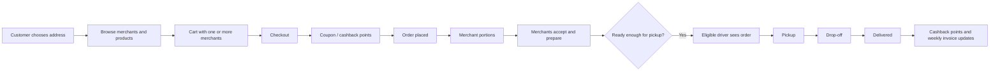
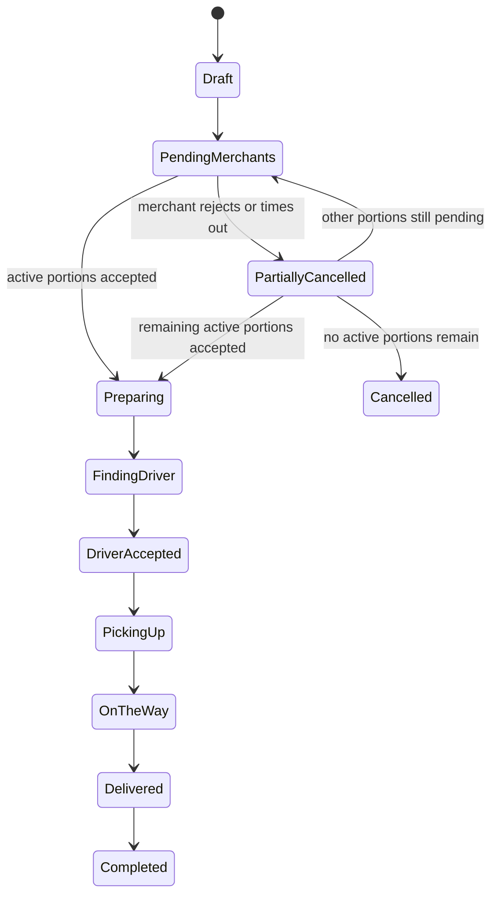
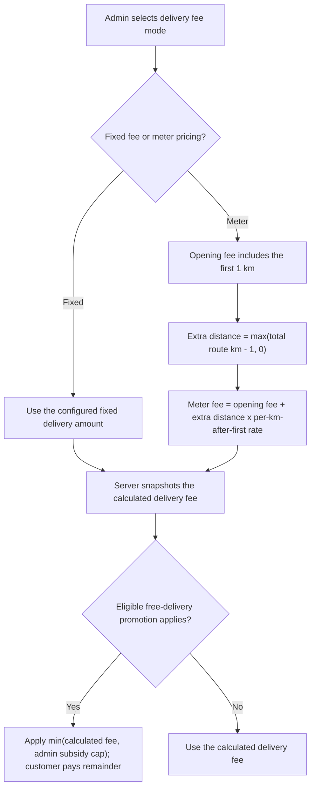
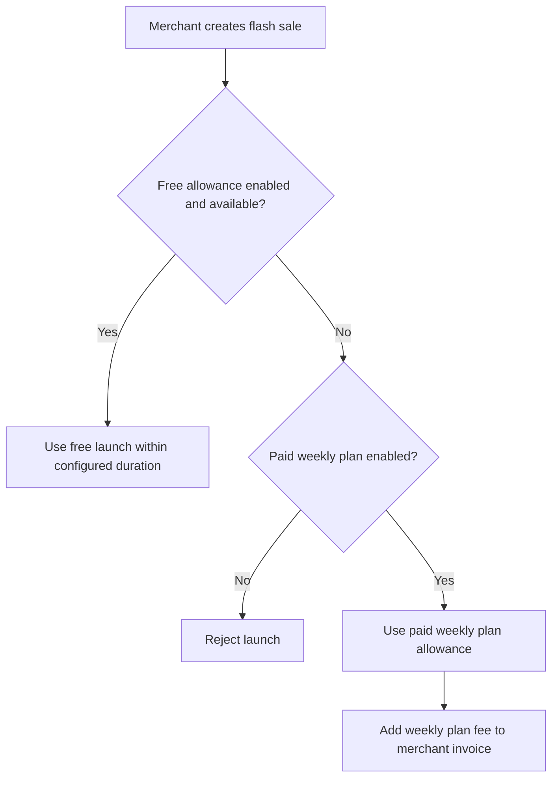
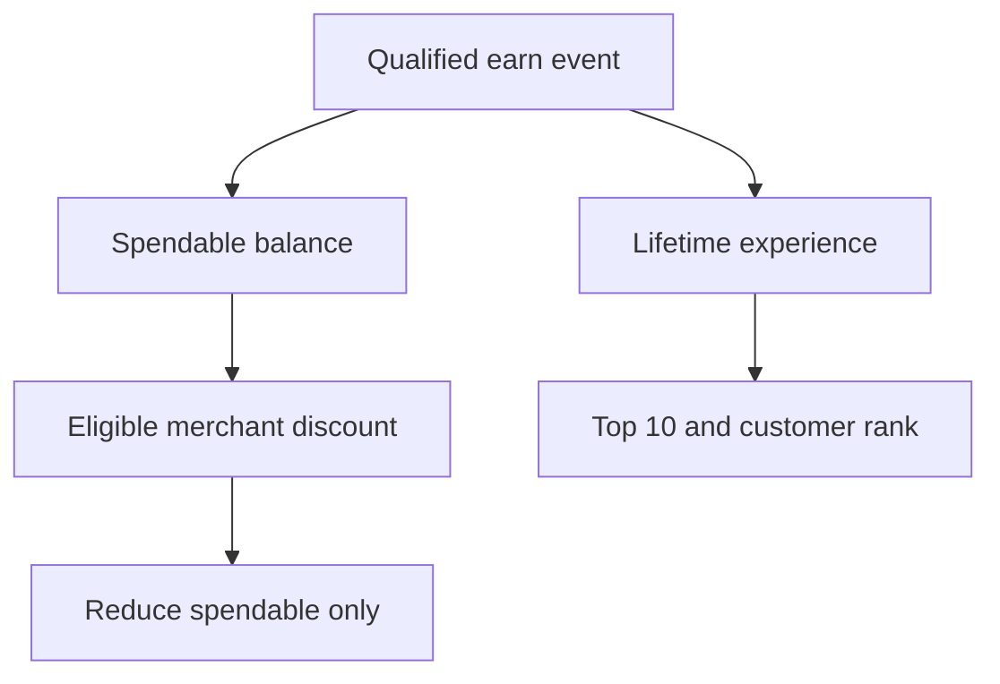
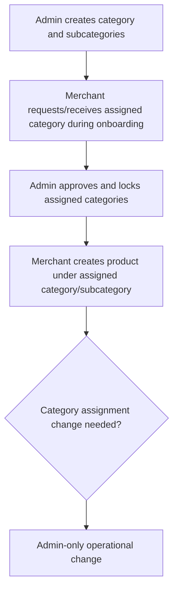

# Yalla Halan - Product Requirements Document

| Field | Value |
|---|---|
| Status | Current approved product scope; Phase 48 backend and Phase 49 Tasks & Rewards runtime are locally implemented, and Phase 50 Merchant availability domain, Merchant-owner/Admin APIs, central catalog/order/weekly enforcement, and active Postman/security assurance are implemented through `backend_293`; frontend and live gates remain open |
| Audience | Client, Product Owner, UI/UX, Mobile, Web, Backend, QA |
| Language | Simple English |
| Delivery Package | Customer App, Merchant App, Driver App, Admin Dashboard, Merchant Dashboard |
| Testing Surfaces | Customer Web, Driver Web |
| Version | 4 August 2026 supplied-UI, backend, and Postman contract sync |
| New Additions Status | AI/XP-social/emergency backend and Tasks & Rewards authoring/progress/voucher/checkout runtime plus eleven-route security/Postman closure are locally implemented; bounded non-production capacity harness wiring is complete through `backend_287`; Merchant weekly hours/Open/Closed/Busy, Admin availability runtime, central catalog/order/weekly enforcement, and eight-route Phase 50 Postman/security closure are implemented through `backend_293`; representative capacity evidence, frontend, and live-provider/deployment evidence remain open |

Yalla Halan is a local marketplace and delivery platform. Customers can order from one merchant or several merchants in the same checkout, up to the admin-configured limit. Each merchant prepares only its own portion. Approved drivers collect the active portions and deliver the order to the customer. Admins control marketplace rules, approvals, pricing, commissions, invoices, promotions, cashback points, reports, safety, and support. Approved additions cover an OpenAI API-powered support assistant grounded in approved knowledge, a lifetime-experience Top 10 leaderboard with controlled Facebook and Instagram activity rewards, separate driver emergency call choices for Yalla Halan and ambulance services, and a USD 350 Tasks & Rewards screen where Admin creates measurable targets and customers earn a personal free-delivery or capped percentage-discount code. The approved Phase 50 amendment adds one Merchant opening time and one closing time applied to the whole week, explicit Open/Closed/Busy state, temporary Busy durations in 30-minute increments, customer-safe next-open messaging, and audited Admin control. The wheel-of-fortune feature is excluded by the owner's religious decision.

This PRD is split into two clear parts:

- **Part 1 - Product PRD:** product behavior in simple language for the client, UI/UX, and app teams.
- **Part 2 - Operational / Integration PRD:** deeper rules for backend, dashboards, QA, and integration teams without turning the PRD into code documentation.

`PRD.md` and `PRD_AR.md` are the synchronized canonical product truth. This update preserves the two-part structure and all 31 numbered sections while merging the approved additions into their proper sections. A requirement here defines approved implementation scope; it is not runtime-complete evidence and does not prove that its frontend already exists.

## Table of Contents

- [Part 1 - Product PRD](#part-1-product-prd)
  - [1. Product Summary](#1-product-summary)
  - [2. Delivery Package](#2-delivery-package)
  - [Supplied Merchant and Delivery UI Contract](#supplied-merchant-and-delivery-ui-contract)
  - [3. User Roles](#3-user-roles)
  - [4. Registration and Approval](#4-registration-and-approval)
  - [5. Full Marketplace Flow](#5-full-marketplace-flow)
  - [6. Customer App Flow](#6-customer-app-flow)
  - [7. Merchant App and Dashboard Flow](#7-merchant-app-and-dashboard-flow)
  - [8. Driver App Flow](#8-driver-app-flow)
  - [9. Admin Dashboard Flow](#9-admin-dashboard-flow)
  - [10. Orders and Status Flow](#10-orders-and-status-flow)
  - [11. Location Pin and Map Behavior](#11-location-pin-and-map-behavior)
  - [12. Products, Categories, and Offers](#12-products-categories-and-offers)
  - [13. Promotions, Coupons, and Cashback Points](#13-promotions-coupons-and-cashback-points)
    - [Tasks and Rewards](#tasks-and-rewards)
    - [Customer Referral Points](#customer-referral-points)
    - [Experience Points, Leaderboard, and Social Activity Rewards](#experience-points-leaderboard-and-social-share-reward)
    - [Birthday Loyalty Discount](#birthday-loyalty-discount)
  - [14. Flash Sales](#14-flash-sales)
  - [15. Delivery Fee Meter Pricing](#15-delivery-fee-meter-pricing)
  - [16. Weekly Orders](#16-weekly-orders)
  - [17. Merchant Weekly Invoices, Driver Daily Settlement, and Print Receipts](#17-weekly-invoices-and-manual-payment-proof)
  - [18. Chat, Calls, Notifications, and Support](#18-chat-calls-notifications-and-support)
  - [19. Product Acceptance Checklist](#19-product-acceptance-checklist)
- [Part 2 - Operational / Integration PRD](#part-2-operational--integration-prd)
  - [20. Platform Modules](#20-platform-modules)
  - [21. Permission Model](#21-permission-model)
  - [22. Order Logic Rules](#22-order-logic-rules)
  - [23. Pricing Rules](#23-pricing-rules)
  - [24. Delivery Fee Technical Rules](#24-delivery-fee-technical-rules)
  - [25. Finance and Invoice Rules](#25-finance-and-invoice-rules)
    - [Merchant Commission Grace and Discount Cost Sharing](#merchant-commission-grace-and-discount-cost-sharing)
  - [26. Flash Sale Billing Rules](#26-flash-sale-billing-rules)
  - [27. Cashback Points Rules](#27-cashback-points-rules)
  - [28. Merchant Category Rules](#28-merchant-category-rules)
  - [29. Weekly Order Builder, Materialization, and Reminder Rules](#29-weekly-order-reminder-rules)
  - [30. Referral and Chat Alert Rules](#30-referrals-and-chat-alert-rules)
  - [31. API and QA Handoff Summary](#31-api-and-qa-handoff-summary)
- [Out of Current Scope](#out-of-current-scope)
- [Retired / Not Active](#retired--not-active)

---

# Part 1 - Product PRD

This part explains the product as the client and design teams should understand it.

[Back to top](#top)

## 1. Product Summary

Yalla Halan connects customers, merchants, drivers, and admins in one order-delivery marketplace.

A customer can place one checkout that includes products from multiple merchants. The order is then split into merchant portions. Each merchant sees only its own portion, accepts or rejects it, and confirms preparation timing. The system computes readiness automatically. A driver sees the order only inside the configured pre-readiness window and only if the driver is eligible by zone, account status, online state, and vehicle type.

The platform also supports discounts, cashback points, birthday loyalty, customer-to-customer referral rewards, weekly order reminders, merchant weekly invoices, compulsory driver daily settlement, flash sales, settlement proof uploads, driver-customer chat, explicit chat alert buttons, SOS, notifications, merchant-product ratings/reputation, admin monitoring, Google Maps Platform location pin selection for customer and merchant locations, Google Routes API distance/duration/ETA routing, and live delivery tracking after assignment. New additions provide a knowledge-grounded customer-support assistant with human handoff, a Top 10 leaderboard based on lifetime experience points that do not decrease on redemption, controlled Facebook and Instagram activity rewards with automatic-first verification, explicit driver call choices for Yalla Halan emergency support or ambulance services, and server-measured customer tasks that issue one personal reward code after a target is completed.

| Promise | Meaning |
|---|---|
| Multi-merchant checkout | A customer can buy from one or several merchants in one order. |
| Clear merchant responsibility | Each merchant manages only its own items. |
| Readiness-based delivery | Drivers do not receive orders before the order is ready enough for pickup. |
| Admin-controlled rules | Admin controls categories, zones, commissions, flash-sale rules, coupons, cashback redemption, referral reward settings, approvals, and invoices. |
| Simple finance | Merchants settle weekly invoices; drivers must settle daily invoices either by cash at Yalla Halan headquarters with admin drop-off, or through Wallet/InstaPay in-app proof upload. |
| Controlled additions | The assistant uses Admin-approved knowledge, the leaderboard shows the signed-in customer at their true rank, emergency actions present two explicit call destinations, and task rewards use server-measured progress plus single-use personal codes. |

[Back to top](#top)

## 2. Delivery Package

| Surface | Delivered to Client? | Purpose |
|---|---:|---|
| Customer Mobile App | Yes | Customer ordering, checkout, cashback balance/history, lifetime experience points, leaderboard and allowed profiles, social activity/link/verification status, Tasks & Rewards progress/codes, order status, weekly orders, chat, and the support assistant. |
| Merchant Mobile App | Yes | Merchant onboarding, orders, products, categories, offers, flash sales, invoices, dashboard, and notifications. |
| Driver Mobile App | Yes | Driver onboarding, eligible orders, pickup/drop-off steps, invoice reminders, dashboard, driver-customer chat, and separate Yalla Halan/ambulance emergency call actions. |
| Admin Web Dashboard | Yes | Platform operations, approvals, categories, zones, finance, promotions, task/target/reward authoring and analytics, knowledge-base management, per-activity social reward controls and exception review, provider-capability status, emergency-phone settings, reports, and support. |
| Merchant Web Dashboard | Yes | Merchant operations and dashboard from web/tablet/desktop. |
| Customer Web | Testing / integration only | Used for QA and API integration checks, not a main client delivery surface. |
| Driver Web | Testing / integration only | Used for QA and API integration checks, not a main client delivery surface. |

This table defines the required final delivery package. The current repository contains backend source and UI reference files, but no production frontend source; a PDF, Postman collection, or Agent Pack entry is not executable frontend evidence.

[Back to top](#top)

## Supplied Merchant and Delivery UI Contract

The merged `MerchantApp.pdf` and `DeliveryApp.pdf` files are the approved screen-order evidence for the Merchant and Delivery apps. English and Arabic mirrors represent the same flow. The UI defines the visible sequence and wording; active backend validation schemas define executable request fields, status transitions, authorization, and error behavior. Merchant Business Hours follows screen 104 exactly: one Start Time and one End Time, applied to every day of the week in `Africa/Cairo`. The app never submits per-day rows or an availability concurrency version.

| Surface | Supplied screen order | Executable backend/Postman contract |
|---|---|---|
| Merchant onboarding/session | 01–06 registration, WhatsApp OTP, documents, pending review; 07–11 login, password reset, blocked state | Shared Auth collection: OTP channels/send/verify, OTP-bound preregistration uploads, Merchant registration, login/reset/refresh/logout. Pending/blocked are response-driven UI states, not separate mutation endpoints. |
| Merchant orders | 12–17 New/Preparing/History, large-order prep adjustment, offline and suspended states | Incoming/history, accept/reject, receipt, account state, and explicit availability. Preparation is finalized at acceptance; retired prep/start/ready actions must not be shown. |
| Merchant catalog | 18–29 products, options, sizes, offers, edit/toggle/delete | Merchant product CRUD, stock toggle, bulk toggle, assigned categories, upload, and backend-valid size/offer payloads. |
| Merchant analysis/promotions | 30–32 product KPIs; 33–36 flash-sale list/subscription/create/time | Product KPI and flash-deal routes. Subscription/payment eligibility remains server-authoritative. |
| Merchant dashboard/settings | 37–40 dashboard/rating/preparation/orders metrics; 41 notifications; 42 settings; 43 help; 44 privacy | Merchant KPIs, notifications, profile/category reads, support threads/messages, and static legal content. No API is fabricated for static Privacy content. |
| Merchant finance | 45–47 invoice, receipt upload, payment submitted | Merchant invoice list, payment instructions, private upload, and invoice receipt submission. |
| Merchant availability additions | 96–103 Open/Busy/Closed dialogs; 104–105 Business Hours | `GET /merchant/availability`, idempotent `PUT /merchant/availability/state`, and `PUT /merchant/availability/schedule` with `{ opensAt, closesAt }`. Saving enables the hours for the whole week. Busy is 30–720 minutes in 30-minute increments. The app sends no availability version. The binary `PATCH /merchant/toggle-active` is compatibility-only and must not drive these screens. |
| Delivery onboarding/session | 01–06 registration, WhatsApp OTP, vehicle/personal verification, pending review; 07–11 login, reset, blocked state | Shared Auth collection: driver OTP, staged private documents, registration, login/reset/refresh/logout. Pending/blocked are response-driven UI states. |
| Delivery work/order flow | 12–13 available orders/work preferences; 14–16 navigation, merchant payout, pickup, customer cash, delivery | Driver dashboard/available orders, accept/reject, online/active state, zone and auto-nearest preference, route/handoff/location/step APIs, and exact merchant-payout confirmation. |
| Delivery communication/state | 17–19 customer chat/alert/cooldown; 20–21 offline/suspended; 22 notifications | Order chat, alert availability/send/acknowledge/dismiss, driver state, and notification list/read actions. |
| Delivery settings/support | 23 settings; 24 edit profile/zone; 25 support | Driver profile, working zone, notification preferences, and owned support threads/messages. |
| Delivery dashboard/finance | 26 dashboard; 27 rating information; 28 orders; 29 earnings; 30–32 invoice payment | Driver dashboard/history, invoice list, payment instructions, private receipt upload, and submission. Screen 27 is informational; there is no driver rating-submission action. |
| Delivery legal/help | 33 help center; 34 privacy | Support actions use the support contract; Privacy is static content with no fabricated API. |

Known open contract gap: supplied Delivery screens 04–05 show front/back National ID, driving-licence and vehicle-registration files, front/side selfies, and a maximum of three vehicle photos. The current backend accepts one `nationalIdFile`, one `selfieFile`, optional single `drivingLicenseFile`/`vehicleRegistrationFile`, and `vehiclePhotoFiles` with no maximum. Active Postman must continue to show that current runtime truth until `backend_294_driver_verification_document_ui_parity` implements and migrates the side-specific contract.

Any supplied screen without production frontend source remains an implementation/UAT task. Any visible action without an active backend contract must become a new Agent Pack step before implementation; it must not be hidden behind a dummy Postman request or a hardcoded frontend response.

[Back to top](#top)

## 3. User Roles

| Role | Goal | Main Actions |
|---|---|---|
| Customer | Order easily and save money | Register, verify by custom WhatsApp or customer-only WhySMS SMS OTP when available, save addresses, browse, checkout, use coupons, earn/redeem cashback points, retain lifetime experience points, view the leaderboard and allowed profiles, link supported social providers, track Tasks & Rewards and use an issued personal code, use the support assistant or request a human agent, use birthday/referral/weekly-order flows, track orders, chat, and rate delivered merchant-product experience. |
| Merchant | Sell and prepare products | Register, get approved, manage products/offers under admin-assigned categories, accept/reject orders, keep product preparation defaults, adjust prep time at acceptance, run flash sales, view invoices, upload proof. |
| Driver | Deliver ready orders | Register, get approved, go online, view eligible sorted orders, manually accept or enable optional auto-nearest accept, navigate multi-stop routes, pick up, deliver, use external Google Maps fallback, view invoices, and explicitly call Yalla Halan emergency support or ambulance services. |
| Admin Staff | Operate assigned sections | Use only the dashboard sections assigned by Super Admin. |
| Super Admin | Full platform control | Create admin staff, assign sections, configure marketplace rules, and access all admin modules. |

[Back to top](#top)

## 4. Registration and Approval

### Customer Registration

| Step | What Happens |
|---|---|
| 1 | Customer chooses language. |
| 2 | Customer enters name, phone, password, and confirmation. |
| 3 | Customer verifies phone using one explicit customer OTP option: custom WhatsApp when available or WhySMS SMS. SMS OTP is customer-only. |
| 4 | Customer adds the first delivery address/location. |
| 5 | Customer account becomes active without admin approval. |
| Optional | Customer can later update profile settings and saved addresses; phone/password remains the only customer sign-in method in the current product scope. |

### Merchant Registration

| Step | What Happens |
|---|---|
| 1 | Merchant chooses language. |
| 2 | Merchant enters brand/store name, phone, password, confirmation, and zone. |
| 3 | Merchant onboarding does not use SMS OTP. Merchant phone/account verification is handled by custom WhatsApp OTP where enabled plus admin document/location approval. |
| 4 | Merchant chooses requested categories created by admin during onboarding; admin approval locks the final assigned category list. |
| 5 | Merchant uploads required documents such as commercial license, tax register, logo, menu, and other required files. |
| 6 | Merchant confirms the pinned store location using the Google Maps pin screen. |
| 7 | Account stays under review until admin approval. |

### Driver Registration

| Step | What Happens |
|---|---|
| 1 | Driver chooses language. |
| 2 | Driver enters name, phone, password, confirmation, and zone. |
| 3 | Driver onboarding does not use SMS OTP. Driver phone/account verification is handled by custom WhatsApp OTP where enabled plus admin document/vehicle approval. |
| 4 | Driver selects vehicle type: motor, scooter, e-scooter, cycle, car, or tricycle. |
| 5 | Driver uploads vehicle documents and pictures as required. |
| 6 | Driver uploads personal documents, national ID, driver license where required, selfie, and police clearance where required by the onboarding flow. |
| 7 | Account stays under review until admin approval. |

### Admin Staff Creation

Admin staff do not self-register from public apps.

| Step | What Happens |
|---|---|
| 1 | Super Admin creates an admin staff account. |
| 2 | Super Admin sets username/email and password. |
| 3 | Super Admin selects which dashboard sections the staff account can access. |
| 4 | Staff can use only assigned dashboard sections. |

The active permission model is **section-based dashboard access**, not a fixed all-purpose admin role model.
The admin dashboard permission matrix may expose action and data-scope metadata so the desktop UI can render controls, but `allowedSections[]` remains the enforced backend grant boundary. Action and data-scope metadata is not a separate persisted granular permission model.

[Back to top](#top)

## 5. Full Marketplace Flow

[Back to top](#top)

## 6. Customer App Flow

| Area | Customer Experience | Rule |
|---|---|---|
| Addresses | Customer can save up to three addresses using a Google Maps pin. | The app uses Google Maps Platform inside the app, asks for location permission when helpful, supports manual pin movement and brand-colored markers, and stores normalized lat/lng + address text + label + Google place metadata when available + Google Maps URL/deep-link helpers. |
| Browsing | Customer browses merchants, products, categories, subcategories, offers, favorites, product size choices, and related add-on suggestions. | Only eligible active merchants/products are shown. Customer product cards/details should use one consistent projection for active price choices, default price choice, offer/favorite state, merchant preparation/map helper fields when available, and grouped related products on detail. Merchant cards/pages can display preparation-time stats: fastest, slowest, and average order preparation time. Product detail can show related products selected by the merchant from sibling subcategories under the same parent category. |
| Cart | Customer can add items from multiple merchants. | Items remain grouped by merchant portion. |
| Item notes | Customer can write an optional note on each product line. | Notes are visible to the merchant for preparation. |
| Checkout | Customer reviews subtotal, coupon, cashback points, birthday discount when eligible, delivery fee, and total. | Server pricing is the final truth. Delivery fee uses Google Routes distance when available: fixed amount or meter opening amount including first 1 km plus additional per-km rate after the first km. |
| Coupons | Customer can apply admin coupons created from the Admin Dashboard. | Each coupon has a percentage, one maximum EGP cap, and merchant scope: all merchants, selected merchants only, or all merchants except selected merchants. In a multi-merchant order the coupon applies only to eligible active merchant portions. |
| Discount funding and settlement | Server-calculated rule. | Coupon and birthday discounts are split using admin-configured merchant contribution percentages, default 0% with optional merchant overrides; the platform funds the remainder. The driver pays each merchant the server-calculated payout after merchant-funded discounts, while platform-funded shares become credits on the compulsory driver daily invoice. Free delivery stays platform-funded. Merchant offers, flash sales, and valid points redemption keep their existing merchant-funded rules. |
| Cashback points | Customer sees cashback points balance/history and can redeem points at eligible merchants. | Points are not cash and cannot be topped up, withdrawn, or transferred. |
| Experience points and leaderboard | Customer sees lifetime experience points, the global Top 10, and their own true rank when outside the Top 10. The customer can open Top 10 profiles and their own profile. | Redemption reduces only spendable balance, not lifetime experience points. The signed-in customer is never duplicated and is never relabeled as rank 11 unless 11 is the true rank. Public profile data is limited to approved identity fields, rank, experience points, most-ordered merchant, and most-ordered product from delivered orders. |
| Social activity rewards | Customer can see separate eligible activities for Facebook follow, Instagram follow, Facebook campaign post, and Instagram campaign post. | Official automatic verification is the primary path. A permitted but unverifiable activity alone may request proof for exception review. A prohibited activity is disabled. Button clicks never earn points. |
| Tasks & Rewards | Customer sees active/upcoming/completed tasks, server-owned progress, reward terms, and personal issued codes. | Initial targets are delivered-order count or delivered paid-merchandise EGP. The reward is either one free-delivery code with a displayed EGP cap or one percentage-discount code with an Admin-set maximum EGP value. Codes are customer-bound and single use. |
| Weekly orders | Customer can create from a delivered recent order or build a new template after clearing the cart. | Create/edit/Order Now/reminder loading always replaces the cart, remains editable, and requires explicit normal checkout confirmation. |
| Status and live tracking | Customer sees one clear order timeline, receives notifications when a merchant portion is cancelled or timed out, and sees the assigned driver live on the order map during active delivery. | Live GPS starts only after driver assignment for active delivery, expires by TTL, and should not store unnecessary long-term raw history. Cancelled merchant notifications include a Browse Products action. |
| Ratings after delivery | After delivery, the customer submits one 1-to-5-star merchant-product experience rating for each delivered merchant portion. | The backend distributes the portion score once to every unique purchased product under that merchant. Product averages are derived from valid distributed ratings, and merchant rating is derived from product ratings. There are no separate per-product star controls. Rejected, cancelled, timed-out, and non-delivered portions are never rating targets. |
| Birthday gift | Customer can receive a birthday loyalty discount once per birthday date when admin settings allow it. | Birthdate is entered once during registration or first profile completion; customer cannot edit it later except through controlled admin/support correction. |
| Chat/call | Customer can chat with the assigned driver for order chat, plus support/complaint channels. Phone visibility controls direct-call exposure. | Hidden phone keeps driver-customer chat and alert available where allowed but disables direct phone call. Driver can use an explicit Alert/Ring button that sends a separate customer chat alert with call-ring/alarm behavior. Normal customer-bound chat messages may use default high-priority customer-chat ring metadata, but must not use the explicit call-alert/alarm behavior. |
| AI support assistant | Customer asks routine guidance/FAQ questions and can request a human support representative. | The assistant retrieves only from published Admin-approved knowledge, fails safely when no supported answer exists, and hands off with conversation context. It has no permission to modify orders, accounts, points, invoices, settlements, or roles. |

[Back to top](#top)

## 7. Merchant App and Dashboard Flow

| Area | Merchant Experience | Rule |
|---|---|---|
| Account state | Merchant is pending until admin approval. | Pending or suspended merchants cannot receive normal orders. |
| Business location | Merchant selects one Google Maps business pin during onboarding. | The pinned location is locked after approval unless admin reopens it; backend keeps lat/lng, address text, label, place metadata when available, and Google Maps helpers. |
| Availability | Merchant selects Open, Closed, or temporary Busy and manages one Start Time and one End Time for the whole week from Settings. Busy starts at 30 minutes and uses 30-minute increments. | The server derives the effective state in `Africa/Cairo`; account/Admin closure, active Busy, manual Closed, or being outside enabled hours prevents every new-order preview/create/materialization path. Existing accepted orders continue. State writes are idempotent and client-version-free. |
| Orders | Merchant sees new orders and accepted/preparing history. | Merchant sees only its own order portion. |
| Accept/reject | Merchant accepts or rejects its portion. | Rejection requires a reason and cancels only that merchant portion; the remaining order is repriced and continues when active portions remain. |
| Preparation | Merchant product records include default preparation time. On acceptance the merchant can adjust preparation time using repeated +/- 5 minute controls and choose normal vs large-capacity eligibility. | The system computes readiness and driver visibility. The platform records preparation duration so fastest, slowest, and average preparation-time metrics can be shown. |
| Products | Merchant adds/edits products with image, stock state, admin-assigned category, subcategory, details, optional offer, optional size/pricing choices, and optional related subcategory groups. | Product category must belong to merchant’s active admin-assigned category list. At least one active price choice is required: Standard only, or one or more active sizes such as S/M/L with their own prices. Related groups can only point to visible sibling subcategories under the same selected parent category. |
| Categories | Merchant can view assigned platform categories only. | Category add/edit/remove is admin-managed after onboarding; merchant app/dashboard must not expose category assignment mutation controls. |
| Flash sales | Merchant can launch limited flash-sale promotions while approved and eligible under the existing flash rules. | Commission grace and an effective 0% commission do not block flash sales. Existing free allowance, paid weekly plan, duration, product/account eligibility, moderation, and weekly invoice billing remain authoritative. |
| Invoices | Merchant sees weekly invoice breakdown and uploads payment proof. | Commission grace, normal commission, paid flash-sale cost, redeemed-points cost, and payment proof are separated. Coupon/birthday merchant shares already deducted from the driver-to-merchant payout appear only as reconciliation rows and are never charged again. |
| Customer phone privacy | Merchant receives the approved privacy reminder/shortcut while confirming an order. | A hidden customer number must remain hidden in merchant and driver projections; any permitted disclosure requires authorization and audit. |
| Dashboard | Merchant sees sales, commission, order, rating, product performance, and preparation-time metrics. | Metrics should separate revenue from amounts due to platform and show fastest/slowest/average preparation time plus sample count when available. |
| Ratings and reputation | Merchant rating is not an independent manual score. It is derived from ratings received by the merchant's products/merchant portions. | Product ratings are averaged per product, then merchant rating is recomputed from all product-rating documents or product averages weighted by rating count. This keeps the merchant score tied to real delivered products. |
| Driver approaching pickup | Merchant can receive a near-arrival notification when the assigned driver is close to pickup. | Thresholds are admin-configurable by distance and/or ETA; each stop/event is sent once and deduplicated by order, stop, and event type. |

### Merchant Working Hours and Busy Rules

| Rule | Requirement |
|---|---|
| Business Hours | One validated `opensAt`/`closesAt` pair in `Africa/Cairo` is applied identically to all seven days. Overnight hours are allowed when closing time is earlier than opening time. Existing Merchants remain on compatible manual behavior until scheduling is enabled. |
| Open | Clears a temporary Busy state and requests normal acceptance, but cannot bypass a closed schedule window, Admin lock, or unavailable account. |
| Closed | Stops new orders until the Merchant explicitly selects Open and the higher-priority rules permit it. |
| Busy | Stops new orders for 30–720 minutes in multiples of 30, displays the expected return time, and expires automatically from server time. |
| Admin control | Authorized Admin can edit schedule/state/Busy and apply or clear a force-closed lock with a required reason and immutable audit. Merchant cannot clear the Admin lock. |
| Customer message | Busy and scheduled closure expose a safe status and next return/open time when known. Internal Admin reasons are never exposed. |
| Enforcement | Catalog visibility is not enforcement. Preview, create, draft edit/retry, checkout, and weekly materialization revalidate every distinct Merchant before side effects; multi-Merchant failure is atomic. |

### Merchant Preparation-Time Metrics

The platform should help customers and admins understand how quickly each merchant normally prepares accepted orders. These metrics are informational and should be calculated from real completed merchant portions.

| Metric | Meaning | Where It Appears |
|---|---|---|
| Fastest preparation time | The shortest valid time from merchant acceptance/preparation start to ready/cooked. | Merchant public page, customer merchant card where space allows, admin merchant account list. |
| Slowest preparation time | The longest valid time from merchant acceptance/preparation start to ready/cooked. | Merchant public page and admin merchant account details/list. |
| Average preparation time | The average valid preparation duration across delivered/completed merchant portions. | Merchant public page, customer browsing, merchant dashboard, admin merchant list. |
| Sample count and last calculated time | The number of valid portions used and when the stats were calculated. | Admin merchant details/list, merchant dashboard, and customer merchant pages where useful. |

Preparation-time stats must ignore cancelled/rejected/timeout-cancelled merchant portions and should not count orders that never reached ready/cooked.

[Back to top](#top)

## 8. Driver App Flow

| Area | Driver Experience | Rule |
|---|---|---|
| Approval | Driver is pending until admin approval. | Pending/suspended drivers cannot receive normal orders. |
| Vehicle | Driver selects vehicle type including car or tricycle. | Big/large orders require an eligible large-capacity driver: car or tricycle. |
| Online/offline | Driver controls availability. | Offline drivers do not receive orders. |
| Available orders | Driver sees eligible orders within the admin-configured pre-readiness window, default 5 minutes before merchant readiness, sorted by Google route distance/ETA. | Eligibility includes zone, account status, online state, vehicle, readiness window, bicycle/cycle kilometer cap, route distance, large-capacity rules, and rejection history. |
| Acceptance | Driver can manually accept trips or optionally enable auto-nearest accept. | Auto-nearest is off by default and must use server-side assignment locking so two drivers cannot take the same trip. |
| Pickup | Driver confirms pickup from merchant and confirms merchant payment when required. | This confirmation moves the customer-visible status line to picked up/on the way. Assigned driver may pick eligible portions first while others continue preparing. |
| Drop-off | Driver delivers to customer and completes delivery step. | Delivery completion finalizes order-side effects. |
| Maps, navigation, and emergency | Driver sees in-app Google navigation/map view for the active multi-stop route and can still open Google Maps externally as fallback. | Route includes next ready pickup, remaining active pickups, and customer drop-off. The emergency sheet keeps the internal platform SOS action separate from explicit call choices for Yalla Halan emergency support and the ambulance destination configured for the operational zone; none uses the customer chat-alert channel. |
| Notification bell / DND | Driver can mute ordinary driver-ring notifications. | DND does not disable SOS, mandatory safety notices, invoice enforcement, or order-state validation. |
| Delivery handoff | Driver sees the customer choice: `door` or `building_entrance`. | The assigned driver must acknowledge and follow the selected handoff method before completion. |
| Invoices | Driver sees compulsory daily invoice and pays it daily. | Admin controls default/custom driver commission percent and can drop/settle cash-paid invoices from the dashboard. |

[Back to top](#top)

## 9. Admin Dashboard Flow

| Section | Admin Work |
|---|---|
| Overview / monitor | Track marketplace KPIs, delayed orders, active customers, online drivers, and Merchants split into Open, Busy, Scheduled Closed, Manual Closed, Admin Closed, and Account Unavailable. |
| Approvals | Review merchant and driver onboarding requests. |
| Staff permissions | Super Admin creates staff accounts and selects allowed dashboard sections. |
| Categories | Create and manage platform categories and subcategories. |
| Zones and locations | Manage service zones, account zone assignment, Google Maps/API readiness, live tracking thresholds, and stored lat/lng location snapshots when needed. |
| Accounts | Browse customers, merchants, drivers; suspend/reactivate where allowed. Merchant lists expose preparation metrics plus effective availability, next transition/open, Busy-until, and filters. Authorized staff can edit weekly hours/Open/Closed/Busy or apply a separate audited Admin force-close lock. |
| Ratings and quality | Monitor merchant-product bundle ratings and derived product/merchant aggregates; audit inappropriate comments; trigger safe recomputation if required. |
| Finance | Configure merchant/driver commission defaults and overrides, merchant commission-free order threshold defaults/overrides, coupon/birthday merchant-contribution percentages, driver-to-merchant payout rules, daily driver credits, delivery fee pricing, invoices, credits, and payment instructions. |
| Flash sales | Configure free launches on/off, free launch count/duration/renewal, paid weekly plan count/duration/price, and billing rules. |
| Coupons | Create percentage coupons with a maximum cap and choose merchant scope: all, selected only, or all except selected merchants. |
| Cashback points | Choose eligible merchants and set point-to-money redemption value per merchant. |
| Leaderboard and social rewards | View the Top 10 and customer ranks; configure each Facebook/Instagram activity independently; see provider capability/policy state; review only permitted manual exceptions; and audit automatic or manual awards and duplicate prevention. |
| Tasks and rewards | Create draft tasks, choose one controlled target, publish/pause/archive revisions, choose free-delivery or capped-percentage reward terms, and review progress, issued codes, redemption, expiry, and platform cost. |
| Support assistant | Create, edit, publish/unpublish approved FAQ/knowledge entries, enable the assistant, set usage/handoff controls, and review unanswered questions without granting the assistant operational actions. |
| OTP channels | Configure customer-only WhySMS SMS OTP, custom WhatsApp OTP availability, cooldowns, channel switch limits, failed-attempt lockout, and abuse controls. Runtime availability and shared limits are active; admin UI controls remain a frontend/admin-surface step. |
| Birthday loyalty | Enable/disable birthday loyalty, set max discount percent, product price cap, order subtotal cap, notification hour, and reports. |
| Safety and alerts | Configure separate Yalla Halan emergency and ambulance destinations by operational zone, including enablement, display name, and validated phone number. No active call action appears without a valid enabled number. Preserve internal platform SOS and its optional last authorized location, configure chat Alert/Ring limits, and audit call-dialer attempts. Calling begins only after the driver selects and confirms a destination. |
| Orders | Monitor all orders, cancelled merchant portions, timeout cancellations, delayed orders, and intervene operationally when needed. |
| Support/reports | Manage complaints, support, reports, and broadcasts. |

[Back to top](#top)

## 10. Orders and Status Flow

| Step | Owner | Meaning |
|---|---|---|
| Draft | Customer | Customer can still edit/delete/continue before final flow. |
| Pending merchants | Merchants / system | Merchants must accept before the admin-configured response timeout. |
| Portion cancelled | Merchant / system | A merchant portion is cancelled when the merchant rejects it with a reason or when the merchant response timeout passes. |
| Repricing | System | The order is recalculated after any cancelled merchant portion: items, coupon, cashback redemption, delivery route/distance/fee, totals, and future cashback earning base. |
| Preparing | Merchants | Remaining accepted merchant portions continue normally. |
| Finding driver | System / driver | Eligible drivers see only the current active route and pickup list after cancelled portions are removed. |
| Pickup | Driver | Driver collects remaining ready merchant portions. |
| Drop-off | Driver | Driver delivers to the customer. |
| Completed | System | Cashback and weekly invoice effects are finalized using the final active order value. |

### Merchant Rejection or Timeout Flow

1. Each merchant accepts or rejects only its own portion.
2. Admin sets the maximum merchant response time from the dashboard.
3. If a merchant rejects, the merchant must write a clear rejection note.
4. If the merchant does not respond before the timeout, that merchant portion is cancelled automatically with a system reason such as `Merchant did not respond in time`.
5. Cancelled merchant portions are removed from the active order route and pricing, but remain in the order audit history.
6. The customer receives a notification that explains which merchant portion was cancelled and why.
7. The notification includes a call-to-action to browse products again if the customer wants to place a separate new order.
8. The remaining order continues with active/accepted merchant portions when at least one active portion remains.
9. If no active merchant portions remain, the whole order is cancelled and the customer is notified.
10. The customer should still be able to cancel the whole order where normal cancellation rules allow it, but the platform does not block the remaining accepted portions just because one merchant rejected or timed out.

Example: with the default limit, if a customer orders from 4 merchants and 1 merchant rejects, that merchant portion is cancelled with its note, the customer is notified, the order is repriced for the remaining 3 merchants, delivery distance/fee and discount totals are recalculated, and the customer can browse again to place a separate order for replacement items.

[Back to top](#top)

## 11. Location Pin and Map Behavior

Google Maps Platform is the active map provider for customer and merchant location selection. Google Routes API is the active routing provider for route distance, duration, ETA, legs, provider snapshots, and delivery-fee meter calculations. The location is saved as structured address text plus coordinates; the Google Maps URL/deep-link is a helper for opening the same point in a map app, not the only source of truth.

| Area | Active Product Rule |
|---|---|
| Customer saved locations | Customer can save up to three locations using a Google Maps pin, current-location permission, or manual pin movement. |
| Merchant store location | Merchant selects one pinned Google Maps store location during onboarding; after approval it remains locked unless an admin flow reopens it. |
| Stored location truth | Backend stores lat/lng, address text, label, zone, Google place metadata when available, and Google Maps URL/deep-link helpers where coordinates are present. |
| Marker styling | Frontend can use brand-colored marker styling through the app map layer and Google Maps map IDs where needed. |
| Web/admin rendering | Web/admin map rendering may use Google Maps JavaScript API where a map view is required. |
| Driver navigation | Driver receives pickup/drop-off coordinates, route projections, Google Maps helpers, in-app Google navigation data during active delivery, and an external Google Maps fallback. |
| Map and routing truth | Google Maps Platform helper links and Google Routes API routing are the active product truth across app, handoff, and backend surfaces. |

[Back to top](#top)

## 12. Products, Categories, and Offers

Admin creates the platform category tree. A category can have subcategories, plus an `OTHER` fallback where allowed.

Merchant category rules:

1. Merchant chooses requested categories during onboarding.
2. Admin approval locks the merchant's assigned category list.
3. Merchant cannot create, add, edit, or remove platform category assignments from the merchant app/dashboard after approval.
4. Category assignment changes after approval are admin-only operational actions.
5. Product create/edit must choose one assigned merchant category.
6. Product create/edit must choose a subcategory under that category, or `OTHER` where allowed.
7. Product offers are separate from flash sales and can be toggled during product create/edit.
8. Product pricing supports a backward-compatible Standard price plus optional size choices. A product may use Standard only, or activate one or more size choices (`S`, `M`, `L`) with a required price for each active choice.
9. When more than one price choice is active, customer add-to-cart must carry the selected price choice so the order stores an immutable price snapshot.
10. Merchant product create/edit can select related subcategories from the same parent category as the product. Related product suggestions resolve dynamically from the same merchant's available products in those selected subcategories, excluding the current product.
11. A product cannot select related subcategories from another parent category, another merchant, inactive subcategories, or arbitrary product IDs outside the chosen category tree.

[Back to top](#top)

### Product Size and Related-Items Rules

| Area | Product Rule |
|---|---|
| Standard pricing | Existing single-price products remain valid as `Standard` pricing. The legacy `price` field may continue to represent the default/minimum active price for compatibility. |
| Size pricing | Optional size choices are `S`, `M`, and `L` with customer-facing labels Small, Medium, and Large. A merchant may activate all three, two, one, or no sizes. Each active size must have its own non-negative price. |
| Active price choices | Every product must have at least one active price choice. If only Standard is active, customer UX can behave like the current single-price flow. If multiple choices are active, add-to-cart and checkout must require the chosen option. |
| Order snapshot | Order line items must snapshot the selected price option code, label, and unit price at order time. Later product edits must not change existing order totals. |
| Related subcategories | Merchant can choose related subcategory IDs from the same parent category as the product. Example: a Syrian Food sandwich can point to Drinks and Additions subcategories under Syrian Food. |
| Related products shown to customer | Product detail should show the same merchant's available products in the selected related subcategories, grouped by related subcategory when useful, excluding the current product. |
| Customer catalog projection | Home feed, search, offers, flash deals, merchant product lists, merchant pages, and product detail should expose the same active price-option/default-choice/favorite/offer fields so clients do not infer missing catalog truth. |
| Guards | Reject cross-category related subcategories, inactive subcategories, duplicate choices, and products with no active price choice. |

[Back to top](#top)

## 13. Promotions, Coupons, and Cashback Points

| Mechanism | Who Controls It? | Customer Impact |
|---|---|---|
| Product offer | Merchant | Product appears with a discounted/offer price. |
| Coupon | Admin | Customer receives a percentage discount with a maximum cap. |
| Task reward code | Admin creates the task and target; server issues the code | After completing a server-measured task, the customer receives one personal free-delivery or capped percentage-discount code. |
| Eligible free-delivery promotion | Admin | When no coupon or birthday loyalty discount is used, an eligible order receives platform subsidy up to the admin-configured cap, default 30 EGP; the customer pays any delivery-fee remainder above that cap. Coupon/birthday savings take precedence and suppress this benefit. Applied free-delivery subsidy is platform-funded and reported against platform share/amount due. |
| Flash sale | Merchant under admin rules | Product gets urgent limited-time promotion. |
| Cashback points | Customer uses points under admin redemption rules | Points reduce eligible merchant portion price. |

### Coupons

Coupons are simple customer-facing discounts.

| Field | Meaning |
|---|---|
| Discount percent | Percentage discount applied to the eligible merchant merchandise subtotal. |
| Maximum discount cap | One maximum EGP amount for the complete coupon discount, not one cap per merchant. |
| Merchant scope | `all`, `include`, or `exclude`; admin chooses all merchants, selected merchants only, or all except selected merchants. |
| Active dates | Optional start/end window. |
| Usage limits | Optional total or per-customer usage control. |

Coupon example:

| Item | Value |
|---|---:|
| Merchandise subtotal | 1,000 EGP |
| Coupon percent | 10% |
| Maximum cap | 70 EGP |
| Actual coupon discount | 70 EGP |

### Tasks and Rewards

Tasks & Rewards is an approved USD 350 addition for the Customer App and Admin Dashboard. The Phase 49 versioned Admin authoring/lifecycle domain, server-owned progress projection, customer-bound voucher lifecycle, authoritative checkout/cancellation/delivery integration, eleven permission/ownership-gated APIs, their active Postman/security closure, and the bounded non-production capacity harness are implemented locally. Analytics, representative capacity evidence, and all frontend surfaces remain open.

| Rule | Requirement |
|---|---|
| Customer screen | Show active, upcoming, completed, paused, and expired task states; numeric/progress-bar progress; reward terms; and the customer's own issued codes. Frontend never calculates authoritative progress. |
| Admin authoring | Admin creates a draft with Arabic/English title and description, one controlled target, target value, dates, merchant scope, minimum order value when needed, reward expiry, issuance/budget limit when configured, and one reward type; then publishes, pauses, resumes, or archives through an audited `tasks_rewards` permission. |
| Initial target types | `delivered_order_count` counts each delivered customer order once regardless of merchant count. `delivered_paid_merchandise_egp` uses the final delivered paid-merchandise earning base, excluding delivery fee, cancelled/rejected/timeout/undelivered portions, UAT/test orders, and weekly templates. Arbitrary script/query formulas are forbidden. |
| Revision truth | Material changes to a published task create a new revision. Existing progress and issued codes keep their original snapshot; no retroactive repricing or silent reward withdrawal. |
| Progress integrity | Each contribution has a unique task-revision/customer/source-order key. Completion and reward issuance are transaction-safe and idempotent under retries and concurrency. |
| Free-delivery reward | Issue one customer-bound, single-use code for one order. The reward snapshots an Admin-controlled maximum delivery subsidy; if it does not cover the full fee, UI must say “free delivery up to X EGP.” |
| Percentage reward | Issue one customer-bound, single-use percentage code with `1..100%` and one required positive maximum EGP discount cap. Existing `all/include/exclude` merchant scope, one-cap, and deterministic multi-merchant allocation rules apply. |
| Funding | Task rewards are platform-funded by default. The order snapshots source and funding, and platform-funded amounts reconcile through the existing driver daily-credit/finance rules without charging a merchant twice. |
| Exclusivity | A task-reward code is the selected order benefit. It cannot coexist with a normal coupon, birthday discount, or another free-delivery benefit. Valid points redemption remains separate under current policy. |
| Voucher lifecycle | `issued -> reserved -> redeemed`, with `expired/reversed` outcomes. Order creation reserves once; concurrent reuse fails. Full cancellation restores according to the approved policy; partial cancellation reprices remaining eligible portions. Copying or validating a code never consumes it. |
| Privacy and reports | Customer sees only own progress/codes. Admin receives permission-bounded aggregated progress, issuance, redemption, expiry, and actual platform-cost metrics plus audited support lookup. |

[Back to top](#top)

### Cashback Points

Cashback points are not a cash wallet. They are a points balance/history system.

| Rule | Meaning |
|---|---|
| Earning | Customer earns 1 point for every paid EGP of merchandise subtotal. |
| Delivery fee | Delivery fee does not earn points. |
| Redemption | Points can be used as discount only at admin-enabled merchants. |
| Merchant-specific value | Admin defines how much money a point bundle is worth for each merchant. |
| No cash behavior | No top-up, withdrawal, transfer, or stored-money payment. |

Earning example:

| Item | Value |
|---|---:|
| Product subtotal | 100 EGP |
| Delivery fee | 20 EGP |
| Earned points | 100 points |

Redemption example:

| Merchant | Admin Rule | Customer Uses | Discount |
|---|---|---:|---:|
| Merchant A | 100 points = 5 EGP | 1,000 points | 50 EGP |
| Merchant B | 100 points = 3 EGP | 1,000 points | 30 EGP |

[Back to top](#top)

### Customer Referral Points

Customer referral rewards let one customer invite another customer using a referral code. Rewards are points inside the existing points system, not cash and not a separate wallet.

| Rule | Requirement |
|---|---|
| Referral code | Each customer can have a unique referral code to share. |
| Registration input | New customer registration may include an optional referral code. |
| Admin settings | Admin controls whether referrals are enabled and the point value for inviter and invitee. |
| Reward trigger | Both inviter and invitee receive points only after the invited customer completes the first real delivered order. |
| Abuse prevention | No self-referral, no duplicate reward, no reward for cancelled/rejected/test/non-delivered orders. |
| Points model | Referral rewards use the existing points ledger with source metadata; they are not cash, not transferable money, and not a wallet top-up. |
| Reports | Admin can review referral links, first-delivered-order trigger status, points awarded, and suspicious/duplicate attempts. |

[Back to top](#top)

### Experience Points, Leaderboard, and Social Activity Rewards

The existing redemption system remains unchanged. The platform keeps spendable points and a separate lifetime experience-point value used for ranking.

| Rule | Requirement |
|---|---|
| Unified earning | Each qualified purchase, referral, or verified/approved social-activity earn event credits spendable points and lifetime experience points. |
| Redemption | Spending points reduces spendable balance only; it does not reduce lifetime experience points. |
| Invalid earning reversal | Fraud, cancellation, or an erroneous earn event may reverse both values through an auditable source-linked correction. This is not normal redemption. |
| Global Top 10 | Rank customers by qualified lifetime experience points. |
| Signed-in customer | If outside the Top 10, show the customer after the list with their true platform rank. If inside, do not duplicate the row. |
| Stable ties | Break ties by the timestamp at which the score was reached, then a stable account identifier. |
| Profile access | From this list, customers can open Top 10 profiles and their own profile only. |
| Profile content | Show approved public identity fields, current rank, experience points, most-ordered merchant, and most-ordered product based only on completed delivered orders. |
| Separate activities | Facebook follow, Instagram follow, Facebook campaign post, and Instagram campaign post are four independent activity types. Each has its own enablement, point value, campaign dates, cooldown, and per-account/day/month limits. |
| Automatic-first verification | Award automatically only after an official provider API or webhook returns evidence that identifies the customer, activity, campaign, and unique occurrence. Pressing a Follow or Share button is never proof. |
| Manual fallback | If an activity is permitted by the provider but official automation cannot verify it, only that activity may use an auditable proof/link review queue. Automatically verifiable activities do not create Admin review work. |
| Policy gate | If provider policy prohibits rewarding an activity, that activity stays disabled. No scraping, browser automation, password collection, or fabricated verification is allowed. |
| Reward controls | Admin controls each activity independently. Unique source keys prevent duplicate awards for the same account, provider occurrence, post/proof, campaign, or reward cycle. |
| Privacy | Never expose phone numbers, addresses, detailed order history, or customer-to-customer relationships. |

[Back to top](#top)

### Birthday Loyalty Discount

Birthday loyalty is a controlled admin feature. It rewards customers on their birthday without turning birthdate into an editable discount loophole.

| Rule | Requirement |
|---|---|
| Admin control | Admin can enable/disable the feature and configure maximum discount percent, maximum eligible product price, maximum eligible order subtotal, and notification hour. |
| Birthdate capture | Customer enters birthdate once during registration or first profile completion. |
| Birthdate edits | Customer cannot edit birthdate later; admin/support can correct or reopen it only through a controlled action. |
| Discount percent | Age-based percent equals current age; actual percent is `min(age, admin max discount percent)`. |
| Eligibility | Applies once per birthday date, only to eligible products whose unit/effective price is within the product price cap, and only when eligible order subtotal is within the order subtotal cap. |
| Delivery fee | Birthday discount does not apply to delivery fee. |
| Snapshot | Order stores the birthday discount percent, eligibility decision, discount amount, and settings snapshot for audit. |
| Customer flags | Backend exposes `birthdayGiftAvailable`, `birthdayDiscountPercent`, `birthdayEligibleToday`, `birthdayPopupShouldShow`, `birthdayPopupSeen`, and records popup seen. |
| Notifications | Birthday push notification is sent in the morning; first app open on birthday can show popup/confetti. |
| Admin reports | Reports show eligible customers, notified customers, used birthday discounts, total discount amount, and per-date/month reporting. |

#### Coupon/birthday cost sharing and merchant-funded points settlement

Coupon-code and birthday discounts remain customer-facing platform promotions, but their internal funding is split by admin policy. The global merchant contribution defaults to `0%` for each type and may be overridden per merchant; the remaining amount is platform-funded. Admin-authored coupons also store merchant scope (`all`, `include`, or `exclude`), discount percentage, and one maximum EGP cap. Checkout still permits only one coupon/birthday/free-delivery benefit: coupon and birthday cannot coexist, and either positive discount suppresses free delivery. Free delivery remains fully platform-funded. The driver pays each merchant the server-derived payout after merchant-funded shares, and platform-funded shares reduce the driver daily invoice. Redeemed cashback points, referral points, merchant-created product offers, and flash-sale responsibilities keep their existing rules. Every order stores merchant/platform funding and scope snapshots so later settings do not rewrite historical settlement.

## 14. Flash Sales

Flash sales are merchant promotions controlled by admin rules. Commission grace or an effective `0%` merchant commission does not block create, activate, update, or reschedule. Flash sales are not billed by the hour; after the existing free allowance is used, the merchant must use an admin-configured weekly paid plan/subscription if paid usage is enabled.

| Rule | Product Meaning |
|---|---|
| Commission independence | Commission grace and effective `0%` commission do not affect flash-sale availability. |
| Free launches enabled | Admin can enable or disable the free flash-sale allowance for eligible approved merchants. |
| Free launch count | Admin sets how many launches are free. Default product rule: 3 free launches. |
| Free launch duration | Admin sets max duration for each free launch. Default product rule: 1 hour per free launch. |
| Renewal mode | Admin decides whether free launches renew weekly or are lifetime-only. |
| Paid plan enabled | Admin can allow or block paid flash-sale usage after the free allowance. |
| Paid weekly plan launch count | Admin sets how many flash-sale launches the paid weekly plan allows. |
| Paid weekly plan launch duration | Admin sets the max duration of each paid-plan launch. |
| Paid weekly plan price | Admin sets the weekly subscription/plan price. |
| Weekly invoice | Paid flash-sale plan cost is added to the merchant weekly invoice as a separate line item. |

Flash sale invoice example:

| Component | Value |
|---|---:|
| Merchant commission | 250 EGP |
| Paid weekly flash-sale plan | Enabled |
| Plan allowance | 3 launches/week |
| Max duration per plan launch | 1 hour |
| Weekly plan price | 60 EGP/week |
| Total weekly invoice due | 310 EGP |

[Back to top](#top)

## 15. Delivery Fee Meter Pricing

Delivery fee is controlled from the Admin Dashboard and priced by the backend. The customer, merchant, and driver apps display the server result; they do not calculate billing truth locally.

| Mode | Admin Setting | Customer Meaning |
|---|---|---|
| Fixed fee | One fixed delivery amount | Same delivery fee regardless of route distance. |
| Meter pricing | Opening/first-kilometer amount + additional per-km rate after the first km | The first kilometer is included in the opening amount. Only distance after the first km is multiplied by the additional per-km rate. |

Meter pricing example:

| Item | Value |
|---|---:|
| Route distance | 3.5 km |
| Opening amount including first 1 km | 20 EGP |
| Additional distance | 2.5 km |
| Additional per-km rate | 8 EGP/km |
| Delivery fee | 40 EGP |

An eligible free-delivery promotion applies up to the admin-configured subsidy cap. It turns the fee into zero only when the calculated fee does not exceed that cap; otherwise the customer pays the remainder.

[Back to top](#top)

## 16. Weekly Orders

Weekly Orders are reusable customer-owned templates. They never auto-submit a purchase. Every run places a fresh, editable copy of the template into an empty cart and requires explicit customer confirmation through the normal checkout flow.

### 16.1 Creation Entry Paths

| Entry path | Customer flow | Locked rule |
|---|---|---|
| From Recent Orders | Customer opens a delivered recent order, chooses **Make Weekly**, enters a template name, reminder day, and reminder time, then saves. | Only an order owned by the customer and already delivered can be used. The historical price is not final checkout truth. |
| New Weekly Order | Customer opens Weekly Orders and presses **Create**. The app warns that the current cart will be cleared, then transfers the customer to product browsing in weekly-template builder mode. | The complete cart must be cleared before any template items are loaded or added. Template contents must never merge with an existing cart. |

### 16.2 New Template Builder Mode

| Area | Requirement |
|---|---|
| Cart reset | Frontend clears the complete current cart before builder mode. Backend handoff must explicitly return/require `cartResetRequired=true` and `mergeAllowed=false`. |
| Browsing | Customer browses normal merchants/products and adds items normally, subject to availability and the admin-configured merchant cap. Default maximum is 4 merchants. |
| Primary action | Checkout is replaced by **Save Weekly Order**. Saving does not create an Order, reserve stock, dispatch a driver, create an invoice, or start the order timer. |
| Schedule | Customer enters template name, weekday, reminder time, and timezone. Default timezone is `Africa/Cairo` unless another valid supported timezone is supplied. |
| Snapshot | Store unique product lines grouped by merchant, quantities, selected price-option/size code, and item notes where supported. Revalidate current availability and prices whenever loaded. |

### 16.3 Template Management

| Feature | Rule |
|---|---|
| Multiple templates | Customer can create multiple named weekly templates. |
| Active switch | Active/inactive controls scheduled reminders. An inactive template remains editable and can still use Order Now. |
| Edit | **Edit** clears the current cart, loads the complete template into builder mode, and changes the CTA to **Save Weekly Order Changes**. Products, quantities, notes, name, day, time, and timezone can be changed. |
| Delete | Deletes the reusable template only, not historical or already-submitted real orders. |
| Ownership | Customer can access only their own templates and reminder occurrences. |

### 16.4 Order Now and Scheduled Reminder

| Trigger | Required behavior |
|---|---|
| Order Now | Clear the complete current cart, materialize the template into the cart, allow remove/add/replace/quantity changes, then continue through normal checkout and explicit confirmation. |
| Scheduled reminder | Send a reminder notification only. Opening it clears the cart and materializes the template. It must not place an order automatically. |
| Dismiss reminder | Skip the current occurrence only; the active template remains scheduled for next week. |
| Repeat/idempotency | Active reminders repeat every seven days and must not duplicate the same due occurrence. |

### 16.5 Availability and Pricing at Run Time

| Rule | Requirement |
|---|---|
| Unavailable products | Materialization returns available and unavailable lines separately. Customer may remove unavailable items or add replacements. |
| Merchant state | Closed, suspended, non-accepting, or weekly-disabled merchants are reported; invalid lines are never silently submitted. |
| Current truth | Recheck products, price option, quantities, merchant eligibility, admin merchant cap, address/zone, delivery, discounts, and cashback rules. |
| No stale-price promise | Template/history prices are references only. Server preview/checkout pricing is final. |
| Explicit checkout | Materialization never creates a payable/submitted order; normal preview/create/timer/fee flow remains required. |

### 16.6 Backend Transition Rule

The active flow can migrate eligible legacy `templateOrderId` templates to reusable snapshots and emits reminder notifications that open cart materialization. It does not create new `weekly_suggestion` Orders. Existing compatible records may remain readable, but no path auto-submits an order.

[Back to top](#top)

## 17. Merchant Weekly Invoices, Driver Daily Settlement, and Print Receipts

Yalla Halan uses separate settlement rules for merchants and drivers.

- Merchants settle platform dues on a weekly invoice.
- Drivers must settle their invoice every day. Daily settlement is compulsory. The driver can pay by Wallet/InstaPay inside the app and upload a receipt image, or can pay cash at Yalla Halan headquarters. When cash is paid at headquarters, admin marks/drops the driver invoice from the admin dashboard.
- Payment proof remains reviewable by admin for Wallet/InstaPay payments. Cash-at-HQ settlement is an admin action and must keep an audit note.

### Merchant Weekly Invoice

| Component | Rule |
|---|---|
| Commission base | Completed merchant merchandise value for the week. |
| Commission percent | Merchant custom percent if set; otherwise global merchant default. It applies only after the commission-free threshold. |
| Coupon/birthday funding split | Admin sets default merchant contribution percentages and optional merchant overrides. The merchant and platform shares are snapshotted per active merchant portion. Free delivery remains fully platform-funded. |
| Merchant payout reconciliation | The driver pays the merchant the exact server-calculated merchandise payout after merchant-funded coupon/birthday shares and valid redeemed points. Platform-funded shares bridge the customer-payment difference. |
| Merchant-funded product offers | Product offers and flash-sale item prices created by the merchant are borne by that merchant through the price snapshot. |
| Flash-sale costs | Paid weekly flash-sale plan/subscription cost is borne by the merchant and added as a separate weekly invoice component, including while commission grace is active. |
| Redeemed points | Cashback-point redemption cost is borne by the merchant only when the active merchant portion has a valid admin-rule redemption snapshot. |
| Total due | Portion-level net commission after grace + paid flash-sale fees + other unsettled merchant liabilities. Coupon/birthday/points amounts already deducted from merchant payout are informational reconciliation rows only and must not be charged again. |
| Proof | Merchant uploads payment proof. Admin approves/rejects. |

### Driver Daily Invoice

| Component | Rule |
|---|---|
| Settlement cadence | Daily, compulsory. Driver must settle each day. |
| Commission base | Completed driver delivery value/earnings for the day. |
| Commission percent | Driver custom percent if set; otherwise global driver default. |
| Platform-funded credits | The platform-funded coupon, birthday, and free-delivery shares are shown separately and reduce the compulsory driver daily invoice because the driver paid the merchant those platform-funded amounts. |
| Discount incompatibility | A normal coupon, task-reward code, birthday loyalty discount, and automatic free-delivery benefit are mutually exclusive order benefits. A conflicting checkout returns `ORDER_DISCOUNT_BENEFIT_CONFLICT`; valid cashback-point redemption remains separate and may coexist. |
| Payment methods | Wallet or InstaPay inside the app with receipt image upload; or cash at Yalla Halan headquarters. |
| Admin cash handling | If paid cash at headquarters, admin drops/settles the driver invoice from the dashboard with audit note and settlement actor. |
| Total due | Gross daily driver/platform liability minus platform-funded credits. Any excess credit remains explicit instead of disappearing at a zero floor. |

### Merchant Order Print Receipt

The Merchant App must support printing a professional receipt for each merchant portion/order from a receipt printer or system print dialog.

| Receipt Field | Requirement |
|---|---|
| Brand | Use restaurant/merchant name and optional merchant logo only. Do not show Yalla Halan branding, Yalla Halan phone, platform commission, or internal platform settlement fields. |
| Order reference | Show customer-facing order number and internal order ID where available. |
| Driver | Show assigned driver name when assigned. |
| Code | Show the order/merchant pickup code used by the merchant/driver flow. |
| Content | Show only this restaurant/merchant portion items, quantities, options/size, notes, and totals relevant to that merchant. |
| Format | Thermal-printer friendly, professional, short, and safe for direct printing. |

[Back to top](#top)

## 18. Chat, Calls, Notifications, and Support

| Area | Product Rule |
|---|---|
| Chat | Active order chat is between the assigned driver and customer. Support and complaint threads remain separate from order chat. |
| Unread counters | Users should see unread chat badges/counts. |
| Chat alert button | Driver can press an explicit Alert/Ring button inside customer-driver order chat to send a customer chat alert with call-ring/alarm sound where available. Normal chat pushes to the customer keep `customer_chat_ring` metadata only and must not use `customer_chat_call_alert`. |
| SOS / emergency | The driver emergency sheet exposes an internal platform SOS action and separate call choices for the enabled, validated Yalla Halan and zone-appropriate ambulance destinations. A call begins only after explicit selection and confirmation and only opens the device dialer. |
| Calls | Direct call is available only when customer phone visibility allows it. |
| Notifications | Used for account approval, orders, chat, invoices, weekly reminders, and support. |
| Support | Customers, merchants, and drivers can contact support or submit complaints where supported. |
| AI support and human handoff | The OpenAI API-powered assistant retrieves only from published Admin-approved FAQ/knowledge content, identifies the supporting source where possible, fails safely when knowledge is absent, and hands off to a support representative with conversation context. It cannot modify orders, accounts, points, invoices, settlements, or permissions. |

The assistant integration is server-side only. OpenAI credentials stay in the deployment secret store and never enter apps, Postman examples, logs, or the repository. Published knowledge has a versioned ingestion/index status; draft or failed-ingestion content cannot ground customer answers. The provider/model and limits are configuration, not client truth. Prompts and telemetry minimize personal data, enforce rate/cost limits, redact sensitive values, and preserve an auditable handoff summary. OpenAI API usage is an operating cost separate from development.

Chat alert rule: the driver Alert/Ring action is not a voice call and does not open a voice channel. It creates a visible chat alert/system event for the customer and plays a call-ring/alarm sound when available. The customer cannot reply to the alert object itself, but can open the customer-driver chat and respond normally. Repetition is controlled by admin dashboard safety settings: `chatAlertRepeatSeconds` defines when the button becomes available again, with per-driver/per-order caps and terminal-state blocking. It must not be blocked merely because a previous alert is still unacknowledged.

Internal platform SOS is separate from a phone call and from the customer chat-alert channel/cooldown. SOS may attach the driver's last authorized location to the internal alert. Each dialer-open attempt records destination type, configured phone snapshot, driver, related order when present, time, and success/failure to open the dialer; it never records call audio or content. A dialer failure does not cancel an SOS already raised, and DND never hides or blocks emergency actions.

[Back to top](#top)

## 19. Product Acceptance Checklist

| Area | Must Be Clear |
|---|---|
| Delivery package | 3 mobile apps + Admin Dashboard + Merchant Dashboard are the real client deliverables. |
| Orders | Multi-merchant portions and readiness-based delivery are understandable. |
| Merchant products | Category/subcategory, Standard/S/M/L pricing, selected price snapshot, and related-items rules are clear. |
| Merchant category assignment | Merchant can view assigned categories; category add/edit/remove is admin-managed and hidden from merchant mutation surfaces. |
| Finance | Weekly invoices show commission, flash-sale costs, total due, and proof status. |
| Flash sales | Free launches on/off, free count/duration/renewal, paid weekly plan count/duration/price, and weekly invoice billing are clear. |
| Coupons | Percentage, one maximum cap, and all/include/exclude merchant scope are clear. |
| Cashback/referrals | Points are not cash; cashback and referral earning/redemption rules are clear. Referral inviter reward waits for invited customer first delivered order. |
| Experience and leaderboard | Spendable balance and lifetime experience are separate; redemption does not reduce experience; Top 10, signed-in true rank, profile access, and delivered-order statistics are correct. |
| Social activity rewards | Four independent activity types, automatic official verification first, manual exception only when permitted and necessary, provider-policy disablement, configurable points/limits, and idempotent duplicate prevention are clear. |
| Tasks and rewards | Server-owned delivered-order/spend progress, Admin-authored targets, one customer-bound code, two allowed reward types, expiry/reservation/restoration, platform funding, and benefit exclusivity are clear. |
| Merchant availability | Weekly Cairo-time hours, explicit Open/Closed/Busy, Busy expiry/cancel, Admin lock/audit, customer next-open messaging, stale-cart recovery, and fail-closed preview/create/weekly enforcement are clear. |
| Support assistant | Published knowledge only, safe failure, human handoff, tenant privacy, and no operational action permissions. |
| Ratings | One merchant-product experience score per delivered merchant portion is distributed to unique purchased products; there is no separate per-product input. |
| Privacy and handoff | Hidden customer phone, audited disclosure, driver DND boundaries, and door/building-entrance choice are clear. |
| Safety | Internal SOS, customer chat Alert/Ring, and phone calls are separate; zone-aware Yalla Halan/ambulance destinations require valid Admin configuration, explicit confirmation, DND bypass, and auditable dialer attempts without call content. |
| Wheel of fortune exclusion | No wheel screen, API, Admin setting, reward, seed, or test data exists. |
| Admin | Super Admin creates staff and assigns sections. |
| Evidence | A target surface is not marked complete unless executable source and verification evidence exist. |

[Back to top](#top)

---

# Part 2 - Operational / Integration PRD

This part gives implementation teams enough detail to build and test correctly.

[Back to top](#top)

## 20. Platform Modules

| Module | Responsibility |
|---|---|
| Auth and accounts | OTP, login, approval, suspension, role access. |
| Catalog | Categories, subcategories, products, offers, favorites, merchant pages. |
| Orders | Draft, checkout, merchant portions, preparation, driver assignment, delivery, status projections. |
| Merchant availability | One weekly Business Hours pair, idempotent manual state, temporary Busy, Admin lock, server-owned internal version/audit, effective-state projection, and new-order enforcement. |
| Finance | Commissions, weekly invoices, flash-sale costs, receipts/proofs, overdue handling. |
| Promotions | Coupons, eligible free-delivery promotions, flash sales, product offers. |
| Cashback and experience points | Spendable balance/history, redemption preview, reserve/commit/restore/reverse, plus lifetime experience that does not decrease on redemption. |
| Leaderboard and verified sharing | Top 10, signed-in true rank, allowed profiles, most-ordered merchant/product statistics, and verified share claims. |
| Tasks and rewards | Versioned Admin-authored targets, delivered-order progress events, personal reward-code issuance, reservation/redemption/reversal, and cost analytics. |
| Weekly orders | Named templates, scheduled reminders, confirm/dismiss suggestions. |
| Chat/notifications | Assigned driver-customer order chat, unread counters, push/inbox notifications, and separate Alert/Ring behavior. |
| Safety and privacy | Driver-map SOS, separate Yalla Halan/ambulance phones, customer phone visibility, DND boundaries, and delivery handoff preference. |
| AI customer support | Approved FAQ/knowledge, grounded retrieval, rate limits, safe failure, unanswered-question reporting, and human handoff without operational tools. |
| Integrations and media | OpenAI API, WhySMS, WhatsApp OTP, Firebase, Google Maps/Routes, and protected Hostinger-hosted media. |
| Admin operations | Monitoring, approvals, permissions, rules, reports, support. |

[Back to top](#top)

## 21. Permission Model

| User Type | Access Model |
|---|---|
| Customer | Own profile, addresses, orders, chat, points/rank/share requests, the global Top 10, limited public profiles of Top 10 customers, and own task progress/reward codes only. |
| Merchant | Own store, own categories, own products, own order portions, own invoices, and own weekly hours/Open/Closed/Busy controls; cannot clear an Admin availability lock. |
| Driver | Own profile, eligible orders, assigned order steps, own invoices. |
| Admin Staff | Only assigned dashboard sections. |
| Super Admin | All dashboard sections and staff management. |

Admin dashboard action/data-scope labels are descriptive metadata for dashboard rendering. Backend authorization remains section-based through `allowedSections[]`; Super Admin access is implicit for all sections.

Knowledge publishing, social reward configuration, provider-capability review, permitted manual exceptions, `tasks_rewards` authoring/support lookup, Merchant schedule/state/Busy/Admin-lock mutation through `merchant_availability`, and emergency-number management require explicit Admin sections/permissions and audit events. Read-only `accounts` access alone cannot mutate Merchant availability. Support staff receive only the minimum converted conversation context needed to assist the customer. The AI assistant itself receives no operational permission.

[Back to top](#top)

## 22. Order Logic Rules

1. A customer order can contain one or multiple merchant portions.
2. One customer order must not exceed the admin-configured merchant cap. The default is **4 distinct merchants per order** and the active value is stored as a snapshot on the order.
3. Each merchant portion has its own accept/reject/preparing state and server-computed readiness time.
4. Admin controls the maximum merchant response time before a pending portion is cancelled by timeout.
5. Merchant rejection requires a rejection reason note.
6. Merchant rejection or timeout cancels only that merchant portion by default, not the entire order.
7. The customer receives a notification containing the cancelled merchant, the reason, and a Browse Products action for placing a separate replacement order if desired.
8. If at least one active merchant portion remains, the order continues with the remaining portions after server repricing.
9. If no active merchant portions remain, the whole order is cancelled.
10. Driver discovery is allowed only inside the admin-configured pre-readiness window; the default lead time is 5 minutes.
11. A single-merchant order can appear to eligible drivers inside that window before the computed readiness time.
12. A multi-merchant order can appear when at least one accepted active portion enters that window.
13. Driver may pick ready active portions while other accepted active portions continue preparing.
14. Big/large-capacity orders are visible only to large-capacity drivers: car or tricycle. Compatibility field names may still say `requiresCarDriver` / `requiresCarDelivery`.
15. Zone, vehicle, account state, online state, and rejection history affect driver eligibility.
16. Ratings can be created only after order delivery and only for delivered active merchant portions/products.
17. Customer phone visibility controls whether merchant/driver direct-call is allowed.
18. Product line items with active size choices must snapshot the selected `Standard`/`S`/`M`/`L` option, label, and unit price at draft/order creation. Server-side pricing remains authoritative.
19. A delivered order may contribute once to each eligible published task revision. Task progress and reward issuance use server-owned final order values and unique source-order keys; customer payloads cannot advance progress.
20. Every new-order preview, create, edit/retry, checkout confirmation, and weekly materialization revalidates the effective state of every distinct Merchant from server time. If any portion is unavailable, creation fails atomically before benefit reservation or other side effects; already accepted orders continue.

### Merchant Preparation-Time Metrics Rules

| Rule | Requirement |
|---|---|
| Measurement window | Use merchant acceptance/preparation start to ready/cooked timestamp. If a dedicated preparation-start timestamp exists, use it; otherwise fall back to accepted timestamp. |
| Included portions | Count only valid portions that reached ready/cooked and later completed/delivered successfully. |
| Excluded portions | Ignore rejected, cancelled, timeout-cancelled, and never-ready portions. |
| Metrics | Expose fastest, slowest, average, and sample count. |
| Customer visibility | Customer-facing merchant cards/pages may show the average and optionally fastest/slowest when the UI has room. |
| Admin visibility | Admin merchant account lists/details should show fastest, slowest, average, sample count, and last calculated time. |

[Back to top](#top)

## 23. Pricing Rules

| Step | Component | Rule |
|---:|---|---|
| 1 | Product subtotal | Sum of product price snapshots. |
| 2 | Product offer / flash price | Reflected in product price snapshot. |
| 3 | Coupon discount | Percentage discount capped by max EGP amount. |
| 4 | Cashback points discount | Per eligible merchant portion using merchant-specific point value. |
| 5 | Delivery fee | Separate from merchandise pricing. Fixed mode uses fixed amount. Meter mode uses Google Routes distance when available: opening/first-kilometer amount plus additional per-km rate after first km. |
| 6 | Birthday loyalty discount | Applied only when eligible and snapshotted separately from coupon/cashback. |
| 7 | Task-reward benefit | One customer-bound code selects either a platform-funded percentage discount with one maximum EGP cap or free-delivery subsidy with a displayed EGP cap; it is mutually exclusive with normal coupon, birthday, and other free-delivery benefits. |
| 8 | Final customer payable | Merchandise payable after discounts + delivery fee. |
| 9 | Post-cancellation repricing | If a merchant portion is cancelled by rejection or timeout, subtotal, coupon/task reward, cashback, birthday eligibility when relevant, Google route distance, delivery fee, driver pickup list, and final payable are recalculated from the remaining active portions. |
| 10 | Cashback/task spend base | Paid merchandise subtotal only, excluding delivery fee and after removed merchant portions are excluded; task progress stores a source-linked contribution once per eligible task revision. |

[Back to top](#top)

## 24. Delivery Fee Technical Rules

| Rule | Requirement |
|---|---|
| Server owned | Backend calculation is billing truth for customer, merchant, driver, and invoices. Route/delivery fee snapshots must be stored on orders for audit. |
| Fixed mode | Uses one fixed delivery amount. |
| Routing provider | Google Routes API is the active routing provider and returns routeDistanceMeters, routeDurationSeconds, ETA, legs/waypoints when needed, provider snapshots, and delivery-fee meter distance inputs. |
| Meter mode | Opening/first-kilometer amount includes the first 1 km. |
| Additional distance | `max(distanceKmTotal - 1, 0)`. |
| Additional rate | Applied only to kilometers after the first km. |
| Rounding | Money values round to two decimals. |
| Free-delivery subsidy | If an automatic promotion or free-delivery task code is eligible, apply the lower of the calculated fee and its stored subsidy-cap snapshot; the customer pays any remainder and UI must display the cap. |
| Multi-stop updates | Multi-stop route distance and delivery fee update when merchant portions are removed by rejection or timeout. |
| Legacy naming | Existing code may use `baseFee` and `perKmRate`, but active wording must make first-kilometer inclusion clear. |

[Back to top](#top)

## 25. Finance and Invoice Rules

| Rule | Requirement |
|---|---|
| Merchant default commission | Admin sets platform default merchant percent. |
| Merchant override | Admin can set custom percent for one merchant; custom wins over default. |
| Commission-free threshold | Admin sets a global default count, default `0`, and may override it per merchant. The first N eligible delivered merchant portions use `0%`; normal commission starts at N+1. |
| Eligible count | One delivered active merchant portion counts once. Rejected, cancelled, timed-out, non-delivered, UAT/test portions, weekly templates, suggestions, and item quantities do not count. |
| Driver default commission | Admin sets platform default driver percent. |
| Driver override | Admin can set custom percent for one driver; custom wins over default. |
| Merchant weekly invoice | Weekly commission settlement plus paid flash-sale plan/usage and other unsettled merchant liabilities. Coupon/birthday/points amounts already deducted from merchant payout are reconciliation-only and must not be charged again. |
| Promotion funding split | Coupon and birthday discounts use admin-configured merchant contribution percentages with defaults `0%` and optional merchant overrides; the remainder is platform-funded. The driver pays the merchant the server-derived payout after merchant-funded shares, and platform-funded shares reduce the driver's compulsory daily invoice. Free delivery remains fully platform-funded. |
| Task-reward funding | Task percentage and free-delivery rewards are platform-funded by default, carry task/revision/customer/voucher/order snapshots, and reduce the driver's compulsory daily invoice where the driver funded the merchant/customer benefit. They must not create a second merchant charge. |
| Driver daily invoice | Driver invoice is generated/settled daily and is compulsory. It contains explicit platform-funded coupon, birthday, and free-delivery credits, and supports Wallet/InstaPay proof upload or cash-at-HQ admin drop/settlement. |
| Discount exclusivity | Exactly one order benefit may be selected from normal coupon, task-reward code, birthday discount, or automatic free delivery. A free-delivery task code is the selected free-delivery benefit, not an extra coupon discount. |
| Payment proof | Merchant/driver uploads proof for Wallet/InstaPay payments; admin approves/rejects. Cash-at-HQ driver payment is settled by admin with audit note. |
| Overdue handling | Overdue unpaid invoices can restrict/suspend the account according to platform rules. |
| Merchant print receipt | Merchant can print a restaurant-branded order receipt with no Yalla Halan branding or platform settlement data. |

[Back to top](#top)

## 26. Flash Sale Billing Rules

Required configurable flash-sale fields:

| Field | Meaning |
|---|---|
| Free launches enabled | Whether merchants get free flash-sale launches at all. |
| Free launches count | Number of free launches. Default product rule: 3. |
| Free launch duration | Maximum duration of each free launch. Default product rule: 1 hour. |
| Renewal mode | Admin chooses whether free allowance renews weekly or is lifetime-only. |
| Paid plan enabled | Admin can allow or block paid usage after free allowance. |
| Paid weekly plan launch count | Number of launches available under the paid weekly plan. |
| Paid weekly plan launch duration | Maximum duration of each paid-plan launch. |
| Paid weekly plan price | EGP price of the weekly flash-sale plan/subscription. |
| Invoice integration | Paid weekly plan cost is added to merchant weekly invoice. |

[Back to top](#top)

## 27. Cashback Points Rules

| Rule | Requirement |
|---|---|
| Earn rate | 1 paid EGP merchandise subtotal = 1 point. |
| Delivery exclusion | Delivery fee does not earn points. |
| Redemption eligibility | Admin decides which merchants accept points. |
| Redemption value | Admin sets how many EGP discount a point bundle gives per merchant. |
| Ledger | Every earn/redeem/restore/reverse action is auditable. |
| Atomic earning | Each qualified earn updates spendable and experience values once with a unique source key. |
| Redemption invariant | Reserve/commit redemption reduces spendable balance only and never reduces lifetime experience. |
| Invalid earn reversal | A source-linked cancellation, fraud finding, or correction can reverse both values; this is distinct from redemption. |
| Leaderboard | Top 10 uses qualified lifetime experience and appends the signed-in customer at the true rank when outside the Top 10 without duplication. |
| Profile statistics | Most-ordered merchant and product use completed delivered order lines only, with deterministic tie-breaking. |
| Social activity awards | No reward is recorded before official verification or an allowed manual approval. A unique source key prevents duplicate account/provider-occurrence/post/proof/campaign/cycle awards. |
| Cash behavior | Points are not money and cannot be topped up, withdrawn, or transferred. |

[Back to top](#top)

## 28. Merchant Category Rules

Rules:

1. Admin owns the platform category tree.
2. Merchant can view only its assigned active admin-created categories.
3. Merchant cannot create, add, edit, or remove category assignments after approval.
4. Category assignment changes are admin-only actions and must not appear as merchant mutation controls.
5. Product create/update must validate merchant category ownership and subcategory relationship.
6. Related-subcategory selections must stay under the same parent category as the product.
7. Related product suggestions are not a global recommendation system; they are deterministic same-merchant products from selected sibling subcategories.

[Back to top](#top)

## 29. Weekly Order Builder, Materialization, and Reminder Rules

| Rule | Requirement |
|---|---|
| Recent-order source | Customer may create a template from their own delivered recent order. |
| New custom template | Weekly Orders **Create** starts a dedicated builder after clearing the full cart. |
| Never merge carts | Create, edit, Order Now, and reminder materialization replace/clear the existing cart before loading template contents. |
| Builder CTA | Builder/edit uses **Save Weekly Order** / **Save Weekly Order Changes**, not Checkout. |
| Template contents | Store merchant-grouped unique product lines, quantities, selected size/price-option codes, and supported item notes. |
| Merchant limit | Save and materialization respect the current admin-configured maximum; default 4. |
| Name and schedule | Customer-defined name, weekday, time, timezone; default `Africa/Cairo`. |
| Toggle | Active templates generate reminders; inactive templates do not. Both remain editable and support Order Now. |
| Edit | Clear cart, load template into builder, allow product/schedule/name changes, then replace stored snapshot. |
| Order Now | Clear cart, load valid lines, show unavailable lines, allow edits, then normal explicit checkout. |
| Scheduled reminder | Notification only. Opening it materializes into an empty cart; no automatic order placement. |
| Dismiss | Skip only the current reminder occurrence. |
| Availability | Revalidate merchants, products, quantities, and selected price options on every load. |
| Pricing | Recompute in normal preview/checkout; template/history price is not billing truth. |
| Unavailable handling | Return explicit reason codes so customer can remove/replace items. |
| Idempotency | Prevent duplicate reminders/materializations for the same persisted occurrence. |
| Compatibility | Existing compatible template records must migrate or remain readable without data loss; no legacy record may submit an order automatically. |

[Back to top](#top)

## 30. Referral and Chat Alert Rules

| Area | Backend / QA Rule |
|---|---|
| Referral settings | Admin manages enablement, invitee points, inviter points, and reward trigger. |
| Referral registration | Customer registration accepts optional `referralCode`; it links the invited customer but does not immediately grant inviter reward. |
| Reward lifecycle | Inviter and invitee points are granted after the invited customer completes the first real delivered order. Reward grants are idempotent. |
| Ledger | Referral rewards are points ledger entries with source metadata; they do not create stored money. |
| Experience projection | Qualified purchase, referral, and verified/approved social activity earns update spendable points and experience; redemption reduces spendable points only. |
| Social verification | Facebook follow, Instagram follow, Facebook campaign post, and Instagram campaign post are separate. Official API/webhook evidence is primary; permitted unverifiable activity may use proof review; prohibited activity is disabled. |
| Social-abuse prevention | Admin controls each activity's points, campaign dates, cooldown, account/day/month limits, and enablement; unique keys prevent duplicate provider occurrences, proofs, posts, campaigns, or cycles. |
| Chat alert | Only the driver can send an explicit Alert/Ring inside driver-customer order chat. It is a chat/system alert plus call-ring/alarm push, not a voice call. Merchant chat alerts are retired. |
| Normal messages | Normal driver-customer messages to the customer can carry `attentionMode=ring`, `notificationBehavior=customer_chat_ring`, `sound=default`, and `priority=high`; they must not use `customer_chat_call_alert` or the alert/alarm sound. Only explicit driver Alert/Ring uses the call-alert/alarm channel. |
| Cooldowns | Admin dashboard owns alert repetition settings. `chatAlertRepeatSeconds` controls the UI copy such as "Available every 3 minutes" / "Available after 1 minute". Per-driver/per-order caps and terminal-order rejection still apply. |

[Back to top](#top)

## 31. API and QA Handoff Summary

Exact endpoints belong in backend API docs and Postman. This PRD defines behavior and acceptance. `/api/v1` is the canonical API base; `/api` is a legacy compatibility alias only and must not be presented as the canonical integration path.

| Group | QA Focus |
|---|---|
| Orders | Draft, checkout, merchant portions, merchant cap default 4 and admin override, merchant rejection reasons, merchant-response timeout cancellations, repricing after cancelled portions, Google route/delivery snapshots, readiness, driver assignment, live tracking, near-arrival events, completion. |
| Merchant availability | One Cairo Start/End pair for the whole week, idempotent Open/Closed/Busy source and effective state, Admin force-close/audit, customer badges/next-open, legacy-toggle migration, direct-payload/stale-cart/multi-Merchant/weekly enforcement, and no benefit consumption on rejection. Internal versioning remains server-owned; client availability mutations carry no version. Domain foundation/migration/evaluator, Merchant-owner/Admin APIs, central enforcement, and active Postman/security assurance are implemented; frontend and live gates remain open. |
| Ratings and reputation | Delivered-order rating, one score per delivered merchant portion, product fan-out, product averages, merchant aggregate from product ratings, duplicate-rating prevention, and rejected/cancelled/timeout portion exclusion. |
| Merchant categories | List assigned categories only, hide merchant add/edit/remove controls, and validate product binding to admin-assigned categories. |
| Finance | Commission defaults/overrides, invoices, proof upload, flash-sale costs. |
| Promotions | Coupons, flash sales, product offers, and eligible free-delivery subsidy. |
| Tasks and rewards | Admin lifecycle/revision controls, delivered-order progress, customer-only reads, exactly-once personal voucher issuance, checkout validation/reservation/redemption/restoration, platform-funded order/settlement snapshots, and eleven-route static security/Postman assurance are active locally. Analytics, current load evidence, and frontend remain open. |
| Cashback, experience, and leaderboard | Spendable balance/history, redemption preview, commit/restore/reverse, lifetime experience, Top 10, signed-in true rank, redemption not reducing experience, allowed profiles/statistics, and idempotent policy-gated social activity rewards. |
| Weekly orders | Create from recent order or new builder, full cart replacement, snapshot save/edit/toggle/delete, Order Now, reminder materialization, unavailable-item handling, explicit checkout confirmation. |
| Google Maps / Routes | Customer/merchant pin flows, Google Maps helpers, Google Routes distance/ETA/delivery fee snapshots, multi-stop route updates. |
| Driver navigation | Manual accept, optional auto-nearest accept, assignment locking, active multi-stop route projection, in-app Google navigation, external Google Maps fallback. |
| Birthday loyalty | Birthdate immutability, admin settings, checkout pricing, popup seen state, birthday notification, and admin reports. |
| Chat/notifications | Threads, unread counters, push/inbox records. |
| AI support assistant | Knowledge publish lifecycle, grounded responses, source identification where possible, safe failure, rate limits, tenant privacy, unanswered-question reporting, and human handoff without assistant actions. |
| Safety/privacy/handoff | Internal SOS versus chat Alert/Ring versus phone-call separation; zone-aware Admin-managed Yalla Halan/ambulance destinations; invalid-number hiding; explicit call selection/confirmation; dialer-attempt audit without call content; internal alert survival when the dialer fails; optional last authorized SOS location; driver DND boundaries; hidden customer phone; and `door`/`building_entrance` acknowledgement. |
| Exclusions | Prove there is no wheel-of-fortune route, screen, setting, reward, seed, or fixture. |
| Authorization/security | Authentication, current account status, role/permission checks, tenant/ownership/assignment isolation, rate limits, upload content validation, private media, OTP purpose/atomicity, Socket parity, and negative tests. |
| Production | Hostinger deployment, MongoDB Replica Set, HTTPS/CORS/proxy, providers, backup/restore, monitoring, real frontend builds, and live E2E evidence. |

Verification should include install, build, lint, tests, seeded live smoke, and local server startup. Seeded smoke is not the same as full endpoint-matrix coverage.

[Back to top](#top)

---

## Out of Current Scope

| Item | Status | Notes |
|---|---|---|
| Unnecessary long-term raw GPS history | Out of scope | Live driver GPS is active only during assigned active delivery; history must be minimized and expire by TTL unless a future privacy/legal requirement justifies more. |
| Silent OTP fallback | Out of scope | Do not silently switch WhatsApp OTP to SMS without clear customer action. |
| Tips | Unresolved UI-only signal | Do not treat as active billing truth unless later accepted. |
| Fragile/perishable flags | Unresolved UI-only signal | Do not treat as active backend truth unless later accepted. |
| Countdown TTL on driver card | Unresolved UI-only signal | Do not treat as active backend truth unless later accepted. |
| Full customer social graph | Rejected from the current product | Friends/follows, customer-to-customer messaging, activity feeds, public profiles, and social notifications create a separate moderation/privacy/abuse and high fan-out traffic domain. They must not be mixed into the marketplace runtime. |
| Custom characters and full Yalla Identity gamification | Out of scope | Limited lifetime experience points for the leaderboard are in scope. Avatars, levels, tiers, achievements, challenges, mystery boxes, seasons, cosmetic inventory, and character creation remain a separate content/economy product. |
| Manual/unbounded task engine | Out of scope | The USD 350 Tasks & Rewards addition supports only server-measured delivered-order count or paid-merchandise EGP targets and the two approved code rewards. Manual proof tasks, arbitrary scripts/queries, cash prizes, seasons, loot boxes, and an unlimited campaign engine are excluded. |
| Wheel of fortune | Rejected; do not implement | There is no technical blocker, but the owner excludes the feature for religious reasons related to chance, gharar, and maysir. No screen, API, Admin setting, reward, seed, or fixture may be created. |
| Driver level and dispatch-priority system | Rejected as designed | Bronze/Silver/Gold/Platinum/Ambassador priority would conflict with nearest/eligible dispatch, depends on a driver-rating contract that is not active, and can starve lower-tier drivers. Operational KPI reporting may be proposed separately without changing dispatch priority. |
| Time-based smart campaign engine | Out of scope | Existing coupons, flash sales, offers, banners, and notifications remain the current truth. Dynamic segmentation, seasonal themes, challenges, unlimited campaign rules, and cross-vertical orchestration are a separate campaign product. |
| Yalla Pharmacy vertical | Rejected pending separate discovery and legal approval | Prescription handling, medical review, emergency priority, drug catalog rules, and local regulatory compliance are a separate regulated vertical and cannot be inferred from generic merchant/category support. |
| Expanded emergency operations case management | Dual calling in scope; case management out of scope | Platform SOS plus explicit Yalla Halan emergency/ambulance call choices are in scope. Customer-no-response cases, incident workflow, replacement-driver orchestration, compensation automation, emergency operations console, and AI anomaly detection remain outside this addition. |
| Owner Admin Dashboard wishlist beyond the canonical modules | Out of scope | The current Admin scope is defined in Sections 9, 20, and 21. Gamification control, pharmacy control, AI prediction, universal content/theme editing, arbitrary feature flags, wallet management, and microservice control are not included in the base dashboard. |
| Mandatory Redis/CDN/event-driven/microservice/read-replica redesign | Not required for the current release | The current modular monolith may add measured caching or infrastructure only after profiling and capacity evidence. Architecture is not expanded merely to satisfy a technology checklist. |
| Full live endpoint-matrix execution | External release evidence gate | The runner and coverage registry exist. A passing claim requires an isolated transaction-capable MongoDB Replica Set, synthetic credentials, a live API listener, and explicit destructive-test acknowledgement. Missing infrastructure is recorded as blocked evidence, not an open code task and not a pass. |

[Back to top](#top)

## Retired / Not Active

| Item | Status | Reason |
|---|---|---|
| Driver Cash Advance | Retired | Removed from active product truth. |
| Active cash-advance finance flow | Retired | Historical only. |
| Cash wallet | Not active | Current customer balance is cashback points, not money. |
| Admin-configurable cashback earn rate | Not active | Earn rate is fixed at 1 paid merchandise EGP = 1 point. |
| Commission-only coupons | Not active | Coupons are customer-facing percentage discounts with a cap. |
| Flash-sale free-beta wording | Not active | Admin-configured free quota and paid weekly plan rules are the current truth. |
| Customer online payment / Paymob | Retired | Customer checkout has no electronic-payment flow in this release. |
| Merchant-customer or merchant-driver order chat | Retired | Active order chat is assigned driver-customer only. |
| Customer-to-driver or driver-to-customer rating | Retired | Active rating is the merchant-product experience only. |
| Merchant ready/waiting/handoff buttons | Retired | Readiness and driver visibility are computed from acceptance and preparation time. |
| Automatic weekly purchase or cart merge | Retired | A reminder only loads an editable cart and requires explicit checkout. |
| Vercel as production hosting | Retired | Production target is Hostinger VPS; Vercel material is UAT/archive only. |
| Paid cloud-media subscription | Not active | Production media is stored on the protected Hostinger filesystem/mounted path. |

[Back to top](#top)

## Database, Live API, and Secret Governance Readiness

- Production targets Hostinger VPS, protected VPS media storage, HTTPS, and a MongoDB deployment with Replica Set support.
- Customer checkout has no electronic-payment flow in this release. Wallet/InstaPay proof upload is only for merchant/driver settlement with the platform.
- `/api/v1` is canonical. `/api` may remain only as a documented compatibility alias.
- Current frontend PDFs are UI references, not runnable surfaces; production completion requires actual customer, merchant, driver, and admin source plus verification.
- Phase 48 AI/XP-social/emergency routes and eleven Phase 49 Tasks & Rewards routes (eight Admin authoring/lifecycle, two customer progress reads, and one owned voucher read) are locally implemented, inventoried, and represented in active role/All-UI Postman collections. Analytics is not active yet.
- Phase 50 Merchant working-hours/Open/Closed/Busy/Admin-control domain foundation, deterministic evaluator, audit model, compatibility migration, Merchant-owner/Admin read/mutation/audit APIs, central catalog/order/weekly enforcement, and active Postman/security assurance are implemented through `backend_293`. The current Boolean remains a compatibility projection; supplied Merchant screens 96–105 are mapped to `merchant_052`–`merchant_054`, while frontend runtime and live transaction evidence remain open.
- Seeded live smoke is not a full API coverage claim.
- The full live API matrix requires a MongoDB test replica set because some registration paths use MongoDB transactions.
- If MongoDB is reachable but standalone and reports `replicaSet: null`, the full matrix is blocked/skipped, not passed.
- Replica Set live authorization and Hostinger deployment verification are external launch gates, not selectable implementation tasks. A closed local backend graph does not satisfy either gate.
- Production-like load/soak acceptance requires an authorized isolated staging deployment, synthetic accounts, a transaction-capable MongoDB Replica Set, monitoring, explicit traffic limits, and rollback approval. Local unit tests cannot prove Hostinger capacity.
- The project must not claim all APIs were tested unless the full matrix passes with prerequisites.
- Google, FCM, custom WhatsApp, WhySMS, JWT, upload signing, and database credentials are deployment/secret-manager values and must not appear as real values in docs, Postman, or env examples.
