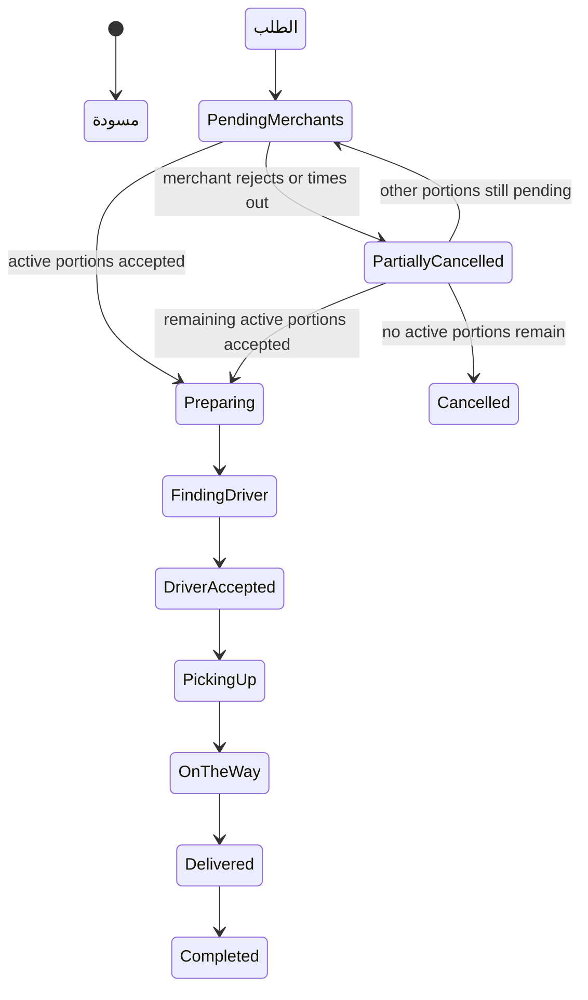
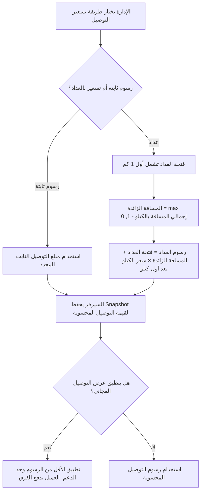
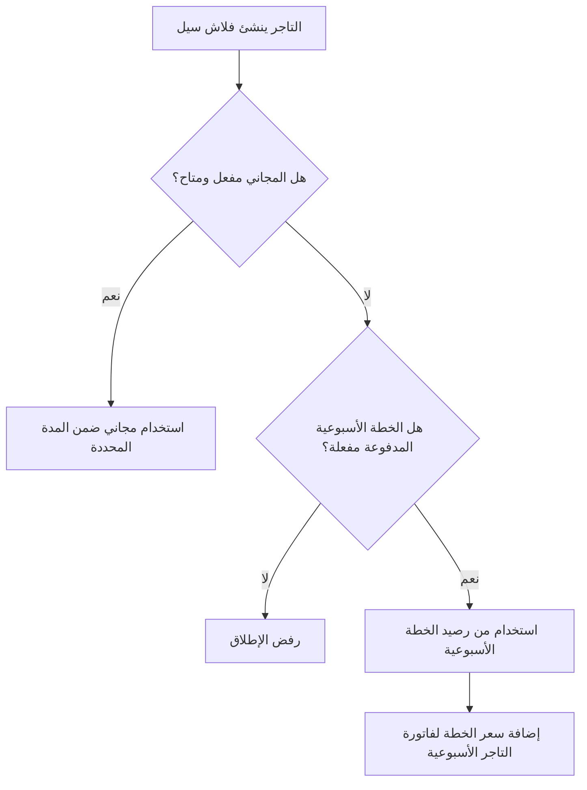
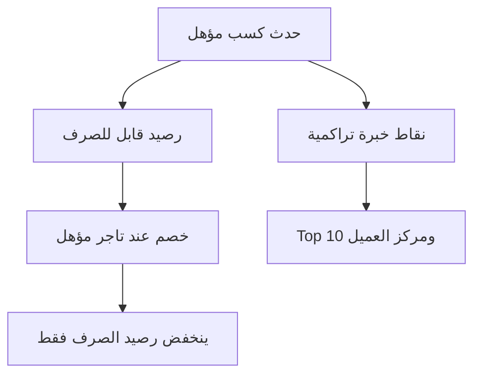
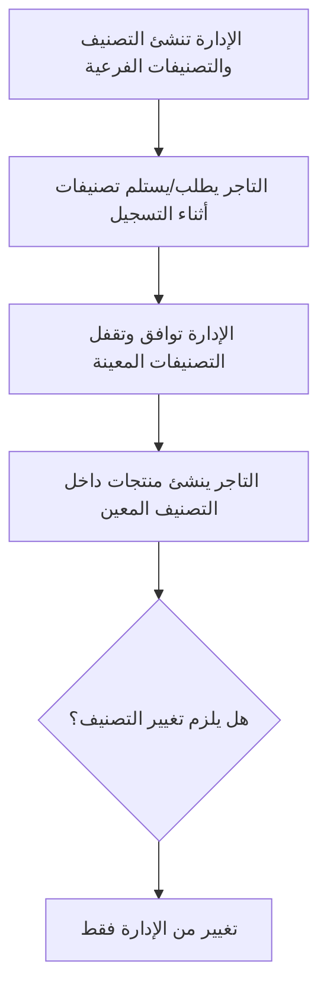

# يلا حالًا - وثيقة متطلبات المنتج

| القيمة | الحقل |
| ---: | ---: |
| نطاق المنتج الحالي المعتمد؛ باك إند Phase 48 مكتمل محليًا، بينما شاشة المهام والمكافآت وكل الواجهات والبوابات الحية ما زالت مفتوحة | الحالة |
| العميل، مالك المنتج، UI/UX، الموبايل، الويب، الباك اند، QA | الجمهور |
| عربي مبسط | اللغة |
| تطبيق العميل، تطبيق التاجر، تطبيق السائق، لوحة الإدارة، لوحة التاجر | باقة التسليم |
| Customer Web و Driver Web للاختبار والتكامل فقط | واجهات الاختبار |
| مزامنة الحقيقة الأساسية - ٣ أغسطس ٢٠٢٦ | الإصدار |
| باك إند المساعد/الخبرة-السوشيال/الطوارئ مكتمل محليًا؛ شاشة المهام والمكافآت معتمدة ومخططة بسعر ٣٥٠ دولار؛ الواجهات ودليل المزودين/النشر الحي مفتوحة | حالة الإضافات الجديدة |

يلا حالًا هو سوق محلي للتجارة والتوصيل. يقدر العميل يطلب من تاجر واحد أو من أكثر من تاجر في نفس عملية الشراء، حتى الحد الذي تحدده الإدارة. كل تاجر يحضّر الجزء الخاص به فقط، والسائق المعتمد يستلم الأجزاء النشطة ويوصل الطلب للعميل. الإدارة تتحكم في قواعد المنصة: الموافقات، التصنيفات، المناطق، رسوم التوصيل، العمولات، الفواتير، الفلاش سيلز، الكوبونات، نقاط الكاش باك، التقارير، الأمان والدعم. الإضافات المعتمدة تشمل مساعد خدمة عملاء مرتبط بـOpenAI API من قاعدة معرفة معتمدة، ولوحة Top 10 بنقاط خبرة تراكمية ومكافآت مضبوطة لأنشطة Facebook وInstagram، وخياري اتصال منفصلين لطوارئ الدليفري، وشاشة مهام ومكافآت بسعر ٣٥٠ دولار ينشئ الأدمن فيها التارجت والجائزة ويحصل العميل بعد الإكمال على كود شخصي لتوصيل مجاني أو خصم نسبة بحد أقصى بالجنيه. عجلة الحظ مستبعدة من المنتج بقرار المالك لأسباب شرعية.

الملف مقسوم إلى جزئين:

- **الجزء الأول - PRD المنتج:** شرح سهل وواضح للعميل وفريق التصميم والموبايل.
- **الجزء الثاني - PRD تشغيلي وتكاملي:** قواعد أعمق لفريق الباك اند والويب والموبايل والاختبار بدون تفاصيل برمجية معقدة.

ملفا `PRD.md` و`PRD_AR.md` هما الحقيقة الأساسية المتزامنة للمنتج. يحافظ هذا التحديث على التقسيم إلى جزئين وعلى الأقسام الـ31، ويدمج الإضافات المعتمدة داخل أقسامها الصحيحة. وجود المتطلب هنا يحدد نطاق المنتج المعتمد للتنفيذ، لكنه لا يثبت اكتمال الـRuntime أو وجود واجهة منفذة.

## الفهرس

- [الجزء الأول - PRD المنتج](#part-1-product-prd)
  - [1. ملخص المنتج](#1-product-summary)
  - [2. باقة التسليم](#2-delivery-package)
  - [3. أدوار المستخدمين](#3-user-roles)
  - [4. التسجيل والموافقة](#4-registration-and-approval)
  - [5. فلو السوق بالكامل](#5-full-marketplace-flow)
  - [6. فلو تطبيق العميل](#6-customer-app-flow)
  - [7. فلو تطبيق ولوحة التاجر](#7-merchant-app-and-dashboard-flow)
  - [8. فلو تطبيق السائق](#8-driver-app-flow)
  - [9. فلو لوحة الإدارة](#9-admin-dashboard-flow)
  - [10. فلو الطلبات والحالات](#10-orders-and-status-flow)
  - [11. فلو تحديد الموقع والخريطة](#11-location-pin-and-map-behavior)
  - [12. المنتجات والتصنيفات والعروض](#12-products-categories-and-offers)
  - [13. العروض والكوبونات ونقاط الكاش باك](#13-promotions-coupons-and-cashback-points)
    - [المهام والمكافآت](#المهام-والمكافآت)
    - [نقاط دعوة عميل لعميل](#نقاط-دعوة-عميل-لعميل)
    - [نقاط الخبرة ولوحة المراكز ومكافآت الأنشطة الاجتماعية](#نقاط-الخبرة-ولوحة-المراكز-ومكافأة-المشاركة)
    - [خصم عيد الميلاد](#خصم-عيد-الميلاد)
  - [14. الفلاش سيلز](#14-flash-sales)
  - [15. تسعير فتحة عداد التوصيل](#15-delivery-fee-meter-pricing)
  - [16. الطلبات الأسبوعية](#16-weekly-orders)
  - [17. فواتير التاجر الأسبوعية وتسوية السائق اليومية وطباعة الريسيت](#17-weekly-invoices-and-manual-payment-proof)
  - [18. الشات والاتصال والإشعارات والدعم](#18-chat-calls-notifications-and-support)
  - [19. قائمة قبول المنتج](#19-product-acceptance-checklist)
- [الجزء الثاني - PRD تشغيلي وتكاملي](#part-2-operational--integration-prd)
  - [20. وحدات المنصة](#20-platform-modules)
  - [21. الصلاحيات](#21-permission-model)
  - [22. قواعد الطلبات](#22-order-logic-rules)
  - [23. قواعد التسعير](#23-pricing-rules)
  - [24. قواعد فتحة عداد التوصيل](#24-delivery-fee-technical-rules)
  - [25. قواعد الفواتير والعمولات](#25-finance-and-invoice-rules)
    - [الإعفاء من العمولة وتقاسم تكلفة الخصومات](#merchant-commission-grace-and-discount-cost-sharing)
  - [26. قواعد فواتير الفلاش سيلز](#26-flash-sale-billing-rules)
  - [27. قواعد نقاط الكاش باك](#27-cashback-points-rules)
  - [28. قواعد تصنيفات التاجر](#28-merchant-category-rules)
  - [29. قواعد بناء وتحميل وتذكير الطلبات الأسبوعية](#29-weekly-order-reminder-rules)
  - [30. قواعد الدعوات وتنبيه الشات](#30-referrals-and-chat-alert-rules)
  - [31. ملخص API و QA](#31-api-and-qa-handoff-summary)
- [خارج النطاق الحالي](#out-of-current-scope)
- [ملغي / غير نشط](#retired--not-active)

---

# الجزء الأول - PRD المنتج

هذا الجزء يشرح المنتج بلغة بسيطة وواضحة.

[العودة للأعلى](#top)

## 1. ملخص المنتج

يلا حالًا يربط بين العميل والتاجر والسائق والإدارة داخل منصة واحدة للطلب والتوصيل.

العميل يقدر يعمل طلبًا واحدًا يحتوي على منتجات من تاجر واحد أو أكثر. الطلب يتقسم إلى أجزاء حسب التاجر. كل تاجر يرى الجزء الخاص به فقط، ويقبله أو يرفضه ويحدد وقت التجهيز. النظام يحسب الجاهزية تلقائيًا، ويظهر الطلب للدليفري المؤهل داخل نافذة ما قبل الجاهزية التي تحددها الإدارة.

المنصة تدعم أيضًا الخصومات، نقاط الكاش باك، خصم عيد الميلاد، دعوة عميل لعميل بنقاط، الطلبات الأسبوعية، فواتير التجار الأسبوعية وتسوية السائق اليومية الإجبارية، الفلاش سيلز، رفع إثبات التسوية، شات الدليفري مع العميل، زر Alert/Ring داخل الشات، زر SOS للطوارئ، الإشعارات، تقييم تجربة منتجات التاجر، ومراقبة الإدارة، وتحديد مواقع العميل والتاجر باستخدام Google Maps Platform، وحساب المسافة والمدة ووقت الوصول عبر Google Routes API، وتتبع الدليفري أثناء التوصيل بعد الإسناد. تشمل الإضافات الجديدة مساعد خدمة عملاء يجيب من قاعدة معرفة معتمدة ويحوّل لموظف عند الحاجة، ولوحة Top 10 حسب نقاط خبرة تراكمية لا تنقص عند صرف النقاط، ومكافآت مضبوطة لأنشطة Facebook وInstagram تبدأ بالتحقق الرسمي التلقائي، وخيار اتصال منفصل بطوارئ يلا حالًا أو الإسعاف للسائق، ومهام يقيسها السيرفر وتصدر كود جائزة شخصيًا مرة واحدة بعد الوصول للتارجت.

| المعنى | وعد المنتج |
| ---: | ---: |
| العميل يقدر يشتري من تاجر واحد أو أكثر في نفس الطلب. | طلب واحد من أكثر من تاجر |
| التاجر يتعامل مع منتجاته فقط داخل الطلب. | كل تاجر مسؤول عن الجزء الخاص به |
| السائق لا يرى الطلب قبل أن يكون جاهزًا للاستلام. | التوصيل بعد الجاهزية |
| الإدارة تتحكم في التصنيفات، المناطق، العمولات، الفلاش سيلز، الكوبونات، الكاش باك، الموافقات والفواتير. | تحكم الإدارة |
| التاجر يسدد فاتورة أسبوعية، والسائق يسدد يوميًا بشكل إجباري من التطبيق بمحفظة/إنستا باي مع صورة إيصال أو كاش في مقر يلا حالًا وتسقطها الإدارة من لوحة التحكم. | فواتير واضحة |
| المساعد يجيب من معرفة تعتمدها الإدارة، ولوحة المراكز تعرض Top 10 ومركز صاحب الحساب الحقيقي، والطوارئ تقدم وجهتي اتصال صريحتين، ومكافأة المهمة تعتمد على تقدم السيرفر وكود شخصي أحادي الاستخدام. | إضافات مضبوطة وقابلة للتدقيق |

[العودة للأعلى](#top)

## 2. باقة التسليم

| الهدف | يتم تسليمها للعميل؟ | الواجهة |
| ---: | ---: | ---: |
| الطلب وCheckout، رصيد وتاريخ نقاط الكاش باك، نقاط الخبرة ولوحة المراكز، ملفات المراكز المسموحة، المهام والمكافآت وأكوادها، حالة الطلب، الطلبات الأسبوعية، الشات، ومساعد خدمة العملاء. | نعم | تطبيق العميل |
| التسجيل، الطلبات، المنتجات، التصنيفات، العروض، الفلاش سيلز، الفواتير والداشبورد. | نعم | تطبيق التاجر |
| التسجيل، الطلبات المتاحة، خطوات الاستلام والتسليم، الفواتير، الداشبورد، شات الدليفري مع العميل، وخياري اتصال الطوارئ. | نعم | تطبيق السائق |
| إدارة المنصة بالكامل، بما فيها إنشاء المهام والتارجت والجائزة وتحليلاتها، وقاعدة معرفة المساعد، وإعداد كل نشاط اجتماعي وحالة قدرة المزود ومراجعة الاستثناءات المسموحة فقط، وأرقام الطوارئ. | نعم | لوحة الإدارة |
| إدارة التاجر من الويب أو التابلت أو سطح المكتب. | نعم | لوحة التاجر |
| ليس ضمن الواجهات الأساسية المسلمة للعميل. | للاختبار والتكامل فقط | Customer Web |
| ليس ضمن الواجهات الأساسية المسلمة للعميل. | للاختبار والتكامل فقط | Driver Web |

هذا الجدول يحدد باقة التسليم النهائية المطلوبة، ولا يثبت حالة التنفيذ الحالية. الريبو الحالي يحتوي على Backend ومراجع UI، لكنه لا يحتوي على Source Frontend إنتاجي؛ ملف PDF أو Postman أو مهمة داخل Agent Pack لا تعتبر واجهة قابلة للتشغيل.

[العودة للأعلى](#top)

## 3. أدوار المستخدمين

| أهم الأفعال | الهدف | الدور |
| ---: | ---: | ---: |
| التسجيل، التحقق عبر واتساب مخصص أو SMS من WhySMS المخصص للعميل عند الإتاحة، حفظ العناوين، التصفح، المفضلة، ملاحظات المنتجات، Checkout، الكوبونات، نقاط الكاش باك ونقاط الخبرة، لوحة المراكز، ملفه وملفات أول 10، ربط المزود الاجتماعي، متابعة المهام والتقدم واستخدام كود الجائزة الشخصي، مساعد خدمة العملاء، خصم عيد الميلاد عند الاستحقاق، متابعة الطلب لايف، شات الدليفري، تقييم تجربة منتجات كل تاجر بعد التسليم، والطلب الأسبوعي. | الطلب بسهولة والتوفير | العميل |
| التسجيل، الموافقة، إدارة المنتجات والعروض داخل التصنيفات المعينة من الإدارة، قبول/رفض الطلب، التحضير، الفلاش سيلز، الفواتير، رفع إثبات الدفع. | البيع وتجهيز الطلبات | التاجر |
| التسجيل، الموافقة، أونلاين، مشاهدة الطلبات المؤهلة مرتبة بالمسافة/الوقت، قبول يدوي أو القبول التلقائي للأقرب اختياري، ملاحة Google داخل التطبيق، الاستلام، التسليم، فتح Google Maps كحل بديل، الفواتير، والاتصال الصريح بطوارئ يلا حالًا أو الإسعاف. | توصيل الطلبات الجاهزة | السائق |
| يعمل فقط داخل الأقسام التي يحددها السوبر أدمن. | تشغيل أقسام محددة | موظف الإدارة |
| إنشاء حسابات الإدارة، تحديد الصلاحيات، وضبط قواعد المنصة. | التحكم الكامل | السوبر أدمن |

[العودة للأعلى](#top)

## 4. التسجيل والموافقة

### تسجيل العميل

| ما يحدث | الخطوة |
| ---: | ---: |
| العميل يختار اللغة. | 1 |
| يدخل الاسم ورقم الهاتف وكلمة المرور وتأكيدها. | 2 |
| يفعّل الهاتف عن طريق OTP خاص بالعميل: واتساب مخصص عند الإتاحة أو SMS من WhySMS. قناة SMS للعميل فقط. | 3 |
| يضيف أول عنوان توصيل. | 4 |
| الحساب يصبح نشطًا بدون موافقة الإدارة. | 5 |
| يمكن للعميل لاحقًا تعديل بياناته وعناوينه؛ تسجيل الدخول الحالي يعتمد على الهاتف وكلمة المرور فقط. | اختياري |

### تسجيل التاجر

| ما يحدث | الخطوة |
| ---: | ---: |
| التاجر يختار اللغة. | 1 |
| يدخل اسم البراند/المتجر، الهاتف، كلمة المرور، المنطقة. | 2 |
| لا يستخدم SMS OTP. يتم تحقق حساب التاجر عبر واتساب مخصص عند التفعيل، ثم مراجعة الإدارة للمستندات والموقع. | 3 |
| يختار التصنيفات المطلوبة من تصنيفات الإدارة أثناء التسجيل، ثم تقفل الإدارة القائمة النهائية عند الموافقة. | 4 |
| يرفع المستندات المطلوبة مثل الرخصة التجارية، السجل الضريبي، اللوجو، المنيو، وأي ملفات مطلوبة. | 5 |
| يحدد موقع المتجر على خريطة Google Maps ويتم حفظ الإحداثيات ونص العنوان وبيانات Google Place عند توفرها. | 6 |
| الحساب يظل تحت المراجعة حتى موافقة الإدارة. | 7 |

### تسجيل السائق

| ما يحدث | الخطوة |
| ---: | ---: |
| السائق يختار اللغة. | 1 |
| يدخل الاسم والهاتف وكلمة المرور والمنطقة. | 2 |
| لا يستخدم SMS OTP. يتم تحقق حساب السائق عبر واتساب مخصص عند التفعيل، ثم مراجعة الإدارة للمستندات والمركبة. | 3 |
| يختار نوع المركبة: موتور، سكوتر، إي-سكوتر، عجلة، سيارة، أو تروسيكل. | 4 |
| يرفع مستندات وصور المركبة حسب المطلوب. | 5 |
| يرفع المستندات الشخصية، البطاقة، الرخصة عند الحاجة، السيلفي، والفيش الجنائي عند الحاجة. | 6 |
| الحساب يظل تحت المراجعة حتى موافقة الإدارة. | 7 |

### إنشاء حسابات الإدارة

موظفو الإدارة لا يسجلون من التطبيقات العامة.

| ما يحدث | الخطوة |
| ---: | ---: |
| السوبر أدمن ينشئ حساب موظف إدارة. | 1 |
| يحدد اسم المستخدم/البريد وكلمة المرور. | 2 |
| يختار أقسام الداشبورد المسموح للموظف بدخولها. | 3 |
| الموظف يرى فقط الأقسام المسموحة له. | 4 |

نموذج الصلاحيات النشط هو صلاحيات حسب أقسام الداشبورد، وليس أدوار أدمن ثابتة لكل شيء. مصفوفة صلاحيات لوحة الإدارة يمكن أن تعرض ميتاداتا للأفعال ونطاق البيانات لمساعدة الواجهة في عرض الأزرار، لكن `allowedSections[]` تظل حد الصلاحية الفعلي في الباك إند، ولا يتم حفظ صلاحيات granular مستقلة للأفعال أو نطاقات البيانات.

[العودة للأعلى](#top)

## 5. فلو السوق بالكامل

[العودة للأعلى](#top)

## 6. فلو تطبيق العميل

| القاعدة | تجربة العميل | المجال |
| ---: | ---: | ---: |
| يتم حفظ lat/lng ونص العنوان والليبل وبيانات Google Place عند توفرها وروابط Google Maps/Deep link. | حفظ حتى 3 عناوين باستخدام دبوس Google Maps أو الموقع الحالي أو التحريك اليدوي للدبوس، مع إمكانية ألوان ماركر مناسبة للبراند من الواجهة. | العناوين |
| تظهر البيانات النشطة والمتاحة فقط. كروت وتفاصيل المنتجات يجب أن تستخدم نفس شكل البيانات لاختيارات السعر المفعلة، اختيار السعر الافتراضي، حالة العرض/المفضلة، بيانات تجهيز التاجر وروابط الموقع عند توفرها، وتجميع المنتجات المتعلقة في صفحة التفاصيل. ويمكن عرض متوسط/أسرع/أبطأ وقت تجهيز للتاجر في صفحة التاجر أو كارت التاجر حسب مساحة الواجهة. صفحة تفاصيل المنتج يمكن أن تعرض اختيارات السعر/الحجم والمنتجات المتعلقة التي اختارها التاجر من تصنيفات فرعية شقيقة تحت نفس التصنيف الكبير. | التجار، المنتجات، التصنيفات، العروض، المفضلة، اختيارات الحجم، والمنتجات المتعلقة. | التصفح |
| المنتجات تظل مجمعة حسب كل تاجر. | منتجات من تاجر واحد أو أكثر. | السلة |
| تظهر للتاجر للتحضير، وليست تعليمات للسائق. | ملاحظة اختيارية لكل منتج. | ملاحظات المنتج |
| تسعير السيرفر هو النهائي. رسوم التوصيل تعتمد على Google Routes عند الإتاحة: مبلغ ثابت أو فتحة عداد تشمل أول كيلو + سعر لكل كيلو بعد أول كيلو. | مراجعة السعر، الكوبون، نقاط الكاش باك، خصم عيد الميلاد عند الاستحقاق، رسوم التوصيل والإجمالي. | الدفع |
| الخصم يطبق على قيمة المنتجات المؤهلة. | كوبون نسبة خصم بحد أقصى. | الكوبونات |
| الكوبون وعيد الميلاد يتقسمان حسب نسبة مساهمة تاجر تحددها الإدارة، الافتراضي 0% مع Override اختياري، والمنصة تتحمل الباقي. التوصيل المجاني يظل على المنصة بالكامل، وعروض التاجر والفلاش والنقاط تظل حسب قواعدها الحالية. | تمويل الخصومات والتسوية | المالية |
| النقاط ليست فلوس ولا تقبل الشحن أو السحب أو التحويل. | رصيد وتاريخ نقاط، واستخدام النقاط عند التجار المؤهلين. | نقاط الكاش باك |
| الرصيد القابل للصرف ينقص عند الاستخدام وفق النظام الحالي، لكن نقاط الخبرة التراكمية لا تنقص بسبب الصرف. القائمة تعرض أول 10، ثم صاحب الحساب بمركزه الحقيقي إذا كان خارجهم وبدون تكرار إذا كان داخلهم. | مشاهدة لوحة المراكز وفتح ملفات أول 10 والملف الشخصي لصاحب الحساب. | نقاط الخبرة والمراكز |
| الأنشطة الأربعة منفصلة: Follow Facebook وFollow Instagram ومنشور حملة Facebook ومنشور حملة Instagram. التحقق الرسمي التلقائي هو الأصل؛ النشاط المسموح وغير القابل للتحقق وحده يستخدم إثباتًا للمراجعة، والمحظور بسياسة المزود يظل معطلًا. الضغط على الزر لا يمنح نقاطًا. | عرض الأنشطة المؤهلة وحالة الربط والتحقق والمكافأة. | مكافآت الأنشطة الاجتماعية |
| التقدم يحسبه السيرفر من عدد الطلبات المسلّمة أو قيمة المنتجات المدفوعة المسلّمة. الجائزة إما كود توصيل مجاني بسقف جنيه ظاهر أو كود خصم نسبة بحد أقصى يحدده الأدمن؛ الكود مرتبط بالعميل ويستخدم مرة واحدة. | عرض المهام النشطة/القادمة/المكتملة والتارجت والتقدم وتفاصيل أكواد الجوائز الشخصية. | المهام والمكافآت |
| الإنشاء والتعديل و«اطلب الآن» وفتح التذكير يستبدلون السلة ويتركونها قابلة للتعديل، ولا يتم إرسال الطلب إلا بعد تأكيد Checkout العادي. | إنشاء قالب من طلب سابق أو بناء قالب جديد بعد تفريغ السلة. | الطلب الأسبوعي |
| التتبع يبدأ فقط بعد إسناد السائق في طلب نشط، ويُرسل بمعدل محدود حسب الوقت/المسافة، وينتهي بـ TTL، ولا يتم تخزين تاريخ خام طويل بلا داعٍ. إشعار إلغاء جزء تاجر يحتوي على زر تصفح المنتجات. | تايملاين واضح للطلب، إشعار عند إلغاء جزء تاجر، وخريطة مباشرة لموقع السائق أثناء التوصيل. | حالة الطلب والتتبع |
| التقييم لا يظهر إلا بعد التسليم. ترسل الواجهة تقييمًا واحدًا من 1 إلى 5 نجوم لكل جزء تاجر تم تسليمه، ويوزعه الباك إند مرة واحدة على كل منتج فريد تم شراؤه من هذا التاجر. متوسط المنتج مشتق من التقييمات الصحيحة، وتقييم التاجر مشتق من تقييمات منتجاته. لا توجد نجوم مستقلة لكل منتج. الأجزاء المرفوضة أو الملغاة أو Timeout أو غير المسلمة لا تدخل في التقييم. | تقييم تجربة منتجات كل تاجر داخل الطلب. | التقييم بعد التسليم |
| تاريخ الميلاد يدخل مرة واحدة أثناء التسجيل أو أول إكمال للبروفايل، ولا يعدله العميل لاحقًا إلا من خلال دعم/إدارة. | خصم عيد ميلاد مرة واحدة في تاريخ عيد الميلاد عند استيفاء شروط الإدارة. | هدية عيد الميلاد |
| إخفاء الهاتف أو عدم توفره يمنع الاتصال المباشر فقط، ولا يمنع شات الدليفري مع العميل أو زر Alert/Ring. الدليفري المعيّن وحده يرسل التنبيه الصريح؛ وهو تنبيه داخل الشات مع رنة/ألارم وليس مكالمة صوتية. الرسائل العادية المرسلة للعميل قد تحمل ميتاداتا `customer_chat_ring` بصوت افتراضي وأولوية عالية، لكنها لا تستخدم قناة `customer_chat_call_alert` أو صوت الألارم. | شات الدليفري المعيّن مع العميل والدعم والشكاوى متاحون حسب الصلاحيات. | الشات والاتصال |
| المساعد يجيب فقط من FAQ/قاعدة معرفة منشورة تعتمدها الإدارة، ويعلن عدم توفر إجابة موثوقة ثم يحوّل إلى موظف عند الحاجة. لا يملك أي صلاحية لتعديل الطلب أو الحساب أو الماليات. | سؤال مساعد خدمة العملاء أو طلب التحويل لممثل خدمة العملاء. | المساعد الذكي والدعم |

[العودة للأعلى](#top)

## 7. فلو تطبيق ولوحة التاجر

| القاعدة | تجربة التاجر | المجال |
| ---: | ---: | ---: |
| الحساب المعلق أو الموقوف لا يستقبل طلبات عادية. | تحت المراجعة حتى موافقة الإدارة. | حالة الحساب |
| الموقع يظل مقفولًا بعد الموافقة إلا إذا أعادت الإدارة فتحه؛ ويتم حفظ الإحداثيات والعنوان والليبل وبيانات Google Place عند توفرها. | يحدد التاجر دبوس المتجر مرة واحدة على Google Maps. | موقع المتجر |
| عبارة Close or Busy في الواجهة معناها غير مستعد لاستقبال الطلبات. | Open أو غير متاح. | التوفر |
| التاجر يرى الجزء الخاص به فقط. | طلبات جديدة ومقبولة/قيد التجهيز كسجل مبسط. | الطلبات |
| الرفض يحتاج سببًا مكتوبًا ويلغي جزء هذا التاجر فقط؛ الطلب المتبقي يعاد حسابه ويكمل إذا بقيت أجزاء نشطة. | يقبل أو يرفض الجزء الخاص به. | قبول/رفض |
| يحسب النظام وقت الجاهزية وظهور الطلب للدليفري تلقائيًا، ويسجل مدة التجهيز لحساب الأسرع والأبطأ والمتوسط. | لكل منتج وقت تجهيز افتراضي، وعند القبول يقدر التاجر يعدله بزيادات أو نقص 5 دقائق ويحدد عادي أو يحتاج مركبة كبيرة. | التجهيز |
| المنتج يجب أن يكون داخل تصنيف معين للتاجر من الإدارة. يجب وجود اختيار سعر واحد على الأقل: ستاندرد فقط، أو حجم/أكثر مثل S/M/L وكل حجم مفعل له سعر. المنتجات المتعلقة تختار تصنيفات فرعية شقيقة تحت نفس التصنيف الكبير فقط. | إضافة/تعديل منتجات بصورة، حالة مخزون، تصنيف معين من الإدارة، تصنيف فرعي، تفاصيل، عرض اختياري، اختيارات سعر/حجم اختيارية، وتصنيفات منتجات متعلقة. | المنتجات |
| إضافة/تعديل/حذف التصنيفات بعد الموافقة يتم من الإدارة فقط، ولا تظهر للتاجر أزرار تعديل التصنيف. | مشاهدة التصنيفات المعينة فقط. | التصنيفات |
| الإعفاء من العمولة أو العمولة الحالية 0% لا يمنع الفلاش سيل؛ تظل قواعد المجاني والخطة الأسبوعية والمدة والأهلية والمراجعة والفوترة هي المعتمدة. | إنشاء عروض محدودة الوقت. | الفلاش سيلز |
| العمولة وإعفاؤها وتكلفة الفلاش سيلز والنقاط وإثبات الدفع تظهر منفصلة. مساهمة الكوبون/عيد الميلاد التي خُصمت من دفعة الدليفري للتاجر تظهر كتسوية فقط ولا تُحمّل مرة ثانية. | عرض تفاصيل الفاتورة ورفع إثبات الدفع. | الفواتير |
| الرقم المخفي يظل مخفيًا في بيانات التاجر والدليفري، وأي كشف مسموح يحتاج صلاحية وAudit. | يظهر للتاجر Reminder/Shortcut للخصوصية أثناء تأكيد الطلب. | خصوصية رقم العميل |
| الريسيت باسم المطعم فقط بدون أي بيانات أو براند يلا حالًا. | طباعة ريسيت للطلب يحتوي اسم المطعم، رقم الطلب، ID الطلب، اسم الدليفري، الكود، ومحتوى جزء هذا المطعم فقط. | طباعة الريسيت |
| يجب فصل الإيراد عن المستحق للمنصة. | مبيعات، عمولة، طلبات، تقييمات، منتجات، وأسرع/أبطأ/متوسط وقت تجهيز مع عدد العينات عند توفره. | الداشبورد |
| تقييم التاجر ليس تقييمًا يدويًا مستقلًا؛ يتم حسابه من تقييمات منتجاته/أجزاء الطلب الخاصة به. | عرض متوسط التقييم وعدد التقييمات في الداشبورد وصفحات المنتج. | التقييم والسمعة |
| حدود القرب من التاجر تضبطها الإدارة بالمسافة و/أو ETA، ويرسل الإشعار مرة واحدة لكل محطة/حدث. | التاجر يتلقى إشعارًا عندما يقترب السائق من نقطة الاستلام. | اقتراب السائق من الاستلام |

### مؤشرات وقت تجهيز التاجر

المنصة يجب أن توضّح للعميل والإدارة مدى سرعة التاجر في تجهيز الطلبات المقبولة. هذه المؤشرات معلوماتية وتُحسب من طلبات حقيقية وصلت إلى حالة جاهز/تم التسليم.

| مكان الظهور | المعنى | المؤشر |
| ---: | ---: | ---: |
| صفحة التاجر، كارت التاجر عند توفر مساحة، وقائمة التجار في لوحة الإدارة. | أقصر وقت صحيح من قبول/بدء تجهيز الجزء إلى جاهز/مطبوخ. | أسرع وقت تجهيز |
| صفحة التاجر وتفاصيل/قائمة التاجر في لوحة الإدارة. | أطول وقت صحيح من قبول/بدء تجهيز الجزء إلى جاهز/مطبوخ. | أبطأ وقت تجهيز |
| صفحة التاجر، تصفح العميل، داشبورد التاجر، وقائمة التجار في الإدارة. | متوسط مدة التجهيز للطلبات المكتملة. | متوسط وقت التجهيز |
| لوحة الإدارة، داشبورد التاجر، وصفحة التاجر عند الحاجة. | عدد الأجزاء الصحيحة المستخدمة ووقت آخر حساب للمؤشرات. | عدد العينات وآخر حساب |

يجب تجاهل الأجزاء المرفوضة أو الملغاة أو الملغاة بسبب انتهاء الوقت، وأي جزء لم يصل إلى جاهز/مطبوخ.

[العودة للأعلى](#top)

## 8. فلو تطبيق السائق

| القاعدة | تجربة السائق | المجال |
| ---: | ---: | ---: |
| الحساب المعلق أو الموقوف لا يستقبل طلبات. | الحساب تحت المراجعة حتى موافقة الإدارة. | الموافقة |
| الطلب الكبير/المحتاج مركبة كبيرة يظهر فقط لسائق سيارة أو تروسيكل. | يدعم السيارة والتروسيكل ضمن الأنواع. | المركبة |
| الأوفلاين لا يستقبل طلبات. | السائق يتحكم في حالته. | أونلاين/أوفلاين |
| الأهلية تشمل المنطقة وحالة الحساب والأونلاين ونوع المركبة وحد مسافة العجلة وتاريخ الرفض وقواعد الحجم والمسار. القيمة الافتراضية لنافذة ما قبل الجاهزية 5 دقائق. | تظهر الطلبات المؤهلة داخل النافذة التي تحددها الإدارة، ومرتبة حسب Google route distance/ETA لأقرب نقطة استلام مؤهلة. | الطلبات المتاحة |
| القبول التلقائي للأقرب مقفول افتراضيًا ويحتاج locking من السيرفر لمنع سباق قبول نفس الرحلة. | قبول يدوي أو القبول التلقائي للأقرب اختياري. | قبول الطلب |
| يمكن استلام الأجزاء الجاهزة أولًا، ويؤكد الدليفري الاستلام والمبلغ المحسوب للتاجر عند الحاجة؛ لا يغير المبلغ يدويًا. | استلام من تاجر أو عدة تجار. | الاستلام |
| التسليم ينهي آثار الطلب مثل الكاش باك والفواتير. | توصيل للعميل وإنهاء الطلب. | التسليم |
| السائق يرى خريطة/ملاحة Google داخل التطبيق للمسار متعدد المحطات، ويمكنه فتح Google Maps خارجيًا كحل بديل. المسار يحتوي على أقرب استلام جاهز، باقي الاستلامات النشطة، ثم التسليم للعميل؛ والأجزاء الملغاة/المرفوضة/انتهاء المهلة تُزال من المسار. شاشة الطوارئ تفصل تنبيه SOS الداخلي للمنصة عن اختياري الاتصال بطوارئ يلا حالًا والإسعاف الخاص بالمنطقة التشغيلية، ولا تستخدم قناة تنبيه العميل داخل الشات. | فتح موقع الاستلام/التسليم من زر Open in Maps عند الحاجة، أو استخدام إجراء الطوارئ المناسب. | الخرائط والملاحة والطوارئ |
| وضع DND لا يعطل SOS أو تنبيهات الأمان الإلزامية أو تطبيق حالات الطلب والفواتير. | كتم جرس الإشعارات العادية للدليفري. | الجرس / عدم الإزعاج |
| يجب على الدليفري رؤية الاختيار وتأكيد الالتزام به قبل إكمال التسليم. | اختيار العميل `door` أو `building_entrance`. | مكان التسليم |
| الإدارة تتحكم في نسبة السائق العامة أو الخاصة، والسداد يومي إجباري. | عرض الفاتورة اليومية ورفع إثبات الدفع أو السداد كاش في المقر. | الفواتير |

[العودة للأعلى](#top)

## 9. فلو لوحة الإدارة

| ما تفعله الإدارة | القسم |
| ---: | ---: |
| متابعة مؤشرات السوق والطلبات المتأخرة والسائقين الأونلاين والمتاجر المفتوحة. | المراقبة |
| مراجعة طلبات التجار والسائقين. | الموافقات |
| السوبر أدمن ينشئ الموظفين ويحدد أقسامهم. | صلاحيات الموظفين |
| إنشاء وإدارة التصنيفات والتصنيفات الفرعية. | التصنيفات |
| إدارة مناطق الخدمة وربط الحسابات بها، جاهزية Google Maps/API، حدود التتبع والقرب، ومراجعة لقطات محفوظة المواقع عند الحاجة. | المناطق والمواقع |
| عرض وإيقاف/تفعيل العملاء والتجار والسائقين، مع عرض أسرع/أبطأ/متوسط وقت تجهيز داخل قائمة وحسابات التجار. | الحسابات |
| متابعة تقييمات باقة منتجات التاجر ومتوسطات المنتجات والتجار، مع مراجعة التعليقات وتشغيل إعادة حساب آمنة عند الحاجة. | التقييم والجودة |
| عمولات التجار والسائقين العامة والخاصة، حد الطلبات المعفاة العام والمخصص لكل تاجر، نسب مساهمة التاجر في الكوبون وعيد الميلاد، تسعير التوصيل، الفواتير والأرصدة وتعليمات الدفع. | الفاينانس |
| ضبط عدد المرات المجانية، مدة المرة، التجديد الأسبوعي، وسعر الخطة الأسبوعية بعد المجاني. | الفلاش سيلز |
| إنشاء كوبونات بنسبة وحد أقصى مع اختيار: كل التجار، تجار محددين فقط، أو كل التجار ما عدا المحددين. | الكوبونات |
| تحديد التجار المؤهلين وقيمة النقاط كخصم لكل تاجر. | نقاط الكاش باك |
| عرض Top 10 ومراكز العملاء، وضبط كل نشاط Facebook/Instagram مستقلًا، وإظهار قدرة/سياسة المزود، ومراجعة الاستثناءات المسموحة فقط، وتدقيق المكافآت التلقائية واليدوية ومنع التكرار. | المراكز ومكافآت الأنشطة |
| إنشاء Draft لمهمة، اختيار تارجت مقيد، نشر/إيقاف/أرشفة Revision، اختيار جائزة توصيل مجاني أو خصم نسبة بحد أقصى، ومراجعة التقدم والأكواد والاستخدام والانتهاء وتكلفة المنصة. | المهام والمكافآت |
| إنشاء وتعديل ونشر وإلغاء نشر محتوى FAQ/قاعدة المعرفة، تفعيل المساعد، ضبط حدود الاستخدام والتحويل للدعم، ومراجعة الأسئلة غير المجابة دون منحه صلاحية تنفيذ إجراءات. | مساعد خدمة العملاء |
| ضبط OTP للعميل عبر واتساب مخصص وSMS من WhySMS، وحدود إعادة الإرسال، تبديل القناة، محاولات التحقق، و lockout. إتاحة Runtime والحدود المشتركة نشطة، وتبقى واجهة إعدادات الأدمن خطوة سطحية لاحقة. | قنوات OTP |
| تفعيل/تعطيل خصم عيد الميلاد، الحد الأقصى للنسبة، سقف سعر المنتج، سقف subtotal الطلب، ساعة الإشعار، والتقارير. | خصم عيد الميلاد |
| ضبط وجهتي طوارئ يلا حالًا والإسعاف لكل منطقة تشغيلية بصورة مستقلة، بما يشمل التفعيل والاسم والرقم الصحيح. لا يظهر زر اتصال فعال بدون رقم صالح. تحفظ المنصة SOS الداخلي وموقع السائق الأخير المصرح به اختياريًا، وتضبط حدود Alert/Ring، وتسجل محاولات فتح تطبيق الاتصال. يبدأ الاتصال فقط بعد اختيار السائق وتأكيده. | الأمان والتنبيهات |
| مراقبة كل الطلبات، أجزاء التجار الملغاة، إلغاءات انتهاء مدة الرد، الطلبات المتأخرة، والتدخل التشغيلي عند الحاجة. | الطلبات |
| الشكاوى، الدعم، التقارير، والبث. | الدعم والتقارير |

[العودة للأعلى](#top)

## 10. فلو الطلبات والحالات

| المعنى | المسؤول | الحالة |
| ---: | ---: | ---: |
| يمكن للعميل التعديل أو الحذف أو المتابعة قبل إرسال الطلب للتجار. | العميل | مسودة الطلب |
| التجار لازم يردوا بالقبول أو الرفض قبل مدة الرد التي تحددها الإدارة. | التجار / النظام | Pending merchants |
| جزء التاجر يتم إلغاؤه لو التاجر رفض بسبب مكتوب أو لو انتهت مدة الرد بدون قبول. | التاجر / النظام | Portion cancelled |
| يتم إعادة حساب المنتجات، الكوبون، نقاط الكاش باك، مسار التوصيل، رسوم التوصيل، والإجمالي بعد إلغاء أي جزء. | النظام | Repricing |
| الأجزاء المقبولة المتبقية تكمل التحضير بشكل طبيعي. | التجار | Preparing |
| السائق يرى قائمة الاستلام والمسافة بعد حذف الأجزاء الملغاة فقط. | النظام / السائق | Finding driver |
| يستلم الأجزاء الجاهزة المتبقية. | السائق | Pickup |
| يسلم للعميل. | السائق | Drop-off |
| يتم تثبيت آثار الكاش باك والفواتير حسب قيمة الطلب النهائية. | النظام | Completed |

### فلو رفض التاجر أو انتهاء مدة الرد

1. كل تاجر يقبل أو يرفض الجزء الخاص به فقط.
2. الإدارة تحدد من الداشبورد أقصى مدة مسموحة لرد التاجر.
3. عند الرفض، يجب أن يكتب التاجر سببًا واضحًا للرفض.
4. لو التاجر لم يرد قبل انتهاء المدة، يتم إلغاء جزء التاجر تلقائيًا بسبب نظامي مثل: `التاجر لم يرد في الوقت المحدد`.
5. الجزء الملغى يتم حذفه من مسار الطلب والتسعير النشط، لكنه يظل محفوظًا في تاريخ الطلب للمراجعة.
6. العميل يستقبل إشعارًا يوضح اسم التاجر الملغى وسبب الإلغاء.
7. الإشعار يحتوي على زر للعودة إلى تصفح المنتجات لو العميل يريد عمل طلب جديد مستقل بدل الجزء الملغى.
8. لو بقي جزء واحد نشط على الأقل، الطلب يكمل بالأجزاء المتبقية بعد إعادة الحساب.
9. لو لم يتبق أي جزء نشط، يتم إلغاء الطلب بالكامل ويتم إشعار العميل.
10. يظل من حق العميل إلغاء الطلب بالكامل في الحالات التي تسمح بها قواعد الإلغاء، لكن النظام لا يوقف باقي الأجزاء المقبولة فقط لأن تاجرًا واحدًا رفض أو انتهت مدته.

مثال: مع الحد الافتراضي، لو العميل طلب من 4 تجار ورفض تاجر واحد، يتم إلغاء جزء هذا التاجر مع سبب الرفض، وإشعار العميل، ثم يعاد حساب الطلب على التجار الثلاثة المتبقين فقط: قيمة المنتجات والخصومات ومسافة التوصيل ورسومه والإجمالي. ولو احتاج العميل بديلًا، يضغط على زر تصفح المنتجات لعمل طلب جديد مستقل.

[العودة للأعلى](#top)

## 11. فلو تحديد الموقع والخريطة

مزود الخرائط النشط هو Google Maps Platform لاختيار مواقع العميل والتاجر، ومزود المسارات النشط هو Google Routes API لحساب المسافة والمدة ووقت الوصول والأرجل ولقطات المزود وحسابات رسوم التوصيل. الموقع لا يعتمد على الرابط فقط؛ الحقيقة الأساسية هي الإحداثيات `lat/lng` مع نص العنوان، ورابط Google Maps أو الـ Deep Link مجرد وسيلة لفتح نفس النقطة في تطبيق خرائط.

| القاعدة | المجال |
| ---: | ---: |
| العميل يقدر يستخدم صلاحية الموقع لتحديد مكانه تلقائيًا أو يحرك دبوس Google Maps يدويًا. | تحديد موقع العميل |
| العميل يقدر يحفظ حتى 3 عناوين. | عناوين العميل |
| التاجر يحدد موقع متجر واحد على Google Maps أثناء التسجيل، وبعد الموافقة يظل مقفولًا إلا لو الإدارة فتحته. | موقع التاجر |
| الباك اند يحفظ الإحداثيات ونص العنوان والليبل والمنطقة وبيانات Google Place عند توفرها وروابط Google Maps/Deep link عند وجود الإحداثيات. | تخزين الموقع |
| الواجهة يمكنها استخدام ألوان ماركر مناسبة للبراند وMap IDs من Google Maps عند الحاجة. | شكل الدبوس |
| لوحة الويب/الإدارة يمكن أن تستخدم Google Maps JavaScript API عندما تحتاج عرض خريطة. | عرض الويب والإدارة |
| السائق يحصل على عرض المسارs وروابط Google Maps وملاحة Google داخل التطبيق أثناء الطلب النشط، مع بديل احتياطي خارجي. | تنقل السائق |
| Google Maps Platform وروابطه المساعدة وGoogle Routes API هي حقيقة المنتج النشطة للخرائط والتوجيه في التطبيق والتسليمات والباك إند. | حقيقة الخرائط والتوجيه |

[العودة للأعلى](#top)

## 12. المنتجات والتصنيفات والعروض

الإدارة هي التي تنشئ شجرة التصنيفات. كل تصنيف يمكن أن يحتوي على تصنيفات فرعية، مع إمكانية `OTHER` عند الحاجة.

قواعد تصنيفات التاجر:

1. التاجر يختار التصنيفات المطلوبة أثناء التسجيل.
2. موافقة الإدارة تقفل قائمة التصنيفات المعينة للتاجر.
3. التاجر لا يملك إنشاء أو إضافة أو تعديل أو حذف تصنيفات المنصة بعد الموافقة من التطبيق أو الداشبورد.
4. أي تغيير في تصنيفات التاجر بعد الموافقة يتم من الإدارة فقط.
5. إنشاء/تعديل المنتج يجب أن يكون داخل تصنيف مفعل ومعين للتاجر.
6. المنتج يجب أن يختار تصنيفًا فرعيًا أو `OTHER` حسب المسموح.
7. عروض المنتج تختلف عن الفلاش سيلز ويمكن تفعيلها عند إنشاء أو تعديل المنتج.
8. تسعير المنتج يدعم ستاندرد للتوافق مع السعر الواحد الحالي، ويدعم أحجام اختيارية مثل `S` و`M` و`L`؛ كل حجم مفعل يجب أن يكون له سعر.
9. المنتج يمكن أن يكون ستاندرد فقط، أو حجم واحد، أو حجمين، أو الثلاث أحجام. لا يجوز حفظ منتج بدون أي اختيار سعر مفعل.
10. إذا كان للمنتج أكثر من اختيار سعر مفعل، يجب أن يرسل العميل الاختيار المحدد عند الإضافة للسلة حتى يحفظ الطلب لقطة السعر الصحيحة.
11. عند إنشاء/تعديل المنتج، يمكن للتاجر اختيار تصنيفات فرعية متعلقة من نفس التصنيف الكبير فقط. مثال: منتج ساندوتش تحت "أكل سوري / ساندوتشات" يمكنه اختيار "إضافات" و"مشروبات" تحت نفس "أكل سوري".
12. المنتجات المتعلقة التي تظهر للعميل هي منتجات نفس التاجر المتاحة داخل التصنيفات الفرعية المختارة، مع استبعاد المنتج الحالي.

[العودة للأعلى](#top)

### قواعد الأحجام والمنتجات المتعلقة

| القاعدة | المجال |
| ---: | ---: |
| المنتجات ذات السعر الواحد الحالية تظل صحيحة كاختيار `Standard`. ويمكن أن يظل حقل `price` القديم ممثلًا للسعر الافتراضي/الأقل للتوافق. | تسعير ستاندرد |
| الأحجام الاختيارية هي `S` و`M` و`L`، ومعناها صغير/وسط/كبير. يمكن للتاجر تفعيل الثلاثة، أو حجمين، أو حجم واحد، أو عدم تفعيل أحجام والاكتفاء بستاندرد. | تسعير الأحجام |
| كل منتج يجب أن يحتوي على اختيار سعر مفعل واحد على الأقل. إذا كان ستاندرد فقط، تظل تجربة العميل مثل فلو السعر الواحد الحالي. إذا كان هناك أكثر من اختيار مفعل، يجب اختيار السعر قبل الإضافة للسلة. | اختيارات السعر |
| كل سطر طلب يحفظ كود اختيار السعر، الاسم الظاهر، وسعر الوحدة وقت إنشاء الطلب. تعديل المنتج بعد ذلك لا يغير إجماليات الطلبات القديمة. | لقطة الطلب |
| التاجر يختار التصنيفات الفرعية المتعلقة من نفس التصنيف الكبير. مثال: ساندوتش من تصنيف أكل سوري يمكن أن يربط مشروبات وإضافات تحت نفس أكل سوري. | المنتجات المتعلقة |
| صفحة تفاصيل المنتج تعرض منتجات نفس التاجر المتاحة داخل التصنيفات الفرعية المختارة، ويفضل تجميعها حسب التصنيف الفرعي، مع استبعاد المنتج الحالي. | عرض العميل |
| الرئيسية، البحث، العروض، الفلاش سيل، منتجات التاجر، صفحة التاجر، وتفاصيل المنتج تعرض نفس حقول اختيارات السعر المفعلة، الاختيار الافتراضي، المفضلة والعرض حتى لا يضطر العميل لاستنتاج بيانات ناقصة. | شكل بيانات كتالوج العميل |
| يجب رفض اختيار تصنيف متعلق من تصنيف كبير آخر، أو تصنيف فرعي غير مفعل، أو تكرارات، أو منتج بدون سعر مفعل. | الحماية |

[العودة للأعلى](#top)

## 13. العروض والكوبونات ونقاط الكاش باك

| التأثير على العميل | المتحكم | الآلية |
| ---: | ---: | ---: |
| المنتج يظهر بسعر عرض. | التاجر | عرض المنتج |
| خصم نسبة بحد أقصى، ويعمل مع كل التجار أو تجار محددين أو كل التجار ما عدا المحددين. | الإدارة | كوبون |
| بعد إكمال مهمة يقيسها السيرفر يحصل العميل على كود شخصي واحد لتوصيل مجاني أو خصم نسبة بحد أقصى. | الأدمن ينشئ المهمة والتارجت والسيرفر يصدر الكود | كود جائزة مهمة |
| عند عدم استخدام كوبون أو خصم عيد ميلاد، يحصل الطلب المؤهل على دعم توصيل حتى الحد الذي تحدده الإدارة، والافتراضي 30 جنيهًا، ويدفع العميل أي فرق أعلى من الحد. عند استخدام أي منهما يُلغى دعم التوصيل تلقائيًا. | الإدارة | عرض توصيل مجاني مؤهل |
| ترويج عاجل لفترة محدودة. | التاجر حسب قواعد الإدارة | فلاش سيل |
| النقاط تتحول لخصم عند تجار مؤهلين. | العميل حسب قواعد الإدارة | نقاط الكاش باك |

### الكوبونات

الكوبونات خصومات بسيطة للعميل.

| المعنى | الحقل |
| ---: | ---: |
| نسبة تطبق على قيمة منتجات التجار المؤهلين. | نسبة الخصم |
| أقصى مبلغ واحد للكوبون كله، وليس حدًا منفصلًا لكل تاجر. | الحد الأقصى |
| كل التجار `all` أو تجار محددين `include` أو كل التجار ما عدا المحددين `exclude`. | نطاق التجار |
| تاريخ بداية ونهاية اختياري. | فترة النشاط |
| حد إجمالي أو حد لكل عميل عند الحاجة. | حدود الاستخدام |

مثال:

| القيمة | البند |
| ---: | ---: |
| 1000 جنيه | قيمة المنتجات |
| 10% | نسبة الكوبون |
| 70 جنيه | الحد الأقصى |
| 70 جنيه | الخصم الفعلي |

### المهام والمكافآت

شاشة المهام والمكافآت إضافة معتمدة بسعر **٣٥٠ دولار** تخص تطبيق العميل ولوحة الأدمن. تم فتحها في Phase 49 داخل Agent Pack، ولا تعتبر API أو واجهة فعالة قبل نجاح خطوات الـRuntime وPostman والواجهات وبوابة القبول الخاصة بها.

| المتطلب | القاعدة |
| ---: | ---: |
| تعرض حالات المهمة النشطة والقادمة والمكتملة والمتوقفة والمنتهية، وProgress رقميًا وبشريط، وشروط الجائزة، وأكواد العميل الشخصية. الواجهة لا تحسب التقدم القانوني. | شاشة العميل |
| ينشئ الأدمن Draft بعنوان ووصف عربي/إنجليزي، ونوع تارجت وقيمته، والتواريخ، ونطاق التجار، وأقل قيمة طلب عند الحاجة، وانتهاء الكود، وحد الإصدار/الميزانية عند تفعيله، ونوع جائزة واحد؛ ثم ينشر أو يوقف أو يستأنف أو يؤرشف بصلاحية مستقلة `tasks_rewards` وسجل تدقيق. | إنشاء الأدمن |
| `delivered_order_count` يحتسب طلب العميل المسلّم مرة واحدة مهما كان عدد التجار. `delivered_paid_merchandise_egp` يستخدم قيمة المنتجات المدفوعة النهائية المؤهلة للكسب، بدون رسوم التوصيل وبدون الأجزاء الملغاة/المرفوضة/Timeout/غير المسلّمة أو طلبات UAT/test أو قوالب الطلب الأسبوعي. يمنع إدخال Script أو Query حرة. | أنواع التارجت الأولى |
| التغيير الجوهري في مهمة منشورة ينشئ Revision جديدًا. يحتفظ التقدم والكود الصادر بلقطة Revision الأصلية بدون إعادة تسعير أو سحب جائزة بأثر رجعي. | ثبات الـRevision |
| لكل مساهمة مفتاح فريد للمهمة/Revision/العميل/الطلب المصدر، ويجب أن يكون إكمال المهمة وإصدار الجائزة Transaction-safe وIdempotent مع التكرار والتوازي. | سلامة التقدم |
| يصدر كودًا شخصيًا أحادي الاستخدام لطلب واحد، مع لقطة أقصى دعم توصيل يحدده الأدمن. إذا لم يغط السقف الرسوم كاملة تقول الواجهة «توصيل مجاني حتى X جنيه». | جائزة التوصيل المجاني |
| يصدر كود نسبة شخصيًا أحادي الاستخدام بنسبة من ١٪ إلى ١٠٠٪ وحد أقصى موجب واحد بالجنيه. تطبق قواعد نطاق التجار `all/include/exclude` والسقف الواحد والتوزيع الحتمي على الطلب متعدد التجار. | جائزة خصم النسبة |
| تموّل المنصة جوائز المهام افتراضيًا بالكامل. يحفظ الطلب مصدر الجائزة والتمويل، وتدخل حصة المنصة في رصيد الدليفري اليومي/التسوية الحالية بدون تحميل التاجر مرتين. | التمويل |
| كود جائزة المهمة هو ميزة الطلب المختارة؛ لا يجتمع مع كوبون عادي أو خصم عيد ميلاد أو عرض توصيل مجاني آخر. يظل صرف النقاط منفصلًا وفق السياسة الحالية. | منع الجمع |
| الحالات `issued -> reserved -> redeemed` مع `expired/reversed`. إنشاء الطلب يحجز مرة واحدة، والاستخدام المتوازي يفشل، والإلغاء الكامل يعيد الكود وفق السياسة، والإلغاء الجزئي يعيد تسعير الأجزاء الباقية. نسخ أو فحص الكود لا يستهلكه. | دورة الكود |
| العميل يرى تقدمه وأكوادَه فقط. الإدارة ترى تقارير مجمعة للتقدم والإصدار والاستخدام والانتهاء والتكلفة الفعلية، وبحث دعم محدود الصلاحية ومسجلًا. | الخصوصية والتقارير |

[العودة للأعلى](#top)

### نقاط الكاش باك

نقاط الكاش باك ليست محفظة فلوس. هي رصيد وتاريخ نقاط.

| المعنى | القاعدة |
| ---: | ---: |
| كل 1 جنيه من قيمة المنتجات المدفوعة = 1 نقطة. | الكسب |
| لا تدخل في حساب النقاط. | رسوم التوصيل |
| النقاط تستخدم كخصم عند التجار الذين تحددهم الإدارة. | الاستخدام |
| الإدارة تحدد لكل تاجر: كل 100 نقطة تساوي كام جنيه خصم. | قيمة النقاط |
| لا شحن، لا سحب، لا تحويل، ولا دفع نقدي من الرصيد. | لا يوجد تعامل نقدي |

مثال كسب النقاط:

| القيمة | البند |
| ---: | ---: |
| 100 جنيه | قيمة المنتجات |
| 20 جنيه | رسوم التوصيل |
| 100 نقطة | النقاط المكتسبة |

مثال استخدام النقاط:

| الخصم | العميل يستخدم | قاعدة الإدارة | التاجر |
| ---: | ---: | ---: | ---: |
| 50 جنيه | 1000 نقطة | 100 نقطة = 5 جنيه | تاجر A |
| 30 جنيه | 1000 نقطة | 100 نقطة = 3 جنيه | تاجر B |

[العودة للأعلى](#top)

### نقاط دعوة عميل لعميل

ميزة الدعوة تسمح للعميل بدعوة عميل جديد باستخدام كود دعوة. المكافأة تكون نقاط داخل نظام النقاط الحالي، وليست فلوس ولا محفظة منفصلة.

| المتطلب | القاعدة |
| ---: | ---: |
| كل عميل يمكن أن يكون له كود دعوة فريد يشاركه. | كود الدعوة |
| تسجيل العميل الجديد يمكن أن يحتوي على كود دعوة اختياري. | كود اختياري أثناء التسجيل |
| الإدارة تتحكم في تفعيل الميزة وعدد نقاط المدعو والداعي. | إعدادات الإدارة |
| الداعي والمدعو يحصلان على النقاط فقط بعد أول طلب فعلي مكتمل ومسلّم للعميل المدعو. | توقيت المكافأة |
| لا دعوة للنفس، لا تكرار للمكافأة، ولا نقاط على طلب ملغي أو مرفوض أو غير مكتمل. | منع الإساءة |
| النقاط تسجل في سجل النقاط النقاط الحالي بمصدر واضح، ولا تعتبر فلوس أو تحويل أو شحن محفظة. | نموذج النقاط |
| الإدارة ترى تقارير الدعوات وحالة أول طلب مكتمل ومسلّم والنقاط الممنوحة ومحاولات التكرار. | التقارير |

[العودة للأعلى](#top)

### نقاط الخبرة ولوحة المراكز ومكافآت الأنشطة الاجتماعية

نظام صرف النقاط الحالي لا يتغير. يحتفظ النظام برصيد قابل للصرف وبقيمة مستقلة لنقاط الخبرة التراكمية المستخدمة في الترتيب.

| المتطلب | القاعدة |
| ---: | ---: |
| كل نقطة مؤهلة مكتسبة من شراء أو دعوة أو نشاط اجتماعي تم التحقق منه/اعتماده تضاف إلى الرصيد القابل للصرف وإلى نقاط الخبرة. | مصدر موحد للكسب |
| استخدام النقاط يقلل الرصيد القابل للصرف فقط، ولا يقلل نقاط الخبرة. | الصرف لا يخفض الخبرة |
| عكس كسب غير مستحق بسبب إلغاء/احتيال/خطأ يعكس الأثر وفق سجل واضح؛ هذا مختلف عن الصرف الطبيعي. | التصحيح والمراجعة |
| ترتيب عالمي لأول 10 حسب نقاط الخبرة المؤهلة طوال عمر الحساب. | Top 10 |
| إذا كان صاحب الحساب خارج أول 10 يظهر بعدهم بمركزه الحقيقي؛ وإذا كان داخلهم لا يكرر. | مركز صاحب الحساب |
| التعادل يكسر بوقت الوصول إلى الرصيد ثم معرف ثابت لضمان ترتيب مستقر. | التعادل |
| يمكن زيارة ملفات أول 10 وملف صاحب الحساب فقط من هذه القائمة. | الملفات المتاحة |
| الملف يعرض الاسم العام/الصورة المسموحة، المركز، نقاط الخبرة، أكثر مطعم/تاجر، وأكثر منتج من الطلبات المكتملة والمسلّمة فقط. | محتوى الملف |
| متابعة Facebook، ومتابعة Instagram، ومنشور حملة Facebook، ومنشور حملة Instagram أربعة أنشطة مستقلة؛ لكل نشاط تشغيل وقيمة نقاط وفترة حملة وCooldown وحدود حساب/يوم/شهر مستقلة. | الأنشطة والقيم المستقلة |
| لا تضاف النقاط تلقائيًا إلا بعد دليل من API أو Webhook رسمي يحدد العميل والنشاط والحملة والواقعة الفريدة. الضغط على زر Follow أو Share وحده لا يثبت التنفيذ ولا يمنح نقاطًا. | التحقق الأوتوماتيكي أولًا |
| إذا كان النشاط مسموحًا بسياسة المزود لكن لا يمكن إثباته رسميًا بصورة آلية، ينتقل هذا النشاط وحده لمسار إثبات/رابط ومراجعة موثق، بينما لا تصل الأنشطة القابلة للتحقق إلى الأدمن. | مسار يدوي احتياطي محدود |
| إذا كانت سياسة المزود تمنع منح مكافأة لنشاط بعينه يظل النشاط معطلًا. يمنع Scraping وBrowser Automation وطلب كلمات مرور المنصات أو اختلاق تحقق غير رسمي. | بوابة سياسة المزود |
| الإدارة تضبط كل نشاط بصورة مستقلة، مع مفتاح مصدر فريد يمنع تكرار الحساب أو واقعة المزود أو المنشور/الإثبات أو الحملة أو دورة المكافأة. | إعدادات ومنع التكرار |
| لا تعرض أرقام هواتف أو عناوين أو تفاصيل طلبات أو علاقات بين العملاء. | الخصوصية |

[العودة للأعلى](#top)

### خصم عيد الميلاد

خصم عيد الميلاد ميزة تتحكم فيها الإدارة. الهدف مكافأة العميل في يوم عيد ميلاده بدون فتح باب إساءة الاستخدام بتغيير تاريخ الميلاد.

| المتطلب | القاعدة |
| ---: | ---: |
| الإدارة تقدر تفعّل/تعطّل الميزة وتحدد أقصى نسبة خصم، أقصى سعر منتج مؤهل، أقصى subtotal طلب مؤهل، وساعة إشعار عيد الميلاد. | تحكم الإدارة |
| العميل يدخل تاريخ الميلاد مرة واحدة أثناء التسجيل أو أول إكمال للبروفايل. | إدخال تاريخ الميلاد |
| العميل لا يستطيع تعديل تاريخ الميلاد لاحقًا؛ التصحيح أو إعادة الفتح تتم فقط من دعم/إدارة بخطوة مضبوطة. | منع الإساءة |
| نسبة الخصم حسب العمر الحالي، والنسبة الفعلية = الأقل بين العمر وأقصى نسبة تحددها الإدارة. | نسبة الخصم |
| الخصم يطبق مرة واحدة في تاريخ عيد الميلاد، وعلى المنتجات المؤهلة فقط إذا كان سعر الوحدة/السعر الفعلي داخل سقف سعر المنتج، وكان subtotal المنتجات المؤهلة داخل سقف الطلب. | الاستحقاق |
| الخصم لا يطبق على رسوم التوصيل. | رسوم التوصيل |
| الطلب يحفظ snapshot للنسبة وقرار الاستحقاق وقيمة الخصم وإعدادات الإدارة وقت الطلب. | الأرشفة والمراجعة |
| الباك اند يعرّض `birthdayGiftAvailable` و `birthdayDiscountPercent` و `birthdayEligibleToday` و `birthdayPopupShouldShow` و `birthdayPopupSeen` ويسجل مشاهدة الـ النافذة المنبثقة. | فلاج الواجهة |
| إشعار عيد الميلاد يرسل صباحًا، وأول فتح للتطبيق في اليوم يمكن أن يعرض نافذة احتفالية/مؤثر احتفالي. | الإشعارات |
| تقارير الإدارة تعرض عدد المؤهلين، من تم إشعارهم، من استخدموا الخصم، إجمالي الخصم، وتقرير حسب التاريخ/الشهر. | التقارير |

#### تسوية خصومات المنصة ونقاط التاجر

خصومات الأكواد وهدية عيد الميلاد تتقسم بين المنصة والتاجر حسب نسبة عامة أو Override لكل تاجر، والافتراضي `0%` على التاجر. الإدارة تحدد أيضًا للكوبون نسبة الخصم والحد الأقصى ونطاق التجار `all/include/exclude`. الطلب يسمح بميزة واحدة فقط من الكوبون/عيد الميلاد/التوصيل المجاني: لا يمكن جمع الكوبون مع عيد الميلاد، وأي خصم موجب منهما يلغي التوصيل المجاني. الدليفري يدفع للتاجر المبلغ المحسوب بعد مساهمة التاجر، ومساهمة المنصة تظهر كرصيد يخصم من فاتورة الدليفري اليومية. خصم النقاط يظل آلية منفصلة يتحملها التاجر ويمكن أن يعمل مع الميزة المختارة عند وجود لقطة صحيحة.

## 14. الفلاش سيلز

الفلاش سيلز عروض قصيرة المدة ينشئها التاجر تحت قواعد الإدارة. الإعفاء من العمولة أو العمولة `0%` لا يمنع إنشاء أو تفعيل أو إعادة جدولة الفلاش سيل. تظل قواعد عدد المرات المجانية، الخطة الأسبوعية المدفوعة، المدة، ملكية المنتج، حالة الحساب، والمراجعة هي المتحكم الوحيد.

| المعنى | القاعدة |
| ---: | ---: |
| الإعفاء من العمولة أو العمولة `0%` لا يمنع الفلاش سيل. | استقلال العمولة |
| الإدارة تقدر تفتح أو تقفل المرات المجانية للتجار المؤهلين. | تفعيل المجاني |
| التاجر يحصل على عدد مجاني من مرات الفلاش سيل. القاعدة الافتراضية: 3 مرات مجانية. | عدد المرات المجانية |
| الإدارة تحدد أقصى مدة لكل مرة مجانية. القاعدة الافتراضية: ساعة واحدة. | مدة المرة المجانية |
| الإدارة تحدد هل المجاني يتجدد أسبوعيًا أم لا. | تجديد المجاني |
| بعد انتهاء المجاني، يمكن للتاجر استخدام خطة مدفوعة أسبوعية إذا كانت مفعلة. | الخطة المدفوعة |
| الإدارة تحدد عدد مرات الفلاش سيل المسموحة داخل الخطة الأسبوعية. | عدد مرات الخطة |
| الإدارة تحدد مدة كل مرة داخل الخطة المدفوعة. | مدة المرة في الخطة |
| الإدارة تحدد سعر الخطة الأسبوعية. | سعر الخطة الأسبوعية |
| تكلفة الخطة الأسبوعية تضاف إلى فاتورة التاجر الأسبوعية كبند منفصل. | الفاتورة الأسبوعية |

مثال فاتورة:

| القيمة | البند |
| ---: | ---: |
| 250 جنيه | عمولة التاجر |
| مفعلة | خطة فلاش سيل أسبوعية مدفوعة |
| 3 مرات في الأسبوع | عدد مرات الخطة |
| ساعة لكل مرة | مدة كل مرة |
| 60 جنيه في الأسبوع | سعر الخطة الأسبوعية |
| 310 جنيه | إجمالي الفاتورة |

[العودة للأعلى](#top)

## 15. تسعير فتحة عداد التوصيل

رسوم التوصيل تتحكم فيها الإدارة من لوحة الإدارة، والحساب النهائي يتم من الباك اند. التطبيقات تعرض النتيجة القادمة من السيرفر ولا تحسبها كحقيقة مالية من نفسها.

| المعنى للعميل | إعداد الإدارة | الوضع |
| ---: | ---: | ---: |
| نفس رسوم التوصيل مهما كانت المسافة. | مبلغ ثابت واحد. | مبلغ ثابت |
| أول كيلو داخل فتحة العداد، وبعد أول كيلو يتم ضرب المسافة الزائدة في سعر الكيلو. | فتحة عداد تشمل أول كيلو + سعر لكل كيلو بعد أول كيلو. | تسعير بالعداد |

مثال:

| القيمة | البند |
| ---: | ---: |
| 3.5 كم | مسافة المسار |
| 20 جنيه | فتحة العداد شاملة أول 1 كم |
| 2.5 كم | المسافة بعد أول كيلو |
| 8 جنيه / كم | سعر الكيلو بعد أول كيلو |
| 40 جنيه | رسوم التوصيل |

عند استحقاق عرض التوصيل المجاني، تدفع المنصة الأقل بين رسوم التوصيل المحسوبة والحد الذي تحدده الإدارة. تصبح الرسوم صفرًا فقط إذا لم تتجاوز الحد، وإلا يدفع العميل الفرق.

[العودة للأعلى](#top)

## 16. الطلبات الأسبوعية

الطلب الأسبوعي **قالب قابل لإعادة الاستخدام يملكه العميل**، وليس طلب شراء ينفذ تلقائيًا. كل تشغيل للقالب يضع نسخة حديثة وقابلة للتعديل داخل سلة فارغة، ثم يجب أن يراجع العميل السلة ويؤكد الطلب بنفسه من خلال خطوات الدفع العادية.

### 16.1 طرق الإنشاء

| القاعدة المعتمدة | تجربة العميل | الطريقة |
| ---: | ---: | ---: |
| الطلب يملكه العميل وحالته `delivered`. السعر القديم ليس سعر الدفع النهائي. | يفتح طلبًا سابقًا/حديثًا تم تسليمه، يضغط **تعيين كطلب أسبوعي**، ثم يحدد الاسم واليوم والوقت ويحفظ. | من طلب سابق |
| يجب تفريغ السلة بالكامل قبل إضافة أو تحميل أي منتجات للقالب، ولا يتم دمج القالب مع سلة قديمة. | يفتح قسم الطلب الأسبوعي ويضغط **إنشاء**؛ يظهر تحذير تفريغ السلة ثم ينتقل لتصفح المنتجات في وضع البناء. | طلب جديد |

### 16.2 وضع بناء قالب جديد

| المطلوب | المجال |
| ---: | ---: |
| مسح السلة الحالية بالكامل. عقد الباك إند يوضح `cartResetRequired=true` و`mergeAllowed=false`. | تفريغ السلة |
| إضافة المنتجات بالطريقة العادية مع تطبيق التوفر وحد التجار الذي تحدده الإدارة؛ الافتراضي 4. | التصفح |
| بدل Checkout يظهر **حفظ كطلب أسبوعي**. الحفظ لا ينشئ Order ولا يحجز مخزونًا ولا يطلب سائقًا ولا ينشئ فاتورة أو مؤقت. | زر الإجراء |
| اسم القالب ويوم ووقت التذكير والمنطقة الزمنية؛ الافتراضي `Africa/Cairo`. | الجدولة |
| حفظ المنتجات الفريدة مجمعة حسب التاجر، الكميات، اختيار الحجم/السعر، وملاحظات المنتجات. | محتوى القالب |

### 16.3 إدارة القوالب

| القاعدة | الخاصية |
| ---: | ---: |
| أكثر من قالب باسم مختلف. | القوالب |
| سويتش التشغيل يتحكم في التذكير فقط؛ القالب المتوقف يظل قابلًا للتعديل واطلب الآن. | التفعيل |
| **تعديل** يمسح السلة، يحمل القالب في وضع البناء، ويظهر **حفظ تعديلات الطلب الأسبوعي**. يمكن تعديل المنتجات والكميات والملاحظات والاسم واليوم والوقت. | التعديل |
| الحذف يزيل القالب فقط ولا يحذف الطلبات السابقة أو الحقيقية. | الحذف |
| العميل يتعامل فقط مع قوالبه. | الملكية |

### 16.4 اطلب الآن والتذكير

| القاعدة | التشغيل |
| ---: | ---: |
| مسح السلة ثم تحميل القالب؛ يقدر العميل يحذف ويضيف ويستبدل ويغير الكميات، ثم يكمل Checkout ويؤكد بنفسه. | اطلب الآن |
| النظام يرسل إشعارًا فقط. فتح الإشعار يمسح السلة ويحمل القالب ولا ينشئ طلبًا تلقائيًا. | وقت التذكير |
| تجاهل الموعد يتخطى هذه المرة فقط ويظل القالب فعالًا للأسبوع التالي. | التجاهل |
| التكرار كل 7 أيام مع منع تكرار نفس الموعد. | التكرار |

### 16.5 التوفر والتسعير

| المطلوب | القاعدة |
| ---: | ---: |
| فصل المنتجات المتاحة وغير المتاحة، والسماح بإزالة أو استبدال غير المتاح. | المنتج غير المتاح |
| التاجر المغلق أو الموقوف أو غير المستعد يظهر بوضوح ولا ترسل منتجاته بصمت. | حالة التاجر |
| إعادة فحص المنتجات والكميات والحجم/السعر وحد التجار والعنوان والتوصيل والخصومات والنقاط. | الحقيقة الحالية |
| سعر الطلب السابق أو القالب مرجع فقط؛ Preview/Checkout من السيرفر هو النهائي. | السعر |
| تحميل القالب لا ينشئ طلبًا مدفوعًا أو مرسلًا. | التأكيد الصريح |

### 16.6 انتقال الباك إند

الفلو النشط يقدر يرحّل قوالب `templateOrderId` القديمة المؤهلة إلى snapshots قابلة لإعادة الاستخدام، ويرسل إشعار تذكير يفتح تحميل القالب في السلة. لا يتم إنشاء Orders جديدة بحالة `weekly_suggestion`. يمكن الإبقاء على السجلات المتوافقة للقراءة، لكن لا يوجد أي مسار ينفذ الطلب تلقائيًا.

[العودة للأعلى](#top)

## 17. فواتير التاجر الأسبوعية وتسوية السائق اليومية وطباعة الريسيت

يلا حالًا يستخدم قواعد تسوية مختلفة للتاجر والسائق.

- التاجر يسدد مستحقات المنصة من خلال فاتورة أسبوعية.
- السائق يسدد فاتورته يوميًا بشكل إجباري. السداد يكون من التطبيق عبر محفظة أو InstaPay مع رفع صورة الإيصال، أو كاش في مقر يلا حالًا. عند السداد كاش في المقر، الإدارة تسقط/تغلق الفاتورة من لوحة التحكم مع حفظ ملاحظة مراجعة.
- إثباتات الدفع من التطبيق تظل تحت مراجعة الإدارة. السداد الكاش في المقر إجراء إداري موثق.

### فاتورة التاجر الأسبوعية

| القاعدة | البند |
| ---: | ---: |
| قيمة منتجات التاجر المكتملة خلال الأسبوع. | أساس العمولة |
| النسبة الخاصة بالتاجر إن وجدت، وإلا النسبة العامة، وتطبق فقط بعد انتهاء عدد الطلبات المعفاة. | نسبة العمولة |
| الإدارة تحدد نسبة مساهمة عامة ومخصصة لكل تاجر في الكوبون وعيد الميلاد، والباقي على المنصة. التوصيل المجاني يظل على المنصة بالكامل، وكل النسب والمبالغ تحفظ كلقطة. | تقاسم تمويل الخصم |
| الدليفري يدفع للتاجر المبلغ المحسوب من السيرفر بعد مساهمة التاجر في الكوبون/عيد الميلاد والنقاط، بينما مساهمة المنصة تظهر كرصيد في فاتورة الدليفري اليومية. | تسوية دفعة التاجر |
| عروض المنتجات وأسعار الفلاش سيل التي أنشأها التاجر يتحملها التاجر داخل سعر المنتج. | عروض التاجر |
| تكلفة الخطة/الاستخدام المدفوع للفلاش سيل تظهر كبند منفصل في الفاتورة الأسبوعية حتى أثناء الإعفاء من العمولة. | تكلفة الفلاش سيل |
| خصم النقاط يتحمله التاجر فقط إذا كان الاسترداد يخص جزء تاجر نشطًا ويحتوي لقطة صالحة من قاعدة الإدارة. | استخدام النقاط |
| صافي العمولة بعد الإعفاء + تكلفة الفلاش وأي التزامات غير مسددة. مساهمة الخصم التي خصمت من دفعة التاجر تظهر للمراجعة فقط ولا تضاف مرة ثانية. | إجمالي المستحق |
| التاجر يرفع إثبات الدفع والإدارة تقبل أو ترفض. | إثبات الدفع |

### فاتورة السائق اليومية

| القاعدة | البند |
| ---: | ---: |
| يومي وإجباري. | دورية السداد |
| قيمة التوصيلات/أرباح السائق المكتملة خلال اليوم. | أساس العمولة |
| النسبة الخاصة بالسائق إن وجدت، وإلا النسبة العامة للسائقين. | نسبة العمولة |
| مساهمة المنصة في الكوبون وعيد الميلاد والتوصيل المجاني تظهر كرصيد منفصل وتخصم من الفاتورة اليومية لأن الدليفري دفع هذه المبالغ للتاجر. | أرصدة المنصة |
| لا يمكن الجمع بين التوصيل المجاني وخصم كود أو خصم عيد ميلاد في نفس الطلب/الدفع. | منع الجمع بين الخصومات |
| محفظة أو InstaPay من التطبيق مع رفع صورة إيصال، أو كاش في مقر يلا حالًا. | طرق الدفع |
| إذا دفع السائق كاش في المقر، الإدارة تسقط/تسوي الفاتورة من الداشبورد مع ملاحظة وتوثيق المسؤول. | تسوية كاش من الإدارة |
| الالتزام اليومي ناقص أرصدة المنصة للكوبون وعيد الميلاد والتوصيل المجاني، وأي رصيد زائد يظل ظاهرًا ولا يختفي عند الصفر. | إجمالي المستحق |

### طباعة ريسيت الطلب للتاجر

تطبيق التاجر يجب أن يدعم طباعة ريسيت احترافي لكل جزء تاجر/مطعم من ماكينة الفواتير أو نافذة الطباعة.

| المطلوب | الحقل |
| ---: | ---: |
| اسم المطعم/التاجر ولوجو التاجر فقط عند وجوده. ممنوع ظهور براند يلا حالًا أو رقم يلا حالًا أو عمولات المنصة أو أي بيانات تسوية داخلية. | البراند |
| رقم الطلب الظاهر للعميل و Order ID الداخلي عند توفره. | مرجع الطلب |
| اسم الدليفري عند الإسناد. | الدليفري |
| كود الطلب/الاستلام المستخدم بين التاجر والدليفري. | الكود |
| منتجات هذا المطعم فقط بالكميات، الاختيارات/الحجم، الملاحظات، والإجماليات الخاصة بهذا المطعم. | المحتوى |
| تنسيق قصير واحترافي ومناسب للطباعة الحرارية. | الشكل |

[العودة للأعلى](#top)

## 18. الشات والاتصال والإشعارات والدعم

| القاعدة | المجال |
| ---: | ---: |
| شات الطلب النشط بين الدليفري المعيّن والعميل. الدعم والشكاوى قنوات منفصلة. | الشات |
| ظهور عدادات/بادجات للرسائل غير المقروءة. | عداد غير المقروء |
| الدليفري فقط يملك زر تنبيه/رنة داخل شات العميل والدليفري. التنبيه يظهر للعميل كرنة/ألارم داخل الشات أو إشعار رنّة عند الإمكان. الرسائل العادية قد تحمل ميتاداتا `customer_chat_ring` الافتراضية لكنها لا تستخدم `customer_chat_call_alert`. | تنبيه شات العميل |
| شاشة الطوارئ تعرض إجراء SOS داخليًا للمنصة واختياري اتصال منفصلين لوجهتي يلا حالًا والإسعاف الصحيحتين والمفعلتين للمنطقة. يبدأ الاتصال بعد اختيار وتأكيد صريحين ويفتح تطبيق الاتصال فقط. | SOS / الطوارئ |
| الاتصال المباشر متاح فقط إذا سمح العميل بظهور رقم الهاتف. | الاتصال |
| موافقات الحساب، الطلبات، الشات، الفواتير، التذكيرات الأسبوعية، الدعم. | الإشعارات |
| العميل والتاجر والسائق يمكنهم التواصل مع الدعم أو تقديم شكوى حسب الواجهة. | الدعم |
| مساعد خدمة العملاء مرتبط بـOpenAI API ويسترجع فقط من FAQ/قاعدة معرفة منشورة تعتمدها الإدارة. يرفض التخمين عند غياب المعرفة ويحوّل إلى موظف مع ملخص المحادثة عند طلب العميل أو الحاجة. لا ينفذ إجراءات على الطلبات أو الحسابات أو النقاط أو الماليات. | المساعد الذكي والتحويل البشري |

تكامل المساعد يتم من السيرفر فقط. تبقى مفاتيح OpenAI في مخزن أسرار بيئة النشر، ولا تدخل التطبيقات أو أمثلة Postman أو السجلات أو المستودع. لكل محتوى منشور حالة إصدار وإدخال/فهرسة؛ المحتوى المسودة أو الذي فشلت فهرسته لا يستخدم في إجابات العملاء. المزود/الموديل والحدود إعدادات تشغيلية وليست حقيقة في الواجهة. تقلل البرومبتات والـTelemetry البيانات الشخصية، وتطبق حدود المعدل والتكلفة، وتحجب القيم الحساسة، وتحفظ ملخص تحويل قابلًا للتدقيق. استهلاك OpenAI API تكلفة تشغيلية منفصلة عن سعر التطوير.

قاعدة زر التنبيه: زر تنبيه/رنة الدليفري داخل شات العميل والدليفري ليس مكالمة ولا يفتح قناة صوتية. هو تنبيه يظهر داخل الشات كحدث/رسالة نظام ويرن للعميل رنة مكالمة/ألارم عند الإمكان. العميل لا يرد على التنبيه نفسه، لكنه يستطيع فتح الشات والرد برسالة عادية. مدة تكرار التنبيه تتحكم فيها إعدادات الأمان في لوحة الأدمن عبر `chatAlertRepeatSeconds` مع حدود لكل دليفري/طلب ومنع بعد الحالات النهائية، ولا يتم منع التكرار فقط لأن تنبيهًا سابقًا ما زال غير مؤكد.

تنبيه SOS الداخلي منفصل عن المكالمة وعن قناة تنبيه العميل وقواعد الـCooldown الخاصة بها، ويمكنه إرفاق آخر موقع مصرح به للسائق. تسجل كل محاولة فتح لتطبيق الاتصال نوع الوجهة ولقطة الرقم وإشارة السائق والطلب عند وجوده والوقت ونجاح/فشل فتح التطبيق، ولا تسجل صوت المكالمة أو محتواها. فشل فتح تطبيق الاتصال لا يلغي SOS سبق إرساله، ووضع DND لا يخفي أو يحجب إجراءات الطوارئ.

[العودة للأعلى](#top)

## 19. قائمة قبول المنتج

| يجب أن يكون واضحًا | المجال |
| ---: | ---: |
| 3 تطبيقات + لوحة الإدارة + لوحة التاجر. | باقة التسليم |
| الطلب متعدد التجار والتوصيل بعد الجاهزية. | الطلبات |
| التصنيف المعين من الإدارة، التصنيف الفرعي، تسعير ستاندرد/S/M/L، لقطة اختيار السعر، والمنتجات المتعلقة عند إنشاء المنتج. | المنتجات |
| التاجر يشاهد التصنيفات المعينة فقط؛ الإضافة/التعديل/الحذف من الإدارة فقط. | تصنيفات التاجر |
| العمولة وتكلفة الفلاش سيل وإجمالي المستحق وحالة الإثبات. | الفواتير |
| المجاني، المدة، التجديد الأسبوعي، سعر الخطة الأسبوعية، والفاتورة. | الفلاش سيلز |
| نسبة خصم وحد أقصى. | الكوبونات |
| النقاط ليست فلوس وقواعد الكاش باك والدعوات واضحة؛ مكافأة الداعي تنتظر أول طلب مكتمل ومسلّم للمدعو. | الكاش باك والدعوات |
| رصيد الصرف ونقاط الخبرة منفصلان؛ الصرف لا يخفض الخبرة، وTop 10 ومركز صاحب الحساب الحقيقي والملفات المسموحة وإحصاءات الطلبات المسلّمة صحيحة. | نقاط الخبرة والمراكز |
| أربعة أنشطة مستقلة، تحقق رسمي تلقائي أولًا، مراجعة استثناء مسموح عند الضرورة فقط، تعطيل ما تمنعه سياسة المزود، وقيم وحدود مستقلة ومنع تكرار Idempotent. | مكافآت الأنشطة الاجتماعية |
| تقدم محسوب من السيرفر للطلبات المسلّمة/الإنفاق، تارجت ينشئه الأدمن، كود واحد مرتبط بالعميل، نوعا جائزة فقط، انتهاء وحجز واسترجاع، تمويل المنصة، ومنع الجمع. | المهام والمكافآت |
| إجابة من معرفة منشورة فقط، فشل آمن عند غيابها، تحويل ناجح لموظف، وعدم وجود أي صلاحية تنفيذية للمساعد. | مساعد خدمة العملاء |
| تقييم واحد لتجربة منتجات كل جزء تاجر مسلّم، يوزع على المنتجات الفريدة، بدون تقييم منفصل لكل منتج. | التقييم |
| إخفاء رقم العميل وتسجيل كشفه، وحدود DND، واختيار الباب أو مدخل المبنى. | الخصوصية والتسليم |
| SOS الداخلي وAlert/Ring والمكالمة ثلاثة إجراءات منفصلة؛ الوجهتان حسب المنطقة وبأرقام صحيحة من الإدارة، مع تأكيد صريح وتجاوز DND وسجل محاولة اتصال دون محتوى المكالمة. | الأمان |
| لا توجد شاشة أو API أو إعداد أو مكافأة لعجلة الحظ. | استبعاد عجلة الحظ |
| السوبر أدمن ينشئ الموظفين ويحدد أقسامهم. | الإدارة |
| لا تعتبر أي واجهة مكتملة بدون Source قابل للتشغيل ودليل تحقق. | دليل التنفيذ |

[العودة للأعلى](#top)

---

# الجزء الثاني - PRD تشغيلي وتكاملي

هذا الجزء لفريق التنفيذ والاختبار، ويشرح القواعد المطلوبة بدون تكرار كل نقاط النهاية.

[العودة للأعلى](#top)

## 20. وحدات المنصة

| المسؤولية | الوحدة |
| ---: | ---: |
| OTP، تسجيل الدخول، الموافقات، الإيقاف، الصلاحيات. | الحسابات والصلاحيات |
| التصنيفات، المنتجات، العروض، المفضلة، صفحات التجار. | الكتالوج |
| السلة، الدفع، أجزاء التجار، التحضير، التوصيل، عرض الحالات. | الطلبات |
| العمولات، الفواتير الأسبوعية، تكاليف الفلاش سيل، إثبات الدفع. | الفاينانس |
| الكوبونات، عروض التوصيل المجاني المؤهلة، الفلاش سيلز، عروض المنتجات. | الترويجات |
| الرصيد والسجل وعمليات Reserve وCommit وRestore وReverse، مع عداد خبرة تراكمي مستقل لا ينقص بسبب الصرف. | نقاط الكاش باك والخبرة |
| Top 10، مركز صاحب الحساب، الملفات المسموحة، إحصاءات أكثر مطعم/منتج، وطلبات المشاركة الموثقة. | المراكز والمشاركة |
| مهام وRevisions ينشئها الأدمن، أحداث تقدم من الطلبات المسلّمة، إصدار كود شخصي وحجزه/استخدامه/عكسه، وتحليلات التكلفة. | المهام والمكافآت |
| قوالب، تذكيرات، تأكيد/رفض. | الطلبات الأسبوعية |
| شات الدليفري المعيّن مع العميل، عدادات غير المقروء، Push/Inbox، وAlert/Ring المنفصل. | الشات والإشعارات |
| SOS داخل الخريطة، رقما طوارئ يلا حالًا والإسعاف، إظهار رقم العميل، حدود DND، واختيار مكان التسليم. | الأمان والخصوصية |
| محتوى FAQ/المعرفة المعتمد، استرجاع الإجابة، حدود الاستخدام، فشل آمن، وتحويل إلى ممثل خدمة العملاء دون أدوات تنفيذية. | مساعد خدمة العملاء |
| OpenAI API وWhySMS وWhatsApp OTP وFirebase وGoogle Maps/Routes والميديا المحمية على Hostinger. | التكاملات والميديا |
| المراقبة، الموافقات، القواعد، التقارير، الدعم. | إدارة المنصة |

[العودة للأعلى](#top)

## 21. الصلاحيات

| نموذج الوصول | نوع المستخدم |
| ---: | ---: |
| ملفه، عناوينه، طلباته، شاته، نقاطه، مركزه، Top 10 والملفات العامة المحدودة لأول 10، وطلبات مشاركته، وتقدم مهامه وأكواد جوائزه فقط. | العميل |
| متجره، تصنيفاته، منتجاته، أجزاء طلباته، فواتيره. | التاجر |
| ملفه، الطلبات المؤهلة، خطوات الطلب المسند، فواتيره. | السائق |
| أقسام الداشبورد المخصصة فقط. | موظف الإدارة |
| كل الأقسام وإدارة الموظفين. | السوبر أدمن |

ميتا داتا الأفعال ونطاق البيانات في لوحة الإدارة وصفية لعرض الواجهة فقط. التحقق في الباك إند يظل حسب أقسام `allowedSections[]`، والسوبر أدمن له وصول ضمني لكل الأقسام.

إدارة قاعدة معرفة المساعد، وإعداد مكافآت الأنشطة الاجتماعية، ومراجعة قدرة المزود والاستثناءات اليدوية المسموحة، وإنشاء/دعم `tasks_rewards`، وضبط أرقام الطوارئ تحتاج أقسام/صلاحيات إدارية صريحة وسجل تدقيق. موظف الدعم يرى المحادثة المحولة والحد الأدنى اللازم لخدمة العميل، ولا يحصل المساعد نفسه على أي صلاحيات تشغيلية.

[العودة للأعلى](#top)

## 22. قواعد الطلبات

1. طلب العميل يمكن أن يحتوي على جزء من تاجر واحد أو من عدة تجار.
2. الطلب الواحد لا يتعدى حد التجار الذي تحدده الإدارة. القيمة الافتراضية **4 تجار مختلفين في الأوردر الواحد**، والقيمة الفعلية تحفظ كلقطة داخل الطلب.
3. لكل جزء تاجر قبول/رفض/تحضير ووقت جاهزية يحسبه السيرفر.
4. الإدارة تحدد أقصى مدة لرد التاجر قبل إلغاء الجزء تلقائيًا بسبب انتهاء الوقت.
5. رفض التاجر يجب أن يحتوي على سبب مكتوب.
6. رفض التاجر أو انتهاء مدة الرد يلغي جزء هذا التاجر فقط بشكل افتراضي، وليس الطلب بالكامل.
7. العميل يستقبل إشعارًا باسم التاجر الملغى والسبب وزر تصفح المنتجات لعمل طلب بديل مستقل لو احتاج.
8. لو بقي جزء تاجر نشط واحد على الأقل، الطلب يكمل بالأجزاء المتبقية بعد إعادة التسعير من السيرفر.
9. لو لم يتبق أي جزء نشط، يتم إلغاء الطلب بالكامل.
10. لا يظهر الطلب للدليفري إلا داخل نافذة ما قبل الجاهزية التي تحددها الإدارة؛ القيمة الافتراضية 5 دقائق.
11. طلب التاجر الواحد يمكن أن يظهر للدليفري المؤهل داخل هذه النافذة قبل وقت الجاهزية المحسوب.
12. الطلب متعدد التجار يمكن أن يظهر عند دخول جزء مقبول ونشط واحد على الأقل داخل النافذة.
13. السائق يمكنه استلام الأجزاء النشطة الجاهزة بينما تستمر الأجزاء المقبولة الأخرى في التحضير.
14. الطلبات الكبيرة/التي تحتاج مركبة كبيرة تظهر فقط لسائق سيارة أو تروسيكل. قد تبقى أسماء الحقول التقنية القديمة مثل `requiresCarDriver` / `requiresCarDelivery` للتوافق.
15. المنطقة، نوع المركبة، حالة الحساب، حالة الأونلاين، وتاريخ رفض السائق تؤثر على أهلية السائق.
16. لا يتم إنشاء التقييمات إلا بعد التسليم، ولا تشمل إلا أجزاء التجار ومنتجاتها المسلمة فعليًا.
17. ظهور رقم هاتف العميل يتحكم في السماح بالاتصال المباشر للتاجر أو السائق.
18. أي سطر منتج له أكثر من اختيار سعر مفعل يجب أن يحفظ اختيار `Standard`/`S`/`M`/`L` والاسم والسعر وقت إنشاء الطلب. تسعير السيرفر هو النهائي.
19. يمكن للطلب المسلّم أن يضيف مساهمة واحدة لكل Revision مهمة منشورة ومؤهلة. التقدم وإصدار الجائزة يعتمدان على القيم النهائية من السيرفر ومفتاح طلب مصدر فريد؛ Payload العميل لا يرفع التقدم.

### قواعد مؤشرات وقت تجهيز التاجر

| المطلوب | القاعدة |
| ---: | ---: |
| من وقت قبول/بدء تجهيز الجزء حتى وقت الجاهزية المحسوب أو المسجل. عند وجود وقت بدء مخصص يستخدم، وإلا يستخدم وقت القبول. | نافذة القياس |
| أجزاء صحيحة وصلت إلى الجاهزية ثم اكتملت أو تم تسليمها بنجاح. | الأجزاء المحتسبة |
| المرفوضة والملغاة وTimeout وأي جزء لم يصل إلى الجاهزية. | الأجزاء المستبعدة |
| الأسرع والأبطأ والمتوسط وعدد العينات وآخر وقت حساب. | المؤشرات |
| يمكن عرض المتوسط، ومعه الأسرع/الأبطأ عند توفر مساحة. | ظهور العميل |
| تظهر التفاصيل كاملة في قائمة/تفاصيل التاجر. | ظهور الإدارة |

[العودة للأعلى](#top)

## 23. قواعد التسعير

| القاعدة | البند | الترتيب |
| ---: | ---: | ---: |
| مجموع أسعار المنتجات وقت الطلب. | إجمالي المنتجات | 1 |
| ينعكس في سعر المنتج. | عرض المنتج / الفلاش | 2 |
| نسبة خصم بحد أقصى. | الكوبون | 3 |
| حسب التاجر المؤهل وقيمة النقاط. | خصم نقاط الكاش باك | 4 |
| منفصلة عن قيمة المنتجات. الوضع الثابت يستخدم مبلغ ثابت، ووضع العداد يستخدم مسافة Google Routes عند الإتاحة: فتحة عداد تشمل أول كيلو + سعر لكل كيلو بعد أول كيلو. | رسوم التوصيل | 5 |
| يطبق عند الاستحقاق فقط ويُحفظ منفصلًا عن الكوبون والكاش باك. | خصم عيد الميلاد | 6 |
| كود شخصي واحد يختار خصم نسبة تموله المنصة بسقف جنيه واحد أو دعم توصيل مجاني بسقف جنيه ظاهر، ولا يجتمع مع كوبون عادي أو عيد الميلاد أو توصيل مجاني آخر. | جائزة المهمة | 7 |
| قيمة المنتجات بعد الخصومات + رسوم التوصيل. | الإجمالي النهائي | 8 |
| إذا تم إلغاء جزء تاجر بسبب الرفض أو انتهاء مدة الرد، يعاد حساب المنتجات، الكوبون/جائزة المهمة، نقاط الكاش باك، استحقاق عيد الميلاد عند اللزوم، مسار Google، رسوم التوصيل، قائمة استلام السائق، والإجمالي من الأجزاء النشطة المتبقية فقط. | إعادة التسعير بعد إلغاء جزء تاجر | 9 |
| قيمة المنتجات المدفوعة فقط بدون التوصيل وبعد استبعاد أجزاء التجار الملغاة؛ تحفظ مساهمة المهمة مرة واحدة مرتبطة بالمصدر والـRevision. | أساس كسب النقاط/تارجت الإنفاق | 10 |

[العودة للأعلى](#top)

## 24. قواعد فتحة عداد التوصيل

| المطلوب | القاعدة |
| ---: | ---: |
| حساب السيرفر هو المعتمد لكل الواجهات، ويجب حفظ route/delivery fee لقطات محفوظة على الطلب للمراجعة. | الباك اند هو مصدر الحقيقة |
| Google Routes API هو مزود المسافة والمدة ووقت الوصول النشط ويعيد routeDistanceMeters وrouteDurationSeconds وETA وlegs/waypoints عند الحاجة وprovider لقطات محفوظة ومدخلات حساب رسوم التوصيل. | مزود المسار |
| مبلغ ثابت. | وضع Fixed يستخدم مبلغًا ثابتًا. |
| فتحة عداد. | وضع العداد يشمل أول كيلو داخل مبلغ البداية. |
| المسافة الزائدة. | `max(distanceKmTotal - 1, 0)`. |
| سعر الكيلو. | يطبق فقط على المسافة بعد أول كيلو. |
| دعم التوصيل المجاني. | لو عرض تلقائي أو كود مهمة توصيل مجاني مؤهل، يطبق النظام الأقل بين الرسوم المحسوبة ولقطة حد الدعم الخاصة به، ويدفع العميل أي فرق وتعرض الواجهة السقف. |
| مسافة الرحلة متعددة المحطات ورسوم التوصيل تتحدث عند حذف أجزاء تجار بسبب رفض أو انتهاء المهلة. | تحديث المسار |
| أسماء قديمة. | لو الكود يستخدم أسماء مثل `baseFee` و `perKmRate`، فالمعنى الحالي هو فتحة أول كيلو + سعر بعد أول كيلو. |

[العودة للأعلى](#top)

## 25. قواعد الفواتير والعمولات

| المطلوب | القاعدة |
| ---: | ---: |
| الإدارة تحدد نسبة عامة للتجار. | النسبة العامة للتاجر |
| الإدارة يمكنها تحديد نسبة خاصة لتاجر معين، وهي التي تطبق بدل العامة. | نسبة تاجر خاصة |
| الإدارة تحدد عدد طلبات معفاة عام، الافتراضي `0`، ويمكن تحديد Override لكل تاجر. أول N أجزاء تاجر مؤهلة ومسلّمة عمولتها صفر، والعمولة تبدأ من N+1. | حد الإعفاء من العمولة |
| كل جزء تاجر نشط تم تسليمه يحسب مرة واحدة؛ المرفوض والملغي وTimeout وغير المسلم وUAT/Test والقوالب الأسبوعية والاقتراحات والكميات لا تدخل في العد. | وحدة العد |
| الإدارة تحدد نسبة عامة للسائقين. | النسبة العامة للسائق |
| الإدارة يمكنها تحديد نسبة خاصة لسائق معين، وهي التي تطبق بدل العامة. | نسبة سائق خاصة |
| تسوية العمولة الأسبوعية + تكلفة خطة/استخدام الفلاش سيل المدفوع وأي التزامات غير مسددة. مساهمة الكوبون/عيد الميلاد/النقاط التي خصمت من دفعة الدليفري للتاجر تظهر للمراجعة فقط ولا تتكرر كتحميل جديد. | فاتورة التاجر الأسبوعية |
| الكوبون وعيد الميلاد يتقسمان بنسبة مساهمة تاجر تحددها الإدارة، الافتراضي `0%` مع Override اختياري لكل تاجر، والباقي على المنصة. الدليفري يدفع للتاجر المبلغ المحسوب بعد مساهمة التاجر، ومساهمة المنصة تخصم من فاتورة الدليفري اليومية. التوصيل المجاني يظل على المنصة بالكامل. | تقاسم تمويل الخصم |
| خصم النسبة والتوصيل المجاني الناتجان عن المهام تمولهما المنصة افتراضيًا، ويحفظان لقطات المهمة/Revision/العميل/الكود/الطلب ويخصمان من فاتورة الدليفري اليومية عند تحمله المنفعة، بدون تحميل التاجر مرة ثانية. | تمويل جائزة المهمة |
| فاتورة السائق يومية وإجبارية، وتعرض أرصدة المنصة للكوبون وعيد الميلاد والتوصيل المجاني، وتسدد بمحفظة/InstaPay مع إيصال أو كاش في المقر وتسقطها الإدارة. | فاتورة السائق اليومية |
| يختار الطلب ميزة واحدة فقط من كوبون عادي أو كود جائزة مهمة أو خصم عيد الميلاد أو التوصيل المجاني التلقائي. كود مهمة التوصيل المجاني هو ميزة التوصيل المختارة وليس خصمًا إضافيًا، والتعارض يرجع خطأ صريحًا. | منع الجمع بين الخصومات |
| رفع إيصال ومراجعة الإدارة للمدفوعات الإلكترونية، وتسوية إدارية للكاش في المقر. | إثبات الدفع |
| الفواتير المتأخرة يمكن أن تؤدي لتقييد/إيقاف الحساب حسب قواعد المنصة. | التأخير |
| ريسيت باسم المطعم فقط بدون براند يلا حالًا أو بيانات تسوية المنصة. | طباعة ريسيت التاجر |

[العودة للأعلى](#top)

## 26. قواعد فواتير الفلاش سيلز

| المعنى | الحقل |
| ---: | ---: |
| هل يحصل التجار على مرات مجانية أم لا. | تفعيل المجاني |
| عدد مرات الفلاش سيل المجانية. الافتراضي: 3. | عدد المرات المجانية |
| أقصى مدة لكل مرة مجانية. الافتراضي: ساعة. | مدة المرة المجانية |
| الإدارة تحدد هل يتجدد أسبوعيًا أم لا. | تجديد المجاني |
| هل يمكن استخدام خطة مدفوعة بعد انتهاء المجاني. | تفعيل الخطة المدفوعة |
| عدد مرات الفلاش سيل داخل الخطة الأسبوعية. | عدد مرات الخطة |
| مدة كل مرة داخل الخطة الأسبوعية. | مدة المرة في الخطة |
| السعر بالجنيه للخطة الأسبوعية. | سعر الخطة الأسبوعية |
| التكلفة تضاف لفاتورة التاجر الأسبوعية. | ربط الفاتورة |

[العودة للأعلى](#top)

## 27. قواعد نقاط الكاش باك

| المطلوب | القاعدة |
| ---: | ---: |
| كل 1 جنيه منتجات مدفوع = 1 نقطة. | كسب النقاط |
| رسوم التوصيل لا تكسب نقاط. | استبعاد التوصيل |
| الإدارة تحدد التجار الذين تقبل عندهم النقاط. | أهلية الاستخدام |
| الإدارة تحدد لكل تاجر قيمة النقاط كخصم. | قيمة الاستخدام |
| كل حركة كسب/استخدام/استرجاع/عكس تكون قابلة للمراجعة. | التاريخ |
| كل كسب مؤهل يحدّث الرصيد القابل للصرف ونقاط الخبرة في عملية آمنة واحدة، مع مصدر فريد يمنع التكرار. | اتساق الكسب |
| صرف النقاط وCommit الاستخدام يقللان الرصيد القابل للصرف فقط ولا يقللان نقاط الخبرة. | ثبات الخبرة بعد الصرف |
| إلغاء/عكس كسب غير مستحق يمكن أن يصحح الرصيد والخبرة مع مرجع الحدث؛ لا يعامل كصرف. | عكس الاستحقاق |
| Top 10 يحسب من نقاط الخبرة المؤهلة، ويضاف صاحب الحساب بمركزه الحقيقي إذا كان خارجهم دون تكرار. | لوحة المراكز |
| أكثر مطعم/تاجر وأكثر منتج يحسبان من بنود الطلبات المكتملة والمسلّمة فقط مع قاعدة تعادل ثابتة. | إحصاءات الملف |
| مكافأة النشاط لا تسجل قبل تحقق رسمي أو موافقة يدوية مسموحة، وتستخدم مفتاح مصدر فريدًا لمنع تكرار الحساب أو واقعة المزود أو الإثبات/المنشور أو الحملة أو الدورة. | نقاط الأنشطة الاجتماعية |
| لا شحن ولا سحب ولا تحويل ولا دفع نقدي من النقاط. | لا تعامل نقدي |

[العودة للأعلى](#top)

## 28. قواعد تصنيفات التاجر

القواعد:

1. الإدارة تملك شجرة التصنيفات.
2. التاجر يشاهد فقط التصنيفات النشطة المعينة له من الإدارة.
3. التاجر لا ينشئ أو يضيف أو يعدل أو يحذف تصنيفات بعد الموافقة.
4. تغيير تصنيفات التاجر بعد الموافقة إجراء إداري فقط ولا يظهر كتحكم للتاجر.
5. إنشاء/تعديل المنتج يتحقق من التصنيف المعين والتصنيف الفرعي.
6. التصنيفات الفرعية المتعلقة يجب أن تكون تحت نفس التصنيف الكبير للمنتج.
7. المنتجات المتعلقة ليست نظام توصية عام؛ هي منتجات نفس التاجر من التصنيفات الفرعية الشقيقة التي اختارها.

[العودة للأعلى](#top)

## 29. قواعد بناء وتحميل وتذكير الطلب الأسبوعي

| المطلوب | القاعدة |
| ---: | ---: |
| طلب سابق تم تسليمه ويملكه العميل. | الإنشاء من السابق |
| زر **إنشاء** يبدأ وضع بناء بعد تفريغ السلة. | إنشاء جديد |
| إنشاء/تعديل/اطلب الآن/فتح التذكير يمسح السلة ولا يدمج مع سلة قديمة. | عدم الدمج |
| يظهر **حفظ كطلب أسبوعي** أو **حفظ التعديلات** بدل Checkout. | زر البناء |
| منتجات فريدة مجمعة حسب التاجر، كميات، حجم/سعر، وملاحظات. | المحتوى |
| تطبيق حد التجار من الإدارة؛ الافتراضي 4. | الحد |
| اسم + يوم + وقت + منطقة زمنية؛ الافتراضي `Africa/Cairo`. | الجدولة |
| السويتش يوقف التذكير فقط ولا يمنع التعديل أو اطلب الآن. | التفعيل |
| مسح السلة ثم تحميل القالب وتعديل المحتوى ثم استبدال الـsnapshot عند الحفظ. | التعديل |
| مسح السلة، تحميل المتاح، عرض غير المتاح، السماح بالتعديل، ثم Checkout عادي. | اطلب الآن |
| إشعار فقط؛ فتحه يحمل القالب في سلة فارغة ولا ينفذ الطلب. | التذكير |
| يتخطى الموعد الحالي فقط. | التجاهل |
| فحص التاجر والمنتج والتوفر والحجم/السعر والكمية كل مرة. | التحقق |
| إعادة التسعير في Preview/Checkout. | التسعير |
| إرجاع سبب عدم توفر كل منتج حتى يزيله العميل أو يستبدله. | غير المتاح |
| منع تكرار نفس إشعار/موعد التحميل. | Idempotency |
| ترحيل السجلات المتوافقة أو إبقاؤها قابلة للقراءة بدون فقد بيانات، مع منع أي سجل قديم من إرسال طلب تلقائيًا. | التوافق |

[العودة للأعلى](#top)

## 30. قواعد الدعوات وتنبيه الشات

| قاعدة الباك اند / QA | المجال |
| ---: | ---: |
| الإدارة تتحكم في التفعيل ونقاط المدعو ونقاط الداعي وتوقيت المكافأة. | إعدادات الدعوة |
| تسجيل العميل يمكن أن يقبل `referralCode` اختياريًا، لكنه لا يمنح الداعي نقاط فورًا. | تسجيل بكود دعوة |
| نقاط الداعي والمدعو تمنح بعد أول طلب فعلي مكتمل ومسلّم للعميل المدعو، ويجب منع التكرار. | دورة المكافأة |
| النقاط تسجل في سجل النقاط النقاط الحالي بمصدر واضح ولا تتحول لمحفظة فلوس. | Ledger النقاط |
| نقاط الشراء والدعوة والنشاط الاجتماعي المتحقق/المعتمد تغذي الرصيد القابل للصرف ونقاط الخبرة، بينما الصرف يخفض الرصيد فقط. | نقاط الخبرة |
| Follow Facebook وFollow Instagram ومنشور Facebook ومنشور Instagram أنشطة منفصلة. دليل API/Webhook الرسمي هو الأصل؛ النشاط المسموح وغير القابل للتحقق يمكنه استخدام مراجعة إثبات؛ والمحظور يظل معطلًا. | تحقق الأنشطة الاجتماعية |
| لكل نشاط قيمة وفترة حملة وCooldown وحد حساب/يوم/شهر وتفعيل مستقل، مع مفاتيح فريدة تمنع تكرار واقعة المزود أو الإثبات أو المنشور أو الحملة أو الدورة. | منع إساءة الأنشطة |
| السائق فقط يرسل تنبيهًا صريحًا داخل شات العميل-السائق؛ التنبيه يرِن رنة مكالمة/ألارم وليس مكالمة. تنبيه التاجر للعميل أو للسائق ملغي من النطاق النشط. | تنبيه الشات |
| الرسائل العادية في شات العميل-السائق المرسلة للعميل يمكن أن تحمل `attentionMode=ring` و`notificationBehavior=customer_chat_ring` و`sound=default` و`priority=high`، لكنها لا تستخدم `customer_chat_call_alert` أو صوت الألارم. | الرسائل العادية |
| مدة التكرار تأتي من لوحة الأدمن: `chatAlertRepeatSeconds` تتحكم في نصوص مثل "متاح كل 3 دقائق" و"متاح بعد دقيقة"، مع حدود لكل سائق/طلب ومنع بعد الحالات النهائية. | منع التكرار |

[العودة للأعلى](#top)

## 31. ملخص API و QA

مكان الـendpoints التفصيلي هو مستندات API وPostman. هذا الـPRD يحدد السلوك ومعايير القبول. المسار القانوني هو `/api/v1`، أما `/api` فهو Alias توافق قديم فقط ولا يُقدّم كمسار التكامل الأساسي.

| تركيز QA | المجموعة |
| ---: | ---: |
| مسودة الطلب، الدفع، حد التجار الافتراضي 4 وقابل للتعديل من الإدارة، أجزاء التجار، أسباب رفض التاجر، إلغاء انتهاء المهلة، إعادة التسعير، لقطات محفوظة مسار ورسوم Google، الجاهزية، إسناد السائق، التتبع اللايف، إشعارات القرب، الإكمال. | الطلبات |
| تقييم بعد التسليم، تقييم واحد لكل جزء تاجر مسلّم، توزيعه على المنتجات، متوسطات المنتجات، حساب تقييم التاجر، منع التكرار، واستبعاد الأجزاء المرفوضة/الملغاة/Timeout. | التقييم والسمعة |
| عرض التصنيفات المعينة فقط، إخفاء إضافة/تعديل/حذف التصنيفات عن التاجر، والتحقق من ربط المنتجات بالتصنيفات المعينة من الإدارة. | تصنيفات التاجر |
| العمولات، الفواتير، إثبات الدفع، وتكلفة الفلاش سيل. | المالية |
| الكوبونات، الفلاش سيلز، عروض المنتجات، ودعم التوصيل المجاني المؤهل. | الترويجات |
| دورة الأدمن والـRevision، تقدم الطلبات المسلّمة، قراءة العميل لنفسه فقط، إصدار كود شخصي مرة واحدة، فحص/حجز/استخدام/استرجاع Checkout، لقطات التمويل، التقارير، واختبارات التوازي والملكية السلبية. هذه Routes مخططة وليست نشطة قبل ترقية Phase 49. | المهام والمكافآت |
| الرصيد، التاريخ، الاستخدام، التأكيد، الاسترجاع، عداد الخبرة، Top 10، مركز صاحب الحساب الحقيقي، عدم خفض الخبرة بالصرف، إحصاءات الملف، ومكافآت الأنشطة المقيدة بسياسة المزود وغير المكررة. | نقاط الكاش باك والخبرة والمراكز |
| إنشاء من طلب سابق أو بناء جديد، تفريغ السلة، حفظ/تعديل المحتوى، تشغيل/إيقاف/حذف، اطلب الآن، تحميل التذكير، معالجة غير المتاح، والتأكيد الصريح. | الطلبات الأسبوعية |
| المحادثات، غير المقروء، إشعارات Push/Inbox. | الشات والإشعارات |
| إدارة ونشر المعرفة، استرجاع محتوى معتمد فقط، ذكر المصدر عند الإمكان، فشل آمن، حدود استخدام، عزل بيانات العملاء، وتحويل لموظف دون أي Action للمساعد. | مساعد خدمة العملاء |
| تحديد مواقع العميل/التاجر، روابط Google Maps، مسافة/ETA Google Routes، لقطات محفوظة رسوم التوصيل، وتحديث المسار متعدد المحطات. | Google Maps / Routes |
| قبول يدوي، القبول التلقائي للأقرب اختياري، قفل الإسناد، عرض المسار نشط، ملاحة Google داخل التطبيق، وGoogle Maps بديل احتياطي خارجي. | ملاحة السائق |
| ثبات تاريخ الميلاد، إعدادات الإدارة، تسعير checkout، حالة مشاهدة النافذة المنبثقة، إشعار عيد الميلاد، وتقارير الإدارة. | خصم عيد الميلاد |
| فصل SOS الداخلي عن Alert/Ring وعن المكالمة، وجهتا يلا حالًا والإسعاف حسب المنطقة، إخفاء الأزرار عند الرقم غير الصالح، اختيار وتأكيد صريحان، سجل محاولة فتح الاتصال دون محتوى المكالمة، استمرار SOS عند فشل الاتصال، موقع مصرح به اختياريًا، حدود DND، إخفاء رقم العميل، وتأكيد `door` أو `building_entrance`. | الأمان والخصوصية والتسليم |
| فحص عدم وجود Route أو شاشة أو إعداد أو مكافأة تخص عجلة الحظ. | الاستبعادات |
| Auth وحالة الحساب والدور والصلاحية وعزل Tenant/Ownership/Assignment وRate limits وفحص محتوى الملفات والميديا الخاصة وOTP وSocket والاختبارات السلبية. | التفويض والأمان |
| Hostinger وMongoDB Replica Set وHTTPS/CORS/Proxy والمزودون وBackup/Restore والمراقبة وبناء الواجهات واختبارات E2E الحية. | الإنتاج |

التحقق يجب أن يشمل التثبيت، البناء، اللينت، الاختبارات، اختبار smoke الحي، وتشغيل السيرفر محليًا. اختبار smoke ليس بديلًا عن تغطية كل الـ endpoints.

[العودة للأعلى](#top)

---

## خارج النطاق الحالي

| ملاحظات | الحالة | العنصر |
| ---: | ---: | ---: |
| التتبع يعمل فقط أثناء توصيل نشط بعد إسناد السائق، والتاريخ يجب أن يكون محدودًا وينتهي بـ TTL إلا لو وُجد سبب قانوني/تشغيلي لاحق. | خارج النطاق | تخزين تاريخ GPS خام طويل بلا داعٍ |
| لا يتم تحويل WhatsApp OTP إلى SMS بدون اختيار واضح من العميل. | خارج النطاق | التحويل الصامت بين قنوات OTP |
| لا تعتبر حقيقة مالية إلا لو تم اعتمادها لاحقًا. | إشارة UI غير معتمدة | Tips |
| لا تعتبر حقيقة باك اند حاليًا. | إشارة UI غير معتمدة | Fragile / Perishable |
| لا تعتبر حقيقة باك اند حاليًا. | إشارة UI غير معتمدة | Countdown TTL |
| الأصدقاء والمتابعة والشات بين العملاء والـActivity Feed والملفات العامة وإشعارات العلاقات تنشئ نطاقًا منفصلًا للمراقبة والخصوصية والإساءة وFan-out مرتفع. لا يتم خلطها مع Runtime السوق والتوصيل. | مرفوض من المنتج الحالي | Social Graph كامل بين العملاء |
| نقاط الخبرة التراكمية المحدودة للترتيب أصبحت ضمن النطاق، لكن الـAvatar والمستويات والرتب والإنجازات والتحديات والصناديق والمواسم والمقتنيات وإنشاء الشخصية تحتاج خدمة اقتصاد/محتوى مستقلة ولا تشملها هذه النسخة. | خارج النطاق | Yalla Identity الكامل وإنشاء الشخصيات |
| إضافة المهام والمكافآت بسعر ٣٥٠ دولار تدعم فقط تارجت عدد الطلبات المسلّمة أو قيمة المنتجات المدفوعة بالجنيه ونوعي الكود المعتمدين. مهام الإثبات اليدوي وScripts/Queries الحرة والجوائز النقدية والمواسم والصناديق ومحرك الحملات غير المحدود مستبعدة. | خارج النطاق | محرك مهام يدوي/غير محدود |
| لا يوجد مانع برمجي، لكن مالك المشروع استبعد الميزة لأسباب شرعية لما يراه من الغرر والميسر والاعتماد على الحظ. لا تنشأ لها شاشة أو API أو إعداد أو مكافأة. | مرفوضة ولا تنفذ | عجلة الحظ |
| أولوية Bronze/Silver/Gold/Platinum/Ambassador تتعارض مع إسناد الأقرب والمؤهل، وتعتمد على عقد تقييم دليفري غير نشط، وقد تحرم السائقين الأقل مستوى من الطلبات. يمكن لاحقًا اقتراح تقارير KPI تشغيلية بدون تغيير أولوية الإسناد. | مرفوض بصورته الحالية | مستويات الدليفري وأولوية توزيع الطلبات |
| الحقيقة الحالية هي الكوبونات والفلاش سيل وعروض المنتجات والبانرات والإشعارات. التقسيم الديناميكي والثيمات الموسمية والتحديات وقواعد الحملات غير المحدودة وربط أنشطة متعددة منتج حملات مستقل. | خارج النطاق | Campaign Engine ذكي حسب الوقت |
| الوصفات والمراجعة الطبية وأولوية الطوارئ وتصنيف الأدوية والالتزام القانوني المحلي Vertical منظم مستقل، ولا يمكن اعتباره امتدادًا عاديًا للتجار والتصنيفات. | مرفوض لحين Discovery وموافقة قانونية منفصلة | Yalla Pharmacy |
| تنبيه SOS وخيار الاتصال بطوارئ يلا حالًا أو الإسعاف أصبحا ضمن النطاق. حالات «العميل لا يرد»، وإدارة Incident كاملة، وإعادة إسناد دليفري، والتعويض الآلي، وكونسول طوارئ ما زالت توسعة مدفوعة مستقلة. اكتشاف الحالات بالـAI غير نشط. | الاتصال المزدوج متضمن؛ إدارة الحالات خارج النطاق | إدارة حالات الطوارئ الموسعة |
| نطاق الأدمن الحالي محدد في الأقسام 9 و20 و21. التحكم في Gamification أو الصيدلية أو تنبؤات AI أو تعديل كل الثيمات والمحتوى أو Feature Flags عامة أو المحافظ أو Microservices ليس ضمن لوحة الأدمن الأساسية. | خارج النطاق | قائمة رغبات الأدمن خارج الوحدات القانونية |
| الـModular Monolith الحالي يضيف Cache أو Infrastructure فقط بعد قياس واختبار سعة يثبت الحاجة. لا تتم توسعة المعمارية لمجرد تنفيذ Checklist تقني. | غير مطلوب للإصدار الحالي | Redis/CDN/Event-driven/Microservices/Read replicas كإعادة تصميم إلزامية |
| الـRunner والـRegistry موجودان، لكن النجاح يحتاج MongoDB Replica Set معزولًا يدعم Transactions وحسابات صناعية وAPI حيًا وإقرارًا صريحًا للاختبارات التدميرية. غياب البنية يسجل Blocked Evidence، وليس Task كود مفتوحة ولا نجاحًا. | بوابة دليل خارجية قبل الإطلاق | تنفيذ Full Live Endpoint Matrix |

[العودة للأعلى](#top)

## ملغي / غير نشط

| السبب | الحالة | العنصر |
| ---: | ---: | ---: |
| خارج حقيقة المنتج الحالية. | ملغي | Driver Cash Advance |
| يحتفظ به كتاريخ فقط ولا يوجد فلو مالي نشط له. | ملغي | Active cash-advance finance flow |
| الموجود هو نقاط كاش باك وليس محفظة نقود. | غير نشط | Cash wallet |
| معدل الكسب ثابت: كل 1 جنيه منتجات = 1 نقطة. | غير نشط | إدارة معدل كسب الكاش باك من الأدمن |
| الكوبونات الحالية خصم للعميل بنسبة وحد أقصى. | غير نشط | كوبونات تخصم من العمولة فقط |
| الحقيقة الحالية هي قواعد الإدارة للمرات المجانية والمدفوعة. | غير نشط | Free beta wording للفلاش سيل |
| Checkout العميل لا يحتوي على دفع إلكتروني في هذا الإصدار. | ملغي | Paymob أو الدفع الإلكتروني للعميل |
| الشات النشط للطلب بين الدليفري المعيّن والعميل فقط. | ملغي | شات التاجر مع العميل أو الدليفري |
| التقييم النشط خاص بتجربة منتجات التاجر. | ملغي | تقييم العميل للدليفري أو الدليفري للعميل |
| الجاهزية وظهور الطلب للدليفري يحسبان من القبول ووقت التجهيز. | ملغي | أزرار جاهز/انتظار/تسليم الدليفري عند التاجر |
| التذكير يحمل سلة قابلة للتعديل ويتطلب Checkout صريحًا. | ملغي | تنفيذ الطلب الأسبوعي تلقائيًا أو دمج السلة |
| هدف الإنتاج هو Hostinger VPS، ومواد Vercel للاختبار/الأرشيف فقط. | ملغي | Vercel كاستضافة إنتاج |
| ميديا الإنتاج على Filesystem/Mounted path محمي في Hostinger. | غير نشط | اشتراك Cloud media مدفوع |

[العودة للأعلى](#top)

## جاهزية قاعدة البيانات واختبارات Live API وإدارة الأسرار

- هدف الإنتاج هو Hostinger VPS مع ميديا محمية على الـVPS وHTTPS وقاعدة MongoDB تدعم Replica Set.
- لا يوجد دفع إلكتروني في Checkout العميل. رفع إيصال Wallet/InstaPay مخصص فقط لتسوية التاجر أو الدليفري مع المنصة.
- المسار القانوني هو `/api/v1`، ويمكن أن يبقى `/api` فقط كـAlias توافق موثق.
- ملفات UI الحالية مراجع للتصميم والفلو وليست واجهات قابلة للتشغيل. اكتمال الإنتاج يحتاج Source واختبارات فعلية للعميل والتاجر والدليفري والإدارة.
- Routes المساعد/الخبرة-السوشيال/الطوارئ في Phase 48 منفذة محليًا. Routes المهام والمكافآت في Phase 49 غير موجودة بعد ويجب ألا تدخل Postman النشط أو ادعاء Inventory قبل تنفيذها واختبارها.
- اختبارات الـ seeded live smoke لا تعني تغطية كل الواجهات البرمجية.
- اختبار full live API matrix يحتاج قاعدة بيانات MongoDB test تعمل كـ replica set لأن بعض مسارات التسجيل تستخدم معاملات MongoDB.
- إذا كانت MongoDB متاحة لكنها standalone وتظهر `replicaSet: null`، يجب اعتبار الـ مصفوفة التحقق الكاملة محجوبًا/متخطيًا وليس ناجحًا.
- التحقق الحي من التفويض على Replica Set والتحقق من نشر Hostinger بوابتان خارجيتان قبل الإطلاق وليستا Tasks تنفيذية يختارها الـAgent Pack. إغلاق جراف الباك اند المحلي لا يحقق أيًا منهما.
- قبول الضغط والـSoak بصورة قريبة من الإنتاج يحتاج Staging معزولًا ومصرحًا، حسابات صناعية، MongoDB Replica Set، مراقبة، حدود Traffic واضحة، وموافقة Rollback. اختبارات الوحدة المحلية لا تثبت سعة Hostinger.
- لا يجوز الادعاء بأن كل الـ APIs اختُبرت إلا بعد نجاح الـ مصفوفة التحقق الكاملة بكل المتطلبات.
- مفاتيح Google وFCM والواتساب المخصص وWhySMS وJWT ورفع الملفات وقاعدة البيانات تُدار كأسرار في بيئة التشغيل/secret manager، ولا تُكتب كقيم حقيقية في الدوكس أو Postman أو env examples.

