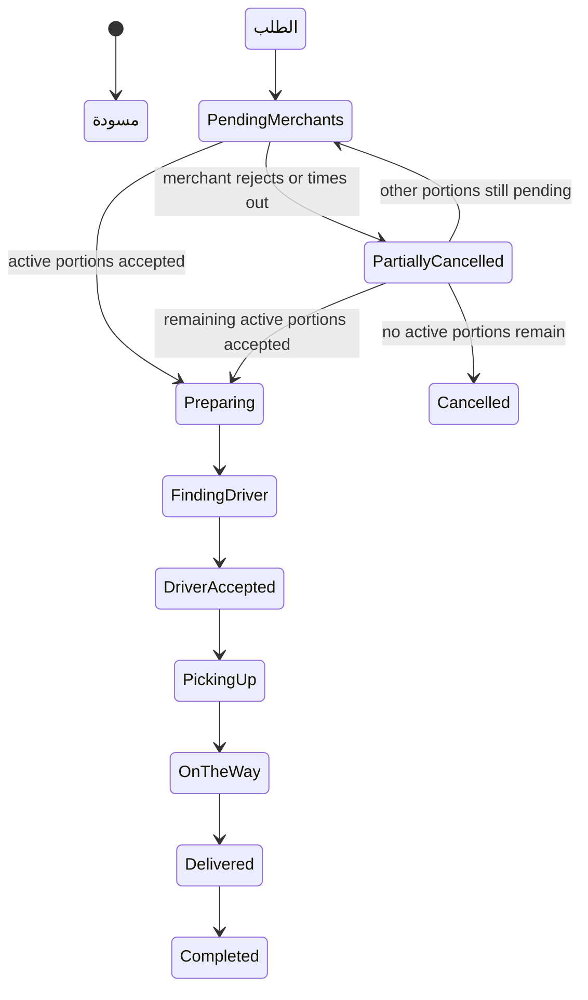
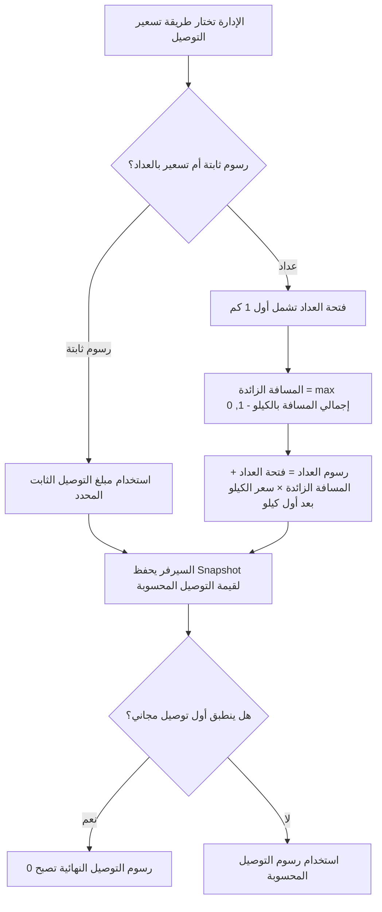
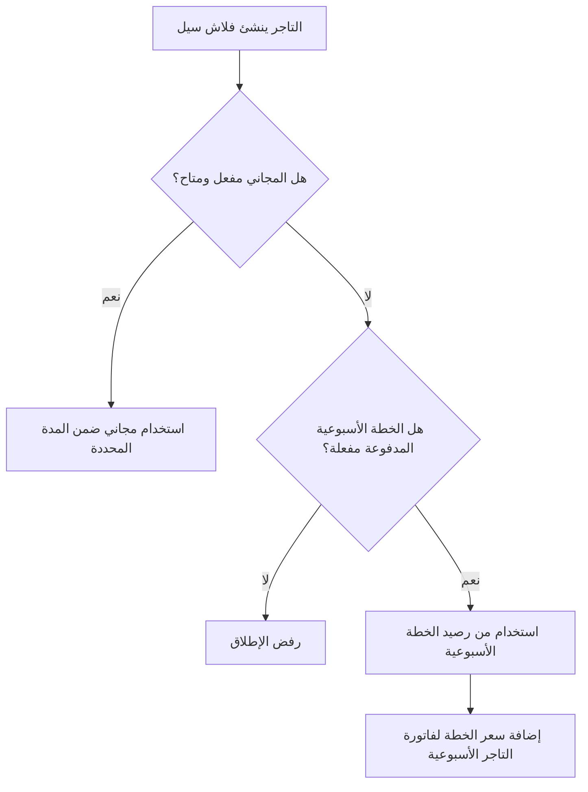
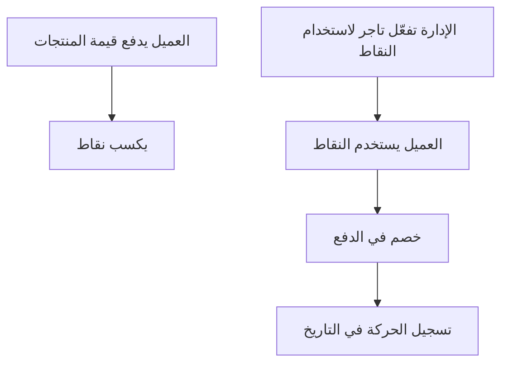
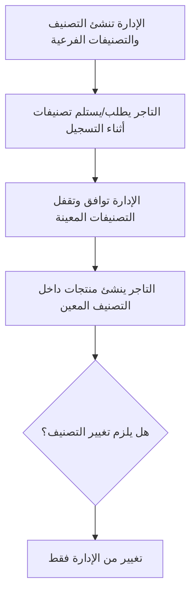

<div dir="rtl" align="right">
<style>
  table { direction: ltr; width: 100%; }
  th, td { direction: rtl; text-align: right; vertical-align: top; }
  th { font-weight: 700; }
</style>
<a id="top"></a>

# Market Home - وثيقة متطلبات المنتج

| القيمة | الحقل |
| ---: | ---: |
| نطاق المنتج الحالي | الحالة |
| العميل، مالك المنتج، UI/UX، الموبايل، الويب، الباك اند، QA | الجمهور |
| عربي مبسط | اللغة |
| تطبيق العميل، تطبيق التاجر، تطبيق السائق، لوحة الإدارة، لوحة التاجر | باقة التسليم |
| Customer Web و Driver Web للاختبار والتكامل فقط | واجهات الاختبار |

Market Home هو سوق محلي للتجارة والتوصيل. يقدر العميل يطلب من تاجر واحد أو من أكثر من تاجر في نفس عملية الشراء. كل تاجر يحضّر الجزء الخاص به فقط. السائق المعتمد يستلم الأجزاء الجاهزة ويوصل الطلب للعميل. الإدارة تتحكم في قواعد المنصة: الموافقات، التصنيفات، المناطق، رسوم التوصيل، العمولات، الفواتير، الفلاش سيلز، الكوبونات، نقاط الكاش باك، التقارير والدعم.

الملف مقسوم إلى جزئين:

- **الجزء الأول - PRD المنتج:** شرح سهل وواضح للعميل وفريق التصميم والموبايل.
- **الجزء الثاني - PRD تشغيلي وتكاملي:** قواعد أعمق لفريق الباك اند والويب والموبايل والاختبار بدون تفاصيل برمجية معقدة.

العناصر المؤجلة أو الملغاة موجودة في آخر الملف فقط حتى يظل نطاق المنتج الحالي واضحًا.

## الفهرس

- [الجزء الأول - PRD المنتج](#part-1-product-prd)
  - [1. ملخص المنتج](#1-product-summary)
  - [2. باقة التسليم](#2-delivery-package)
  - [3. أدوار المستخدمين](#3-user-roles)
  - [4. التسجيل والموافقة](#4-registration-and-approval)
  - [5. فلو السوق بالكامل](#5-full-marketplace-flow)
  - [6. فلو تطبيق العميل](#6-customer-app-flow)
  - [7. فلو تطبيق ولوحة التاجر](#7-merchant-app-and-dashboard-flow)
  - [8. فلو تطبيق السائق](#8-driver-app-flow)
  - [9. فلو لوحة الإدارة](#9-admin-dashboard-flow)
  - [10. فلو الطلبات والحالات](#10-orders-and-status-flow)
  - [11. فلو تحديد الموقع والخريطة](#11-location-pin-and-map-behavior)
  - [12. المنتجات والتصنيفات والعروض](#12-products-categories-and-offers)
  - [13. العروض والكوبونات ونقاط الكاش باك](#13-promotions-coupons-and-cashback-points)
    - [نقاط دعوة عميل لعميل](#نقاط-دعوة-عميل-لعميل)
    - [خصم عيد الميلاد](#خصم-عيد-الميلاد)
  - [14. الفلاش سيلز](#14-flash-sales)
  - [15. تسعير فتحة عداد التوصيل](#15-delivery-fee-meter-pricing)
  - [16. الطلبات الأسبوعية](#16-weekly-orders)
  - [17. فواتير التاجر الأسبوعية وتسوية السائق اليومية وطباعة الريسيت](#17-weekly-invoices-and-manual-payment-proof)
  - [18. الشات والاتصال والإشعارات والدعم](#18-chat-calls-notifications-and-support)
  - [19. قائمة قبول المنتج](#19-product-acceptance-checklist)
- [الجزء الثاني - PRD تشغيلي وتكاملي](#part-2-operational--integration-prd)
  - [20. وحدات المنصة](#20-platform-modules)
  - [21. الصلاحيات](#21-permission-model)
  - [22. قواعد الطلبات](#22-order-logic-rules)
  - [23. قواعد التسعير](#23-pricing-rules)
  - [24. قواعد فتحة عداد التوصيل](#24-delivery-fee-technical-rules)
  - [25. قواعد الفواتير والعمولات](#25-finance-and-invoice-rules)
    - [الإعفاء من العمولة وتقاسم تكلفة الخصومات](#merchant-commission-grace-and-discount-cost-sharing)
  - [26. قواعد فواتير الفلاش سيلز](#26-flash-sale-billing-rules)
  - [27. قواعد نقاط الكاش باك](#27-cashback-points-rules)
  - [28. قواعد تصنيفات التاجر](#28-merchant-category-rules)
  - [29. قواعد تذكير الطلبات الأسبوعية](#29-weekly-order-reminder-rules)
  - [30. قواعد الدعوات وتنبيه الشات](#30-referrals-and-chat-alert-rules)
  - [31. ملخص API و QA](#30-api-and-qa-handoff-summary)
- [خارج النطاق الحالي](#out-of-current-scope)
- [ملغي / غير نشط](#retired--not-active)

---

<a id="part-1-product-prd"></a>

# الجزء الأول - PRD المنتج

هذا الجزء يشرح المنتج بلغة بسيطة وواضحة.

[العودة للأعلى](#top)

<a id="1-product-summary"></a>

## 1. ملخص المنتج

Market Home يربط بين العميل والتاجر والسائق والإدارة داخل منصة واحدة للطلب والتوصيل.

العميل يقدر يعمل طلب واحد يحتوي على منتجات من تاجر واحد أو أكثر. الطلب يتقسم إلى أجزاء حسب التاجر. كل تاجر يرى الجزء الخاص به فقط، ويقبله أو يرفضه، ثم يحضّره ويعلّمه جاهز. السائق يرى الطلب فقط عندما يكون جاهزًا بالقدر المناسب للاستلام، وبشرط أن يكون مؤهلًا حسب المنطقة والحالة ونوع المركبة.

المنصة تدعم أيضًا الخصومات، نقاط الكاش باك، خصم عيد الميلاد، دعوة عميل لعميل بنقاط، الطلبات الأسبوعية، فواتير التجار الأسبوعية وتسوية السائق اليومية الإجبارية، الفلاش سيلز، رفع إيصال الدفع، الشات، زر تنبيه داخل الشات برنة مكالمة/ألارم، الإشعارات، نظام التقييم والسمعة، ومراقبة الإدارة، وتحديد مواقع العميل والتاجر داخل التطبيق باستخدام Google Maps Platform، وحساب المسافة/المدة/وقت الوصول عبر Google Routes API، وتتبع السائق أثناء التوصيل بعد الإسناد.

| المعنى | وعد المنتج |
| ---: | ---: |
| العميل يقدر يشتري من تاجر واحد أو أكثر في نفس الطلب. | طلب واحد من أكثر من تاجر |
| التاجر يتعامل مع منتجاته فقط داخل الطلب. | كل تاجر مسؤول عن الجزء الخاص به |
| السائق لا يرى الطلب قبل أن يكون جاهزًا للاستلام. | التوصيل بعد الجاهزية |
| الإدارة تتحكم في التصنيفات، المناطق، العمولات، الفلاش سيلز، الكوبونات، الكاش باك، الموافقات والفواتير. | تحكم الإدارة |
| التاجر يسدد فاتورة أسبوعية، والسائق يسدد يوميًا بشكل إجباري من التطبيق بمحفظة/إنستا باي مع صورة إيصال أو كاش في مقر Market Home وتسقطها الإدارة من لوحة التحكم. | فواتير واضحة |

[العودة للأعلى](#top)

<a id="2-delivery-package"></a>

## 2. باقة التسليم

| الهدف | يتم تسليمها للعميل؟ | الواجهة |
| ---: | ---: | ---: |
| الطلب، الدفع عند الطلب، رصيد وتاريخ نقاط الكاش باك، حالة الطلب، الطلبات الأسبوعية، الشات والدعم. | نعم | تطبيق العميل |
| التسجيل، الطلبات، المنتجات، التصنيفات، العروض، الفلاش سيلز، الفواتير، الداشبورد، الشات. | نعم | تطبيق التاجر |
| التسجيل، الطلبات المتاحة، خطوات الاستلام والتسليم، الفواتير، الداشبورد، الشات. | نعم | تطبيق السائق |
| إدارة المنصة بالكامل. | نعم | لوحة الإدارة |
| إدارة التاجر من الويب أو التابلت أو سطح المكتب. | نعم | لوحة التاجر |
| ليس ضمن الواجهات الأساسية المسلمة للعميل. | للاختبار والتكامل فقط | Customer Web |
| ليس ضمن الواجهات الأساسية المسلمة للعميل. | للاختبار والتكامل فقط | Driver Web |

[العودة للأعلى](#top)

<a id="3-user-roles"></a>

## 3. أدوار المستخدمين

| أهم الأفعال | الهدف | الدور |
| ---: | ---: | ---: |
| التسجيل، اختيار OTP للعميل عبر واتساب مخصص أو SMS من WhySMS عند الإتاحة، حفظ العناوين، التصفح، المفضلة، ملاحظات المنتجات، الدفع، الكوبونات، نقاط الكاش باك، خصم عيد الميلاد عند الاستحقاق، متابعة الطلب لايف، الشات، تقييم تجربة منتجات/تاجر كل جزء بعد التسليم وتقييم الدليفري، الطلب الأسبوعي. | الطلب بسهولة والتوفير | العميل |
| التسجيل، الموافقة، إدارة المنتجات والعروض داخل التصنيفات المعينة من الإدارة، قبول/رفض الطلب، التحضير، الفلاش سيلز، الفواتير، رفع إثبات الدفع. | البيع وتجهيز الطلبات | التاجر |
| التسجيل، الموافقة، أونلاين، مشاهدة الطلبات المؤهلة مرتبة بالمسافة/الوقت، قبول يدوي أو القبول التلقائي للأقرب اختياري، ملاحة Google داخل التطبيق، الاستلام، التسليم، فتح Google Maps كحل بديل، الفواتير. | توصيل الطلبات الجاهزة | السائق |
| يعمل فقط داخل الأقسام التي يحددها السوبر أدمن. | تشغيل أقسام محددة | موظف الإدارة |
| إنشاء حسابات الإدارة، تحديد الصلاحيات، وضبط قواعد المنصة. | التحكم الكامل | السوبر أدمن |

[العودة للأعلى](#top)

<a id="4-registration-and-approval"></a>

## 4. التسجيل والموافقة

### تسجيل العميل

| ما يحدث | الخطوة |
| ---: | ---: |
| العميل يختار اللغة. | 1 |
| يدخل الاسم ورقم الهاتف وكلمة المرور وتأكيدها. | 2 |
| يفعّل الهاتف عن طريق OTP خاص بالعميل: واتساب مخصص عند الإتاحة أو SMS من WhySMS. قناة SMS للعميل فقط. | 3 |
| يضيف أول عنوان توصيل. | 4 |
| الحساب يصبح نشطًا بدون موافقة الإدارة. | 5 |
| يمكن للعميل لاحقًا تعديل بياناته وعناوينه؛ تسجيل الدخول الحالي يعتمد على الهاتف وكلمة المرور فقط. | اختياري |

### تسجيل التاجر

| ما يحدث | الخطوة |
| ---: | ---: |
| التاجر يختار اللغة. | 1 |
| يدخل اسم البراند/المتجر، الهاتف، كلمة المرور، المنطقة. | 2 |
| لا يستخدم SMS OTP. يتم تحقق حساب التاجر عبر واتساب مخصص عند التفعيل، ثم مراجعة الإدارة للمستندات والموقع. | 3 |
| يختار التصنيفات المطلوبة من تصنيفات الإدارة أثناء التسجيل، ثم تقفل الإدارة القائمة النهائية عند الموافقة. | 4 |
| يرفع المستندات المطلوبة مثل الرخصة التجارية، السجل الضريبي، اللوجو، المنيو، وأي ملفات مطلوبة. | 5 |
| يحدد موقع المتجر على خريطة Google Maps ويتم حفظ الإحداثيات ونص العنوان وبيانات Google Place عند توفرها. | 6 |
| الحساب يظل تحت المراجعة حتى موافقة الإدارة. | 7 |

### تسجيل السائق

| ما يحدث | الخطوة |
| ---: | ---: |
| السائق يختار اللغة. | 1 |
| يدخل الاسم والهاتف وكلمة المرور والمنطقة. | 2 |
| لا يستخدم SMS OTP. يتم تحقق حساب السائق عبر واتساب مخصص عند التفعيل، ثم مراجعة الإدارة للمستندات والمركبة. | 3 |
| يختار نوع المركبة: موتور، سكوتر، إي-سكوتر، عجلة، سيارة، أو تروسيكل. | 4 |
| يرفع مستندات وصور المركبة حسب المطلوب. | 5 |
| يرفع المستندات الشخصية، البطاقة، الرخصة عند الحاجة، السيلفي، والفيش الجنائي عند الحاجة. | 6 |
| الحساب يظل تحت المراجعة حتى موافقة الإدارة. | 7 |

### إنشاء حسابات الإدارة

موظفو الإدارة لا يسجلون من التطبيقات العامة.

| ما يحدث | الخطوة |
| ---: | ---: |
| السوبر أدمن ينشئ حساب موظف إدارة. | 1 |
| يحدد اسم المستخدم/البريد وكلمة المرور. | 2 |
| يختار أقسام الداشبورد المسموح للموظف بدخولها. | 3 |
| الموظف يرى فقط الأقسام المسموحة له. | 4 |

نموذج الصلاحيات النشط هو صلاحيات حسب أقسام الداشبورد، وليس أدوار أدمن ثابتة لكل شيء. مصفوفة صلاحيات لوحة الإدارة يمكن أن تعرض ميتاداتا للأفعال ونطاق البيانات لمساعدة الواجهة في عرض الأزرار، لكن `allowedSections[]` تظل حد الصلاحية الفعلي في الباك إند، ولا يتم حفظ صلاحيات granular مستقلة للأفعال أو نطاقات البيانات.

[العودة للأعلى](#top)

<a id="5-full-marketplace-flow"></a>

## 5. فلو السوق بالكامل


[العودة للأعلى](#top)

<a id="6-customer-app-flow"></a>

## 6. فلو تطبيق العميل

| القاعدة | تجربة العميل | المجال |
| ---: | ---: | ---: |
| يتم حفظ lat/lng ونص العنوان والليبل وبيانات Google Place عند توفرها وروابط Google Maps/Deep link. | حفظ حتى 3 عناوين باستخدام دبوس Google Maps أو الموقع الحالي أو التحريك اليدوي للدبوس، مع إمكانية ألوان ماركر مناسبة للبراند من الواجهة. | العناوين |
| تظهر البيانات النشطة والمتاحة فقط. كروت وتفاصيل المنتجات يجب أن تستخدم نفس شكل البيانات لاختيارات السعر المفعلة، اختيار السعر الافتراضي، حالة العرض/المفضلة، بيانات تجهيز التاجر وروابط الموقع عند توفرها، وتجميع المنتجات المتعلقة في صفحة التفاصيل. ويمكن عرض متوسط/أسرع/أبطأ وقت تجهيز للتاجر في صفحة التاجر أو كارت التاجر حسب مساحة الواجهة. صفحة تفاصيل المنتج يمكن أن تعرض اختيارات السعر/الحجم والمنتجات المتعلقة التي اختارها التاجر من تصنيفات فرعية شقيقة تحت نفس التصنيف الكبير. | التجار، المنتجات، التصنيفات، العروض، المفضلة، اختيارات الحجم، والمنتجات المتعلقة. | التصفح |
| المنتجات تظل مجمعة حسب كل تاجر. | منتجات من تاجر واحد أو أكثر. | السلة |
| تظهر للتاجر للتحضير، وليست تعليمات للسائق. | ملاحظة اختيارية لكل منتج. | ملاحظات المنتج |
| تسعير السيرفر هو النهائي. رسوم التوصيل تعتمد على Google Routes عند الإتاحة: مبلغ ثابت أو فتحة عداد تشمل أول كيلو + سعر لكل كيلو بعد أول كيلو. | مراجعة السعر، الكوبون، نقاط الكاش باك، خصم عيد الميلاد عند الاستحقاق، رسوم التوصيل والإجمالي. | الدفع |
| الخصم يطبق على قيمة المنتجات المؤهلة. | كوبون نسبة خصم بحد أقصى. | الكوبونات |
| الكوبون وعيد الميلاد يتقسمان حسب نسبة مساهمة تاجر تحددها الإدارة، الافتراضي 0% مع Override اختياري، والمنصة تتحمل الباقي. التوصيل المجاني يظل على المنصة بالكامل، وعروض التاجر والفلاش والنقاط تظل حسب قواعدها الحالية. | تمويل الخصومات والتسوية | المالية |
| النقاط ليست فلوس ولا تقبل الشحن أو السحب أو التحويل. | رصيد وتاريخ نقاط، واستخدام النقاط عند التجار المؤهلين. | نقاط الكاش باك |
| يمكن الإنشاء من طلب سابق أو بناء جديد بعد تفريغ السلة. الإنشاء والتعديل واطلب الآن وفتح التذكير يستبدلون السلة ويتركونها قابلة للتعديل، ولا يتم إرسال الطلب إلا بعد تأكيد Checkout العادي. | الطلب الأسبوعي |
| التتبع يبدأ فقط بعد إسناد السائق في طلب نشط، ويُرسل بمعدل محدود حسب الوقت/المسافة، وينتهي بـ TTL، ولا يتم تخزين تاريخ خام طويل بلا داعٍ. إشعار إلغاء جزء تاجر يحتوي على زر تصفح المنتجات. | تايملاين واضح للطلب، إشعار عند إلغاء جزء تاجر، وخريطة مباشرة لموقع السائق أثناء التوصيل. | حالة الطلب والتتبع |
| التقييم لا يظهر إلا بعد التسليم. الأجزاء المرفوضة أو الملغاة أو الملغاة بسبب انتهاء الوقت لا تدخل في التقييم. الواجهة تأخذ تقييمًا واحدًا من 1 إلى 5 نجوم لكل جزء تاجر تم تسليمه، والباك إند يوزعه مرة واحدة على كل منتج فريد تم شراؤه من هذا التاجر. تقييم التاجر مشتق من تقييمات منتجاته. | تقييم تجربة كل تاجر/منتجاته في الطلب وتقييم الدليفري بعد التسليم. | التقييم بعد التسليم |
| تاريخ الميلاد يدخل مرة واحدة أثناء التسجيل أو أول إكمال للبروفايل، ولا يعدله العميل لاحقًا إلا من خلال دعم/إدارة. | خصم عيد ميلاد مرة واحدة في تاريخ عيد الميلاد عند استيفاء شروط الإدارة. | هدية عيد الميلاد |
| إخفاء الهاتف أو عدم توفره يمنع الاتصال المباشر فقط، ولا يمنع شات السائق مع العميل أو زر Alert/Ring. السائق المعيّن وحده يرسل التنبيه الصريح؛ وهو تنبيه داخل الشات مع رنة/ألارم وليس مكالمة صوتية. الرسائل العادية المرسلة للعميل قد تحمل ميتاداتا `customer_chat_ring` بصوت افتراضي وأولوية عالية، لكنها لا تستخدم قناة `customer_chat_call_alert` أو صوت الألارم. | شات التاجر مع العميل وشات التاجر مع السائق ملغيان من النطاق النشط. شات السائق المعيّن مع العميل والدعم والشكاوى يظلون متاحين حسب الصلاحيات. | الشات والاتصال |

[العودة للأعلى](#top)

### حقيقة تسوية الخصومات والفواتير

حقيقة المنتج المحدثة: التوصيل المجاني يظل ممولًا بالكامل من المنصة. الكوبون وعيد الميلاد يتقسمان بين المنصة والتاجر حسب نسبة الإدارة، الافتراضي 0% مع Override اختياري لكل تاجر. التاجر يتحمل عروضه والفلاش سيل والنقاط المؤهلة ومساهمته المحددة فقط، مع منع التحميل المزدوج. فاتورة السائق يومية وإجبارية.

<a id="7-merchant-app-and-dashboard-flow"></a>

## 7. فلو تطبيق ولوحة التاجر

| القاعدة | تجربة التاجر | المجال |
| ---: | ---: | ---: |
| الحساب المعلق أو الموقوف لا يستقبل طلبات عادية. | تحت المراجعة حتى موافقة الإدارة. | حالة الحساب |
| الموقع يظل مقفولًا بعد الموافقة إلا إذا أعادت الإدارة فتحه؛ ويتم حفظ الإحداثيات والعنوان والليبل وبيانات Google Place عند توفرها. | يحدد التاجر دبوس المتجر مرة واحدة على Google Maps. | موقع المتجر |
| عبارة Close or Busy في الواجهة معناها غير مستعد لاستقبال الطلبات. | Open أو غير متاح. | التوفر |
| التاجر يرى الجزء الخاص به فقط، ولا يحتاج أزرار جاهز/مستني دليفري/سلمت للدليفري في الفلو النشط. | طلبات جديدة ومقبولة/قيد التجهيز كسجل مبسط. | الطلبات |
| الرفض يحتاج سببًا مكتوبًا ويلغي جزء هذا التاجر فقط؛ الطلب المتبقي يعاد حسابه ويكمل إذا بقيت أجزاء نشطة. | يقبل أو يرفض الجزء الخاص به. | قبول/رفض |
| المنتج يجب أن يكون داخل تصنيف معين للتاجر من الإدارة. يجب وجود اختيار سعر واحد على الأقل: ستاندرد فقط، أو حجم/أكثر مثل S/M/L وكل حجم مفعل له سعر. المنتجات المتعلقة تختار تصنيفات فرعية شقيقة تحت نفس التصنيف الكبير فقط. | إضافة/تعديل منتجات بصورة، حالة مخزون، تصنيف معين من الإدارة، تصنيف فرعي، تفاصيل، عرض اختياري، اختيارات سعر/حجم اختيارية، وتصنيفات منتجات متعلقة. | المنتجات |
| إضافة/تعديل/حذف التصنيفات بعد الموافقة يتم من الإدارة فقط، ولا تظهر للتاجر أزرار تعديل التصنيف. | مشاهدة التصنيفات المعينة فقط. | التصنيفات |
| المجاني أولًا، ثم المدفوع يضاف للفاتورة الأسبوعية. | إنشاء عروض محدودة الوقت. | الفلاش سيلز |
| العمولة، تكلفة الفلاش سيلز، تكلفة النقاط عند التفعيل، وإثبات الدفع تظهر منفصلة. | عرض تفاصيل الفاتورة ورفع إثبات الدفع. | الفواتير |
| الريسيت باسم المطعم فقط بدون أي بيانات أو براند Market Home. | طباعة ريسيت للطلب يحتوي اسم المطعم، رقم الطلب، ID الطلب، اسم الدليفري، الكود، ومحتوى جزء هذا المطعم فقط. | طباعة الريسيت |
| يجب فصل الإيراد عن المستحق للمنصة. | مبيعات، عمولة، طلبات، تقييمات، منتجات، وأسرع/أبطأ/متوسط وقت تجهيز مع عدد العينات عند توفره. | الداشبورد |
| تقييم التاجر ليس تقييمًا يدويًا مستقلًا؛ يتم حسابه من تقييمات منتجاته/أجزاء الطلب الخاصة به. | عرض متوسط التقييم وعدد التقييمات في الداشبورد وصفحات المنتج. | التقييم والسمعة |
| حدود القرب من التاجر تضبطها الإدارة بالمسافة و/أو ETA، ويرسل الإشعار مرة واحدة لكل محطة/حدث. | التاجر يتلقى إشعارًا عندما يقترب السائق من نقطة الاستلام. | اقتراب السائق من الاستلام |

### مؤشرات وقت تجهيز التاجر

المنصة يجب أن توضّح للعميل والإدارة مدى سرعة التاجر في تجهيز الطلبات المقبولة. هذه المؤشرات معلوماتية وتُحسب من طلبات حقيقية وصلت إلى حالة جاهز/تم التسليم.

| مكان الظهور | المعنى | المؤشر |
| ---: | ---: | ---: |
| صفحة التاجر، كارت التاجر عند توفر مساحة، وقائمة التجار في لوحة الإدارة. | أقصر وقت صحيح من قبول/بدء تجهيز الجزء إلى جاهز/مطبوخ. | أسرع وقت تجهيز |
| صفحة التاجر وتفاصيل/قائمة التاجر في لوحة الإدارة. | أطول وقت صحيح من قبول/بدء تجهيز الجزء إلى جاهز/مطبوخ. | أبطأ وقت تجهيز |
| صفحة التاجر، تصفح العميل، داشبورد التاجر، وقائمة التجار في الإدارة. | متوسط مدة التجهيز للطلبات المكتملة. | متوسط وقت التجهيز |
| لوحة الإدارة، داشبورد التاجر، وصفحة التاجر عند الحاجة. | عدد الأجزاء الصحيحة المستخدمة ووقت آخر حساب للمؤشرات. | عدد العينات وآخر حساب |

يجب تجاهل الأجزاء المرفوضة أو الملغاة أو الملغاة بسبب انتهاء الوقت، وأي جزء لم يصل إلى جاهز/مطبوخ.

[العودة للأعلى](#top)

<a id="8-driver-app-flow"></a>

## 8. فلو تطبيق السائق

| القاعدة | تجربة السائق | المجال |
| ---: | ---: | ---: |
| الحساب المعلق أو الموقوف لا يستقبل طلبات. | الحساب تحت المراجعة حتى موافقة الإدارة. | الموافقة |
| الطلب الكبير/المحتاج مركبة كبيرة يظهر فقط لسائق سيارة أو تروسيكل. | يدعم السيارة والتروسيكل ضمن الأنواع. | المركبة |
| الأوفلاين لا يستقبل طلبات. | السائق يتحكم في حالته. | أونلاين/أوفلاين |
| الأهلية تشمل المنطقة والحساب والحالة والمركبة وتاريخ الرفض. | تظهر الطلبات الجاهزة والمؤهلة فقط ومرتبة حسب Google route distance/ETA من موقع السائق الحالي لأقرب نقطة استلام مؤهلة. | الطلبات المتاحة |
| القبول التلقائي للأقرب مقفول افتراضيًا ويحتاج locking من السيرفر لمنع سباق قبول نفس الرحلة. | قبول يدوي أو القبول التلقائي للأقرب اختياري. | قبول الطلب |
| يمكن استلام الأجزاء الجاهزة أولًا. | استلام من تاجر أو عدة تجار. | الاستلام |
| التسليم ينهي آثار الطلب مثل الكاش باك والفواتير. | توصيل للعميل وإنهاء الطلب. | التسليم |
| تقييم الدليفري من العميل، إذا ظهر في الواجهة، منفصل عن تقييم منتجات التاجر ولا يؤثر عليها. الدليفري لا يقيّم العميل في النطاق النشط. | العميل يمكنه تقييم الدليفري بعد التسليم كتقييم خدمة منفصل، بدون أي تقييم من الدليفري للعميل. | التقييم |
| السائق يرى خريطة/ملاحة Google داخل التطبيق للمسار متعدد المحطات، ويمكنه فتح Google Maps خارجيًا كحل بديل. المسار يحتوي على أقرب استلام جاهز، باقي الاستلامات النشطة، ثم التسليم للعميل؛ والأجزاء الملغاة/المرفوضة/انتهاء المهلة تُزال من المسار. زر SOS/الطوارئ أعلى يمين الخريطة هو إجراء طوارئ للمنصة وليس تنبيه العميل داخل الشات. | فتح موقع الاستلام/التسليم من زر Open in Maps عند الحاجة. | الخرائط والملاحة |
| الإدارة تتحكم في نسبة السائق العامة أو الخاصة، والسداد يومي إجباري. | عرض الفاتورة اليومية ورفع إثبات الدفع أو السداد كاش في المقر. | الفواتير |

[العودة للأعلى](#top)

<a id="9-admin-dashboard-flow"></a>

## 9. فلو لوحة الإدارة

| ما تفعله الإدارة | القسم |
| ---: | ---: |
| متابعة مؤشرات السوق والطلبات المتأخرة والسائقين الأونلاين والمتاجر المفتوحة. | المراقبة |
| مراجعة طلبات التجار والسائقين. | الموافقات |
| السوبر أدمن ينشئ الموظفين ويحدد أقسامهم. | صلاحيات الموظفين |
| إنشاء وإدارة التصنيفات والتصنيفات الفرعية. | التصنيفات |
| إدارة مناطق الخدمة وربط الحسابات بها، جاهزية Google Maps/API، حدود التتبع والقرب، ومراجعة لقطات محفوظة المواقع عند الحاجة. | المناطق والمواقع |
| عرض وإيقاف/تفعيل العملاء والتجار والسائقين، مع عرض أسرع/أبطأ/متوسط وقت تجهيز داخل قائمة وحسابات التجار. | الحسابات |
| متابعة تقييمات باقة منتجات التاجر، ومتوسطات المنتجات والتجار، وتقييم الدليفري من العميل عند استخدامه، مع مراجعة التعليقات وتشغيل إعادة حساب آمنة عند الحاجة. تقييم العميل من الدليفري ملغي من النطاق النشط. | التقييم والجودة |
| عمولات التجار والسائقين العامة والخاصة، حد الطلبات المعفاة العام والمخصص لكل تاجر، نسب مساهمة التاجر في الكوبون وعيد الميلاد، تسعير التوصيل، الفواتير والأرصدة وتعليمات الدفع. | الفاينانس |
| ضبط عدد المرات المجانية، مدة المرة، التجديد الأسبوعي، وسعر الخطة الأسبوعية بعد المجاني. | الفلاش سيلز |
| إنشاء كوبونات بنسبة وحد أقصى مع اختيار: كل التجار، تجار محددين فقط، أو كل التجار ما عدا المحددين. | الكوبونات |
| تحديد التجار المؤهلين وقيمة النقاط كخصم لكل تاجر. | نقاط الكاش باك |
| ضبط OTP للعميل عبر واتساب مخصص وSMS من WhySMS، وحدود إعادة الإرسال، تبديل القناة، محاولات التحقق، و lockout. إتاحة Runtime والحدود المشتركة نشطة، وتبقى واجهة إعدادات الأدمن خطوة سطحية لاحقة. | قنوات OTP |
| تفعيل/تعطيل خصم عيد الميلاد، الحد الأقصى للنسبة، سقف سعر المنتج، سقف subtotal الطلب، ساعة الإشعار، والتقارير. | خصم عيد الميلاد |
| مراقبة كل الطلبات، أجزاء التجار الملغاة، إلغاءات انتهاء مدة الرد، الطلبات المتأخرة، والتدخل التشغيلي عند الحاجة. | الطلبات |
| الشكاوى، الدعم، التقارير، والبث. | الدعم والتقارير |

[العودة للأعلى](#top)

<a id="10-orders-and-status-flow"></a>

## 10. فلو الطلبات والحالات



| المعنى | المسؤول | الحالة |
| ---: | ---: | ---: |
| يمكن للعميل التعديل أو الحذف أو المتابعة قبل إرسال الطلب للتجار. | العميل | مسودة الطلب |
| التجار لازم يردوا بالقبول أو الرفض قبل مدة الرد التي تحددها الإدارة. | التجار / النظام | Pending merchants |
| جزء التاجر يتم إلغاؤه لو التاجر رفض بسبب مكتوب أو لو انتهت مدة الرد بدون قبول. | التاجر / النظام | Portion cancelled |
| يتم إعادة حساب المنتجات، الكوبون، نقاط الكاش باك، مسار التوصيل، رسوم التوصيل، والإجمالي بعد إلغاء أي جزء. | النظام | Repricing |
| الأجزاء المقبولة المتبقية تكمل التحضير بشكل طبيعي. | التجار | Preparing |
| السائق يرى قائمة الاستلام والمسافة بعد حذف الأجزاء الملغاة فقط. | النظام / السائق | Finding driver |
| يستلم الأجزاء الجاهزة المتبقية. | السائق | Pickup |
| يسلم للعميل. | السائق | Drop-off |
| يتم تثبيت آثار الكاش باك والفواتير حسب قيمة الطلب النهائية. | النظام | Completed |

### فلو رفض التاجر أو انتهاء مدة الرد

1. كل تاجر يقبل أو يرفض الجزء الخاص به فقط.
2. الإدارة تحدد من الداشبورد أقصى مدة مسموحة لرد التاجر.
3. عند الرفض، يجب أن يكتب التاجر سببًا واضحًا للرفض.
4. لو التاجر لم يرد قبل انتهاء المدة، يتم إلغاء جزء التاجر تلقائيًا بسبب نظامي مثل: `التاجر لم يرد في الوقت المحدد`.
5. الجزء الملغى يتم حذفه من مسار الطلب والتسعير النشط، لكنه يظل محفوظًا في تاريخ الطلب للمراجعة.
6. العميل يستقبل إشعارًا يوضح اسم التاجر الملغى وسبب الإلغاء.
7. الإشعار يحتوي على زر للعودة إلى تصفح المنتجات لو العميل يريد عمل طلب جديد مستقل بدل الجزء الملغى.
8. لو بقي جزء واحد نشط على الأقل، الطلب يكمل بالأجزاء المتبقية بعد إعادة الحساب.
9. لو لم يتبق أي جزء نشط، يتم إلغاء الطلب بالكامل ويتم إشعار العميل.
10. يظل من حق العميل إلغاء الطلب بالكامل في الحالات التي تسمح بها قواعد الإلغاء، لكن النظام لا يوقف باقي الأجزاء المقبولة فقط لأن تاجرًا واحدًا رفض أو انتهت مدته.

مثال: لو العميل طلب من 5 تجار ورفض تاجر واحد، يتم إلغاء جزء هذا التاجر مع سبب الرفض، ويتم إشعار العميل، ثم يعاد حساب الطلب على التجار المتبقين فقط: قيمة المنتجات، الكوبون، نقاط الكاش باك، مسافة التوصيل، رسوم التوصيل، والإجمالي. ولو احتاج العميل بديلًا، يضغط على زر تصفح المنتجات لعمل طلب جديد مستقل.

[العودة للأعلى](#top)

<a id="11-location-pin-and-map-behavior"></a>

## 11. فلو تحديد الموقع والخريطة

مزود الخرائط النشط هو Google Maps Platform لاختيار مواقع العميل والتاجر، ومزود المسارات النشط هو Google Routes API لحساب المسافة والمدة ووقت الوصول والأرجل ولقطات المزود وحسابات رسوم التوصيل. الموقع لا يعتمد على الرابط فقط؛ الحقيقة الأساسية هي الإحداثيات `lat/lng` مع نص العنوان، ورابط Google Maps أو الـ Deep Link مجرد وسيلة لفتح نفس النقطة في تطبيق خرائط.

| القاعدة | المجال |
| ---: | ---: |
| العميل يقدر يستخدم صلاحية الموقع لتحديد مكانه تلقائيًا أو يحرك دبوس Google Maps يدويًا. | تحديد موقع العميل |
| العميل يقدر يحفظ حتى 3 عناوين. | عناوين العميل |
| التاجر يحدد موقع متجر واحد على Google Maps أثناء التسجيل، وبعد الموافقة يظل مقفولًا إلا لو الإدارة فتحته. | موقع التاجر |
| الباك اند يحفظ الإحداثيات ونص العنوان والليبل والمنطقة وبيانات Google Place عند توفرها وروابط Google Maps/Deep link عند وجود الإحداثيات. | تخزين الموقع |
| الواجهة يمكنها استخدام ألوان ماركر مناسبة للبراند وMap IDs من Google Maps عند الحاجة. | شكل الدبوس |
| لوحة الويب/الإدارة يمكن أن تستخدم Google Maps JavaScript API عندما تحتاج عرض خريطة. | عرض الويب والإدارة |
| السائق يحصل على عرض المسارs وروابط Google Maps وملاحة Google داخل التطبيق أثناء الطلب النشط، مع بديل احتياطي خارجي. | تنقل السائق |
| Google Maps Platform وروابطه المساعدة وGoogle Routes API هي حقيقة المنتج النشطة للخرائط والتوجيه في التطبيق والتسليمات والباك إند. | حقيقة الخرائط والتوجيه |

[العودة للأعلى](#top)

<a id="12-products-categories-and-offers"></a>

## 12. المنتجات والتصنيفات والعروض

الإدارة هي التي تنشئ شجرة التصنيفات. كل تصنيف يمكن أن يحتوي على تصنيفات فرعية، مع إمكانية `OTHER` عند الحاجة.

قواعد تصنيفات التاجر:

1. التاجر يختار التصنيفات المطلوبة أثناء التسجيل.
2. موافقة الإدارة تقفل قائمة التصنيفات المعينة للتاجر.
3. التاجر لا يملك إنشاء أو إضافة أو تعديل أو حذف تصنيفات المنصة بعد الموافقة من التطبيق أو الداشبورد.
4. أي تغيير في تصنيفات التاجر بعد الموافقة يتم من الإدارة فقط.
5. إنشاء/تعديل المنتج يجب أن يكون داخل تصنيف مفعل ومعين للتاجر.
6. المنتج يجب أن يختار تصنيفًا فرعيًا أو `OTHER` حسب المسموح.
7. عروض المنتج تختلف عن الفلاش سيلز ويمكن تفعيلها عند إنشاء أو تعديل المنتج.
8. تسعير المنتج يدعم ستاندرد للتوافق مع السعر الواحد الحالي، ويدعم أحجام اختيارية مثل `S` و`M` و`L`؛ كل حجم مفعل يجب أن يكون له سعر.
9. المنتج يمكن أن يكون ستاندرد فقط، أو حجم واحد، أو حجمين، أو الثلاث أحجام. لا يجوز حفظ منتج بدون أي اختيار سعر مفعل.
10. إذا كان للمنتج أكثر من اختيار سعر مفعل، يجب أن يرسل العميل الاختيار المحدد عند الإضافة للسلة حتى يحفظ الطلب لقطة السعر الصحيحة.
11. عند إنشاء/تعديل المنتج، يمكن للتاجر اختيار تصنيفات فرعية متعلقة من نفس التصنيف الكبير فقط. مثال: منتج ساندوتش تحت "أكل سوري / ساندوتشات" يمكنه اختيار "إضافات" و"مشروبات" تحت نفس "أكل سوري".
12. المنتجات المتعلقة التي تظهر للعميل هي منتجات نفس التاجر المتاحة داخل التصنيفات الفرعية المختارة، مع استبعاد المنتج الحالي.

[العودة للأعلى](#top)

### قواعد الأحجام والمنتجات المتعلقة

| القاعدة | المجال |
| ---: | ---: |
| المنتجات ذات السعر الواحد الحالية تظل صحيحة كاختيار `Standard`. ويمكن أن يظل حقل `price` القديم ممثلًا للسعر الافتراضي/الأقل للتوافق. | تسعير ستاندرد |
| الأحجام الاختيارية هي `S` و`M` و`L`، ومعناها صغير/وسط/كبير. يمكن للتاجر تفعيل الثلاثة، أو حجمين، أو حجم واحد، أو عدم تفعيل أحجام والاكتفاء بستاندرد. | تسعير الأحجام |
| كل منتج يجب أن يحتوي على اختيار سعر مفعل واحد على الأقل. إذا كان ستاندرد فقط، تظل تجربة العميل مثل فلو السعر الواحد الحالي. إذا كان هناك أكثر من اختيار مفعل، يجب اختيار السعر قبل الإضافة للسلة. | اختيارات السعر |
| كل سطر طلب يحفظ كود اختيار السعر، الاسم الظاهر، وسعر الوحدة وقت إنشاء الطلب. تعديل المنتج بعد ذلك لا يغير إجماليات الطلبات القديمة. | لقطة الطلب |
| التاجر يختار التصنيفات الفرعية المتعلقة من نفس التصنيف الكبير. مثال: ساندوتش من تصنيف أكل سوري يمكن أن يربط مشروبات وإضافات تحت نفس أكل سوري. | المنتجات المتعلقة |
| صفحة تفاصيل المنتج تعرض منتجات نفس التاجر المتاحة داخل التصنيفات الفرعية المختارة، ويفضل تجميعها حسب التصنيف الفرعي، مع استبعاد المنتج الحالي. | عرض العميل |
| الرئيسية، البحث، العروض، الفلاش سيل، منتجات التاجر، صفحة التاجر، وتفاصيل المنتج تعرض نفس حقول اختيارات السعر المفعلة، الاختيار الافتراضي، المفضلة والعرض حتى لا يضطر العميل لاستنتاج بيانات ناقصة. | شكل بيانات كتالوج العميل |
| يجب رفض اختيار تصنيف متعلق من تصنيف كبير آخر، أو تصنيف فرعي غير مفعل، أو تكرارات، أو منتج بدون سعر مفعل. | الحماية |

[العودة للأعلى](#top)

### تسوية الخصومات الممولة من المنصة والنقاط الممولة من التاجر

خصومات الأكواد وخصم عيد الميلاد تظل عروضًا للعميل تنشئها المنصة، لكن تكلفة كل نوع تتقسم بين المنصة والتاجر حسب نسبة تحددها الإدارة. الافتراضي العام لمساهمة التاجر في كل نوع `0%` ويمكن وضع Override لتاجر معين، والباقي تتحمله المنصة. التوصيل المجاني يظل ممولًا بالكامل من المنصة. استخدام النقاط والدعوات وعروض التاجر والفلاش سيل تظل حسب قواعدها الحالية. كل طلب يحفظ لقطة لنسب ومبالغ مساهمة المنصة والتاجر، وممنوع جمع التوصيل المجاني مع كود أو عيد ميلاد أو جمع الكوبون مع عيد الميلاد.

<a id="13-promotions-coupons-and-cashback-points"></a>

## 13. العروض والكوبونات ونقاط الكاش باك

| التأثير على العميل | المتحكم | الآلية |
| ---: | ---: | ---: |
| المنتج يظهر بسعر عرض. | التاجر | عرض المنتج |
| خصم نسبة بحد أقصى، ويعمل مع كل التجار أو تجار محددين أو كل التجار ما عدا المحددين. | الإدارة | كوبون |
| عند عدم وجود خصم كوبون أو عيد ميلاد موجب، يحصل العميل المؤهل على دعم توصيل حتى الحد الذي تحدده الإدارة، والافتراضي 30 جنيه، ويدفع أي فرق أعلى من الحد. عند وجود أي خصم موجب يُحتفظ به ويُلغى دعم التوصيل تلقائيًا. | الإدارة | أول طلب بدعم توصيل |
| ترويج عاجل لفترة محدودة. | التاجر حسب قواعد الإدارة | فلاش سيل |
| النقاط تتحول لخصم عند تجار مؤهلين. | العميل حسب قواعد الإدارة | نقاط الكاش باك |

### الكوبونات

الكوبونات خصومات بسيطة للعميل.

| المعنى | الحقل |
| ---: | ---: |
| نسبة تطبق على قيمة منتجات التجار المؤهلين. | نسبة الخصم |
| أقصى مبلغ واحد للكوبون كله، وليس حدًا منفصلًا لكل تاجر. | الحد الأقصى |
| كل التجار `all` أو تجار محددين `include` أو كل التجار ما عدا المحددين `exclude`. | نطاق التجار |
| تاريخ بداية ونهاية اختياري. | فترة النشاط |
| حد إجمالي أو حد لكل عميل عند الحاجة. | حدود الاستخدام |

مثال:

| القيمة | البند |
| ---: | ---: |
| 1000 جنيه | قيمة المنتجات |
| 10% | نسبة الكوبون |
| 70 جنيه | الحد الأقصى |
| 70 جنيه | الخصم الفعلي |

### نقاط الكاش باك

نقاط الكاش باك ليست محفظة فلوس. هي رصيد وتاريخ نقاط.

| المعنى | القاعدة |
| ---: | ---: |
| كل 1 جنيه من قيمة المنتجات المدفوعة = 1 نقطة. | الكسب |
| لا تدخل في حساب النقاط. | رسوم التوصيل |
| النقاط تستخدم كخصم عند التجار الذين تحددهم الإدارة. | الاستخدام |
| الإدارة تحدد لكل تاجر: كل 100 نقطة تساوي كام جنيه خصم. | قيمة النقاط |
| لا شحن، لا سحب، لا تحويل، ولا دفع نقدي من الرصيد. | لا يوجد تعامل نقدي |

مثال كسب النقاط:

| القيمة | البند |
| ---: | ---: |
| 100 جنيه | قيمة المنتجات |
| 20 جنيه | رسوم التوصيل |
| 100 نقطة | النقاط المكتسبة |

مثال استخدام النقاط:

| الخصم | العميل يستخدم | قاعدة الإدارة | التاجر |
| ---: | ---: | ---: | ---: |
| 50 جنيه | 1000 نقطة | 100 نقطة = 5 جنيه | تاجر A |
| 30 جنيه | 1000 نقطة | 100 نقطة = 3 جنيه | تاجر B |

[العودة للأعلى](#top)

### نقاط دعوة عميل لعميل

ميزة الدعوة تسمح للعميل بدعوة عميل جديد باستخدام كود دعوة. المكافأة تكون نقاط داخل نظام النقاط الحالي، وليست فلوس ولا محفظة منفصلة.

| المتطلب | القاعدة |
| ---: | ---: |
| كل عميل يمكن أن يكون له كود دعوة فريد يشاركه. | كود الدعوة |
| تسجيل العميل الجديد يمكن أن يحتوي على كود دعوة اختياري. | كود اختياري أثناء التسجيل |
| الإدارة تتحكم في تفعيل الميزة وعدد نقاط المدعو والداعي. | إعدادات الإدارة |
| الداعي والمدعو يحصلان على النقاط فقط بعد أول طلب فعلي مكتمل ومسلّم للعميل المدعو. | توقيت المكافأة |
| لا دعوة للنفس، لا تكرار للمكافأة، ولا نقاط على طلب ملغي أو مرفوض أو غير مكتمل. | منع الإساءة |
| النقاط تسجل في سجل النقاط النقاط الحالي بمصدر واضح، ولا تعتبر فلوس أو تحويل أو شحن محفظة. | نموذج النقاط |
| الإدارة ترى تقارير الدعوات وحالة أول طلب مكتمل ومسلّم والنقاط الممنوحة ومحاولات التكرار. | التقارير |

[العودة للأعلى](#top)

### خصم عيد الميلاد

خصم عيد الميلاد ميزة تتحكم فيها الإدارة. الهدف مكافأة العميل في يوم عيد ميلاده بدون فتح باب إساءة الاستخدام بتغيير تاريخ الميلاد.

| المتطلب | القاعدة |
| ---: | ---: |
| الإدارة تقدر تفعّل/تعطّل الميزة وتحدد أقصى نسبة خصم، أقصى سعر منتج مؤهل، أقصى subtotal طلب مؤهل، وساعة إشعار عيد الميلاد. | تحكم الإدارة |
| العميل يدخل تاريخ الميلاد مرة واحدة أثناء التسجيل أو أول إكمال للبروفايل. | إدخال تاريخ الميلاد |
| العميل لا يستطيع تعديل تاريخ الميلاد لاحقًا؛ التصحيح أو إعادة الفتح تتم فقط من دعم/إدارة بخطوة مضبوطة. | منع الإساءة |
| نسبة الخصم حسب العمر الحالي، والنسبة الفعلية = الأقل بين العمر وأقصى نسبة تحددها الإدارة. | نسبة الخصم |
| الخصم يطبق مرة واحدة في تاريخ عيد الميلاد، وعلى المنتجات المؤهلة فقط إذا كان سعر الوحدة/السعر الفعلي داخل سقف سعر المنتج، وكان subtotal المنتجات المؤهلة داخل سقف الطلب. | الاستحقاق |
| الخصم لا يطبق على رسوم التوصيل. | رسوم التوصيل |
| الطلب يحفظ snapshot للنسبة وقرار الاستحقاق وقيمة الخصم وإعدادات الإدارة وقت الطلب. | الأرشفة والمراجعة |
| الباك اند يعرّض `birthdayGiftAvailable` و `birthdayDiscountPercent` و `birthdayEligibleToday` و `birthdayPopupShouldShow` و `birthdayPopupSeen` ويسجل مشاهدة الـ النافذة المنبثقة. | فلاج الواجهة |
| إشعار عيد الميلاد يرسل صباحًا، وأول فتح للتطبيق في اليوم يمكن أن يعرض نافذة احتفالية/مؤثر احتفالي. | الإشعارات |
| تقارير الإدارة تعرض عدد المؤهلين، من تم إشعارهم، من استخدموا الخصم، إجمالي الخصم، وتقرير حسب التاريخ/الشهر. | التقارير |

#### تسوية خصومات المنصة ونقاط التاجر

خصومات الأكواد وهدية عيد الميلاد تتقسم بين المنصة والتاجر حسب نسبة عامة أو Override لكل تاجر، والافتراضي `0%` على التاجر. الإدارة تحدد أيضًا للكوبون نسبة الخصم والحد الأقصى ونطاق التجار `all/include/exclude`. الطلب يسمح بميزة واحدة فقط من الكوبون/عيد الميلاد/التوصيل المجاني: لا يمكن جمع الكوبون مع عيد الميلاد، وأي خصم موجب منهما يلغي التوصيل المجاني. الدليفري يدفع للتاجر المبلغ المحسوب بعد مساهمة التاجر، ومساهمة المنصة تظهر كرصيد يخصم من فاتورة الدليفري اليومية. خصم النقاط يظل آلية منفصلة يتحملها التاجر ويمكن أن يعمل مع الميزة المختارة عند وجود لقطة صحيحة.

<a id="14-flash-sales"></a>

## 14. الفلاش سيلز

الفلاش سيلز عروض قصيرة المدة ينشئها التاجر تحت قواعد الإدارة. الإعفاء من العمولة أو العمولة `0%` لا يمنع إنشاء أو تفعيل أو إعادة جدولة الفلاش سيل. تظل قواعد عدد المرات المجانية، الخطة الأسبوعية المدفوعة، المدة، ملكية المنتج، حالة الحساب، والمراجعة هي المتحكم الوحيد.

| المعنى | القاعدة |
| ---: | ---: |
| الإعفاء من العمولة أو العمولة `0%` لا يمنع الفلاش سيل. | استقلال العمولة |
| الإدارة تقدر تفتح أو تقفل المرات المجانية للتجار المؤهلين. | تفعيل المجاني |
| التاجر يحصل على عدد مجاني من مرات الفلاش سيل. القاعدة الافتراضية: 3 مرات مجانية. | عدد المرات المجانية |
| الإدارة تحدد أقصى مدة لكل مرة مجانية. القاعدة الافتراضية: ساعة واحدة. | مدة المرة المجانية |
| الإدارة تحدد هل المجاني يتجدد أسبوعيًا أم لا. | تجديد المجاني |
| بعد انتهاء المجاني، يمكن للتاجر استخدام خطة مدفوعة أسبوعية إذا كانت مفعلة. | الخطة المدفوعة |
| الإدارة تحدد عدد مرات الفلاش سيل المسموحة داخل الخطة الأسبوعية. | عدد مرات الخطة |
| الإدارة تحدد مدة كل مرة داخل الخطة المدفوعة. | مدة المرة في الخطة |
| الإدارة تحدد سعر الخطة الأسبوعية. | سعر الخطة الأسبوعية |
| تكلفة الخطة الأسبوعية تضاف إلى فاتورة التاجر الأسبوعية كبند منفصل. | الفاتورة الأسبوعية |

مثال فاتورة:

| القيمة | البند |
| ---: | ---: |
| 250 جنيه | عمولة التاجر |
| مفعلة | خطة فلاش سيل أسبوعية مدفوعة |
| 3 مرات في الأسبوع | عدد مرات الخطة |
| ساعة لكل مرة | مدة كل مرة |
| 60 جنيه في الأسبوع | سعر الخطة الأسبوعية |
| 310 جنيه | إجمالي الفاتورة |

[العودة للأعلى](#top)

<a id="15-delivery-fee-meter-pricing"></a>

## 15. تسعير فتحة عداد التوصيل

رسوم التوصيل تتحكم فيها الإدارة من لوحة الإدارة، والحساب النهائي يتم من الباك اند. التطبيقات تعرض النتيجة القادمة من السيرفر ولا تحسبها كحقيقة مالية من نفسها.

| المعنى للعميل | إعداد الإدارة | الوضع |
| ---: | ---: | ---: |
| نفس رسوم التوصيل مهما كانت المسافة. | مبلغ ثابت واحد. | مبلغ ثابت |
| أول كيلو داخل فتحة العداد، وبعد أول كيلو يتم ضرب المسافة الزائدة في سعر الكيلو. | فتحة عداد تشمل أول كيلو + سعر لكل كيلو بعد أول كيلو. | تسعير بالعداد |

مثال:

| القيمة | البند |
| ---: | ---: |
| 3.5 كم | مسافة المسار |
| 20 جنيه | فتحة العداد شاملة أول 1 كم |
| 2.5 كم | المسافة بعد أول كيلو |
| 8 جنيه / كم | سعر الكيلو بعد أول كيلو |
| 40 جنيه | رسوم التوصيل |

لو تفعيل أول دعم توصيل ينطبق على العميل، تدفع المنصة الأقل بين رسوم التوصيل المحسوبة والحد الذي تحدده الإدارة. تصبح الرسوم صفر فقط إذا لم تتجاوز الحد، وإلا يدفع العميل الفرق.

[العودة للأعلى](#top)

<a id="16-weekly-orders"></a>

## 16. الطلبات الأسبوعية

الطلب الأسبوعي **قالب قابل لإعادة الاستخدام يملكه العميل**، وليس طلب شراء ينفذ تلقائيًا. كل تشغيل للقالب يضع نسخة حديثة وقابلة للتعديل داخل سلة فارغة، ثم يجب أن يراجع العميل السلة ويؤكد الطلب بنفسه من خلال خطوات الدفع العادية.

### 16.1 طرق الإنشاء

| القاعدة المعتمدة | تجربة العميل | الطريقة |
| ---: | ---: | ---: |
| الطلب يملكه العميل وحالته `delivered`. السعر القديم ليس سعر الدفع النهائي. | يفتح طلبًا سابقًا/حديثًا تم تسليمه، يضغط **تعيين كطلب أسبوعي**، ثم يحدد الاسم واليوم والوقت ويحفظ. | من طلب سابق |
| يجب تفريغ السلة بالكامل قبل إضافة أو تحميل أي منتجات للقالب، ولا يتم دمج القالب مع سلة قديمة. | يفتح قسم الطلب الأسبوعي ويضغط **إنشاء**؛ يظهر تحذير تفريغ السلة ثم ينتقل لتصفح المنتجات في وضع البناء. | طلب جديد |

### 16.2 وضع بناء قالب جديد

| المطلوب | المجال |
| ---: | ---: |
| مسح السلة الحالية بالكامل. عقد الباك إند يوضح `cartResetRequired=true` و`mergeAllowed=false`. | تفريغ السلة |
| إضافة المنتجات بالطريقة العادية مع تطبيق التوفر وحد التجار الذي تحدده الإدارة؛ الافتراضي 4. | التصفح |
| بدل Checkout يظهر **حفظ كطلب أسبوعي**. الحفظ لا ينشئ Order ولا يحجز مخزونًا ولا يطلب سائقًا ولا ينشئ فاتورة أو مؤقت. | زر الإجراء |
| اسم القالب ويوم ووقت التذكير والمنطقة الزمنية؛ الافتراضي `Africa/Cairo`. | الجدولة |
| حفظ المنتجات الفريدة مجمعة حسب التاجر، الكميات، اختيار الحجم/السعر، وملاحظات المنتجات. | محتوى القالب |

### 16.3 إدارة القوالب

| القاعدة | الخاصية |
| ---: | ---: |
| أكثر من قالب باسم مختلف. | القوالب |
| سويتش التشغيل يتحكم في التذكير فقط؛ القالب المتوقف يظل قابلًا للتعديل واطلب الآن. | التفعيل |
| **تعديل** يمسح السلة، يحمل القالب في وضع البناء، ويظهر **حفظ تعديلات الطلب الأسبوعي**. يمكن تعديل المنتجات والكميات والملاحظات والاسم واليوم والوقت. | التعديل |
| الحذف يزيل القالب فقط ولا يحذف الطلبات السابقة أو الحقيقية. | الحذف |
| العميل يتعامل فقط مع قوالبه. | الملكية |

### 16.4 اطلب الآن والتذكير

| القاعدة | التشغيل |
| ---: | ---: |
| مسح السلة ثم تحميل القالب؛ يقدر العميل يحذف ويضيف ويستبدل ويغير الكميات، ثم يكمل Checkout ويؤكد بنفسه. | اطلب الآن |
| النظام يرسل إشعارًا فقط. فتح الإشعار يمسح السلة ويحمل القالب ولا ينشئ طلبًا تلقائيًا. | وقت التذكير |
| تجاهل الموعد يتخطى هذه المرة فقط ويظل القالب فعالًا للأسبوع التالي. | التجاهل |
| التكرار كل 7 أيام مع منع تكرار نفس الموعد. | التكرار |

### 16.5 التوفر والتسعير

| المطلوب | القاعدة |
| ---: | ---: |
| فصل المنتجات المتاحة وغير المتاحة، والسماح بإزالة أو استبدال غير المتاح. | المنتج غير المتاح |
| التاجر المغلق أو الموقوف أو غير المستعد يظهر بوضوح ولا ترسل منتجاته بصمت. | حالة التاجر |
| إعادة فحص المنتجات والكميات والحجم/السعر وحد التجار والعنوان والتوصيل والخصومات والنقاط. | الحقيقة الحالية |
| سعر الطلب السابق أو القالب مرجع فقط؛ Preview/Checkout من السيرفر هو النهائي. | السعر |
| تحميل القالب لا ينشئ طلبًا مدفوعًا أو مرسلًا. | التأكيد الصريح |

### 16.6 انتقال الباك إند

الفلو V2 المنفذ يرحّل قوالب `templateOrderId` القديمة المؤهلة بأمان إلى snapshots قابلة لإعادة الاستخدام، ويرسل إشعار تذكير يفتح تحميل القالب في السلة. لا يتم إنشاء Orders جديدة بحالة `weekly_suggestion`، وتظل القوالب وطلبات المصدر والاقتراحات التاريخية ومسارات التوافق قابلة للقراءة، ولا يوجد أي مسار ينفذ الطلب تلقائيًا.

[العودة للأعلى](#top)

<a id="17-weekly-invoices-and-manual-payment-proof"></a>

## 17. فواتير التاجر الأسبوعية وتسوية السائق اليومية وطباعة الريسيت

Market Home يستخدم قواعد تسوية مختلفة للتاجر والسائق.

- التاجر يسدد مستحقات المنصة من خلال فاتورة أسبوعية.
- السائق يسدد فاتورته يوميًا بشكل إجباري. السداد يكون من التطبيق عبر محفظة أو InstaPay مع رفع صورة الإيصال، أو كاش في مقر Market Home. عند السداد كاش في المقر، الإدارة تسقط/تغلق الفاتورة من لوحة التحكم مع حفظ ملاحظة مراجعة.
- إثباتات الدفع من التطبيق تظل تحت مراجعة الإدارة. السداد الكاش في المقر إجراء إداري موثق.

### فاتورة التاجر الأسبوعية

| القاعدة | البند |
| ---: | ---: |
| قيمة منتجات التاجر المكتملة خلال الأسبوع. | أساس العمولة |
| النسبة الخاصة بالتاجر إن وجدت، وإلا النسبة العامة، وتطبق فقط بعد انتهاء عدد الطلبات المعفاة. | نسبة العمولة |
| الإدارة تحدد نسبة مساهمة عامة ومخصصة لكل تاجر في الكوبون وعيد الميلاد، والباقي على المنصة. التوصيل المجاني يظل على المنصة بالكامل، وكل النسب والمبالغ تحفظ كلقطة. | تقاسم تمويل الخصم |
| الدليفري يدفع للتاجر المبلغ المحسوب من السيرفر بعد مساهمة التاجر في الكوبون/عيد الميلاد والنقاط، بينما مساهمة المنصة تظهر كرصيد في فاتورة الدليفري اليومية. | تسوية دفعة التاجر |
| عروض المنتجات وأسعار الفلاش سيل التي أنشأها التاجر يتحملها التاجر داخل سعر المنتج. | عروض التاجر |
| تكلفة الخطة/الاستخدام المدفوع للفلاش سيل تظهر كبند منفصل في الفاتورة الأسبوعية حتى أثناء الإعفاء من العمولة. | تكلفة الفلاش سيل |
| خصم النقاط يتحمله التاجر فقط إذا كان الاسترداد يخص جزء تاجر نشطًا ويحتوي لقطة صالحة من قاعدة الإدارة. | استخدام النقاط |
| صافي العمولة بعد الإعفاء + تكلفة الفلاش وأي التزامات غير مسددة. مساهمة الخصم التي خصمت من دفعة التاجر تظهر للمراجعة فقط ولا تضاف مرة ثانية. | إجمالي المستحق |
| التاجر يرفع إثبات الدفع والإدارة تقبل أو ترفض. | إثبات الدفع |

### فاتورة السائق اليومية

| القاعدة | البند |
| ---: | ---: |
| يومي وإجباري. | دورية السداد |
| قيمة التوصيلات/أرباح السائق المكتملة خلال اليوم. | أساس العمولة |
| النسبة الخاصة بالسائق إن وجدت، وإلا النسبة العامة للسائقين. | نسبة العمولة |
| مساهمة المنصة في الكوبون وعيد الميلاد والتوصيل المجاني تظهر كرصيد منفصل وتخصم من الفاتورة اليومية لأن الدليفري دفع هذه المبالغ للتاجر. | أرصدة المنصة |
| لا يمكن الجمع بين التوصيل المجاني وخصم كود أو خصم عيد ميلاد في نفس الطلب/الدفع. | منع الجمع بين الخصومات |
| محفظة أو InstaPay من التطبيق مع رفع صورة إيصال، أو كاش في مقر Market Home. | طرق الدفع |
| إذا دفع السائق كاش في المقر، الإدارة تسقط/تسوي الفاتورة من الداشبورد مع ملاحظة وتوثيق المسؤول. | تسوية كاش من الإدارة |
| الالتزام اليومي ناقص أرصدة المنصة للكوبون وعيد الميلاد والتوصيل المجاني، وأي رصيد زائد يظل ظاهرًا ولا يختفي عند الصفر. | إجمالي المستحق |

### طباعة ريسيت الطلب للتاجر

تطبيق التاجر يجب أن يدعم طباعة ريسيت احترافي لكل جزء تاجر/مطعم من ماكينة الفواتير أو نافذة الطباعة.

| المطلوب | الحقل |
| ---: | ---: |
| اسم المطعم/التاجر ولوجو التاجر فقط عند وجوده. ممنوع ظهور براند Market Home أو رقم Market Home أو عمولات المنصة أو أي بيانات تسوية داخلية. | البراند |
| رقم الطلب الظاهر للعميل و Order ID الداخلي عند توفره. | مرجع الطلب |
| اسم الدليفري عند الإسناد. | الدليفري |
| كود الطلب/الاستلام المستخدم بين التاجر والدليفري. | الكود |
| منتجات هذا المطعم فقط بالكميات، الاختيارات/الحجم، الملاحظات، والإجماليات الخاصة بهذا المطعم. | المحتوى |
| تنسيق قصير واحترافي ومناسب للطباعة الحرارية. | الشكل |

[العودة للأعلى](#top)

<a id="18-chat-calls-notifications-and-support"></a>

## 18. الشات والاتصال والإشعارات والدعم

| القاعدة | المجال |
| ---: | ---: |
| شات الطلب النشط الوحيد هو بين السائق والعميل. شات التاجر مع العميل وشات التاجر مع السائق ملغيان من النطاق النشط. الدعم والشكاوى قنوات منفصلة. | الشات |
| ظهور عدادات/بادجات للرسائل غير المقروءة. | عداد غير المقروء |
| السائق فقط يملك زر تنبيه/رنة داخل شات العميل-السائق. التنبيه يظهر للعميل كرنة/ألارم داخل الشات أو إشعار رنّة عند الإمكان. تنبيهات التاجر للعميل أو للسائق ملغية. الرسائل العادية قد تحمل ميتاداتا `customer_chat_ring` الافتراضية لكنها لا تستخدم `customer_chat_call_alert`. | تنبيه شات العميل |
| الاتصال المباشر متاح فقط إذا سمح العميل بظهور رقم الهاتف. | الاتصال |
| موافقات الحساب، الطلبات، الشات، الفواتير، التذكيرات الأسبوعية، الدعم. | الإشعارات |
| العميل والتاجر والسائق يمكنهم التواصل مع الدعم أو تقديم شكوى حسب الواجهة. | الدعم |

قاعدة زر التنبيه: زر تنبيه/رنة السائق داخل شات العميل-السائق ليس مكالمة ولا يفتح قناة صوتية. هو تنبيه يظهر داخل الشات كحدث/رسالة نظام ويرن للعميل رنة مكالمة/ألارم عند الإمكان. العميل لا يرد على التنبيه نفسه، لكنه يستطيع فتح شات السائق والرد برسالة عادية. شات التاجر مع العميل وشات التاجر مع السائق وتنبيهاتهم غير نشطة. مدة تكرار التنبيه تتحكم فيها إعدادات الأمان في لوحة الأدمن عبر `chatAlertRepeatSeconds` مع حدود لكل سائق/طلب ومنع بعد الحالات النهائية، ولا يتم منع التكرار فقط لأن تنبيهًا سابقًا ما زال غير مؤكد.

[العودة للأعلى](#top)

<a id="19-product-acceptance-checklist"></a>

## 19. قائمة قبول المنتج

| يجب أن يكون واضحًا | المجال |
| ---: | ---: |
| 3 تطبيقات + لوحة الإدارة + لوحة التاجر. | باقة التسليم |
| الطلب متعدد التجار والتوصيل بعد الجاهزية. | الطلبات |
| التصنيف المعين من الإدارة، التصنيف الفرعي، تسعير ستاندرد/S/M/L، لقطة اختيار السعر، والمنتجات المتعلقة عند إنشاء المنتج. | المنتجات |
| التاجر يشاهد التصنيفات المعينة فقط؛ الإضافة/التعديل/الحذف من الإدارة فقط. | تصنيفات التاجر |
| العمولة وتكلفة الفلاش سيل وإجمالي المستحق وحالة الإثبات. | الفواتير |
| المجاني، المدة، التجديد الأسبوعي، سعر الخطة الأسبوعية، والفاتورة. | الفلاش سيلز |
| نسبة خصم وحد أقصى. | الكوبونات |
| النقاط ليست فلوس وقواعد الكاش باك والدعوات واضحة؛ مكافأة الداعي تنتظر أول طلب مكتمل ومسلّم للمدعو. | الكاش باك والدعوات |
| السوبر أدمن ينشئ الموظفين ويحدد أقسامهم. | الإدارة |

[العودة للأعلى](#top)

---

<a id="part-2-operational--integration-prd"></a>

# الجزء الثاني - PRD تشغيلي وتكاملي

هذا الجزء لفريق التنفيذ والاختبار، ويشرح القواعد المطلوبة بدون تكرار كل نقاط النهاية.

[العودة للأعلى](#top)

<a id="20-platform-modules"></a>

## 20. وحدات المنصة

| المسؤولية | الوحدة |
| ---: | ---: |
| OTP، تسجيل الدخول، الموافقات، الإيقاف، الصلاحيات. | الحسابات والصلاحيات |
| التصنيفات، المنتجات، العروض، المفضلة، صفحات التجار. | الكتالوج |
| السلة، الدفع، أجزاء التجار، التحضير، التوصيل، عرض الحالات. | الطلبات |
| العمولات، الفواتير الأسبوعية، تكاليف الفلاش سيل، إثبات الدفع. | الفاينانس |
| الكوبونات، أول توصيل مجاني، الفلاش سيلز، عروض المنتجات. | الترويجات |
| الرصيد، التاريخ، الاستخدام، التأكيد، الاسترجاع. | نقاط الكاش باك |
| قوالب، تذكيرات، تأكيد/رفض. | الطلبات الأسبوعية |
| محادثات الطلب، عدادات غير المقروء، Push/Inbox. | الشات والإشعارات |
| المراقبة، الموافقات، القواعد، التقارير، الدعم. | إدارة المنصة |

[العودة للأعلى](#top)

<a id="21-permission-model"></a>

## 21. الصلاحيات

| نموذج الوصول | نوع المستخدم |
| ---: | ---: |
| ملفه، عناوينه، طلباته، شاته، نقاطه. | العميل |
| متجره، تصنيفاته، منتجاته، أجزاء طلباته، فواتيره. | التاجر |
| ملفه، الطلبات المؤهلة، خطوات الطلب المسند، فواتيره. | السائق |
| أقسام الداشبورد المخصصة فقط. | موظف الإدارة |
| كل الأقسام وإدارة الموظفين. | السوبر أدمن |

ميتا داتا الأفعال ونطاق البيانات في لوحة الإدارة وصفية لعرض الواجهة فقط. التحقق في الباك إند يظل حسب أقسام `allowedSections[]`، والسوبر أدمن له وصول ضمني لكل الأقسام.

[العودة للأعلى](#top)

<a id="22-order-logic-rules"></a>

## 22. قواعد الطلبات

1. طلب العميل يمكن أن يحتوي على جزء من تاجر واحد أو من عدة تجار.
2. الطلب الواحد لا يتعدى حد التجار الذي تحدده الإدارة. القيمة الافتراضية **4 تجار مختلفين في الأوردر الواحد**، والقيمة الفعلية تحفظ كلقطة داخل الطلب.
3. كل جزء تاجر له قبول/رفض/تحضير/جاهزية مستقلة.
4. الإدارة تحدد أقصى مدة لرد التاجر قبل إلغاء الجزء تلقائيًا بسبب انتهاء الوقت.
5. رفض التاجر يجب أن يحتوي على سبب مكتوب.
6. رفض التاجر أو انتهاء مدة الرد يلغي جزء هذا التاجر فقط بشكل افتراضي، وليس الطلب بالكامل.
7. العميل يستقبل إشعارًا باسم التاجر الملغى والسبب وزر تصفح المنتجات لعمل طلب بديل مستقل لو احتاج.
8. لو بقي جزء تاجر نشط واحد على الأقل، الطلب يكمل بالأجزاء المتبقية بعد إعادة التسعير من السيرفر.
9. لو لم يتبق أي جزء نشط، يتم إلغاء الطلب بالكامل.
10. لا يبدأ ظهور الطلب للسائقين قبل تحقق قواعد الجاهزية.
11. طلب التاجر الواحد يظهر للسائقين بعد جاهزية هذا التاجر.
12. الطلب متعدد التجار يمكن أن يظهر عندما يكون أول جزء مقبول ونشط جاهزًا.
13. السائق يمكنه استلام الأجزاء النشطة الجاهزة بينما تستمر الأجزاء المقبولة الأخرى في التحضير.
14. الطلبات الكبيرة/التي تحتاج مركبة كبيرة تظهر فقط لسائق سيارة أو تروسيكل. قد تبقى أسماء الحقول التقنية القديمة مثل `requiresCarDriver` / `requiresCarDelivery` للتوافق.
15. المنطقة، نوع المركبة، حالة الحساب، حالة الأونلاين، وتاريخ رفض السائق تؤثر على أهلية السائق.
16. لا يتم إنشاء التقييمات إلا بعد التسليم، ولا تشمل إلا أجزاء التجار/المنتجات المسلمة فعليًا والدليفري المعيّن.
17. ظهور رقم هاتف العميل يتحكم في السماح بالاتصال المباشر للتاجر أو السائق.
18. أي سطر منتج له أكثر من اختيار سعر مفعل يجب أن يحفظ اختيار `Standard`/`S`/`M`/`L` والاسم والسعر وقت إنشاء الطلب. تسعير السيرفر هو النهائي.

[العودة للأعلى](#top)

<a id="23-pricing-rules"></a>

## 23. قواعد التسعير

| القاعدة | البند | الترتيب |
| ---: | ---: | ---: |
| مجموع أسعار المنتجات وقت الطلب. | إجمالي المنتجات | 1 |
| ينعكس في سعر المنتج. | عرض المنتج / الفلاش | 2 |
| نسبة خصم بحد أقصى. | الكوبون | 3 |
| حسب التاجر المؤهل وقيمة النقاط. | خصم نقاط الكاش باك | 4 |
| منفصلة عن قيمة المنتجات. الوضع الثابت يستخدم مبلغ ثابت، ووضع العداد يستخدم مسافة Google Routes عند الإتاحة: فتحة عداد تشمل أول كيلو + سعر لكل كيلو بعد أول كيلو. | رسوم التوصيل | 5 |
| يطبق عند الاستحقاق فقط ويُحفظ منفصلًا عن الكوبون والكاش باك. | خصم عيد الميلاد | 6 |
| قيمة المنتجات بعد الخصومات + رسوم التوصيل. | الإجمالي النهائي | 7 |
| إذا تم إلغاء جزء تاجر بسبب الرفض أو انتهاء مدة الرد، يعاد حساب المنتجات، الكوبون، نقاط الكاش باك، استحقاق عيد الميلاد عند اللزوم، مسار Google، رسوم التوصيل، قائمة استلام السائق، والإجمالي من الأجزاء النشطة المتبقية فقط. | إعادة التسعير بعد إلغاء جزء تاجر | 8 |
| قيمة المنتجات المدفوعة فقط بدون التوصيل وبعد استبعاد أجزاء التجار الملغاة. | أساس كسب النقاط | 9 |

[العودة للأعلى](#top)

<a id="24-delivery-fee-technical-rules"></a>

## 24. قواعد فتحة عداد التوصيل



| المطلوب | القاعدة |
| ---: | ---: |
| حساب السيرفر هو المعتمد لكل الواجهات، ويجب حفظ route/delivery fee لقطات محفوظة على الطلب للمراجعة. | الباك اند هو مصدر الحقيقة |
| Google Routes API هو مزود المسافة والمدة ووقت الوصول النشط ويعيد routeDistanceMeters وrouteDurationSeconds وETA وlegs/waypoints عند الحاجة وprovider لقطات محفوظة ومدخلات حساب رسوم التوصيل. | مزود المسار |
| مبلغ ثابت. | وضع Fixed يستخدم مبلغًا ثابتًا. |
| فتحة عداد. | وضع العداد يشمل أول كيلو داخل مبلغ البداية. |
| المسافة الزائدة. | `max(distanceKmTotal - 1, 0)`. |
| سعر الكيلو. | يطبق فقط على المسافة بعد أول كيلو. |
| أول دعم توصيل. | لو العميل مؤهل، يطبق النظام الأقل بين الرسوم المحسوبة ولقطة حد الدعم، ويدفع العميل أي فرق. |
| مسافة الرحلة متعددة المحطات ورسوم التوصيل تتحدث عند حذف أجزاء تجار بسبب رفض أو انتهاء المهلة. | تحديث المسار |
| أسماء قديمة. | لو الكود يستخدم أسماء مثل `baseFee` و `perKmRate`، فالمعنى الحالي هو فتحة أول كيلو + سعر بعد أول كيلو. |

[العودة للأعلى](#top)

<a id="25-finance-and-invoice-rules"></a>

## 25. قواعد الفواتير والعمولات

| المطلوب | القاعدة |
| ---: | ---: |
| الإدارة تحدد نسبة عامة للتجار. | النسبة العامة للتاجر |
| الإدارة يمكنها تحديد نسبة خاصة لتاجر معين، وهي التي تطبق بدل العامة. | نسبة تاجر خاصة |
| الإدارة تحدد عدد طلبات معفاة عام، الافتراضي `0`، ويمكن تحديد Override لكل تاجر. أول N أجزاء تاجر مؤهلة ومسلّمة عمولتها صفر، والعمولة تبدأ من N+1. | حد الإعفاء من العمولة |
| كل جزء تاجر نشط تم تسليمه يحسب مرة واحدة؛ المرفوض/الملغي/Timeout/غير المسلم/الاختباري والكميات لا تدخل في العد. | وحدة العد |
| الإدارة تحدد نسبة عامة للسائقين. | النسبة العامة للسائق |
| الإدارة يمكنها تحديد نسبة خاصة لسائق معين، وهي التي تطبق بدل العامة. | نسبة سائق خاصة |
| تسوية العمولة الأسبوعية + تكلفة خطة/استخدام الفلاش سيل المدفوع وأي التزامات غير مسددة. مساهمة الكوبون/عيد الميلاد/النقاط التي خصمت من دفعة الدليفري للتاجر تظهر للمراجعة فقط ولا تتكرر كتحميل جديد. | فاتورة التاجر الأسبوعية |
| الكوبون وعيد الميلاد يتقسمان بنسبة مساهمة تاجر تحددها الإدارة، الافتراضي `0%` مع Override اختياري لكل تاجر، والباقي على المنصة. الدليفري يدفع للتاجر المبلغ المحسوب بعد مساهمة التاجر، ومساهمة المنصة تخصم من فاتورة الدليفري اليومية. التوصيل المجاني يظل على المنصة بالكامل. | تقاسم تمويل الخصم |
| فاتورة السائق يومية وإجبارية، وتعرض أرصدة المنصة للكوبون وعيد الميلاد والتوصيل المجاني، وتسدد بمحفظة/InstaPay مع إيصال أو كاش في المقر وتسقطها الإدارة. | فاتورة السائق اليومية |
| لا يمكن جمع خصم الكوبون مع خصم عيد الميلاد، وأي قيمة موجبة منهما تلغي التوصيل المجاني. التعارض يرجع `ORDER_DISCOUNT_BENEFIT_CONFLICT` وعلى الواجهة إزالة الكوبون للاحتفاظ بخصم عيد الميلاد. | منع الجمع بين الخصومات |
| رفع إيصال ومراجعة الإدارة للمدفوعات الإلكترونية، وتسوية إدارية للكاش في المقر. | إثبات الدفع |
| الفواتير المتأخرة يمكن أن تؤدي لتقييد/إيقاف الحساب حسب قواعد المنصة. | التأخير |
| ريسيت باسم المطعم فقط بدون براند Market Home أو بيانات تسوية المنصة. | طباعة ريسيت التاجر |

[العودة للأعلى](#top)

<a id="26-flash-sale-billing-rules"></a>

## 26. قواعد فواتير الفلاش سيلز



| المعنى | الحقل |
| ---: | ---: |
| هل يحصل التجار على مرات مجانية أم لا. | تفعيل المجاني |
| عدد مرات الفلاش سيل المجانية. الافتراضي: 3. | عدد المرات المجانية |
| أقصى مدة لكل مرة مجانية. الافتراضي: ساعة. | مدة المرة المجانية |
| الإدارة تحدد هل يتجدد أسبوعيًا أم لا. | تجديد المجاني |
| هل يمكن استخدام خطة مدفوعة بعد انتهاء المجاني. | تفعيل الخطة المدفوعة |
| عدد مرات الفلاش سيل داخل الخطة الأسبوعية. | عدد مرات الخطة |
| مدة كل مرة داخل الخطة الأسبوعية. | مدة المرة في الخطة |
| السعر بالجنيه للخطة الأسبوعية. | سعر الخطة الأسبوعية |
| التكلفة تضاف لفاتورة التاجر الأسبوعية. | ربط الفاتورة |

[العودة للأعلى](#top)

<a id="27-cashback-points-rules"></a>

## 27. قواعد نقاط الكاش باك



| المطلوب | القاعدة |
| ---: | ---: |
| كل 1 جنيه منتجات مدفوع = 1 نقطة. | كسب النقاط |
| رسوم التوصيل لا تكسب نقاط. | استبعاد التوصيل |
| الإدارة تحدد التجار الذين تقبل عندهم النقاط. | أهلية الاستخدام |
| الإدارة تحدد لكل تاجر قيمة النقاط كخصم. | قيمة الاستخدام |
| كل حركة كسب/استخدام/استرجاع/عكس تكون قابلة للمراجعة. | التاريخ |
| لا شحن ولا سحب ولا تحويل ولا دفع نقدي من النقاط. | لا تعامل نقدي |

[العودة للأعلى](#top)

<a id="28-merchant-category-rules"></a>

## 28. قواعد تصنيفات التاجر



القواعد:

1. الإدارة تملك شجرة التصنيفات.
2. التاجر يشاهد فقط التصنيفات النشطة المعينة له من الإدارة.
3. التاجر لا ينشئ أو يضيف أو يعدل أو يحذف تصنيفات بعد الموافقة.
4. تغيير تصنيفات التاجر بعد الموافقة إجراء إداري فقط ولا يظهر كتحكم للتاجر.
5. إنشاء/تعديل المنتج يتحقق من التصنيف المعين والتصنيف الفرعي.
6. التصنيفات الفرعية المتعلقة يجب أن تكون تحت نفس التصنيف الكبير للمنتج.
7. المنتجات المتعلقة ليست نظام توصية عام؛ هي منتجات نفس التاجر من التصنيفات الفرعية الشقيقة التي اختارها.

[العودة للأعلى](#top)

<a id="29-weekly-order-reminder-rules"></a>

## 29. قواعد بناء وتحميل وتذكير الطلب الأسبوعي

| المطلوب | القاعدة |
| ---: | ---: |
| طلب سابق تم تسليمه ويملكه العميل. | الإنشاء من السابق |
| زر **إنشاء** يبدأ وضع بناء بعد تفريغ السلة. | إنشاء جديد |
| إنشاء/تعديل/اطلب الآن/فتح التذكير يمسح السلة ولا يدمج مع سلة قديمة. | عدم الدمج |
| يظهر **حفظ كطلب أسبوعي** أو **حفظ التعديلات** بدل Checkout. | زر البناء |
| منتجات فريدة مجمعة حسب التاجر، كميات، حجم/سعر، وملاحظات. | المحتوى |
| تطبيق حد التجار من الإدارة؛ الافتراضي 4. | الحد |
| اسم + يوم + وقت + منطقة زمنية؛ الافتراضي `Africa/Cairo`. | الجدولة |
| السويتش يوقف التذكير فقط ولا يمنع التعديل أو اطلب الآن. | التفعيل |
| مسح السلة ثم تحميل القالب وتعديل المحتوى ثم استبدال الـsnapshot عند الحفظ. | التعديل |
| مسح السلة، تحميل المتاح، عرض غير المتاح، السماح بالتعديل، ثم Checkout عادي. | اطلب الآن |
| إشعار فقط؛ فتحه يحمل القالب في سلة فارغة ولا ينفذ الطلب. | التذكير |
| يتخطى الموعد الحالي فقط. | التجاهل |
| فحص التاجر والمنتج والتوفر والحجم/السعر والكمية كل مرة. | التحقق |
| إعادة التسعير في Preview/Checkout. | التسعير |
| إرجاع سبب عدم توفر كل منتج حتى يزيله العميل أو يستبدله. | غير المتاح |
| منع تكرار نفس إشعار/موعد التحميل. | Idempotency |
| ترحيل أو دعم `templateOrderId` و`weekly_suggestion` بدون فقد بيانات. | التوافق |

[العودة للأعلى](#top)

<a id="30-referrals-and-chat-alert-rules"></a>

## 30. قواعد الدعوات وتنبيه الشات

| قاعدة الباك اند / QA | المجال |
| ---: | ---: |
| الإدارة تتحكم في التفعيل ونقاط المدعو ونقاط الداعي وتوقيت المكافأة. | إعدادات الدعوة |
| تسجيل العميل يمكن أن يقبل `referralCode` اختياريًا، لكنه لا يمنح الداعي نقاط فورًا. | تسجيل بكود دعوة |
| نقاط الداعي والمدعو تمنح بعد أول طلب فعلي مكتمل ومسلّم للعميل المدعو، ويجب منع التكرار. | دورة المكافأة |
| النقاط تسجل في سجل النقاط النقاط الحالي بمصدر واضح ولا تتحول لمحفظة فلوس. | Ledger النقاط |
| السائق فقط يرسل تنبيهًا صريحًا داخل شات العميل-السائق؛ التنبيه يرِن رنة مكالمة/ألارم وليس مكالمة. تنبيه التاجر للعميل أو للسائق ملغي من النطاق النشط. | تنبيه الشات |
| الرسائل العادية في شات العميل-السائق المرسلة للعميل يمكن أن تحمل `attentionMode=ring` و`notificationBehavior=customer_chat_ring` و`sound=default` و`priority=high`، لكنها لا تستخدم `customer_chat_call_alert` أو صوت الألارم. | الرسائل العادية |
| مدة التكرار تأتي من لوحة الأدمن: `chatAlertRepeatSeconds` تتحكم في نصوص مثل "متاح كل 3 دقائق" و"متاح بعد دقيقة"، مع حدود لكل سائق/طلب ومنع بعد الحالات النهائية. | منع التكرار |

[العودة للأعلى](#top)

<a id="30-api-and-qa-handoff-summary"></a>

## 31. ملخص API و QA

مكان الـ endpoints التفصيلي هو مستندات مستندات API وPostman. هذا الـ PRD يحدد السلوك ومعايير القبول.

| تركيز QA | المجموعة |
| ---: | ---: |
| مسودة الطلب، الدفع، حد التجار الافتراضي 4 وقابل للتعديل من الإدارة، أجزاء التجار، أسباب رفض التاجر، إلغاء انتهاء المهلة، إعادة التسعير، لقطات محفوظة مسار ورسوم Google، الجاهزية، إسناد السائق، التتبع اللايف، إشعارات القرب، الإكمال. | الطلبات |
| تقييم الطلب بعد التسليم، توزيع تقييم جزء التاجر على منتجاته، متوسطات المنتجات، حساب تقييم التاجر من تقييمات منتجاته، تقييم الدليفري، منع التكرار، واستبعاد الأجزاء المرفوضة/الملغاة. | التقييم والسمعة |
| عرض التصنيفات المعينة فقط، إخفاء إضافة/تعديل/حذف التصنيفات عن التاجر، والتحقق من ربط المنتجات بالتصنيفات المعينة من الإدارة. | تصنيفات التاجر |
| العمولات، الفواتير، إثبات الدفع، وتكلفة الفلاش سيل. | المالية |
| الكوبونات، الفلاش سيلز، عروض المنتجات، وأول توصيل مجاني. | الترويجات |
| الرصيد، التاريخ، الاستخدام، التأكيد، الاسترجاع. | نقاط الكاش باك |
| إنشاء من طلب سابق أو بناء جديد، تفريغ السلة، حفظ/تعديل المحتوى، تشغيل/إيقاف/حذف، اطلب الآن، تحميل التذكير، معالجة غير المتاح، والتأكيد الصريح. | الطلبات الأسبوعية |
| المحادثات، غير المقروء، إشعارات Push/Inbox. | الشات والإشعارات |
| تحديد مواقع العميل/التاجر، روابط Google Maps، مسافة/ETA Google Routes، لقطات محفوظة رسوم التوصيل، وتحديث المسار متعدد المحطات. | Google Maps / Routes |
| قبول يدوي، القبول التلقائي للأقرب اختياري، قفل الإسناد، عرض المسار نشط، ملاحة Google داخل التطبيق، وGoogle Maps بديل احتياطي خارجي. | ملاحة السائق |
| ثبات تاريخ الميلاد، إعدادات الإدارة، تسعير checkout، حالة مشاهدة النافذة المنبثقة، إشعار عيد الميلاد، وتقارير الإدارة. | خصم عيد الميلاد |

التحقق يجب أن يشمل التثبيت، البناء، اللينت، الاختبارات، اختبار smoke الحي، وتشغيل السيرفر محليًا. اختبار smoke ليس بديلًا عن تغطية كل الـ endpoints.

[العودة للأعلى](#top)

---

<a id="out-of-current-scope"></a>

## خارج النطاق الحالي

| ملاحظات | الحالة | العنصر |
| ---: | ---: | ---: |
| التتبع يعمل فقط أثناء توصيل نشط بعد إسناد السائق، والتاريخ يجب أن يكون محدودًا وينتهي بـ TTL إلا لو وُجد سبب قانوني/تشغيلي لاحق. | خارج النطاق | تخزين تاريخ GPS خام طويل بلا داعٍ |
| لا يتم تحويل WhatsApp OTP إلى SMS بدون اختيار واضح من العميل. | خارج النطاق | التحويل الصامت بين قنوات OTP |
| لا تعتبر حقيقة مالية إلا لو تم اعتمادها لاحقًا. | إشارة UI غير معتمدة | Tips |
| لا تعتبر حقيقة باك اند حاليًا. | إشارة UI غير معتمدة | Fragile / Perishable |
| لا تعتبر حقيقة باك اند حاليًا. | إشارة UI غير معتمدة | Countdown TTL |
| اختبار smoke موجود لكنه ليس تغطية كاملة. | تحسين QA لاحق | Full endpoint matrix automation |

[العودة للأعلى](#top)

<a id="retired--not-active"></a>

## ملغي / غير نشط

| السبب | الحالة | العنصر |
| ---: | ---: | ---: |
| خارج حقيقة المنتج الحالية. | ملغي | Driver Cash Advance |
| الموجود هو نقاط كاش باك وليس محفظة نقود. | غير نشط | Cash wallet |
| معدل الكسب ثابت: كل 1 جنيه منتجات = 1 نقطة. | غير نشط | إدارة معدل كسب الكاش باك من الأدمن |
| الكوبونات الحالية خصم للعميل بنسبة وحد أقصى. | غير نشط | كوبونات تخصم من العمولة فقط |
| الحقيقة الحالية هي قواعد الإدارة للمرات المجانية والمدفوعة. | غير نشط | Free beta wording للفلاش سيل |

[العودة للأعلى](#top)

</div>

## جاهزية قاعدة البيانات واختبارات Live API وإدارة الأسرار

- اختبارات الـ seeded live smoke لا تعني تغطية كل الواجهات البرمجية.
- اختبار full live API matrix يحتاج قاعدة بيانات MongoDB test تعمل كـ replica set لأن بعض مسارات التسجيل تستخدم معاملات MongoDB.
- إذا كانت MongoDB متاحة لكنها standalone وتظهر `replicaSet: null`، يجب اعتبار الـ مصفوفة التحقق الكاملة محجوبًا/متخطيًا وليس ناجحًا.
- لا يجوز الادعاء بأن كل الـ APIs اختُبرت إلا بعد نجاح الـ مصفوفة التحقق الكاملة بكل المتطلبات.
- مفاتيح Google وFCM والواتساب المخصص وWhySMS وJWT ورفع الملفات وقاعدة البيانات تُدار كأسرار في بيئة التشغيل/secret manager، ولا تُكتب كقيم حقيقية في الدوكس أو Postman أو env examples.


<a id="31-order-readiness-driver-visibility-and-chat-retirement"></a>
## 31. قواعد جاهزية الطلب وظهوره للدليفري وإلغاء شات التاجر مع العميل

هذا القسم يستبدل أي افتراض قديم يطلب من التاجر الضغط على جاهز أو مستني دليفري أو سلمت للدليفري.

| القاعدة | التفاصيل |
|---|---|
| وقت تجهيز المنتج | كل منتج له وقت تجهيز افتراضي يحدده التاجر عند إنشاء أو تعديل المنتج. يمكن للإدارة ضبط قيم افتراضية احتياطية. |
| قبول التاجر | التاجر يقبل أو يرفض فقط. عند القبول يحدد هل الطلب عادي أو يحتاج سيارة/تروسيكل كطلب كبير، ويمكنه زيادة أو تقليل وقت التجهيز بمضاعفات 5 دقائق أكثر من مرة. |
| الجاهزية التلقائية | النظام يحسب وقت الجاهزية من وقت قبول التاجر + مدة التجهيز النهائية. التاجر لا يحتاج أن يضغط جاهز أو مستني دليفري أو سلمت للدليفري. |
| ظهور الطلب للدليفري قبل الجاهزية | الطلب يظهر للسائقين المؤهلين قبل انتهاء وقت التجهيز بمدة تضبطها الإدارة، والقيمة الافتراضية 5 دقائق. |
| حد الكيلومترات للعجلة | الطلبات التي تتجاوز مسافة Google Routes حد الكيلومترات الذي تحدده الإدارة لا تظهر لسائق العجلة/الدراجة. |
| الطلب الكبير | الطلب الكبير يظهر فقط لسائق سيارة أو تروسيكل. الطلب العادي يظهر لكل أنواع الدليفري المؤهلة مع مراعاة المنطقة والحالة والأونلاين والمسافة وتاريخ الرفض. |
| استلام السائق والدفع للتاجر | السائق هو من يؤكد أنه استلم الطلب من التاجر وأنه دفع للتاجر إذا كان الدفع مطلوبًا. بعدها يتحول سطر الحالة للعميل إلى أن السائق استلم الطلب وفي الطريق. |
| إلغاء شات التاجر | شات التاجر مع العميل وشات التاجر مع السائق ملغيان من النطاق النشط لتقليل اللود. شات الطلب الوحيد هو شات السائق مع العميل. الدعم والشكاوى يظلون متاحين كقنوات منفصلة. |
| سطر الحالة للعميل | العميل يرى حالات بسيطة مثل: التاجر يجهز الطلب، السائق متجه للاستلام، السائق استلم الطلب وفي الطريق، تم التسليم. لا تظهر له تفاصيل جاهز/تسليم للتاجر. |


<a id="32-driver-customer-only-chat-topology"></a>
## 32. شات السائق والعميل فقط

هذا القسم يستبدل أي افتراض قديم يسمح بشات بين التاجر والعميل أو بين التاجر والسائق داخل الطلب.

| القاعدة | التفاصيل |
|---|---|
| شات الطلب النشط | شات الطلب النشط الوحيد يكون بين السائق المعيّن والعميل. |
| شات التاجر مع العميل | ملغي/غير نشط. لا تظهر رسائل أو Threads أو عدادات أو تنبيهات بين التاجر والعميل في الواجهات النشطة. |
| شات التاجر مع السائق | ملغي/غير نشط. لا يحتاج التاجر للتواصل مع السائق في مسار الاستلام الطبيعي؛ السائق يؤكد الاستلام والدفع من خلال مسار الدليفري. |
| تنبيه/رنة السائق | السائق يمكنه إرسال تنبيه ظاهر داخل الشات للعميل مع رنة مكالمة/ألارم عند الإمكان. هذا ليس اتصالًا صوتيًا ولا يفتح قناة صوت، وهو منفصل عن زر الطوارئ/SOS في صفحة الملاحة. |
| إخفاء رقم الهاتف | الاتصال المباشر يتبع إعداد ظهور رقم العميل. إذا كان الرقم مخفيًا، يتم تعطيل الاتصال المباشر مع بقاء شات السائق والعميل والتنبيه متاحين حسب القواعد. |
| منع التكرار | تنبيه العميل يستخدم مدة تكرار قابلة للتعديل من لوحة الأدمن، مع حدود لكل سائق/طلب ومنع بعد الحالات النهائية. |
| الدوكس والاختبارات | الدوكس وPostman وhandoff والاختبارات يجب أن تعتبر شات التاجر مع العميل وشات التاجر مع السائق retired/non-active، وتثبت فقط شات السائق والعميل والتنبيه. |

[العودة للأعلى](#top)


## ملحق الأمان في واجهة السائق - الفرق بين SOS وتنبيه العميل

واجهة تطبيق الدليفري تفصل بين إجراءين لا يجوز خلطهما في الباك إند:

| صفحات الواجهة | الإجراء | معنى الباك إند | المستلم | إعدادات الأدمن |
|---|---|---|---|---|
| الصفحات 15-17، أيقونة أعلى يمين خريطة الملاحة النشطة | SOS / الطوارئ | طلب طوارئ من السائق للمنصة أثناء الملاحة النشطة. الباك إند يسجل `DriverEmergencyEvent`، يرسل إشعارًا للأدمن/المنصة، ويرجع رقم طوارئ Market Home المخزن في الإعدادات ليستخدمه التطبيق في فتح الاتصال الأصلي للهاتف. | فريق المنصة/الأدمن، مع إمكانية الاتصال برقم طوارئ Market Home. | `GET/PATCH /admin/safety/settings` تتحكم في `emergencySosEnabled` و`marketHomeEmergencyPhone` و`emergencySosRepeatSeconds`. |
| الصفحات 18-20، شات العميل مع السائق | Alert Customer / تنبيه العميل | تنبيه داخل شات العميل والسائق. الباك إند ينشئ رسالة نظام و`ChatAlert`، ويرسل `PUSH_CUSTOMER_CHAT_CALL_ALERT`، ويحفظ إشعارًا للعميل. | العميل فقط. | `GET/PATCH /admin/safety/settings` تتحكم في `chatAlertEnabled` و`chatAlertRepeatSeconds` والحدود والصوت. |

زر الطوارئ في الملاحة لا يرسل رسالة للعميل ولا ينشئ ChatAlert، وتنبيه العميل لا يتصل برقم طوارئ Market Home. إعداد مدة التنبيه في لوحة الأدمن يخص فقط مدة تكرار تنبيه الشات وإعادة تفعيل الزر والنص الظاهر مثل "متاح كل 3 دقائق" أو "متاح بعد دقيقة".

## ملحق: تناغم واجهة التاجر والدليفري - 2026-06-17

هذا الملحق يثبت نتيجة مراجعة الـ UI بدون تغيير حقيقة المنتج المعتمدة.

- صفحات تطبيق التاجر 18-29 تستخدم تسميتين لنفس الفكرة: `Related sub category` في إضافة المنتج و`Add-ons` في تعديل المنتج. الاتنين نفس عقد الباك إند: `relatedSubcategoryIds[]` لاختيار تصنيفات فرعية شقيقة داخل نفس التصنيف الرئيسي المعين للتاجر من الإدارة. هذا ليس موديل Add-ons مستقل وليس قائمة منتجات عشوائية.
- صفحات الفلاش سيل في تطبيق التاجر 33-35 يجب أن تتبع قواعد القسم 14 والقسم 26: الإدارة تتحكم في تفعيل المجاني، عدد المرات، المدة، التجديد الأسبوعي، تفعيل الخطة الأسبوعية المدفوعة، عدد مرات الخطة، مدة كل مرة، سعر الخطة، وربطها بالفاتورة الأسبوعية.
- الفلاش سيل لا يحاسب بالساعة. بعد انتهاء المجاني يستخدم التاجر الخطة الأسبوعية المدفوعة إذا كانت مفعلة، وتضاف تكلفتها كبند في فاتورة التاجر الأسبوعية.
- نصوص مثل `Limited in Beta` أو `Free for now` أو `Times: 3` تعتبر نصوص عرض فقط إذا كانت مشتقة من قواعد الإدارة الحالية، وليست حقيقة ثابتة.
- رفع بانر/خلفية للفلاش سيل، عنوان مخصص، `Pay now`، أو `Total Cost` في صفحة الإنشاء ليست متطلبات باك إند نشطة إلا إذا تم اعتمادها في تعديل PRD لاحق.
- صفحات الدليفري 15-17 للطوارئ/SOS وصفحات 18-20 لتنبيه العميل منفصلة: الطوارئ تبلغ المنصة/الأدمن ويمكنها الاتصال برقم Market Home، أما تنبيه العميل فهو حدث داخل شات السائق والعميل فقط.


---

## لقطة حقيقة المنتج - تحديث Phase 38 للـ UI والمالية

هذه لقطة تاريخية من Phase 38؛ تمويل الكوبون وعيد الميلاد تم استبداله بحقيقة Phase 46، بينما تظل فاتورة السائق اليومية حقيقة نشطة.

1. فاتورة السائق يومية وإجبارية. السداد بمحفظة/InstaPay من التطبيق مع رفع صورة إيصال، أو كاش في مقر Market Home وتسقطها الإدارة من الداشبورد.
2. التوصيل المجاني يظل على المنصة بالكامل. الكوبون وعيد الميلاد يتبعان نسبة مساهمة التاجر التي تحددها الإدارة في Phase 46، والافتراضي 0% مع Override اختياري.
3. التاجر يتحمل عروضه، الفلاش سيلز، النقاط المؤهلة، ونسبته المحددة من الكوبون/عيد الميلاد.
4. لا يمكن جمع خصم الكوبون وخصم عيد الميلاد؛ إذا كان العميل مؤهلًا لخصم عيد الميلاد وأرسل كوبونًا موجبًا يرجع النظام `ORDER_DISCOUNT_BENEFIT_CONFLICT`، وأي خصم موجب مقبول يلغي التوصيل المجاني.
5. طباعة ريسيت التاجر مطلب جديد مقبول: ريسيت باسم المطعم فقط يحتوي رقم الطلب، Order ID، اسم الدليفري، الكود، ومحتوى جزء هذا المطعم، بدون براند Market Home أو أي بيانات مالية للمنصة.

## ملحق التسليم والتجربة — Vercel UAT

في مرحلة ربط الواجهات الحالية، يدعم الباك إند نشر REST/API مؤقت على Vercel للاختبار عبر Postman والفرونت إند قبل توفر مفاتيح Meta WhatsApp وWhySMS وFirebase وGoogle Maps/Routes.

القواعد:
- بيئة Vercel UAT ليست إنتاجًا فعليًا ويجب أن تستخدم `DEPLOYMENT_TEST_MODE=true` فقط أثناء الاختبار.
- يمكن استخدام تسجيل الدخول بالباسورد للحسابات التجريبية أثناء ربط الواجهات وPostman.
- يمكن جعل مزود OTP هو `console` في الاختبار فقط.
- يمكن تعطيل إرسال FCM الفعلي أثناء الاختبار، مع استمرار اختبار سجلات التنبيهات والـmetadata.
- يمكن استخدام `geometric_estimate` بدل Google Routes أثناء الاختبار، ويجب تفعيل Google Routes الحقيقي قبل الإنتاج.
- Socket.IO والـcron workers كعمليات طويلة لا يتم تمثيلها بالكامل على Vercel serverless، ويجب اختبارها على Node host طويل التشغيل أو worker runtime قبل الإنتاج النهائي.
- يتم إنشاء حسابات تجريبية للأدمن والتاجر والدليفري والعميل فقط بعد نجاح `npm run seed:vercel-test` على قاعدة بيانات اختبار معزولة وقابلة للحذف يحتوي اسمها على `test` أو `uat` أو `demo`، ولا يجوز ترقية قاعدة بيانات UAT إلى الإنتاج.

هذا الملحق لا يغير حقيقة الإنتاج النهائي: يجب تعطيل وضع الاختبار وإضافة مفاتيح المزودين الحقيقية قبل الإنتاج.

### بيئة الإنتاج النهائية وجاهزية المزودين

- الإنتاج النهائي يعمل على Hostinger VPS طويل التشغيل، بينما يظل Vercel بيئة UAT مؤقتة للـREST والربط فقط.
- رفع الملفات في الإنتاج يستخدم مسارًا دائمًا عبر `UPLOADS_ROOT_DIR=/var/www/markethome/uploads` ولا يستخدم `/tmp` الخاص بـVercel.
- المزودون المطلوبون هم Meta WhatsApp للعميل والتاجر والدليفري، وWhySMS SMS للعميل فقط، وFirebase/FCM، وGoogle Maps/Routes.
- Firebase يحتاج `FIREBASE_PROJECT_ID` مع مصدر credentials واحد تتم إدارته في بيئة التشغيل: JSON أو ملف credentials محمي.
- قاعدة البيانات والدومين/DNS والميديا والمراقبة والنسخ الاحتياطي ضمن تشغيل المالك على الـVPS. لا يلزم اشتراك MongoDB Atlas أو Cloudinary/R2 أو Vercel Production في الخطة الحالية.
- الدفع الإلكتروني وPaymob خارج هذا الإصدار.
- تعرض الجاهزية فقط كـ configured أو missing أو test-mode بدون أي أسرار، ويظل `/health` لفحص عمل الخدمة فقط.

## تحديث تسليم الفرونت وتنظيف Postman — 2026-06-25

تم اعتماد ملفات Postman النظيفة الحالية داخل `backend/docs/postman/` كتسليم رسمي للفرونت. تم إضافة/تثبيت حذف المنتج للتاجر كـ soft delete من خلال: `DELETE /api/v1/merchant/products/:id`. المنتج المحذوف يختفي من قائمة منتجات التاجر ومن كتالوج العميل والبحث، مع الحفاظ على مراجع الأوردرات القديمة.

حقل `Related sub category` في تطبيق التاجر يساوي `relatedSubcategoryIds[]`. زر SOS في تطبيق الدليفري منفصل عن Alert Customer داخل الشات.


## تحديث Product KPIs — صفحات التاجر 31-33

تم اعتماد endpoints تفصيلية لصفحات تفاصيل المنتج في تطبيق التاجر: المالي، الطلبات، والتقييم، مع فلاتر `today/weekly/monthly/yearly` عبر `GET /merchant/products/:id/kpis` و endpoints فرعية لكل تاب. تاب التقييم يعتمد فقط على تقييمات المنتجات الناتجة من طلبات تم تسليمها، ولا يحسب الأجزاء الملغاة أو المرفوضة أو منتجات خارج الطلب المسلّم.

## نظام التقييم والسمعة النهائي — حقيقة منتج معتمدة

### أساس التقييم الحالي في الباك إند

قد يحتوي الباك إند على دعم قديم لسجل تقييم عام بأكثر من `targetType`. الحقيقة المعتمدة الآن أضيق وأوضح: العميل يقيّم **منتجات كل تاجر داخل الطلب بتقييم واحد فقط من 1 إلى 5 نجوم** بعد التسليم. هذا التقييم الواحد يتم توزيعه على المنتجات الفعلية التي اشتراها العميل من هذا التاجر داخل نفس الطلب لحساب KPIs المنتج وسمعة التاجر.

تقييم الدليفري للعميل **ملغي بالكامل من النطاق النشط**. الدليفري لا يقيّم العميل، وأي دعم قديم لـ `targetType=customer` يعتبر Deprecated ومخفيًا ولا يدخل في الواجهات أو Postman أو التقارير أو العقود الجديدة.

### السلوك النهائي للمنتج

| مكان الظهور | طريقة الحساب | مدخل الواجهة النشط | من يقيّم | الهدف |
| ---: | ---: | ---: | ---: | ---: |
| شاشة تقييم الطلب، صفحة KPI رقم 33، وتدقيق الجودة في الإدارة. | نفس التقييم يوزع على كل منتج فريد تم شراؤه من هذا التاجر مرة واحدة لكل منتج داخل الطلب، وليس مرة لكل كمية. | تقييم واحد من 1 إلى 5 نجوم لكل جزء تاجر تم تسليمه داخل الطلب. | العميل بعد التسليم | باقة منتجات التاجر داخل الطلب |
| كارت/تفاصيل المنتج، KPIs المنتج في تطبيق التاجر، وتقارير جودة المنتجات في الإدارة. | متوسط كل تقييمات المنتج الناتجة من توزيع تقييمات أجزاء التجار بعد التسليم، مع تخزين `averageRating` و`ratingsCount`. | لا يوجد تحكم نجوم مستقل لكل منتج في الواجهة النهائية النشطة. | النظام | متوسط المنتج |
| كارت/صفحة التاجر للعميل، داشبورد التاجر، وقائمة/تفاصيل التاجر في الإدارة. | تقييم التاجر مشتق من تقييمات منتجاته، ويفضل أن يكون مرجحًا بعدد تقييمات المنتجات. ليس تقييمًا يدويًا مستقلًا. | لا يوجد تقييم تاجر يدوي مستقل. | النظام | متوسط التاجر |
| بروفايل/داشبورد الدليفري ولوحات جودة السائقين في الإدارة. | متوسط منفصل للدليفري ولا يؤثر على المنتج أو التاجر. | تقييم اختياري منفصل من 1 إلى 5 نجوم للسائق المعيّن إذا طلبته الواجهة. | العميل بعد التسليم | الدليفري |

### قواعد التوزيع والتحقق

1. التقييم لا يظهر ولا يُقبل إلا بعد وصول الطلب إلى `delivered`.
2. العميل الذي يرسل التقييم يجب أن يكون صاحب الطلب المسلّم.
3. في الطلب متعدد التجار، التقييمات تكون مجمعة تاجر تاجر.
4. لكل جزء تاجر داخل الطلب، يرسل العميل **تقييمًا واحدًا صحيحًا من 1 إلى 5 نجوم** لكل منتجات هذا التاجر في الطلب.
5. الباك إند يوزع تقييم جزء التاجر على كل منتج فريد تم شراؤه من هذا التاجر مرة واحدة لكل منتج، وليس مرة لكل كمية.
6. الأجزاء المرفوضة أو الملغاة أو الملغاة بسبب انتهاء الوقت أو غير المسلّمة لا تدخل في التقييم.
7. المنتج لا يحصل على تقييم موزع إلا إذا كان موجودًا فعلًا ضمن جزء تاجر نشط ومسلّم داخل الطلب.
8. يمنع تكرار تقييم باقة منتجات نفس التاجر لنفس الطلب ونفس العميل ونفس جزء التاجر.
9. يمنع تكرار تقييم الدليفري لنفس الطلب ونفس العميل ونفس السائق إذا كان تقييم الدليفري مفعلًا.
10. التعليق اختياري، يتم تنظيفه، وحده الأقصى مناسب للمراجعة والموديريشن.
11. المنتج يخزن `averageRating` و`ratingsCount`.
12. تقييم التاجر يعاد حسابه بعد أي تغيير في تقييمات منتجاته.
13. الدليفري يخزن `averageRating` و`ratingsCount` فقط من تقييم العميل للدليفري.
14. تقييم العميل من الدليفري غير نشط. لا يظهر في الواجهة أو لوحة الإدارة أو Postman أو تقارير الجودة أو عقود endpoints الجديدة.
15. الإدارة تقدر تراجع تفاصيل التقييمات، تراقب التعليقات غير المناسبة، وتشغل إعادة حساب/تدقيق لو المتوسطات بقت غير متزامنة.

### تفسير الـ API

الشكل النهائي المفضل للـAPI أن ترسل الواجهة تقييمات مختصرة في `merchantPortionRatings[]`؛ كل عنصر يحتوي على `merchantId` وتقييم من 1 إلى 5 وتعليق اختياري. الباك إند يوزع التقييم على منتجات هذا التاجر داخل السيرفر حتى لا يحتاج الفرونت لإرسال تقييم مستقل لكل منتج.

مثال body مقترح:

```json
{
  "merchantPortionRatings": [
    {
      "merchantId": "<merchantId>",
      "rating": 5,
      "comment": "تعليق اختياري على تجربة منتجات هذا التاجر"
    }
  ],
  "driverRating": {
    "rating": 5,
    "comment": "تعليق اختياري على خدمة الدليفري"
  }
}
```

`driverRating` اختياري ويمثل تقييم العميل للدليفري فقط. لا يوجد أي payload أو flow لتقييم الدليفري للعميل في الحقيقة النهائية النشطة.

## PHASE40_ADMIN_CONFIG_LIMITS_AR — تحديث منتج نهائي

- الإدارة تقدر تحدد `maxMerchantsPerOrder`، والقيمة الافتراضية **4 تجار مختلفين** في الأوردر الواحد.
- الإدارة تقدر تحدد `freeDeliveryMaxSubsidyEgp`، والقيمة الافتراضية **30 جنيه** كحد أقصى لقيمة التوصيل المجاني المدعوم من المنصة.
- الدفع/التشيك آوت لازم يمنع جمع أكتر من ميزة خصم في نفس الأوردر: ممنوع توصيل مجاني مع كود خصم أو عيد ميلاد، وممنوع كود خصم مع عيد ميلاد في نفس الأوردر.
- التوصيل المجاني يظل على المنصة بالكامل. الكوبون وعيد الميلاد تم تحديثهما في Phase 46 إلى نسبة مساهمة تاجر تحددها الإدارة، الافتراضي 0% مع Override اختياري، والمنصة تتحمل الباقي.
- عروض التاجر والفلاش سيل والنقاط/الكاش باك المؤهلة تظل ممولة من التاجر حسب قواعدها الحالية.
- الدليفري يسدد فاتورته يوميًا إجباريًا: كاش في المقر والإدارة تسقط الفاتورة، أو محفظة، أو InstaPay مع رفع صورة الإيصال.
- لوحة تحكم الإدارة Desktop-first ومعقدة: أدوار وصلاحيات، أقسام، مراقبة حركة العاملين والحالات، إدارة مالية، فتح Console لتاجر محدد بصلاحيات وتسجيل Audit.
- تطبيق/سطح التاجر Production-bound، أما customer/driver web فهي Testing/Integration packs إلى حين إضافة سورس الواجهات الفعلي.

## إضافة المرحلة 42 — اختصار الخصوصية، عدم إزعاج الدليفري، وقواعد التسليم

### تذكير التاجر بإخفاء رقم العميل

عند قبول/تأكيد التاجر للطلب، يجب أن ترجع الاستجابة كائن `customerPhonePrivacy` يظهر في واجهة التاجر كتذكير واختصار بجانب إجراء قبول الطلب، ويشير إلى زر إخفاء رقم العميل الموجود في الـUI. هذا لا يسمح بكشف الرقم الخام إذا كانت سياسة ظهور رقم العميل مخفية.

### زر صوت الجرس / عدم الإزعاج للدليفري

الدليفري يستطيع تشغيل أو إيقاف صوت تنبيه الأوردرات الجديدة أو تفعيل وضع عدم الإزعاج بدون تغيير حالة Online/Offline أو Active. عدم الإزعاج يوقف الصوت فقط ويُبقي كروت الأوردرات والإشعارات الصامتة ظاهرة. الطوارئ/SOS والتنبيهات الإدارية الحرجة منفصلة عن هذا الإعداد.

### قاعدة التسليم: لحد الباب أو تحت البيت

العميل يحدد في الطلب هل التسليم لحد باب الشقة (`door`) أو تحت/أمام البيت (`building_entrance`) مع ملاحظات قصيرة اختيارية. الدليفري يرى القاعدة في شاشة الملاحة/التسليم ويؤكد أنه اطلع عليها قبل تأكيد التسليم النهائي. الأدمن يرى القاعدة وحالة تأكيد الدليفري داخل تفاصيل الطلب.


<a id="merchant-commission-grace-and-discount-cost-sharing"></a>

## Phase 46 — الإعفاء من عمولة التاجر ونطاق الكوبونات وتسوية الخصومات

هذا القسم يلغي الوصف القديم الذي كان يجعل المنصة تتحمل كل الكوبون/عيد الميلاد دائمًا، ويلغي فكرة منع الفلاش سيل أثناء زيرو العمولة.

### الإعفاء من العمولة

- `defaultFreeOrderThreshold` افتراضيًا `0`.
- الإدارة تضع `freeOrderThresholdOverride` لكل تاجر، و`null` تعني استخدام العام.
- الطلب المؤهل هو جزء تاجر نشط وصل إلى Delivered.
- أول N أجزاء مؤهلة عمولتها `0%`، والجزء N+1 تطبق عليه نسبة العمولة الطبيعية.
- العد تراكمي وذري وIdempotent لكل Order + Merchant.
- اللقطات التاريخية لا تتغير، وتعديل الإعداد يؤثر على التسليمات القادمة فقط.
- فاتورة التاجر الأسبوعية تجمع لقطات كل جزء حتى يكون تجاوز الحد في منتصف الأسبوع محسوبًا بشكل صحيح.

### نطاق الكوبون من لوحة الإدارة

- الكوبون الجديد نسبة خصم مع حد أقصى واحد بالجنيه.
- الإدارة تختار `all` أو `include` أو `exclude`.
- في الأوردر متعدد التجار، يدخل في قاعدة الخصم أجزاء التجار النشطة المطابقة فقط.
- الحد الأقصى يطبق مرة واحدة على الكوبون كله، ثم يوزع الخصم النهائي بنسبة قيمة الأجزاء مع تقريب ثابت.
- لو الكوبون لا يطابق أي تاجر نشط يرجع `COUPON_NOT_APPLICABLE_TO_ORDER_MERCHANTS` ولا يستهلك الكوبون.
- عند رفض أو Timeout جزء تاجر يعاد التسعير على التجار النشطين المؤهلين المتبقين.

### التمويل ودفعة التاجر والفواتير

- مساهمة التاجر الافتراضية في الكوبون وعيد الميلاد `0%` مع Override اختياري لكل تاجر.
- التوصيل المجاني على المنصة بالكامل، وعروض التاجر وأسعار الفلاش والنقاط والدعوات تظل بقواعدها الحالية.
- الدليفري يدفع لكل تاجر المبلغ المحسوب من السيرفر بعد مساهمة التاجر في الكوبون/عيد الميلاد والنقاط الصحيحة.
- مساهمة المنصة في الكوبون وعيد الميلاد والتوصيل المجاني تتحول لرصيد واضح يخصم من فاتورة الدليفري اليومية الإجبارية.
- فاتورة التاجر تظل أسبوعية، وفاتورة الدليفري تظل يومية.
- أي مساهمة خصمت من دفعة الدليفري للتاجر تظهر في الفاتورة الأسبوعية للمراجعة فقط وممنوع تحميلها مرة ثانية.
- لقطات الطلب والدفع والفواتير التاريخية لا يعاد حسابها.

### استقلال الفلاش سيل

- الفلاش سيل متاح أثناء الإعفاء والعمولة `0%`.
- لا يجوز أن يضيف إعفاء العمولة خطأ أهلية جديدًا للفلاش سيل أو يمنع نشاطًا مستوفيًا للقواعد العادية.
- عدد المرات المجانية والخطة الأسبوعية المدفوعة والمدة وملكية المنتج وحالة الحساب والمراجعة تظل القواعد الوحيدة.
- تكلفة الخطة/الاستخدام المدفوع تظل في فاتورة التاجر الأسبوعية.

### واجهات الإدارة والتاجر والعميل والدليفري

الإدارة تحتاج الإعدادات العامة والمخصصة، نطاق الكوبون `all/include/exclude` واختيار التجار، نسب التمويل، Progress التاجر، دفعات التجار، أرصدة الدليفري اليومية، الفواتير والتقارير والـAudit. التاجر يحتاج Progress الإعفاء ومبلغ الأوردر المستحق من الدليفري وتفصيل الفاتورة الأسبوعية بدون منع فلاش. العميل يحتاج صلاحية الكوبون على التجار المطابقين بدون كشف التسويات الداخلية. الدليفري يحتاج المبلغ المحسوب من السيرفر لكل تاجر وتفصيل رصيد المنصة في الفاتورة اليومية.

الهاند أوف الكامل: `backend/docs/MERCHANT_COMMISSION_GRACE_AND_PROMOTION_COST_SHARING_HANDOFF_AR.md`.
